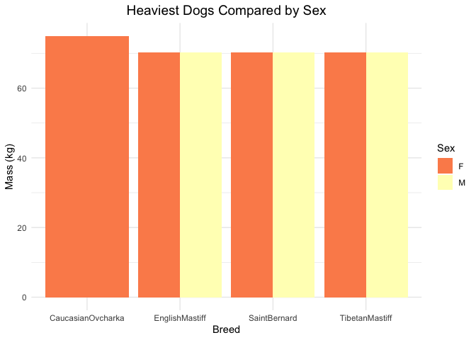
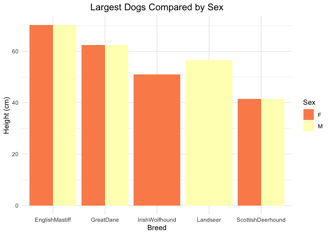
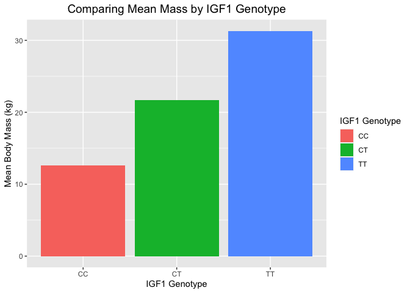
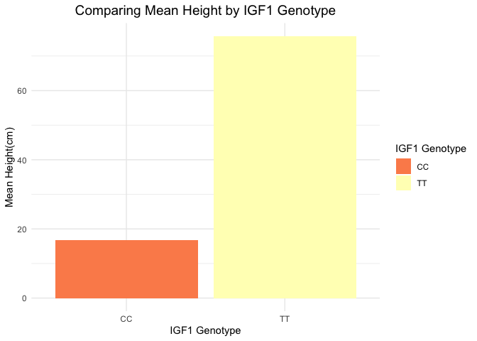
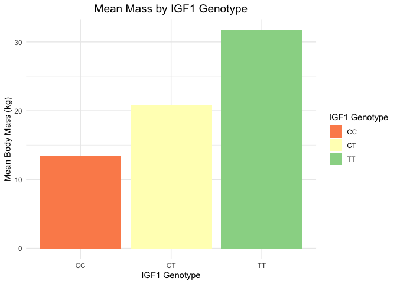
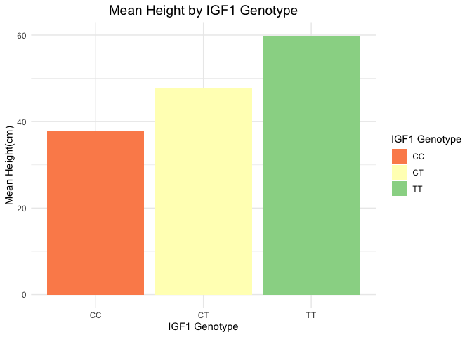
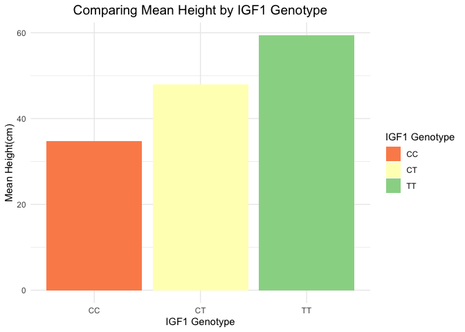
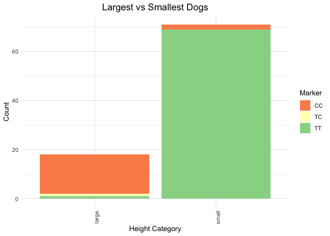

## Loading the Libraries


```r
library(tidyverse)
```

```
## ── Attaching core tidyverse packages ──────────────────────── tidyverse 2.0.0 ──
## ✔ dplyr     1.1.4     ✔ readr     2.1.5
## ✔ forcats   1.0.0     ✔ stringr   1.5.1
## ✔ ggplot2   3.4.4     ✔ tibble    3.2.1
## ✔ lubridate 1.9.3     ✔ tidyr     1.3.1
## ✔ purrr     1.0.2     
## ── Conflicts ────────────────────────────────────────── tidyverse_conflicts() ──
## ✖ dplyr::filter() masks stats::filter()
## ✖ dplyr::lag()    masks stats::lag()
## ℹ Use the conflicted package (<http://conflicted.r-lib.org/>) to force all conflicts to become errors
```

```r
library(janitor)
```

```
## 
## Attaching package: 'janitor'
## 
## The following objects are masked from 'package:stats':
## 
##     chisq.test, fisher.test
```

```r
library(naniar)
library(ggmap)
```

```
## ℹ Google's Terms of Service: <https://mapsplatform.google.com>
##   Stadia Maps' Terms of Service: <https://stadiamaps.com/terms-of-service/>
##   OpenStreetMap's Tile Usage Policy: <https://operations.osmfoundation.org/policies/tiles/>
## ℹ Please cite ggmap if you use it! Use `citation("ggmap")` for details.
```

```r
library(shiny)
library(shinydashboard)
```

```
## 
## Attaching package: 'shinydashboard'
## 
## The following object is masked from 'package:graphics':
## 
##     box
```

```r
library(shinythemes)
library(RColorBrewer)
```

## Loading the Data Sets  


```r
dog <- read_csv(file = "../../data/clean_dog_data.csv")
```

```
## Rows: 1298 Columns: 18
## ── Column specification ────────────────────────────────────────────────────────
## Delimiter: ","
## chr (16): breed, sex, longitude, latitude, igf1_as_genotype, used_for_gwas, ...
## dbl  (2): body_mass_kg, height_cm
## 
## ℹ Use `spec()` to retrieve the full column specification for this data.
## ℹ Specify the column types or set `show_col_types = FALSE` to quiet this message.
```


```r
dog_long <- read_csv(file = "../../data/dog_long.csv")
```

```
## Rows: 1360 Columns: 11
## ── Column specification ────────────────────────────────────────────────────────
## Delimiter: ","
## chr (7): breed, sex, igf1_as_genotype, used_for_gwas, height_category, chr_l...
## dbl (4): body_mass_kg, height_cm, longitude, latitude
## 
## ℹ Use `spec()` to retrieve the full column specification for this data.
## ℹ Specify the column types or set `show_col_types = FALSE` to quiet this message.
```


```r
dog_gwas <- read_csv("../../data/dog_gwas.csv")
```

```
## Rows: 456 Columns: 18
## ── Column specification ────────────────────────────────────────────────────────
## Delimiter: ","
## chr (16): breed, sex, longitude, latitude, igf1_as_genotype, used_for_gwas, ...
## dbl  (2): body_mass_kg, height_cm
## 
## ℹ Use `spec()` to retrieve the full column specification for this data.
## ℹ Specify the column types or set `show_col_types = FALSE` to quiet this message.
```

## How many distinct breeds of dog are included within this data set?   


```r
n_distinct(dog$breed)
```

```
## [1] 269
```

## How many distinct data points are included (in terms of body weight and height) within this data set?   


```r
n_distinct(dog$body_mass_kg)
```

```
## [1] 142
```


```r
n_distinct(dog$height_cm)
```

```
## [1] 104
```

This could indicate some strange method or issue in the collection of data. However, since there is no information in the paper about the method of data collection for these variables, we are assuming that the data is correct.   

## Which breed of dog has the largest body mass?    


```r
dog %>% 
       group_by(breed) %>% 
        summarize(mean_body_weight = mean(body_mass_kg, na.rm = T)) %>% 
        filter(mean_body_weight != "NaN") %>% 
        arrange(desc(mean_body_weight))
```

```
## # A tibble: 207 × 2
##    breed                   mean_body_weight
##    <chr>                              <dbl>
##  1 CaucasianOvcharka                   75  
##  2 Boerboel                            73  
##  3 EnglishMastiff                      70.3
##  4 SaintBernard                        70.3
##  5 TibetanMastiff                      70.3
##  6 TosaInu                             68  
##  7 GreatDane                           62.4
##  8 GreaterSwissMountainDog             60  
##  9 NeapolitanMastiff                   60  
## 10 DogueDeBordeaux                     59.5
## # ℹ 197 more rows
```

## Which breed of dog has the largest height?    


```r
dog %>% 
       group_by(breed) %>% 
        summarize(mean_height = mean(height_cm, na.rm = T)) %>% 
        filter(mean_height != "NaN") %>% 
        arrange(desc(mean_height))
```

```
## # A tibble: 201 × 2
##    breed                mean_height
##    <chr>                      <dbl>
##  1 GreatDane                   78.7
##  2 IrishWolfhound              78.7
##  3 Akbash                      77.5
##  4 AnatolianShepherdDog        76  
##  5 ScottishDeerhound           74.9
##  6 Landseer                    73.5
##  7 EnglishMastiff              73  
##  8 Leonberger                  72.5
##  9 GreatPyrenees               71.8
## 10 Greyhound                   71.8
## # ℹ 191 more rows
```

## Which breed of dog has the smallest height?    


```r
dog %>% 
       group_by(breed) %>% 
        summarize(mean_height = mean(height_cm, na.rm = T)) %>% 
        filter(mean_height != "NaN") %>% 
        arrange(mean_height)
```

```
## # A tibble: 201 × 2
##    breed            mean_height
##    <chr>                  <dbl>
##  1 YorkshireTerrier        16.5
##  2 BrusselsGriffon         17.8
##  3 Chihuahua               19  
##  4 Pekingese               19  
##  5 Pomeranian              20  
##  6 Maltese                 22.5
##  7 BiewerTerrier           22.9
##  8 JapaneseChin            23.5
##  9 NorfolkTerrier          24  
## 10 Papillon                24  
## # ℹ 191 more rows
```

## How do the top 5 heaviest dogs compare by sex?       


```r
dog %>% 
        filter(sex != "NA") %>% 
        unite(breed_sex, "breed", "sex", sep = " ") %>% 
        filter(str_detect(.$breed_sex, "CaucasianOvcharka") | str_detect(.$breed_sex, "Boerboel") | str_detect(.$breed_sex, "EnglishMastiff") | str_detect(.$breed_sex, "SaintBernard") | str_detect(.$breed_sex, "TibetanMastiff")) %>% 
        group_by(breed_sex) %>% 
        summarize(mean_body_mass = mean(body_mass_kg, na.rm = T)) %>% 
        separate(breed_sex, into = c("breed", "sex"), sep = " ") %>% 
        ggplot(aes(x = breed, y = mean_body_mass, fill = sex)) +
        geom_col(position = "dodge") +
        scale_fill_brewer(palette = "Spectral") +
        theme_minimal() +
        labs(title = "Heaviest Dogs Compared by Sex",
             x = "Breed",
             y = "Mass (kg)",
             fill = "Sex") +
        theme(plot.title = element_text(size = rel(1.3), hjust = 0.5))
```

<!-- -->

It seems that this dataset has strange or incomplete measurements for mass, so it may be more worthwhile to focus on height!   

## How do the top 5 largest dogs compare by sex?       


```r
dog %>% 
        filter(sex != "NA") %>% 
        unite(breed_sex, "breed", "sex", sep = " ") %>% 
        filter(str_detect(.$breed_sex, "GreatDane") | str_detect(.$breed_sex, "IrishWolfhound") | str_detect(.$breed_sex, "Landseer") | str_detect(.$breed_sex, "EnglishMastiff") | str_detect(.$breed_sex, "ScottishDeerhound")) %>% 
        group_by(breed_sex) %>% 
        summarize(mean_body_mass = mean(body_mass_kg, na.rm = T)) %>% 
        separate(breed_sex, into = c("breed", "sex"), sep = " ") %>% 
        ggplot(aes(x = breed, y = mean_body_mass, fill = sex)) +
        geom_col(position = "dodge") +
        scale_fill_brewer(palette = "Spectral") +
        theme_minimal() +
        labs(title = "Largest Dogs Compared by Sex",
             x = "Breed",
             y = "Height (cm)",
             fill = "Sex") +
        theme(plot.title = element_text(size = rel(1.3), hjust = 0.5))
```

<!-- -->

This appears to show that there are also shows that there a lot of missing values in this dataset!   

## Removing NA's from Sex Variable for Future Analyses   


```r
dog <- dog %>% 
        filter(sex != "NA")
```

## Identifying Mean Body Mass and Mean Height by IGF1 Genotype  


```r
dog %>%
  group_by(igf1_as_genotype)%>%
  summarise(meanbodymass = mean(body_mass_kg, na.rm=T), meanheight=mean(height_cm, na.rm=T))
```

```
## # A tibble: 3 × 3
##   igf1_as_genotype meanbodymass meanheight
##   <chr>                   <dbl>      <dbl>
## 1 CC                       12.6       34.8
## 2 CT                       21.7       48.0
## 3 TT                       31.3       59.5
```


```r
dog %>%
  group_by(igf1_as_genotype) %>%
  summarise(meanbodymass = mean(body_mass_kg, na.rm=T)) %>%
  ggplot(aes(x = igf1_as_genotype, y = meanbodymass, fill = igf1_as_genotype)) +
  geom_col() +
  scale_fill_brewer(palette = "Spectral") +
  theme_minimal() +
  labs(title = "Comparing Mean Mass by IGF1 Genotype", 
       x = "IGF1 Genotype", 
       y= "Mean Body Mass (kg)",
       fill = "IGF1 Genotype")+
  theme(plot.title = element_text(size = rel(1.3), hjust = 0.5))
```

<!-- -->


```r
dog %>%
  group_by(igf1_as_genotype) %>%
  summarise(meanheight = mean(height_cm, na.rm=T)) %>%
  ggplot(aes(x = igf1_as_genotype, y = meanheight, fill = igf1_as_genotype))+
  geom_col() +
  scale_fill_brewer(palette = "Spectral") +
  theme_minimal() +
  labs(title = "Comparing Mean Height by IGF1 Genotype", 
       x = "IGF1 Genotype", 
       y = "Mean Height(cm)",
       fill = "IGF1 Genotype") +
  theme(plot.title = element_text(size = rel(1.3), hjust = 0.5))
```

<!-- -->

#### These results indicate a strong correlation between body size and the IGF1 genotype -  where dogs with CC are smaller on average than those with TT.   

## IGF1 Genotype for samples used in the GWAS    


```r
dog_gwas %>%
  group_by(igf1_as_genotype)%>%
  summarise(meanbodymass=mean(body_mass_kg, na.rm=T), meanheight=mean(height_cm, na.rm=T))
```

```
## # A tibble: 3 × 3
##   igf1_as_genotype meanbodymass meanheight
##   <chr>                   <dbl>      <dbl>
## 1 CC                       13.4       37.8
## 2 CT                       20.8       47.8
## 3 TT                       31.7       59.9
```


```r
dog_gwas %>%
  group_by(igf1_as_genotype) %>%
  summarise(meanbodymass = mean(body_mass_kg, na.rm=T)) %>%
  ggplot(aes(x = igf1_as_genotype, y = meanbodymass, fill = igf1_as_genotype)) +
  geom_col() +
  scale_fill_brewer(palette = "Spectral") +
  theme_minimal() +
  labs(title = "Mean Mass by IGF1 Genotype", 
       x = "IGF1 Genotype", 
       y= "Mean Body Mass (kg)",
       fill = "IGF1 Genotype") +
  theme(plot.title = element_text(size = rel(1.3), hjust = 0.5))
```

<!-- -->


```r
dog_gwas %>%
  group_by(igf1_as_genotype) %>%
  summarise(meanheight=mean(height_cm, na.rm=T)) %>%
  ggplot(aes(x = igf1_as_genotype, y = meanheight, fill = igf1_as_genotype)) +
  geom_col() +
  scale_fill_brewer(palette = "Spectral") +
  theme_minimal() +
  labs(title = "Mean Height by IGF1 Genotype", 
       x = "IGF1 Genotype", 
       y = "Mean Height(cm)",
       fill = "IGF1 Genotype")+
  theme(plot.title = element_text(size = rel(1.3), hjust = 0.5))
```

<!-- -->

## Comparing Top Tallest Dogs versus Top Smallest Dogs by Alleles in Locations that are Important in Determining Dog Body Size    

Test Visual:   


```r
dog_long %>%
        filter(breed == "GreatDane") %>% 
        ggplot(aes(x = chr_location, fill = marker_alleles_data)) +
        geom_bar() +
        scale_fill_brewer(palette = "Spectral") +
        theme_minimal() +
        labs(title = "Great Dane Comparing Alleles at 10 Positions Associated with Size",
             x = "Position",
             y = "Count",
             fill = "Marker") +
        theme(plot.title = element_text(size = rel(1.3), hjust = 0.5), axis.text.x = element_text(angle = 60, hjust = 1)) 
```

<!-- -->


```r
ui <- dashboardPage(
  dashboardHeader(title = "Dogs and Markers"),
  dashboardSidebar(disable=T),
  dashboardBody(
          
          fluidRow(
  box(title = "Plot Options", width = 3,
  radioButtons("x", "Select Height Category", choices = c("small", "large"), selected = "large"),
  ), #closes the first box
  box(title = "Dog Size and Markers", width = 8,
  plotOutput("plot", width = "500px", height = "400px")
  
  ) #closes the second box
  ) #closes the row
  ) #closes the dashboard body
) #closes the ui 

server <- function(input, output, session) {
        
        session$onSessionEnded(stopApp)
        
        output$plot <- renderPlot ({
          
        dog %>%
        mutate(height_category = case_when(height_cm <= 20.0 ~ "small",
                                           height_cm > 20.0 & height_cm < 73.0 ~ "medium",
                                           height_cm >= 73.0 ~ "large")) %>% 
        filter(height_category == "small" | height_category == "large") %>% 
        pivot_longer(cols = starts_with("chr15"),
                     names_to = "chr_location",
                     values_to = "marker_alleles_data") %>% 
        filter(height_category == input$x) %>% 
        ggplot(aes(x = chr_location, fill = marker_alleles_data)) +
        geom_bar() +
        scale_fill_brewer(palette = "Spectral") +
        theme_minimal() +
        facet_wrap(breed~.) +
        labs(title = "Dogs Compared by Alleles at 10 Positions",
             x = "Position",
             y = "Count",
             fill = "Marker") +
        theme(plot.title = element_text(size = rel(1.3), hjust = 0.5), axis.text.x = element_text(angle = 90, hjust = 1))
        
})
        
}

shinyApp(ui, server)
```

```{=html}
<div style="width: 100% ; height: 400px ; text-align: center; box-sizing: border-box; -moz-box-sizing: border-box; -webkit-box-sizing: border-box;" class="muted well">Shiny applications not supported in static R Markdown documents</div>
```

## Comparing Alleles in Small vs Large Dogs   

Test Visual:   


```r
dog_long %>%
        filter(chr_location == "chr15_41216098") %>% 
        ggplot(aes(x = height_category, fill = marker_alleles_data)) +
        geom_bar() +
        scale_fill_brewer(palette = "Spectral") +
        theme_minimal() +
        labs(title = "Largest vs Smallest Dogs",
             x = "Height Category",
             y = "Count",
             fill = "Marker") +
        theme(plot.title = element_text(size = rel(1.3), hjust = 0.5), axis.text.x = element_text(angle = 90, hjust = 1))
```

<!-- -->


```r
ui <- dashboardPage(
  dashboardHeader(title = "Dogs and Markers"),
  dashboardSidebar(disable=T),
  dashboardBody(
          
          fluidRow(
  box(title = "Plot Options", width = 3,
  selectInput("x", "Select Chromosome Position", choices = unique(dog_long$chr_location), hr()),
  ), #closes the first box
  box(title = "Dog Size and Markers", width = 8,
  plotOutput("plot", width = "500px", height = "400px")
  
  ) #closes the second box
  ) #closes the row
  ) #closes the dashboard body
) #closes the ui 

server <- function(input, output, session) {
        
        session$onSessionEnded(stopApp)
        
        output$plot <- renderPlot ({
          
        dog_long %>%
        filter(chr_location == input$x) %>% 
        ggplot(aes(x = height_category, fill = marker_alleles_data)) +
        geom_bar() +
        scale_fill_brewer(palette = "Spectral") +
        theme_minimal() +
        labs(title = "Largest vs Smallest Dogs",
             x = "Height Category",
             y = "Count",
             fill = "Marker") +
        theme(plot.title = element_text(size = rel(1.3), hjust = 0.5), axis.text.x = element_text(angle = 90, hjust = 1))
        
})
        
}

shinyApp(ui, server)
```

```{=html}
<div style="width: 100% ; height: 400px ; text-align: center; box-sizing: border-box; -moz-box-sizing: border-box; -webkit-box-sizing: border-box;" class="muted well">Shiny applications not supported in static R Markdown documents</div>
```

#### These results show a clear association between the alleles at these positions and the size of the dogs.  

## Repeating the above for the dogs actually used in the GWAS, which results in much cleaner data    


```r
ui <- dashboardPage(
  dashboardHeader(title = "GWAS Dogs and Markers"),
  dashboardSidebar(disable=T),
  dashboardBody(
          
          fluidRow(
  box(title = "Plot Options", width = 3,
  radioButtons("x", "Select Height Category", choices = c("small", "large"), selected = "large"),
  ), #closes the first box
  box(title = "Dog Size and Markers", width = 8,
  plotOutput("plot", width = "600px", height = "500px")
  
  ) #closes the second box
  ) #closes the row
  ) #closes the dashboard body
) #closes the ui 

server <- function(input, output, session) {
        
        session$onSessionEnded(stopApp)
        
        output$plot <- renderPlot ({
          
        dog_gwas_pivoted %>%
        filter(height_category == "small" | height_category == "large") %>% 
        filter(height_category == input$x) %>% 
        ggplot(aes(x = chr_location, fill = marker_alleles_data)) +
        geom_bar() +
        facet_grid(breed~.) +
        scale_fill_brewer(palette = "Spectral") +
        theme_minimal() +
        labs(title = "Dogs Compared by Alleles at 10 Positions",
             x = "Position",
             y = "Count",
             fill = "Marker") +
        theme(plot.title = element_text(size = rel(1.3), hjust = 0.5), axis.text.x = element_text(angle = 90, hjust = 1))
        
})
        
}

shinyApp(ui, server)
```

```{=html}
<div style="width: 100% ; height: 400px ; text-align: center; box-sizing: border-box; -moz-box-sizing: border-box; -webkit-box-sizing: border-box;" class="muted well">Shiny applications not supported in static R Markdown documents</div>
```


```r
dog_gwas_pivoted <- dog_gwas %>% 
        mutate(height_category = case_when(height_cm <= 20.0 ~ "small",
                                           height_cm > 20.0 & height_cm < 73.0 ~ "medium",
                                           height_cm >= 73.0 ~ "large")) %>% 
        filter(height_category == "small" | height_category == "large") %>% 
        pivot_longer(cols = starts_with("chr15"),
                     names_to = "chr_location",
                     values_to = "marker_alleles_data")
```


```r
summary(dog_gwas$body_mass_kg)
```

```
##    Min. 1st Qu.  Median    Mean 3rd Qu.    Max. 
##    1.80   10.00   21.50   22.14   30.11   75.00
```


```r
dog_gwas_mass_pivoted <- dog_gwas %>% 
        mutate(mass_category = case_when(body_mass_kg <= 10.00 ~ "small",
                                           body_mass_kg > 10.00 & body_mass_kg < 30.11 ~ "medium",
                                           body_mass_kg >= 30.11 ~ "large")) %>% 
        filter(mass_category == "small" | mass_category == "large") %>% 
        pivot_longer(cols = starts_with("chr15"),
                     names_to = "chr_location",
                     values_to = "marker_alleles_data")
```


```r
ui <- dashboardPage(
  dashboardHeader(title = "Dogs and Markers"),
  dashboardSidebar(disable = T),
  dashboardBody(
          
          fluidRow(
  box(title = "Plot Options", width = 3,
  selectInput("x", "Select Chromosome Position", choices = unique(dog_gwas_pivoted$chr_location), hr()),
  selectInput("y", "Select Sex", choices = c("M", "F"), selected = "M")
  ), #closes the first box
  box(title = "Dog Size and Markers", width = 8,
  plotOutput("plot", width = "500px", height = "400px")
  
  ) #closes the second box
  ) #closes the row
  ) #closes the dashboard body
) #closes the ui 

server <- function(input, output, session) {
        
        session$onSessionEnded(stopApp)
        
        output$plot <- renderPlot ({
          
        dog_gwas_pivoted %>%
        filter(sex == input$y) %>%
        filter(chr_location == input$x) %>% 
        ggplot(aes(x = height_category, fill = marker_alleles_data)) +
        geom_bar() +
        scale_fill_brewer(palette = "Spectral") +
        theme_minimal() +
        labs(title = "Largest vs Smallest Dogs",
             x = "Height Category",
             y = "Count",
             fill = "Marker") +
        theme(plot.title = element_text(size = rel(1.3), hjust = 0.5), axis.text.x = element_text(angle = 90, hjust = 1))
        
})
        
}

shinyApp(ui, server)
```

```{=html}
<div style="width: 100% ; height: 400px ; text-align: center; box-sizing: border-box; -moz-box-sizing: border-box; -webkit-box-sizing: border-box;" class="muted well">Shiny applications not supported in static R Markdown documents</div>
```

## Creating a Shiny App with all the Visuals


```r
ui <- dashboardPage(skin = "yellow",
  dashboardHeader(title = "GWAS Dogs"),
  dashboardSidebar(disable = T),
  dashboardBody(
          fluidPage(
        theme = shinytheme("sandstone"),
        tabsetPanel(
        tabPanel("Markers",
                fluidRow(
                box(title = "Plot Options", width = 3,
                selectInput("x", "Select Chromosome Position", choices = unique(dog_gwas_pivoted$chr_location), hr()),
                selectInput("y", "Select Sex", choices = c("M", "F"), selected = "M")
                ), #closes the first box
                box(title = "Dog Height and Markers", width = 8,
                plotOutput("plot1")
                ) #closes the second box
                ), #closes the first fluid row
                fluidRow(
                box(title = "Plot Options", width = 3,
                selectInput("x", "Select Chromosome Position", choices = unique(dog_gwas_pivoted$chr_location), hr()),
                selectInput("y", "Select Sex", choices = c("M", "F"), selected = "M")
                ), #closes the box
                box(title = "Dog Weight and Markers", width = 8,
                plotOutput("plot2")
                ) #closes the box
                ) #closes the fluid row
                ),  #closes the tab panel item
        tabPanel("IGF1 Genotype",
             fluidRow(
                box(title = "Mean Mass by IGF1 Genotype", width = 10,
                    plotOutput("plot3")
                    ), #closes the box
                box(title = "Table of Mean Mass by IGF1 Genotype", width = 10,
                    tableOutput("table1")
                ), #closes the box
              ), #closes the fluidrow
              fluidRow(
                box(title = "Mean Height by IGF1 Genotype", width = 10,
                    plotOutput("plot4")
                ), #closes the box
                box(title = "Table of Mean Height by IGF1 Genotype", width = 10,
                    tableOutput("table2")
  ) #closes the box
  ) #closes the fluid row
  ) #closes the tab panel item
  ) #closes the tabset panel
) #closes fluid page
) #closes the dashboard body
) #closes the ui
server <- function(input, output, session) {
        output$plot1 <- renderPlot({ 
                dog_gwas_pivoted %>%
                filter(sex == input$y) %>%
                filter(chr_location == input$x) %>% 
                ggplot(aes(x = height_category, fill = marker_alleles_data)) +
                geom_bar() +
                scale_fill_brewer(palette = "Spectral") +
                theme_minimal() +
                labs(title = "Largest vs Smallest Dogs",
                        x = "Height Category",
                        y = "Count",
                        fill = "Marker") +
                theme(plot.title = element_text(size = rel(1.3), hjust = 0.5), axis.text.x = element_text(angle = 90, hjust = 1))
        }) #closes the render plot
        output$plot2 <- renderPlot({ 
                dog_gwas_mass_pivoted %>%
                filter(sex == input$y) %>%
                filter(chr_location == input$x) %>% 
                ggplot(aes(x = mass_category, fill = marker_alleles_data)) +
                geom_bar() +
                scale_fill_brewer(palette = "Spectral") +
                theme_minimal() +
                labs(title = "Largest vs Smallest Dogs",
                x = "Mass Category",
                y = "Count",
                fill = "Marker") +
                theme(plot.title = element_text(size = rel(1.3), hjust = 0.5), axis.text.x = element_text(angle = 90, hjust = 1))
        }) #closes the render plot
        output$table1 <- renderTable({
                dog_gwas %>%
                group_by(igf1_as_genotype) %>%
                summarise(mean_body_mass = mean(body_mass_kg, na.rm=T), mean_height = mean(height_cm, na.rm=T))
        }) #closes the render table
        output$table1 <- renderTable({
                dog_gwas %>%
                group_by(igf1_as_genotype) %>%
                summarise(mean_body_mass = mean(body_mass_kg, na.rm=T)) %>% 
                rename("Mean Mass (kg)" = mean_body_mass, "IGF1 Genotype" = igf1_as_genotype)
        }) #closes the render table
        output$plot3 <- renderPlot({
                dog_gwas %>%
                group_by(igf1_as_genotype) %>%
                summarise(meanbodymass = mean(body_mass_kg, na.rm=T)) %>%
                ggplot(aes(x = igf1_as_genotype, y = meanbodymass, fill = igf1_as_genotype)) +
                geom_col() +
                scale_fill_brewer(palette = "Spectral") +
                theme_minimal() +
                labs(title = "Mean Mass by IGF1 Genotype", 
                        x = "IGF1 Genotype", 
                        y= "Mean Body Mass (kg)",
                        fill = "IGF1 Genotype") +
                theme(plot.title = element_text(size = rel(1.3), hjust = 0.5))
        }) #closes the render plot
        output$table2 <- renderTable({
                dog_gwas %>%
                group_by(igf1_as_genotype) %>%
                summarise(mean_height = mean(height_cm, na.rm=T)) %>% 
                rename("Mean Height (cm)" = mean_height, "IGF1 Genotype" = igf1_as_genotype)
        }) #closes the render table
        output$plot4 <- renderPlot({
                dog_gwas %>%
                group_by(igf1_as_genotype) %>%
                summarise(meanheight = mean(height_cm, na.rm=T)) %>%
                ggplot(aes(x = igf1_as_genotype, y = meanheight, fill = igf1_as_genotype)) +
                geom_col() +
                scale_fill_brewer(palette = "Spectral") +
                theme_minimal() +
                labs(title = "Mean Height by IGF1 Genotype", 
                        x = "IGF1 Genotype", 
                        y = "Mean Height(cm)",
                        fill = "IGF1 Genotype")+
                theme(plot.title = element_text(size = rel(1.3), hjust = 0.5))
        }) #closes the render plot
session$onSessionEnded(stopApp)
}
 shinyApp(ui, server)               
```

```{=html}
<div style="width: 100% ; height: 400px ; text-align: center; box-sizing: border-box; -moz-box-sizing: border-box; -webkit-box-sizing: border-box;" class="muted well">Shiny applications not supported in static R Markdown documents</div>
```

## Creating an Interactive Map    


```r
#install.packages("mapview")
```


```r
library(mapview)
```


```r
#install.packages(sf)
```


```r
library(sf)
```

```
## Linking to GEOS 3.11.0, GDAL 3.5.3, PROJ 9.1.0; sf_use_s2() is TRUE
```


```r
dog_geographic_distribution <- dog_gwas %>% 
        filter(longitude != "NA" | latitude != "NA") %>%
        filter(longitude != "NA" | latitude != "NA") %>%
        filter(longitude != "#N/A" | latitude != "#N/A") %>%
        mutate(height_category = case_when(height_cm <= 20.0 ~ "small",
                                           height_cm > 20.0 & height_cm < 73.0 ~ "medium",
                                           height_cm >= 70.0 ~ "large")) %>%
        filter(height_category != "NA") %>%
        st_as_sf(coords = c("longitude", "latitude"), crs = 4326)
```


```r
mapview(dog_geographic_distribution, zcol = "height_category", legend = TRUE, map.types = "CartoDB.Positron") 
```

```
## Warning in sf::st_is_longlat(x): bounding box has potentially an invalid value
## range for longlat data
```

```{=html}
<div class="leaflet html-widget html-fill-item" id="htmlwidget-95afe9067c4e3036f539" style="width:672px;height:480px;"></div>
<script type="application/json" data-for="htmlwidget-95afe9067c4e3036f539">{"x":{"options":{"minZoom":1,"maxZoom":52,"crs":{"crsClass":"L.CRS.EPSG3857","code":null,"proj4def":null,"projectedBounds":null,"options":{}},"preferCanvas":false,"bounceAtZoomLimits":false,"maxBounds":[[[-90,-370]],[[90,370]]]},"calls":[{"method":"addProviderTiles","args":["CartoDB.Positron","CartoDB.Positron","CartoDB.Positron",{"errorTileUrl":"","noWrap":false,"detectRetina":false,"pane":"tilePane"}]},{"method":"createMapPane","args":["point",440]},{"method":"addCircleMarkers","args":[[13.573,69.233,69.233,-1.048,-1.048,-1.048,-84.38798199999999,-154.548,-154.548,-154.548,67.63800000000001,67.63800000000001,67.63800000000001,67.63800000000001,-71.05888,-71.05888,-71.05888,-71.05888,-89.61547899999999,-89.61547899999999,-89.61547899999999,151.20699,151.20699,151.20699,151.20699,-1.766148,-1.766148,-1.766148,145.17334,145.17334,32.231,32.231,32.231,-0.119,-0.119,-0.119,-0.119,-3.605,-3.605,-3.605,-3.605,1.489012,1.489012,-1.909,-1.909,4.477,4.477,4.477,4.361,4.361,4.361,4.361,4.507778,4.507778,4.507778,4.507778,9.426270000000001,2.526,2.526,2.526,7.444608,8.406000000000001,8.406000000000001,8.406000000000001,8.406000000000001,2.339,2.339,10.451526,10.451526,10.451526,10.451526,37.87674,-0.119,-2.899,-2.899,-2.899,-2.899,-2.152,-2.152,-2.152,-2.152,30.31,-71.05888,3.719,3.719,3.719,3.719,11.643,11.643,11.643,-80.672607,-80.672607,0.242,0.242,-2.831,-2.831,4.35171,4.35171,4.35171,-0.119,-0.119,-0.119,-1.25,-1.25,-1.25,-1.25,-5.105,-5.105,-5.105,-5.105,15.803,15.803,15.803,44.827096,-1.25,-1.25,14.4378,14.4378,-76.526642,-106.122437,-106.122437,-106.122437,106.168,106.168,113.259,113.259,113.259,-71.383667,-71.383667,-71.383667,108.957,108.957,108.957,108.957,14.155,14.155,14.155,-1.47,-1.47,-1.47,-1.47,-4.142657,-4.142657,-4.142657,-4.142657,-0.593262,-0.593262,-0.593262,-0.593262,-0.119,-0.119,-0.119,43.669,43.669,-0.137163,17.731934,17.731934,17.731934,17.731934,106.45752,-1.192017,-1.192017,-0.815735,-0.815735,-0.815735,-0.815735,-0.119,-0.119,-0.119,-0.119,8.064749000000001,8.064749000000001,8.064749000000001,-1.25,-1.25,-1.25,-1.25,25.3125,23.818359,-0.119,-0.119,-1.25,-1.25,-1.25,13.404954,13.573,13.573,13.573,13.573,8.41,8.41,8.41,8.41,8.41,8.942871,8.942871,8.942871,-3.186,-3.186,-3.186,-3.186,-3.318485,-3.318485,13.573,13.573,13.573,13.573,7.443,7.443,0.633,-45.225,-0.119,-0.119,-0.119,-0.119,-82.089844,-82.089844,9.667968999999999,1.431,1.431,1.431,-21.728,-21.728,-6.345,-6.345,-6.145,-6.145,-6.145,-6.245,-6.245,-6.245,-6.245,-6.345,12.498,12.498,-1.25,-1.25,-1.25,-1.25,17.050781,139.487,139.487,126.26,4.304,-9.696,8.020959,-2.15332,-2.15332,-2.15332,-2.15332,12.198,12.198,12.198,12.198,29.003906,9.009570999999999,9.009570999999999,91.297,91.297,91.297,2.452222,14.427,14.427,14.427,14.427,14.172363,11.643,11.643,-56.184082,-56.184082,-1.917,-1.917,11.096,11.096,11.096,11.096,11.096,11.096,11.096,11.096,11.096,-1.917,-1.917,-1.917,-63.69873,-63.69873,-1.25,-1.25,-1.25,-1.25,-1.25,-1.25,11.344,11.344,116.398,-75.585938,-1.36,-1.36,-1.36,14.427,14.427,104.007568,104.007568,104.007568,14.57,14.57,-9.148999999999999,-9.148999999999999,-9.148999999999999,-9.148999999999999,108.808594,108.808594,64.6875,29.970703,29.970703,29.970703,29.970703,8.642200000000001,8.642200000000001,8.642200000000001,8.642200000000001,7.755,7.755,38.894,38.894,38.894,3.719,3.719,-3.186,-3.186,-3.186,-1.193,-1.193,-1.193,-1.193,139.487,139.487,139.487,116.407,133.637695,151.969,151.969,151.969,41.851,41.851,41.851,7.624254,7.624254,-1.208496,-1.208496,-1.208496,-8.449,-8.449,-8.449,-3.47168,-4.614258,7.766,7.766,7.766,7.766,6.196289,-1.25,-1.25,-1.25,11.643,11.643,11.643,-0.834961,-0.834961,-0.834961,20.566406,12.524414,91.297,91.297,91.297,91.297,91.297,91.297,91.297,-1.308496,-1.308496,-1.308496,-1.308496,-84.77050800000001,-84.77050800000001,19.164,19.164,19.164,11.323544,11.323544,-3.405762,-3.405762,-3.2,-3.2,-3.2,-3.2,-1.25,-1.25,-1.25,-1.25,-1.25,8.41,8.41,-1.917,-1.917,-1.917,-1.917],[52.505,34.552,34.552,53.945,53.945,53.945,33.748995,66.32299999999999,66.32299999999999,66.32299999999999,25.065,25.065,25.065,25.065,42.360082,42.360082,42.360082,42.360082,44.86755,44.86755,44.86755,-33.867487,-33.867487,-33.867487,-33.867487,43.359399,43.359399,43.359399,-38.039439,-38.039439,15.443,15.443,15.443,51.512,51.512,51.512,51.512,55.069,55.069,55.069,55.069,48.443854,48.443854,55.31,55.31,51.026,51.026,51.026,50.847,50.847,50.847,50.847,50.825926,50.825926,50.825926,50.825926,49.660517,49.666,49.666,49.666,46.947922,46.821,46.821,46.821,46.821,48.853,48.853,51.165691,51.165691,51.165691,51.165691,55.896491,51.512,54.879,54.879,54.879,54.879,55.478,55.478,55.478,55.478,59.918,42.360082,51.047,51.047,51.047,51.047,48.133,48.133,48.133,33.426857,33.426857,45.738,45.738,48.5,48.5,50.85034,50.85034,50.85034,51.512,51.512,51.512,51.751,51.751,51.751,51.751,56.819,56.819,56.819,56.819,40.641,40.641,40.641,41.715138,51.751,51.751,50.075538,50.075538,38.672109,28.591757,28.591757,28.591757,11.805,11.805,23.553917,23.553917,23.553917,43.82462,43.82462,43.82462,34.328,34.328,34.328,34.328,37.587,37.587,37.587,53.38,53.38,53.38,53.38,50.375456,50.375456,50.375456,50.375456,51.747439,51.747439,51.747439,51.747439,51.512,51.512,51.512,-23.354,-23.354,50.82253,42.738944,42.738944,42.738944,42.738944,52.609719,51.827291,51.827291,51.459997,51.459997,51.459997,51.459997,51.512,51.512,51.512,51.512,46.991741,46.991741,46.991741,51.751,51.751,51.751,51.751,60.532968,62.17576,51.512,51.512,51.751,51.751,51.751,52.520007,52.505,52.505,52.505,52.505,50.5167,50.5167,50.5167,50.5167,50.5167,48.483846,48.483846,48.483846,55.951,55.951,55.951,55.951,57.649454,57.649454,52.505,52.505,52.505,52.505,46.927,46.927,42.822,61.166,51.512,51.512,51.512,51.512,22.411029,22.411029,50.555325,38.912,38.912,38.912,64.111,64.111,53.146,53.246,53.346,53.346,53.346,53.346,53.346,53.346,53.346,53.346,41.896,41.896,51.751,51.751,51.751,51.751,59.299552,35.888,35.888,34.457597,52.067,52.255,50.883849,50.816348,50.816348,50.816348,50.816348,44.419,44.419,44.419,44.419,68.12248200000001,48.796045,48.796045,29.662,29.662,29.662,48.856614,35.91,35.91,35.91,35.91,42.256984,48.133,48.133,48.716337,48.716337,52.467,52.467,61.951,59.951,59.951,59.951,59.951,60.951,60.951,60.951,60.951,52.467,52.467,52.467,44.88312,44.88312,51.751,51.751,51.751,51.751,51.751,51.751,44.497,44.497,39.916,-9.730714000000001,46.648,46.648,46.648,35.91,35.91,10.237897,10.237897,10.237897,53.415,53.415,38.72,38.72,38.72,38.72,35.995785,35.995785,47.368594,-18.989415,-18.989415,-18.989415,-18.989415,48.1697,48.1697,48.1697,48.1697,46.015,46.015,31.748,31.748,31.748,51.047,51.047,55.951,55.951,55.951,60.139,60.139,60.139,60.139,35.888,35.888,35.888,39.875,33.568861,64.393,64.393,64.393,9.597,9.597,9.597,51.960594,51.960594,52.708011,52.708011,52.708011,51.922,51.922,51.922,39.867588,37.151561,45.048,45.048,45.048,45.048,52.742943,51.751,51.751,51.751,48.133,48.133,48.133,50.885709,50.885709,50.885709,67.403266,57.604221,29.662,29.662,29.662,29.662,29.662,29.662,29.662,52.708011,52.708011,52.708011,52.708011,37.466139,37.466139,47.497,47.497,47.497,50.979493,50.979493,51.500194,51.500194,55.95,55.95,55.95,55.95,51.751,51.751,51.751,51.751,51.751,50.5167,50.5167,52.467,52.467,52.467,52.467],6,null,"dog_geographic_distribution - height_category",{"crs":{"crsClass":"L.CRS.EPSG3857","code":null,"proj4def":null,"projectedBounds":null,"options":{}},"pane":"point","stroke":true,"color":"#333333","weight":1,"opacity":[0.9,0.9,0.9,0.9,0.9,0.9,0.9,0.9,0.9,0.9,0.9,0.9,0.9,0.9,0.9,0.9,0.9,0.9,0.9,0.9,0.9,0.9,0.9,0.9,0.9,0.9,0.9,0.9,0.9,0.9,0.9,0.9,0.9,0.9,0.9,0.9,0.9,0.9,0.9,0.9,0.9,0.9,0.9,0.9,0.9,0.9,0.9,0.9,0.9,0.9,0.9,0.9,0.9,0.9,0.9,0.9,0.9,0.9,0.9,0.9,0.9,0.9,0.9,0.9,0.9,0.9,0.9,0.9,0.9,0.9,0.9,0.9,0.9,0.9,0.9,0.9,0.9,0.9,0.9,0.9,0.9,0.9,0.9,0.9,0.9,0.9,0.9,0.9,0.9,0.9,0.9,0.9,0.9,0.9,0.9,0.9,0.9,0.9,0.9,0.9,0.9,0.9,0.9,0.9,0.9,0.9,0.9,0.9,0.9,0.9,0.9,0.9,0.9,0.9,0.9,0.9,0.9,0.9,0.9,0.9,0.9,0.9,0.9,0.9,0.9,0.9,0.9,0.9,0.9,0.9,0.9,0.9,0.9,0.9,0.9,0.9,0.9,0.9,0.9,0.9,0.9,0.9,0.9,0.9,0.9,0.9,0.9,0.9,0.9,0.9,0.9,0.9,0.9,0.9,0.9,0.9,0.9,0.9,0.9,0.9,0.9,0.9,0.9,0.9,0.9,0.9,0.9,0.9,0.9,0.9,0.9,0.9,0.9,0.9,0.9,0.9,0.9,0.9,0.9,0.9,0.9,0.9,0.9,0.9,0.9,0.9,0.9,0.9,0.9,0.9,0.9,0.9,0.9,0.9,0.9,0.9,0.9,0.9,0.9,0.9,0.9,0.9,0.9,0.9,0.9,0.9,0.9,0.9,0.9,0.9,0.9,0.9,0.9,0.9,0.9,0.9,0.9,0.9,0.9,0.9,0.9,0.9,0.9,0.9,0.9,0.9,0.9,0.9,0.9,0.9,0.9,0.9,0.9,0.9,0.9,0.9,0.9,0.9,0.9,0.9,0.9,0.9,0.9,0.9,0.9,0.9,0.9,0.9,0.9,0.9,0.9,0.9,0.9,0.9,0.9,0.9,0.9,0.9,0.9,0.9,0.9,0.9,0.9,0.9,0.9,0.9,0.9,0.9,0.9,0.9,0.9,0.9,0.9,0.9,0.9,0.9,0.9,0.9,0.9,0.9,0.9,0.9,0.9,0.9,0.9,0.9,0.9,0.9,0.9,0.9,0.9,0.9,0.9,0.9,0.9,0.9,0.9,0.9,0.9,0.9,0.9,0.9,0.9,0.9,0.9,0.9,0.9,0.9,0.9,0.9,0.9,0.9,0.9,0.9,0.9,0.9,0.9,0.9,0.9,0.9,0.9,0.9,0.9,0.9,0.9,0.9,0.9,0.9,0.9,0.9,0.9,0.9,0.9,0.9,0.9,0.9,0.9,0.9,0.9,0.9,0.9,0.9,0.9,0.9,0.9,0.9,0.9,0.9,0.9,0.9,0.9,0.9,0.9,0.9,0.9,0.9,0.9,0.9,0.9,0.9,0.9,0.9,0.9,0.9,0.9,0.9,0.9,0.9,0.9,0.9,0.9,0.9,0.9,0.9,0.9,0.9,0.9,0.9,0.9,0.9,0.9,0.9,0.9,0.9,0.9,0.9,0.9,0.9,0.9,0.9,0.9,0.9,0.9,0.9,0.9,0.9,0.9,0.9,0.9,0.9,0.9,0.9,0.9,0.9,0.9,0.9,0.9],"fill":true,"fillColor":["#009B95","#009B95","#009B95","#009B95","#009B95","#009B95","#009B95","#009B95","#009B95","#009B95","#009B95","#009B95","#009B95","#009B95","#009B95","#009B95","#009B95","#009B95","#009B95","#009B95","#009B95","#009B95","#009B95","#009B95","#009B95","#009B95","#009B95","#009B95","#009B95","#009B95","#009B95","#009B95","#009B95","#009B95","#009B95","#009B95","#009B95","#009B95","#009B95","#009B95","#009B95","#009B95","#009B95","#009B95","#009B95","#009B95","#009B95","#009B95","#009B95","#009B95","#009B95","#009B95","#009B95","#009B95","#009B95","#009B95","#009B95","#009B95","#009B95","#009B95","#009B95","#009B95","#009B95","#009B95","#009B95","#009B95","#009B95","#009B95","#009B95","#009B95","#009B95","#009B95","#009B95","#009B95","#009B95","#009B95","#009B95","#009B95","#009B95","#009B95","#009B95","#009B95","#009B95","#009B95","#009B95","#009B95","#009B95","#009B95","#009B95","#009B95","#009B95","#009B95","#009B95","#009B95","#009B95","#009B95","#FDE333","#FDE333","#FDE333","#009B95","#009B95","#009B95","#009B95","#009B95","#009B95","#009B95","#009B95","#009B95","#009B95","#009B95","#009B95","#009B95","#009B95","#009B95","#009B95","#009B95","#009B95","#009B95","#009B95","#FDE333","#FDE333","#FDE333","#009B95","#009B95","#009B95","#009B95","#009B95","#009B95","#009B95","#009B95","#009B95","#009B95","#009B95","#009B95","#009B95","#009B95","#009B95","#009B95","#009B95","#009B95","#009B95","#009B95","#009B95","#009B95","#009B95","#009B95","#009B95","#009B95","#009B95","#009B95","#009B95","#009B95","#009B95","#009B95","#009B95","#009B95","#009B95","#009B95","#009B95","#009B95","#009B95","#009B95","#009B95","#009B95","#009B95","#009B95","#009B95","#009B95","#009B95","#009B95","#009B95","#009B95","#009B95","#009B95","#009B95","#009B95","#009B95","#009B95","#009B95","#009B95","#009B95","#009B95","#009B95","#009B95","#009B95","#009B95","#009B95","#009B95","#009B95","#009B95","#009B95","#009B95","#009B95","#009B95","#009B95","#009B95","#009B95","#009B95","#009B95","#009B95","#009B95","#009B95","#009B95","#4B0055","#4B0055","#4B0055","#4B0055","#009B95","#009B95","#009B95","#009B95","#009B95","#009B95","#009B95","#009B95","#009B95","#009B95","#009B95","#009B95","#009B95","#009B95","#009B95","#009B95","#009B95","#009B95","#009B95","#009B95","#009B95","#009B95","#009B95","#009B95","#009B95","#4B0055","#009B95","#009B95","#009B95","#009B95","#009B95","#009B95","#009B95","#009B95","#009B95","#009B95","#009B95","#009B95","#009B95","#009B95","#009B95","#009B95","#009B95","#009B95","#009B95","#009B95","#009B95","#009B95","#009B95","#009B95","#009B95","#009B95","#009B95","#009B95","#009B95","#009B95","#009B95","#009B95","#009B95","#009B95","#009B95","#009B95","#009B95","#009B95","#009B95","#009B95","#009B95","#009B95","#009B95","#009B95","#009B95","#009B95","#009B95","#009B95","#009B95","#009B95","#009B95","#009B95","#009B95","#009B95","#009B95","#009B95","#009B95","#009B95","#009B95","#009B95","#009B95","#FDE333","#009B95","#009B95","#009B95","#009B95","#009B95","#009B95","#009B95","#009B95","#009B95","#FDE333","#FDE333","#009B95","#009B95","#009B95","#009B95","#009B95","#009B95","#009B95","#009B95","#009B95","#009B95","#009B95","#009B95","#009B95","#009B95","#009B95","#009B95","#009B95","#009B95","#009B95","#009B95","#009B95","#009B95","#4B0055","#4B0055","#4B0055","#009B95","#009B95","#009B95","#009B95","#009B95","#009B95","#009B95","#009B95","#009B95","#009B95","#009B95","#009B95","#009B95","#009B95","#009B95","#009B95","#009B95","#009B95","#009B95","#009B95","#009B95","#009B95","#009B95","#009B95","#009B95","#009B95","#009B95","#009B95","#009B95","#009B95","#009B95","#009B95","#009B95","#009B95","#009B95","#009B95","#009B95","#009B95","#009B95","#009B95","#009B95","#009B95","#009B95","#009B95","#009B95","#009B95","#009B95","#009B95","#009B95","#009B95","#009B95","#009B95","#009B95","#009B95","#009B95","#009B95","#009B95","#009B95","#009B95","#009B95","#009B95","#009B95","#009B95","#009B95","#009B95","#009B95","#009B95","#009B95","#009B95","#009B95","#009B95","#009B95","#FDE333","#FDE333","#FDE333","#FDE333"],"fillOpacity":[0.6,0.6,0.6,0.6,0.6,0.6,0.6,0.6,0.6,0.6,0.6,0.6,0.6,0.6,0.6,0.6,0.6,0.6,0.6,0.6,0.6,0.6,0.6,0.6,0.6,0.6,0.6,0.6,0.6,0.6,0.6,0.6,0.6,0.6,0.6,0.6,0.6,0.6,0.6,0.6,0.6,0.6,0.6,0.6,0.6,0.6,0.6,0.6,0.6,0.6,0.6,0.6,0.6,0.6,0.6,0.6,0.6,0.6,0.6,0.6,0.6,0.6,0.6,0.6,0.6,0.6,0.6,0.6,0.6,0.6,0.6,0.6,0.6,0.6,0.6,0.6,0.6,0.6,0.6,0.6,0.6,0.6,0.6,0.6,0.6,0.6,0.6,0.6,0.6,0.6,0.6,0.6,0.6,0.6,0.6,0.6,0.6,0.6,0.6,0.6,0.6,0.6,0.6,0.6,0.6,0.6,0.6,0.6,0.6,0.6,0.6,0.6,0.6,0.6,0.6,0.6,0.6,0.6,0.6,0.6,0.6,0.6,0.6,0.6,0.6,0.6,0.6,0.6,0.6,0.6,0.6,0.6,0.6,0.6,0.6,0.6,0.6,0.6,0.6,0.6,0.6,0.6,0.6,0.6,0.6,0.6,0.6,0.6,0.6,0.6,0.6,0.6,0.6,0.6,0.6,0.6,0.6,0.6,0.6,0.6,0.6,0.6,0.6,0.6,0.6,0.6,0.6,0.6,0.6,0.6,0.6,0.6,0.6,0.6,0.6,0.6,0.6,0.6,0.6,0.6,0.6,0.6,0.6,0.6,0.6,0.6,0.6,0.6,0.6,0.6,0.6,0.6,0.6,0.6,0.6,0.6,0.6,0.6,0.6,0.6,0.6,0.6,0.6,0.6,0.6,0.6,0.6,0.6,0.6,0.6,0.6,0.6,0.6,0.6,0.6,0.6,0.6,0.6,0.6,0.6,0.6,0.6,0.6,0.6,0.6,0.6,0.6,0.6,0.6,0.6,0.6,0.6,0.6,0.6,0.6,0.6,0.6,0.6,0.6,0.6,0.6,0.6,0.6,0.6,0.6,0.6,0.6,0.6,0.6,0.6,0.6,0.6,0.6,0.6,0.6,0.6,0.6,0.6,0.6,0.6,0.6,0.6,0.6,0.6,0.6,0.6,0.6,0.6,0.6,0.6,0.6,0.6,0.6,0.6,0.6,0.6,0.6,0.6,0.6,0.6,0.6,0.6,0.6,0.6,0.6,0.6,0.6,0.6,0.6,0.6,0.6,0.6,0.6,0.6,0.6,0.6,0.6,0.6,0.6,0.6,0.6,0.6,0.6,0.6,0.6,0.6,0.6,0.6,0.6,0.6,0.6,0.6,0.6,0.6,0.6,0.6,0.6,0.6,0.6,0.6,0.6,0.6,0.6,0.6,0.6,0.6,0.6,0.6,0.6,0.6,0.6,0.6,0.6,0.6,0.6,0.6,0.6,0.6,0.6,0.6,0.6,0.6,0.6,0.6,0.6,0.6,0.6,0.6,0.6,0.6,0.6,0.6,0.6,0.6,0.6,0.6,0.6,0.6,0.6,0.6,0.6,0.6,0.6,0.6,0.6,0.6,0.6,0.6,0.6,0.6,0.6,0.6,0.6,0.6,0.6,0.6,0.6,0.6,0.6,0.6,0.6,0.6,0.6,0.6,0.6,0.6,0.6,0.6,0.6,0.6,0.6,0.6,0.6,0.6,0.6,0.6,0.6,0.6,0.6,0.6,0.6,0.6,0.6,0.6,0.6,0.6,0.6]},null,null,["<div class='scrollableContainer'><table class=mapview-popup id='popup'><tr class='coord'><td><\/td><th><b>Feature ID&emsp;<\/b><\/th><td>1&emsp;<\/td><\/tr><tr><td>1<\/td><th>breed&emsp;<\/th><td>Affenpinscher&emsp;<\/td><\/tr><tr><td>2<\/td><th>body_mass_kg&emsp;<\/th><td> 4.50&emsp;<\/td><\/tr><tr><td>3<\/td><th>height_cm&emsp;<\/th><td>26.5&emsp;<\/td><\/tr><tr><td>4<\/td><th>sex&emsp;<\/th><td>F&emsp;<\/td><\/tr><tr><td>5<\/td><th>igf1_as_genotype&emsp;<\/th><td>CC&emsp;<\/td><\/tr><tr><td>6<\/td><th>used_for_gwas&emsp;<\/th><td>Yes&emsp;<\/td><\/tr><tr><td>7<\/td><th>chr15_41216098&emsp;<\/th><td>TT&emsp;<\/td><\/tr><tr><td>8<\/td><th>chr15_41216597&emsp;<\/th><td>AA&emsp;<\/td><\/tr><tr><td>9<\/td><th>chr15_41217964&emsp;<\/th><td>AA&emsp;<\/td><\/tr><tr><td>10<\/td><th>chr15_41217985&emsp;<\/th><td>CC&emsp;<\/td><\/tr><tr><td>11<\/td><th>chr15_41219654&emsp;<\/th><td>CC&emsp;<\/td><\/tr><tr><td>12<\/td><th>chr15_41221438&emsp;<\/th><td>AA&emsp;<\/td><\/tr><tr><td>13<\/td><th>chr15_41227725&emsp;<\/th><td>AA&emsp;<\/td><\/tr><tr><td>14<\/td><th>chr15_41228068&emsp;<\/th><td>AA&emsp;<\/td><\/tr><tr><td>15<\/td><th>chr15_41229597&emsp;<\/th><td>GG&emsp;<\/td><\/tr><tr><td>16<\/td><th>chr15_41229800&emsp;<\/th><td>CC&emsp;<\/td><\/tr><tr><td>17<\/td><th>height_category&emsp;<\/th><td>medium&emsp;<\/td><\/tr><tr><td>18<\/td><th>geometry&emsp;<\/th><td>sfc_POINT&emsp;<\/td><\/tr><\/table><\/div>","<div class='scrollableContainer'><table class=mapview-popup id='popup'><tr class='coord'><td><\/td><th><b>Feature ID&emsp;<\/b><\/th><td>2&emsp;<\/td><\/tr><tr><td>1<\/td><th>breed&emsp;<\/th><td>AfghanHound&emsp;<\/td><\/tr><tr><td>2<\/td><th>body_mass_kg&emsp;<\/th><td>24.90&emsp;<\/td><\/tr><tr><td>3<\/td><th>height_cm&emsp;<\/th><td>66.0&emsp;<\/td><\/tr><tr><td>4<\/td><th>sex&emsp;<\/th><td>M&emsp;<\/td><\/tr><tr><td>5<\/td><th>igf1_as_genotype&emsp;<\/th><td>CC&emsp;<\/td><\/tr><tr><td>6<\/td><th>used_for_gwas&emsp;<\/th><td>Yes&emsp;<\/td><\/tr><tr><td>7<\/td><th>chr15_41216098&emsp;<\/th><td>CC&emsp;<\/td><\/tr><tr><td>8<\/td><th>chr15_41216597&emsp;<\/th><td>AA&emsp;<\/td><\/tr><tr><td>9<\/td><th>chr15_41217964&emsp;<\/th><td>CC&emsp;<\/td><\/tr><tr><td>10<\/td><th>chr15_41217985&emsp;<\/th><td>CC&emsp;<\/td><\/tr><tr><td>11<\/td><th>chr15_41219654&emsp;<\/th><td>CC&emsp;<\/td><\/tr><tr><td>12<\/td><th>chr15_41221438&emsp;<\/th><td>GG&emsp;<\/td><\/tr><tr><td>13<\/td><th>chr15_41227725&emsp;<\/th><td>GG&emsp;<\/td><\/tr><tr><td>14<\/td><th>chr15_41228068&emsp;<\/th><td>GG&emsp;<\/td><\/tr><tr><td>15<\/td><th>chr15_41229597&emsp;<\/th><td>AA&emsp;<\/td><\/tr><tr><td>16<\/td><th>chr15_41229800&emsp;<\/th><td>TT&emsp;<\/td><\/tr><tr><td>17<\/td><th>height_category&emsp;<\/th><td>medium&emsp;<\/td><\/tr><tr><td>18<\/td><th>geometry&emsp;<\/th><td>sfc_POINT&emsp;<\/td><\/tr><\/table><\/div>","<div class='scrollableContainer'><table class=mapview-popup id='popup'><tr class='coord'><td><\/td><th><b>Feature ID&emsp;<\/b><\/th><td>3&emsp;<\/td><\/tr><tr><td>1<\/td><th>breed&emsp;<\/th><td>AfghanHound&emsp;<\/td><\/tr><tr><td>2<\/td><th>body_mass_kg&emsp;<\/th><td>24.90&emsp;<\/td><\/tr><tr><td>3<\/td><th>height_cm&emsp;<\/th><td>66.0&emsp;<\/td><\/tr><tr><td>4<\/td><th>sex&emsp;<\/th><td>M&emsp;<\/td><\/tr><tr><td>5<\/td><th>igf1_as_genotype&emsp;<\/th><td>CC&emsp;<\/td><\/tr><tr><td>6<\/td><th>used_for_gwas&emsp;<\/th><td>Yes&emsp;<\/td><\/tr><tr><td>7<\/td><th>chr15_41216098&emsp;<\/th><td>CC&emsp;<\/td><\/tr><tr><td>8<\/td><th>chr15_41216597&emsp;<\/th><td>AA&emsp;<\/td><\/tr><tr><td>9<\/td><th>chr15_41217964&emsp;<\/th><td>CC&emsp;<\/td><\/tr><tr><td>10<\/td><th>chr15_41217985&emsp;<\/th><td>CC&emsp;<\/td><\/tr><tr><td>11<\/td><th>chr15_41219654&emsp;<\/th><td>CC&emsp;<\/td><\/tr><tr><td>12<\/td><th>chr15_41221438&emsp;<\/th><td>GG&emsp;<\/td><\/tr><tr><td>13<\/td><th>chr15_41227725&emsp;<\/th><td>GG&emsp;<\/td><\/tr><tr><td>14<\/td><th>chr15_41228068&emsp;<\/th><td>GG&emsp;<\/td><\/tr><tr><td>15<\/td><th>chr15_41229597&emsp;<\/th><td>AA&emsp;<\/td><\/tr><tr><td>16<\/td><th>chr15_41229800&emsp;<\/th><td>TT&emsp;<\/td><\/tr><tr><td>17<\/td><th>height_category&emsp;<\/th><td>medium&emsp;<\/td><\/tr><tr><td>18<\/td><th>geometry&emsp;<\/th><td>sfc_POINT&emsp;<\/td><\/tr><\/table><\/div>","<div class='scrollableContainer'><table class=mapview-popup id='popup'><tr class='coord'><td><\/td><th><b>Feature ID&emsp;<\/b><\/th><td>4&emsp;<\/td><\/tr><tr><td>1<\/td><th>breed&emsp;<\/th><td>Airedale Terrier&emsp;<\/td><\/tr><tr><td>2<\/td><th>body_mass_kg&emsp;<\/th><td>23.50&emsp;<\/td><\/tr><tr><td>3<\/td><th>height_cm&emsp;<\/th><td>58.5&emsp;<\/td><\/tr><tr><td>4<\/td><th>sex&emsp;<\/th><td>M&emsp;<\/td><\/tr><tr><td>5<\/td><th>igf1_as_genotype&emsp;<\/th><td>CT&emsp;<\/td><\/tr><tr><td>6<\/td><th>used_for_gwas&emsp;<\/th><td>Yes&emsp;<\/td><\/tr><tr><td>7<\/td><th>chr15_41216098&emsp;<\/th><td>TC&emsp;<\/td><\/tr><tr><td>8<\/td><th>chr15_41216597&emsp;<\/th><td>AG&emsp;<\/td><\/tr><tr><td>9<\/td><th>chr15_41217964&emsp;<\/th><td>AC&emsp;<\/td><\/tr><tr><td>10<\/td><th>chr15_41217985&emsp;<\/th><td>CT&emsp;<\/td><\/tr><tr><td>11<\/td><th>chr15_41219654&emsp;<\/th><td>CT&emsp;<\/td><\/tr><tr><td>12<\/td><th>chr15_41221438&emsp;<\/th><td>AG&emsp;<\/td><\/tr><tr><td>13<\/td><th>chr15_41227725&emsp;<\/th><td>AG&emsp;<\/td><\/tr><tr><td>14<\/td><th>chr15_41228068&emsp;<\/th><td>AA&emsp;<\/td><\/tr><tr><td>15<\/td><th>chr15_41229597&emsp;<\/th><td>GA&emsp;<\/td><\/tr><tr><td>16<\/td><th>chr15_41229800&emsp;<\/th><td>CT&emsp;<\/td><\/tr><tr><td>17<\/td><th>height_category&emsp;<\/th><td>medium&emsp;<\/td><\/tr><tr><td>18<\/td><th>geometry&emsp;<\/th><td>sfc_POINT&emsp;<\/td><\/tr><\/table><\/div>","<div class='scrollableContainer'><table class=mapview-popup id='popup'><tr class='coord'><td><\/td><th><b>Feature ID&emsp;<\/b><\/th><td>5&emsp;<\/td><\/tr><tr><td>1<\/td><th>breed&emsp;<\/th><td>AiredaleTerrier&emsp;<\/td><\/tr><tr><td>2<\/td><th>body_mass_kg&emsp;<\/th><td>23.50&emsp;<\/td><\/tr><tr><td>3<\/td><th>height_cm&emsp;<\/th><td>58.5&emsp;<\/td><\/tr><tr><td>4<\/td><th>sex&emsp;<\/th><td>F&emsp;<\/td><\/tr><tr><td>5<\/td><th>igf1_as_genotype&emsp;<\/th><td>TT&emsp;<\/td><\/tr><tr><td>6<\/td><th>used_for_gwas&emsp;<\/th><td>Yes&emsp;<\/td><\/tr><tr><td>7<\/td><th>chr15_41216098&emsp;<\/th><td>TC&emsp;<\/td><\/tr><tr><td>8<\/td><th>chr15_41216597&emsp;<\/th><td>AG&emsp;<\/td><\/tr><tr><td>9<\/td><th>chr15_41217964&emsp;<\/th><td>AC&emsp;<\/td><\/tr><tr><td>10<\/td><th>chr15_41217985&emsp;<\/th><td>CT&emsp;<\/td><\/tr><tr><td>11<\/td><th>chr15_41219654&emsp;<\/th><td>TT&emsp;<\/td><\/tr><tr><td>12<\/td><th>chr15_41221438&emsp;<\/th><td>AG&emsp;<\/td><\/tr><tr><td>13<\/td><th>chr15_41227725&emsp;<\/th><td>AG&emsp;<\/td><\/tr><tr><td>14<\/td><th>chr15_41228068&emsp;<\/th><td>AG&emsp;<\/td><\/tr><tr><td>15<\/td><th>chr15_41229597&emsp;<\/th><td>GA&emsp;<\/td><\/tr><tr><td>16<\/td><th>chr15_41229800&emsp;<\/th><td>CT&emsp;<\/td><\/tr><tr><td>17<\/td><th>height_category&emsp;<\/th><td>medium&emsp;<\/td><\/tr><tr><td>18<\/td><th>geometry&emsp;<\/th><td>sfc_POINT&emsp;<\/td><\/tr><\/table><\/div>","<div class='scrollableContainer'><table class=mapview-popup id='popup'><tr class='coord'><td><\/td><th><b>Feature ID&emsp;<\/b><\/th><td>6&emsp;<\/td><\/tr><tr><td>1<\/td><th>breed&emsp;<\/th><td>AiredaleTerrier&emsp;<\/td><\/tr><tr><td>2<\/td><th>body_mass_kg&emsp;<\/th><td>23.50&emsp;<\/td><\/tr><tr><td>3<\/td><th>height_cm&emsp;<\/th><td>58.5&emsp;<\/td><\/tr><tr><td>4<\/td><th>sex&emsp;<\/th><td>M&emsp;<\/td><\/tr><tr><td>5<\/td><th>igf1_as_genotype&emsp;<\/th><td>CT&emsp;<\/td><\/tr><tr><td>6<\/td><th>used_for_gwas&emsp;<\/th><td>Yes&emsp;<\/td><\/tr><tr><td>7<\/td><th>chr15_41216098&emsp;<\/th><td>TC&emsp;<\/td><\/tr><tr><td>8<\/td><th>chr15_41216597&emsp;<\/th><td>AG&emsp;<\/td><\/tr><tr><td>9<\/td><th>chr15_41217964&emsp;<\/th><td>AC&emsp;<\/td><\/tr><tr><td>10<\/td><th>chr15_41217985&emsp;<\/th><td>CT&emsp;<\/td><\/tr><tr><td>11<\/td><th>chr15_41219654&emsp;<\/th><td>CT&emsp;<\/td><\/tr><tr><td>12<\/td><th>chr15_41221438&emsp;<\/th><td>AG&emsp;<\/td><\/tr><tr><td>13<\/td><th>chr15_41227725&emsp;<\/th><td>AG&emsp;<\/td><\/tr><tr><td>14<\/td><th>chr15_41228068&emsp;<\/th><td>AG&emsp;<\/td><\/tr><tr><td>15<\/td><th>chr15_41229597&emsp;<\/th><td>GA&emsp;<\/td><\/tr><tr><td>16<\/td><th>chr15_41229800&emsp;<\/th><td>CT&emsp;<\/td><\/tr><tr><td>17<\/td><th>height_category&emsp;<\/th><td>medium&emsp;<\/td><\/tr><tr><td>18<\/td><th>geometry&emsp;<\/th><td>sfc_POINT&emsp;<\/td><\/tr><\/table><\/div>","<div class='scrollableContainer'><table class=mapview-popup id='popup'><tr class='coord'><td><\/td><th><b>Feature ID&emsp;<\/b><\/th><td>7&emsp;<\/td><\/tr><tr><td>1<\/td><th>breed&emsp;<\/th><td>AlapahaBlueBloodBulldog&emsp;<\/td><\/tr><tr><td>2<\/td><th>body_mass_kg&emsp;<\/th><td>33.00&emsp;<\/td><\/tr><tr><td>3<\/td><th>height_cm&emsp;<\/th><td>58.0&emsp;<\/td><\/tr><tr><td>4<\/td><th>sex&emsp;<\/th><td>F&emsp;<\/td><\/tr><tr><td>5<\/td><th>igf1_as_genotype&emsp;<\/th><td>CT&emsp;<\/td><\/tr><tr><td>6<\/td><th>used_for_gwas&emsp;<\/th><td>Yes&emsp;<\/td><\/tr><tr><td>7<\/td><th>chr15_41216098&emsp;<\/th><td>TC&emsp;<\/td><\/tr><tr><td>8<\/td><th>chr15_41216597&emsp;<\/th><td>AG&emsp;<\/td><\/tr><tr><td>9<\/td><th>chr15_41217964&emsp;<\/th><td>AC&emsp;<\/td><\/tr><tr><td>10<\/td><th>chr15_41217985&emsp;<\/th><td>CT&emsp;<\/td><\/tr><tr><td>11<\/td><th>chr15_41219654&emsp;<\/th><td>CT&emsp;<\/td><\/tr><tr><td>12<\/td><th>chr15_41221438&emsp;<\/th><td>AG&emsp;<\/td><\/tr><tr><td>13<\/td><th>chr15_41227725&emsp;<\/th><td>AG&emsp;<\/td><\/tr><tr><td>14<\/td><th>chr15_41228068&emsp;<\/th><td>AG&emsp;<\/td><\/tr><tr><td>15<\/td><th>chr15_41229597&emsp;<\/th><td>GA&emsp;<\/td><\/tr><tr><td>16<\/td><th>chr15_41229800&emsp;<\/th><td>CT&emsp;<\/td><\/tr><tr><td>17<\/td><th>height_category&emsp;<\/th><td>medium&emsp;<\/td><\/tr><tr><td>18<\/td><th>geometry&emsp;<\/th><td>sfc_POINT&emsp;<\/td><\/tr><\/table><\/div>","<div class='scrollableContainer'><table class=mapview-popup id='popup'><tr class='coord'><td><\/td><th><b>Feature ID&emsp;<\/b><\/th><td>8&emsp;<\/td><\/tr><tr><td>1<\/td><th>breed&emsp;<\/th><td>AlaskanMalamute&emsp;<\/td><\/tr><tr><td>2<\/td><th>body_mass_kg&emsp;<\/th><td>36.30&emsp;<\/td><\/tr><tr><td>3<\/td><th>height_cm&emsp;<\/th><td>60.9&emsp;<\/td><\/tr><tr><td>4<\/td><th>sex&emsp;<\/th><td>F&emsp;<\/td><\/tr><tr><td>5<\/td><th>igf1_as_genotype&emsp;<\/th><td>TT&emsp;<\/td><\/tr><tr><td>6<\/td><th>used_for_gwas&emsp;<\/th><td>Yes&emsp;<\/td><\/tr><tr><td>7<\/td><th>chr15_41216098&emsp;<\/th><td>CC&emsp;<\/td><\/tr><tr><td>8<\/td><th>chr15_41216597&emsp;<\/th><td>GG&emsp;<\/td><\/tr><tr><td>9<\/td><th>chr15_41217964&emsp;<\/th><td>CC&emsp;<\/td><\/tr><tr><td>10<\/td><th>chr15_41217985&emsp;<\/th><td>TT&emsp;<\/td><\/tr><tr><td>11<\/td><th>chr15_41219654&emsp;<\/th><td>TT&emsp;<\/td><\/tr><tr><td>12<\/td><th>chr15_41221438&emsp;<\/th><td>GG&emsp;<\/td><\/tr><tr><td>13<\/td><th>chr15_41227725&emsp;<\/th><td>GG&emsp;<\/td><\/tr><tr><td>14<\/td><th>chr15_41228068&emsp;<\/th><td>GG&emsp;<\/td><\/tr><tr><td>15<\/td><th>chr15_41229597&emsp;<\/th><td>AA&emsp;<\/td><\/tr><tr><td>16<\/td><th>chr15_41229800&emsp;<\/th><td>TT&emsp;<\/td><\/tr><tr><td>17<\/td><th>height_category&emsp;<\/th><td>medium&emsp;<\/td><\/tr><tr><td>18<\/td><th>geometry&emsp;<\/th><td>sfc_POINT&emsp;<\/td><\/tr><\/table><\/div>","<div class='scrollableContainer'><table class=mapview-popup id='popup'><tr class='coord'><td><\/td><th><b>Feature ID&emsp;<\/b><\/th><td>9&emsp;<\/td><\/tr><tr><td>1<\/td><th>breed&emsp;<\/th><td>AlaskanMalamute&emsp;<\/td><\/tr><tr><td>2<\/td><th>body_mass_kg&emsp;<\/th><td>36.30&emsp;<\/td><\/tr><tr><td>3<\/td><th>height_cm&emsp;<\/th><td>60.9&emsp;<\/td><\/tr><tr><td>4<\/td><th>sex&emsp;<\/th><td>F&emsp;<\/td><\/tr><tr><td>5<\/td><th>igf1_as_genotype&emsp;<\/th><td>TT&emsp;<\/td><\/tr><tr><td>6<\/td><th>used_for_gwas&emsp;<\/th><td>Yes&emsp;<\/td><\/tr><tr><td>7<\/td><th>chr15_41216098&emsp;<\/th><td>CC&emsp;<\/td><\/tr><tr><td>8<\/td><th>chr15_41216597&emsp;<\/th><td>GG&emsp;<\/td><\/tr><tr><td>9<\/td><th>chr15_41217964&emsp;<\/th><td>CC&emsp;<\/td><\/tr><tr><td>10<\/td><th>chr15_41217985&emsp;<\/th><td>TT&emsp;<\/td><\/tr><tr><td>11<\/td><th>chr15_41219654&emsp;<\/th><td>TT&emsp;<\/td><\/tr><tr><td>12<\/td><th>chr15_41221438&emsp;<\/th><td>GG&emsp;<\/td><\/tr><tr><td>13<\/td><th>chr15_41227725&emsp;<\/th><td>GG&emsp;<\/td><\/tr><tr><td>14<\/td><th>chr15_41228068&emsp;<\/th><td>GG&emsp;<\/td><\/tr><tr><td>15<\/td><th>chr15_41229597&emsp;<\/th><td>AA&emsp;<\/td><\/tr><tr><td>16<\/td><th>chr15_41229800&emsp;<\/th><td>TT&emsp;<\/td><\/tr><tr><td>17<\/td><th>height_category&emsp;<\/th><td>medium&emsp;<\/td><\/tr><tr><td>18<\/td><th>geometry&emsp;<\/th><td>sfc_POINT&emsp;<\/td><\/tr><\/table><\/div>","<div class='scrollableContainer'><table class=mapview-popup id='popup'><tr class='coord'><td><\/td><th><b>Feature ID&emsp;<\/b><\/th><td>10&emsp;<\/td><\/tr><tr><td>1<\/td><th>breed&emsp;<\/th><td>AlaskanMalamute&emsp;<\/td><\/tr><tr><td>2<\/td><th>body_mass_kg&emsp;<\/th><td>36.30&emsp;<\/td><\/tr><tr><td>3<\/td><th>height_cm&emsp;<\/th><td>60.9&emsp;<\/td><\/tr><tr><td>4<\/td><th>sex&emsp;<\/th><td>M&emsp;<\/td><\/tr><tr><td>5<\/td><th>igf1_as_genotype&emsp;<\/th><td>TT&emsp;<\/td><\/tr><tr><td>6<\/td><th>used_for_gwas&emsp;<\/th><td>Yes&emsp;<\/td><\/tr><tr><td>7<\/td><th>chr15_41216098&emsp;<\/th><td>CC&emsp;<\/td><\/tr><tr><td>8<\/td><th>chr15_41216597&emsp;<\/th><td>GG&emsp;<\/td><\/tr><tr><td>9<\/td><th>chr15_41217964&emsp;<\/th><td>CC&emsp;<\/td><\/tr><tr><td>10<\/td><th>chr15_41217985&emsp;<\/th><td>TT&emsp;<\/td><\/tr><tr><td>11<\/td><th>chr15_41219654&emsp;<\/th><td>TT&emsp;<\/td><\/tr><tr><td>12<\/td><th>chr15_41221438&emsp;<\/th><td>GG&emsp;<\/td><\/tr><tr><td>13<\/td><th>chr15_41227725&emsp;<\/th><td>GG&emsp;<\/td><\/tr><tr><td>14<\/td><th>chr15_41228068&emsp;<\/th><td>GG&emsp;<\/td><\/tr><tr><td>15<\/td><th>chr15_41229597&emsp;<\/th><td>AA&emsp;<\/td><\/tr><tr><td>16<\/td><th>chr15_41229800&emsp;<\/th><td>TT&emsp;<\/td><\/tr><tr><td>17<\/td><th>height_category&emsp;<\/th><td>medium&emsp;<\/td><\/tr><tr><td>18<\/td><th>geometry&emsp;<\/th><td>sfc_POINT&emsp;<\/td><\/tr><\/table><\/div>","<div class='scrollableContainer'><table class=mapview-popup id='popup'><tr class='coord'><td><\/td><th><b>Feature ID&emsp;<\/b><\/th><td>11&emsp;<\/td><\/tr><tr><td>1<\/td><th>breed&emsp;<\/th><td>AmericanEskimoDog&emsp;<\/td><\/tr><tr><td>2<\/td><th>body_mass_kg&emsp;<\/th><td>12.10&emsp;<\/td><\/tr><tr><td>3<\/td><th>height_cm&emsp;<\/th><td>44.5&emsp;<\/td><\/tr><tr><td>4<\/td><th>sex&emsp;<\/th><td>M&emsp;<\/td><\/tr><tr><td>5<\/td><th>igf1_as_genotype&emsp;<\/th><td>CC&emsp;<\/td><\/tr><tr><td>6<\/td><th>used_for_gwas&emsp;<\/th><td>Yes&emsp;<\/td><\/tr><tr><td>7<\/td><th>chr15_41216098&emsp;<\/th><td>TT&emsp;<\/td><\/tr><tr><td>8<\/td><th>chr15_41216597&emsp;<\/th><td>AA&emsp;<\/td><\/tr><tr><td>9<\/td><th>chr15_41217964&emsp;<\/th><td>AA&emsp;<\/td><\/tr><tr><td>10<\/td><th>chr15_41217985&emsp;<\/th><td>CC&emsp;<\/td><\/tr><tr><td>11<\/td><th>chr15_41219654&emsp;<\/th><td>CC&emsp;<\/td><\/tr><tr><td>12<\/td><th>chr15_41221438&emsp;<\/th><td>AA&emsp;<\/td><\/tr><tr><td>13<\/td><th>chr15_41227725&emsp;<\/th><td>AA&emsp;<\/td><\/tr><tr><td>14<\/td><th>chr15_41228068&emsp;<\/th><td>AA&emsp;<\/td><\/tr><tr><td>15<\/td><th>chr15_41229597&emsp;<\/th><td>GG&emsp;<\/td><\/tr><tr><td>16<\/td><th>chr15_41229800&emsp;<\/th><td>CC&emsp;<\/td><\/tr><tr><td>17<\/td><th>height_category&emsp;<\/th><td>medium&emsp;<\/td><\/tr><tr><td>18<\/td><th>geometry&emsp;<\/th><td>sfc_POINT&emsp;<\/td><\/tr><\/table><\/div>","<div class='scrollableContainer'><table class=mapview-popup id='popup'><tr class='coord'><td><\/td><th><b>Feature ID&emsp;<\/b><\/th><td>12&emsp;<\/td><\/tr><tr><td>1<\/td><th>breed&emsp;<\/th><td>AmericanEskimoDog&emsp;<\/td><\/tr><tr><td>2<\/td><th>body_mass_kg&emsp;<\/th><td>12.10&emsp;<\/td><\/tr><tr><td>3<\/td><th>height_cm&emsp;<\/th><td>44.5&emsp;<\/td><\/tr><tr><td>4<\/td><th>sex&emsp;<\/th><td>F&emsp;<\/td><\/tr><tr><td>5<\/td><th>igf1_as_genotype&emsp;<\/th><td>CC&emsp;<\/td><\/tr><tr><td>6<\/td><th>used_for_gwas&emsp;<\/th><td>Yes&emsp;<\/td><\/tr><tr><td>7<\/td><th>chr15_41216098&emsp;<\/th><td>TT&emsp;<\/td><\/tr><tr><td>8<\/td><th>chr15_41216597&emsp;<\/th><td>AA&emsp;<\/td><\/tr><tr><td>9<\/td><th>chr15_41217964&emsp;<\/th><td>AA&emsp;<\/td><\/tr><tr><td>10<\/td><th>chr15_41217985&emsp;<\/th><td>CC&emsp;<\/td><\/tr><tr><td>11<\/td><th>chr15_41219654&emsp;<\/th><td>CC&emsp;<\/td><\/tr><tr><td>12<\/td><th>chr15_41221438&emsp;<\/th><td>AA&emsp;<\/td><\/tr><tr><td>13<\/td><th>chr15_41227725&emsp;<\/th><td>AA&emsp;<\/td><\/tr><tr><td>14<\/td><th>chr15_41228068&emsp;<\/th><td>AA&emsp;<\/td><\/tr><tr><td>15<\/td><th>chr15_41229597&emsp;<\/th><td>GG&emsp;<\/td><\/tr><tr><td>16<\/td><th>chr15_41229800&emsp;<\/th><td>CC&emsp;<\/td><\/tr><tr><td>17<\/td><th>height_category&emsp;<\/th><td>medium&emsp;<\/td><\/tr><tr><td>18<\/td><th>geometry&emsp;<\/th><td>sfc_POINT&emsp;<\/td><\/tr><\/table><\/div>","<div class='scrollableContainer'><table class=mapview-popup id='popup'><tr class='coord'><td><\/td><th><b>Feature ID&emsp;<\/b><\/th><td>13&emsp;<\/td><\/tr><tr><td>1<\/td><th>breed&emsp;<\/th><td>AmericanEskimoDog&emsp;<\/td><\/tr><tr><td>2<\/td><th>body_mass_kg&emsp;<\/th><td>12.10&emsp;<\/td><\/tr><tr><td>3<\/td><th>height_cm&emsp;<\/th><td>44.5&emsp;<\/td><\/tr><tr><td>4<\/td><th>sex&emsp;<\/th><td>F&emsp;<\/td><\/tr><tr><td>5<\/td><th>igf1_as_genotype&emsp;<\/th><td>CC&emsp;<\/td><\/tr><tr><td>6<\/td><th>used_for_gwas&emsp;<\/th><td>Yes&emsp;<\/td><\/tr><tr><td>7<\/td><th>chr15_41216098&emsp;<\/th><td>TT&emsp;<\/td><\/tr><tr><td>8<\/td><th>chr15_41216597&emsp;<\/th><td>AA&emsp;<\/td><\/tr><tr><td>9<\/td><th>chr15_41217964&emsp;<\/th><td>AA&emsp;<\/td><\/tr><tr><td>10<\/td><th>chr15_41217985&emsp;<\/th><td>CC&emsp;<\/td><\/tr><tr><td>11<\/td><th>chr15_41219654&emsp;<\/th><td>CC&emsp;<\/td><\/tr><tr><td>12<\/td><th>chr15_41221438&emsp;<\/th><td>AA&emsp;<\/td><\/tr><tr><td>13<\/td><th>chr15_41227725&emsp;<\/th><td>AG&emsp;<\/td><\/tr><tr><td>14<\/td><th>chr15_41228068&emsp;<\/th><td>AG&emsp;<\/td><\/tr><tr><td>15<\/td><th>chr15_41229597&emsp;<\/th><td>GA&emsp;<\/td><\/tr><tr><td>16<\/td><th>chr15_41229800&emsp;<\/th><td>CT&emsp;<\/td><\/tr><tr><td>17<\/td><th>height_category&emsp;<\/th><td>medium&emsp;<\/td><\/tr><tr><td>18<\/td><th>geometry&emsp;<\/th><td>sfc_POINT&emsp;<\/td><\/tr><\/table><\/div>","<div class='scrollableContainer'><table class=mapview-popup id='popup'><tr class='coord'><td><\/td><th><b>Feature ID&emsp;<\/b><\/th><td>14&emsp;<\/td><\/tr><tr><td>1<\/td><th>breed&emsp;<\/th><td>AmericanEskimoDog&emsp;<\/td><\/tr><tr><td>2<\/td><th>body_mass_kg&emsp;<\/th><td>12.10&emsp;<\/td><\/tr><tr><td>3<\/td><th>height_cm&emsp;<\/th><td>44.5&emsp;<\/td><\/tr><tr><td>4<\/td><th>sex&emsp;<\/th><td>M&emsp;<\/td><\/tr><tr><td>5<\/td><th>igf1_as_genotype&emsp;<\/th><td>CC&emsp;<\/td><\/tr><tr><td>6<\/td><th>used_for_gwas&emsp;<\/th><td>Yes&emsp;<\/td><\/tr><tr><td>7<\/td><th>chr15_41216098&emsp;<\/th><td>TT&emsp;<\/td><\/tr><tr><td>8<\/td><th>chr15_41216597&emsp;<\/th><td>AA&emsp;<\/td><\/tr><tr><td>9<\/td><th>chr15_41217964&emsp;<\/th><td>AA&emsp;<\/td><\/tr><tr><td>10<\/td><th>chr15_41217985&emsp;<\/th><td>CC&emsp;<\/td><\/tr><tr><td>11<\/td><th>chr15_41219654&emsp;<\/th><td>CC&emsp;<\/td><\/tr><tr><td>12<\/td><th>chr15_41221438&emsp;<\/th><td>AA&emsp;<\/td><\/tr><tr><td>13<\/td><th>chr15_41227725&emsp;<\/th><td>AG&emsp;<\/td><\/tr><tr><td>14<\/td><th>chr15_41228068&emsp;<\/th><td>AG&emsp;<\/td><\/tr><tr><td>15<\/td><th>chr15_41229597&emsp;<\/th><td>GA&emsp;<\/td><\/tr><tr><td>16<\/td><th>chr15_41229800&emsp;<\/th><td>CT&emsp;<\/td><\/tr><tr><td>17<\/td><th>height_category&emsp;<\/th><td>medium&emsp;<\/td><\/tr><tr><td>18<\/td><th>geometry&emsp;<\/th><td>sfc_POINT&emsp;<\/td><\/tr><\/table><\/div>","<div class='scrollableContainer'><table class=mapview-popup id='popup'><tr class='coord'><td><\/td><th><b>Feature ID&emsp;<\/b><\/th><td>15&emsp;<\/td><\/tr><tr><td>1<\/td><th>breed&emsp;<\/th><td>AmericanStaffordshireTerrier&emsp;<\/td><\/tr><tr><td>2<\/td><th>body_mass_kg&emsp;<\/th><td>34.00&emsp;<\/td><\/tr><tr><td>3<\/td><th>height_cm&emsp;<\/th><td>46.0&emsp;<\/td><\/tr><tr><td>4<\/td><th>sex&emsp;<\/th><td>M&emsp;<\/td><\/tr><tr><td>5<\/td><th>igf1_as_genotype&emsp;<\/th><td>CT&emsp;<\/td><\/tr><tr><td>6<\/td><th>used_for_gwas&emsp;<\/th><td>Yes&emsp;<\/td><\/tr><tr><td>7<\/td><th>chr15_41216098&emsp;<\/th><td>TC&emsp;<\/td><\/tr><tr><td>8<\/td><th>chr15_41216597&emsp;<\/th><td>AG&emsp;<\/td><\/tr><tr><td>9<\/td><th>chr15_41217964&emsp;<\/th><td>AC&emsp;<\/td><\/tr><tr><td>10<\/td><th>chr15_41217985&emsp;<\/th><td>CT&emsp;<\/td><\/tr><tr><td>11<\/td><th>chr15_41219654&emsp;<\/th><td>CT&emsp;<\/td><\/tr><tr><td>12<\/td><th>chr15_41221438&emsp;<\/th><td>AG&emsp;<\/td><\/tr><tr><td>13<\/td><th>chr15_41227725&emsp;<\/th><td>AG&emsp;<\/td><\/tr><tr><td>14<\/td><th>chr15_41228068&emsp;<\/th><td>AG&emsp;<\/td><\/tr><tr><td>15<\/td><th>chr15_41229597&emsp;<\/th><td>GA&emsp;<\/td><\/tr><tr><td>16<\/td><th>chr15_41229800&emsp;<\/th><td>CT&emsp;<\/td><\/tr><tr><td>17<\/td><th>height_category&emsp;<\/th><td>medium&emsp;<\/td><\/tr><tr><td>18<\/td><th>geometry&emsp;<\/th><td>sfc_POINT&emsp;<\/td><\/tr><\/table><\/div>","<div class='scrollableContainer'><table class=mapview-popup id='popup'><tr class='coord'><td><\/td><th><b>Feature ID&emsp;<\/b><\/th><td>16&emsp;<\/td><\/tr><tr><td>1<\/td><th>breed&emsp;<\/th><td>AmericanStaffordshireTerrier&emsp;<\/td><\/tr><tr><td>2<\/td><th>body_mass_kg&emsp;<\/th><td>34.00&emsp;<\/td><\/tr><tr><td>3<\/td><th>height_cm&emsp;<\/th><td>46.0&emsp;<\/td><\/tr><tr><td>4<\/td><th>sex&emsp;<\/th><td>M&emsp;<\/td><\/tr><tr><td>5<\/td><th>igf1_as_genotype&emsp;<\/th><td>CC&emsp;<\/td><\/tr><tr><td>6<\/td><th>used_for_gwas&emsp;<\/th><td>Yes&emsp;<\/td><\/tr><tr><td>7<\/td><th>chr15_41216098&emsp;<\/th><td>TT&emsp;<\/td><\/tr><tr><td>8<\/td><th>chr15_41216597&emsp;<\/th><td>AA&emsp;<\/td><\/tr><tr><td>9<\/td><th>chr15_41217964&emsp;<\/th><td>AA&emsp;<\/td><\/tr><tr><td>10<\/td><th>chr15_41217985&emsp;<\/th><td>CC&emsp;<\/td><\/tr><tr><td>11<\/td><th>chr15_41219654&emsp;<\/th><td>CC&emsp;<\/td><\/tr><tr><td>12<\/td><th>chr15_41221438&emsp;<\/th><td>AA&emsp;<\/td><\/tr><tr><td>13<\/td><th>chr15_41227725&emsp;<\/th><td>AA&emsp;<\/td><\/tr><tr><td>14<\/td><th>chr15_41228068&emsp;<\/th><td>AA&emsp;<\/td><\/tr><tr><td>15<\/td><th>chr15_41229597&emsp;<\/th><td>GG&emsp;<\/td><\/tr><tr><td>16<\/td><th>chr15_41229800&emsp;<\/th><td>CC&emsp;<\/td><\/tr><tr><td>17<\/td><th>height_category&emsp;<\/th><td>medium&emsp;<\/td><\/tr><tr><td>18<\/td><th>geometry&emsp;<\/th><td>sfc_POINT&emsp;<\/td><\/tr><\/table><\/div>","<div class='scrollableContainer'><table class=mapview-popup id='popup'><tr class='coord'><td><\/td><th><b>Feature ID&emsp;<\/b><\/th><td>17&emsp;<\/td><\/tr><tr><td>1<\/td><th>breed&emsp;<\/th><td>AmericanStaffordshireTerrier&emsp;<\/td><\/tr><tr><td>2<\/td><th>body_mass_kg&emsp;<\/th><td>34.00&emsp;<\/td><\/tr><tr><td>3<\/td><th>height_cm&emsp;<\/th><td>46.0&emsp;<\/td><\/tr><tr><td>4<\/td><th>sex&emsp;<\/th><td>F&emsp;<\/td><\/tr><tr><td>5<\/td><th>igf1_as_genotype&emsp;<\/th><td>CC&emsp;<\/td><\/tr><tr><td>6<\/td><th>used_for_gwas&emsp;<\/th><td>Yes&emsp;<\/td><\/tr><tr><td>7<\/td><th>chr15_41216098&emsp;<\/th><td>TT&emsp;<\/td><\/tr><tr><td>8<\/td><th>chr15_41216597&emsp;<\/th><td>AA&emsp;<\/td><\/tr><tr><td>9<\/td><th>chr15_41217964&emsp;<\/th><td>AA&emsp;<\/td><\/tr><tr><td>10<\/td><th>chr15_41217985&emsp;<\/th><td>CC&emsp;<\/td><\/tr><tr><td>11<\/td><th>chr15_41219654&emsp;<\/th><td>CC&emsp;<\/td><\/tr><tr><td>12<\/td><th>chr15_41221438&emsp;<\/th><td>AA&emsp;<\/td><\/tr><tr><td>13<\/td><th>chr15_41227725&emsp;<\/th><td>AA&emsp;<\/td><\/tr><tr><td>14<\/td><th>chr15_41228068&emsp;<\/th><td>AA&emsp;<\/td><\/tr><tr><td>15<\/td><th>chr15_41229597&emsp;<\/th><td>GG&emsp;<\/td><\/tr><tr><td>16<\/td><th>chr15_41229800&emsp;<\/th><td>CC&emsp;<\/td><\/tr><tr><td>17<\/td><th>height_category&emsp;<\/th><td>medium&emsp;<\/td><\/tr><tr><td>18<\/td><th>geometry&emsp;<\/th><td>sfc_POINT&emsp;<\/td><\/tr><\/table><\/div>","<div class='scrollableContainer'><table class=mapview-popup id='popup'><tr class='coord'><td><\/td><th><b>Feature ID&emsp;<\/b><\/th><td>18&emsp;<\/td><\/tr><tr><td>1<\/td><th>breed&emsp;<\/th><td>AmericanStaffordshireTerrier&emsp;<\/td><\/tr><tr><td>2<\/td><th>body_mass_kg&emsp;<\/th><td>34.00&emsp;<\/td><\/tr><tr><td>3<\/td><th>height_cm&emsp;<\/th><td>46.0&emsp;<\/td><\/tr><tr><td>4<\/td><th>sex&emsp;<\/th><td>F&emsp;<\/td><\/tr><tr><td>5<\/td><th>igf1_as_genotype&emsp;<\/th><td>CC&emsp;<\/td><\/tr><tr><td>6<\/td><th>used_for_gwas&emsp;<\/th><td>Yes&emsp;<\/td><\/tr><tr><td>7<\/td><th>chr15_41216098&emsp;<\/th><td>TT&emsp;<\/td><\/tr><tr><td>8<\/td><th>chr15_41216597&emsp;<\/th><td>AA&emsp;<\/td><\/tr><tr><td>9<\/td><th>chr15_41217964&emsp;<\/th><td>AA&emsp;<\/td><\/tr><tr><td>10<\/td><th>chr15_41217985&emsp;<\/th><td>CC&emsp;<\/td><\/tr><tr><td>11<\/td><th>chr15_41219654&emsp;<\/th><td>CC&emsp;<\/td><\/tr><tr><td>12<\/td><th>chr15_41221438&emsp;<\/th><td>AA&emsp;<\/td><\/tr><tr><td>13<\/td><th>chr15_41227725&emsp;<\/th><td>AA&emsp;<\/td><\/tr><tr><td>14<\/td><th>chr15_41228068&emsp;<\/th><td>AA&emsp;<\/td><\/tr><tr><td>15<\/td><th>chr15_41229597&emsp;<\/th><td>GG&emsp;<\/td><\/tr><tr><td>16<\/td><th>chr15_41229800&emsp;<\/th><td>CC&emsp;<\/td><\/tr><tr><td>17<\/td><th>height_category&emsp;<\/th><td>medium&emsp;<\/td><\/tr><tr><td>18<\/td><th>geometry&emsp;<\/th><td>sfc_POINT&emsp;<\/td><\/tr><\/table><\/div>","<div class='scrollableContainer'><table class=mapview-popup id='popup'><tr class='coord'><td><\/td><th><b>Feature ID&emsp;<\/b><\/th><td>19&emsp;<\/td><\/tr><tr><td>1<\/td><th>breed&emsp;<\/th><td>AmericanWaterSpaniel&emsp;<\/td><\/tr><tr><td>2<\/td><th>body_mass_kg&emsp;<\/th><td>15.50&emsp;<\/td><\/tr><tr><td>3<\/td><th>height_cm&emsp;<\/th><td>42.0&emsp;<\/td><\/tr><tr><td>4<\/td><th>sex&emsp;<\/th><td>M&emsp;<\/td><\/tr><tr><td>5<\/td><th>igf1_as_genotype&emsp;<\/th><td>TT&emsp;<\/td><\/tr><tr><td>6<\/td><th>used_for_gwas&emsp;<\/th><td>Yes&emsp;<\/td><\/tr><tr><td>7<\/td><th>chr15_41216098&emsp;<\/th><td>CC&emsp;<\/td><\/tr><tr><td>8<\/td><th>chr15_41216597&emsp;<\/th><td>GG&emsp;<\/td><\/tr><tr><td>9<\/td><th>chr15_41217964&emsp;<\/th><td>CC&emsp;<\/td><\/tr><tr><td>10<\/td><th>chr15_41217985&emsp;<\/th><td>TT&emsp;<\/td><\/tr><tr><td>11<\/td><th>chr15_41219654&emsp;<\/th><td>TT&emsp;<\/td><\/tr><tr><td>12<\/td><th>chr15_41221438&emsp;<\/th><td>GG&emsp;<\/td><\/tr><tr><td>13<\/td><th>chr15_41227725&emsp;<\/th><td>GG&emsp;<\/td><\/tr><tr><td>14<\/td><th>chr15_41228068&emsp;<\/th><td>GG&emsp;<\/td><\/tr><tr><td>15<\/td><th>chr15_41229597&emsp;<\/th><td>AA&emsp;<\/td><\/tr><tr><td>16<\/td><th>chr15_41229800&emsp;<\/th><td>TT&emsp;<\/td><\/tr><tr><td>17<\/td><th>height_category&emsp;<\/th><td>medium&emsp;<\/td><\/tr><tr><td>18<\/td><th>geometry&emsp;<\/th><td>sfc_POINT&emsp;<\/td><\/tr><\/table><\/div>","<div class='scrollableContainer'><table class=mapview-popup id='popup'><tr class='coord'><td><\/td><th><b>Feature ID&emsp;<\/b><\/th><td>20&emsp;<\/td><\/tr><tr><td>1<\/td><th>breed&emsp;<\/th><td>AmericanWaterSpaniel&emsp;<\/td><\/tr><tr><td>2<\/td><th>body_mass_kg&emsp;<\/th><td>15.50&emsp;<\/td><\/tr><tr><td>3<\/td><th>height_cm&emsp;<\/th><td>42.0&emsp;<\/td><\/tr><tr><td>4<\/td><th>sex&emsp;<\/th><td>M&emsp;<\/td><\/tr><tr><td>5<\/td><th>igf1_as_genotype&emsp;<\/th><td>TT&emsp;<\/td><\/tr><tr><td>6<\/td><th>used_for_gwas&emsp;<\/th><td>Yes&emsp;<\/td><\/tr><tr><td>7<\/td><th>chr15_41216098&emsp;<\/th><td>CC&emsp;<\/td><\/tr><tr><td>8<\/td><th>chr15_41216597&emsp;<\/th><td>GG&emsp;<\/td><\/tr><tr><td>9<\/td><th>chr15_41217964&emsp;<\/th><td>CC&emsp;<\/td><\/tr><tr><td>10<\/td><th>chr15_41217985&emsp;<\/th><td>TT&emsp;<\/td><\/tr><tr><td>11<\/td><th>chr15_41219654&emsp;<\/th><td>TT&emsp;<\/td><\/tr><tr><td>12<\/td><th>chr15_41221438&emsp;<\/th><td>GG&emsp;<\/td><\/tr><tr><td>13<\/td><th>chr15_41227725&emsp;<\/th><td>GG&emsp;<\/td><\/tr><tr><td>14<\/td><th>chr15_41228068&emsp;<\/th><td>GG&emsp;<\/td><\/tr><tr><td>15<\/td><th>chr15_41229597&emsp;<\/th><td>AA&emsp;<\/td><\/tr><tr><td>16<\/td><th>chr15_41229800&emsp;<\/th><td>TT&emsp;<\/td><\/tr><tr><td>17<\/td><th>height_category&emsp;<\/th><td>medium&emsp;<\/td><\/tr><tr><td>18<\/td><th>geometry&emsp;<\/th><td>sfc_POINT&emsp;<\/td><\/tr><\/table><\/div>","<div class='scrollableContainer'><table class=mapview-popup id='popup'><tr class='coord'><td><\/td><th><b>Feature ID&emsp;<\/b><\/th><td>21&emsp;<\/td><\/tr><tr><td>1<\/td><th>breed&emsp;<\/th><td>AmericanWaterSpaniel&emsp;<\/td><\/tr><tr><td>2<\/td><th>body_mass_kg&emsp;<\/th><td>15.50&emsp;<\/td><\/tr><tr><td>3<\/td><th>height_cm&emsp;<\/th><td>42.0&emsp;<\/td><\/tr><tr><td>4<\/td><th>sex&emsp;<\/th><td>F&emsp;<\/td><\/tr><tr><td>5<\/td><th>igf1_as_genotype&emsp;<\/th><td>TT&emsp;<\/td><\/tr><tr><td>6<\/td><th>used_for_gwas&emsp;<\/th><td>Yes&emsp;<\/td><\/tr><tr><td>7<\/td><th>chr15_41216098&emsp;<\/th><td>CC&emsp;<\/td><\/tr><tr><td>8<\/td><th>chr15_41216597&emsp;<\/th><td>GG&emsp;<\/td><\/tr><tr><td>9<\/td><th>chr15_41217964&emsp;<\/th><td>CC&emsp;<\/td><\/tr><tr><td>10<\/td><th>chr15_41217985&emsp;<\/th><td>TT&emsp;<\/td><\/tr><tr><td>11<\/td><th>chr15_41219654&emsp;<\/th><td>TT&emsp;<\/td><\/tr><tr><td>12<\/td><th>chr15_41221438&emsp;<\/th><td>GG&emsp;<\/td><\/tr><tr><td>13<\/td><th>chr15_41227725&emsp;<\/th><td>GG&emsp;<\/td><\/tr><tr><td>14<\/td><th>chr15_41228068&emsp;<\/th><td>GG&emsp;<\/td><\/tr><tr><td>15<\/td><th>chr15_41229597&emsp;<\/th><td>AA&emsp;<\/td><\/tr><tr><td>16<\/td><th>chr15_41229800&emsp;<\/th><td>TT&emsp;<\/td><\/tr><tr><td>17<\/td><th>height_category&emsp;<\/th><td>medium&emsp;<\/td><\/tr><tr><td>18<\/td><th>geometry&emsp;<\/th><td>sfc_POINT&emsp;<\/td><\/tr><\/table><\/div>","<div class='scrollableContainer'><table class=mapview-popup id='popup'><tr class='coord'><td><\/td><th><b>Feature ID&emsp;<\/b><\/th><td>22&emsp;<\/td><\/tr><tr><td>1<\/td><th>breed&emsp;<\/th><td>AustralianCattleDog&emsp;<\/td><\/tr><tr><td>2<\/td><th>body_mass_kg&emsp;<\/th><td>15.00&emsp;<\/td><\/tr><tr><td>3<\/td><th>height_cm&emsp;<\/th><td>47.0&emsp;<\/td><\/tr><tr><td>4<\/td><th>sex&emsp;<\/th><td>M&emsp;<\/td><\/tr><tr><td>5<\/td><th>igf1_as_genotype&emsp;<\/th><td>CT&emsp;<\/td><\/tr><tr><td>6<\/td><th>used_for_gwas&emsp;<\/th><td>Yes&emsp;<\/td><\/tr><tr><td>7<\/td><th>chr15_41216098&emsp;<\/th><td>TT&emsp;<\/td><\/tr><tr><td>8<\/td><th>chr15_41216597&emsp;<\/th><td>AA&emsp;<\/td><\/tr><tr><td>9<\/td><th>chr15_41217964&emsp;<\/th><td>AA&emsp;<\/td><\/tr><tr><td>10<\/td><th>chr15_41217985&emsp;<\/th><td>CC&emsp;<\/td><\/tr><tr><td>11<\/td><th>chr15_41219654&emsp;<\/th><td>CT&emsp;<\/td><\/tr><tr><td>12<\/td><th>chr15_41221438&emsp;<\/th><td>AA&emsp;<\/td><\/tr><tr><td>13<\/td><th>chr15_41227725&emsp;<\/th><td>AA&emsp;<\/td><\/tr><tr><td>14<\/td><th>chr15_41228068&emsp;<\/th><td>AA&emsp;<\/td><\/tr><tr><td>15<\/td><th>chr15_41229597&emsp;<\/th><td>GG&emsp;<\/td><\/tr><tr><td>16<\/td><th>chr15_41229800&emsp;<\/th><td>CC&emsp;<\/td><\/tr><tr><td>17<\/td><th>height_category&emsp;<\/th><td>medium&emsp;<\/td><\/tr><tr><td>18<\/td><th>geometry&emsp;<\/th><td>sfc_POINT&emsp;<\/td><\/tr><\/table><\/div>","<div class='scrollableContainer'><table class=mapview-popup id='popup'><tr class='coord'><td><\/td><th><b>Feature ID&emsp;<\/b><\/th><td>23&emsp;<\/td><\/tr><tr><td>1<\/td><th>breed&emsp;<\/th><td>AustralianCattleDog&emsp;<\/td><\/tr><tr><td>2<\/td><th>body_mass_kg&emsp;<\/th><td>15.00&emsp;<\/td><\/tr><tr><td>3<\/td><th>height_cm&emsp;<\/th><td>47.0&emsp;<\/td><\/tr><tr><td>4<\/td><th>sex&emsp;<\/th><td>F&emsp;<\/td><\/tr><tr><td>5<\/td><th>igf1_as_genotype&emsp;<\/th><td>CC&emsp;<\/td><\/tr><tr><td>6<\/td><th>used_for_gwas&emsp;<\/th><td>Yes&emsp;<\/td><\/tr><tr><td>7<\/td><th>chr15_41216098&emsp;<\/th><td>TC&emsp;<\/td><\/tr><tr><td>8<\/td><th>chr15_41216597&emsp;<\/th><td>AG&emsp;<\/td><\/tr><tr><td>9<\/td><th>chr15_41217964&emsp;<\/th><td>AC&emsp;<\/td><\/tr><tr><td>10<\/td><th>chr15_41217985&emsp;<\/th><td>CT&emsp;<\/td><\/tr><tr><td>11<\/td><th>chr15_41219654&emsp;<\/th><td>CC&emsp;<\/td><\/tr><tr><td>12<\/td><th>chr15_41221438&emsp;<\/th><td>AG&emsp;<\/td><\/tr><tr><td>13<\/td><th>chr15_41227725&emsp;<\/th><td>AG&emsp;<\/td><\/tr><tr><td>14<\/td><th>chr15_41228068&emsp;<\/th><td>AG&emsp;<\/td><\/tr><tr><td>15<\/td><th>chr15_41229597&emsp;<\/th><td>GA&emsp;<\/td><\/tr><tr><td>16<\/td><th>chr15_41229800&emsp;<\/th><td>CT&emsp;<\/td><\/tr><tr><td>17<\/td><th>height_category&emsp;<\/th><td>medium&emsp;<\/td><\/tr><tr><td>18<\/td><th>geometry&emsp;<\/th><td>sfc_POINT&emsp;<\/td><\/tr><\/table><\/div>","<div class='scrollableContainer'><table class=mapview-popup id='popup'><tr class='coord'><td><\/td><th><b>Feature ID&emsp;<\/b><\/th><td>24&emsp;<\/td><\/tr><tr><td>1<\/td><th>breed&emsp;<\/th><td>AustralianCattleDog&emsp;<\/td><\/tr><tr><td>2<\/td><th>body_mass_kg&emsp;<\/th><td>15.00&emsp;<\/td><\/tr><tr><td>3<\/td><th>height_cm&emsp;<\/th><td>47.0&emsp;<\/td><\/tr><tr><td>4<\/td><th>sex&emsp;<\/th><td>F&emsp;<\/td><\/tr><tr><td>5<\/td><th>igf1_as_genotype&emsp;<\/th><td>CT&emsp;<\/td><\/tr><tr><td>6<\/td><th>used_for_gwas&emsp;<\/th><td>Yes&emsp;<\/td><\/tr><tr><td>7<\/td><th>chr15_41216098&emsp;<\/th><td>TC&emsp;<\/td><\/tr><tr><td>8<\/td><th>chr15_41216597&emsp;<\/th><td>AG&emsp;<\/td><\/tr><tr><td>9<\/td><th>chr15_41217964&emsp;<\/th><td>AC&emsp;<\/td><\/tr><tr><td>10<\/td><th>chr15_41217985&emsp;<\/th><td>CT&emsp;<\/td><\/tr><tr><td>11<\/td><th>chr15_41219654&emsp;<\/th><td>CT&emsp;<\/td><\/tr><tr><td>12<\/td><th>chr15_41221438&emsp;<\/th><td>AG&emsp;<\/td><\/tr><tr><td>13<\/td><th>chr15_41227725&emsp;<\/th><td>AG&emsp;<\/td><\/tr><tr><td>14<\/td><th>chr15_41228068&emsp;<\/th><td>AG&emsp;<\/td><\/tr><tr><td>15<\/td><th>chr15_41229597&emsp;<\/th><td>GA&emsp;<\/td><\/tr><tr><td>16<\/td><th>chr15_41229800&emsp;<\/th><td>CT&emsp;<\/td><\/tr><tr><td>17<\/td><th>height_category&emsp;<\/th><td>medium&emsp;<\/td><\/tr><tr><td>18<\/td><th>geometry&emsp;<\/th><td>sfc_POINT&emsp;<\/td><\/tr><\/table><\/div>","<div class='scrollableContainer'><table class=mapview-popup id='popup'><tr class='coord'><td><\/td><th><b>Feature ID&emsp;<\/b><\/th><td>25&emsp;<\/td><\/tr><tr><td>1<\/td><th>breed&emsp;<\/th><td>AustralianCattleDog&emsp;<\/td><\/tr><tr><td>2<\/td><th>body_mass_kg&emsp;<\/th><td>15.00&emsp;<\/td><\/tr><tr><td>3<\/td><th>height_cm&emsp;<\/th><td>47.0&emsp;<\/td><\/tr><tr><td>4<\/td><th>sex&emsp;<\/th><td>M&emsp;<\/td><\/tr><tr><td>5<\/td><th>igf1_as_genotype&emsp;<\/th><td>CC&emsp;<\/td><\/tr><tr><td>6<\/td><th>used_for_gwas&emsp;<\/th><td>Yes&emsp;<\/td><\/tr><tr><td>7<\/td><th>chr15_41216098&emsp;<\/th><td>TT&emsp;<\/td><\/tr><tr><td>8<\/td><th>chr15_41216597&emsp;<\/th><td>AA&emsp;<\/td><\/tr><tr><td>9<\/td><th>chr15_41217964&emsp;<\/th><td>AA&emsp;<\/td><\/tr><tr><td>10<\/td><th>chr15_41217985&emsp;<\/th><td>CC&emsp;<\/td><\/tr><tr><td>11<\/td><th>chr15_41219654&emsp;<\/th><td>CC&emsp;<\/td><\/tr><tr><td>12<\/td><th>chr15_41221438&emsp;<\/th><td>AA&emsp;<\/td><\/tr><tr><td>13<\/td><th>chr15_41227725&emsp;<\/th><td>AA&emsp;<\/td><\/tr><tr><td>14<\/td><th>chr15_41228068&emsp;<\/th><td>AA&emsp;<\/td><\/tr><tr><td>15<\/td><th>chr15_41229597&emsp;<\/th><td>GG&emsp;<\/td><\/tr><tr><td>16<\/td><th>chr15_41229800&emsp;<\/th><td>CC&emsp;<\/td><\/tr><tr><td>17<\/td><th>height_category&emsp;<\/th><td>medium&emsp;<\/td><\/tr><tr><td>18<\/td><th>geometry&emsp;<\/th><td>sfc_POINT&emsp;<\/td><\/tr><\/table><\/div>","<div class='scrollableContainer'><table class=mapview-popup id='popup'><tr class='coord'><td><\/td><th><b>Feature ID&emsp;<\/b><\/th><td>26&emsp;<\/td><\/tr><tr><td>1<\/td><th>breed&emsp;<\/th><td>AustralianShepherd&emsp;<\/td><\/tr><tr><td>2<\/td><th>body_mass_kg&emsp;<\/th><td>20.50&emsp;<\/td><\/tr><tr><td>3<\/td><th>height_cm&emsp;<\/th><td>50.0&emsp;<\/td><\/tr><tr><td>4<\/td><th>sex&emsp;<\/th><td>F&emsp;<\/td><\/tr><tr><td>5<\/td><th>igf1_as_genotype&emsp;<\/th><td>CT&emsp;<\/td><\/tr><tr><td>6<\/td><th>used_for_gwas&emsp;<\/th><td>Yes&emsp;<\/td><\/tr><tr><td>7<\/td><th>chr15_41216098&emsp;<\/th><td>TC&emsp;<\/td><\/tr><tr><td>8<\/td><th>chr15_41216597&emsp;<\/th><td>AG&emsp;<\/td><\/tr><tr><td>9<\/td><th>chr15_41217964&emsp;<\/th><td>AC&emsp;<\/td><\/tr><tr><td>10<\/td><th>chr15_41217985&emsp;<\/th><td>CT&emsp;<\/td><\/tr><tr><td>11<\/td><th>chr15_41219654&emsp;<\/th><td>CT&emsp;<\/td><\/tr><tr><td>12<\/td><th>chr15_41221438&emsp;<\/th><td>AG&emsp;<\/td><\/tr><tr><td>13<\/td><th>chr15_41227725&emsp;<\/th><td>AG&emsp;<\/td><\/tr><tr><td>14<\/td><th>chr15_41228068&emsp;<\/th><td>AG&emsp;<\/td><\/tr><tr><td>15<\/td><th>chr15_41229597&emsp;<\/th><td>GA&emsp;<\/td><\/tr><tr><td>16<\/td><th>chr15_41229800&emsp;<\/th><td>CT&emsp;<\/td><\/tr><tr><td>17<\/td><th>height_category&emsp;<\/th><td>medium&emsp;<\/td><\/tr><tr><td>18<\/td><th>geometry&emsp;<\/th><td>sfc_POINT&emsp;<\/td><\/tr><\/table><\/div>","<div class='scrollableContainer'><table class=mapview-popup id='popup'><tr class='coord'><td><\/td><th><b>Feature ID&emsp;<\/b><\/th><td>27&emsp;<\/td><\/tr><tr><td>1<\/td><th>breed&emsp;<\/th><td>AustralianShepherd&emsp;<\/td><\/tr><tr><td>2<\/td><th>body_mass_kg&emsp;<\/th><td>20.50&emsp;<\/td><\/tr><tr><td>3<\/td><th>height_cm&emsp;<\/th><td>50.0&emsp;<\/td><\/tr><tr><td>4<\/td><th>sex&emsp;<\/th><td>F&emsp;<\/td><\/tr><tr><td>5<\/td><th>igf1_as_genotype&emsp;<\/th><td>CC&emsp;<\/td><\/tr><tr><td>6<\/td><th>used_for_gwas&emsp;<\/th><td>Yes&emsp;<\/td><\/tr><tr><td>7<\/td><th>chr15_41216098&emsp;<\/th><td>TT&emsp;<\/td><\/tr><tr><td>8<\/td><th>chr15_41216597&emsp;<\/th><td>AA&emsp;<\/td><\/tr><tr><td>9<\/td><th>chr15_41217964&emsp;<\/th><td>AA&emsp;<\/td><\/tr><tr><td>10<\/td><th>chr15_41217985&emsp;<\/th><td>CC&emsp;<\/td><\/tr><tr><td>11<\/td><th>chr15_41219654&emsp;<\/th><td>CC&emsp;<\/td><\/tr><tr><td>12<\/td><th>chr15_41221438&emsp;<\/th><td>AA&emsp;<\/td><\/tr><tr><td>13<\/td><th>chr15_41227725&emsp;<\/th><td>AA&emsp;<\/td><\/tr><tr><td>14<\/td><th>chr15_41228068&emsp;<\/th><td>AA&emsp;<\/td><\/tr><tr><td>15<\/td><th>chr15_41229597&emsp;<\/th><td>GG&emsp;<\/td><\/tr><tr><td>16<\/td><th>chr15_41229800&emsp;<\/th><td>CC&emsp;<\/td><\/tr><tr><td>17<\/td><th>height_category&emsp;<\/th><td>medium&emsp;<\/td><\/tr><tr><td>18<\/td><th>geometry&emsp;<\/th><td>sfc_POINT&emsp;<\/td><\/tr><\/table><\/div>","<div class='scrollableContainer'><table class=mapview-popup id='popup'><tr class='coord'><td><\/td><th><b>Feature ID&emsp;<\/b><\/th><td>28&emsp;<\/td><\/tr><tr><td>1<\/td><th>breed&emsp;<\/th><td>AustralianShepherd&emsp;<\/td><\/tr><tr><td>2<\/td><th>body_mass_kg&emsp;<\/th><td>20.50&emsp;<\/td><\/tr><tr><td>3<\/td><th>height_cm&emsp;<\/th><td>50.0&emsp;<\/td><\/tr><tr><td>4<\/td><th>sex&emsp;<\/th><td>M&emsp;<\/td><\/tr><tr><td>5<\/td><th>igf1_as_genotype&emsp;<\/th><td>CC&emsp;<\/td><\/tr><tr><td>6<\/td><th>used_for_gwas&emsp;<\/th><td>Yes&emsp;<\/td><\/tr><tr><td>7<\/td><th>chr15_41216098&emsp;<\/th><td>TT&emsp;<\/td><\/tr><tr><td>8<\/td><th>chr15_41216597&emsp;<\/th><td>AA&emsp;<\/td><\/tr><tr><td>9<\/td><th>chr15_41217964&emsp;<\/th><td>AA&emsp;<\/td><\/tr><tr><td>10<\/td><th>chr15_41217985&emsp;<\/th><td>CC&emsp;<\/td><\/tr><tr><td>11<\/td><th>chr15_41219654&emsp;<\/th><td>CC&emsp;<\/td><\/tr><tr><td>12<\/td><th>chr15_41221438&emsp;<\/th><td>AA&emsp;<\/td><\/tr><tr><td>13<\/td><th>chr15_41227725&emsp;<\/th><td>AA&emsp;<\/td><\/tr><tr><td>14<\/td><th>chr15_41228068&emsp;<\/th><td>AA&emsp;<\/td><\/tr><tr><td>15<\/td><th>chr15_41229597&emsp;<\/th><td>GG&emsp;<\/td><\/tr><tr><td>16<\/td><th>chr15_41229800&emsp;<\/th><td>CC&emsp;<\/td><\/tr><tr><td>17<\/td><th>height_category&emsp;<\/th><td>medium&emsp;<\/td><\/tr><tr><td>18<\/td><th>geometry&emsp;<\/th><td>sfc_POINT&emsp;<\/td><\/tr><\/table><\/div>","<div class='scrollableContainer'><table class=mapview-popup id='popup'><tr class='coord'><td><\/td><th><b>Feature ID&emsp;<\/b><\/th><td>29&emsp;<\/td><\/tr><tr><td>1<\/td><th>breed&emsp;<\/th><td>AustralianTerrier&emsp;<\/td><\/tr><tr><td>2<\/td><th>body_mass_kg&emsp;<\/th><td> 6.40&emsp;<\/td><\/tr><tr><td>3<\/td><th>height_cm&emsp;<\/th><td>25.5&emsp;<\/td><\/tr><tr><td>4<\/td><th>sex&emsp;<\/th><td>M&emsp;<\/td><\/tr><tr><td>5<\/td><th>igf1_as_genotype&emsp;<\/th><td>CC&emsp;<\/td><\/tr><tr><td>6<\/td><th>used_for_gwas&emsp;<\/th><td>Yes&emsp;<\/td><\/tr><tr><td>7<\/td><th>chr15_41216098&emsp;<\/th><td>TT&emsp;<\/td><\/tr><tr><td>8<\/td><th>chr15_41216597&emsp;<\/th><td>AA&emsp;<\/td><\/tr><tr><td>9<\/td><th>chr15_41217964&emsp;<\/th><td>AA&emsp;<\/td><\/tr><tr><td>10<\/td><th>chr15_41217985&emsp;<\/th><td>CC&emsp;<\/td><\/tr><tr><td>11<\/td><th>chr15_41219654&emsp;<\/th><td>CC&emsp;<\/td><\/tr><tr><td>12<\/td><th>chr15_41221438&emsp;<\/th><td>AA&emsp;<\/td><\/tr><tr><td>13<\/td><th>chr15_41227725&emsp;<\/th><td>AA&emsp;<\/td><\/tr><tr><td>14<\/td><th>chr15_41228068&emsp;<\/th><td>AA&emsp;<\/td><\/tr><tr><td>15<\/td><th>chr15_41229597&emsp;<\/th><td>GG&emsp;<\/td><\/tr><tr><td>16<\/td><th>chr15_41229800&emsp;<\/th><td>CC&emsp;<\/td><\/tr><tr><td>17<\/td><th>height_category&emsp;<\/th><td>medium&emsp;<\/td><\/tr><tr><td>18<\/td><th>geometry&emsp;<\/th><td>sfc_POINT&emsp;<\/td><\/tr><\/table><\/div>","<div class='scrollableContainer'><table class=mapview-popup id='popup'><tr class='coord'><td><\/td><th><b>Feature ID&emsp;<\/b><\/th><td>30&emsp;<\/td><\/tr><tr><td>1<\/td><th>breed&emsp;<\/th><td>AustralianTerrier&emsp;<\/td><\/tr><tr><td>2<\/td><th>body_mass_kg&emsp;<\/th><td> 6.40&emsp;<\/td><\/tr><tr><td>3<\/td><th>height_cm&emsp;<\/th><td>25.5&emsp;<\/td><\/tr><tr><td>4<\/td><th>sex&emsp;<\/th><td>M&emsp;<\/td><\/tr><tr><td>5<\/td><th>igf1_as_genotype&emsp;<\/th><td>CC&emsp;<\/td><\/tr><tr><td>6<\/td><th>used_for_gwas&emsp;<\/th><td>Yes&emsp;<\/td><\/tr><tr><td>7<\/td><th>chr15_41216098&emsp;<\/th><td>TT&emsp;<\/td><\/tr><tr><td>8<\/td><th>chr15_41216597&emsp;<\/th><td>AA&emsp;<\/td><\/tr><tr><td>9<\/td><th>chr15_41217964&emsp;<\/th><td>AA&emsp;<\/td><\/tr><tr><td>10<\/td><th>chr15_41217985&emsp;<\/th><td>CC&emsp;<\/td><\/tr><tr><td>11<\/td><th>chr15_41219654&emsp;<\/th><td>CC&emsp;<\/td><\/tr><tr><td>12<\/td><th>chr15_41221438&emsp;<\/th><td>AA&emsp;<\/td><\/tr><tr><td>13<\/td><th>chr15_41227725&emsp;<\/th><td>AA&emsp;<\/td><\/tr><tr><td>14<\/td><th>chr15_41228068&emsp;<\/th><td>AA&emsp;<\/td><\/tr><tr><td>15<\/td><th>chr15_41229597&emsp;<\/th><td>GG&emsp;<\/td><\/tr><tr><td>16<\/td><th>chr15_41229800&emsp;<\/th><td>CC&emsp;<\/td><\/tr><tr><td>17<\/td><th>height_category&emsp;<\/th><td>medium&emsp;<\/td><\/tr><tr><td>18<\/td><th>geometry&emsp;<\/th><td>sfc_POINT&emsp;<\/td><\/tr><\/table><\/div>","<div class='scrollableContainer'><table class=mapview-popup id='popup'><tr class='coord'><td><\/td><th><b>Feature ID&emsp;<\/b><\/th><td>31&emsp;<\/td><\/tr><tr><td>1<\/td><th>breed&emsp;<\/th><td>Basenji&emsp;<\/td><\/tr><tr><td>2<\/td><th>body_mass_kg&emsp;<\/th><td>11.00&emsp;<\/td><\/tr><tr><td>3<\/td><th>height_cm&emsp;<\/th><td>42.0&emsp;<\/td><\/tr><tr><td>4<\/td><th>sex&emsp;<\/th><td>F&emsp;<\/td><\/tr><tr><td>5<\/td><th>igf1_as_genotype&emsp;<\/th><td>CC&emsp;<\/td><\/tr><tr><td>6<\/td><th>used_for_gwas&emsp;<\/th><td>Yes&emsp;<\/td><\/tr><tr><td>7<\/td><th>chr15_41216098&emsp;<\/th><td>TT&emsp;<\/td><\/tr><tr><td>8<\/td><th>chr15_41216597&emsp;<\/th><td>AA&emsp;<\/td><\/tr><tr><td>9<\/td><th>chr15_41217964&emsp;<\/th><td>AA&emsp;<\/td><\/tr><tr><td>10<\/td><th>chr15_41217985&emsp;<\/th><td>CC&emsp;<\/td><\/tr><tr><td>11<\/td><th>chr15_41219654&emsp;<\/th><td>CC&emsp;<\/td><\/tr><tr><td>12<\/td><th>chr15_41221438&emsp;<\/th><td>AA&emsp;<\/td><\/tr><tr><td>13<\/td><th>chr15_41227725&emsp;<\/th><td>AA&emsp;<\/td><\/tr><tr><td>14<\/td><th>chr15_41228068&emsp;<\/th><td>AA&emsp;<\/td><\/tr><tr><td>15<\/td><th>chr15_41229597&emsp;<\/th><td>GG&emsp;<\/td><\/tr><tr><td>16<\/td><th>chr15_41229800&emsp;<\/th><td>CC&emsp;<\/td><\/tr><tr><td>17<\/td><th>height_category&emsp;<\/th><td>medium&emsp;<\/td><\/tr><tr><td>18<\/td><th>geometry&emsp;<\/th><td>sfc_POINT&emsp;<\/td><\/tr><\/table><\/div>","<div class='scrollableContainer'><table class=mapview-popup id='popup'><tr class='coord'><td><\/td><th><b>Feature ID&emsp;<\/b><\/th><td>32&emsp;<\/td><\/tr><tr><td>1<\/td><th>breed&emsp;<\/th><td>Basenji&emsp;<\/td><\/tr><tr><td>2<\/td><th>body_mass_kg&emsp;<\/th><td>11.00&emsp;<\/td><\/tr><tr><td>3<\/td><th>height_cm&emsp;<\/th><td>42.0&emsp;<\/td><\/tr><tr><td>4<\/td><th>sex&emsp;<\/th><td>F&emsp;<\/td><\/tr><tr><td>5<\/td><th>igf1_as_genotype&emsp;<\/th><td>CC&emsp;<\/td><\/tr><tr><td>6<\/td><th>used_for_gwas&emsp;<\/th><td>Yes&emsp;<\/td><\/tr><tr><td>7<\/td><th>chr15_41216098&emsp;<\/th><td>TT&emsp;<\/td><\/tr><tr><td>8<\/td><th>chr15_41216597&emsp;<\/th><td>AA&emsp;<\/td><\/tr><tr><td>9<\/td><th>chr15_41217964&emsp;<\/th><td>AA&emsp;<\/td><\/tr><tr><td>10<\/td><th>chr15_41217985&emsp;<\/th><td>CC&emsp;<\/td><\/tr><tr><td>11<\/td><th>chr15_41219654&emsp;<\/th><td>CC&emsp;<\/td><\/tr><tr><td>12<\/td><th>chr15_41221438&emsp;<\/th><td>AA&emsp;<\/td><\/tr><tr><td>13<\/td><th>chr15_41227725&emsp;<\/th><td>AA&emsp;<\/td><\/tr><tr><td>14<\/td><th>chr15_41228068&emsp;<\/th><td>AA&emsp;<\/td><\/tr><tr><td>15<\/td><th>chr15_41229597&emsp;<\/th><td>GG&emsp;<\/td><\/tr><tr><td>16<\/td><th>chr15_41229800&emsp;<\/th><td>CC&emsp;<\/td><\/tr><tr><td>17<\/td><th>height_category&emsp;<\/th><td>medium&emsp;<\/td><\/tr><tr><td>18<\/td><th>geometry&emsp;<\/th><td>sfc_POINT&emsp;<\/td><\/tr><\/table><\/div>","<div class='scrollableContainer'><table class=mapview-popup id='popup'><tr class='coord'><td><\/td><th><b>Feature ID&emsp;<\/b><\/th><td>33&emsp;<\/td><\/tr><tr><td>1<\/td><th>breed&emsp;<\/th><td>Basenji&emsp;<\/td><\/tr><tr><td>2<\/td><th>body_mass_kg&emsp;<\/th><td>11.00&emsp;<\/td><\/tr><tr><td>3<\/td><th>height_cm&emsp;<\/th><td>42.0&emsp;<\/td><\/tr><tr><td>4<\/td><th>sex&emsp;<\/th><td>M&emsp;<\/td><\/tr><tr><td>5<\/td><th>igf1_as_genotype&emsp;<\/th><td>CC&emsp;<\/td><\/tr><tr><td>6<\/td><th>used_for_gwas&emsp;<\/th><td>Yes&emsp;<\/td><\/tr><tr><td>7<\/td><th>chr15_41216098&emsp;<\/th><td>TT&emsp;<\/td><\/tr><tr><td>8<\/td><th>chr15_41216597&emsp;<\/th><td>AA&emsp;<\/td><\/tr><tr><td>9<\/td><th>chr15_41217964&emsp;<\/th><td>AA&emsp;<\/td><\/tr><tr><td>10<\/td><th>chr15_41217985&emsp;<\/th><td>CC&emsp;<\/td><\/tr><tr><td>11<\/td><th>chr15_41219654&emsp;<\/th><td>CC&emsp;<\/td><\/tr><tr><td>12<\/td><th>chr15_41221438&emsp;<\/th><td>AA&emsp;<\/td><\/tr><tr><td>13<\/td><th>chr15_41227725&emsp;<\/th><td>AA&emsp;<\/td><\/tr><tr><td>14<\/td><th>chr15_41228068&emsp;<\/th><td>AA&emsp;<\/td><\/tr><tr><td>15<\/td><th>chr15_41229597&emsp;<\/th><td>GG&emsp;<\/td><\/tr><tr><td>16<\/td><th>chr15_41229800&emsp;<\/th><td>CC&emsp;<\/td><\/tr><tr><td>17<\/td><th>height_category&emsp;<\/th><td>medium&emsp;<\/td><\/tr><tr><td>18<\/td><th>geometry&emsp;<\/th><td>sfc_POINT&emsp;<\/td><\/tr><\/table><\/div>","<div class='scrollableContainer'><table class=mapview-popup id='popup'><tr class='coord'><td><\/td><th><b>Feature ID&emsp;<\/b><\/th><td>34&emsp;<\/td><\/tr><tr><td>1<\/td><th>breed&emsp;<\/th><td>Beagle&emsp;<\/td><\/tr><tr><td>2<\/td><th>body_mass_kg&emsp;<\/th><td>10.20&emsp;<\/td><\/tr><tr><td>3<\/td><th>height_cm&emsp;<\/th><td>36.8&emsp;<\/td><\/tr><tr><td>4<\/td><th>sex&emsp;<\/th><td>M&emsp;<\/td><\/tr><tr><td>5<\/td><th>igf1_as_genotype&emsp;<\/th><td>CC&emsp;<\/td><\/tr><tr><td>6<\/td><th>used_for_gwas&emsp;<\/th><td>Yes&emsp;<\/td><\/tr><tr><td>7<\/td><th>chr15_41216098&emsp;<\/th><td>TT&emsp;<\/td><\/tr><tr><td>8<\/td><th>chr15_41216597&emsp;<\/th><td>AA&emsp;<\/td><\/tr><tr><td>9<\/td><th>chr15_41217964&emsp;<\/th><td>AA&emsp;<\/td><\/tr><tr><td>10<\/td><th>chr15_41217985&emsp;<\/th><td>CC&emsp;<\/td><\/tr><tr><td>11<\/td><th>chr15_41219654&emsp;<\/th><td>CC&emsp;<\/td><\/tr><tr><td>12<\/td><th>chr15_41221438&emsp;<\/th><td>AA&emsp;<\/td><\/tr><tr><td>13<\/td><th>chr15_41227725&emsp;<\/th><td>GG&emsp;<\/td><\/tr><tr><td>14<\/td><th>chr15_41228068&emsp;<\/th><td>GG&emsp;<\/td><\/tr><tr><td>15<\/td><th>chr15_41229597&emsp;<\/th><td>AA&emsp;<\/td><\/tr><tr><td>16<\/td><th>chr15_41229800&emsp;<\/th><td>TT&emsp;<\/td><\/tr><tr><td>17<\/td><th>height_category&emsp;<\/th><td>medium&emsp;<\/td><\/tr><tr><td>18<\/td><th>geometry&emsp;<\/th><td>sfc_POINT&emsp;<\/td><\/tr><\/table><\/div>","<div class='scrollableContainer'><table class=mapview-popup id='popup'><tr class='coord'><td><\/td><th><b>Feature ID&emsp;<\/b><\/th><td>35&emsp;<\/td><\/tr><tr><td>1<\/td><th>breed&emsp;<\/th><td>Beagle&emsp;<\/td><\/tr><tr><td>2<\/td><th>body_mass_kg&emsp;<\/th><td>10.20&emsp;<\/td><\/tr><tr><td>3<\/td><th>height_cm&emsp;<\/th><td>36.8&emsp;<\/td><\/tr><tr><td>4<\/td><th>sex&emsp;<\/th><td>F&emsp;<\/td><\/tr><tr><td>5<\/td><th>igf1_as_genotype&emsp;<\/th><td>CC&emsp;<\/td><\/tr><tr><td>6<\/td><th>used_for_gwas&emsp;<\/th><td>Yes&emsp;<\/td><\/tr><tr><td>7<\/td><th>chr15_41216098&emsp;<\/th><td>TT&emsp;<\/td><\/tr><tr><td>8<\/td><th>chr15_41216597&emsp;<\/th><td>AA&emsp;<\/td><\/tr><tr><td>9<\/td><th>chr15_41217964&emsp;<\/th><td>AA&emsp;<\/td><\/tr><tr><td>10<\/td><th>chr15_41217985&emsp;<\/th><td>CC&emsp;<\/td><\/tr><tr><td>11<\/td><th>chr15_41219654&emsp;<\/th><td>CC&emsp;<\/td><\/tr><tr><td>12<\/td><th>chr15_41221438&emsp;<\/th><td>AA&emsp;<\/td><\/tr><tr><td>13<\/td><th>chr15_41227725&emsp;<\/th><td>AA&emsp;<\/td><\/tr><tr><td>14<\/td><th>chr15_41228068&emsp;<\/th><td>AA&emsp;<\/td><\/tr><tr><td>15<\/td><th>chr15_41229597&emsp;<\/th><td>GG&emsp;<\/td><\/tr><tr><td>16<\/td><th>chr15_41229800&emsp;<\/th><td>CC&emsp;<\/td><\/tr><tr><td>17<\/td><th>height_category&emsp;<\/th><td>medium&emsp;<\/td><\/tr><tr><td>18<\/td><th>geometry&emsp;<\/th><td>sfc_POINT&emsp;<\/td><\/tr><\/table><\/div>","<div class='scrollableContainer'><table class=mapview-popup id='popup'><tr class='coord'><td><\/td><th><b>Feature ID&emsp;<\/b><\/th><td>36&emsp;<\/td><\/tr><tr><td>1<\/td><th>breed&emsp;<\/th><td>Beagle&emsp;<\/td><\/tr><tr><td>2<\/td><th>body_mass_kg&emsp;<\/th><td>10.20&emsp;<\/td><\/tr><tr><td>3<\/td><th>height_cm&emsp;<\/th><td>36.8&emsp;<\/td><\/tr><tr><td>4<\/td><th>sex&emsp;<\/th><td>F&emsp;<\/td><\/tr><tr><td>5<\/td><th>igf1_as_genotype&emsp;<\/th><td>CC&emsp;<\/td><\/tr><tr><td>6<\/td><th>used_for_gwas&emsp;<\/th><td>Yes&emsp;<\/td><\/tr><tr><td>7<\/td><th>chr15_41216098&emsp;<\/th><td>TT&emsp;<\/td><\/tr><tr><td>8<\/td><th>chr15_41216597&emsp;<\/th><td>AA&emsp;<\/td><\/tr><tr><td>9<\/td><th>chr15_41217964&emsp;<\/th><td>AA&emsp;<\/td><\/tr><tr><td>10<\/td><th>chr15_41217985&emsp;<\/th><td>CC&emsp;<\/td><\/tr><tr><td>11<\/td><th>chr15_41219654&emsp;<\/th><td>CC&emsp;<\/td><\/tr><tr><td>12<\/td><th>chr15_41221438&emsp;<\/th><td>AA&emsp;<\/td><\/tr><tr><td>13<\/td><th>chr15_41227725&emsp;<\/th><td>AA&emsp;<\/td><\/tr><tr><td>14<\/td><th>chr15_41228068&emsp;<\/th><td>AA&emsp;<\/td><\/tr><tr><td>15<\/td><th>chr15_41229597&emsp;<\/th><td>GG&emsp;<\/td><\/tr><tr><td>16<\/td><th>chr15_41229800&emsp;<\/th><td>CC&emsp;<\/td><\/tr><tr><td>17<\/td><th>height_category&emsp;<\/th><td>medium&emsp;<\/td><\/tr><tr><td>18<\/td><th>geometry&emsp;<\/th><td>sfc_POINT&emsp;<\/td><\/tr><\/table><\/div>","<div class='scrollableContainer'><table class=mapview-popup id='popup'><tr class='coord'><td><\/td><th><b>Feature ID&emsp;<\/b><\/th><td>37&emsp;<\/td><\/tr><tr><td>1<\/td><th>breed&emsp;<\/th><td>Beagle&emsp;<\/td><\/tr><tr><td>2<\/td><th>body_mass_kg&emsp;<\/th><td>10.20&emsp;<\/td><\/tr><tr><td>3<\/td><th>height_cm&emsp;<\/th><td>36.8&emsp;<\/td><\/tr><tr><td>4<\/td><th>sex&emsp;<\/th><td>M&emsp;<\/td><\/tr><tr><td>5<\/td><th>igf1_as_genotype&emsp;<\/th><td>CC&emsp;<\/td><\/tr><tr><td>6<\/td><th>used_for_gwas&emsp;<\/th><td>Yes&emsp;<\/td><\/tr><tr><td>7<\/td><th>chr15_41216098&emsp;<\/th><td>TT&emsp;<\/td><\/tr><tr><td>8<\/td><th>chr15_41216597&emsp;<\/th><td>AA&emsp;<\/td><\/tr><tr><td>9<\/td><th>chr15_41217964&emsp;<\/th><td>AA&emsp;<\/td><\/tr><tr><td>10<\/td><th>chr15_41217985&emsp;<\/th><td>CC&emsp;<\/td><\/tr><tr><td>11<\/td><th>chr15_41219654&emsp;<\/th><td>CC&emsp;<\/td><\/tr><tr><td>12<\/td><th>chr15_41221438&emsp;<\/th><td>AA&emsp;<\/td><\/tr><tr><td>13<\/td><th>chr15_41227725&emsp;<\/th><td>AA&emsp;<\/td><\/tr><tr><td>14<\/td><th>chr15_41228068&emsp;<\/th><td>AA&emsp;<\/td><\/tr><tr><td>15<\/td><th>chr15_41229597&emsp;<\/th><td>GG&emsp;<\/td><\/tr><tr><td>16<\/td><th>chr15_41229800&emsp;<\/th><td>CC&emsp;<\/td><\/tr><tr><td>17<\/td><th>height_category&emsp;<\/th><td>medium&emsp;<\/td><\/tr><tr><td>18<\/td><th>geometry&emsp;<\/th><td>sfc_POINT&emsp;<\/td><\/tr><\/table><\/div>","<div class='scrollableContainer'><table class=mapview-popup id='popup'><tr class='coord'><td><\/td><th><b>Feature ID&emsp;<\/b><\/th><td>38&emsp;<\/td><\/tr><tr><td>1<\/td><th>breed&emsp;<\/th><td>BeardedCollie&emsp;<\/td><\/tr><tr><td>2<\/td><th>body_mass_kg&emsp;<\/th><td>22.50&emsp;<\/td><\/tr><tr><td>3<\/td><th>height_cm&emsp;<\/th><td>53.5&emsp;<\/td><\/tr><tr><td>4<\/td><th>sex&emsp;<\/th><td>F&emsp;<\/td><\/tr><tr><td>5<\/td><th>igf1_as_genotype&emsp;<\/th><td>TT&emsp;<\/td><\/tr><tr><td>6<\/td><th>used_for_gwas&emsp;<\/th><td>Yes&emsp;<\/td><\/tr><tr><td>7<\/td><th>chr15_41216098&emsp;<\/th><td>CC&emsp;<\/td><\/tr><tr><td>8<\/td><th>chr15_41216597&emsp;<\/th><td>GG&emsp;<\/td><\/tr><tr><td>9<\/td><th>chr15_41217964&emsp;<\/th><td>CC&emsp;<\/td><\/tr><tr><td>10<\/td><th>chr15_41217985&emsp;<\/th><td>TT&emsp;<\/td><\/tr><tr><td>11<\/td><th>chr15_41219654&emsp;<\/th><td>TT&emsp;<\/td><\/tr><tr><td>12<\/td><th>chr15_41221438&emsp;<\/th><td>GG&emsp;<\/td><\/tr><tr><td>13<\/td><th>chr15_41227725&emsp;<\/th><td>GG&emsp;<\/td><\/tr><tr><td>14<\/td><th>chr15_41228068&emsp;<\/th><td>GG&emsp;<\/td><\/tr><tr><td>15<\/td><th>chr15_41229597&emsp;<\/th><td>AA&emsp;<\/td><\/tr><tr><td>16<\/td><th>chr15_41229800&emsp;<\/th><td>TT&emsp;<\/td><\/tr><tr><td>17<\/td><th>height_category&emsp;<\/th><td>medium&emsp;<\/td><\/tr><tr><td>18<\/td><th>geometry&emsp;<\/th><td>sfc_POINT&emsp;<\/td><\/tr><\/table><\/div>","<div class='scrollableContainer'><table class=mapview-popup id='popup'><tr class='coord'><td><\/td><th><b>Feature ID&emsp;<\/b><\/th><td>39&emsp;<\/td><\/tr><tr><td>1<\/td><th>breed&emsp;<\/th><td>BeardedCollie&emsp;<\/td><\/tr><tr><td>2<\/td><th>body_mass_kg&emsp;<\/th><td>22.50&emsp;<\/td><\/tr><tr><td>3<\/td><th>height_cm&emsp;<\/th><td>53.5&emsp;<\/td><\/tr><tr><td>4<\/td><th>sex&emsp;<\/th><td>M&emsp;<\/td><\/tr><tr><td>5<\/td><th>igf1_as_genotype&emsp;<\/th><td>TT&emsp;<\/td><\/tr><tr><td>6<\/td><th>used_for_gwas&emsp;<\/th><td>Yes&emsp;<\/td><\/tr><tr><td>7<\/td><th>chr15_41216098&emsp;<\/th><td>CC&emsp;<\/td><\/tr><tr><td>8<\/td><th>chr15_41216597&emsp;<\/th><td>GG&emsp;<\/td><\/tr><tr><td>9<\/td><th>chr15_41217964&emsp;<\/th><td>NA&emsp;<\/td><\/tr><tr><td>10<\/td><th>chr15_41217985&emsp;<\/th><td>NA&emsp;<\/td><\/tr><tr><td>11<\/td><th>chr15_41219654&emsp;<\/th><td>TT&emsp;<\/td><\/tr><tr><td>12<\/td><th>chr15_41221438&emsp;<\/th><td>GG&emsp;<\/td><\/tr><tr><td>13<\/td><th>chr15_41227725&emsp;<\/th><td>GG&emsp;<\/td><\/tr><tr><td>14<\/td><th>chr15_41228068&emsp;<\/th><td>GG&emsp;<\/td><\/tr><tr><td>15<\/td><th>chr15_41229597&emsp;<\/th><td>AA&emsp;<\/td><\/tr><tr><td>16<\/td><th>chr15_41229800&emsp;<\/th><td>TT&emsp;<\/td><\/tr><tr><td>17<\/td><th>height_category&emsp;<\/th><td>medium&emsp;<\/td><\/tr><tr><td>18<\/td><th>geometry&emsp;<\/th><td>sfc_POINT&emsp;<\/td><\/tr><\/table><\/div>","<div class='scrollableContainer'><table class=mapview-popup id='popup'><tr class='coord'><td><\/td><th><b>Feature ID&emsp;<\/b><\/th><td>40&emsp;<\/td><\/tr><tr><td>1<\/td><th>breed&emsp;<\/th><td>BeardedCollie&emsp;<\/td><\/tr><tr><td>2<\/td><th>body_mass_kg&emsp;<\/th><td>22.50&emsp;<\/td><\/tr><tr><td>3<\/td><th>height_cm&emsp;<\/th><td>53.5&emsp;<\/td><\/tr><tr><td>4<\/td><th>sex&emsp;<\/th><td>M&emsp;<\/td><\/tr><tr><td>5<\/td><th>igf1_as_genotype&emsp;<\/th><td>TT&emsp;<\/td><\/tr><tr><td>6<\/td><th>used_for_gwas&emsp;<\/th><td>Yes&emsp;<\/td><\/tr><tr><td>7<\/td><th>chr15_41216098&emsp;<\/th><td>CC&emsp;<\/td><\/tr><tr><td>8<\/td><th>chr15_41216597&emsp;<\/th><td>GG&emsp;<\/td><\/tr><tr><td>9<\/td><th>chr15_41217964&emsp;<\/th><td>CC&emsp;<\/td><\/tr><tr><td>10<\/td><th>chr15_41217985&emsp;<\/th><td>TT&emsp;<\/td><\/tr><tr><td>11<\/td><th>chr15_41219654&emsp;<\/th><td>TT&emsp;<\/td><\/tr><tr><td>12<\/td><th>chr15_41221438&emsp;<\/th><td>GG&emsp;<\/td><\/tr><tr><td>13<\/td><th>chr15_41227725&emsp;<\/th><td>GG&emsp;<\/td><\/tr><tr><td>14<\/td><th>chr15_41228068&emsp;<\/th><td>GG&emsp;<\/td><\/tr><tr><td>15<\/td><th>chr15_41229597&emsp;<\/th><td>AA&emsp;<\/td><\/tr><tr><td>16<\/td><th>chr15_41229800&emsp;<\/th><td>TT&emsp;<\/td><\/tr><tr><td>17<\/td><th>height_category&emsp;<\/th><td>medium&emsp;<\/td><\/tr><tr><td>18<\/td><th>geometry&emsp;<\/th><td>sfc_POINT&emsp;<\/td><\/tr><\/table><\/div>","<div class='scrollableContainer'><table class=mapview-popup id='popup'><tr class='coord'><td><\/td><th><b>Feature ID&emsp;<\/b><\/th><td>41&emsp;<\/td><\/tr><tr><td>1<\/td><th>breed&emsp;<\/th><td>BeardedCollie&emsp;<\/td><\/tr><tr><td>2<\/td><th>body_mass_kg&emsp;<\/th><td>22.50&emsp;<\/td><\/tr><tr><td>3<\/td><th>height_cm&emsp;<\/th><td>53.5&emsp;<\/td><\/tr><tr><td>4<\/td><th>sex&emsp;<\/th><td>F&emsp;<\/td><\/tr><tr><td>5<\/td><th>igf1_as_genotype&emsp;<\/th><td>TT&emsp;<\/td><\/tr><tr><td>6<\/td><th>used_for_gwas&emsp;<\/th><td>Yes&emsp;<\/td><\/tr><tr><td>7<\/td><th>chr15_41216098&emsp;<\/th><td>CC&emsp;<\/td><\/tr><tr><td>8<\/td><th>chr15_41216597&emsp;<\/th><td>GG&emsp;<\/td><\/tr><tr><td>9<\/td><th>chr15_41217964&emsp;<\/th><td>CC&emsp;<\/td><\/tr><tr><td>10<\/td><th>chr15_41217985&emsp;<\/th><td>TT&emsp;<\/td><\/tr><tr><td>11<\/td><th>chr15_41219654&emsp;<\/th><td>TT&emsp;<\/td><\/tr><tr><td>12<\/td><th>chr15_41221438&emsp;<\/th><td>GG&emsp;<\/td><\/tr><tr><td>13<\/td><th>chr15_41227725&emsp;<\/th><td>GG&emsp;<\/td><\/tr><tr><td>14<\/td><th>chr15_41228068&emsp;<\/th><td>GG&emsp;<\/td><\/tr><tr><td>15<\/td><th>chr15_41229597&emsp;<\/th><td>AA&emsp;<\/td><\/tr><tr><td>16<\/td><th>chr15_41229800&emsp;<\/th><td>TT&emsp;<\/td><\/tr><tr><td>17<\/td><th>height_category&emsp;<\/th><td>medium&emsp;<\/td><\/tr><tr><td>18<\/td><th>geometry&emsp;<\/th><td>sfc_POINT&emsp;<\/td><\/tr><\/table><\/div>","<div class='scrollableContainer'><table class=mapview-popup id='popup'><tr class='coord'><td><\/td><th><b>Feature ID&emsp;<\/b><\/th><td>42&emsp;<\/td><\/tr><tr><td>1<\/td><th>breed&emsp;<\/th><td>Beauceron&emsp;<\/td><\/tr><tr><td>2<\/td><th>body_mass_kg&emsp;<\/th><td>37.50&emsp;<\/td><\/tr><tr><td>3<\/td><th>height_cm&emsp;<\/th><td>67.5&emsp;<\/td><\/tr><tr><td>4<\/td><th>sex&emsp;<\/th><td>F&emsp;<\/td><\/tr><tr><td>5<\/td><th>igf1_as_genotype&emsp;<\/th><td>TT&emsp;<\/td><\/tr><tr><td>6<\/td><th>used_for_gwas&emsp;<\/th><td>Yes&emsp;<\/td><\/tr><tr><td>7<\/td><th>chr15_41216098&emsp;<\/th><td>CC&emsp;<\/td><\/tr><tr><td>8<\/td><th>chr15_41216597&emsp;<\/th><td>GG&emsp;<\/td><\/tr><tr><td>9<\/td><th>chr15_41217964&emsp;<\/th><td>CC&emsp;<\/td><\/tr><tr><td>10<\/td><th>chr15_41217985&emsp;<\/th><td>TT&emsp;<\/td><\/tr><tr><td>11<\/td><th>chr15_41219654&emsp;<\/th><td>TT&emsp;<\/td><\/tr><tr><td>12<\/td><th>chr15_41221438&emsp;<\/th><td>GG&emsp;<\/td><\/tr><tr><td>13<\/td><th>chr15_41227725&emsp;<\/th><td>GG&emsp;<\/td><\/tr><tr><td>14<\/td><th>chr15_41228068&emsp;<\/th><td>GG&emsp;<\/td><\/tr><tr><td>15<\/td><th>chr15_41229597&emsp;<\/th><td>AA&emsp;<\/td><\/tr><tr><td>16<\/td><th>chr15_41229800&emsp;<\/th><td>TT&emsp;<\/td><\/tr><tr><td>17<\/td><th>height_category&emsp;<\/th><td>medium&emsp;<\/td><\/tr><tr><td>18<\/td><th>geometry&emsp;<\/th><td>sfc_POINT&emsp;<\/td><\/tr><\/table><\/div>","<div class='scrollableContainer'><table class=mapview-popup id='popup'><tr class='coord'><td><\/td><th><b>Feature ID&emsp;<\/b><\/th><td>43&emsp;<\/td><\/tr><tr><td>1<\/td><th>breed&emsp;<\/th><td>Beauceron&emsp;<\/td><\/tr><tr><td>2<\/td><th>body_mass_kg&emsp;<\/th><td>37.50&emsp;<\/td><\/tr><tr><td>3<\/td><th>height_cm&emsp;<\/th><td>67.5&emsp;<\/td><\/tr><tr><td>4<\/td><th>sex&emsp;<\/th><td>F&emsp;<\/td><\/tr><tr><td>5<\/td><th>igf1_as_genotype&emsp;<\/th><td>TT&emsp;<\/td><\/tr><tr><td>6<\/td><th>used_for_gwas&emsp;<\/th><td>Yes&emsp;<\/td><\/tr><tr><td>7<\/td><th>chr15_41216098&emsp;<\/th><td>CC&emsp;<\/td><\/tr><tr><td>8<\/td><th>chr15_41216597&emsp;<\/th><td>GG&emsp;<\/td><\/tr><tr><td>9<\/td><th>chr15_41217964&emsp;<\/th><td>CC&emsp;<\/td><\/tr><tr><td>10<\/td><th>chr15_41217985&emsp;<\/th><td>TT&emsp;<\/td><\/tr><tr><td>11<\/td><th>chr15_41219654&emsp;<\/th><td>TT&emsp;<\/td><\/tr><tr><td>12<\/td><th>chr15_41221438&emsp;<\/th><td>GG&emsp;<\/td><\/tr><tr><td>13<\/td><th>chr15_41227725&emsp;<\/th><td>GG&emsp;<\/td><\/tr><tr><td>14<\/td><th>chr15_41228068&emsp;<\/th><td>GG&emsp;<\/td><\/tr><tr><td>15<\/td><th>chr15_41229597&emsp;<\/th><td>AA&emsp;<\/td><\/tr><tr><td>16<\/td><th>chr15_41229800&emsp;<\/th><td>TT&emsp;<\/td><\/tr><tr><td>17<\/td><th>height_category&emsp;<\/th><td>medium&emsp;<\/td><\/tr><tr><td>18<\/td><th>geometry&emsp;<\/th><td>sfc_POINT&emsp;<\/td><\/tr><\/table><\/div>","<div class='scrollableContainer'><table class=mapview-popup id='popup'><tr class='coord'><td><\/td><th><b>Feature ID&emsp;<\/b><\/th><td>44&emsp;<\/td><\/tr><tr><td>1<\/td><th>breed&emsp;<\/th><td>BedlingtonTerrier&emsp;<\/td><\/tr><tr><td>2<\/td><th>body_mass_kg&emsp;<\/th><td> 8.90&emsp;<\/td><\/tr><tr><td>3<\/td><th>height_cm&emsp;<\/th><td>41.0&emsp;<\/td><\/tr><tr><td>4<\/td><th>sex&emsp;<\/th><td>M&emsp;<\/td><\/tr><tr><td>5<\/td><th>igf1_as_genotype&emsp;<\/th><td>CC&emsp;<\/td><\/tr><tr><td>6<\/td><th>used_for_gwas&emsp;<\/th><td>Yes&emsp;<\/td><\/tr><tr><td>7<\/td><th>chr15_41216098&emsp;<\/th><td>TT&emsp;<\/td><\/tr><tr><td>8<\/td><th>chr15_41216597&emsp;<\/th><td>AA&emsp;<\/td><\/tr><tr><td>9<\/td><th>chr15_41217964&emsp;<\/th><td>AA&emsp;<\/td><\/tr><tr><td>10<\/td><th>chr15_41217985&emsp;<\/th><td>CC&emsp;<\/td><\/tr><tr><td>11<\/td><th>chr15_41219654&emsp;<\/th><td>CC&emsp;<\/td><\/tr><tr><td>12<\/td><th>chr15_41221438&emsp;<\/th><td>AA&emsp;<\/td><\/tr><tr><td>13<\/td><th>chr15_41227725&emsp;<\/th><td>AA&emsp;<\/td><\/tr><tr><td>14<\/td><th>chr15_41228068&emsp;<\/th><td>AA&emsp;<\/td><\/tr><tr><td>15<\/td><th>chr15_41229597&emsp;<\/th><td>GG&emsp;<\/td><\/tr><tr><td>16<\/td><th>chr15_41229800&emsp;<\/th><td>CC&emsp;<\/td><\/tr><tr><td>17<\/td><th>height_category&emsp;<\/th><td>medium&emsp;<\/td><\/tr><tr><td>18<\/td><th>geometry&emsp;<\/th><td>sfc_POINT&emsp;<\/td><\/tr><\/table><\/div>","<div class='scrollableContainer'><table class=mapview-popup id='popup'><tr class='coord'><td><\/td><th><b>Feature ID&emsp;<\/b><\/th><td>45&emsp;<\/td><\/tr><tr><td>1<\/td><th>breed&emsp;<\/th><td>BedlingtonTerrier&emsp;<\/td><\/tr><tr><td>2<\/td><th>body_mass_kg&emsp;<\/th><td> 8.90&emsp;<\/td><\/tr><tr><td>3<\/td><th>height_cm&emsp;<\/th><td>41.0&emsp;<\/td><\/tr><tr><td>4<\/td><th>sex&emsp;<\/th><td>M&emsp;<\/td><\/tr><tr><td>5<\/td><th>igf1_as_genotype&emsp;<\/th><td>CC&emsp;<\/td><\/tr><tr><td>6<\/td><th>used_for_gwas&emsp;<\/th><td>Yes&emsp;<\/td><\/tr><tr><td>7<\/td><th>chr15_41216098&emsp;<\/th><td>TT&emsp;<\/td><\/tr><tr><td>8<\/td><th>chr15_41216597&emsp;<\/th><td>AA&emsp;<\/td><\/tr><tr><td>9<\/td><th>chr15_41217964&emsp;<\/th><td>AA&emsp;<\/td><\/tr><tr><td>10<\/td><th>chr15_41217985&emsp;<\/th><td>CC&emsp;<\/td><\/tr><tr><td>11<\/td><th>chr15_41219654&emsp;<\/th><td>CC&emsp;<\/td><\/tr><tr><td>12<\/td><th>chr15_41221438&emsp;<\/th><td>AA&emsp;<\/td><\/tr><tr><td>13<\/td><th>chr15_41227725&emsp;<\/th><td>AA&emsp;<\/td><\/tr><tr><td>14<\/td><th>chr15_41228068&emsp;<\/th><td>AA&emsp;<\/td><\/tr><tr><td>15<\/td><th>chr15_41229597&emsp;<\/th><td>GG&emsp;<\/td><\/tr><tr><td>16<\/td><th>chr15_41229800&emsp;<\/th><td>CC&emsp;<\/td><\/tr><tr><td>17<\/td><th>height_category&emsp;<\/th><td>medium&emsp;<\/td><\/tr><tr><td>18<\/td><th>geometry&emsp;<\/th><td>sfc_POINT&emsp;<\/td><\/tr><\/table><\/div>","<div class='scrollableContainer'><table class=mapview-popup id='popup'><tr class='coord'><td><\/td><th><b>Feature ID&emsp;<\/b><\/th><td>46&emsp;<\/td><\/tr><tr><td>1<\/td><th>breed&emsp;<\/th><td>BelgianMalinois&emsp;<\/td><\/tr><tr><td>2<\/td><th>body_mass_kg&emsp;<\/th><td>29.50&emsp;<\/td><\/tr><tr><td>3<\/td><th>height_cm&emsp;<\/th><td>61.0&emsp;<\/td><\/tr><tr><td>4<\/td><th>sex&emsp;<\/th><td>F&emsp;<\/td><\/tr><tr><td>5<\/td><th>igf1_as_genotype&emsp;<\/th><td>TT&emsp;<\/td><\/tr><tr><td>6<\/td><th>used_for_gwas&emsp;<\/th><td>Yes&emsp;<\/td><\/tr><tr><td>7<\/td><th>chr15_41216098&emsp;<\/th><td>CC&emsp;<\/td><\/tr><tr><td>8<\/td><th>chr15_41216597&emsp;<\/th><td>GG&emsp;<\/td><\/tr><tr><td>9<\/td><th>chr15_41217964&emsp;<\/th><td>NA&emsp;<\/td><\/tr><tr><td>10<\/td><th>chr15_41217985&emsp;<\/th><td>TT&emsp;<\/td><\/tr><tr><td>11<\/td><th>chr15_41219654&emsp;<\/th><td>TT&emsp;<\/td><\/tr><tr><td>12<\/td><th>chr15_41221438&emsp;<\/th><td>GG&emsp;<\/td><\/tr><tr><td>13<\/td><th>chr15_41227725&emsp;<\/th><td>GG&emsp;<\/td><\/tr><tr><td>14<\/td><th>chr15_41228068&emsp;<\/th><td>GG&emsp;<\/td><\/tr><tr><td>15<\/td><th>chr15_41229597&emsp;<\/th><td>AA&emsp;<\/td><\/tr><tr><td>16<\/td><th>chr15_41229800&emsp;<\/th><td>TT&emsp;<\/td><\/tr><tr><td>17<\/td><th>height_category&emsp;<\/th><td>medium&emsp;<\/td><\/tr><tr><td>18<\/td><th>geometry&emsp;<\/th><td>sfc_POINT&emsp;<\/td><\/tr><\/table><\/div>","<div class='scrollableContainer'><table class=mapview-popup id='popup'><tr class='coord'><td><\/td><th><b>Feature ID&emsp;<\/b><\/th><td>47&emsp;<\/td><\/tr><tr><td>1<\/td><th>breed&emsp;<\/th><td>BelgianMalinois&emsp;<\/td><\/tr><tr><td>2<\/td><th>body_mass_kg&emsp;<\/th><td>29.50&emsp;<\/td><\/tr><tr><td>3<\/td><th>height_cm&emsp;<\/th><td>61.0&emsp;<\/td><\/tr><tr><td>4<\/td><th>sex&emsp;<\/th><td>F&emsp;<\/td><\/tr><tr><td>5<\/td><th>igf1_as_genotype&emsp;<\/th><td>TT&emsp;<\/td><\/tr><tr><td>6<\/td><th>used_for_gwas&emsp;<\/th><td>Yes&emsp;<\/td><\/tr><tr><td>7<\/td><th>chr15_41216098&emsp;<\/th><td>CC&emsp;<\/td><\/tr><tr><td>8<\/td><th>chr15_41216597&emsp;<\/th><td>GG&emsp;<\/td><\/tr><tr><td>9<\/td><th>chr15_41217964&emsp;<\/th><td>NA&emsp;<\/td><\/tr><tr><td>10<\/td><th>chr15_41217985&emsp;<\/th><td>TT&emsp;<\/td><\/tr><tr><td>11<\/td><th>chr15_41219654&emsp;<\/th><td>TT&emsp;<\/td><\/tr><tr><td>12<\/td><th>chr15_41221438&emsp;<\/th><td>GG&emsp;<\/td><\/tr><tr><td>13<\/td><th>chr15_41227725&emsp;<\/th><td>GG&emsp;<\/td><\/tr><tr><td>14<\/td><th>chr15_41228068&emsp;<\/th><td>GG&emsp;<\/td><\/tr><tr><td>15<\/td><th>chr15_41229597&emsp;<\/th><td>AA&emsp;<\/td><\/tr><tr><td>16<\/td><th>chr15_41229800&emsp;<\/th><td>TT&emsp;<\/td><\/tr><tr><td>17<\/td><th>height_category&emsp;<\/th><td>medium&emsp;<\/td><\/tr><tr><td>18<\/td><th>geometry&emsp;<\/th><td>sfc_POINT&emsp;<\/td><\/tr><\/table><\/div>","<div class='scrollableContainer'><table class=mapview-popup id='popup'><tr class='coord'><td><\/td><th><b>Feature ID&emsp;<\/b><\/th><td>48&emsp;<\/td><\/tr><tr><td>1<\/td><th>breed&emsp;<\/th><td>BelgianMalinois&emsp;<\/td><\/tr><tr><td>2<\/td><th>body_mass_kg&emsp;<\/th><td>29.50&emsp;<\/td><\/tr><tr><td>3<\/td><th>height_cm&emsp;<\/th><td>61.0&emsp;<\/td><\/tr><tr><td>4<\/td><th>sex&emsp;<\/th><td>M&emsp;<\/td><\/tr><tr><td>5<\/td><th>igf1_as_genotype&emsp;<\/th><td>TT&emsp;<\/td><\/tr><tr><td>6<\/td><th>used_for_gwas&emsp;<\/th><td>Yes&emsp;<\/td><\/tr><tr><td>7<\/td><th>chr15_41216098&emsp;<\/th><td>CC&emsp;<\/td><\/tr><tr><td>8<\/td><th>chr15_41216597&emsp;<\/th><td>GG&emsp;<\/td><\/tr><tr><td>9<\/td><th>chr15_41217964&emsp;<\/th><td>CC&emsp;<\/td><\/tr><tr><td>10<\/td><th>chr15_41217985&emsp;<\/th><td>TT&emsp;<\/td><\/tr><tr><td>11<\/td><th>chr15_41219654&emsp;<\/th><td>TT&emsp;<\/td><\/tr><tr><td>12<\/td><th>chr15_41221438&emsp;<\/th><td>GG&emsp;<\/td><\/tr><tr><td>13<\/td><th>chr15_41227725&emsp;<\/th><td>GG&emsp;<\/td><\/tr><tr><td>14<\/td><th>chr15_41228068&emsp;<\/th><td>GG&emsp;<\/td><\/tr><tr><td>15<\/td><th>chr15_41229597&emsp;<\/th><td>AA&emsp;<\/td><\/tr><tr><td>16<\/td><th>chr15_41229800&emsp;<\/th><td>TT&emsp;<\/td><\/tr><tr><td>17<\/td><th>height_category&emsp;<\/th><td>medium&emsp;<\/td><\/tr><tr><td>18<\/td><th>geometry&emsp;<\/th><td>sfc_POINT&emsp;<\/td><\/tr><\/table><\/div>","<div class='scrollableContainer'><table class=mapview-popup id='popup'><tr class='coord'><td><\/td><th><b>Feature ID&emsp;<\/b><\/th><td>49&emsp;<\/td><\/tr><tr><td>1<\/td><th>breed&emsp;<\/th><td>BelgianSheepdog&emsp;<\/td><\/tr><tr><td>2<\/td><th>body_mass_kg&emsp;<\/th><td>30.60&emsp;<\/td><\/tr><tr><td>3<\/td><th>height_cm&emsp;<\/th><td>60.9&emsp;<\/td><\/tr><tr><td>4<\/td><th>sex&emsp;<\/th><td>F&emsp;<\/td><\/tr><tr><td>5<\/td><th>igf1_as_genotype&emsp;<\/th><td>TT&emsp;<\/td><\/tr><tr><td>6<\/td><th>used_for_gwas&emsp;<\/th><td>Yes&emsp;<\/td><\/tr><tr><td>7<\/td><th>chr15_41216098&emsp;<\/th><td>CC&emsp;<\/td><\/tr><tr><td>8<\/td><th>chr15_41216597&emsp;<\/th><td>GG&emsp;<\/td><\/tr><tr><td>9<\/td><th>chr15_41217964&emsp;<\/th><td>CC&emsp;<\/td><\/tr><tr><td>10<\/td><th>chr15_41217985&emsp;<\/th><td>NA&emsp;<\/td><\/tr><tr><td>11<\/td><th>chr15_41219654&emsp;<\/th><td>TT&emsp;<\/td><\/tr><tr><td>12<\/td><th>chr15_41221438&emsp;<\/th><td>GG&emsp;<\/td><\/tr><tr><td>13<\/td><th>chr15_41227725&emsp;<\/th><td>GG&emsp;<\/td><\/tr><tr><td>14<\/td><th>chr15_41228068&emsp;<\/th><td>GG&emsp;<\/td><\/tr><tr><td>15<\/td><th>chr15_41229597&emsp;<\/th><td>AA&emsp;<\/td><\/tr><tr><td>16<\/td><th>chr15_41229800&emsp;<\/th><td>TT&emsp;<\/td><\/tr><tr><td>17<\/td><th>height_category&emsp;<\/th><td>medium&emsp;<\/td><\/tr><tr><td>18<\/td><th>geometry&emsp;<\/th><td>sfc_POINT&emsp;<\/td><\/tr><\/table><\/div>","<div class='scrollableContainer'><table class=mapview-popup id='popup'><tr class='coord'><td><\/td><th><b>Feature ID&emsp;<\/b><\/th><td>50&emsp;<\/td><\/tr><tr><td>1<\/td><th>breed&emsp;<\/th><td>BelgianSheepdog&emsp;<\/td><\/tr><tr><td>2<\/td><th>body_mass_kg&emsp;<\/th><td>30.80&emsp;<\/td><\/tr><tr><td>3<\/td><th>height_cm&emsp;<\/th><td>60.9&emsp;<\/td><\/tr><tr><td>4<\/td><th>sex&emsp;<\/th><td>F&emsp;<\/td><\/tr><tr><td>5<\/td><th>igf1_as_genotype&emsp;<\/th><td>TT&emsp;<\/td><\/tr><tr><td>6<\/td><th>used_for_gwas&emsp;<\/th><td>Yes&emsp;<\/td><\/tr><tr><td>7<\/td><th>chr15_41216098&emsp;<\/th><td>CC&emsp;<\/td><\/tr><tr><td>8<\/td><th>chr15_41216597&emsp;<\/th><td>GG&emsp;<\/td><\/tr><tr><td>9<\/td><th>chr15_41217964&emsp;<\/th><td>CC&emsp;<\/td><\/tr><tr><td>10<\/td><th>chr15_41217985&emsp;<\/th><td>TT&emsp;<\/td><\/tr><tr><td>11<\/td><th>chr15_41219654&emsp;<\/th><td>TT&emsp;<\/td><\/tr><tr><td>12<\/td><th>chr15_41221438&emsp;<\/th><td>GG&emsp;<\/td><\/tr><tr><td>13<\/td><th>chr15_41227725&emsp;<\/th><td>GG&emsp;<\/td><\/tr><tr><td>14<\/td><th>chr15_41228068&emsp;<\/th><td>GG&emsp;<\/td><\/tr><tr><td>15<\/td><th>chr15_41229597&emsp;<\/th><td>AA&emsp;<\/td><\/tr><tr><td>16<\/td><th>chr15_41229800&emsp;<\/th><td>TT&emsp;<\/td><\/tr><tr><td>17<\/td><th>height_category&emsp;<\/th><td>medium&emsp;<\/td><\/tr><tr><td>18<\/td><th>geometry&emsp;<\/th><td>sfc_POINT&emsp;<\/td><\/tr><\/table><\/div>","<div class='scrollableContainer'><table class=mapview-popup id='popup'><tr class='coord'><td><\/td><th><b>Feature ID&emsp;<\/b><\/th><td>51&emsp;<\/td><\/tr><tr><td>1<\/td><th>breed&emsp;<\/th><td>BelgianSheepdog&emsp;<\/td><\/tr><tr><td>2<\/td><th>body_mass_kg&emsp;<\/th><td>30.11&emsp;<\/td><\/tr><tr><td>3<\/td><th>height_cm&emsp;<\/th><td>60.9&emsp;<\/td><\/tr><tr><td>4<\/td><th>sex&emsp;<\/th><td>M&emsp;<\/td><\/tr><tr><td>5<\/td><th>igf1_as_genotype&emsp;<\/th><td>TT&emsp;<\/td><\/tr><tr><td>6<\/td><th>used_for_gwas&emsp;<\/th><td>Yes&emsp;<\/td><\/tr><tr><td>7<\/td><th>chr15_41216098&emsp;<\/th><td>CC&emsp;<\/td><\/tr><tr><td>8<\/td><th>chr15_41216597&emsp;<\/th><td>GG&emsp;<\/td><\/tr><tr><td>9<\/td><th>chr15_41217964&emsp;<\/th><td>CC&emsp;<\/td><\/tr><tr><td>10<\/td><th>chr15_41217985&emsp;<\/th><td>TT&emsp;<\/td><\/tr><tr><td>11<\/td><th>chr15_41219654&emsp;<\/th><td>TT&emsp;<\/td><\/tr><tr><td>12<\/td><th>chr15_41221438&emsp;<\/th><td>GG&emsp;<\/td><\/tr><tr><td>13<\/td><th>chr15_41227725&emsp;<\/th><td>GG&emsp;<\/td><\/tr><tr><td>14<\/td><th>chr15_41228068&emsp;<\/th><td>GG&emsp;<\/td><\/tr><tr><td>15<\/td><th>chr15_41229597&emsp;<\/th><td>AA&emsp;<\/td><\/tr><tr><td>16<\/td><th>chr15_41229800&emsp;<\/th><td>TT&emsp;<\/td><\/tr><tr><td>17<\/td><th>height_category&emsp;<\/th><td>medium&emsp;<\/td><\/tr><tr><td>18<\/td><th>geometry&emsp;<\/th><td>sfc_POINT&emsp;<\/td><\/tr><\/table><\/div>","<div class='scrollableContainer'><table class=mapview-popup id='popup'><tr class='coord'><td><\/td><th><b>Feature ID&emsp;<\/b><\/th><td>52&emsp;<\/td><\/tr><tr><td>1<\/td><th>breed&emsp;<\/th><td>BelgianSheepdog&emsp;<\/td><\/tr><tr><td>2<\/td><th>body_mass_kg&emsp;<\/th><td>30.13&emsp;<\/td><\/tr><tr><td>3<\/td><th>height_cm&emsp;<\/th><td>60.9&emsp;<\/td><\/tr><tr><td>4<\/td><th>sex&emsp;<\/th><td>M&emsp;<\/td><\/tr><tr><td>5<\/td><th>igf1_as_genotype&emsp;<\/th><td>TT&emsp;<\/td><\/tr><tr><td>6<\/td><th>used_for_gwas&emsp;<\/th><td>Yes&emsp;<\/td><\/tr><tr><td>7<\/td><th>chr15_41216098&emsp;<\/th><td>CC&emsp;<\/td><\/tr><tr><td>8<\/td><th>chr15_41216597&emsp;<\/th><td>GG&emsp;<\/td><\/tr><tr><td>9<\/td><th>chr15_41217964&emsp;<\/th><td>CC&emsp;<\/td><\/tr><tr><td>10<\/td><th>chr15_41217985&emsp;<\/th><td>TT&emsp;<\/td><\/tr><tr><td>11<\/td><th>chr15_41219654&emsp;<\/th><td>TT&emsp;<\/td><\/tr><tr><td>12<\/td><th>chr15_41221438&emsp;<\/th><td>GG&emsp;<\/td><\/tr><tr><td>13<\/td><th>chr15_41227725&emsp;<\/th><td>GG&emsp;<\/td><\/tr><tr><td>14<\/td><th>chr15_41228068&emsp;<\/th><td>GG&emsp;<\/td><\/tr><tr><td>15<\/td><th>chr15_41229597&emsp;<\/th><td>AA&emsp;<\/td><\/tr><tr><td>16<\/td><th>chr15_41229800&emsp;<\/th><td>TT&emsp;<\/td><\/tr><tr><td>17<\/td><th>height_category&emsp;<\/th><td>medium&emsp;<\/td><\/tr><tr><td>18<\/td><th>geometry&emsp;<\/th><td>sfc_POINT&emsp;<\/td><\/tr><\/table><\/div>","<div class='scrollableContainer'><table class=mapview-popup id='popup'><tr class='coord'><td><\/td><th><b>Feature ID&emsp;<\/b><\/th><td>53&emsp;<\/td><\/tr><tr><td>1<\/td><th>breed&emsp;<\/th><td>BelgianTervuren&emsp;<\/td><\/tr><tr><td>2<\/td><th>body_mass_kg&emsp;<\/th><td>30.15&emsp;<\/td><\/tr><tr><td>3<\/td><th>height_cm&emsp;<\/th><td>60.9&emsp;<\/td><\/tr><tr><td>4<\/td><th>sex&emsp;<\/th><td>F&emsp;<\/td><\/tr><tr><td>5<\/td><th>igf1_as_genotype&emsp;<\/th><td>TT&emsp;<\/td><\/tr><tr><td>6<\/td><th>used_for_gwas&emsp;<\/th><td>Yes&emsp;<\/td><\/tr><tr><td>7<\/td><th>chr15_41216098&emsp;<\/th><td>CC&emsp;<\/td><\/tr><tr><td>8<\/td><th>chr15_41216597&emsp;<\/th><td>GG&emsp;<\/td><\/tr><tr><td>9<\/td><th>chr15_41217964&emsp;<\/th><td>CC&emsp;<\/td><\/tr><tr><td>10<\/td><th>chr15_41217985&emsp;<\/th><td>TT&emsp;<\/td><\/tr><tr><td>11<\/td><th>chr15_41219654&emsp;<\/th><td>TT&emsp;<\/td><\/tr><tr><td>12<\/td><th>chr15_41221438&emsp;<\/th><td>GG&emsp;<\/td><\/tr><tr><td>13<\/td><th>chr15_41227725&emsp;<\/th><td>GG&emsp;<\/td><\/tr><tr><td>14<\/td><th>chr15_41228068&emsp;<\/th><td>GG&emsp;<\/td><\/tr><tr><td>15<\/td><th>chr15_41229597&emsp;<\/th><td>AA&emsp;<\/td><\/tr><tr><td>16<\/td><th>chr15_41229800&emsp;<\/th><td>TT&emsp;<\/td><\/tr><tr><td>17<\/td><th>height_category&emsp;<\/th><td>medium&emsp;<\/td><\/tr><tr><td>18<\/td><th>geometry&emsp;<\/th><td>sfc_POINT&emsp;<\/td><\/tr><\/table><\/div>","<div class='scrollableContainer'><table class=mapview-popup id='popup'><tr class='coord'><td><\/td><th><b>Feature ID&emsp;<\/b><\/th><td>54&emsp;<\/td><\/tr><tr><td>1<\/td><th>breed&emsp;<\/th><td>BelgianTervuren&emsp;<\/td><\/tr><tr><td>2<\/td><th>body_mass_kg&emsp;<\/th><td>30.20&emsp;<\/td><\/tr><tr><td>3<\/td><th>height_cm&emsp;<\/th><td>60.9&emsp;<\/td><\/tr><tr><td>4<\/td><th>sex&emsp;<\/th><td>M&emsp;<\/td><\/tr><tr><td>5<\/td><th>igf1_as_genotype&emsp;<\/th><td>TT&emsp;<\/td><\/tr><tr><td>6<\/td><th>used_for_gwas&emsp;<\/th><td>Yes&emsp;<\/td><\/tr><tr><td>7<\/td><th>chr15_41216098&emsp;<\/th><td>CC&emsp;<\/td><\/tr><tr><td>8<\/td><th>chr15_41216597&emsp;<\/th><td>GG&emsp;<\/td><\/tr><tr><td>9<\/td><th>chr15_41217964&emsp;<\/th><td>CC&emsp;<\/td><\/tr><tr><td>10<\/td><th>chr15_41217985&emsp;<\/th><td>TT&emsp;<\/td><\/tr><tr><td>11<\/td><th>chr15_41219654&emsp;<\/th><td>TT&emsp;<\/td><\/tr><tr><td>12<\/td><th>chr15_41221438&emsp;<\/th><td>GG&emsp;<\/td><\/tr><tr><td>13<\/td><th>chr15_41227725&emsp;<\/th><td>GG&emsp;<\/td><\/tr><tr><td>14<\/td><th>chr15_41228068&emsp;<\/th><td>GG&emsp;<\/td><\/tr><tr><td>15<\/td><th>chr15_41229597&emsp;<\/th><td>AA&emsp;<\/td><\/tr><tr><td>16<\/td><th>chr15_41229800&emsp;<\/th><td>TT&emsp;<\/td><\/tr><tr><td>17<\/td><th>height_category&emsp;<\/th><td>medium&emsp;<\/td><\/tr><tr><td>18<\/td><th>geometry&emsp;<\/th><td>sfc_POINT&emsp;<\/td><\/tr><\/table><\/div>","<div class='scrollableContainer'><table class=mapview-popup id='popup'><tr class='coord'><td><\/td><th><b>Feature ID&emsp;<\/b><\/th><td>55&emsp;<\/td><\/tr><tr><td>1<\/td><th>breed&emsp;<\/th><td>BelgianTervuren&emsp;<\/td><\/tr><tr><td>2<\/td><th>body_mass_kg&emsp;<\/th><td>30.25&emsp;<\/td><\/tr><tr><td>3<\/td><th>height_cm&emsp;<\/th><td>60.9&emsp;<\/td><\/tr><tr><td>4<\/td><th>sex&emsp;<\/th><td>F&emsp;<\/td><\/tr><tr><td>5<\/td><th>igf1_as_genotype&emsp;<\/th><td>TT&emsp;<\/td><\/tr><tr><td>6<\/td><th>used_for_gwas&emsp;<\/th><td>Yes&emsp;<\/td><\/tr><tr><td>7<\/td><th>chr15_41216098&emsp;<\/th><td>CC&emsp;<\/td><\/tr><tr><td>8<\/td><th>chr15_41216597&emsp;<\/th><td>GG&emsp;<\/td><\/tr><tr><td>9<\/td><th>chr15_41217964&emsp;<\/th><td>CC&emsp;<\/td><\/tr><tr><td>10<\/td><th>chr15_41217985&emsp;<\/th><td>TT&emsp;<\/td><\/tr><tr><td>11<\/td><th>chr15_41219654&emsp;<\/th><td>TT&emsp;<\/td><\/tr><tr><td>12<\/td><th>chr15_41221438&emsp;<\/th><td>GG&emsp;<\/td><\/tr><tr><td>13<\/td><th>chr15_41227725&emsp;<\/th><td>GG&emsp;<\/td><\/tr><tr><td>14<\/td><th>chr15_41228068&emsp;<\/th><td>GG&emsp;<\/td><\/tr><tr><td>15<\/td><th>chr15_41229597&emsp;<\/th><td>AA&emsp;<\/td><\/tr><tr><td>16<\/td><th>chr15_41229800&emsp;<\/th><td>TT&emsp;<\/td><\/tr><tr><td>17<\/td><th>height_category&emsp;<\/th><td>medium&emsp;<\/td><\/tr><tr><td>18<\/td><th>geometry&emsp;<\/th><td>sfc_POINT&emsp;<\/td><\/tr><\/table><\/div>","<div class='scrollableContainer'><table class=mapview-popup id='popup'><tr class='coord'><td><\/td><th><b>Feature ID&emsp;<\/b><\/th><td>56&emsp;<\/td><\/tr><tr><td>1<\/td><th>breed&emsp;<\/th><td>BelgianTervuren&emsp;<\/td><\/tr><tr><td>2<\/td><th>body_mass_kg&emsp;<\/th><td>30.26&emsp;<\/td><\/tr><tr><td>3<\/td><th>height_cm&emsp;<\/th><td>60.9&emsp;<\/td><\/tr><tr><td>4<\/td><th>sex&emsp;<\/th><td>M&emsp;<\/td><\/tr><tr><td>5<\/td><th>igf1_as_genotype&emsp;<\/th><td>TT&emsp;<\/td><\/tr><tr><td>6<\/td><th>used_for_gwas&emsp;<\/th><td>Yes&emsp;<\/td><\/tr><tr><td>7<\/td><th>chr15_41216098&emsp;<\/th><td>CC&emsp;<\/td><\/tr><tr><td>8<\/td><th>chr15_41216597&emsp;<\/th><td>GG&emsp;<\/td><\/tr><tr><td>9<\/td><th>chr15_41217964&emsp;<\/th><td>CC&emsp;<\/td><\/tr><tr><td>10<\/td><th>chr15_41217985&emsp;<\/th><td>TT&emsp;<\/td><\/tr><tr><td>11<\/td><th>chr15_41219654&emsp;<\/th><td>TT&emsp;<\/td><\/tr><tr><td>12<\/td><th>chr15_41221438&emsp;<\/th><td>GG&emsp;<\/td><\/tr><tr><td>13<\/td><th>chr15_41227725&emsp;<\/th><td>GG&emsp;<\/td><\/tr><tr><td>14<\/td><th>chr15_41228068&emsp;<\/th><td>GG&emsp;<\/td><\/tr><tr><td>15<\/td><th>chr15_41229597&emsp;<\/th><td>AA&emsp;<\/td><\/tr><tr><td>16<\/td><th>chr15_41229800&emsp;<\/th><td>TT&emsp;<\/td><\/tr><tr><td>17<\/td><th>height_category&emsp;<\/th><td>medium&emsp;<\/td><\/tr><tr><td>18<\/td><th>geometry&emsp;<\/th><td>sfc_POINT&emsp;<\/td><\/tr><\/table><\/div>","<div class='scrollableContainer'><table class=mapview-popup id='popup'><tr class='coord'><td><\/td><th><b>Feature ID&emsp;<\/b><\/th><td>57&emsp;<\/td><\/tr><tr><td>1<\/td><th>breed&emsp;<\/th><td>BergerBlancSuisse&emsp;<\/td><\/tr><tr><td>2<\/td><th>body_mass_kg&emsp;<\/th><td>32.50&emsp;<\/td><\/tr><tr><td>3<\/td><th>height_cm&emsp;<\/th><td>60.0&emsp;<\/td><\/tr><tr><td>4<\/td><th>sex&emsp;<\/th><td>M&emsp;<\/td><\/tr><tr><td>5<\/td><th>igf1_as_genotype&emsp;<\/th><td>TT&emsp;<\/td><\/tr><tr><td>6<\/td><th>used_for_gwas&emsp;<\/th><td>Yes&emsp;<\/td><\/tr><tr><td>7<\/td><th>chr15_41216098&emsp;<\/th><td>CC&emsp;<\/td><\/tr><tr><td>8<\/td><th>chr15_41216597&emsp;<\/th><td>GG&emsp;<\/td><\/tr><tr><td>9<\/td><th>chr15_41217964&emsp;<\/th><td>CC&emsp;<\/td><\/tr><tr><td>10<\/td><th>chr15_41217985&emsp;<\/th><td>TT&emsp;<\/td><\/tr><tr><td>11<\/td><th>chr15_41219654&emsp;<\/th><td>TT&emsp;<\/td><\/tr><tr><td>12<\/td><th>chr15_41221438&emsp;<\/th><td>GG&emsp;<\/td><\/tr><tr><td>13<\/td><th>chr15_41227725&emsp;<\/th><td>GG&emsp;<\/td><\/tr><tr><td>14<\/td><th>chr15_41228068&emsp;<\/th><td>GG&emsp;<\/td><\/tr><tr><td>15<\/td><th>chr15_41229597&emsp;<\/th><td>AA&emsp;<\/td><\/tr><tr><td>16<\/td><th>chr15_41229800&emsp;<\/th><td>TT&emsp;<\/td><\/tr><tr><td>17<\/td><th>height_category&emsp;<\/th><td>medium&emsp;<\/td><\/tr><tr><td>18<\/td><th>geometry&emsp;<\/th><td>sfc_POINT&emsp;<\/td><\/tr><\/table><\/div>","<div class='scrollableContainer'><table class=mapview-popup id='popup'><tr class='coord'><td><\/td><th><b>Feature ID&emsp;<\/b><\/th><td>58&emsp;<\/td><\/tr><tr><td>1<\/td><th>breed&emsp;<\/th><td>BergerPicard&emsp;<\/td><\/tr><tr><td>2<\/td><th>body_mass_kg&emsp;<\/th><td>27.50&emsp;<\/td><\/tr><tr><td>3<\/td><th>height_cm&emsp;<\/th><td>60.0&emsp;<\/td><\/tr><tr><td>4<\/td><th>sex&emsp;<\/th><td>F&emsp;<\/td><\/tr><tr><td>5<\/td><th>igf1_as_genotype&emsp;<\/th><td>TT&emsp;<\/td><\/tr><tr><td>6<\/td><th>used_for_gwas&emsp;<\/th><td>Yes&emsp;<\/td><\/tr><tr><td>7<\/td><th>chr15_41216098&emsp;<\/th><td>CC&emsp;<\/td><\/tr><tr><td>8<\/td><th>chr15_41216597&emsp;<\/th><td>GG&emsp;<\/td><\/tr><tr><td>9<\/td><th>chr15_41217964&emsp;<\/th><td>CC&emsp;<\/td><\/tr><tr><td>10<\/td><th>chr15_41217985&emsp;<\/th><td>TT&emsp;<\/td><\/tr><tr><td>11<\/td><th>chr15_41219654&emsp;<\/th><td>TT&emsp;<\/td><\/tr><tr><td>12<\/td><th>chr15_41221438&emsp;<\/th><td>GG&emsp;<\/td><\/tr><tr><td>13<\/td><th>chr15_41227725&emsp;<\/th><td>GG&emsp;<\/td><\/tr><tr><td>14<\/td><th>chr15_41228068&emsp;<\/th><td>GG&emsp;<\/td><\/tr><tr><td>15<\/td><th>chr15_41229597&emsp;<\/th><td>AA&emsp;<\/td><\/tr><tr><td>16<\/td><th>chr15_41229800&emsp;<\/th><td>TT&emsp;<\/td><\/tr><tr><td>17<\/td><th>height_category&emsp;<\/th><td>medium&emsp;<\/td><\/tr><tr><td>18<\/td><th>geometry&emsp;<\/th><td>sfc_POINT&emsp;<\/td><\/tr><\/table><\/div>","<div class='scrollableContainer'><table class=mapview-popup id='popup'><tr class='coord'><td><\/td><th><b>Feature ID&emsp;<\/b><\/th><td>59&emsp;<\/td><\/tr><tr><td>1<\/td><th>breed&emsp;<\/th><td>BergerPicard&emsp;<\/td><\/tr><tr><td>2<\/td><th>body_mass_kg&emsp;<\/th><td>27.50&emsp;<\/td><\/tr><tr><td>3<\/td><th>height_cm&emsp;<\/th><td>60.0&emsp;<\/td><\/tr><tr><td>4<\/td><th>sex&emsp;<\/th><td>F&emsp;<\/td><\/tr><tr><td>5<\/td><th>igf1_as_genotype&emsp;<\/th><td>TT&emsp;<\/td><\/tr><tr><td>6<\/td><th>used_for_gwas&emsp;<\/th><td>Yes&emsp;<\/td><\/tr><tr><td>7<\/td><th>chr15_41216098&emsp;<\/th><td>CC&emsp;<\/td><\/tr><tr><td>8<\/td><th>chr15_41216597&emsp;<\/th><td>GG&emsp;<\/td><\/tr><tr><td>9<\/td><th>chr15_41217964&emsp;<\/th><td>CC&emsp;<\/td><\/tr><tr><td>10<\/td><th>chr15_41217985&emsp;<\/th><td>TT&emsp;<\/td><\/tr><tr><td>11<\/td><th>chr15_41219654&emsp;<\/th><td>TT&emsp;<\/td><\/tr><tr><td>12<\/td><th>chr15_41221438&emsp;<\/th><td>GG&emsp;<\/td><\/tr><tr><td>13<\/td><th>chr15_41227725&emsp;<\/th><td>GG&emsp;<\/td><\/tr><tr><td>14<\/td><th>chr15_41228068&emsp;<\/th><td>GG&emsp;<\/td><\/tr><tr><td>15<\/td><th>chr15_41229597&emsp;<\/th><td>AA&emsp;<\/td><\/tr><tr><td>16<\/td><th>chr15_41229800&emsp;<\/th><td>TT&emsp;<\/td><\/tr><tr><td>17<\/td><th>height_category&emsp;<\/th><td>medium&emsp;<\/td><\/tr><tr><td>18<\/td><th>geometry&emsp;<\/th><td>sfc_POINT&emsp;<\/td><\/tr><\/table><\/div>","<div class='scrollableContainer'><table class=mapview-popup id='popup'><tr class='coord'><td><\/td><th><b>Feature ID&emsp;<\/b><\/th><td>60&emsp;<\/td><\/tr><tr><td>1<\/td><th>breed&emsp;<\/th><td>BergerPicard&emsp;<\/td><\/tr><tr><td>2<\/td><th>body_mass_kg&emsp;<\/th><td>27.50&emsp;<\/td><\/tr><tr><td>3<\/td><th>height_cm&emsp;<\/th><td>60.0&emsp;<\/td><\/tr><tr><td>4<\/td><th>sex&emsp;<\/th><td>M&emsp;<\/td><\/tr><tr><td>5<\/td><th>igf1_as_genotype&emsp;<\/th><td>TT&emsp;<\/td><\/tr><tr><td>6<\/td><th>used_for_gwas&emsp;<\/th><td>Yes&emsp;<\/td><\/tr><tr><td>7<\/td><th>chr15_41216098&emsp;<\/th><td>CC&emsp;<\/td><\/tr><tr><td>8<\/td><th>chr15_41216597&emsp;<\/th><td>GG&emsp;<\/td><\/tr><tr><td>9<\/td><th>chr15_41217964&emsp;<\/th><td>CC&emsp;<\/td><\/tr><tr><td>10<\/td><th>chr15_41217985&emsp;<\/th><td>TT&emsp;<\/td><\/tr><tr><td>11<\/td><th>chr15_41219654&emsp;<\/th><td>TT&emsp;<\/td><\/tr><tr><td>12<\/td><th>chr15_41221438&emsp;<\/th><td>GG&emsp;<\/td><\/tr><tr><td>13<\/td><th>chr15_41227725&emsp;<\/th><td>GG&emsp;<\/td><\/tr><tr><td>14<\/td><th>chr15_41228068&emsp;<\/th><td>GG&emsp;<\/td><\/tr><tr><td>15<\/td><th>chr15_41229597&emsp;<\/th><td>AA&emsp;<\/td><\/tr><tr><td>16<\/td><th>chr15_41229800&emsp;<\/th><td>TT&emsp;<\/td><\/tr><tr><td>17<\/td><th>height_category&emsp;<\/th><td>medium&emsp;<\/td><\/tr><tr><td>18<\/td><th>geometry&emsp;<\/th><td>sfc_POINT&emsp;<\/td><\/tr><\/table><\/div>","<div class='scrollableContainer'><table class=mapview-popup id='popup'><tr class='coord'><td><\/td><th><b>Feature ID&emsp;<\/b><\/th><td>61&emsp;<\/td><\/tr><tr><td>1<\/td><th>breed&emsp;<\/th><td>BernAlpineDachsbracke&emsp;<\/td><\/tr><tr><td>2<\/td><th>body_mass_kg&emsp;<\/th><td>16.50&emsp;<\/td><\/tr><tr><td>3<\/td><th>height_cm&emsp;<\/th><td>37.0&emsp;<\/td><\/tr><tr><td>4<\/td><th>sex&emsp;<\/th><td>M&emsp;<\/td><\/tr><tr><td>5<\/td><th>igf1_as_genotype&emsp;<\/th><td>TT&emsp;<\/td><\/tr><tr><td>6<\/td><th>used_for_gwas&emsp;<\/th><td>Yes&emsp;<\/td><\/tr><tr><td>7<\/td><th>chr15_41216098&emsp;<\/th><td>CC&emsp;<\/td><\/tr><tr><td>8<\/td><th>chr15_41216597&emsp;<\/th><td>GG&emsp;<\/td><\/tr><tr><td>9<\/td><th>chr15_41217964&emsp;<\/th><td>CC&emsp;<\/td><\/tr><tr><td>10<\/td><th>chr15_41217985&emsp;<\/th><td>TT&emsp;<\/td><\/tr><tr><td>11<\/td><th>chr15_41219654&emsp;<\/th><td>TT&emsp;<\/td><\/tr><tr><td>12<\/td><th>chr15_41221438&emsp;<\/th><td>GG&emsp;<\/td><\/tr><tr><td>13<\/td><th>chr15_41227725&emsp;<\/th><td>GG&emsp;<\/td><\/tr><tr><td>14<\/td><th>chr15_41228068&emsp;<\/th><td>GG&emsp;<\/td><\/tr><tr><td>15<\/td><th>chr15_41229597&emsp;<\/th><td>AA&emsp;<\/td><\/tr><tr><td>16<\/td><th>chr15_41229800&emsp;<\/th><td>TT&emsp;<\/td><\/tr><tr><td>17<\/td><th>height_category&emsp;<\/th><td>medium&emsp;<\/td><\/tr><tr><td>18<\/td><th>geometry&emsp;<\/th><td>sfc_POINT&emsp;<\/td><\/tr><\/table><\/div>","<div class='scrollableContainer'><table class=mapview-popup id='popup'><tr class='coord'><td><\/td><th><b>Feature ID&emsp;<\/b><\/th><td>62&emsp;<\/td><\/tr><tr><td>1<\/td><th>breed&emsp;<\/th><td>BerneseMountainDog&emsp;<\/td><\/tr><tr><td>2<\/td><th>body_mass_kg&emsp;<\/th><td>43.10&emsp;<\/td><\/tr><tr><td>3<\/td><th>height_cm&emsp;<\/th><td>64.5&emsp;<\/td><\/tr><tr><td>4<\/td><th>sex&emsp;<\/th><td>F&emsp;<\/td><\/tr><tr><td>5<\/td><th>igf1_as_genotype&emsp;<\/th><td>CT&emsp;<\/td><\/tr><tr><td>6<\/td><th>used_for_gwas&emsp;<\/th><td>Yes&emsp;<\/td><\/tr><tr><td>7<\/td><th>chr15_41216098&emsp;<\/th><td>TC&emsp;<\/td><\/tr><tr><td>8<\/td><th>chr15_41216597&emsp;<\/th><td>AG&emsp;<\/td><\/tr><tr><td>9<\/td><th>chr15_41217964&emsp;<\/th><td>AC&emsp;<\/td><\/tr><tr><td>10<\/td><th>chr15_41217985&emsp;<\/th><td>CT&emsp;<\/td><\/tr><tr><td>11<\/td><th>chr15_41219654&emsp;<\/th><td>CT&emsp;<\/td><\/tr><tr><td>12<\/td><th>chr15_41221438&emsp;<\/th><td>AG&emsp;<\/td><\/tr><tr><td>13<\/td><th>chr15_41227725&emsp;<\/th><td>AG&emsp;<\/td><\/tr><tr><td>14<\/td><th>chr15_41228068&emsp;<\/th><td>AG&emsp;<\/td><\/tr><tr><td>15<\/td><th>chr15_41229597&emsp;<\/th><td>GA&emsp;<\/td><\/tr><tr><td>16<\/td><th>chr15_41229800&emsp;<\/th><td>CT&emsp;<\/td><\/tr><tr><td>17<\/td><th>height_category&emsp;<\/th><td>medium&emsp;<\/td><\/tr><tr><td>18<\/td><th>geometry&emsp;<\/th><td>sfc_POINT&emsp;<\/td><\/tr><\/table><\/div>","<div class='scrollableContainer'><table class=mapview-popup id='popup'><tr class='coord'><td><\/td><th><b>Feature ID&emsp;<\/b><\/th><td>63&emsp;<\/td><\/tr><tr><td>1<\/td><th>breed&emsp;<\/th><td>BerneseMountainDog&emsp;<\/td><\/tr><tr><td>2<\/td><th>body_mass_kg&emsp;<\/th><td>43.10&emsp;<\/td><\/tr><tr><td>3<\/td><th>height_cm&emsp;<\/th><td>64.5&emsp;<\/td><\/tr><tr><td>4<\/td><th>sex&emsp;<\/th><td>F&emsp;<\/td><\/tr><tr><td>5<\/td><th>igf1_as_genotype&emsp;<\/th><td>TT&emsp;<\/td><\/tr><tr><td>6<\/td><th>used_for_gwas&emsp;<\/th><td>Yes&emsp;<\/td><\/tr><tr><td>7<\/td><th>chr15_41216098&emsp;<\/th><td>CC&emsp;<\/td><\/tr><tr><td>8<\/td><th>chr15_41216597&emsp;<\/th><td>GG&emsp;<\/td><\/tr><tr><td>9<\/td><th>chr15_41217964&emsp;<\/th><td>CC&emsp;<\/td><\/tr><tr><td>10<\/td><th>chr15_41217985&emsp;<\/th><td>TT&emsp;<\/td><\/tr><tr><td>11<\/td><th>chr15_41219654&emsp;<\/th><td>TT&emsp;<\/td><\/tr><tr><td>12<\/td><th>chr15_41221438&emsp;<\/th><td>GG&emsp;<\/td><\/tr><tr><td>13<\/td><th>chr15_41227725&emsp;<\/th><td>GG&emsp;<\/td><\/tr><tr><td>14<\/td><th>chr15_41228068&emsp;<\/th><td>GG&emsp;<\/td><\/tr><tr><td>15<\/td><th>chr15_41229597&emsp;<\/th><td>AA&emsp;<\/td><\/tr><tr><td>16<\/td><th>chr15_41229800&emsp;<\/th><td>TT&emsp;<\/td><\/tr><tr><td>17<\/td><th>height_category&emsp;<\/th><td>medium&emsp;<\/td><\/tr><tr><td>18<\/td><th>geometry&emsp;<\/th><td>sfc_POINT&emsp;<\/td><\/tr><\/table><\/div>","<div class='scrollableContainer'><table class=mapview-popup id='popup'><tr class='coord'><td><\/td><th><b>Feature ID&emsp;<\/b><\/th><td>64&emsp;<\/td><\/tr><tr><td>1<\/td><th>breed&emsp;<\/th><td>BerneseMountainDog&emsp;<\/td><\/tr><tr><td>2<\/td><th>body_mass_kg&emsp;<\/th><td>43.10&emsp;<\/td><\/tr><tr><td>3<\/td><th>height_cm&emsp;<\/th><td>64.5&emsp;<\/td><\/tr><tr><td>4<\/td><th>sex&emsp;<\/th><td>M&emsp;<\/td><\/tr><tr><td>5<\/td><th>igf1_as_genotype&emsp;<\/th><td>TT&emsp;<\/td><\/tr><tr><td>6<\/td><th>used_for_gwas&emsp;<\/th><td>Yes&emsp;<\/td><\/tr><tr><td>7<\/td><th>chr15_41216098&emsp;<\/th><td>CC&emsp;<\/td><\/tr><tr><td>8<\/td><th>chr15_41216597&emsp;<\/th><td>GG&emsp;<\/td><\/tr><tr><td>9<\/td><th>chr15_41217964&emsp;<\/th><td>CC&emsp;<\/td><\/tr><tr><td>10<\/td><th>chr15_41217985&emsp;<\/th><td>NA&emsp;<\/td><\/tr><tr><td>11<\/td><th>chr15_41219654&emsp;<\/th><td>TT&emsp;<\/td><\/tr><tr><td>12<\/td><th>chr15_41221438&emsp;<\/th><td>GG&emsp;<\/td><\/tr><tr><td>13<\/td><th>chr15_41227725&emsp;<\/th><td>GG&emsp;<\/td><\/tr><tr><td>14<\/td><th>chr15_41228068&emsp;<\/th><td>GG&emsp;<\/td><\/tr><tr><td>15<\/td><th>chr15_41229597&emsp;<\/th><td>AA&emsp;<\/td><\/tr><tr><td>16<\/td><th>chr15_41229800&emsp;<\/th><td>TT&emsp;<\/td><\/tr><tr><td>17<\/td><th>height_category&emsp;<\/th><td>medium&emsp;<\/td><\/tr><tr><td>18<\/td><th>geometry&emsp;<\/th><td>sfc_POINT&emsp;<\/td><\/tr><\/table><\/div>","<div class='scrollableContainer'><table class=mapview-popup id='popup'><tr class='coord'><td><\/td><th><b>Feature ID&emsp;<\/b><\/th><td>65&emsp;<\/td><\/tr><tr><td>1<\/td><th>breed&emsp;<\/th><td>BerneseMountainDog&emsp;<\/td><\/tr><tr><td>2<\/td><th>body_mass_kg&emsp;<\/th><td>43.10&emsp;<\/td><\/tr><tr><td>3<\/td><th>height_cm&emsp;<\/th><td>64.5&emsp;<\/td><\/tr><tr><td>4<\/td><th>sex&emsp;<\/th><td>M&emsp;<\/td><\/tr><tr><td>5<\/td><th>igf1_as_genotype&emsp;<\/th><td>TT&emsp;<\/td><\/tr><tr><td>6<\/td><th>used_for_gwas&emsp;<\/th><td>Yes&emsp;<\/td><\/tr><tr><td>7<\/td><th>chr15_41216098&emsp;<\/th><td>CC&emsp;<\/td><\/tr><tr><td>8<\/td><th>chr15_41216597&emsp;<\/th><td>GG&emsp;<\/td><\/tr><tr><td>9<\/td><th>chr15_41217964&emsp;<\/th><td>CC&emsp;<\/td><\/tr><tr><td>10<\/td><th>chr15_41217985&emsp;<\/th><td>NA&emsp;<\/td><\/tr><tr><td>11<\/td><th>chr15_41219654&emsp;<\/th><td>TT&emsp;<\/td><\/tr><tr><td>12<\/td><th>chr15_41221438&emsp;<\/th><td>GG&emsp;<\/td><\/tr><tr><td>13<\/td><th>chr15_41227725&emsp;<\/th><td>GG&emsp;<\/td><\/tr><tr><td>14<\/td><th>chr15_41228068&emsp;<\/th><td>GG&emsp;<\/td><\/tr><tr><td>15<\/td><th>chr15_41229597&emsp;<\/th><td>AA&emsp;<\/td><\/tr><tr><td>16<\/td><th>chr15_41229800&emsp;<\/th><td>TT&emsp;<\/td><\/tr><tr><td>17<\/td><th>height_category&emsp;<\/th><td>medium&emsp;<\/td><\/tr><tr><td>18<\/td><th>geometry&emsp;<\/th><td>sfc_POINT&emsp;<\/td><\/tr><\/table><\/div>","<div class='scrollableContainer'><table class=mapview-popup id='popup'><tr class='coord'><td><\/td><th><b>Feature ID&emsp;<\/b><\/th><td>66&emsp;<\/td><\/tr><tr><td>1<\/td><th>breed&emsp;<\/th><td>BichonFrise&emsp;<\/td><\/tr><tr><td>2<\/td><th>body_mass_kg&emsp;<\/th><td> 4.00&emsp;<\/td><\/tr><tr><td>3<\/td><th>height_cm&emsp;<\/th><td>27.5&emsp;<\/td><\/tr><tr><td>4<\/td><th>sex&emsp;<\/th><td>F&emsp;<\/td><\/tr><tr><td>5<\/td><th>igf1_as_genotype&emsp;<\/th><td>CT&emsp;<\/td><\/tr><tr><td>6<\/td><th>used_for_gwas&emsp;<\/th><td>Yes&emsp;<\/td><\/tr><tr><td>7<\/td><th>chr15_41216098&emsp;<\/th><td>TC&emsp;<\/td><\/tr><tr><td>8<\/td><th>chr15_41216597&emsp;<\/th><td>AG&emsp;<\/td><\/tr><tr><td>9<\/td><th>chr15_41217964&emsp;<\/th><td>AC&emsp;<\/td><\/tr><tr><td>10<\/td><th>chr15_41217985&emsp;<\/th><td>CT&emsp;<\/td><\/tr><tr><td>11<\/td><th>chr15_41219654&emsp;<\/th><td>CT&emsp;<\/td><\/tr><tr><td>12<\/td><th>chr15_41221438&emsp;<\/th><td>AG&emsp;<\/td><\/tr><tr><td>13<\/td><th>chr15_41227725&emsp;<\/th><td>AG&emsp;<\/td><\/tr><tr><td>14<\/td><th>chr15_41228068&emsp;<\/th><td>AG&emsp;<\/td><\/tr><tr><td>15<\/td><th>chr15_41229597&emsp;<\/th><td>GA&emsp;<\/td><\/tr><tr><td>16<\/td><th>chr15_41229800&emsp;<\/th><td>CT&emsp;<\/td><\/tr><tr><td>17<\/td><th>height_category&emsp;<\/th><td>medium&emsp;<\/td><\/tr><tr><td>18<\/td><th>geometry&emsp;<\/th><td>sfc_POINT&emsp;<\/td><\/tr><\/table><\/div>","<div class='scrollableContainer'><table class=mapview-popup id='popup'><tr class='coord'><td><\/td><th><b>Feature ID&emsp;<\/b><\/th><td>67&emsp;<\/td><\/tr><tr><td>1<\/td><th>breed&emsp;<\/th><td>BichonFrise&emsp;<\/td><\/tr><tr><td>2<\/td><th>body_mass_kg&emsp;<\/th><td> 4.00&emsp;<\/td><\/tr><tr><td>3<\/td><th>height_cm&emsp;<\/th><td>27.5&emsp;<\/td><\/tr><tr><td>4<\/td><th>sex&emsp;<\/th><td>F&emsp;<\/td><\/tr><tr><td>5<\/td><th>igf1_as_genotype&emsp;<\/th><td>CT&emsp;<\/td><\/tr><tr><td>6<\/td><th>used_for_gwas&emsp;<\/th><td>Yes&emsp;<\/td><\/tr><tr><td>7<\/td><th>chr15_41216098&emsp;<\/th><td>TC&emsp;<\/td><\/tr><tr><td>8<\/td><th>chr15_41216597&emsp;<\/th><td>AG&emsp;<\/td><\/tr><tr><td>9<\/td><th>chr15_41217964&emsp;<\/th><td>AC&emsp;<\/td><\/tr><tr><td>10<\/td><th>chr15_41217985&emsp;<\/th><td>CT&emsp;<\/td><\/tr><tr><td>11<\/td><th>chr15_41219654&emsp;<\/th><td>CT&emsp;<\/td><\/tr><tr><td>12<\/td><th>chr15_41221438&emsp;<\/th><td>AG&emsp;<\/td><\/tr><tr><td>13<\/td><th>chr15_41227725&emsp;<\/th><td>AG&emsp;<\/td><\/tr><tr><td>14<\/td><th>chr15_41228068&emsp;<\/th><td>AG&emsp;<\/td><\/tr><tr><td>15<\/td><th>chr15_41229597&emsp;<\/th><td>GA&emsp;<\/td><\/tr><tr><td>16<\/td><th>chr15_41229800&emsp;<\/th><td>CT&emsp;<\/td><\/tr><tr><td>17<\/td><th>height_category&emsp;<\/th><td>medium&emsp;<\/td><\/tr><tr><td>18<\/td><th>geometry&emsp;<\/th><td>sfc_POINT&emsp;<\/td><\/tr><\/table><\/div>","<div class='scrollableContainer'><table class=mapview-popup id='popup'><tr class='coord'><td><\/td><th><b>Feature ID&emsp;<\/b><\/th><td>68&emsp;<\/td><\/tr><tr><td>1<\/td><th>breed&emsp;<\/th><td>BiewerTerrier&emsp;<\/td><\/tr><tr><td>2<\/td><th>body_mass_kg&emsp;<\/th><td> 3.00&emsp;<\/td><\/tr><tr><td>3<\/td><th>height_cm&emsp;<\/th><td>22.9&emsp;<\/td><\/tr><tr><td>4<\/td><th>sex&emsp;<\/th><td>M&emsp;<\/td><\/tr><tr><td>5<\/td><th>igf1_as_genotype&emsp;<\/th><td>CC&emsp;<\/td><\/tr><tr><td>6<\/td><th>used_for_gwas&emsp;<\/th><td>Yes&emsp;<\/td><\/tr><tr><td>7<\/td><th>chr15_41216098&emsp;<\/th><td>TT&emsp;<\/td><\/tr><tr><td>8<\/td><th>chr15_41216597&emsp;<\/th><td>AA&emsp;<\/td><\/tr><tr><td>9<\/td><th>chr15_41217964&emsp;<\/th><td>AA&emsp;<\/td><\/tr><tr><td>10<\/td><th>chr15_41217985&emsp;<\/th><td>CC&emsp;<\/td><\/tr><tr><td>11<\/td><th>chr15_41219654&emsp;<\/th><td>CC&emsp;<\/td><\/tr><tr><td>12<\/td><th>chr15_41221438&emsp;<\/th><td>AA&emsp;<\/td><\/tr><tr><td>13<\/td><th>chr15_41227725&emsp;<\/th><td>AA&emsp;<\/td><\/tr><tr><td>14<\/td><th>chr15_41228068&emsp;<\/th><td>AA&emsp;<\/td><\/tr><tr><td>15<\/td><th>chr15_41229597&emsp;<\/th><td>GG&emsp;<\/td><\/tr><tr><td>16<\/td><th>chr15_41229800&emsp;<\/th><td>CC&emsp;<\/td><\/tr><tr><td>17<\/td><th>height_category&emsp;<\/th><td>medium&emsp;<\/td><\/tr><tr><td>18<\/td><th>geometry&emsp;<\/th><td>sfc_POINT&emsp;<\/td><\/tr><\/table><\/div>","<div class='scrollableContainer'><table class=mapview-popup id='popup'><tr class='coord'><td><\/td><th><b>Feature ID&emsp;<\/b><\/th><td>69&emsp;<\/td><\/tr><tr><td>1<\/td><th>breed&emsp;<\/th><td>BiewerTerrier&emsp;<\/td><\/tr><tr><td>2<\/td><th>body_mass_kg&emsp;<\/th><td> 3.00&emsp;<\/td><\/tr><tr><td>3<\/td><th>height_cm&emsp;<\/th><td>22.9&emsp;<\/td><\/tr><tr><td>4<\/td><th>sex&emsp;<\/th><td>F&emsp;<\/td><\/tr><tr><td>5<\/td><th>igf1_as_genotype&emsp;<\/th><td>CC&emsp;<\/td><\/tr><tr><td>6<\/td><th>used_for_gwas&emsp;<\/th><td>Yes&emsp;<\/td><\/tr><tr><td>7<\/td><th>chr15_41216098&emsp;<\/th><td>TT&emsp;<\/td><\/tr><tr><td>8<\/td><th>chr15_41216597&emsp;<\/th><td>AA&emsp;<\/td><\/tr><tr><td>9<\/td><th>chr15_41217964&emsp;<\/th><td>AA&emsp;<\/td><\/tr><tr><td>10<\/td><th>chr15_41217985&emsp;<\/th><td>CC&emsp;<\/td><\/tr><tr><td>11<\/td><th>chr15_41219654&emsp;<\/th><td>CC&emsp;<\/td><\/tr><tr><td>12<\/td><th>chr15_41221438&emsp;<\/th><td>AA&emsp;<\/td><\/tr><tr><td>13<\/td><th>chr15_41227725&emsp;<\/th><td>AG&emsp;<\/td><\/tr><tr><td>14<\/td><th>chr15_41228068&emsp;<\/th><td>AG&emsp;<\/td><\/tr><tr><td>15<\/td><th>chr15_41229597&emsp;<\/th><td>GA&emsp;<\/td><\/tr><tr><td>16<\/td><th>chr15_41229800&emsp;<\/th><td>CT&emsp;<\/td><\/tr><tr><td>17<\/td><th>height_category&emsp;<\/th><td>medium&emsp;<\/td><\/tr><tr><td>18<\/td><th>geometry&emsp;<\/th><td>sfc_POINT&emsp;<\/td><\/tr><\/table><\/div>","<div class='scrollableContainer'><table class=mapview-popup id='popup'><tr class='coord'><td><\/td><th><b>Feature ID&emsp;<\/b><\/th><td>70&emsp;<\/td><\/tr><tr><td>1<\/td><th>breed&emsp;<\/th><td>BiewerTerrier&emsp;<\/td><\/tr><tr><td>2<\/td><th>body_mass_kg&emsp;<\/th><td> 3.00&emsp;<\/td><\/tr><tr><td>3<\/td><th>height_cm&emsp;<\/th><td>22.9&emsp;<\/td><\/tr><tr><td>4<\/td><th>sex&emsp;<\/th><td>M&emsp;<\/td><\/tr><tr><td>5<\/td><th>igf1_as_genotype&emsp;<\/th><td>CC&emsp;<\/td><\/tr><tr><td>6<\/td><th>used_for_gwas&emsp;<\/th><td>Yes&emsp;<\/td><\/tr><tr><td>7<\/td><th>chr15_41216098&emsp;<\/th><td>TT&emsp;<\/td><\/tr><tr><td>8<\/td><th>chr15_41216597&emsp;<\/th><td>AA&emsp;<\/td><\/tr><tr><td>9<\/td><th>chr15_41217964&emsp;<\/th><td>AA&emsp;<\/td><\/tr><tr><td>10<\/td><th>chr15_41217985&emsp;<\/th><td>CC&emsp;<\/td><\/tr><tr><td>11<\/td><th>chr15_41219654&emsp;<\/th><td>CC&emsp;<\/td><\/tr><tr><td>12<\/td><th>chr15_41221438&emsp;<\/th><td>AA&emsp;<\/td><\/tr><tr><td>13<\/td><th>chr15_41227725&emsp;<\/th><td>AG&emsp;<\/td><\/tr><tr><td>14<\/td><th>chr15_41228068&emsp;<\/th><td>AG&emsp;<\/td><\/tr><tr><td>15<\/td><th>chr15_41229597&emsp;<\/th><td>GA&emsp;<\/td><\/tr><tr><td>16<\/td><th>chr15_41229800&emsp;<\/th><td>CT&emsp;<\/td><\/tr><tr><td>17<\/td><th>height_category&emsp;<\/th><td>medium&emsp;<\/td><\/tr><tr><td>18<\/td><th>geometry&emsp;<\/th><td>sfc_POINT&emsp;<\/td><\/tr><\/table><\/div>","<div class='scrollableContainer'><table class=mapview-popup id='popup'><tr class='coord'><td><\/td><th><b>Feature ID&emsp;<\/b><\/th><td>71&emsp;<\/td><\/tr><tr><td>1<\/td><th>breed&emsp;<\/th><td>BiewerTerrier&emsp;<\/td><\/tr><tr><td>2<\/td><th>body_mass_kg&emsp;<\/th><td> 3.00&emsp;<\/td><\/tr><tr><td>3<\/td><th>height_cm&emsp;<\/th><td>22.9&emsp;<\/td><\/tr><tr><td>4<\/td><th>sex&emsp;<\/th><td>F&emsp;<\/td><\/tr><tr><td>5<\/td><th>igf1_as_genotype&emsp;<\/th><td>CC&emsp;<\/td><\/tr><tr><td>6<\/td><th>used_for_gwas&emsp;<\/th><td>Yes&emsp;<\/td><\/tr><tr><td>7<\/td><th>chr15_41216098&emsp;<\/th><td>TT&emsp;<\/td><\/tr><tr><td>8<\/td><th>chr15_41216597&emsp;<\/th><td>AA&emsp;<\/td><\/tr><tr><td>9<\/td><th>chr15_41217964&emsp;<\/th><td>AA&emsp;<\/td><\/tr><tr><td>10<\/td><th>chr15_41217985&emsp;<\/th><td>CC&emsp;<\/td><\/tr><tr><td>11<\/td><th>chr15_41219654&emsp;<\/th><td>CC&emsp;<\/td><\/tr><tr><td>12<\/td><th>chr15_41221438&emsp;<\/th><td>AA&emsp;<\/td><\/tr><tr><td>13<\/td><th>chr15_41227725&emsp;<\/th><td>AG&emsp;<\/td><\/tr><tr><td>14<\/td><th>chr15_41228068&emsp;<\/th><td>AG&emsp;<\/td><\/tr><tr><td>15<\/td><th>chr15_41229597&emsp;<\/th><td>GA&emsp;<\/td><\/tr><tr><td>16<\/td><th>chr15_41229800&emsp;<\/th><td>CT&emsp;<\/td><\/tr><tr><td>17<\/td><th>height_category&emsp;<\/th><td>medium&emsp;<\/td><\/tr><tr><td>18<\/td><th>geometry&emsp;<\/th><td>sfc_POINT&emsp;<\/td><\/tr><\/table><\/div>","<div class='scrollableContainer'><table class=mapview-popup id='popup'><tr class='coord'><td><\/td><th><b>Feature ID&emsp;<\/b><\/th><td>72&emsp;<\/td><\/tr><tr><td>1<\/td><th>breed&emsp;<\/th><td>BlackRussianTerrier&emsp;<\/td><\/tr><tr><td>2<\/td><th>body_mass_kg&emsp;<\/th><td>50.60&emsp;<\/td><\/tr><tr><td>3<\/td><th>height_cm&emsp;<\/th><td>71.1&emsp;<\/td><\/tr><tr><td>4<\/td><th>sex&emsp;<\/th><td>F&emsp;<\/td><\/tr><tr><td>5<\/td><th>igf1_as_genotype&emsp;<\/th><td>TT&emsp;<\/td><\/tr><tr><td>6<\/td><th>used_for_gwas&emsp;<\/th><td>Yes&emsp;<\/td><\/tr><tr><td>7<\/td><th>chr15_41216098&emsp;<\/th><td>CC&emsp;<\/td><\/tr><tr><td>8<\/td><th>chr15_41216597&emsp;<\/th><td>GG&emsp;<\/td><\/tr><tr><td>9<\/td><th>chr15_41217964&emsp;<\/th><td>CC&emsp;<\/td><\/tr><tr><td>10<\/td><th>chr15_41217985&emsp;<\/th><td>TT&emsp;<\/td><\/tr><tr><td>11<\/td><th>chr15_41219654&emsp;<\/th><td>TT&emsp;<\/td><\/tr><tr><td>12<\/td><th>chr15_41221438&emsp;<\/th><td>GG&emsp;<\/td><\/tr><tr><td>13<\/td><th>chr15_41227725&emsp;<\/th><td>GG&emsp;<\/td><\/tr><tr><td>14<\/td><th>chr15_41228068&emsp;<\/th><td>GG&emsp;<\/td><\/tr><tr><td>15<\/td><th>chr15_41229597&emsp;<\/th><td>AA&emsp;<\/td><\/tr><tr><td>16<\/td><th>chr15_41229800&emsp;<\/th><td>TT&emsp;<\/td><\/tr><tr><td>17<\/td><th>height_category&emsp;<\/th><td>medium&emsp;<\/td><\/tr><tr><td>18<\/td><th>geometry&emsp;<\/th><td>sfc_POINT&emsp;<\/td><\/tr><\/table><\/div>","<div class='scrollableContainer'><table class=mapview-popup id='popup'><tr class='coord'><td><\/td><th><b>Feature ID&emsp;<\/b><\/th><td>73&emsp;<\/td><\/tr><tr><td>1<\/td><th>breed&emsp;<\/th><td>Bloodhound&emsp;<\/td><\/tr><tr><td>2<\/td><th>body_mass_kg&emsp;<\/th><td>38.60&emsp;<\/td><\/tr><tr><td>3<\/td><th>height_cm&emsp;<\/th><td>63.5&emsp;<\/td><\/tr><tr><td>4<\/td><th>sex&emsp;<\/th><td>F&emsp;<\/td><\/tr><tr><td>5<\/td><th>igf1_as_genotype&emsp;<\/th><td>TT&emsp;<\/td><\/tr><tr><td>6<\/td><th>used_for_gwas&emsp;<\/th><td>Yes&emsp;<\/td><\/tr><tr><td>7<\/td><th>chr15_41216098&emsp;<\/th><td>CC&emsp;<\/td><\/tr><tr><td>8<\/td><th>chr15_41216597&emsp;<\/th><td>GG&emsp;<\/td><\/tr><tr><td>9<\/td><th>chr15_41217964&emsp;<\/th><td>CC&emsp;<\/td><\/tr><tr><td>10<\/td><th>chr15_41217985&emsp;<\/th><td>TT&emsp;<\/td><\/tr><tr><td>11<\/td><th>chr15_41219654&emsp;<\/th><td>TT&emsp;<\/td><\/tr><tr><td>12<\/td><th>chr15_41221438&emsp;<\/th><td>GG&emsp;<\/td><\/tr><tr><td>13<\/td><th>chr15_41227725&emsp;<\/th><td>GG&emsp;<\/td><\/tr><tr><td>14<\/td><th>chr15_41228068&emsp;<\/th><td>GG&emsp;<\/td><\/tr><tr><td>15<\/td><th>chr15_41229597&emsp;<\/th><td>AA&emsp;<\/td><\/tr><tr><td>16<\/td><th>chr15_41229800&emsp;<\/th><td>TT&emsp;<\/td><\/tr><tr><td>17<\/td><th>height_category&emsp;<\/th><td>medium&emsp;<\/td><\/tr><tr><td>18<\/td><th>geometry&emsp;<\/th><td>sfc_POINT&emsp;<\/td><\/tr><\/table><\/div>","<div class='scrollableContainer'><table class=mapview-popup id='popup'><tr class='coord'><td><\/td><th><b>Feature ID&emsp;<\/b><\/th><td>74&emsp;<\/td><\/tr><tr><td>1<\/td><th>breed&emsp;<\/th><td>BorderCollie&emsp;<\/td><\/tr><tr><td>2<\/td><th>body_mass_kg&emsp;<\/th><td>16.30&emsp;<\/td><\/tr><tr><td>3<\/td><th>height_cm&emsp;<\/th><td>50.8&emsp;<\/td><\/tr><tr><td>4<\/td><th>sex&emsp;<\/th><td>M&emsp;<\/td><\/tr><tr><td>5<\/td><th>igf1_as_genotype&emsp;<\/th><td>TT&emsp;<\/td><\/tr><tr><td>6<\/td><th>used_for_gwas&emsp;<\/th><td>Yes&emsp;<\/td><\/tr><tr><td>7<\/td><th>chr15_41216098&emsp;<\/th><td>TT&emsp;<\/td><\/tr><tr><td>8<\/td><th>chr15_41216597&emsp;<\/th><td>AA&emsp;<\/td><\/tr><tr><td>9<\/td><th>chr15_41217964&emsp;<\/th><td>AA&emsp;<\/td><\/tr><tr><td>10<\/td><th>chr15_41217985&emsp;<\/th><td>CC&emsp;<\/td><\/tr><tr><td>11<\/td><th>chr15_41219654&emsp;<\/th><td>TT&emsp;<\/td><\/tr><tr><td>12<\/td><th>chr15_41221438&emsp;<\/th><td>AA&emsp;<\/td><\/tr><tr><td>13<\/td><th>chr15_41227725&emsp;<\/th><td>AA&emsp;<\/td><\/tr><tr><td>14<\/td><th>chr15_41228068&emsp;<\/th><td>AA&emsp;<\/td><\/tr><tr><td>15<\/td><th>chr15_41229597&emsp;<\/th><td>GG&emsp;<\/td><\/tr><tr><td>16<\/td><th>chr15_41229800&emsp;<\/th><td>CC&emsp;<\/td><\/tr><tr><td>17<\/td><th>height_category&emsp;<\/th><td>medium&emsp;<\/td><\/tr><tr><td>18<\/td><th>geometry&emsp;<\/th><td>sfc_POINT&emsp;<\/td><\/tr><\/table><\/div>","<div class='scrollableContainer'><table class=mapview-popup id='popup'><tr class='coord'><td><\/td><th><b>Feature ID&emsp;<\/b><\/th><td>75&emsp;<\/td><\/tr><tr><td>1<\/td><th>breed&emsp;<\/th><td>BorderCollie&emsp;<\/td><\/tr><tr><td>2<\/td><th>body_mass_kg&emsp;<\/th><td>16.30&emsp;<\/td><\/tr><tr><td>3<\/td><th>height_cm&emsp;<\/th><td>50.8&emsp;<\/td><\/tr><tr><td>4<\/td><th>sex&emsp;<\/th><td>M&emsp;<\/td><\/tr><tr><td>5<\/td><th>igf1_as_genotype&emsp;<\/th><td>TT&emsp;<\/td><\/tr><tr><td>6<\/td><th>used_for_gwas&emsp;<\/th><td>Yes&emsp;<\/td><\/tr><tr><td>7<\/td><th>chr15_41216098&emsp;<\/th><td>TT&emsp;<\/td><\/tr><tr><td>8<\/td><th>chr15_41216597&emsp;<\/th><td>AA&emsp;<\/td><\/tr><tr><td>9<\/td><th>chr15_41217964&emsp;<\/th><td>AA&emsp;<\/td><\/tr><tr><td>10<\/td><th>chr15_41217985&emsp;<\/th><td>CC&emsp;<\/td><\/tr><tr><td>11<\/td><th>chr15_41219654&emsp;<\/th><td>TT&emsp;<\/td><\/tr><tr><td>12<\/td><th>chr15_41221438&emsp;<\/th><td>AA&emsp;<\/td><\/tr><tr><td>13<\/td><th>chr15_41227725&emsp;<\/th><td>AA&emsp;<\/td><\/tr><tr><td>14<\/td><th>chr15_41228068&emsp;<\/th><td>AA&emsp;<\/td><\/tr><tr><td>15<\/td><th>chr15_41229597&emsp;<\/th><td>GG&emsp;<\/td><\/tr><tr><td>16<\/td><th>chr15_41229800&emsp;<\/th><td>CC&emsp;<\/td><\/tr><tr><td>17<\/td><th>height_category&emsp;<\/th><td>medium&emsp;<\/td><\/tr><tr><td>18<\/td><th>geometry&emsp;<\/th><td>sfc_POINT&emsp;<\/td><\/tr><\/table><\/div>","<div class='scrollableContainer'><table class=mapview-popup id='popup'><tr class='coord'><td><\/td><th><b>Feature ID&emsp;<\/b><\/th><td>76&emsp;<\/td><\/tr><tr><td>1<\/td><th>breed&emsp;<\/th><td>BorderCollie&emsp;<\/td><\/tr><tr><td>2<\/td><th>body_mass_kg&emsp;<\/th><td>16.30&emsp;<\/td><\/tr><tr><td>3<\/td><th>height_cm&emsp;<\/th><td>50.8&emsp;<\/td><\/tr><tr><td>4<\/td><th>sex&emsp;<\/th><td>F&emsp;<\/td><\/tr><tr><td>5<\/td><th>igf1_as_genotype&emsp;<\/th><td>CC&emsp;<\/td><\/tr><tr><td>6<\/td><th>used_for_gwas&emsp;<\/th><td>Yes&emsp;<\/td><\/tr><tr><td>7<\/td><th>chr15_41216098&emsp;<\/th><td>TC&emsp;<\/td><\/tr><tr><td>8<\/td><th>chr15_41216597&emsp;<\/th><td>AG&emsp;<\/td><\/tr><tr><td>9<\/td><th>chr15_41217964&emsp;<\/th><td>AC&emsp;<\/td><\/tr><tr><td>10<\/td><th>chr15_41217985&emsp;<\/th><td>CT&emsp;<\/td><\/tr><tr><td>11<\/td><th>chr15_41219654&emsp;<\/th><td>CC&emsp;<\/td><\/tr><tr><td>12<\/td><th>chr15_41221438&emsp;<\/th><td>AG&emsp;<\/td><\/tr><tr><td>13<\/td><th>chr15_41227725&emsp;<\/th><td>AG&emsp;<\/td><\/tr><tr><td>14<\/td><th>chr15_41228068&emsp;<\/th><td>AG&emsp;<\/td><\/tr><tr><td>15<\/td><th>chr15_41229597&emsp;<\/th><td>GA&emsp;<\/td><\/tr><tr><td>16<\/td><th>chr15_41229800&emsp;<\/th><td>CT&emsp;<\/td><\/tr><tr><td>17<\/td><th>height_category&emsp;<\/th><td>medium&emsp;<\/td><\/tr><tr><td>18<\/td><th>geometry&emsp;<\/th><td>sfc_POINT&emsp;<\/td><\/tr><\/table><\/div>","<div class='scrollableContainer'><table class=mapview-popup id='popup'><tr class='coord'><td><\/td><th><b>Feature ID&emsp;<\/b><\/th><td>77&emsp;<\/td><\/tr><tr><td>1<\/td><th>breed&emsp;<\/th><td>BorderCollie&emsp;<\/td><\/tr><tr><td>2<\/td><th>body_mass_kg&emsp;<\/th><td>16.30&emsp;<\/td><\/tr><tr><td>3<\/td><th>height_cm&emsp;<\/th><td>50.8&emsp;<\/td><\/tr><tr><td>4<\/td><th>sex&emsp;<\/th><td>F&emsp;<\/td><\/tr><tr><td>5<\/td><th>igf1_as_genotype&emsp;<\/th><td>CT&emsp;<\/td><\/tr><tr><td>6<\/td><th>used_for_gwas&emsp;<\/th><td>Yes&emsp;<\/td><\/tr><tr><td>7<\/td><th>chr15_41216098&emsp;<\/th><td>TT&emsp;<\/td><\/tr><tr><td>8<\/td><th>chr15_41216597&emsp;<\/th><td>AA&emsp;<\/td><\/tr><tr><td>9<\/td><th>chr15_41217964&emsp;<\/th><td>AA&emsp;<\/td><\/tr><tr><td>10<\/td><th>chr15_41217985&emsp;<\/th><td>CC&emsp;<\/td><\/tr><tr><td>11<\/td><th>chr15_41219654&emsp;<\/th><td>CT&emsp;<\/td><\/tr><tr><td>12<\/td><th>chr15_41221438&emsp;<\/th><td>AA&emsp;<\/td><\/tr><tr><td>13<\/td><th>chr15_41227725&emsp;<\/th><td>AA&emsp;<\/td><\/tr><tr><td>14<\/td><th>chr15_41228068&emsp;<\/th><td>AA&emsp;<\/td><\/tr><tr><td>15<\/td><th>chr15_41229597&emsp;<\/th><td>GG&emsp;<\/td><\/tr><tr><td>16<\/td><th>chr15_41229800&emsp;<\/th><td>CC&emsp;<\/td><\/tr><tr><td>17<\/td><th>height_category&emsp;<\/th><td>medium&emsp;<\/td><\/tr><tr><td>18<\/td><th>geometry&emsp;<\/th><td>sfc_POINT&emsp;<\/td><\/tr><\/table><\/div>","<div class='scrollableContainer'><table class=mapview-popup id='popup'><tr class='coord'><td><\/td><th><b>Feature ID&emsp;<\/b><\/th><td>78&emsp;<\/td><\/tr><tr><td>1<\/td><th>breed&emsp;<\/th><td>BorderTerrier&emsp;<\/td><\/tr><tr><td>2<\/td><th>body_mass_kg&emsp;<\/th><td> 6.10&emsp;<\/td><\/tr><tr><td>3<\/td><th>height_cm&emsp;<\/th><td>34.0&emsp;<\/td><\/tr><tr><td>4<\/td><th>sex&emsp;<\/th><td>F&emsp;<\/td><\/tr><tr><td>5<\/td><th>igf1_as_genotype&emsp;<\/th><td>CC&emsp;<\/td><\/tr><tr><td>6<\/td><th>used_for_gwas&emsp;<\/th><td>Yes&emsp;<\/td><\/tr><tr><td>7<\/td><th>chr15_41216098&emsp;<\/th><td>TT&emsp;<\/td><\/tr><tr><td>8<\/td><th>chr15_41216597&emsp;<\/th><td>AA&emsp;<\/td><\/tr><tr><td>9<\/td><th>chr15_41217964&emsp;<\/th><td>AA&emsp;<\/td><\/tr><tr><td>10<\/td><th>chr15_41217985&emsp;<\/th><td>CC&emsp;<\/td><\/tr><tr><td>11<\/td><th>chr15_41219654&emsp;<\/th><td>CC&emsp;<\/td><\/tr><tr><td>12<\/td><th>chr15_41221438&emsp;<\/th><td>AA&emsp;<\/td><\/tr><tr><td>13<\/td><th>chr15_41227725&emsp;<\/th><td>AA&emsp;<\/td><\/tr><tr><td>14<\/td><th>chr15_41228068&emsp;<\/th><td>AA&emsp;<\/td><\/tr><tr><td>15<\/td><th>chr15_41229597&emsp;<\/th><td>GG&emsp;<\/td><\/tr><tr><td>16<\/td><th>chr15_41229800&emsp;<\/th><td>CC&emsp;<\/td><\/tr><tr><td>17<\/td><th>height_category&emsp;<\/th><td>medium&emsp;<\/td><\/tr><tr><td>18<\/td><th>geometry&emsp;<\/th><td>sfc_POINT&emsp;<\/td><\/tr><\/table><\/div>","<div class='scrollableContainer'><table class=mapview-popup id='popup'><tr class='coord'><td><\/td><th><b>Feature ID&emsp;<\/b><\/th><td>79&emsp;<\/td><\/tr><tr><td>1<\/td><th>breed&emsp;<\/th><td>BorderTerrier&emsp;<\/td><\/tr><tr><td>2<\/td><th>body_mass_kg&emsp;<\/th><td> 6.10&emsp;<\/td><\/tr><tr><td>3<\/td><th>height_cm&emsp;<\/th><td>34.0&emsp;<\/td><\/tr><tr><td>4<\/td><th>sex&emsp;<\/th><td>F&emsp;<\/td><\/tr><tr><td>5<\/td><th>igf1_as_genotype&emsp;<\/th><td>CC&emsp;<\/td><\/tr><tr><td>6<\/td><th>used_for_gwas&emsp;<\/th><td>Yes&emsp;<\/td><\/tr><tr><td>7<\/td><th>chr15_41216098&emsp;<\/th><td>TT&emsp;<\/td><\/tr><tr><td>8<\/td><th>chr15_41216597&emsp;<\/th><td>AA&emsp;<\/td><\/tr><tr><td>9<\/td><th>chr15_41217964&emsp;<\/th><td>AA&emsp;<\/td><\/tr><tr><td>10<\/td><th>chr15_41217985&emsp;<\/th><td>CC&emsp;<\/td><\/tr><tr><td>11<\/td><th>chr15_41219654&emsp;<\/th><td>CC&emsp;<\/td><\/tr><tr><td>12<\/td><th>chr15_41221438&emsp;<\/th><td>AA&emsp;<\/td><\/tr><tr><td>13<\/td><th>chr15_41227725&emsp;<\/th><td>AA&emsp;<\/td><\/tr><tr><td>14<\/td><th>chr15_41228068&emsp;<\/th><td>AA&emsp;<\/td><\/tr><tr><td>15<\/td><th>chr15_41229597&emsp;<\/th><td>GG&emsp;<\/td><\/tr><tr><td>16<\/td><th>chr15_41229800&emsp;<\/th><td>CC&emsp;<\/td><\/tr><tr><td>17<\/td><th>height_category&emsp;<\/th><td>medium&emsp;<\/td><\/tr><tr><td>18<\/td><th>geometry&emsp;<\/th><td>sfc_POINT&emsp;<\/td><\/tr><\/table><\/div>","<div class='scrollableContainer'><table class=mapview-popup id='popup'><tr class='coord'><td><\/td><th><b>Feature ID&emsp;<\/b><\/th><td>80&emsp;<\/td><\/tr><tr><td>1<\/td><th>breed&emsp;<\/th><td>BorderTerrier&emsp;<\/td><\/tr><tr><td>2<\/td><th>body_mass_kg&emsp;<\/th><td> 6.10&emsp;<\/td><\/tr><tr><td>3<\/td><th>height_cm&emsp;<\/th><td>34.0&emsp;<\/td><\/tr><tr><td>4<\/td><th>sex&emsp;<\/th><td>M&emsp;<\/td><\/tr><tr><td>5<\/td><th>igf1_as_genotype&emsp;<\/th><td>CC&emsp;<\/td><\/tr><tr><td>6<\/td><th>used_for_gwas&emsp;<\/th><td>Yes&emsp;<\/td><\/tr><tr><td>7<\/td><th>chr15_41216098&emsp;<\/th><td>TT&emsp;<\/td><\/tr><tr><td>8<\/td><th>chr15_41216597&emsp;<\/th><td>AA&emsp;<\/td><\/tr><tr><td>9<\/td><th>chr15_41217964&emsp;<\/th><td>AA&emsp;<\/td><\/tr><tr><td>10<\/td><th>chr15_41217985&emsp;<\/th><td>CC&emsp;<\/td><\/tr><tr><td>11<\/td><th>chr15_41219654&emsp;<\/th><td>CC&emsp;<\/td><\/tr><tr><td>12<\/td><th>chr15_41221438&emsp;<\/th><td>AA&emsp;<\/td><\/tr><tr><td>13<\/td><th>chr15_41227725&emsp;<\/th><td>AA&emsp;<\/td><\/tr><tr><td>14<\/td><th>chr15_41228068&emsp;<\/th><td>AA&emsp;<\/td><\/tr><tr><td>15<\/td><th>chr15_41229597&emsp;<\/th><td>GG&emsp;<\/td><\/tr><tr><td>16<\/td><th>chr15_41229800&emsp;<\/th><td>CC&emsp;<\/td><\/tr><tr><td>17<\/td><th>height_category&emsp;<\/th><td>medium&emsp;<\/td><\/tr><tr><td>18<\/td><th>geometry&emsp;<\/th><td>sfc_POINT&emsp;<\/td><\/tr><\/table><\/div>","<div class='scrollableContainer'><table class=mapview-popup id='popup'><tr class='coord'><td><\/td><th><b>Feature ID&emsp;<\/b><\/th><td>81&emsp;<\/td><\/tr><tr><td>1<\/td><th>breed&emsp;<\/th><td>BorderTerrier&emsp;<\/td><\/tr><tr><td>2<\/td><th>body_mass_kg&emsp;<\/th><td> 6.10&emsp;<\/td><\/tr><tr><td>3<\/td><th>height_cm&emsp;<\/th><td>34.0&emsp;<\/td><\/tr><tr><td>4<\/td><th>sex&emsp;<\/th><td>M&emsp;<\/td><\/tr><tr><td>5<\/td><th>igf1_as_genotype&emsp;<\/th><td>CC&emsp;<\/td><\/tr><tr><td>6<\/td><th>used_for_gwas&emsp;<\/th><td>Yes&emsp;<\/td><\/tr><tr><td>7<\/td><th>chr15_41216098&emsp;<\/th><td>TT&emsp;<\/td><\/tr><tr><td>8<\/td><th>chr15_41216597&emsp;<\/th><td>AA&emsp;<\/td><\/tr><tr><td>9<\/td><th>chr15_41217964&emsp;<\/th><td>AA&emsp;<\/td><\/tr><tr><td>10<\/td><th>chr15_41217985&emsp;<\/th><td>CC&emsp;<\/td><\/tr><tr><td>11<\/td><th>chr15_41219654&emsp;<\/th><td>CC&emsp;<\/td><\/tr><tr><td>12<\/td><th>chr15_41221438&emsp;<\/th><td>AA&emsp;<\/td><\/tr><tr><td>13<\/td><th>chr15_41227725&emsp;<\/th><td>AA&emsp;<\/td><\/tr><tr><td>14<\/td><th>chr15_41228068&emsp;<\/th><td>AA&emsp;<\/td><\/tr><tr><td>15<\/td><th>chr15_41229597&emsp;<\/th><td>GG&emsp;<\/td><\/tr><tr><td>16<\/td><th>chr15_41229800&emsp;<\/th><td>CC&emsp;<\/td><\/tr><tr><td>17<\/td><th>height_category&emsp;<\/th><td>medium&emsp;<\/td><\/tr><tr><td>18<\/td><th>geometry&emsp;<\/th><td>sfc_POINT&emsp;<\/td><\/tr><\/table><\/div>","<div class='scrollableContainer'><table class=mapview-popup id='popup'><tr class='coord'><td><\/td><th><b>Feature ID&emsp;<\/b><\/th><td>82&emsp;<\/td><\/tr><tr><td>1<\/td><th>breed&emsp;<\/th><td>Borzoi&emsp;<\/td><\/tr><tr><td>2<\/td><th>body_mass_kg&emsp;<\/th><td>36.90&emsp;<\/td><\/tr><tr><td>3<\/td><th>height_cm&emsp;<\/th><td>68.6&emsp;<\/td><\/tr><tr><td>4<\/td><th>sex&emsp;<\/th><td>F&emsp;<\/td><\/tr><tr><td>5<\/td><th>igf1_as_genotype&emsp;<\/th><td>TT&emsp;<\/td><\/tr><tr><td>6<\/td><th>used_for_gwas&emsp;<\/th><td>Yes&emsp;<\/td><\/tr><tr><td>7<\/td><th>chr15_41216098&emsp;<\/th><td>CC&emsp;<\/td><\/tr><tr><td>8<\/td><th>chr15_41216597&emsp;<\/th><td>GG&emsp;<\/td><\/tr><tr><td>9<\/td><th>chr15_41217964&emsp;<\/th><td>CC&emsp;<\/td><\/tr><tr><td>10<\/td><th>chr15_41217985&emsp;<\/th><td>TT&emsp;<\/td><\/tr><tr><td>11<\/td><th>chr15_41219654&emsp;<\/th><td>TT&emsp;<\/td><\/tr><tr><td>12<\/td><th>chr15_41221438&emsp;<\/th><td>GG&emsp;<\/td><\/tr><tr><td>13<\/td><th>chr15_41227725&emsp;<\/th><td>GG&emsp;<\/td><\/tr><tr><td>14<\/td><th>chr15_41228068&emsp;<\/th><td>GG&emsp;<\/td><\/tr><tr><td>15<\/td><th>chr15_41229597&emsp;<\/th><td>AA&emsp;<\/td><\/tr><tr><td>16<\/td><th>chr15_41229800&emsp;<\/th><td>TT&emsp;<\/td><\/tr><tr><td>17<\/td><th>height_category&emsp;<\/th><td>medium&emsp;<\/td><\/tr><tr><td>18<\/td><th>geometry&emsp;<\/th><td>sfc_POINT&emsp;<\/td><\/tr><\/table><\/div>","<div class='scrollableContainer'><table class=mapview-popup id='popup'><tr class='coord'><td><\/td><th><b>Feature ID&emsp;<\/b><\/th><td>83&emsp;<\/td><\/tr><tr><td>1<\/td><th>breed&emsp;<\/th><td>BostonTerrier&emsp;<\/td><\/tr><tr><td>2<\/td><th>body_mass_kg&emsp;<\/th><td> 9.10&emsp;<\/td><\/tr><tr><td>3<\/td><th>height_cm&emsp;<\/th><td>40.6&emsp;<\/td><\/tr><tr><td>4<\/td><th>sex&emsp;<\/th><td>F&emsp;<\/td><\/tr><tr><td>5<\/td><th>igf1_as_genotype&emsp;<\/th><td>CC&emsp;<\/td><\/tr><tr><td>6<\/td><th>used_for_gwas&emsp;<\/th><td>Yes&emsp;<\/td><\/tr><tr><td>7<\/td><th>chr15_41216098&emsp;<\/th><td>TT&emsp;<\/td><\/tr><tr><td>8<\/td><th>chr15_41216597&emsp;<\/th><td>AA&emsp;<\/td><\/tr><tr><td>9<\/td><th>chr15_41217964&emsp;<\/th><td>AA&emsp;<\/td><\/tr><tr><td>10<\/td><th>chr15_41217985&emsp;<\/th><td>CC&emsp;<\/td><\/tr><tr><td>11<\/td><th>chr15_41219654&emsp;<\/th><td>CC&emsp;<\/td><\/tr><tr><td>12<\/td><th>chr15_41221438&emsp;<\/th><td>AA&emsp;<\/td><\/tr><tr><td>13<\/td><th>chr15_41227725&emsp;<\/th><td>AA&emsp;<\/td><\/tr><tr><td>14<\/td><th>chr15_41228068&emsp;<\/th><td>AA&emsp;<\/td><\/tr><tr><td>15<\/td><th>chr15_41229597&emsp;<\/th><td>GG&emsp;<\/td><\/tr><tr><td>16<\/td><th>chr15_41229800&emsp;<\/th><td>CC&emsp;<\/td><\/tr><tr><td>17<\/td><th>height_category&emsp;<\/th><td>medium&emsp;<\/td><\/tr><tr><td>18<\/td><th>geometry&emsp;<\/th><td>sfc_POINT&emsp;<\/td><\/tr><\/table><\/div>","<div class='scrollableContainer'><table class=mapview-popup id='popup'><tr class='coord'><td><\/td><th><b>Feature ID&emsp;<\/b><\/th><td>84&emsp;<\/td><\/tr><tr><td>1<\/td><th>breed&emsp;<\/th><td>BouvierDesFlandres&emsp;<\/td><\/tr><tr><td>2<\/td><th>body_mass_kg&emsp;<\/th><td>33.50&emsp;<\/td><\/tr><tr><td>3<\/td><th>height_cm&emsp;<\/th><td>63.5&emsp;<\/td><\/tr><tr><td>4<\/td><th>sex&emsp;<\/th><td>F&emsp;<\/td><\/tr><tr><td>5<\/td><th>igf1_as_genotype&emsp;<\/th><td>TT&emsp;<\/td><\/tr><tr><td>6<\/td><th>used_for_gwas&emsp;<\/th><td>Yes&emsp;<\/td><\/tr><tr><td>7<\/td><th>chr15_41216098&emsp;<\/th><td>CC&emsp;<\/td><\/tr><tr><td>8<\/td><th>chr15_41216597&emsp;<\/th><td>GG&emsp;<\/td><\/tr><tr><td>9<\/td><th>chr15_41217964&emsp;<\/th><td>CC&emsp;<\/td><\/tr><tr><td>10<\/td><th>chr15_41217985&emsp;<\/th><td>TT&emsp;<\/td><\/tr><tr><td>11<\/td><th>chr15_41219654&emsp;<\/th><td>TT&emsp;<\/td><\/tr><tr><td>12<\/td><th>chr15_41221438&emsp;<\/th><td>GG&emsp;<\/td><\/tr><tr><td>13<\/td><th>chr15_41227725&emsp;<\/th><td>GG&emsp;<\/td><\/tr><tr><td>14<\/td><th>chr15_41228068&emsp;<\/th><td>GG&emsp;<\/td><\/tr><tr><td>15<\/td><th>chr15_41229597&emsp;<\/th><td>AA&emsp;<\/td><\/tr><tr><td>16<\/td><th>chr15_41229800&emsp;<\/th><td>TT&emsp;<\/td><\/tr><tr><td>17<\/td><th>height_category&emsp;<\/th><td>medium&emsp;<\/td><\/tr><tr><td>18<\/td><th>geometry&emsp;<\/th><td>sfc_POINT&emsp;<\/td><\/tr><\/table><\/div>","<div class='scrollableContainer'><table class=mapview-popup id='popup'><tr class='coord'><td><\/td><th><b>Feature ID&emsp;<\/b><\/th><td>85&emsp;<\/td><\/tr><tr><td>1<\/td><th>breed&emsp;<\/th><td>BouvierDesFlandres&emsp;<\/td><\/tr><tr><td>2<\/td><th>body_mass_kg&emsp;<\/th><td>33.50&emsp;<\/td><\/tr><tr><td>3<\/td><th>height_cm&emsp;<\/th><td>63.5&emsp;<\/td><\/tr><tr><td>4<\/td><th>sex&emsp;<\/th><td>M&emsp;<\/td><\/tr><tr><td>5<\/td><th>igf1_as_genotype&emsp;<\/th><td>TT&emsp;<\/td><\/tr><tr><td>6<\/td><th>used_for_gwas&emsp;<\/th><td>Yes&emsp;<\/td><\/tr><tr><td>7<\/td><th>chr15_41216098&emsp;<\/th><td>CC&emsp;<\/td><\/tr><tr><td>8<\/td><th>chr15_41216597&emsp;<\/th><td>GG&emsp;<\/td><\/tr><tr><td>9<\/td><th>chr15_41217964&emsp;<\/th><td>CC&emsp;<\/td><\/tr><tr><td>10<\/td><th>chr15_41217985&emsp;<\/th><td>TT&emsp;<\/td><\/tr><tr><td>11<\/td><th>chr15_41219654&emsp;<\/th><td>TT&emsp;<\/td><\/tr><tr><td>12<\/td><th>chr15_41221438&emsp;<\/th><td>GG&emsp;<\/td><\/tr><tr><td>13<\/td><th>chr15_41227725&emsp;<\/th><td>GG&emsp;<\/td><\/tr><tr><td>14<\/td><th>chr15_41228068&emsp;<\/th><td>GG&emsp;<\/td><\/tr><tr><td>15<\/td><th>chr15_41229597&emsp;<\/th><td>AA&emsp;<\/td><\/tr><tr><td>16<\/td><th>chr15_41229800&emsp;<\/th><td>TT&emsp;<\/td><\/tr><tr><td>17<\/td><th>height_category&emsp;<\/th><td>medium&emsp;<\/td><\/tr><tr><td>18<\/td><th>geometry&emsp;<\/th><td>sfc_POINT&emsp;<\/td><\/tr><\/table><\/div>","<div class='scrollableContainer'><table class=mapview-popup id='popup'><tr class='coord'><td><\/td><th><b>Feature ID&emsp;<\/b><\/th><td>86&emsp;<\/td><\/tr><tr><td>1<\/td><th>breed&emsp;<\/th><td>BouvierDesFlandres&emsp;<\/td><\/tr><tr><td>2<\/td><th>body_mass_kg&emsp;<\/th><td>33.50&emsp;<\/td><\/tr><tr><td>3<\/td><th>height_cm&emsp;<\/th><td>63.5&emsp;<\/td><\/tr><tr><td>4<\/td><th>sex&emsp;<\/th><td>F&emsp;<\/td><\/tr><tr><td>5<\/td><th>igf1_as_genotype&emsp;<\/th><td>TT&emsp;<\/td><\/tr><tr><td>6<\/td><th>used_for_gwas&emsp;<\/th><td>Yes&emsp;<\/td><\/tr><tr><td>7<\/td><th>chr15_41216098&emsp;<\/th><td>CC&emsp;<\/td><\/tr><tr><td>8<\/td><th>chr15_41216597&emsp;<\/th><td>GG&emsp;<\/td><\/tr><tr><td>9<\/td><th>chr15_41217964&emsp;<\/th><td>CC&emsp;<\/td><\/tr><tr><td>10<\/td><th>chr15_41217985&emsp;<\/th><td>TT&emsp;<\/td><\/tr><tr><td>11<\/td><th>chr15_41219654&emsp;<\/th><td>TT&emsp;<\/td><\/tr><tr><td>12<\/td><th>chr15_41221438&emsp;<\/th><td>GG&emsp;<\/td><\/tr><tr><td>13<\/td><th>chr15_41227725&emsp;<\/th><td>GG&emsp;<\/td><\/tr><tr><td>14<\/td><th>chr15_41228068&emsp;<\/th><td>GG&emsp;<\/td><\/tr><tr><td>15<\/td><th>chr15_41229597&emsp;<\/th><td>AA&emsp;<\/td><\/tr><tr><td>16<\/td><th>chr15_41229800&emsp;<\/th><td>TT&emsp;<\/td><\/tr><tr><td>17<\/td><th>height_category&emsp;<\/th><td>medium&emsp;<\/td><\/tr><tr><td>18<\/td><th>geometry&emsp;<\/th><td>sfc_POINT&emsp;<\/td><\/tr><\/table><\/div>","<div class='scrollableContainer'><table class=mapview-popup id='popup'><tr class='coord'><td><\/td><th><b>Feature ID&emsp;<\/b><\/th><td>87&emsp;<\/td><\/tr><tr><td>1<\/td><th>breed&emsp;<\/th><td>BouvierdesFlandres&emsp;<\/td><\/tr><tr><td>2<\/td><th>body_mass_kg&emsp;<\/th><td>33.50&emsp;<\/td><\/tr><tr><td>3<\/td><th>height_cm&emsp;<\/th><td>63.5&emsp;<\/td><\/tr><tr><td>4<\/td><th>sex&emsp;<\/th><td>M&emsp;<\/td><\/tr><tr><td>5<\/td><th>igf1_as_genotype&emsp;<\/th><td>TT&emsp;<\/td><\/tr><tr><td>6<\/td><th>used_for_gwas&emsp;<\/th><td>Yes&emsp;<\/td><\/tr><tr><td>7<\/td><th>chr15_41216098&emsp;<\/th><td>CC&emsp;<\/td><\/tr><tr><td>8<\/td><th>chr15_41216597&emsp;<\/th><td>GG&emsp;<\/td><\/tr><tr><td>9<\/td><th>chr15_41217964&emsp;<\/th><td>CC&emsp;<\/td><\/tr><tr><td>10<\/td><th>chr15_41217985&emsp;<\/th><td>TT&emsp;<\/td><\/tr><tr><td>11<\/td><th>chr15_41219654&emsp;<\/th><td>TT&emsp;<\/td><\/tr><tr><td>12<\/td><th>chr15_41221438&emsp;<\/th><td>GG&emsp;<\/td><\/tr><tr><td>13<\/td><th>chr15_41227725&emsp;<\/th><td>GG&emsp;<\/td><\/tr><tr><td>14<\/td><th>chr15_41228068&emsp;<\/th><td>GG&emsp;<\/td><\/tr><tr><td>15<\/td><th>chr15_41229597&emsp;<\/th><td>AA&emsp;<\/td><\/tr><tr><td>16<\/td><th>chr15_41229800&emsp;<\/th><td>TT&emsp;<\/td><\/tr><tr><td>17<\/td><th>height_category&emsp;<\/th><td>medium&emsp;<\/td><\/tr><tr><td>18<\/td><th>geometry&emsp;<\/th><td>sfc_POINT&emsp;<\/td><\/tr><\/table><\/div>","<div class='scrollableContainer'><table class=mapview-popup id='popup'><tr class='coord'><td><\/td><th><b>Feature ID&emsp;<\/b><\/th><td>88&emsp;<\/td><\/tr><tr><td>1<\/td><th>breed&emsp;<\/th><td>Boxer&emsp;<\/td><\/tr><tr><td>2<\/td><th>body_mass_kg&emsp;<\/th><td>28.10&emsp;<\/td><\/tr><tr><td>3<\/td><th>height_cm&emsp;<\/th><td>59.1&emsp;<\/td><\/tr><tr><td>4<\/td><th>sex&emsp;<\/th><td>F&emsp;<\/td><\/tr><tr><td>5<\/td><th>igf1_as_genotype&emsp;<\/th><td>TT&emsp;<\/td><\/tr><tr><td>6<\/td><th>used_for_gwas&emsp;<\/th><td>Yes&emsp;<\/td><\/tr><tr><td>7<\/td><th>chr15_41216098&emsp;<\/th><td>CC&emsp;<\/td><\/tr><tr><td>8<\/td><th>chr15_41216597&emsp;<\/th><td>GG&emsp;<\/td><\/tr><tr><td>9<\/td><th>chr15_41217964&emsp;<\/th><td>CC&emsp;<\/td><\/tr><tr><td>10<\/td><th>chr15_41217985&emsp;<\/th><td>TT&emsp;<\/td><\/tr><tr><td>11<\/td><th>chr15_41219654&emsp;<\/th><td>TT&emsp;<\/td><\/tr><tr><td>12<\/td><th>chr15_41221438&emsp;<\/th><td>GG&emsp;<\/td><\/tr><tr><td>13<\/td><th>chr15_41227725&emsp;<\/th><td>GG&emsp;<\/td><\/tr><tr><td>14<\/td><th>chr15_41228068&emsp;<\/th><td>GG&emsp;<\/td><\/tr><tr><td>15<\/td><th>chr15_41229597&emsp;<\/th><td>AA&emsp;<\/td><\/tr><tr><td>16<\/td><th>chr15_41229800&emsp;<\/th><td>TT&emsp;<\/td><\/tr><tr><td>17<\/td><th>height_category&emsp;<\/th><td>medium&emsp;<\/td><\/tr><tr><td>18<\/td><th>geometry&emsp;<\/th><td>sfc_POINT&emsp;<\/td><\/tr><\/table><\/div>","<div class='scrollableContainer'><table class=mapview-popup id='popup'><tr class='coord'><td><\/td><th><b>Feature ID&emsp;<\/b><\/th><td>89&emsp;<\/td><\/tr><tr><td>1<\/td><th>breed&emsp;<\/th><td>Boxer&emsp;<\/td><\/tr><tr><td>2<\/td><th>body_mass_kg&emsp;<\/th><td>28.10&emsp;<\/td><\/tr><tr><td>3<\/td><th>height_cm&emsp;<\/th><td>59.1&emsp;<\/td><\/tr><tr><td>4<\/td><th>sex&emsp;<\/th><td>F&emsp;<\/td><\/tr><tr><td>5<\/td><th>igf1_as_genotype&emsp;<\/th><td>TT&emsp;<\/td><\/tr><tr><td>6<\/td><th>used_for_gwas&emsp;<\/th><td>Yes&emsp;<\/td><\/tr><tr><td>7<\/td><th>chr15_41216098&emsp;<\/th><td>CC&emsp;<\/td><\/tr><tr><td>8<\/td><th>chr15_41216597&emsp;<\/th><td>GG&emsp;<\/td><\/tr><tr><td>9<\/td><th>chr15_41217964&emsp;<\/th><td>CC&emsp;<\/td><\/tr><tr><td>10<\/td><th>chr15_41217985&emsp;<\/th><td>TT&emsp;<\/td><\/tr><tr><td>11<\/td><th>chr15_41219654&emsp;<\/th><td>TT&emsp;<\/td><\/tr><tr><td>12<\/td><th>chr15_41221438&emsp;<\/th><td>GG&emsp;<\/td><\/tr><tr><td>13<\/td><th>chr15_41227725&emsp;<\/th><td>GG&emsp;<\/td><\/tr><tr><td>14<\/td><th>chr15_41228068&emsp;<\/th><td>GG&emsp;<\/td><\/tr><tr><td>15<\/td><th>chr15_41229597&emsp;<\/th><td>AA&emsp;<\/td><\/tr><tr><td>16<\/td><th>chr15_41229800&emsp;<\/th><td>TT&emsp;<\/td><\/tr><tr><td>17<\/td><th>height_category&emsp;<\/th><td>medium&emsp;<\/td><\/tr><tr><td>18<\/td><th>geometry&emsp;<\/th><td>sfc_POINT&emsp;<\/td><\/tr><\/table><\/div>","<div class='scrollableContainer'><table class=mapview-popup id='popup'><tr class='coord'><td><\/td><th><b>Feature ID&emsp;<\/b><\/th><td>90&emsp;<\/td><\/tr><tr><td>1<\/td><th>breed&emsp;<\/th><td>Boxer&emsp;<\/td><\/tr><tr><td>2<\/td><th>body_mass_kg&emsp;<\/th><td>28.10&emsp;<\/td><\/tr><tr><td>3<\/td><th>height_cm&emsp;<\/th><td>59.1&emsp;<\/td><\/tr><tr><td>4<\/td><th>sex&emsp;<\/th><td>M&emsp;<\/td><\/tr><tr><td>5<\/td><th>igf1_as_genotype&emsp;<\/th><td>TT&emsp;<\/td><\/tr><tr><td>6<\/td><th>used_for_gwas&emsp;<\/th><td>Yes&emsp;<\/td><\/tr><tr><td>7<\/td><th>chr15_41216098&emsp;<\/th><td>CC&emsp;<\/td><\/tr><tr><td>8<\/td><th>chr15_41216597&emsp;<\/th><td>GG&emsp;<\/td><\/tr><tr><td>9<\/td><th>chr15_41217964&emsp;<\/th><td>CC&emsp;<\/td><\/tr><tr><td>10<\/td><th>chr15_41217985&emsp;<\/th><td>TT&emsp;<\/td><\/tr><tr><td>11<\/td><th>chr15_41219654&emsp;<\/th><td>TT&emsp;<\/td><\/tr><tr><td>12<\/td><th>chr15_41221438&emsp;<\/th><td>GG&emsp;<\/td><\/tr><tr><td>13<\/td><th>chr15_41227725&emsp;<\/th><td>GG&emsp;<\/td><\/tr><tr><td>14<\/td><th>chr15_41228068&emsp;<\/th><td>GG&emsp;<\/td><\/tr><tr><td>15<\/td><th>chr15_41229597&emsp;<\/th><td>AA&emsp;<\/td><\/tr><tr><td>16<\/td><th>chr15_41229800&emsp;<\/th><td>TT&emsp;<\/td><\/tr><tr><td>17<\/td><th>height_category&emsp;<\/th><td>medium&emsp;<\/td><\/tr><tr><td>18<\/td><th>geometry&emsp;<\/th><td>sfc_POINT&emsp;<\/td><\/tr><\/table><\/div>","<div class='scrollableContainer'><table class=mapview-popup id='popup'><tr class='coord'><td><\/td><th><b>Feature ID&emsp;<\/b><\/th><td>91&emsp;<\/td><\/tr><tr><td>1<\/td><th>breed&emsp;<\/th><td>BoykinSpaniel&emsp;<\/td><\/tr><tr><td>2<\/td><th>body_mass_kg&emsp;<\/th><td>14.50&emsp;<\/td><\/tr><tr><td>3<\/td><th>height_cm&emsp;<\/th><td>41.0&emsp;<\/td><\/tr><tr><td>4<\/td><th>sex&emsp;<\/th><td>M&emsp;<\/td><\/tr><tr><td>5<\/td><th>igf1_as_genotype&emsp;<\/th><td>CC&emsp;<\/td><\/tr><tr><td>6<\/td><th>used_for_gwas&emsp;<\/th><td>Yes&emsp;<\/td><\/tr><tr><td>7<\/td><th>chr15_41216098&emsp;<\/th><td>TT&emsp;<\/td><\/tr><tr><td>8<\/td><th>chr15_41216597&emsp;<\/th><td>AA&emsp;<\/td><\/tr><tr><td>9<\/td><th>chr15_41217964&emsp;<\/th><td>AA&emsp;<\/td><\/tr><tr><td>10<\/td><th>chr15_41217985&emsp;<\/th><td>CC&emsp;<\/td><\/tr><tr><td>11<\/td><th>chr15_41219654&emsp;<\/th><td>CC&emsp;<\/td><\/tr><tr><td>12<\/td><th>chr15_41221438&emsp;<\/th><td>AA&emsp;<\/td><\/tr><tr><td>13<\/td><th>chr15_41227725&emsp;<\/th><td>AA&emsp;<\/td><\/tr><tr><td>14<\/td><th>chr15_41228068&emsp;<\/th><td>AA&emsp;<\/td><\/tr><tr><td>15<\/td><th>chr15_41229597&emsp;<\/th><td>GG&emsp;<\/td><\/tr><tr><td>16<\/td><th>chr15_41229800&emsp;<\/th><td>CC&emsp;<\/td><\/tr><tr><td>17<\/td><th>height_category&emsp;<\/th><td>medium&emsp;<\/td><\/tr><tr><td>18<\/td><th>geometry&emsp;<\/th><td>sfc_POINT&emsp;<\/td><\/tr><\/table><\/div>","<div class='scrollableContainer'><table class=mapview-popup id='popup'><tr class='coord'><td><\/td><th><b>Feature ID&emsp;<\/b><\/th><td>92&emsp;<\/td><\/tr><tr><td>1<\/td><th>breed&emsp;<\/th><td>BoykinSpaniel&emsp;<\/td><\/tr><tr><td>2<\/td><th>body_mass_kg&emsp;<\/th><td>14.50&emsp;<\/td><\/tr><tr><td>3<\/td><th>height_cm&emsp;<\/th><td>41.0&emsp;<\/td><\/tr><tr><td>4<\/td><th>sex&emsp;<\/th><td>M&emsp;<\/td><\/tr><tr><td>5<\/td><th>igf1_as_genotype&emsp;<\/th><td>CC&emsp;<\/td><\/tr><tr><td>6<\/td><th>used_for_gwas&emsp;<\/th><td>Yes&emsp;<\/td><\/tr><tr><td>7<\/td><th>chr15_41216098&emsp;<\/th><td>TT&emsp;<\/td><\/tr><tr><td>8<\/td><th>chr15_41216597&emsp;<\/th><td>AA&emsp;<\/td><\/tr><tr><td>9<\/td><th>chr15_41217964&emsp;<\/th><td>AA&emsp;<\/td><\/tr><tr><td>10<\/td><th>chr15_41217985&emsp;<\/th><td>CC&emsp;<\/td><\/tr><tr><td>11<\/td><th>chr15_41219654&emsp;<\/th><td>CC&emsp;<\/td><\/tr><tr><td>12<\/td><th>chr15_41221438&emsp;<\/th><td>AA&emsp;<\/td><\/tr><tr><td>13<\/td><th>chr15_41227725&emsp;<\/th><td>AA&emsp;<\/td><\/tr><tr><td>14<\/td><th>chr15_41228068&emsp;<\/th><td>AA&emsp;<\/td><\/tr><tr><td>15<\/td><th>chr15_41229597&emsp;<\/th><td>GG&emsp;<\/td><\/tr><tr><td>16<\/td><th>chr15_41229800&emsp;<\/th><td>CC&emsp;<\/td><\/tr><tr><td>17<\/td><th>height_category&emsp;<\/th><td>medium&emsp;<\/td><\/tr><tr><td>18<\/td><th>geometry&emsp;<\/th><td>sfc_POINT&emsp;<\/td><\/tr><\/table><\/div>","<div class='scrollableContainer'><table class=mapview-popup id='popup'><tr class='coord'><td><\/td><th><b>Feature ID&emsp;<\/b><\/th><td>93&emsp;<\/td><\/tr><tr><td>1<\/td><th>breed&emsp;<\/th><td>Briard&emsp;<\/td><\/tr><tr><td>2<\/td><th>body_mass_kg&emsp;<\/th><td>31.00&emsp;<\/td><\/tr><tr><td>3<\/td><th>height_cm&emsp;<\/th><td>62.5&emsp;<\/td><\/tr><tr><td>4<\/td><th>sex&emsp;<\/th><td>F&emsp;<\/td><\/tr><tr><td>5<\/td><th>igf1_as_genotype&emsp;<\/th><td>TT&emsp;<\/td><\/tr><tr><td>6<\/td><th>used_for_gwas&emsp;<\/th><td>Yes&emsp;<\/td><\/tr><tr><td>7<\/td><th>chr15_41216098&emsp;<\/th><td>CC&emsp;<\/td><\/tr><tr><td>8<\/td><th>chr15_41216597&emsp;<\/th><td>GG&emsp;<\/td><\/tr><tr><td>9<\/td><th>chr15_41217964&emsp;<\/th><td>CC&emsp;<\/td><\/tr><tr><td>10<\/td><th>chr15_41217985&emsp;<\/th><td>TT&emsp;<\/td><\/tr><tr><td>11<\/td><th>chr15_41219654&emsp;<\/th><td>TT&emsp;<\/td><\/tr><tr><td>12<\/td><th>chr15_41221438&emsp;<\/th><td>GG&emsp;<\/td><\/tr><tr><td>13<\/td><th>chr15_41227725&emsp;<\/th><td>GG&emsp;<\/td><\/tr><tr><td>14<\/td><th>chr15_41228068&emsp;<\/th><td>GG&emsp;<\/td><\/tr><tr><td>15<\/td><th>chr15_41229597&emsp;<\/th><td>AA&emsp;<\/td><\/tr><tr><td>16<\/td><th>chr15_41229800&emsp;<\/th><td>TT&emsp;<\/td><\/tr><tr><td>17<\/td><th>height_category&emsp;<\/th><td>medium&emsp;<\/td><\/tr><tr><td>18<\/td><th>geometry&emsp;<\/th><td>sfc_POINT&emsp;<\/td><\/tr><\/table><\/div>","<div class='scrollableContainer'><table class=mapview-popup id='popup'><tr class='coord'><td><\/td><th><b>Feature ID&emsp;<\/b><\/th><td>94&emsp;<\/td><\/tr><tr><td>1<\/td><th>breed&emsp;<\/th><td>Briard&emsp;<\/td><\/tr><tr><td>2<\/td><th>body_mass_kg&emsp;<\/th><td>31.00&emsp;<\/td><\/tr><tr><td>3<\/td><th>height_cm&emsp;<\/th><td>62.5&emsp;<\/td><\/tr><tr><td>4<\/td><th>sex&emsp;<\/th><td>F&emsp;<\/td><\/tr><tr><td>5<\/td><th>igf1_as_genotype&emsp;<\/th><td>TT&emsp;<\/td><\/tr><tr><td>6<\/td><th>used_for_gwas&emsp;<\/th><td>Yes&emsp;<\/td><\/tr><tr><td>7<\/td><th>chr15_41216098&emsp;<\/th><td>CC&emsp;<\/td><\/tr><tr><td>8<\/td><th>chr15_41216597&emsp;<\/th><td>GG&emsp;<\/td><\/tr><tr><td>9<\/td><th>chr15_41217964&emsp;<\/th><td>CC&emsp;<\/td><\/tr><tr><td>10<\/td><th>chr15_41217985&emsp;<\/th><td>TT&emsp;<\/td><\/tr><tr><td>11<\/td><th>chr15_41219654&emsp;<\/th><td>TT&emsp;<\/td><\/tr><tr><td>12<\/td><th>chr15_41221438&emsp;<\/th><td>GG&emsp;<\/td><\/tr><tr><td>13<\/td><th>chr15_41227725&emsp;<\/th><td>GG&emsp;<\/td><\/tr><tr><td>14<\/td><th>chr15_41228068&emsp;<\/th><td>GG&emsp;<\/td><\/tr><tr><td>15<\/td><th>chr15_41229597&emsp;<\/th><td>AA&emsp;<\/td><\/tr><tr><td>16<\/td><th>chr15_41229800&emsp;<\/th><td>TT&emsp;<\/td><\/tr><tr><td>17<\/td><th>height_category&emsp;<\/th><td>medium&emsp;<\/td><\/tr><tr><td>18<\/td><th>geometry&emsp;<\/th><td>sfc_POINT&emsp;<\/td><\/tr><\/table><\/div>","<div class='scrollableContainer'><table class=mapview-popup id='popup'><tr class='coord'><td><\/td><th><b>Feature ID&emsp;<\/b><\/th><td>95&emsp;<\/td><\/tr><tr><td>1<\/td><th>breed&emsp;<\/th><td>BrittanySpaniel&emsp;<\/td><\/tr><tr><td>2<\/td><th>body_mass_kg&emsp;<\/th><td>16.00&emsp;<\/td><\/tr><tr><td>3<\/td><th>height_cm&emsp;<\/th><td>49.5&emsp;<\/td><\/tr><tr><td>4<\/td><th>sex&emsp;<\/th><td>M&emsp;<\/td><\/tr><tr><td>5<\/td><th>igf1_as_genotype&emsp;<\/th><td>TT&emsp;<\/td><\/tr><tr><td>6<\/td><th>used_for_gwas&emsp;<\/th><td>Yes&emsp;<\/td><\/tr><tr><td>7<\/td><th>chr15_41216098&emsp;<\/th><td>TC&emsp;<\/td><\/tr><tr><td>8<\/td><th>chr15_41216597&emsp;<\/th><td>AG&emsp;<\/td><\/tr><tr><td>9<\/td><th>chr15_41217964&emsp;<\/th><td>NA&emsp;<\/td><\/tr><tr><td>10<\/td><th>chr15_41217985&emsp;<\/th><td>TT&emsp;<\/td><\/tr><tr><td>11<\/td><th>chr15_41219654&emsp;<\/th><td>TT&emsp;<\/td><\/tr><tr><td>12<\/td><th>chr15_41221438&emsp;<\/th><td>GG&emsp;<\/td><\/tr><tr><td>13<\/td><th>chr15_41227725&emsp;<\/th><td>AG&emsp;<\/td><\/tr><tr><td>14<\/td><th>chr15_41228068&emsp;<\/th><td>AG&emsp;<\/td><\/tr><tr><td>15<\/td><th>chr15_41229597&emsp;<\/th><td>GA&emsp;<\/td><\/tr><tr><td>16<\/td><th>chr15_41229800&emsp;<\/th><td>TT&emsp;<\/td><\/tr><tr><td>17<\/td><th>height_category&emsp;<\/th><td>medium&emsp;<\/td><\/tr><tr><td>18<\/td><th>geometry&emsp;<\/th><td>sfc_POINT&emsp;<\/td><\/tr><\/table><\/div>","<div class='scrollableContainer'><table class=mapview-popup id='popup'><tr class='coord'><td><\/td><th><b>Feature ID&emsp;<\/b><\/th><td>96&emsp;<\/td><\/tr><tr><td>1<\/td><th>breed&emsp;<\/th><td>BrittanySpaniel&emsp;<\/td><\/tr><tr><td>2<\/td><th>body_mass_kg&emsp;<\/th><td>16.00&emsp;<\/td><\/tr><tr><td>3<\/td><th>height_cm&emsp;<\/th><td>49.5&emsp;<\/td><\/tr><tr><td>4<\/td><th>sex&emsp;<\/th><td>M&emsp;<\/td><\/tr><tr><td>5<\/td><th>igf1_as_genotype&emsp;<\/th><td>CC&emsp;<\/td><\/tr><tr><td>6<\/td><th>used_for_gwas&emsp;<\/th><td>Yes&emsp;<\/td><\/tr><tr><td>7<\/td><th>chr15_41216098&emsp;<\/th><td>TT&emsp;<\/td><\/tr><tr><td>8<\/td><th>chr15_41216597&emsp;<\/th><td>AA&emsp;<\/td><\/tr><tr><td>9<\/td><th>chr15_41217964&emsp;<\/th><td>AA&emsp;<\/td><\/tr><tr><td>10<\/td><th>chr15_41217985&emsp;<\/th><td>CC&emsp;<\/td><\/tr><tr><td>11<\/td><th>chr15_41219654&emsp;<\/th><td>CC&emsp;<\/td><\/tr><tr><td>12<\/td><th>chr15_41221438&emsp;<\/th><td>AA&emsp;<\/td><\/tr><tr><td>13<\/td><th>chr15_41227725&emsp;<\/th><td>AG&emsp;<\/td><\/tr><tr><td>14<\/td><th>chr15_41228068&emsp;<\/th><td>AG&emsp;<\/td><\/tr><tr><td>15<\/td><th>chr15_41229597&emsp;<\/th><td>GA&emsp;<\/td><\/tr><tr><td>16<\/td><th>chr15_41229800&emsp;<\/th><td>CT&emsp;<\/td><\/tr><tr><td>17<\/td><th>height_category&emsp;<\/th><td>medium&emsp;<\/td><\/tr><tr><td>18<\/td><th>geometry&emsp;<\/th><td>sfc_POINT&emsp;<\/td><\/tr><\/table><\/div>","<div class='scrollableContainer'><table class=mapview-popup id='popup'><tr class='coord'><td><\/td><th><b>Feature ID&emsp;<\/b><\/th><td>97&emsp;<\/td><\/tr><tr><td>1<\/td><th>breed&emsp;<\/th><td>BrusselsGriffon&emsp;<\/td><\/tr><tr><td>2<\/td><th>body_mass_kg&emsp;<\/th><td> 5.00&emsp;<\/td><\/tr><tr><td>3<\/td><th>height_cm&emsp;<\/th><td>17.8&emsp;<\/td><\/tr><tr><td>4<\/td><th>sex&emsp;<\/th><td>F&emsp;<\/td><\/tr><tr><td>5<\/td><th>igf1_as_genotype&emsp;<\/th><td>CC&emsp;<\/td><\/tr><tr><td>6<\/td><th>used_for_gwas&emsp;<\/th><td>Yes&emsp;<\/td><\/tr><tr><td>7<\/td><th>chr15_41216098&emsp;<\/th><td>TT&emsp;<\/td><\/tr><tr><td>8<\/td><th>chr15_41216597&emsp;<\/th><td>AA&emsp;<\/td><\/tr><tr><td>9<\/td><th>chr15_41217964&emsp;<\/th><td>AA&emsp;<\/td><\/tr><tr><td>10<\/td><th>chr15_41217985&emsp;<\/th><td>CC&emsp;<\/td><\/tr><tr><td>11<\/td><th>chr15_41219654&emsp;<\/th><td>CC&emsp;<\/td><\/tr><tr><td>12<\/td><th>chr15_41221438&emsp;<\/th><td>AA&emsp;<\/td><\/tr><tr><td>13<\/td><th>chr15_41227725&emsp;<\/th><td>AA&emsp;<\/td><\/tr><tr><td>14<\/td><th>chr15_41228068&emsp;<\/th><td>AA&emsp;<\/td><\/tr><tr><td>15<\/td><th>chr15_41229597&emsp;<\/th><td>GG&emsp;<\/td><\/tr><tr><td>16<\/td><th>chr15_41229800&emsp;<\/th><td>CC&emsp;<\/td><\/tr><tr><td>17<\/td><th>height_category&emsp;<\/th><td>small&emsp;<\/td><\/tr><tr><td>18<\/td><th>geometry&emsp;<\/th><td>sfc_POINT&emsp;<\/td><\/tr><\/table><\/div>","<div class='scrollableContainer'><table class=mapview-popup id='popup'><tr class='coord'><td><\/td><th><b>Feature ID&emsp;<\/b><\/th><td>98&emsp;<\/td><\/tr><tr><td>1<\/td><th>breed&emsp;<\/th><td>BrusselsGriffon&emsp;<\/td><\/tr><tr><td>2<\/td><th>body_mass_kg&emsp;<\/th><td> 5.00&emsp;<\/td><\/tr><tr><td>3<\/td><th>height_cm&emsp;<\/th><td>17.8&emsp;<\/td><\/tr><tr><td>4<\/td><th>sex&emsp;<\/th><td>F&emsp;<\/td><\/tr><tr><td>5<\/td><th>igf1_as_genotype&emsp;<\/th><td>CC&emsp;<\/td><\/tr><tr><td>6<\/td><th>used_for_gwas&emsp;<\/th><td>Yes&emsp;<\/td><\/tr><tr><td>7<\/td><th>chr15_41216098&emsp;<\/th><td>TT&emsp;<\/td><\/tr><tr><td>8<\/td><th>chr15_41216597&emsp;<\/th><td>AA&emsp;<\/td><\/tr><tr><td>9<\/td><th>chr15_41217964&emsp;<\/th><td>AA&emsp;<\/td><\/tr><tr><td>10<\/td><th>chr15_41217985&emsp;<\/th><td>CC&emsp;<\/td><\/tr><tr><td>11<\/td><th>chr15_41219654&emsp;<\/th><td>CC&emsp;<\/td><\/tr><tr><td>12<\/td><th>chr15_41221438&emsp;<\/th><td>AA&emsp;<\/td><\/tr><tr><td>13<\/td><th>chr15_41227725&emsp;<\/th><td>AA&emsp;<\/td><\/tr><tr><td>14<\/td><th>chr15_41228068&emsp;<\/th><td>AA&emsp;<\/td><\/tr><tr><td>15<\/td><th>chr15_41229597&emsp;<\/th><td>GG&emsp;<\/td><\/tr><tr><td>16<\/td><th>chr15_41229800&emsp;<\/th><td>CC&emsp;<\/td><\/tr><tr><td>17<\/td><th>height_category&emsp;<\/th><td>small&emsp;<\/td><\/tr><tr><td>18<\/td><th>geometry&emsp;<\/th><td>sfc_POINT&emsp;<\/td><\/tr><\/table><\/div>","<div class='scrollableContainer'><table class=mapview-popup id='popup'><tr class='coord'><td><\/td><th><b>Feature ID&emsp;<\/b><\/th><td>99&emsp;<\/td><\/tr><tr><td>1<\/td><th>breed&emsp;<\/th><td>BrusselsGriffon&emsp;<\/td><\/tr><tr><td>2<\/td><th>body_mass_kg&emsp;<\/th><td> 5.00&emsp;<\/td><\/tr><tr><td>3<\/td><th>height_cm&emsp;<\/th><td>17.8&emsp;<\/td><\/tr><tr><td>4<\/td><th>sex&emsp;<\/th><td>M&emsp;<\/td><\/tr><tr><td>5<\/td><th>igf1_as_genotype&emsp;<\/th><td>CC&emsp;<\/td><\/tr><tr><td>6<\/td><th>used_for_gwas&emsp;<\/th><td>Yes&emsp;<\/td><\/tr><tr><td>7<\/td><th>chr15_41216098&emsp;<\/th><td>TT&emsp;<\/td><\/tr><tr><td>8<\/td><th>chr15_41216597&emsp;<\/th><td>AA&emsp;<\/td><\/tr><tr><td>9<\/td><th>chr15_41217964&emsp;<\/th><td>AA&emsp;<\/td><\/tr><tr><td>10<\/td><th>chr15_41217985&emsp;<\/th><td>CC&emsp;<\/td><\/tr><tr><td>11<\/td><th>chr15_41219654&emsp;<\/th><td>CC&emsp;<\/td><\/tr><tr><td>12<\/td><th>chr15_41221438&emsp;<\/th><td>AA&emsp;<\/td><\/tr><tr><td>13<\/td><th>chr15_41227725&emsp;<\/th><td>AA&emsp;<\/td><\/tr><tr><td>14<\/td><th>chr15_41228068&emsp;<\/th><td>AA&emsp;<\/td><\/tr><tr><td>15<\/td><th>chr15_41229597&emsp;<\/th><td>GG&emsp;<\/td><\/tr><tr><td>16<\/td><th>chr15_41229800&emsp;<\/th><td>CC&emsp;<\/td><\/tr><tr><td>17<\/td><th>height_category&emsp;<\/th><td>small&emsp;<\/td><\/tr><tr><td>18<\/td><th>geometry&emsp;<\/th><td>sfc_POINT&emsp;<\/td><\/tr><\/table><\/div>","<div class='scrollableContainer'><table class=mapview-popup id='popup'><tr class='coord'><td><\/td><th><b>Feature ID&emsp;<\/b><\/th><td>100&emsp;<\/td><\/tr><tr><td>1<\/td><th>breed&emsp;<\/th><td>Bullmastiff&emsp;<\/td><\/tr><tr><td>2<\/td><th>body_mass_kg&emsp;<\/th><td>52.00&emsp;<\/td><\/tr><tr><td>3<\/td><th>height_cm&emsp;<\/th><td>64.5&emsp;<\/td><\/tr><tr><td>4<\/td><th>sex&emsp;<\/th><td>M&emsp;<\/td><\/tr><tr><td>5<\/td><th>igf1_as_genotype&emsp;<\/th><td>CT&emsp;<\/td><\/tr><tr><td>6<\/td><th>used_for_gwas&emsp;<\/th><td>Yes&emsp;<\/td><\/tr><tr><td>7<\/td><th>chr15_41216098&emsp;<\/th><td>CC&emsp;<\/td><\/tr><tr><td>8<\/td><th>chr15_41216597&emsp;<\/th><td>GG&emsp;<\/td><\/tr><tr><td>9<\/td><th>chr15_41217964&emsp;<\/th><td>CC&emsp;<\/td><\/tr><tr><td>10<\/td><th>chr15_41217985&emsp;<\/th><td>TT&emsp;<\/td><\/tr><tr><td>11<\/td><th>chr15_41219654&emsp;<\/th><td>CT&emsp;<\/td><\/tr><tr><td>12<\/td><th>chr15_41221438&emsp;<\/th><td>GG&emsp;<\/td><\/tr><tr><td>13<\/td><th>chr15_41227725&emsp;<\/th><td>GG&emsp;<\/td><\/tr><tr><td>14<\/td><th>chr15_41228068&emsp;<\/th><td>GG&emsp;<\/td><\/tr><tr><td>15<\/td><th>chr15_41229597&emsp;<\/th><td>AA&emsp;<\/td><\/tr><tr><td>16<\/td><th>chr15_41229800&emsp;<\/th><td>TT&emsp;<\/td><\/tr><tr><td>17<\/td><th>height_category&emsp;<\/th><td>medium&emsp;<\/td><\/tr><tr><td>18<\/td><th>geometry&emsp;<\/th><td>sfc_POINT&emsp;<\/td><\/tr><\/table><\/div>","<div class='scrollableContainer'><table class=mapview-popup id='popup'><tr class='coord'><td><\/td><th><b>Feature ID&emsp;<\/b><\/th><td>101&emsp;<\/td><\/tr><tr><td>1<\/td><th>breed&emsp;<\/th><td>BullMastiff&emsp;<\/td><\/tr><tr><td>2<\/td><th>body_mass_kg&emsp;<\/th><td>52.00&emsp;<\/td><\/tr><tr><td>3<\/td><th>height_cm&emsp;<\/th><td>64.5&emsp;<\/td><\/tr><tr><td>4<\/td><th>sex&emsp;<\/th><td>F&emsp;<\/td><\/tr><tr><td>5<\/td><th>igf1_as_genotype&emsp;<\/th><td>TT&emsp;<\/td><\/tr><tr><td>6<\/td><th>used_for_gwas&emsp;<\/th><td>Yes&emsp;<\/td><\/tr><tr><td>7<\/td><th>chr15_41216098&emsp;<\/th><td>CC&emsp;<\/td><\/tr><tr><td>8<\/td><th>chr15_41216597&emsp;<\/th><td>GG&emsp;<\/td><\/tr><tr><td>9<\/td><th>chr15_41217964&emsp;<\/th><td>CC&emsp;<\/td><\/tr><tr><td>10<\/td><th>chr15_41217985&emsp;<\/th><td>TT&emsp;<\/td><\/tr><tr><td>11<\/td><th>chr15_41219654&emsp;<\/th><td>TT&emsp;<\/td><\/tr><tr><td>12<\/td><th>chr15_41221438&emsp;<\/th><td>GG&emsp;<\/td><\/tr><tr><td>13<\/td><th>chr15_41227725&emsp;<\/th><td>GG&emsp;<\/td><\/tr><tr><td>14<\/td><th>chr15_41228068&emsp;<\/th><td>GG&emsp;<\/td><\/tr><tr><td>15<\/td><th>chr15_41229597&emsp;<\/th><td>AA&emsp;<\/td><\/tr><tr><td>16<\/td><th>chr15_41229800&emsp;<\/th><td>TT&emsp;<\/td><\/tr><tr><td>17<\/td><th>height_category&emsp;<\/th><td>medium&emsp;<\/td><\/tr><tr><td>18<\/td><th>geometry&emsp;<\/th><td>sfc_POINT&emsp;<\/td><\/tr><\/table><\/div>","<div class='scrollableContainer'><table class=mapview-popup id='popup'><tr class='coord'><td><\/td><th><b>Feature ID&emsp;<\/b><\/th><td>102&emsp;<\/td><\/tr><tr><td>1<\/td><th>breed&emsp;<\/th><td>BullMastiff&emsp;<\/td><\/tr><tr><td>2<\/td><th>body_mass_kg&emsp;<\/th><td>52.00&emsp;<\/td><\/tr><tr><td>3<\/td><th>height_cm&emsp;<\/th><td>64.5&emsp;<\/td><\/tr><tr><td>4<\/td><th>sex&emsp;<\/th><td>M&emsp;<\/td><\/tr><tr><td>5<\/td><th>igf1_as_genotype&emsp;<\/th><td>TT&emsp;<\/td><\/tr><tr><td>6<\/td><th>used_for_gwas&emsp;<\/th><td>Yes&emsp;<\/td><\/tr><tr><td>7<\/td><th>chr15_41216098&emsp;<\/th><td>TT&emsp;<\/td><\/tr><tr><td>8<\/td><th>chr15_41216597&emsp;<\/th><td>AA&emsp;<\/td><\/tr><tr><td>9<\/td><th>chr15_41217964&emsp;<\/th><td>AA&emsp;<\/td><\/tr><tr><td>10<\/td><th>chr15_41217985&emsp;<\/th><td>CC&emsp;<\/td><\/tr><tr><td>11<\/td><th>chr15_41219654&emsp;<\/th><td>TT&emsp;<\/td><\/tr><tr><td>12<\/td><th>chr15_41221438&emsp;<\/th><td>AA&emsp;<\/td><\/tr><tr><td>13<\/td><th>chr15_41227725&emsp;<\/th><td>AA&emsp;<\/td><\/tr><tr><td>14<\/td><th>chr15_41228068&emsp;<\/th><td>AA&emsp;<\/td><\/tr><tr><td>15<\/td><th>chr15_41229597&emsp;<\/th><td>GG&emsp;<\/td><\/tr><tr><td>16<\/td><th>chr15_41229800&emsp;<\/th><td>CC&emsp;<\/td><\/tr><tr><td>17<\/td><th>height_category&emsp;<\/th><td>medium&emsp;<\/td><\/tr><tr><td>18<\/td><th>geometry&emsp;<\/th><td>sfc_POINT&emsp;<\/td><\/tr><\/table><\/div>","<div class='scrollableContainer'><table class=mapview-popup id='popup'><tr class='coord'><td><\/td><th><b>Feature ID&emsp;<\/b><\/th><td>103&emsp;<\/td><\/tr><tr><td>1<\/td><th>breed&emsp;<\/th><td>BullTerrier&emsp;<\/td><\/tr><tr><td>2<\/td><th>body_mass_kg&emsp;<\/th><td>30.00&emsp;<\/td><\/tr><tr><td>3<\/td><th>height_cm&emsp;<\/th><td>53.5&emsp;<\/td><\/tr><tr><td>4<\/td><th>sex&emsp;<\/th><td>F&emsp;<\/td><\/tr><tr><td>5<\/td><th>igf1_as_genotype&emsp;<\/th><td>CC&emsp;<\/td><\/tr><tr><td>6<\/td><th>used_for_gwas&emsp;<\/th><td>Yes&emsp;<\/td><\/tr><tr><td>7<\/td><th>chr15_41216098&emsp;<\/th><td>TT&emsp;<\/td><\/tr><tr><td>8<\/td><th>chr15_41216597&emsp;<\/th><td>AA&emsp;<\/td><\/tr><tr><td>9<\/td><th>chr15_41217964&emsp;<\/th><td>AA&emsp;<\/td><\/tr><tr><td>10<\/td><th>chr15_41217985&emsp;<\/th><td>CC&emsp;<\/td><\/tr><tr><td>11<\/td><th>chr15_41219654&emsp;<\/th><td>CC&emsp;<\/td><\/tr><tr><td>12<\/td><th>chr15_41221438&emsp;<\/th><td>AA&emsp;<\/td><\/tr><tr><td>13<\/td><th>chr15_41227725&emsp;<\/th><td>AA&emsp;<\/td><\/tr><tr><td>14<\/td><th>chr15_41228068&emsp;<\/th><td>AA&emsp;<\/td><\/tr><tr><td>15<\/td><th>chr15_41229597&emsp;<\/th><td>GG&emsp;<\/td><\/tr><tr><td>16<\/td><th>chr15_41229800&emsp;<\/th><td>CC&emsp;<\/td><\/tr><tr><td>17<\/td><th>height_category&emsp;<\/th><td>medium&emsp;<\/td><\/tr><tr><td>18<\/td><th>geometry&emsp;<\/th><td>sfc_POINT&emsp;<\/td><\/tr><\/table><\/div>","<div class='scrollableContainer'><table class=mapview-popup id='popup'><tr class='coord'><td><\/td><th><b>Feature ID&emsp;<\/b><\/th><td>104&emsp;<\/td><\/tr><tr><td>1<\/td><th>breed&emsp;<\/th><td>BullTerrier&emsp;<\/td><\/tr><tr><td>2<\/td><th>body_mass_kg&emsp;<\/th><td>30.00&emsp;<\/td><\/tr><tr><td>3<\/td><th>height_cm&emsp;<\/th><td>53.5&emsp;<\/td><\/tr><tr><td>4<\/td><th>sex&emsp;<\/th><td>M&emsp;<\/td><\/tr><tr><td>5<\/td><th>igf1_as_genotype&emsp;<\/th><td>CC&emsp;<\/td><\/tr><tr><td>6<\/td><th>used_for_gwas&emsp;<\/th><td>Yes&emsp;<\/td><\/tr><tr><td>7<\/td><th>chr15_41216098&emsp;<\/th><td>TT&emsp;<\/td><\/tr><tr><td>8<\/td><th>chr15_41216597&emsp;<\/th><td>AA&emsp;<\/td><\/tr><tr><td>9<\/td><th>chr15_41217964&emsp;<\/th><td>AA&emsp;<\/td><\/tr><tr><td>10<\/td><th>chr15_41217985&emsp;<\/th><td>CC&emsp;<\/td><\/tr><tr><td>11<\/td><th>chr15_41219654&emsp;<\/th><td>CC&emsp;<\/td><\/tr><tr><td>12<\/td><th>chr15_41221438&emsp;<\/th><td>AA&emsp;<\/td><\/tr><tr><td>13<\/td><th>chr15_41227725&emsp;<\/th><td>AA&emsp;<\/td><\/tr><tr><td>14<\/td><th>chr15_41228068&emsp;<\/th><td>AA&emsp;<\/td><\/tr><tr><td>15<\/td><th>chr15_41229597&emsp;<\/th><td>GG&emsp;<\/td><\/tr><tr><td>16<\/td><th>chr15_41229800&emsp;<\/th><td>CC&emsp;<\/td><\/tr><tr><td>17<\/td><th>height_category&emsp;<\/th><td>medium&emsp;<\/td><\/tr><tr><td>18<\/td><th>geometry&emsp;<\/th><td>sfc_POINT&emsp;<\/td><\/tr><\/table><\/div>","<div class='scrollableContainer'><table class=mapview-popup id='popup'><tr class='coord'><td><\/td><th><b>Feature ID&emsp;<\/b><\/th><td>105&emsp;<\/td><\/tr><tr><td>1<\/td><th>breed&emsp;<\/th><td>BullTerrier&emsp;<\/td><\/tr><tr><td>2<\/td><th>body_mass_kg&emsp;<\/th><td>30.00&emsp;<\/td><\/tr><tr><td>3<\/td><th>height_cm&emsp;<\/th><td>53.5&emsp;<\/td><\/tr><tr><td>4<\/td><th>sex&emsp;<\/th><td>M&emsp;<\/td><\/tr><tr><td>5<\/td><th>igf1_as_genotype&emsp;<\/th><td>CC&emsp;<\/td><\/tr><tr><td>6<\/td><th>used_for_gwas&emsp;<\/th><td>Yes&emsp;<\/td><\/tr><tr><td>7<\/td><th>chr15_41216098&emsp;<\/th><td>TT&emsp;<\/td><\/tr><tr><td>8<\/td><th>chr15_41216597&emsp;<\/th><td>AA&emsp;<\/td><\/tr><tr><td>9<\/td><th>chr15_41217964&emsp;<\/th><td>AA&emsp;<\/td><\/tr><tr><td>10<\/td><th>chr15_41217985&emsp;<\/th><td>CC&emsp;<\/td><\/tr><tr><td>11<\/td><th>chr15_41219654&emsp;<\/th><td>CC&emsp;<\/td><\/tr><tr><td>12<\/td><th>chr15_41221438&emsp;<\/th><td>AA&emsp;<\/td><\/tr><tr><td>13<\/td><th>chr15_41227725&emsp;<\/th><td>AA&emsp;<\/td><\/tr><tr><td>14<\/td><th>chr15_41228068&emsp;<\/th><td>AA&emsp;<\/td><\/tr><tr><td>15<\/td><th>chr15_41229597&emsp;<\/th><td>GG&emsp;<\/td><\/tr><tr><td>16<\/td><th>chr15_41229800&emsp;<\/th><td>CC&emsp;<\/td><\/tr><tr><td>17<\/td><th>height_category&emsp;<\/th><td>medium&emsp;<\/td><\/tr><tr><td>18<\/td><th>geometry&emsp;<\/th><td>sfc_POINT&emsp;<\/td><\/tr><\/table><\/div>","<div class='scrollableContainer'><table class=mapview-popup id='popup'><tr class='coord'><td><\/td><th><b>Feature ID&emsp;<\/b><\/th><td>106&emsp;<\/td><\/tr><tr><td>1<\/td><th>breed&emsp;<\/th><td>BullTerrier&emsp;<\/td><\/tr><tr><td>2<\/td><th>body_mass_kg&emsp;<\/th><td>30.00&emsp;<\/td><\/tr><tr><td>3<\/td><th>height_cm&emsp;<\/th><td>53.5&emsp;<\/td><\/tr><tr><td>4<\/td><th>sex&emsp;<\/th><td>F&emsp;<\/td><\/tr><tr><td>5<\/td><th>igf1_as_genotype&emsp;<\/th><td>CC&emsp;<\/td><\/tr><tr><td>6<\/td><th>used_for_gwas&emsp;<\/th><td>Yes&emsp;<\/td><\/tr><tr><td>7<\/td><th>chr15_41216098&emsp;<\/th><td>TT&emsp;<\/td><\/tr><tr><td>8<\/td><th>chr15_41216597&emsp;<\/th><td>AA&emsp;<\/td><\/tr><tr><td>9<\/td><th>chr15_41217964&emsp;<\/th><td>AA&emsp;<\/td><\/tr><tr><td>10<\/td><th>chr15_41217985&emsp;<\/th><td>CC&emsp;<\/td><\/tr><tr><td>11<\/td><th>chr15_41219654&emsp;<\/th><td>CC&emsp;<\/td><\/tr><tr><td>12<\/td><th>chr15_41221438&emsp;<\/th><td>AA&emsp;<\/td><\/tr><tr><td>13<\/td><th>chr15_41227725&emsp;<\/th><td>AA&emsp;<\/td><\/tr><tr><td>14<\/td><th>chr15_41228068&emsp;<\/th><td>AA&emsp;<\/td><\/tr><tr><td>15<\/td><th>chr15_41229597&emsp;<\/th><td>GG&emsp;<\/td><\/tr><tr><td>16<\/td><th>chr15_41229800&emsp;<\/th><td>CC&emsp;<\/td><\/tr><tr><td>17<\/td><th>height_category&emsp;<\/th><td>medium&emsp;<\/td><\/tr><tr><td>18<\/td><th>geometry&emsp;<\/th><td>sfc_POINT&emsp;<\/td><\/tr><\/table><\/div>","<div class='scrollableContainer'><table class=mapview-popup id='popup'><tr class='coord'><td><\/td><th><b>Feature ID&emsp;<\/b><\/th><td>107&emsp;<\/td><\/tr><tr><td>1<\/td><th>breed&emsp;<\/th><td>CairnTerrier&emsp;<\/td><\/tr><tr><td>2<\/td><th>body_mass_kg&emsp;<\/th><td> 7.00&emsp;<\/td><\/tr><tr><td>3<\/td><th>height_cm&emsp;<\/th><td>28.0&emsp;<\/td><\/tr><tr><td>4<\/td><th>sex&emsp;<\/th><td>M&emsp;<\/td><\/tr><tr><td>5<\/td><th>igf1_as_genotype&emsp;<\/th><td>CC&emsp;<\/td><\/tr><tr><td>6<\/td><th>used_for_gwas&emsp;<\/th><td>Yes&emsp;<\/td><\/tr><tr><td>7<\/td><th>chr15_41216098&emsp;<\/th><td>TC&emsp;<\/td><\/tr><tr><td>8<\/td><th>chr15_41216597&emsp;<\/th><td>AG&emsp;<\/td><\/tr><tr><td>9<\/td><th>chr15_41217964&emsp;<\/th><td>AC&emsp;<\/td><\/tr><tr><td>10<\/td><th>chr15_41217985&emsp;<\/th><td>CT&emsp;<\/td><\/tr><tr><td>11<\/td><th>chr15_41219654&emsp;<\/th><td>CC&emsp;<\/td><\/tr><tr><td>12<\/td><th>chr15_41221438&emsp;<\/th><td>AG&emsp;<\/td><\/tr><tr><td>13<\/td><th>chr15_41227725&emsp;<\/th><td>AG&emsp;<\/td><\/tr><tr><td>14<\/td><th>chr15_41228068&emsp;<\/th><td>AG&emsp;<\/td><\/tr><tr><td>15<\/td><th>chr15_41229597&emsp;<\/th><td>GA&emsp;<\/td><\/tr><tr><td>16<\/td><th>chr15_41229800&emsp;<\/th><td>CT&emsp;<\/td><\/tr><tr><td>17<\/td><th>height_category&emsp;<\/th><td>medium&emsp;<\/td><\/tr><tr><td>18<\/td><th>geometry&emsp;<\/th><td>sfc_POINT&emsp;<\/td><\/tr><\/table><\/div>","<div class='scrollableContainer'><table class=mapview-popup id='popup'><tr class='coord'><td><\/td><th><b>Feature ID&emsp;<\/b><\/th><td>108&emsp;<\/td><\/tr><tr><td>1<\/td><th>breed&emsp;<\/th><td>CairnTerrier&emsp;<\/td><\/tr><tr><td>2<\/td><th>body_mass_kg&emsp;<\/th><td> 7.00&emsp;<\/td><\/tr><tr><td>3<\/td><th>height_cm&emsp;<\/th><td>28.0&emsp;<\/td><\/tr><tr><td>4<\/td><th>sex&emsp;<\/th><td>F&emsp;<\/td><\/tr><tr><td>5<\/td><th>igf1_as_genotype&emsp;<\/th><td>CC&emsp;<\/td><\/tr><tr><td>6<\/td><th>used_for_gwas&emsp;<\/th><td>Yes&emsp;<\/td><\/tr><tr><td>7<\/td><th>chr15_41216098&emsp;<\/th><td>TC&emsp;<\/td><\/tr><tr><td>8<\/td><th>chr15_41216597&emsp;<\/th><td>AG&emsp;<\/td><\/tr><tr><td>9<\/td><th>chr15_41217964&emsp;<\/th><td>AC&emsp;<\/td><\/tr><tr><td>10<\/td><th>chr15_41217985&emsp;<\/th><td>CC&emsp;<\/td><\/tr><tr><td>11<\/td><th>chr15_41219654&emsp;<\/th><td>CC&emsp;<\/td><\/tr><tr><td>12<\/td><th>chr15_41221438&emsp;<\/th><td>AG&emsp;<\/td><\/tr><tr><td>13<\/td><th>chr15_41227725&emsp;<\/th><td>AG&emsp;<\/td><\/tr><tr><td>14<\/td><th>chr15_41228068&emsp;<\/th><td>AA&emsp;<\/td><\/tr><tr><td>15<\/td><th>chr15_41229597&emsp;<\/th><td>GA&emsp;<\/td><\/tr><tr><td>16<\/td><th>chr15_41229800&emsp;<\/th><td>CT&emsp;<\/td><\/tr><tr><td>17<\/td><th>height_category&emsp;<\/th><td>medium&emsp;<\/td><\/tr><tr><td>18<\/td><th>geometry&emsp;<\/th><td>sfc_POINT&emsp;<\/td><\/tr><\/table><\/div>","<div class='scrollableContainer'><table class=mapview-popup id='popup'><tr class='coord'><td><\/td><th><b>Feature ID&emsp;<\/b><\/th><td>109&emsp;<\/td><\/tr><tr><td>1<\/td><th>breed&emsp;<\/th><td>CairnTerrier&emsp;<\/td><\/tr><tr><td>2<\/td><th>body_mass_kg&emsp;<\/th><td> 7.00&emsp;<\/td><\/tr><tr><td>3<\/td><th>height_cm&emsp;<\/th><td>28.0&emsp;<\/td><\/tr><tr><td>4<\/td><th>sex&emsp;<\/th><td>M&emsp;<\/td><\/tr><tr><td>5<\/td><th>igf1_as_genotype&emsp;<\/th><td>CT&emsp;<\/td><\/tr><tr><td>6<\/td><th>used_for_gwas&emsp;<\/th><td>Yes&emsp;<\/td><\/tr><tr><td>7<\/td><th>chr15_41216098&emsp;<\/th><td>TC&emsp;<\/td><\/tr><tr><td>8<\/td><th>chr15_41216597&emsp;<\/th><td>AG&emsp;<\/td><\/tr><tr><td>9<\/td><th>chr15_41217964&emsp;<\/th><td>AA&emsp;<\/td><\/tr><tr><td>10<\/td><th>chr15_41217985&emsp;<\/th><td>CT&emsp;<\/td><\/tr><tr><td>11<\/td><th>chr15_41219654&emsp;<\/th><td>CT&emsp;<\/td><\/tr><tr><td>12<\/td><th>chr15_41221438&emsp;<\/th><td>AG&emsp;<\/td><\/tr><tr><td>13<\/td><th>chr15_41227725&emsp;<\/th><td>AG&emsp;<\/td><\/tr><tr><td>14<\/td><th>chr15_41228068&emsp;<\/th><td>AG&emsp;<\/td><\/tr><tr><td>15<\/td><th>chr15_41229597&emsp;<\/th><td>GA&emsp;<\/td><\/tr><tr><td>16<\/td><th>chr15_41229800&emsp;<\/th><td>CT&emsp;<\/td><\/tr><tr><td>17<\/td><th>height_category&emsp;<\/th><td>medium&emsp;<\/td><\/tr><tr><td>18<\/td><th>geometry&emsp;<\/th><td>sfc_POINT&emsp;<\/td><\/tr><\/table><\/div>","<div class='scrollableContainer'><table class=mapview-popup id='popup'><tr class='coord'><td><\/td><th><b>Feature ID&emsp;<\/b><\/th><td>110&emsp;<\/td><\/tr><tr><td>1<\/td><th>breed&emsp;<\/th><td>CairnTerrier&emsp;<\/td><\/tr><tr><td>2<\/td><th>body_mass_kg&emsp;<\/th><td> 7.00&emsp;<\/td><\/tr><tr><td>3<\/td><th>height_cm&emsp;<\/th><td>28.0&emsp;<\/td><\/tr><tr><td>4<\/td><th>sex&emsp;<\/th><td>F&emsp;<\/td><\/tr><tr><td>5<\/td><th>igf1_as_genotype&emsp;<\/th><td>CT&emsp;<\/td><\/tr><tr><td>6<\/td><th>used_for_gwas&emsp;<\/th><td>Yes&emsp;<\/td><\/tr><tr><td>7<\/td><th>chr15_41216098&emsp;<\/th><td>TT&emsp;<\/td><\/tr><tr><td>8<\/td><th>chr15_41216597&emsp;<\/th><td>AA&emsp;<\/td><\/tr><tr><td>9<\/td><th>chr15_41217964&emsp;<\/th><td>AA&emsp;<\/td><\/tr><tr><td>10<\/td><th>chr15_41217985&emsp;<\/th><td>CC&emsp;<\/td><\/tr><tr><td>11<\/td><th>chr15_41219654&emsp;<\/th><td>CT&emsp;<\/td><\/tr><tr><td>12<\/td><th>chr15_41221438&emsp;<\/th><td>AA&emsp;<\/td><\/tr><tr><td>13<\/td><th>chr15_41227725&emsp;<\/th><td>AA&emsp;<\/td><\/tr><tr><td>14<\/td><th>chr15_41228068&emsp;<\/th><td>AA&emsp;<\/td><\/tr><tr><td>15<\/td><th>chr15_41229597&emsp;<\/th><td>GG&emsp;<\/td><\/tr><tr><td>16<\/td><th>chr15_41229800&emsp;<\/th><td>CC&emsp;<\/td><\/tr><tr><td>17<\/td><th>height_category&emsp;<\/th><td>medium&emsp;<\/td><\/tr><tr><td>18<\/td><th>geometry&emsp;<\/th><td>sfc_POINT&emsp;<\/td><\/tr><\/table><\/div>","<div class='scrollableContainer'><table class=mapview-popup id='popup'><tr class='coord'><td><\/td><th><b>Feature ID&emsp;<\/b><\/th><td>111&emsp;<\/td><\/tr><tr><td>1<\/td><th>breed&emsp;<\/th><td>CaneCorso&emsp;<\/td><\/tr><tr><td>2<\/td><th>body_mass_kg&emsp;<\/th><td>45.00&emsp;<\/td><\/tr><tr><td>3<\/td><th>height_cm&emsp;<\/th><td>64.0&emsp;<\/td><\/tr><tr><td>4<\/td><th>sex&emsp;<\/th><td>F&emsp;<\/td><\/tr><tr><td>5<\/td><th>igf1_as_genotype&emsp;<\/th><td>TT&emsp;<\/td><\/tr><tr><td>6<\/td><th>used_for_gwas&emsp;<\/th><td>Yes&emsp;<\/td><\/tr><tr><td>7<\/td><th>chr15_41216098&emsp;<\/th><td>CC&emsp;<\/td><\/tr><tr><td>8<\/td><th>chr15_41216597&emsp;<\/th><td>GG&emsp;<\/td><\/tr><tr><td>9<\/td><th>chr15_41217964&emsp;<\/th><td>CC&emsp;<\/td><\/tr><tr><td>10<\/td><th>chr15_41217985&emsp;<\/th><td>TT&emsp;<\/td><\/tr><tr><td>11<\/td><th>chr15_41219654&emsp;<\/th><td>TT&emsp;<\/td><\/tr><tr><td>12<\/td><th>chr15_41221438&emsp;<\/th><td>GG&emsp;<\/td><\/tr><tr><td>13<\/td><th>chr15_41227725&emsp;<\/th><td>GG&emsp;<\/td><\/tr><tr><td>14<\/td><th>chr15_41228068&emsp;<\/th><td>GG&emsp;<\/td><\/tr><tr><td>15<\/td><th>chr15_41229597&emsp;<\/th><td>AA&emsp;<\/td><\/tr><tr><td>16<\/td><th>chr15_41229800&emsp;<\/th><td>TT&emsp;<\/td><\/tr><tr><td>17<\/td><th>height_category&emsp;<\/th><td>medium&emsp;<\/td><\/tr><tr><td>18<\/td><th>geometry&emsp;<\/th><td>sfc_POINT&emsp;<\/td><\/tr><\/table><\/div>","<div class='scrollableContainer'><table class=mapview-popup id='popup'><tr class='coord'><td><\/td><th><b>Feature ID&emsp;<\/b><\/th><td>112&emsp;<\/td><\/tr><tr><td>1<\/td><th>breed&emsp;<\/th><td>CaneCorso&emsp;<\/td><\/tr><tr><td>2<\/td><th>body_mass_kg&emsp;<\/th><td>45.00&emsp;<\/td><\/tr><tr><td>3<\/td><th>height_cm&emsp;<\/th><td>64.0&emsp;<\/td><\/tr><tr><td>4<\/td><th>sex&emsp;<\/th><td>F&emsp;<\/td><\/tr><tr><td>5<\/td><th>igf1_as_genotype&emsp;<\/th><td>TT&emsp;<\/td><\/tr><tr><td>6<\/td><th>used_for_gwas&emsp;<\/th><td>Yes&emsp;<\/td><\/tr><tr><td>7<\/td><th>chr15_41216098&emsp;<\/th><td>CC&emsp;<\/td><\/tr><tr><td>8<\/td><th>chr15_41216597&emsp;<\/th><td>GG&emsp;<\/td><\/tr><tr><td>9<\/td><th>chr15_41217964&emsp;<\/th><td>CC&emsp;<\/td><\/tr><tr><td>10<\/td><th>chr15_41217985&emsp;<\/th><td>TT&emsp;<\/td><\/tr><tr><td>11<\/td><th>chr15_41219654&emsp;<\/th><td>TT&emsp;<\/td><\/tr><tr><td>12<\/td><th>chr15_41221438&emsp;<\/th><td>GG&emsp;<\/td><\/tr><tr><td>13<\/td><th>chr15_41227725&emsp;<\/th><td>GG&emsp;<\/td><\/tr><tr><td>14<\/td><th>chr15_41228068&emsp;<\/th><td>GG&emsp;<\/td><\/tr><tr><td>15<\/td><th>chr15_41229597&emsp;<\/th><td>AA&emsp;<\/td><\/tr><tr><td>16<\/td><th>chr15_41229800&emsp;<\/th><td>TT&emsp;<\/td><\/tr><tr><td>17<\/td><th>height_category&emsp;<\/th><td>medium&emsp;<\/td><\/tr><tr><td>18<\/td><th>geometry&emsp;<\/th><td>sfc_POINT&emsp;<\/td><\/tr><\/table><\/div>","<div class='scrollableContainer'><table class=mapview-popup id='popup'><tr class='coord'><td><\/td><th><b>Feature ID&emsp;<\/b><\/th><td>113&emsp;<\/td><\/tr><tr><td>1<\/td><th>breed&emsp;<\/th><td>CaneCorso&emsp;<\/td><\/tr><tr><td>2<\/td><th>body_mass_kg&emsp;<\/th><td>45.00&emsp;<\/td><\/tr><tr><td>3<\/td><th>height_cm&emsp;<\/th><td>64.0&emsp;<\/td><\/tr><tr><td>4<\/td><th>sex&emsp;<\/th><td>M&emsp;<\/td><\/tr><tr><td>5<\/td><th>igf1_as_genotype&emsp;<\/th><td>TT&emsp;<\/td><\/tr><tr><td>6<\/td><th>used_for_gwas&emsp;<\/th><td>Yes&emsp;<\/td><\/tr><tr><td>7<\/td><th>chr15_41216098&emsp;<\/th><td>CC&emsp;<\/td><\/tr><tr><td>8<\/td><th>chr15_41216597&emsp;<\/th><td>GG&emsp;<\/td><\/tr><tr><td>9<\/td><th>chr15_41217964&emsp;<\/th><td>CC&emsp;<\/td><\/tr><tr><td>10<\/td><th>chr15_41217985&emsp;<\/th><td>TT&emsp;<\/td><\/tr><tr><td>11<\/td><th>chr15_41219654&emsp;<\/th><td>TT&emsp;<\/td><\/tr><tr><td>12<\/td><th>chr15_41221438&emsp;<\/th><td>GG&emsp;<\/td><\/tr><tr><td>13<\/td><th>chr15_41227725&emsp;<\/th><td>GG&emsp;<\/td><\/tr><tr><td>14<\/td><th>chr15_41228068&emsp;<\/th><td>GG&emsp;<\/td><\/tr><tr><td>15<\/td><th>chr15_41229597&emsp;<\/th><td>AA&emsp;<\/td><\/tr><tr><td>16<\/td><th>chr15_41229800&emsp;<\/th><td>TT&emsp;<\/td><\/tr><tr><td>17<\/td><th>height_category&emsp;<\/th><td>medium&emsp;<\/td><\/tr><tr><td>18<\/td><th>geometry&emsp;<\/th><td>sfc_POINT&emsp;<\/td><\/tr><\/table><\/div>","<div class='scrollableContainer'><table class=mapview-popup id='popup'><tr class='coord'><td><\/td><th><b>Feature ID&emsp;<\/b><\/th><td>114&emsp;<\/td><\/tr><tr><td>1<\/td><th>breed&emsp;<\/th><td>CaucasianOvcharka&emsp;<\/td><\/tr><tr><td>2<\/td><th>body_mass_kg&emsp;<\/th><td>75.00&emsp;<\/td><\/tr><tr><td>3<\/td><th>height_cm&emsp;<\/th><td>68.0&emsp;<\/td><\/tr><tr><td>4<\/td><th>sex&emsp;<\/th><td>F&emsp;<\/td><\/tr><tr><td>5<\/td><th>igf1_as_genotype&emsp;<\/th><td>TT&emsp;<\/td><\/tr><tr><td>6<\/td><th>used_for_gwas&emsp;<\/th><td>Yes&emsp;<\/td><\/tr><tr><td>7<\/td><th>chr15_41216098&emsp;<\/th><td>CC&emsp;<\/td><\/tr><tr><td>8<\/td><th>chr15_41216597&emsp;<\/th><td>GG&emsp;<\/td><\/tr><tr><td>9<\/td><th>chr15_41217964&emsp;<\/th><td>CC&emsp;<\/td><\/tr><tr><td>10<\/td><th>chr15_41217985&emsp;<\/th><td>TT&emsp;<\/td><\/tr><tr><td>11<\/td><th>chr15_41219654&emsp;<\/th><td>TT&emsp;<\/td><\/tr><tr><td>12<\/td><th>chr15_41221438&emsp;<\/th><td>GG&emsp;<\/td><\/tr><tr><td>13<\/td><th>chr15_41227725&emsp;<\/th><td>GG&emsp;<\/td><\/tr><tr><td>14<\/td><th>chr15_41228068&emsp;<\/th><td>GG&emsp;<\/td><\/tr><tr><td>15<\/td><th>chr15_41229597&emsp;<\/th><td>AA&emsp;<\/td><\/tr><tr><td>16<\/td><th>chr15_41229800&emsp;<\/th><td>TT&emsp;<\/td><\/tr><tr><td>17<\/td><th>height_category&emsp;<\/th><td>medium&emsp;<\/td><\/tr><tr><td>18<\/td><th>geometry&emsp;<\/th><td>sfc_POINT&emsp;<\/td><\/tr><\/table><\/div>","<div class='scrollableContainer'><table class=mapview-popup id='popup'><tr class='coord'><td><\/td><th><b>Feature ID&emsp;<\/b><\/th><td>115&emsp;<\/td><\/tr><tr><td>1<\/td><th>breed&emsp;<\/th><td>CavalierKingCharlesSpaniel&emsp;<\/td><\/tr><tr><td>2<\/td><th>body_mass_kg&emsp;<\/th><td> 7.00&emsp;<\/td><\/tr><tr><td>3<\/td><th>height_cm&emsp;<\/th><td>31.7&emsp;<\/td><\/tr><tr><td>4<\/td><th>sex&emsp;<\/th><td>F&emsp;<\/td><\/tr><tr><td>5<\/td><th>igf1_as_genotype&emsp;<\/th><td>CC&emsp;<\/td><\/tr><tr><td>6<\/td><th>used_for_gwas&emsp;<\/th><td>Yes&emsp;<\/td><\/tr><tr><td>7<\/td><th>chr15_41216098&emsp;<\/th><td>TT&emsp;<\/td><\/tr><tr><td>8<\/td><th>chr15_41216597&emsp;<\/th><td>AA&emsp;<\/td><\/tr><tr><td>9<\/td><th>chr15_41217964&emsp;<\/th><td>AA&emsp;<\/td><\/tr><tr><td>10<\/td><th>chr15_41217985&emsp;<\/th><td>CC&emsp;<\/td><\/tr><tr><td>11<\/td><th>chr15_41219654&emsp;<\/th><td>CC&emsp;<\/td><\/tr><tr><td>12<\/td><th>chr15_41221438&emsp;<\/th><td>AA&emsp;<\/td><\/tr><tr><td>13<\/td><th>chr15_41227725&emsp;<\/th><td>AA&emsp;<\/td><\/tr><tr><td>14<\/td><th>chr15_41228068&emsp;<\/th><td>AA&emsp;<\/td><\/tr><tr><td>15<\/td><th>chr15_41229597&emsp;<\/th><td>GG&emsp;<\/td><\/tr><tr><td>16<\/td><th>chr15_41229800&emsp;<\/th><td>CC&emsp;<\/td><\/tr><tr><td>17<\/td><th>height_category&emsp;<\/th><td>medium&emsp;<\/td><\/tr><tr><td>18<\/td><th>geometry&emsp;<\/th><td>sfc_POINT&emsp;<\/td><\/tr><\/table><\/div>","<div class='scrollableContainer'><table class=mapview-popup id='popup'><tr class='coord'><td><\/td><th><b>Feature ID&emsp;<\/b><\/th><td>116&emsp;<\/td><\/tr><tr><td>1<\/td><th>breed&emsp;<\/th><td>CavalierKingCharlesSpaniel&emsp;<\/td><\/tr><tr><td>2<\/td><th>body_mass_kg&emsp;<\/th><td> 7.00&emsp;<\/td><\/tr><tr><td>3<\/td><th>height_cm&emsp;<\/th><td>31.7&emsp;<\/td><\/tr><tr><td>4<\/td><th>sex&emsp;<\/th><td>F&emsp;<\/td><\/tr><tr><td>5<\/td><th>igf1_as_genotype&emsp;<\/th><td>CC&emsp;<\/td><\/tr><tr><td>6<\/td><th>used_for_gwas&emsp;<\/th><td>Yes&emsp;<\/td><\/tr><tr><td>7<\/td><th>chr15_41216098&emsp;<\/th><td>TT&emsp;<\/td><\/tr><tr><td>8<\/td><th>chr15_41216597&emsp;<\/th><td>AA&emsp;<\/td><\/tr><tr><td>9<\/td><th>chr15_41217964&emsp;<\/th><td>AA&emsp;<\/td><\/tr><tr><td>10<\/td><th>chr15_41217985&emsp;<\/th><td>CC&emsp;<\/td><\/tr><tr><td>11<\/td><th>chr15_41219654&emsp;<\/th><td>CC&emsp;<\/td><\/tr><tr><td>12<\/td><th>chr15_41221438&emsp;<\/th><td>AA&emsp;<\/td><\/tr><tr><td>13<\/td><th>chr15_41227725&emsp;<\/th><td>AA&emsp;<\/td><\/tr><tr><td>14<\/td><th>chr15_41228068&emsp;<\/th><td>AA&emsp;<\/td><\/tr><tr><td>15<\/td><th>chr15_41229597&emsp;<\/th><td>GG&emsp;<\/td><\/tr><tr><td>16<\/td><th>chr15_41229800&emsp;<\/th><td>CC&emsp;<\/td><\/tr><tr><td>17<\/td><th>height_category&emsp;<\/th><td>medium&emsp;<\/td><\/tr><tr><td>18<\/td><th>geometry&emsp;<\/th><td>sfc_POINT&emsp;<\/td><\/tr><\/table><\/div>","<div class='scrollableContainer'><table class=mapview-popup id='popup'><tr class='coord'><td><\/td><th><b>Feature ID&emsp;<\/b><\/th><td>117&emsp;<\/td><\/tr><tr><td>1<\/td><th>breed&emsp;<\/th><td>CeskyTerrier&emsp;<\/td><\/tr><tr><td>2<\/td><th>body_mass_kg&emsp;<\/th><td> 8.00&emsp;<\/td><\/tr><tr><td>3<\/td><th>height_cm&emsp;<\/th><td>42.0&emsp;<\/td><\/tr><tr><td>4<\/td><th>sex&emsp;<\/th><td>M&emsp;<\/td><\/tr><tr><td>5<\/td><th>igf1_as_genotype&emsp;<\/th><td>CC&emsp;<\/td><\/tr><tr><td>6<\/td><th>used_for_gwas&emsp;<\/th><td>Yes&emsp;<\/td><\/tr><tr><td>7<\/td><th>chr15_41216098&emsp;<\/th><td>TT&emsp;<\/td><\/tr><tr><td>8<\/td><th>chr15_41216597&emsp;<\/th><td>AA&emsp;<\/td><\/tr><tr><td>9<\/td><th>chr15_41217964&emsp;<\/th><td>AA&emsp;<\/td><\/tr><tr><td>10<\/td><th>chr15_41217985&emsp;<\/th><td>CC&emsp;<\/td><\/tr><tr><td>11<\/td><th>chr15_41219654&emsp;<\/th><td>CC&emsp;<\/td><\/tr><tr><td>12<\/td><th>chr15_41221438&emsp;<\/th><td>AA&emsp;<\/td><\/tr><tr><td>13<\/td><th>chr15_41227725&emsp;<\/th><td>AA&emsp;<\/td><\/tr><tr><td>14<\/td><th>chr15_41228068&emsp;<\/th><td>AA&emsp;<\/td><\/tr><tr><td>15<\/td><th>chr15_41229597&emsp;<\/th><td>GG&emsp;<\/td><\/tr><tr><td>16<\/td><th>chr15_41229800&emsp;<\/th><td>CC&emsp;<\/td><\/tr><tr><td>17<\/td><th>height_category&emsp;<\/th><td>medium&emsp;<\/td><\/tr><tr><td>18<\/td><th>geometry&emsp;<\/th><td>sfc_POINT&emsp;<\/td><\/tr><\/table><\/div>","<div class='scrollableContainer'><table class=mapview-popup id='popup'><tr class='coord'><td><\/td><th><b>Feature ID&emsp;<\/b><\/th><td>118&emsp;<\/td><\/tr><tr><td>1<\/td><th>breed&emsp;<\/th><td>CeskyTerrier&emsp;<\/td><\/tr><tr><td>2<\/td><th>body_mass_kg&emsp;<\/th><td> 8.00&emsp;<\/td><\/tr><tr><td>3<\/td><th>height_cm&emsp;<\/th><td>42.0&emsp;<\/td><\/tr><tr><td>4<\/td><th>sex&emsp;<\/th><td>F&emsp;<\/td><\/tr><tr><td>5<\/td><th>igf1_as_genotype&emsp;<\/th><td>CC&emsp;<\/td><\/tr><tr><td>6<\/td><th>used_for_gwas&emsp;<\/th><td>Yes&emsp;<\/td><\/tr><tr><td>7<\/td><th>chr15_41216098&emsp;<\/th><td>TT&emsp;<\/td><\/tr><tr><td>8<\/td><th>chr15_41216597&emsp;<\/th><td>AA&emsp;<\/td><\/tr><tr><td>9<\/td><th>chr15_41217964&emsp;<\/th><td>AA&emsp;<\/td><\/tr><tr><td>10<\/td><th>chr15_41217985&emsp;<\/th><td>CC&emsp;<\/td><\/tr><tr><td>11<\/td><th>chr15_41219654&emsp;<\/th><td>CC&emsp;<\/td><\/tr><tr><td>12<\/td><th>chr15_41221438&emsp;<\/th><td>AA&emsp;<\/td><\/tr><tr><td>13<\/td><th>chr15_41227725&emsp;<\/th><td>AA&emsp;<\/td><\/tr><tr><td>14<\/td><th>chr15_41228068&emsp;<\/th><td>AA&emsp;<\/td><\/tr><tr><td>15<\/td><th>chr15_41229597&emsp;<\/th><td>GG&emsp;<\/td><\/tr><tr><td>16<\/td><th>chr15_41229800&emsp;<\/th><td>CC&emsp;<\/td><\/tr><tr><td>17<\/td><th>height_category&emsp;<\/th><td>medium&emsp;<\/td><\/tr><tr><td>18<\/td><th>geometry&emsp;<\/th><td>sfc_POINT&emsp;<\/td><\/tr><\/table><\/div>","<div class='scrollableContainer'><table class=mapview-popup id='popup'><tr class='coord'><td><\/td><th><b>Feature ID&emsp;<\/b><\/th><td>119&emsp;<\/td><\/tr><tr><td>1<\/td><th>breed&emsp;<\/th><td>ChesapeakeBayRetriever&emsp;<\/td><\/tr><tr><td>2<\/td><th>body_mass_kg&emsp;<\/th><td>31.50&emsp;<\/td><\/tr><tr><td>3<\/td><th>height_cm&emsp;<\/th><td>59.5&emsp;<\/td><\/tr><tr><td>4<\/td><th>sex&emsp;<\/th><td>M&emsp;<\/td><\/tr><tr><td>5<\/td><th>igf1_as_genotype&emsp;<\/th><td>CC&emsp;<\/td><\/tr><tr><td>6<\/td><th>used_for_gwas&emsp;<\/th><td>Yes&emsp;<\/td><\/tr><tr><td>7<\/td><th>chr15_41216098&emsp;<\/th><td>TT&emsp;<\/td><\/tr><tr><td>8<\/td><th>chr15_41216597&emsp;<\/th><td>AA&emsp;<\/td><\/tr><tr><td>9<\/td><th>chr15_41217964&emsp;<\/th><td>AA&emsp;<\/td><\/tr><tr><td>10<\/td><th>chr15_41217985&emsp;<\/th><td>CC&emsp;<\/td><\/tr><tr><td>11<\/td><th>chr15_41219654&emsp;<\/th><td>CC&emsp;<\/td><\/tr><tr><td>12<\/td><th>chr15_41221438&emsp;<\/th><td>AA&emsp;<\/td><\/tr><tr><td>13<\/td><th>chr15_41227725&emsp;<\/th><td>GG&emsp;<\/td><\/tr><tr><td>14<\/td><th>chr15_41228068&emsp;<\/th><td>GG&emsp;<\/td><\/tr><tr><td>15<\/td><th>chr15_41229597&emsp;<\/th><td>AA&emsp;<\/td><\/tr><tr><td>16<\/td><th>chr15_41229800&emsp;<\/th><td>TT&emsp;<\/td><\/tr><tr><td>17<\/td><th>height_category&emsp;<\/th><td>medium&emsp;<\/td><\/tr><tr><td>18<\/td><th>geometry&emsp;<\/th><td>sfc_POINT&emsp;<\/td><\/tr><\/table><\/div>","<div class='scrollableContainer'><table class=mapview-popup id='popup'><tr class='coord'><td><\/td><th><b>Feature ID&emsp;<\/b><\/th><td>120&emsp;<\/td><\/tr><tr><td>1<\/td><th>breed&emsp;<\/th><td>Chihuahua&emsp;<\/td><\/tr><tr><td>2<\/td><th>body_mass_kg&emsp;<\/th><td> 1.80&emsp;<\/td><\/tr><tr><td>3<\/td><th>height_cm&emsp;<\/th><td>19.0&emsp;<\/td><\/tr><tr><td>4<\/td><th>sex&emsp;<\/th><td>F&emsp;<\/td><\/tr><tr><td>5<\/td><th>igf1_as_genotype&emsp;<\/th><td>CC&emsp;<\/td><\/tr><tr><td>6<\/td><th>used_for_gwas&emsp;<\/th><td>Yes&emsp;<\/td><\/tr><tr><td>7<\/td><th>chr15_41216098&emsp;<\/th><td>TT&emsp;<\/td><\/tr><tr><td>8<\/td><th>chr15_41216597&emsp;<\/th><td>AA&emsp;<\/td><\/tr><tr><td>9<\/td><th>chr15_41217964&emsp;<\/th><td>AA&emsp;<\/td><\/tr><tr><td>10<\/td><th>chr15_41217985&emsp;<\/th><td>CC&emsp;<\/td><\/tr><tr><td>11<\/td><th>chr15_41219654&emsp;<\/th><td>CC&emsp;<\/td><\/tr><tr><td>12<\/td><th>chr15_41221438&emsp;<\/th><td>AA&emsp;<\/td><\/tr><tr><td>13<\/td><th>chr15_41227725&emsp;<\/th><td>AG&emsp;<\/td><\/tr><tr><td>14<\/td><th>chr15_41228068&emsp;<\/th><td>AG&emsp;<\/td><\/tr><tr><td>15<\/td><th>chr15_41229597&emsp;<\/th><td>GA&emsp;<\/td><\/tr><tr><td>16<\/td><th>chr15_41229800&emsp;<\/th><td>CT&emsp;<\/td><\/tr><tr><td>17<\/td><th>height_category&emsp;<\/th><td>small&emsp;<\/td><\/tr><tr><td>18<\/td><th>geometry&emsp;<\/th><td>sfc_POINT&emsp;<\/td><\/tr><\/table><\/div>","<div class='scrollableContainer'><table class=mapview-popup id='popup'><tr class='coord'><td><\/td><th><b>Feature ID&emsp;<\/b><\/th><td>121&emsp;<\/td><\/tr><tr><td>1<\/td><th>breed&emsp;<\/th><td>Chihuahua&emsp;<\/td><\/tr><tr><td>2<\/td><th>body_mass_kg&emsp;<\/th><td> 1.80&emsp;<\/td><\/tr><tr><td>3<\/td><th>height_cm&emsp;<\/th><td>19.0&emsp;<\/td><\/tr><tr><td>4<\/td><th>sex&emsp;<\/th><td>M&emsp;<\/td><\/tr><tr><td>5<\/td><th>igf1_as_genotype&emsp;<\/th><td>CC&emsp;<\/td><\/tr><tr><td>6<\/td><th>used_for_gwas&emsp;<\/th><td>Yes&emsp;<\/td><\/tr><tr><td>7<\/td><th>chr15_41216098&emsp;<\/th><td>TT&emsp;<\/td><\/tr><tr><td>8<\/td><th>chr15_41216597&emsp;<\/th><td>AA&emsp;<\/td><\/tr><tr><td>9<\/td><th>chr15_41217964&emsp;<\/th><td>AA&emsp;<\/td><\/tr><tr><td>10<\/td><th>chr15_41217985&emsp;<\/th><td>CC&emsp;<\/td><\/tr><tr><td>11<\/td><th>chr15_41219654&emsp;<\/th><td>CC&emsp;<\/td><\/tr><tr><td>12<\/td><th>chr15_41221438&emsp;<\/th><td>AA&emsp;<\/td><\/tr><tr><td>13<\/td><th>chr15_41227725&emsp;<\/th><td>AA&emsp;<\/td><\/tr><tr><td>14<\/td><th>chr15_41228068&emsp;<\/th><td>AA&emsp;<\/td><\/tr><tr><td>15<\/td><th>chr15_41229597&emsp;<\/th><td>GG&emsp;<\/td><\/tr><tr><td>16<\/td><th>chr15_41229800&emsp;<\/th><td>CC&emsp;<\/td><\/tr><tr><td>17<\/td><th>height_category&emsp;<\/th><td>small&emsp;<\/td><\/tr><tr><td>18<\/td><th>geometry&emsp;<\/th><td>sfc_POINT&emsp;<\/td><\/tr><\/table><\/div>","<div class='scrollableContainer'><table class=mapview-popup id='popup'><tr class='coord'><td><\/td><th><b>Feature ID&emsp;<\/b><\/th><td>122&emsp;<\/td><\/tr><tr><td>1<\/td><th>breed&emsp;<\/th><td>Chihuahua&emsp;<\/td><\/tr><tr><td>2<\/td><th>body_mass_kg&emsp;<\/th><td> 1.80&emsp;<\/td><\/tr><tr><td>3<\/td><th>height_cm&emsp;<\/th><td>19.0&emsp;<\/td><\/tr><tr><td>4<\/td><th>sex&emsp;<\/th><td>M&emsp;<\/td><\/tr><tr><td>5<\/td><th>igf1_as_genotype&emsp;<\/th><td>CC&emsp;<\/td><\/tr><tr><td>6<\/td><th>used_for_gwas&emsp;<\/th><td>Yes&emsp;<\/td><\/tr><tr><td>7<\/td><th>chr15_41216098&emsp;<\/th><td>TT&emsp;<\/td><\/tr><tr><td>8<\/td><th>chr15_41216597&emsp;<\/th><td>AA&emsp;<\/td><\/tr><tr><td>9<\/td><th>chr15_41217964&emsp;<\/th><td>AA&emsp;<\/td><\/tr><tr><td>10<\/td><th>chr15_41217985&emsp;<\/th><td>CC&emsp;<\/td><\/tr><tr><td>11<\/td><th>chr15_41219654&emsp;<\/th><td>CC&emsp;<\/td><\/tr><tr><td>12<\/td><th>chr15_41221438&emsp;<\/th><td>AA&emsp;<\/td><\/tr><tr><td>13<\/td><th>chr15_41227725&emsp;<\/th><td>AA&emsp;<\/td><\/tr><tr><td>14<\/td><th>chr15_41228068&emsp;<\/th><td>AA&emsp;<\/td><\/tr><tr><td>15<\/td><th>chr15_41229597&emsp;<\/th><td>GG&emsp;<\/td><\/tr><tr><td>16<\/td><th>chr15_41229800&emsp;<\/th><td>CC&emsp;<\/td><\/tr><tr><td>17<\/td><th>height_category&emsp;<\/th><td>small&emsp;<\/td><\/tr><tr><td>18<\/td><th>geometry&emsp;<\/th><td>sfc_POINT&emsp;<\/td><\/tr><\/table><\/div>","<div class='scrollableContainer'><table class=mapview-popup id='popup'><tr class='coord'><td><\/td><th><b>Feature ID&emsp;<\/b><\/th><td>123&emsp;<\/td><\/tr><tr><td>1<\/td><th>breed&emsp;<\/th><td>ChineseCrested&emsp;<\/td><\/tr><tr><td>2<\/td><th>body_mass_kg&emsp;<\/th><td> 3.90&emsp;<\/td><\/tr><tr><td>3<\/td><th>height_cm&emsp;<\/th><td>28.0&emsp;<\/td><\/tr><tr><td>4<\/td><th>sex&emsp;<\/th><td>M&emsp;<\/td><\/tr><tr><td>5<\/td><th>igf1_as_genotype&emsp;<\/th><td>CC&emsp;<\/td><\/tr><tr><td>6<\/td><th>used_for_gwas&emsp;<\/th><td>Yes&emsp;<\/td><\/tr><tr><td>7<\/td><th>chr15_41216098&emsp;<\/th><td>TT&emsp;<\/td><\/tr><tr><td>8<\/td><th>chr15_41216597&emsp;<\/th><td>AA&emsp;<\/td><\/tr><tr><td>9<\/td><th>chr15_41217964&emsp;<\/th><td>AA&emsp;<\/td><\/tr><tr><td>10<\/td><th>chr15_41217985&emsp;<\/th><td>CC&emsp;<\/td><\/tr><tr><td>11<\/td><th>chr15_41219654&emsp;<\/th><td>CC&emsp;<\/td><\/tr><tr><td>12<\/td><th>chr15_41221438&emsp;<\/th><td>AA&emsp;<\/td><\/tr><tr><td>13<\/td><th>chr15_41227725&emsp;<\/th><td>AA&emsp;<\/td><\/tr><tr><td>14<\/td><th>chr15_41228068&emsp;<\/th><td>AA&emsp;<\/td><\/tr><tr><td>15<\/td><th>chr15_41229597&emsp;<\/th><td>GG&emsp;<\/td><\/tr><tr><td>16<\/td><th>chr15_41229800&emsp;<\/th><td>CC&emsp;<\/td><\/tr><tr><td>17<\/td><th>height_category&emsp;<\/th><td>medium&emsp;<\/td><\/tr><tr><td>18<\/td><th>geometry&emsp;<\/th><td>sfc_POINT&emsp;<\/td><\/tr><\/table><\/div>","<div class='scrollableContainer'><table class=mapview-popup id='popup'><tr class='coord'><td><\/td><th><b>Feature ID&emsp;<\/b><\/th><td>124&emsp;<\/td><\/tr><tr><td>1<\/td><th>breed&emsp;<\/th><td>ChineseCrested&emsp;<\/td><\/tr><tr><td>2<\/td><th>body_mass_kg&emsp;<\/th><td> 3.90&emsp;<\/td><\/tr><tr><td>3<\/td><th>height_cm&emsp;<\/th><td>28.0&emsp;<\/td><\/tr><tr><td>4<\/td><th>sex&emsp;<\/th><td>M&emsp;<\/td><\/tr><tr><td>5<\/td><th>igf1_as_genotype&emsp;<\/th><td>CC&emsp;<\/td><\/tr><tr><td>6<\/td><th>used_for_gwas&emsp;<\/th><td>Yes&emsp;<\/td><\/tr><tr><td>7<\/td><th>chr15_41216098&emsp;<\/th><td>TT&emsp;<\/td><\/tr><tr><td>8<\/td><th>chr15_41216597&emsp;<\/th><td>AA&emsp;<\/td><\/tr><tr><td>9<\/td><th>chr15_41217964&emsp;<\/th><td>AA&emsp;<\/td><\/tr><tr><td>10<\/td><th>chr15_41217985&emsp;<\/th><td>CC&emsp;<\/td><\/tr><tr><td>11<\/td><th>chr15_41219654&emsp;<\/th><td>CC&emsp;<\/td><\/tr><tr><td>12<\/td><th>chr15_41221438&emsp;<\/th><td>AA&emsp;<\/td><\/tr><tr><td>13<\/td><th>chr15_41227725&emsp;<\/th><td>AA&emsp;<\/td><\/tr><tr><td>14<\/td><th>chr15_41228068&emsp;<\/th><td>AA&emsp;<\/td><\/tr><tr><td>15<\/td><th>chr15_41229597&emsp;<\/th><td>GG&emsp;<\/td><\/tr><tr><td>16<\/td><th>chr15_41229800&emsp;<\/th><td>CC&emsp;<\/td><\/tr><tr><td>17<\/td><th>height_category&emsp;<\/th><td>medium&emsp;<\/td><\/tr><tr><td>18<\/td><th>geometry&emsp;<\/th><td>sfc_POINT&emsp;<\/td><\/tr><\/table><\/div>","<div class='scrollableContainer'><table class=mapview-popup id='popup'><tr class='coord'><td><\/td><th><b>Feature ID&emsp;<\/b><\/th><td>125&emsp;<\/td><\/tr><tr><td>1<\/td><th>breed&emsp;<\/th><td>ChineseSharpei&emsp;<\/td><\/tr><tr><td>2<\/td><th>body_mass_kg&emsp;<\/th><td>22.00&emsp;<\/td><\/tr><tr><td>3<\/td><th>height_cm&emsp;<\/th><td>47.0&emsp;<\/td><\/tr><tr><td>4<\/td><th>sex&emsp;<\/th><td>F&emsp;<\/td><\/tr><tr><td>5<\/td><th>igf1_as_genotype&emsp;<\/th><td>TT&emsp;<\/td><\/tr><tr><td>6<\/td><th>used_for_gwas&emsp;<\/th><td>Yes&emsp;<\/td><\/tr><tr><td>7<\/td><th>chr15_41216098&emsp;<\/th><td>CC&emsp;<\/td><\/tr><tr><td>8<\/td><th>chr15_41216597&emsp;<\/th><td>GG&emsp;<\/td><\/tr><tr><td>9<\/td><th>chr15_41217964&emsp;<\/th><td>CC&emsp;<\/td><\/tr><tr><td>10<\/td><th>chr15_41217985&emsp;<\/th><td>TT&emsp;<\/td><\/tr><tr><td>11<\/td><th>chr15_41219654&emsp;<\/th><td>TT&emsp;<\/td><\/tr><tr><td>12<\/td><th>chr15_41221438&emsp;<\/th><td>GG&emsp;<\/td><\/tr><tr><td>13<\/td><th>chr15_41227725&emsp;<\/th><td>GG&emsp;<\/td><\/tr><tr><td>14<\/td><th>chr15_41228068&emsp;<\/th><td>GG&emsp;<\/td><\/tr><tr><td>15<\/td><th>chr15_41229597&emsp;<\/th><td>AA&emsp;<\/td><\/tr><tr><td>16<\/td><th>chr15_41229800&emsp;<\/th><td>TT&emsp;<\/td><\/tr><tr><td>17<\/td><th>height_category&emsp;<\/th><td>medium&emsp;<\/td><\/tr><tr><td>18<\/td><th>geometry&emsp;<\/th><td>sfc_POINT&emsp;<\/td><\/tr><\/table><\/div>","<div class='scrollableContainer'><table class=mapview-popup id='popup'><tr class='coord'><td><\/td><th><b>Feature ID&emsp;<\/b><\/th><td>126&emsp;<\/td><\/tr><tr><td>1<\/td><th>breed&emsp;<\/th><td>ChineseSharpei&emsp;<\/td><\/tr><tr><td>2<\/td><th>body_mass_kg&emsp;<\/th><td>22.00&emsp;<\/td><\/tr><tr><td>3<\/td><th>height_cm&emsp;<\/th><td>47.0&emsp;<\/td><\/tr><tr><td>4<\/td><th>sex&emsp;<\/th><td>F&emsp;<\/td><\/tr><tr><td>5<\/td><th>igf1_as_genotype&emsp;<\/th><td>CT&emsp;<\/td><\/tr><tr><td>6<\/td><th>used_for_gwas&emsp;<\/th><td>Yes&emsp;<\/td><\/tr><tr><td>7<\/td><th>chr15_41216098&emsp;<\/th><td>TC&emsp;<\/td><\/tr><tr><td>8<\/td><th>chr15_41216597&emsp;<\/th><td>AG&emsp;<\/td><\/tr><tr><td>9<\/td><th>chr15_41217964&emsp;<\/th><td>AC&emsp;<\/td><\/tr><tr><td>10<\/td><th>chr15_41217985&emsp;<\/th><td>CT&emsp;<\/td><\/tr><tr><td>11<\/td><th>chr15_41219654&emsp;<\/th><td>CT&emsp;<\/td><\/tr><tr><td>12<\/td><th>chr15_41221438&emsp;<\/th><td>AG&emsp;<\/td><\/tr><tr><td>13<\/td><th>chr15_41227725&emsp;<\/th><td>AG&emsp;<\/td><\/tr><tr><td>14<\/td><th>chr15_41228068&emsp;<\/th><td>AG&emsp;<\/td><\/tr><tr><td>15<\/td><th>chr15_41229597&emsp;<\/th><td>GG&emsp;<\/td><\/tr><tr><td>16<\/td><th>chr15_41229800&emsp;<\/th><td>CC&emsp;<\/td><\/tr><tr><td>17<\/td><th>height_category&emsp;<\/th><td>medium&emsp;<\/td><\/tr><tr><td>18<\/td><th>geometry&emsp;<\/th><td>sfc_POINT&emsp;<\/td><\/tr><\/table><\/div>","<div class='scrollableContainer'><table class=mapview-popup id='popup'><tr class='coord'><td><\/td><th><b>Feature ID&emsp;<\/b><\/th><td>127&emsp;<\/td><\/tr><tr><td>1<\/td><th>breed&emsp;<\/th><td>ChineseSharpei&emsp;<\/td><\/tr><tr><td>2<\/td><th>body_mass_kg&emsp;<\/th><td>22.00&emsp;<\/td><\/tr><tr><td>3<\/td><th>height_cm&emsp;<\/th><td>47.0&emsp;<\/td><\/tr><tr><td>4<\/td><th>sex&emsp;<\/th><td>M&emsp;<\/td><\/tr><tr><td>5<\/td><th>igf1_as_genotype&emsp;<\/th><td>TT&emsp;<\/td><\/tr><tr><td>6<\/td><th>used_for_gwas&emsp;<\/th><td>Yes&emsp;<\/td><\/tr><tr><td>7<\/td><th>chr15_41216098&emsp;<\/th><td>CC&emsp;<\/td><\/tr><tr><td>8<\/td><th>chr15_41216597&emsp;<\/th><td>GG&emsp;<\/td><\/tr><tr><td>9<\/td><th>chr15_41217964&emsp;<\/th><td>CC&emsp;<\/td><\/tr><tr><td>10<\/td><th>chr15_41217985&emsp;<\/th><td>TT&emsp;<\/td><\/tr><tr><td>11<\/td><th>chr15_41219654&emsp;<\/th><td>TT&emsp;<\/td><\/tr><tr><td>12<\/td><th>chr15_41221438&emsp;<\/th><td>GG&emsp;<\/td><\/tr><tr><td>13<\/td><th>chr15_41227725&emsp;<\/th><td>GG&emsp;<\/td><\/tr><tr><td>14<\/td><th>chr15_41228068&emsp;<\/th><td>GG&emsp;<\/td><\/tr><tr><td>15<\/td><th>chr15_41229597&emsp;<\/th><td>GA&emsp;<\/td><\/tr><tr><td>16<\/td><th>chr15_41229800&emsp;<\/th><td>CT&emsp;<\/td><\/tr><tr><td>17<\/td><th>height_category&emsp;<\/th><td>medium&emsp;<\/td><\/tr><tr><td>18<\/td><th>geometry&emsp;<\/th><td>sfc_POINT&emsp;<\/td><\/tr><\/table><\/div>","<div class='scrollableContainer'><table class=mapview-popup id='popup'><tr class='coord'><td><\/td><th><b>Feature ID&emsp;<\/b><\/th><td>128&emsp;<\/td><\/tr><tr><td>1<\/td><th>breed&emsp;<\/th><td>Chinook&emsp;<\/td><\/tr><tr><td>2<\/td><th>body_mass_kg&emsp;<\/th><td>33.00&emsp;<\/td><\/tr><tr><td>3<\/td><th>height_cm&emsp;<\/th><td>61.0&emsp;<\/td><\/tr><tr><td>4<\/td><th>sex&emsp;<\/th><td>F&emsp;<\/td><\/tr><tr><td>5<\/td><th>igf1_as_genotype&emsp;<\/th><td>TT&emsp;<\/td><\/tr><tr><td>6<\/td><th>used_for_gwas&emsp;<\/th><td>Yes&emsp;<\/td><\/tr><tr><td>7<\/td><th>chr15_41216098&emsp;<\/th><td>CC&emsp;<\/td><\/tr><tr><td>8<\/td><th>chr15_41216597&emsp;<\/th><td>GG&emsp;<\/td><\/tr><tr><td>9<\/td><th>chr15_41217964&emsp;<\/th><td>CC&emsp;<\/td><\/tr><tr><td>10<\/td><th>chr15_41217985&emsp;<\/th><td>TT&emsp;<\/td><\/tr><tr><td>11<\/td><th>chr15_41219654&emsp;<\/th><td>TT&emsp;<\/td><\/tr><tr><td>12<\/td><th>chr15_41221438&emsp;<\/th><td>GG&emsp;<\/td><\/tr><tr><td>13<\/td><th>chr15_41227725&emsp;<\/th><td>GG&emsp;<\/td><\/tr><tr><td>14<\/td><th>chr15_41228068&emsp;<\/th><td>GG&emsp;<\/td><\/tr><tr><td>15<\/td><th>chr15_41229597&emsp;<\/th><td>AA&emsp;<\/td><\/tr><tr><td>16<\/td><th>chr15_41229800&emsp;<\/th><td>TT&emsp;<\/td><\/tr><tr><td>17<\/td><th>height_category&emsp;<\/th><td>medium&emsp;<\/td><\/tr><tr><td>18<\/td><th>geometry&emsp;<\/th><td>sfc_POINT&emsp;<\/td><\/tr><\/table><\/div>","<div class='scrollableContainer'><table class=mapview-popup id='popup'><tr class='coord'><td><\/td><th><b>Feature ID&emsp;<\/b><\/th><td>129&emsp;<\/td><\/tr><tr><td>1<\/td><th>breed&emsp;<\/th><td>Chinook&emsp;<\/td><\/tr><tr><td>2<\/td><th>body_mass_kg&emsp;<\/th><td>33.00&emsp;<\/td><\/tr><tr><td>3<\/td><th>height_cm&emsp;<\/th><td>61.0&emsp;<\/td><\/tr><tr><td>4<\/td><th>sex&emsp;<\/th><td>F&emsp;<\/td><\/tr><tr><td>5<\/td><th>igf1_as_genotype&emsp;<\/th><td>TT&emsp;<\/td><\/tr><tr><td>6<\/td><th>used_for_gwas&emsp;<\/th><td>Yes&emsp;<\/td><\/tr><tr><td>7<\/td><th>chr15_41216098&emsp;<\/th><td>CC&emsp;<\/td><\/tr><tr><td>8<\/td><th>chr15_41216597&emsp;<\/th><td>GG&emsp;<\/td><\/tr><tr><td>9<\/td><th>chr15_41217964&emsp;<\/th><td>CC&emsp;<\/td><\/tr><tr><td>10<\/td><th>chr15_41217985&emsp;<\/th><td>TT&emsp;<\/td><\/tr><tr><td>11<\/td><th>chr15_41219654&emsp;<\/th><td>TT&emsp;<\/td><\/tr><tr><td>12<\/td><th>chr15_41221438&emsp;<\/th><td>GG&emsp;<\/td><\/tr><tr><td>13<\/td><th>chr15_41227725&emsp;<\/th><td>GG&emsp;<\/td><\/tr><tr><td>14<\/td><th>chr15_41228068&emsp;<\/th><td>GG&emsp;<\/td><\/tr><tr><td>15<\/td><th>chr15_41229597&emsp;<\/th><td>AA&emsp;<\/td><\/tr><tr><td>16<\/td><th>chr15_41229800&emsp;<\/th><td>TT&emsp;<\/td><\/tr><tr><td>17<\/td><th>height_category&emsp;<\/th><td>medium&emsp;<\/td><\/tr><tr><td>18<\/td><th>geometry&emsp;<\/th><td>sfc_POINT&emsp;<\/td><\/tr><\/table><\/div>","<div class='scrollableContainer'><table class=mapview-popup id='popup'><tr class='coord'><td><\/td><th><b>Feature ID&emsp;<\/b><\/th><td>130&emsp;<\/td><\/tr><tr><td>1<\/td><th>breed&emsp;<\/th><td>Chinook&emsp;<\/td><\/tr><tr><td>2<\/td><th>body_mass_kg&emsp;<\/th><td>33.00&emsp;<\/td><\/tr><tr><td>3<\/td><th>height_cm&emsp;<\/th><td>61.0&emsp;<\/td><\/tr><tr><td>4<\/td><th>sex&emsp;<\/th><td>M&emsp;<\/td><\/tr><tr><td>5<\/td><th>igf1_as_genotype&emsp;<\/th><td>TT&emsp;<\/td><\/tr><tr><td>6<\/td><th>used_for_gwas&emsp;<\/th><td>Yes&emsp;<\/td><\/tr><tr><td>7<\/td><th>chr15_41216098&emsp;<\/th><td>CC&emsp;<\/td><\/tr><tr><td>8<\/td><th>chr15_41216597&emsp;<\/th><td>GG&emsp;<\/td><\/tr><tr><td>9<\/td><th>chr15_41217964&emsp;<\/th><td>CC&emsp;<\/td><\/tr><tr><td>10<\/td><th>chr15_41217985&emsp;<\/th><td>TT&emsp;<\/td><\/tr><tr><td>11<\/td><th>chr15_41219654&emsp;<\/th><td>TT&emsp;<\/td><\/tr><tr><td>12<\/td><th>chr15_41221438&emsp;<\/th><td>GG&emsp;<\/td><\/tr><tr><td>13<\/td><th>chr15_41227725&emsp;<\/th><td>GG&emsp;<\/td><\/tr><tr><td>14<\/td><th>chr15_41228068&emsp;<\/th><td>GG&emsp;<\/td><\/tr><tr><td>15<\/td><th>chr15_41229597&emsp;<\/th><td>AA&emsp;<\/td><\/tr><tr><td>16<\/td><th>chr15_41229800&emsp;<\/th><td>TT&emsp;<\/td><\/tr><tr><td>17<\/td><th>height_category&emsp;<\/th><td>medium&emsp;<\/td><\/tr><tr><td>18<\/td><th>geometry&emsp;<\/th><td>sfc_POINT&emsp;<\/td><\/tr><\/table><\/div>","<div class='scrollableContainer'><table class=mapview-popup id='popup'><tr class='coord'><td><\/td><th><b>Feature ID&emsp;<\/b><\/th><td>131&emsp;<\/td><\/tr><tr><td>1<\/td><th>breed&emsp;<\/th><td>ChowChow&emsp;<\/td><\/tr><tr><td>2<\/td><th>body_mass_kg&emsp;<\/th><td>26.10&emsp;<\/td><\/tr><tr><td>3<\/td><th>height_cm&emsp;<\/th><td>47.0&emsp;<\/td><\/tr><tr><td>4<\/td><th>sex&emsp;<\/th><td>F&emsp;<\/td><\/tr><tr><td>5<\/td><th>igf1_as_genotype&emsp;<\/th><td>CT&emsp;<\/td><\/tr><tr><td>6<\/td><th>used_for_gwas&emsp;<\/th><td>Yes&emsp;<\/td><\/tr><tr><td>7<\/td><th>chr15_41216098&emsp;<\/th><td>CC&emsp;<\/td><\/tr><tr><td>8<\/td><th>chr15_41216597&emsp;<\/th><td>GG&emsp;<\/td><\/tr><tr><td>9<\/td><th>chr15_41217964&emsp;<\/th><td>CC&emsp;<\/td><\/tr><tr><td>10<\/td><th>chr15_41217985&emsp;<\/th><td>CT&emsp;<\/td><\/tr><tr><td>11<\/td><th>chr15_41219654&emsp;<\/th><td>CT&emsp;<\/td><\/tr><tr><td>12<\/td><th>chr15_41221438&emsp;<\/th><td>GG&emsp;<\/td><\/tr><tr><td>13<\/td><th>chr15_41227725&emsp;<\/th><td>AG&emsp;<\/td><\/tr><tr><td>14<\/td><th>chr15_41228068&emsp;<\/th><td>AG&emsp;<\/td><\/tr><tr><td>15<\/td><th>chr15_41229597&emsp;<\/th><td>GA&emsp;<\/td><\/tr><tr><td>16<\/td><th>chr15_41229800&emsp;<\/th><td>CT&emsp;<\/td><\/tr><tr><td>17<\/td><th>height_category&emsp;<\/th><td>medium&emsp;<\/td><\/tr><tr><td>18<\/td><th>geometry&emsp;<\/th><td>sfc_POINT&emsp;<\/td><\/tr><\/table><\/div>","<div class='scrollableContainer'><table class=mapview-popup id='popup'><tr class='coord'><td><\/td><th><b>Feature ID&emsp;<\/b><\/th><td>132&emsp;<\/td><\/tr><tr><td>1<\/td><th>breed&emsp;<\/th><td>ChowChow&emsp;<\/td><\/tr><tr><td>2<\/td><th>body_mass_kg&emsp;<\/th><td>26.10&emsp;<\/td><\/tr><tr><td>3<\/td><th>height_cm&emsp;<\/th><td>47.0&emsp;<\/td><\/tr><tr><td>4<\/td><th>sex&emsp;<\/th><td>F&emsp;<\/td><\/tr><tr><td>5<\/td><th>igf1_as_genotype&emsp;<\/th><td>CC&emsp;<\/td><\/tr><tr><td>6<\/td><th>used_for_gwas&emsp;<\/th><td>Yes&emsp;<\/td><\/tr><tr><td>7<\/td><th>chr15_41216098&emsp;<\/th><td>CC&emsp;<\/td><\/tr><tr><td>8<\/td><th>chr15_41216597&emsp;<\/th><td>GG&emsp;<\/td><\/tr><tr><td>9<\/td><th>chr15_41217964&emsp;<\/th><td>CC&emsp;<\/td><\/tr><tr><td>10<\/td><th>chr15_41217985&emsp;<\/th><td>CT&emsp;<\/td><\/tr><tr><td>11<\/td><th>chr15_41219654&emsp;<\/th><td>CC&emsp;<\/td><\/tr><tr><td>12<\/td><th>chr15_41221438&emsp;<\/th><td>GG&emsp;<\/td><\/tr><tr><td>13<\/td><th>chr15_41227725&emsp;<\/th><td>AA&emsp;<\/td><\/tr><tr><td>14<\/td><th>chr15_41228068&emsp;<\/th><td>AA&emsp;<\/td><\/tr><tr><td>15<\/td><th>chr15_41229597&emsp;<\/th><td>AA&emsp;<\/td><\/tr><tr><td>16<\/td><th>chr15_41229800&emsp;<\/th><td>TT&emsp;<\/td><\/tr><tr><td>17<\/td><th>height_category&emsp;<\/th><td>medium&emsp;<\/td><\/tr><tr><td>18<\/td><th>geometry&emsp;<\/th><td>sfc_POINT&emsp;<\/td><\/tr><\/table><\/div>","<div class='scrollableContainer'><table class=mapview-popup id='popup'><tr class='coord'><td><\/td><th><b>Feature ID&emsp;<\/b><\/th><td>133&emsp;<\/td><\/tr><tr><td>1<\/td><th>breed&emsp;<\/th><td>ChowChow&emsp;<\/td><\/tr><tr><td>2<\/td><th>body_mass_kg&emsp;<\/th><td>26.10&emsp;<\/td><\/tr><tr><td>3<\/td><th>height_cm&emsp;<\/th><td>47.0&emsp;<\/td><\/tr><tr><td>4<\/td><th>sex&emsp;<\/th><td>M&emsp;<\/td><\/tr><tr><td>5<\/td><th>igf1_as_genotype&emsp;<\/th><td>CT&emsp;<\/td><\/tr><tr><td>6<\/td><th>used_for_gwas&emsp;<\/th><td>Yes&emsp;<\/td><\/tr><tr><td>7<\/td><th>chr15_41216098&emsp;<\/th><td>TC&emsp;<\/td><\/tr><tr><td>8<\/td><th>chr15_41216597&emsp;<\/th><td>AG&emsp;<\/td><\/tr><tr><td>9<\/td><th>chr15_41217964&emsp;<\/th><td>AC&emsp;<\/td><\/tr><tr><td>10<\/td><th>chr15_41217985&emsp;<\/th><td>CC&emsp;<\/td><\/tr><tr><td>11<\/td><th>chr15_41219654&emsp;<\/th><td>CT&emsp;<\/td><\/tr><tr><td>12<\/td><th>chr15_41221438&emsp;<\/th><td>AG&emsp;<\/td><\/tr><tr><td>13<\/td><th>chr15_41227725&emsp;<\/th><td>AA&emsp;<\/td><\/tr><tr><td>14<\/td><th>chr15_41228068&emsp;<\/th><td>AA&emsp;<\/td><\/tr><tr><td>15<\/td><th>chr15_41229597&emsp;<\/th><td>GA&emsp;<\/td><\/tr><tr><td>16<\/td><th>chr15_41229800&emsp;<\/th><td>CT&emsp;<\/td><\/tr><tr><td>17<\/td><th>height_category&emsp;<\/th><td>medium&emsp;<\/td><\/tr><tr><td>18<\/td><th>geometry&emsp;<\/th><td>sfc_POINT&emsp;<\/td><\/tr><\/table><\/div>","<div class='scrollableContainer'><table class=mapview-popup id='popup'><tr class='coord'><td><\/td><th><b>Feature ID&emsp;<\/b><\/th><td>134&emsp;<\/td><\/tr><tr><td>1<\/td><th>breed&emsp;<\/th><td>ChowChow&emsp;<\/td><\/tr><tr><td>2<\/td><th>body_mass_kg&emsp;<\/th><td>26.10&emsp;<\/td><\/tr><tr><td>3<\/td><th>height_cm&emsp;<\/th><td>47.0&emsp;<\/td><\/tr><tr><td>4<\/td><th>sex&emsp;<\/th><td>M&emsp;<\/td><\/tr><tr><td>5<\/td><th>igf1_as_genotype&emsp;<\/th><td>CC&emsp;<\/td><\/tr><tr><td>6<\/td><th>used_for_gwas&emsp;<\/th><td>Yes&emsp;<\/td><\/tr><tr><td>7<\/td><th>chr15_41216098&emsp;<\/th><td>CC&emsp;<\/td><\/tr><tr><td>8<\/td><th>chr15_41216597&emsp;<\/th><td>GG&emsp;<\/td><\/tr><tr><td>9<\/td><th>chr15_41217964&emsp;<\/th><td>CC&emsp;<\/td><\/tr><tr><td>10<\/td><th>chr15_41217985&emsp;<\/th><td>CT&emsp;<\/td><\/tr><tr><td>11<\/td><th>chr15_41219654&emsp;<\/th><td>CC&emsp;<\/td><\/tr><tr><td>12<\/td><th>chr15_41221438&emsp;<\/th><td>GG&emsp;<\/td><\/tr><tr><td>13<\/td><th>chr15_41227725&emsp;<\/th><td>AG&emsp;<\/td><\/tr><tr><td>14<\/td><th>chr15_41228068&emsp;<\/th><td>AG&emsp;<\/td><\/tr><tr><td>15<\/td><th>chr15_41229597&emsp;<\/th><td>GA&emsp;<\/td><\/tr><tr><td>16<\/td><th>chr15_41229800&emsp;<\/th><td>CT&emsp;<\/td><\/tr><tr><td>17<\/td><th>height_category&emsp;<\/th><td>medium&emsp;<\/td><\/tr><tr><td>18<\/td><th>geometry&emsp;<\/th><td>sfc_POINT&emsp;<\/td><\/tr><\/table><\/div>","<div class='scrollableContainer'><table class=mapview-popup id='popup'><tr class='coord'><td><\/td><th><b>Feature ID&emsp;<\/b><\/th><td>135&emsp;<\/td><\/tr><tr><td>1<\/td><th>breed&emsp;<\/th><td>CirnecodellEtna&emsp;<\/td><\/tr><tr><td>2<\/td><th>body_mass_kg&emsp;<\/th><td>10.00&emsp;<\/td><\/tr><tr><td>3<\/td><th>height_cm&emsp;<\/th><td>47.0&emsp;<\/td><\/tr><tr><td>4<\/td><th>sex&emsp;<\/th><td>M&emsp;<\/td><\/tr><tr><td>5<\/td><th>igf1_as_genotype&emsp;<\/th><td>CT&emsp;<\/td><\/tr><tr><td>6<\/td><th>used_for_gwas&emsp;<\/th><td>Yes&emsp;<\/td><\/tr><tr><td>7<\/td><th>chr15_41216098&emsp;<\/th><td>TC&emsp;<\/td><\/tr><tr><td>8<\/td><th>chr15_41216597&emsp;<\/th><td>AG&emsp;<\/td><\/tr><tr><td>9<\/td><th>chr15_41217964&emsp;<\/th><td>AC&emsp;<\/td><\/tr><tr><td>10<\/td><th>chr15_41217985&emsp;<\/th><td>CT&emsp;<\/td><\/tr><tr><td>11<\/td><th>chr15_41219654&emsp;<\/th><td>CT&emsp;<\/td><\/tr><tr><td>12<\/td><th>chr15_41221438&emsp;<\/th><td>AG&emsp;<\/td><\/tr><tr><td>13<\/td><th>chr15_41227725&emsp;<\/th><td>AG&emsp;<\/td><\/tr><tr><td>14<\/td><th>chr15_41228068&emsp;<\/th><td>AG&emsp;<\/td><\/tr><tr><td>15<\/td><th>chr15_41229597&emsp;<\/th><td>GA&emsp;<\/td><\/tr><tr><td>16<\/td><th>chr15_41229800&emsp;<\/th><td>CT&emsp;<\/td><\/tr><tr><td>17<\/td><th>height_category&emsp;<\/th><td>medium&emsp;<\/td><\/tr><tr><td>18<\/td><th>geometry&emsp;<\/th><td>sfc_POINT&emsp;<\/td><\/tr><\/table><\/div>","<div class='scrollableContainer'><table class=mapview-popup id='popup'><tr class='coord'><td><\/td><th><b>Feature ID&emsp;<\/b><\/th><td>136&emsp;<\/td><\/tr><tr><td>1<\/td><th>breed&emsp;<\/th><td>CirnecodellEtna&emsp;<\/td><\/tr><tr><td>2<\/td><th>body_mass_kg&emsp;<\/th><td>10.00&emsp;<\/td><\/tr><tr><td>3<\/td><th>height_cm&emsp;<\/th><td>47.0&emsp;<\/td><\/tr><tr><td>4<\/td><th>sex&emsp;<\/th><td>F&emsp;<\/td><\/tr><tr><td>5<\/td><th>igf1_as_genotype&emsp;<\/th><td>CT&emsp;<\/td><\/tr><tr><td>6<\/td><th>used_for_gwas&emsp;<\/th><td>Yes&emsp;<\/td><\/tr><tr><td>7<\/td><th>chr15_41216098&emsp;<\/th><td>TC&emsp;<\/td><\/tr><tr><td>8<\/td><th>chr15_41216597&emsp;<\/th><td>AG&emsp;<\/td><\/tr><tr><td>9<\/td><th>chr15_41217964&emsp;<\/th><td>AC&emsp;<\/td><\/tr><tr><td>10<\/td><th>chr15_41217985&emsp;<\/th><td>CT&emsp;<\/td><\/tr><tr><td>11<\/td><th>chr15_41219654&emsp;<\/th><td>CT&emsp;<\/td><\/tr><tr><td>12<\/td><th>chr15_41221438&emsp;<\/th><td>AG&emsp;<\/td><\/tr><tr><td>13<\/td><th>chr15_41227725&emsp;<\/th><td>AG&emsp;<\/td><\/tr><tr><td>14<\/td><th>chr15_41228068&emsp;<\/th><td>AG&emsp;<\/td><\/tr><tr><td>15<\/td><th>chr15_41229597&emsp;<\/th><td>GA&emsp;<\/td><\/tr><tr><td>16<\/td><th>chr15_41229800&emsp;<\/th><td>CT&emsp;<\/td><\/tr><tr><td>17<\/td><th>height_category&emsp;<\/th><td>medium&emsp;<\/td><\/tr><tr><td>18<\/td><th>geometry&emsp;<\/th><td>sfc_POINT&emsp;<\/td><\/tr><\/table><\/div>","<div class='scrollableContainer'><table class=mapview-popup id='popup'><tr class='coord'><td><\/td><th><b>Feature ID&emsp;<\/b><\/th><td>137&emsp;<\/td><\/tr><tr><td>1<\/td><th>breed&emsp;<\/th><td>CirnecodellEtna&emsp;<\/td><\/tr><tr><td>2<\/td><th>body_mass_kg&emsp;<\/th><td>10.00&emsp;<\/td><\/tr><tr><td>3<\/td><th>height_cm&emsp;<\/th><td>47.0&emsp;<\/td><\/tr><tr><td>4<\/td><th>sex&emsp;<\/th><td>F&emsp;<\/td><\/tr><tr><td>5<\/td><th>igf1_as_genotype&emsp;<\/th><td>CT&emsp;<\/td><\/tr><tr><td>6<\/td><th>used_for_gwas&emsp;<\/th><td>Yes&emsp;<\/td><\/tr><tr><td>7<\/td><th>chr15_41216098&emsp;<\/th><td>TC&emsp;<\/td><\/tr><tr><td>8<\/td><th>chr15_41216597&emsp;<\/th><td>AG&emsp;<\/td><\/tr><tr><td>9<\/td><th>chr15_41217964&emsp;<\/th><td>AC&emsp;<\/td><\/tr><tr><td>10<\/td><th>chr15_41217985&emsp;<\/th><td>CT&emsp;<\/td><\/tr><tr><td>11<\/td><th>chr15_41219654&emsp;<\/th><td>CT&emsp;<\/td><\/tr><tr><td>12<\/td><th>chr15_41221438&emsp;<\/th><td>AG&emsp;<\/td><\/tr><tr><td>13<\/td><th>chr15_41227725&emsp;<\/th><td>AG&emsp;<\/td><\/tr><tr><td>14<\/td><th>chr15_41228068&emsp;<\/th><td>AG&emsp;<\/td><\/tr><tr><td>15<\/td><th>chr15_41229597&emsp;<\/th><td>GA&emsp;<\/td><\/tr><tr><td>16<\/td><th>chr15_41229800&emsp;<\/th><td>CT&emsp;<\/td><\/tr><tr><td>17<\/td><th>height_category&emsp;<\/th><td>medium&emsp;<\/td><\/tr><tr><td>18<\/td><th>geometry&emsp;<\/th><td>sfc_POINT&emsp;<\/td><\/tr><\/table><\/div>","<div class='scrollableContainer'><table class=mapview-popup id='popup'><tr class='coord'><td><\/td><th><b>Feature ID&emsp;<\/b><\/th><td>138&emsp;<\/td><\/tr><tr><td>1<\/td><th>breed&emsp;<\/th><td>ClumberSpaniel&emsp;<\/td><\/tr><tr><td>2<\/td><th>body_mass_kg&emsp;<\/th><td>32.00&emsp;<\/td><\/tr><tr><td>3<\/td><th>height_cm&emsp;<\/th><td>47.0&emsp;<\/td><\/tr><tr><td>4<\/td><th>sex&emsp;<\/th><td>M&emsp;<\/td><\/tr><tr><td>5<\/td><th>igf1_as_genotype&emsp;<\/th><td>CT&emsp;<\/td><\/tr><tr><td>6<\/td><th>used_for_gwas&emsp;<\/th><td>Yes&emsp;<\/td><\/tr><tr><td>7<\/td><th>chr15_41216098&emsp;<\/th><td>TC&emsp;<\/td><\/tr><tr><td>8<\/td><th>chr15_41216597&emsp;<\/th><td>AG&emsp;<\/td><\/tr><tr><td>9<\/td><th>chr15_41217964&emsp;<\/th><td>AC&emsp;<\/td><\/tr><tr><td>10<\/td><th>chr15_41217985&emsp;<\/th><td>CT&emsp;<\/td><\/tr><tr><td>11<\/td><th>chr15_41219654&emsp;<\/th><td>CT&emsp;<\/td><\/tr><tr><td>12<\/td><th>chr15_41221438&emsp;<\/th><td>AG&emsp;<\/td><\/tr><tr><td>13<\/td><th>chr15_41227725&emsp;<\/th><td>AG&emsp;<\/td><\/tr><tr><td>14<\/td><th>chr15_41228068&emsp;<\/th><td>AG&emsp;<\/td><\/tr><tr><td>15<\/td><th>chr15_41229597&emsp;<\/th><td>GA&emsp;<\/td><\/tr><tr><td>16<\/td><th>chr15_41229800&emsp;<\/th><td>CT&emsp;<\/td><\/tr><tr><td>17<\/td><th>height_category&emsp;<\/th><td>medium&emsp;<\/td><\/tr><tr><td>18<\/td><th>geometry&emsp;<\/th><td>sfc_POINT&emsp;<\/td><\/tr><\/table><\/div>","<div class='scrollableContainer'><table class=mapview-popup id='popup'><tr class='coord'><td><\/td><th><b>Feature ID&emsp;<\/b><\/th><td>139&emsp;<\/td><\/tr><tr><td>1<\/td><th>breed&emsp;<\/th><td>ClumberSpaniel&emsp;<\/td><\/tr><tr><td>2<\/td><th>body_mass_kg&emsp;<\/th><td>32.00&emsp;<\/td><\/tr><tr><td>3<\/td><th>height_cm&emsp;<\/th><td>47.0&emsp;<\/td><\/tr><tr><td>4<\/td><th>sex&emsp;<\/th><td>F&emsp;<\/td><\/tr><tr><td>5<\/td><th>igf1_as_genotype&emsp;<\/th><td>TT&emsp;<\/td><\/tr><tr><td>6<\/td><th>used_for_gwas&emsp;<\/th><td>Yes&emsp;<\/td><\/tr><tr><td>7<\/td><th>chr15_41216098&emsp;<\/th><td>CC&emsp;<\/td><\/tr><tr><td>8<\/td><th>chr15_41216597&emsp;<\/th><td>GG&emsp;<\/td><\/tr><tr><td>9<\/td><th>chr15_41217964&emsp;<\/th><td>CC&emsp;<\/td><\/tr><tr><td>10<\/td><th>chr15_41217985&emsp;<\/th><td>TT&emsp;<\/td><\/tr><tr><td>11<\/td><th>chr15_41219654&emsp;<\/th><td>TT&emsp;<\/td><\/tr><tr><td>12<\/td><th>chr15_41221438&emsp;<\/th><td>GG&emsp;<\/td><\/tr><tr><td>13<\/td><th>chr15_41227725&emsp;<\/th><td>GG&emsp;<\/td><\/tr><tr><td>14<\/td><th>chr15_41228068&emsp;<\/th><td>GG&emsp;<\/td><\/tr><tr><td>15<\/td><th>chr15_41229597&emsp;<\/th><td>AA&emsp;<\/td><\/tr><tr><td>16<\/td><th>chr15_41229800&emsp;<\/th><td>TT&emsp;<\/td><\/tr><tr><td>17<\/td><th>height_category&emsp;<\/th><td>medium&emsp;<\/td><\/tr><tr><td>18<\/td><th>geometry&emsp;<\/th><td>sfc_POINT&emsp;<\/td><\/tr><\/table><\/div>","<div class='scrollableContainer'><table class=mapview-popup id='popup'><tr class='coord'><td><\/td><th><b>Feature ID&emsp;<\/b><\/th><td>140&emsp;<\/td><\/tr><tr><td>1<\/td><th>breed&emsp;<\/th><td>ClumberSpaniel&emsp;<\/td><\/tr><tr><td>2<\/td><th>body_mass_kg&emsp;<\/th><td>32.00&emsp;<\/td><\/tr><tr><td>3<\/td><th>height_cm&emsp;<\/th><td>47.0&emsp;<\/td><\/tr><tr><td>4<\/td><th>sex&emsp;<\/th><td>M&emsp;<\/td><\/tr><tr><td>5<\/td><th>igf1_as_genotype&emsp;<\/th><td>CT&emsp;<\/td><\/tr><tr><td>6<\/td><th>used_for_gwas&emsp;<\/th><td>Yes&emsp;<\/td><\/tr><tr><td>7<\/td><th>chr15_41216098&emsp;<\/th><td>TC&emsp;<\/td><\/tr><tr><td>8<\/td><th>chr15_41216597&emsp;<\/th><td>AG&emsp;<\/td><\/tr><tr><td>9<\/td><th>chr15_41217964&emsp;<\/th><td>AC&emsp;<\/td><\/tr><tr><td>10<\/td><th>chr15_41217985&emsp;<\/th><td>CT&emsp;<\/td><\/tr><tr><td>11<\/td><th>chr15_41219654&emsp;<\/th><td>CT&emsp;<\/td><\/tr><tr><td>12<\/td><th>chr15_41221438&emsp;<\/th><td>AG&emsp;<\/td><\/tr><tr><td>13<\/td><th>chr15_41227725&emsp;<\/th><td>GG&emsp;<\/td><\/tr><tr><td>14<\/td><th>chr15_41228068&emsp;<\/th><td>GG&emsp;<\/td><\/tr><tr><td>15<\/td><th>chr15_41229597&emsp;<\/th><td>AA&emsp;<\/td><\/tr><tr><td>16<\/td><th>chr15_41229800&emsp;<\/th><td>TT&emsp;<\/td><\/tr><tr><td>17<\/td><th>height_category&emsp;<\/th><td>medium&emsp;<\/td><\/tr><tr><td>18<\/td><th>geometry&emsp;<\/th><td>sfc_POINT&emsp;<\/td><\/tr><\/table><\/div>","<div class='scrollableContainer'><table class=mapview-popup id='popup'><tr class='coord'><td><\/td><th><b>Feature ID&emsp;<\/b><\/th><td>141&emsp;<\/td><\/tr><tr><td>1<\/td><th>breed&emsp;<\/th><td>ClumberSpaniel&emsp;<\/td><\/tr><tr><td>2<\/td><th>body_mass_kg&emsp;<\/th><td>32.00&emsp;<\/td><\/tr><tr><td>3<\/td><th>height_cm&emsp;<\/th><td>47.0&emsp;<\/td><\/tr><tr><td>4<\/td><th>sex&emsp;<\/th><td>F&emsp;<\/td><\/tr><tr><td>5<\/td><th>igf1_as_genotype&emsp;<\/th><td>CT&emsp;<\/td><\/tr><tr><td>6<\/td><th>used_for_gwas&emsp;<\/th><td>Yes&emsp;<\/td><\/tr><tr><td>7<\/td><th>chr15_41216098&emsp;<\/th><td>TC&emsp;<\/td><\/tr><tr><td>8<\/td><th>chr15_41216597&emsp;<\/th><td>AG&emsp;<\/td><\/tr><tr><td>9<\/td><th>chr15_41217964&emsp;<\/th><td>AC&emsp;<\/td><\/tr><tr><td>10<\/td><th>chr15_41217985&emsp;<\/th><td>CT&emsp;<\/td><\/tr><tr><td>11<\/td><th>chr15_41219654&emsp;<\/th><td>CT&emsp;<\/td><\/tr><tr><td>12<\/td><th>chr15_41221438&emsp;<\/th><td>AG&emsp;<\/td><\/tr><tr><td>13<\/td><th>chr15_41227725&emsp;<\/th><td>GG&emsp;<\/td><\/tr><tr><td>14<\/td><th>chr15_41228068&emsp;<\/th><td>GG&emsp;<\/td><\/tr><tr><td>15<\/td><th>chr15_41229597&emsp;<\/th><td>AA&emsp;<\/td><\/tr><tr><td>16<\/td><th>chr15_41229800&emsp;<\/th><td>TT&emsp;<\/td><\/tr><tr><td>17<\/td><th>height_category&emsp;<\/th><td>medium&emsp;<\/td><\/tr><tr><td>18<\/td><th>geometry&emsp;<\/th><td>sfc_POINT&emsp;<\/td><\/tr><\/table><\/div>","<div class='scrollableContainer'><table class=mapview-popup id='popup'><tr class='coord'><td><\/td><th><b>Feature ID&emsp;<\/b><\/th><td>142&emsp;<\/td><\/tr><tr><td>1<\/td><th>breed&emsp;<\/th><td>CockerSpanielAmerican&emsp;<\/td><\/tr><tr><td>2<\/td><th>body_mass_kg&emsp;<\/th><td>10.50&emsp;<\/td><\/tr><tr><td>3<\/td><th>height_cm&emsp;<\/th><td>35.0&emsp;<\/td><\/tr><tr><td>4<\/td><th>sex&emsp;<\/th><td>F&emsp;<\/td><\/tr><tr><td>5<\/td><th>igf1_as_genotype&emsp;<\/th><td>CC&emsp;<\/td><\/tr><tr><td>6<\/td><th>used_for_gwas&emsp;<\/th><td>Yes&emsp;<\/td><\/tr><tr><td>7<\/td><th>chr15_41216098&emsp;<\/th><td>TT&emsp;<\/td><\/tr><tr><td>8<\/td><th>chr15_41216597&emsp;<\/th><td>AA&emsp;<\/td><\/tr><tr><td>9<\/td><th>chr15_41217964&emsp;<\/th><td>AA&emsp;<\/td><\/tr><tr><td>10<\/td><th>chr15_41217985&emsp;<\/th><td>CC&emsp;<\/td><\/tr><tr><td>11<\/td><th>chr15_41219654&emsp;<\/th><td>CC&emsp;<\/td><\/tr><tr><td>12<\/td><th>chr15_41221438&emsp;<\/th><td>AA&emsp;<\/td><\/tr><tr><td>13<\/td><th>chr15_41227725&emsp;<\/th><td>AA&emsp;<\/td><\/tr><tr><td>14<\/td><th>chr15_41228068&emsp;<\/th><td>AA&emsp;<\/td><\/tr><tr><td>15<\/td><th>chr15_41229597&emsp;<\/th><td>GG&emsp;<\/td><\/tr><tr><td>16<\/td><th>chr15_41229800&emsp;<\/th><td>CC&emsp;<\/td><\/tr><tr><td>17<\/td><th>height_category&emsp;<\/th><td>medium&emsp;<\/td><\/tr><tr><td>18<\/td><th>geometry&emsp;<\/th><td>sfc_POINT&emsp;<\/td><\/tr><\/table><\/div>","<div class='scrollableContainer'><table class=mapview-popup id='popup'><tr class='coord'><td><\/td><th><b>Feature ID&emsp;<\/b><\/th><td>143&emsp;<\/td><\/tr><tr><td>1<\/td><th>breed&emsp;<\/th><td>CockerSpanielAmerican&emsp;<\/td><\/tr><tr><td>2<\/td><th>body_mass_kg&emsp;<\/th><td>10.50&emsp;<\/td><\/tr><tr><td>3<\/td><th>height_cm&emsp;<\/th><td>35.0&emsp;<\/td><\/tr><tr><td>4<\/td><th>sex&emsp;<\/th><td>M&emsp;<\/td><\/tr><tr><td>5<\/td><th>igf1_as_genotype&emsp;<\/th><td>CC&emsp;<\/td><\/tr><tr><td>6<\/td><th>used_for_gwas&emsp;<\/th><td>Yes&emsp;<\/td><\/tr><tr><td>7<\/td><th>chr15_41216098&emsp;<\/th><td>TT&emsp;<\/td><\/tr><tr><td>8<\/td><th>chr15_41216597&emsp;<\/th><td>AA&emsp;<\/td><\/tr><tr><td>9<\/td><th>chr15_41217964&emsp;<\/th><td>AA&emsp;<\/td><\/tr><tr><td>10<\/td><th>chr15_41217985&emsp;<\/th><td>CC&emsp;<\/td><\/tr><tr><td>11<\/td><th>chr15_41219654&emsp;<\/th><td>CC&emsp;<\/td><\/tr><tr><td>12<\/td><th>chr15_41221438&emsp;<\/th><td>AA&emsp;<\/td><\/tr><tr><td>13<\/td><th>chr15_41227725&emsp;<\/th><td>AA&emsp;<\/td><\/tr><tr><td>14<\/td><th>chr15_41228068&emsp;<\/th><td>AA&emsp;<\/td><\/tr><tr><td>15<\/td><th>chr15_41229597&emsp;<\/th><td>GG&emsp;<\/td><\/tr><tr><td>16<\/td><th>chr15_41229800&emsp;<\/th><td>CC&emsp;<\/td><\/tr><tr><td>17<\/td><th>height_category&emsp;<\/th><td>medium&emsp;<\/td><\/tr><tr><td>18<\/td><th>geometry&emsp;<\/th><td>sfc_POINT&emsp;<\/td><\/tr><\/table><\/div>","<div class='scrollableContainer'><table class=mapview-popup id='popup'><tr class='coord'><td><\/td><th><b>Feature ID&emsp;<\/b><\/th><td>144&emsp;<\/td><\/tr><tr><td>1<\/td><th>breed&emsp;<\/th><td>CockerSpanielAmerican&emsp;<\/td><\/tr><tr><td>2<\/td><th>body_mass_kg&emsp;<\/th><td>10.50&emsp;<\/td><\/tr><tr><td>3<\/td><th>height_cm&emsp;<\/th><td>35.0&emsp;<\/td><\/tr><tr><td>4<\/td><th>sex&emsp;<\/th><td>F&emsp;<\/td><\/tr><tr><td>5<\/td><th>igf1_as_genotype&emsp;<\/th><td>CC&emsp;<\/td><\/tr><tr><td>6<\/td><th>used_for_gwas&emsp;<\/th><td>Yes&emsp;<\/td><\/tr><tr><td>7<\/td><th>chr15_41216098&emsp;<\/th><td>TT&emsp;<\/td><\/tr><tr><td>8<\/td><th>chr15_41216597&emsp;<\/th><td>AA&emsp;<\/td><\/tr><tr><td>9<\/td><th>chr15_41217964&emsp;<\/th><td>AA&emsp;<\/td><\/tr><tr><td>10<\/td><th>chr15_41217985&emsp;<\/th><td>CC&emsp;<\/td><\/tr><tr><td>11<\/td><th>chr15_41219654&emsp;<\/th><td>CC&emsp;<\/td><\/tr><tr><td>12<\/td><th>chr15_41221438&emsp;<\/th><td>AA&emsp;<\/td><\/tr><tr><td>13<\/td><th>chr15_41227725&emsp;<\/th><td>AA&emsp;<\/td><\/tr><tr><td>14<\/td><th>chr15_41228068&emsp;<\/th><td>AA&emsp;<\/td><\/tr><tr><td>15<\/td><th>chr15_41229597&emsp;<\/th><td>GG&emsp;<\/td><\/tr><tr><td>16<\/td><th>chr15_41229800&emsp;<\/th><td>CC&emsp;<\/td><\/tr><tr><td>17<\/td><th>height_category&emsp;<\/th><td>medium&emsp;<\/td><\/tr><tr><td>18<\/td><th>geometry&emsp;<\/th><td>sfc_POINT&emsp;<\/td><\/tr><\/table><\/div>","<div class='scrollableContainer'><table class=mapview-popup id='popup'><tr class='coord'><td><\/td><th><b>Feature ID&emsp;<\/b><\/th><td>145&emsp;<\/td><\/tr><tr><td>1<\/td><th>breed&emsp;<\/th><td>CockerSpanielAmerican&emsp;<\/td><\/tr><tr><td>2<\/td><th>body_mass_kg&emsp;<\/th><td>10.50&emsp;<\/td><\/tr><tr><td>3<\/td><th>height_cm&emsp;<\/th><td>35.0&emsp;<\/td><\/tr><tr><td>4<\/td><th>sex&emsp;<\/th><td>M&emsp;<\/td><\/tr><tr><td>5<\/td><th>igf1_as_genotype&emsp;<\/th><td>CC&emsp;<\/td><\/tr><tr><td>6<\/td><th>used_for_gwas&emsp;<\/th><td>Yes&emsp;<\/td><\/tr><tr><td>7<\/td><th>chr15_41216098&emsp;<\/th><td>TT&emsp;<\/td><\/tr><tr><td>8<\/td><th>chr15_41216597&emsp;<\/th><td>AA&emsp;<\/td><\/tr><tr><td>9<\/td><th>chr15_41217964&emsp;<\/th><td>AA&emsp;<\/td><\/tr><tr><td>10<\/td><th>chr15_41217985&emsp;<\/th><td>CC&emsp;<\/td><\/tr><tr><td>11<\/td><th>chr15_41219654&emsp;<\/th><td>CC&emsp;<\/td><\/tr><tr><td>12<\/td><th>chr15_41221438&emsp;<\/th><td>AA&emsp;<\/td><\/tr><tr><td>13<\/td><th>chr15_41227725&emsp;<\/th><td>AA&emsp;<\/td><\/tr><tr><td>14<\/td><th>chr15_41228068&emsp;<\/th><td>AA&emsp;<\/td><\/tr><tr><td>15<\/td><th>chr15_41229597&emsp;<\/th><td>GG&emsp;<\/td><\/tr><tr><td>16<\/td><th>chr15_41229800&emsp;<\/th><td>CC&emsp;<\/td><\/tr><tr><td>17<\/td><th>height_category&emsp;<\/th><td>medium&emsp;<\/td><\/tr><tr><td>18<\/td><th>geometry&emsp;<\/th><td>sfc_POINT&emsp;<\/td><\/tr><\/table><\/div>","<div class='scrollableContainer'><table class=mapview-popup id='popup'><tr class='coord'><td><\/td><th><b>Feature ID&emsp;<\/b><\/th><td>146&emsp;<\/td><\/tr><tr><td>1<\/td><th>breed&emsp;<\/th><td>CockerSpanielEnglish&emsp;<\/td><\/tr><tr><td>2<\/td><th>body_mass_kg&emsp;<\/th><td>13.60&emsp;<\/td><\/tr><tr><td>3<\/td><th>height_cm&emsp;<\/th><td>40.6&emsp;<\/td><\/tr><tr><td>4<\/td><th>sex&emsp;<\/th><td>M&emsp;<\/td><\/tr><tr><td>5<\/td><th>igf1_as_genotype&emsp;<\/th><td>CC&emsp;<\/td><\/tr><tr><td>6<\/td><th>used_for_gwas&emsp;<\/th><td>Yes&emsp;<\/td><\/tr><tr><td>7<\/td><th>chr15_41216098&emsp;<\/th><td>TT&emsp;<\/td><\/tr><tr><td>8<\/td><th>chr15_41216597&emsp;<\/th><td>AA&emsp;<\/td><\/tr><tr><td>9<\/td><th>chr15_41217964&emsp;<\/th><td>AA&emsp;<\/td><\/tr><tr><td>10<\/td><th>chr15_41217985&emsp;<\/th><td>CC&emsp;<\/td><\/tr><tr><td>11<\/td><th>chr15_41219654&emsp;<\/th><td>CC&emsp;<\/td><\/tr><tr><td>12<\/td><th>chr15_41221438&emsp;<\/th><td>AA&emsp;<\/td><\/tr><tr><td>13<\/td><th>chr15_41227725&emsp;<\/th><td>AA&emsp;<\/td><\/tr><tr><td>14<\/td><th>chr15_41228068&emsp;<\/th><td>AA&emsp;<\/td><\/tr><tr><td>15<\/td><th>chr15_41229597&emsp;<\/th><td>GG&emsp;<\/td><\/tr><tr><td>16<\/td><th>chr15_41229800&emsp;<\/th><td>CC&emsp;<\/td><\/tr><tr><td>17<\/td><th>height_category&emsp;<\/th><td>medium&emsp;<\/td><\/tr><tr><td>18<\/td><th>geometry&emsp;<\/th><td>sfc_POINT&emsp;<\/td><\/tr><\/table><\/div>","<div class='scrollableContainer'><table class=mapview-popup id='popup'><tr class='coord'><td><\/td><th><b>Feature ID&emsp;<\/b><\/th><td>147&emsp;<\/td><\/tr><tr><td>1<\/td><th>breed&emsp;<\/th><td>CockerSpanielEnglish&emsp;<\/td><\/tr><tr><td>2<\/td><th>body_mass_kg&emsp;<\/th><td>13.60&emsp;<\/td><\/tr><tr><td>3<\/td><th>height_cm&emsp;<\/th><td>40.6&emsp;<\/td><\/tr><tr><td>4<\/td><th>sex&emsp;<\/th><td>F&emsp;<\/td><\/tr><tr><td>5<\/td><th>igf1_as_genotype&emsp;<\/th><td>CC&emsp;<\/td><\/tr><tr><td>6<\/td><th>used_for_gwas&emsp;<\/th><td>Yes&emsp;<\/td><\/tr><tr><td>7<\/td><th>chr15_41216098&emsp;<\/th><td>TT&emsp;<\/td><\/tr><tr><td>8<\/td><th>chr15_41216597&emsp;<\/th><td>AA&emsp;<\/td><\/tr><tr><td>9<\/td><th>chr15_41217964&emsp;<\/th><td>AA&emsp;<\/td><\/tr><tr><td>10<\/td><th>chr15_41217985&emsp;<\/th><td>CC&emsp;<\/td><\/tr><tr><td>11<\/td><th>chr15_41219654&emsp;<\/th><td>CC&emsp;<\/td><\/tr><tr><td>12<\/td><th>chr15_41221438&emsp;<\/th><td>AA&emsp;<\/td><\/tr><tr><td>13<\/td><th>chr15_41227725&emsp;<\/th><td>AA&emsp;<\/td><\/tr><tr><td>14<\/td><th>chr15_41228068&emsp;<\/th><td>AA&emsp;<\/td><\/tr><tr><td>15<\/td><th>chr15_41229597&emsp;<\/th><td>GG&emsp;<\/td><\/tr><tr><td>16<\/td><th>chr15_41229800&emsp;<\/th><td>CC&emsp;<\/td><\/tr><tr><td>17<\/td><th>height_category&emsp;<\/th><td>medium&emsp;<\/td><\/tr><tr><td>18<\/td><th>geometry&emsp;<\/th><td>sfc_POINT&emsp;<\/td><\/tr><\/table><\/div>","<div class='scrollableContainer'><table class=mapview-popup id='popup'><tr class='coord'><td><\/td><th><b>Feature ID&emsp;<\/b><\/th><td>148&emsp;<\/td><\/tr><tr><td>1<\/td><th>breed&emsp;<\/th><td>CockerSpanielEnglish&emsp;<\/td><\/tr><tr><td>2<\/td><th>body_mass_kg&emsp;<\/th><td>13.60&emsp;<\/td><\/tr><tr><td>3<\/td><th>height_cm&emsp;<\/th><td>40.6&emsp;<\/td><\/tr><tr><td>4<\/td><th>sex&emsp;<\/th><td>F&emsp;<\/td><\/tr><tr><td>5<\/td><th>igf1_as_genotype&emsp;<\/th><td>CC&emsp;<\/td><\/tr><tr><td>6<\/td><th>used_for_gwas&emsp;<\/th><td>Yes&emsp;<\/td><\/tr><tr><td>7<\/td><th>chr15_41216098&emsp;<\/th><td>TT&emsp;<\/td><\/tr><tr><td>8<\/td><th>chr15_41216597&emsp;<\/th><td>AA&emsp;<\/td><\/tr><tr><td>9<\/td><th>chr15_41217964&emsp;<\/th><td>AA&emsp;<\/td><\/tr><tr><td>10<\/td><th>chr15_41217985&emsp;<\/th><td>CC&emsp;<\/td><\/tr><tr><td>11<\/td><th>chr15_41219654&emsp;<\/th><td>CC&emsp;<\/td><\/tr><tr><td>12<\/td><th>chr15_41221438&emsp;<\/th><td>AA&emsp;<\/td><\/tr><tr><td>13<\/td><th>chr15_41227725&emsp;<\/th><td>AA&emsp;<\/td><\/tr><tr><td>14<\/td><th>chr15_41228068&emsp;<\/th><td>AA&emsp;<\/td><\/tr><tr><td>15<\/td><th>chr15_41229597&emsp;<\/th><td>GG&emsp;<\/td><\/tr><tr><td>16<\/td><th>chr15_41229800&emsp;<\/th><td>CC&emsp;<\/td><\/tr><tr><td>17<\/td><th>height_category&emsp;<\/th><td>medium&emsp;<\/td><\/tr><tr><td>18<\/td><th>geometry&emsp;<\/th><td>sfc_POINT&emsp;<\/td><\/tr><\/table><\/div>","<div class='scrollableContainer'><table class=mapview-popup id='popup'><tr class='coord'><td><\/td><th><b>Feature ID&emsp;<\/b><\/th><td>149&emsp;<\/td><\/tr><tr><td>1<\/td><th>breed&emsp;<\/th><td>CockerSpanielEnglish&emsp;<\/td><\/tr><tr><td>2<\/td><th>body_mass_kg&emsp;<\/th><td>13.60&emsp;<\/td><\/tr><tr><td>3<\/td><th>height_cm&emsp;<\/th><td>40.6&emsp;<\/td><\/tr><tr><td>4<\/td><th>sex&emsp;<\/th><td>M&emsp;<\/td><\/tr><tr><td>5<\/td><th>igf1_as_genotype&emsp;<\/th><td>CT&emsp;<\/td><\/tr><tr><td>6<\/td><th>used_for_gwas&emsp;<\/th><td>Yes&emsp;<\/td><\/tr><tr><td>7<\/td><th>chr15_41216098&emsp;<\/th><td>TT&emsp;<\/td><\/tr><tr><td>8<\/td><th>chr15_41216597&emsp;<\/th><td>AA&emsp;<\/td><\/tr><tr><td>9<\/td><th>chr15_41217964&emsp;<\/th><td>AA&emsp;<\/td><\/tr><tr><td>10<\/td><th>chr15_41217985&emsp;<\/th><td>CC&emsp;<\/td><\/tr><tr><td>11<\/td><th>chr15_41219654&emsp;<\/th><td>CT&emsp;<\/td><\/tr><tr><td>12<\/td><th>chr15_41221438&emsp;<\/th><td>AA&emsp;<\/td><\/tr><tr><td>13<\/td><th>chr15_41227725&emsp;<\/th><td>AA&emsp;<\/td><\/tr><tr><td>14<\/td><th>chr15_41228068&emsp;<\/th><td>AA&emsp;<\/td><\/tr><tr><td>15<\/td><th>chr15_41229597&emsp;<\/th><td>GG&emsp;<\/td><\/tr><tr><td>16<\/td><th>chr15_41229800&emsp;<\/th><td>CC&emsp;<\/td><\/tr><tr><td>17<\/td><th>height_category&emsp;<\/th><td>medium&emsp;<\/td><\/tr><tr><td>18<\/td><th>geometry&emsp;<\/th><td>sfc_POINT&emsp;<\/td><\/tr><\/table><\/div>","<div class='scrollableContainer'><table class=mapview-popup id='popup'><tr class='coord'><td><\/td><th><b>Feature ID&emsp;<\/b><\/th><td>150&emsp;<\/td><\/tr><tr><td>1<\/td><th>breed&emsp;<\/th><td>Collie&emsp;<\/td><\/tr><tr><td>2<\/td><th>body_mass_kg&emsp;<\/th><td>23.50&emsp;<\/td><\/tr><tr><td>3<\/td><th>height_cm&emsp;<\/th><td>56.0&emsp;<\/td><\/tr><tr><td>4<\/td><th>sex&emsp;<\/th><td>M&emsp;<\/td><\/tr><tr><td>5<\/td><th>igf1_as_genotype&emsp;<\/th><td>TT&emsp;<\/td><\/tr><tr><td>6<\/td><th>used_for_gwas&emsp;<\/th><td>Yes&emsp;<\/td><\/tr><tr><td>7<\/td><th>chr15_41216098&emsp;<\/th><td>CC&emsp;<\/td><\/tr><tr><td>8<\/td><th>chr15_41216597&emsp;<\/th><td>GG&emsp;<\/td><\/tr><tr><td>9<\/td><th>chr15_41217964&emsp;<\/th><td>CC&emsp;<\/td><\/tr><tr><td>10<\/td><th>chr15_41217985&emsp;<\/th><td>TT&emsp;<\/td><\/tr><tr><td>11<\/td><th>chr15_41219654&emsp;<\/th><td>TT&emsp;<\/td><\/tr><tr><td>12<\/td><th>chr15_41221438&emsp;<\/th><td>GG&emsp;<\/td><\/tr><tr><td>13<\/td><th>chr15_41227725&emsp;<\/th><td>GG&emsp;<\/td><\/tr><tr><td>14<\/td><th>chr15_41228068&emsp;<\/th><td>GG&emsp;<\/td><\/tr><tr><td>15<\/td><th>chr15_41229597&emsp;<\/th><td>AA&emsp;<\/td><\/tr><tr><td>16<\/td><th>chr15_41229800&emsp;<\/th><td>TT&emsp;<\/td><\/tr><tr><td>17<\/td><th>height_category&emsp;<\/th><td>medium&emsp;<\/td><\/tr><tr><td>18<\/td><th>geometry&emsp;<\/th><td>sfc_POINT&emsp;<\/td><\/tr><\/table><\/div>","<div class='scrollableContainer'><table class=mapview-popup id='popup'><tr class='coord'><td><\/td><th><b>Feature ID&emsp;<\/b><\/th><td>151&emsp;<\/td><\/tr><tr><td>1<\/td><th>breed&emsp;<\/th><td>Collie&emsp;<\/td><\/tr><tr><td>2<\/td><th>body_mass_kg&emsp;<\/th><td>23.50&emsp;<\/td><\/tr><tr><td>3<\/td><th>height_cm&emsp;<\/th><td>56.0&emsp;<\/td><\/tr><tr><td>4<\/td><th>sex&emsp;<\/th><td>F&emsp;<\/td><\/tr><tr><td>5<\/td><th>igf1_as_genotype&emsp;<\/th><td>TT&emsp;<\/td><\/tr><tr><td>6<\/td><th>used_for_gwas&emsp;<\/th><td>Yes&emsp;<\/td><\/tr><tr><td>7<\/td><th>chr15_41216098&emsp;<\/th><td>CC&emsp;<\/td><\/tr><tr><td>8<\/td><th>chr15_41216597&emsp;<\/th><td>GG&emsp;<\/td><\/tr><tr><td>9<\/td><th>chr15_41217964&emsp;<\/th><td>CC&emsp;<\/td><\/tr><tr><td>10<\/td><th>chr15_41217985&emsp;<\/th><td>TT&emsp;<\/td><\/tr><tr><td>11<\/td><th>chr15_41219654&emsp;<\/th><td>TT&emsp;<\/td><\/tr><tr><td>12<\/td><th>chr15_41221438&emsp;<\/th><td>GG&emsp;<\/td><\/tr><tr><td>13<\/td><th>chr15_41227725&emsp;<\/th><td>GG&emsp;<\/td><\/tr><tr><td>14<\/td><th>chr15_41228068&emsp;<\/th><td>GG&emsp;<\/td><\/tr><tr><td>15<\/td><th>chr15_41229597&emsp;<\/th><td>AA&emsp;<\/td><\/tr><tr><td>16<\/td><th>chr15_41229800&emsp;<\/th><td>TT&emsp;<\/td><\/tr><tr><td>17<\/td><th>height_category&emsp;<\/th><td>medium&emsp;<\/td><\/tr><tr><td>18<\/td><th>geometry&emsp;<\/th><td>sfc_POINT&emsp;<\/td><\/tr><\/table><\/div>","<div class='scrollableContainer'><table class=mapview-popup id='popup'><tr class='coord'><td><\/td><th><b>Feature ID&emsp;<\/b><\/th><td>152&emsp;<\/td><\/tr><tr><td>1<\/td><th>breed&emsp;<\/th><td>Collie&emsp;<\/td><\/tr><tr><td>2<\/td><th>body_mass_kg&emsp;<\/th><td>23.50&emsp;<\/td><\/tr><tr><td>3<\/td><th>height_cm&emsp;<\/th><td>56.0&emsp;<\/td><\/tr><tr><td>4<\/td><th>sex&emsp;<\/th><td>M&emsp;<\/td><\/tr><tr><td>5<\/td><th>igf1_as_genotype&emsp;<\/th><td>TT&emsp;<\/td><\/tr><tr><td>6<\/td><th>used_for_gwas&emsp;<\/th><td>Yes&emsp;<\/td><\/tr><tr><td>7<\/td><th>chr15_41216098&emsp;<\/th><td>CC&emsp;<\/td><\/tr><tr><td>8<\/td><th>chr15_41216597&emsp;<\/th><td>GG&emsp;<\/td><\/tr><tr><td>9<\/td><th>chr15_41217964&emsp;<\/th><td>CC&emsp;<\/td><\/tr><tr><td>10<\/td><th>chr15_41217985&emsp;<\/th><td>TT&emsp;<\/td><\/tr><tr><td>11<\/td><th>chr15_41219654&emsp;<\/th><td>TT&emsp;<\/td><\/tr><tr><td>12<\/td><th>chr15_41221438&emsp;<\/th><td>GG&emsp;<\/td><\/tr><tr><td>13<\/td><th>chr15_41227725&emsp;<\/th><td>GG&emsp;<\/td><\/tr><tr><td>14<\/td><th>chr15_41228068&emsp;<\/th><td>GG&emsp;<\/td><\/tr><tr><td>15<\/td><th>chr15_41229597&emsp;<\/th><td>AA&emsp;<\/td><\/tr><tr><td>16<\/td><th>chr15_41229800&emsp;<\/th><td>TT&emsp;<\/td><\/tr><tr><td>17<\/td><th>height_category&emsp;<\/th><td>medium&emsp;<\/td><\/tr><tr><td>18<\/td><th>geometry&emsp;<\/th><td>sfc_POINT&emsp;<\/td><\/tr><\/table><\/div>","<div class='scrollableContainer'><table class=mapview-popup id='popup'><tr class='coord'><td><\/td><th><b>Feature ID&emsp;<\/b><\/th><td>153&emsp;<\/td><\/tr><tr><td>1<\/td><th>breed&emsp;<\/th><td>CotonDeTulear&emsp;<\/td><\/tr><tr><td>2<\/td><th>body_mass_kg&emsp;<\/th><td> 4.80&emsp;<\/td><\/tr><tr><td>3<\/td><th>height_cm&emsp;<\/th><td>26.0&emsp;<\/td><\/tr><tr><td>4<\/td><th>sex&emsp;<\/th><td>F&emsp;<\/td><\/tr><tr><td>5<\/td><th>igf1_as_genotype&emsp;<\/th><td>CC&emsp;<\/td><\/tr><tr><td>6<\/td><th>used_for_gwas&emsp;<\/th><td>Yes&emsp;<\/td><\/tr><tr><td>7<\/td><th>chr15_41216098&emsp;<\/th><td>TT&emsp;<\/td><\/tr><tr><td>8<\/td><th>chr15_41216597&emsp;<\/th><td>AA&emsp;<\/td><\/tr><tr><td>9<\/td><th>chr15_41217964&emsp;<\/th><td>AA&emsp;<\/td><\/tr><tr><td>10<\/td><th>chr15_41217985&emsp;<\/th><td>CC&emsp;<\/td><\/tr><tr><td>11<\/td><th>chr15_41219654&emsp;<\/th><td>CC&emsp;<\/td><\/tr><tr><td>12<\/td><th>chr15_41221438&emsp;<\/th><td>AA&emsp;<\/td><\/tr><tr><td>13<\/td><th>chr15_41227725&emsp;<\/th><td>AA&emsp;<\/td><\/tr><tr><td>14<\/td><th>chr15_41228068&emsp;<\/th><td>AA&emsp;<\/td><\/tr><tr><td>15<\/td><th>chr15_41229597&emsp;<\/th><td>GG&emsp;<\/td><\/tr><tr><td>16<\/td><th>chr15_41229800&emsp;<\/th><td>CC&emsp;<\/td><\/tr><tr><td>17<\/td><th>height_category&emsp;<\/th><td>medium&emsp;<\/td><\/tr><tr><td>18<\/td><th>geometry&emsp;<\/th><td>sfc_POINT&emsp;<\/td><\/tr><\/table><\/div>","<div class='scrollableContainer'><table class=mapview-popup id='popup'><tr class='coord'><td><\/td><th><b>Feature ID&emsp;<\/b><\/th><td>154&emsp;<\/td><\/tr><tr><td>1<\/td><th>breed&emsp;<\/th><td>CotonDeTulear&emsp;<\/td><\/tr><tr><td>2<\/td><th>body_mass_kg&emsp;<\/th><td> 4.80&emsp;<\/td><\/tr><tr><td>3<\/td><th>height_cm&emsp;<\/th><td>26.0&emsp;<\/td><\/tr><tr><td>4<\/td><th>sex&emsp;<\/th><td>M&emsp;<\/td><\/tr><tr><td>5<\/td><th>igf1_as_genotype&emsp;<\/th><td>CC&emsp;<\/td><\/tr><tr><td>6<\/td><th>used_for_gwas&emsp;<\/th><td>Yes&emsp;<\/td><\/tr><tr><td>7<\/td><th>chr15_41216098&emsp;<\/th><td>TT&emsp;<\/td><\/tr><tr><td>8<\/td><th>chr15_41216597&emsp;<\/th><td>AA&emsp;<\/td><\/tr><tr><td>9<\/td><th>chr15_41217964&emsp;<\/th><td>AC&emsp;<\/td><\/tr><tr><td>10<\/td><th>chr15_41217985&emsp;<\/th><td>CC&emsp;<\/td><\/tr><tr><td>11<\/td><th>chr15_41219654&emsp;<\/th><td>CC&emsp;<\/td><\/tr><tr><td>12<\/td><th>chr15_41221438&emsp;<\/th><td>AA&emsp;<\/td><\/tr><tr><td>13<\/td><th>chr15_41227725&emsp;<\/th><td>AA&emsp;<\/td><\/tr><tr><td>14<\/td><th>chr15_41228068&emsp;<\/th><td>AA&emsp;<\/td><\/tr><tr><td>15<\/td><th>chr15_41229597&emsp;<\/th><td>GG&emsp;<\/td><\/tr><tr><td>16<\/td><th>chr15_41229800&emsp;<\/th><td>CC&emsp;<\/td><\/tr><tr><td>17<\/td><th>height_category&emsp;<\/th><td>medium&emsp;<\/td><\/tr><tr><td>18<\/td><th>geometry&emsp;<\/th><td>sfc_POINT&emsp;<\/td><\/tr><\/table><\/div>","<div class='scrollableContainer'><table class=mapview-popup id='popup'><tr class='coord'><td><\/td><th><b>Feature ID&emsp;<\/b><\/th><td>155&emsp;<\/td><\/tr><tr><td>1<\/td><th>breed&emsp;<\/th><td>CurlyCoatedRetriever&emsp;<\/td><\/tr><tr><td>2<\/td><th>body_mass_kg&emsp;<\/th><td>32.00&emsp;<\/td><\/tr><tr><td>3<\/td><th>height_cm&emsp;<\/th><td>63.5&emsp;<\/td><\/tr><tr><td>4<\/td><th>sex&emsp;<\/th><td>F&emsp;<\/td><\/tr><tr><td>5<\/td><th>igf1_as_genotype&emsp;<\/th><td>TT&emsp;<\/td><\/tr><tr><td>6<\/td><th>used_for_gwas&emsp;<\/th><td>Yes&emsp;<\/td><\/tr><tr><td>7<\/td><th>chr15_41216098&emsp;<\/th><td>CC&emsp;<\/td><\/tr><tr><td>8<\/td><th>chr15_41216597&emsp;<\/th><td>GG&emsp;<\/td><\/tr><tr><td>9<\/td><th>chr15_41217964&emsp;<\/th><td>CC&emsp;<\/td><\/tr><tr><td>10<\/td><th>chr15_41217985&emsp;<\/th><td>TT&emsp;<\/td><\/tr><tr><td>11<\/td><th>chr15_41219654&emsp;<\/th><td>TT&emsp;<\/td><\/tr><tr><td>12<\/td><th>chr15_41221438&emsp;<\/th><td>GG&emsp;<\/td><\/tr><tr><td>13<\/td><th>chr15_41227725&emsp;<\/th><td>GG&emsp;<\/td><\/tr><tr><td>14<\/td><th>chr15_41228068&emsp;<\/th><td>GG&emsp;<\/td><\/tr><tr><td>15<\/td><th>chr15_41229597&emsp;<\/th><td>AA&emsp;<\/td><\/tr><tr><td>16<\/td><th>chr15_41229800&emsp;<\/th><td>TT&emsp;<\/td><\/tr><tr><td>17<\/td><th>height_category&emsp;<\/th><td>medium&emsp;<\/td><\/tr><tr><td>18<\/td><th>geometry&emsp;<\/th><td>sfc_POINT&emsp;<\/td><\/tr><\/table><\/div>","<div class='scrollableContainer'><table class=mapview-popup id='popup'><tr class='coord'><td><\/td><th><b>Feature ID&emsp;<\/b><\/th><td>156&emsp;<\/td><\/tr><tr><td>1<\/td><th>breed&emsp;<\/th><td>Dalmatian&emsp;<\/td><\/tr><tr><td>2<\/td><th>body_mass_kg&emsp;<\/th><td>29.00&emsp;<\/td><\/tr><tr><td>3<\/td><th>height_cm&emsp;<\/th><td>58.0&emsp;<\/td><\/tr><tr><td>4<\/td><th>sex&emsp;<\/th><td>M&emsp;<\/td><\/tr><tr><td>5<\/td><th>igf1_as_genotype&emsp;<\/th><td>CT&emsp;<\/td><\/tr><tr><td>6<\/td><th>used_for_gwas&emsp;<\/th><td>Yes&emsp;<\/td><\/tr><tr><td>7<\/td><th>chr15_41216098&emsp;<\/th><td>TT&emsp;<\/td><\/tr><tr><td>8<\/td><th>chr15_41216597&emsp;<\/th><td>AA&emsp;<\/td><\/tr><tr><td>9<\/td><th>chr15_41217964&emsp;<\/th><td>AA&emsp;<\/td><\/tr><tr><td>10<\/td><th>chr15_41217985&emsp;<\/th><td>CC&emsp;<\/td><\/tr><tr><td>11<\/td><th>chr15_41219654&emsp;<\/th><td>CT&emsp;<\/td><\/tr><tr><td>12<\/td><th>chr15_41221438&emsp;<\/th><td>AA&emsp;<\/td><\/tr><tr><td>13<\/td><th>chr15_41227725&emsp;<\/th><td>AG&emsp;<\/td><\/tr><tr><td>14<\/td><th>chr15_41228068&emsp;<\/th><td>AG&emsp;<\/td><\/tr><tr><td>15<\/td><th>chr15_41229597&emsp;<\/th><td>GA&emsp;<\/td><\/tr><tr><td>16<\/td><th>chr15_41229800&emsp;<\/th><td>CT&emsp;<\/td><\/tr><tr><td>17<\/td><th>height_category&emsp;<\/th><td>medium&emsp;<\/td><\/tr><tr><td>18<\/td><th>geometry&emsp;<\/th><td>sfc_POINT&emsp;<\/td><\/tr><\/table><\/div>","<div class='scrollableContainer'><table class=mapview-popup id='popup'><tr class='coord'><td><\/td><th><b>Feature ID&emsp;<\/b><\/th><td>157&emsp;<\/td><\/tr><tr><td>1<\/td><th>breed&emsp;<\/th><td>Dalmatian&emsp;<\/td><\/tr><tr><td>2<\/td><th>body_mass_kg&emsp;<\/th><td>29.00&emsp;<\/td><\/tr><tr><td>3<\/td><th>height_cm&emsp;<\/th><td>58.0&emsp;<\/td><\/tr><tr><td>4<\/td><th>sex&emsp;<\/th><td>F&emsp;<\/td><\/tr><tr><td>5<\/td><th>igf1_as_genotype&emsp;<\/th><td>CC&emsp;<\/td><\/tr><tr><td>6<\/td><th>used_for_gwas&emsp;<\/th><td>Yes&emsp;<\/td><\/tr><tr><td>7<\/td><th>chr15_41216098&emsp;<\/th><td>TC&emsp;<\/td><\/tr><tr><td>8<\/td><th>chr15_41216597&emsp;<\/th><td>AG&emsp;<\/td><\/tr><tr><td>9<\/td><th>chr15_41217964&emsp;<\/th><td>AC&emsp;<\/td><\/tr><tr><td>10<\/td><th>chr15_41217985&emsp;<\/th><td>CT&emsp;<\/td><\/tr><tr><td>11<\/td><th>chr15_41219654&emsp;<\/th><td>CC&emsp;<\/td><\/tr><tr><td>12<\/td><th>chr15_41221438&emsp;<\/th><td>AG&emsp;<\/td><\/tr><tr><td>13<\/td><th>chr15_41227725&emsp;<\/th><td>GG&emsp;<\/td><\/tr><tr><td>14<\/td><th>chr15_41228068&emsp;<\/th><td>GG&emsp;<\/td><\/tr><tr><td>15<\/td><th>chr15_41229597&emsp;<\/th><td>AA&emsp;<\/td><\/tr><tr><td>16<\/td><th>chr15_41229800&emsp;<\/th><td>TT&emsp;<\/td><\/tr><tr><td>17<\/td><th>height_category&emsp;<\/th><td>medium&emsp;<\/td><\/tr><tr><td>18<\/td><th>geometry&emsp;<\/th><td>sfc_POINT&emsp;<\/td><\/tr><\/table><\/div>","<div class='scrollableContainer'><table class=mapview-popup id='popup'><tr class='coord'><td><\/td><th><b>Feature ID&emsp;<\/b><\/th><td>158&emsp;<\/td><\/tr><tr><td>1<\/td><th>breed&emsp;<\/th><td>Dalmatian&emsp;<\/td><\/tr><tr><td>2<\/td><th>body_mass_kg&emsp;<\/th><td>29.00&emsp;<\/td><\/tr><tr><td>3<\/td><th>height_cm&emsp;<\/th><td>58.0&emsp;<\/td><\/tr><tr><td>4<\/td><th>sex&emsp;<\/th><td>M&emsp;<\/td><\/tr><tr><td>5<\/td><th>igf1_as_genotype&emsp;<\/th><td>CC&emsp;<\/td><\/tr><tr><td>6<\/td><th>used_for_gwas&emsp;<\/th><td>Yes&emsp;<\/td><\/tr><tr><td>7<\/td><th>chr15_41216098&emsp;<\/th><td>TT&emsp;<\/td><\/tr><tr><td>8<\/td><th>chr15_41216597&emsp;<\/th><td>AA&emsp;<\/td><\/tr><tr><td>9<\/td><th>chr15_41217964&emsp;<\/th><td>AA&emsp;<\/td><\/tr><tr><td>10<\/td><th>chr15_41217985&emsp;<\/th><td>CC&emsp;<\/td><\/tr><tr><td>11<\/td><th>chr15_41219654&emsp;<\/th><td>CC&emsp;<\/td><\/tr><tr><td>12<\/td><th>chr15_41221438&emsp;<\/th><td>AA&emsp;<\/td><\/tr><tr><td>13<\/td><th>chr15_41227725&emsp;<\/th><td>GG&emsp;<\/td><\/tr><tr><td>14<\/td><th>chr15_41228068&emsp;<\/th><td>GG&emsp;<\/td><\/tr><tr><td>15<\/td><th>chr15_41229597&emsp;<\/th><td>AA&emsp;<\/td><\/tr><tr><td>16<\/td><th>chr15_41229800&emsp;<\/th><td>TT&emsp;<\/td><\/tr><tr><td>17<\/td><th>height_category&emsp;<\/th><td>medium&emsp;<\/td><\/tr><tr><td>18<\/td><th>geometry&emsp;<\/th><td>sfc_POINT&emsp;<\/td><\/tr><\/table><\/div>","<div class='scrollableContainer'><table class=mapview-popup id='popup'><tr class='coord'><td><\/td><th><b>Feature ID&emsp;<\/b><\/th><td>159&emsp;<\/td><\/tr><tr><td>1<\/td><th>breed&emsp;<\/th><td>Dalmatian&emsp;<\/td><\/tr><tr><td>2<\/td><th>body_mass_kg&emsp;<\/th><td>29.00&emsp;<\/td><\/tr><tr><td>3<\/td><th>height_cm&emsp;<\/th><td>58.0&emsp;<\/td><\/tr><tr><td>4<\/td><th>sex&emsp;<\/th><td>F&emsp;<\/td><\/tr><tr><td>5<\/td><th>igf1_as_genotype&emsp;<\/th><td>CC&emsp;<\/td><\/tr><tr><td>6<\/td><th>used_for_gwas&emsp;<\/th><td>Yes&emsp;<\/td><\/tr><tr><td>7<\/td><th>chr15_41216098&emsp;<\/th><td>TT&emsp;<\/td><\/tr><tr><td>8<\/td><th>chr15_41216597&emsp;<\/th><td>AA&emsp;<\/td><\/tr><tr><td>9<\/td><th>chr15_41217964&emsp;<\/th><td>AA&emsp;<\/td><\/tr><tr><td>10<\/td><th>chr15_41217985&emsp;<\/th><td>CC&emsp;<\/td><\/tr><tr><td>11<\/td><th>chr15_41219654&emsp;<\/th><td>CC&emsp;<\/td><\/tr><tr><td>12<\/td><th>chr15_41221438&emsp;<\/th><td>AA&emsp;<\/td><\/tr><tr><td>13<\/td><th>chr15_41227725&emsp;<\/th><td>GG&emsp;<\/td><\/tr><tr><td>14<\/td><th>chr15_41228068&emsp;<\/th><td>GG&emsp;<\/td><\/tr><tr><td>15<\/td><th>chr15_41229597&emsp;<\/th><td>AA&emsp;<\/td><\/tr><tr><td>16<\/td><th>chr15_41229800&emsp;<\/th><td>TT&emsp;<\/td><\/tr><tr><td>17<\/td><th>height_category&emsp;<\/th><td>medium&emsp;<\/td><\/tr><tr><td>18<\/td><th>geometry&emsp;<\/th><td>sfc_POINT&emsp;<\/td><\/tr><\/table><\/div>","<div class='scrollableContainer'><table class=mapview-popup id='popup'><tr class='coord'><td><\/td><th><b>Feature ID&emsp;<\/b><\/th><td>160&emsp;<\/td><\/tr><tr><td>1<\/td><th>breed&emsp;<\/th><td>EastSiberianLaika&emsp;<\/td><\/tr><tr><td>2<\/td><th>body_mass_kg&emsp;<\/th><td>20.50&emsp;<\/td><\/tr><tr><td>3<\/td><th>height_cm&emsp;<\/th><td>58.5&emsp;<\/td><\/tr><tr><td>4<\/td><th>sex&emsp;<\/th><td>F&emsp;<\/td><\/tr><tr><td>5<\/td><th>igf1_as_genotype&emsp;<\/th><td>TT&emsp;<\/td><\/tr><tr><td>6<\/td><th>used_for_gwas&emsp;<\/th><td>Yes&emsp;<\/td><\/tr><tr><td>7<\/td><th>chr15_41216098&emsp;<\/th><td>CC&emsp;<\/td><\/tr><tr><td>8<\/td><th>chr15_41216597&emsp;<\/th><td>GG&emsp;<\/td><\/tr><tr><td>9<\/td><th>chr15_41217964&emsp;<\/th><td>NA&emsp;<\/td><\/tr><tr><td>10<\/td><th>chr15_41217985&emsp;<\/th><td>TT&emsp;<\/td><\/tr><tr><td>11<\/td><th>chr15_41219654&emsp;<\/th><td>TT&emsp;<\/td><\/tr><tr><td>12<\/td><th>chr15_41221438&emsp;<\/th><td>GG&emsp;<\/td><\/tr><tr><td>13<\/td><th>chr15_41227725&emsp;<\/th><td>GG&emsp;<\/td><\/tr><tr><td>14<\/td><th>chr15_41228068&emsp;<\/th><td>GG&emsp;<\/td><\/tr><tr><td>15<\/td><th>chr15_41229597&emsp;<\/th><td>AA&emsp;<\/td><\/tr><tr><td>16<\/td><th>chr15_41229800&emsp;<\/th><td>TT&emsp;<\/td><\/tr><tr><td>17<\/td><th>height_category&emsp;<\/th><td>medium&emsp;<\/td><\/tr><tr><td>18<\/td><th>geometry&emsp;<\/th><td>sfc_POINT&emsp;<\/td><\/tr><\/table><\/div>","<div class='scrollableContainer'><table class=mapview-popup id='popup'><tr class='coord'><td><\/td><th><b>Feature ID&emsp;<\/b><\/th><td>161&emsp;<\/td><\/tr><tr><td>1<\/td><th>breed&emsp;<\/th><td>EnglishFoxhound&emsp;<\/td><\/tr><tr><td>2<\/td><th>body_mass_kg&emsp;<\/th><td>29.50&emsp;<\/td><\/tr><tr><td>3<\/td><th>height_cm&emsp;<\/th><td>58.0&emsp;<\/td><\/tr><tr><td>4<\/td><th>sex&emsp;<\/th><td>M&emsp;<\/td><\/tr><tr><td>5<\/td><th>igf1_as_genotype&emsp;<\/th><td>TT&emsp;<\/td><\/tr><tr><td>6<\/td><th>used_for_gwas&emsp;<\/th><td>Yes&emsp;<\/td><\/tr><tr><td>7<\/td><th>chr15_41216098&emsp;<\/th><td>CC&emsp;<\/td><\/tr><tr><td>8<\/td><th>chr15_41216597&emsp;<\/th><td>GG&emsp;<\/td><\/tr><tr><td>9<\/td><th>chr15_41217964&emsp;<\/th><td>CC&emsp;<\/td><\/tr><tr><td>10<\/td><th>chr15_41217985&emsp;<\/th><td>TT&emsp;<\/td><\/tr><tr><td>11<\/td><th>chr15_41219654&emsp;<\/th><td>TT&emsp;<\/td><\/tr><tr><td>12<\/td><th>chr15_41221438&emsp;<\/th><td>GG&emsp;<\/td><\/tr><tr><td>13<\/td><th>chr15_41227725&emsp;<\/th><td>GG&emsp;<\/td><\/tr><tr><td>14<\/td><th>chr15_41228068&emsp;<\/th><td>GG&emsp;<\/td><\/tr><tr><td>15<\/td><th>chr15_41229597&emsp;<\/th><td>AA&emsp;<\/td><\/tr><tr><td>16<\/td><th>chr15_41229800&emsp;<\/th><td>TT&emsp;<\/td><\/tr><tr><td>17<\/td><th>height_category&emsp;<\/th><td>medium&emsp;<\/td><\/tr><tr><td>18<\/td><th>geometry&emsp;<\/th><td>sfc_POINT&emsp;<\/td><\/tr><\/table><\/div>","<div class='scrollableContainer'><table class=mapview-popup id='popup'><tr class='coord'><td><\/td><th><b>Feature ID&emsp;<\/b><\/th><td>162&emsp;<\/td><\/tr><tr><td>1<\/td><th>breed&emsp;<\/th><td>EnglishFoxhound&emsp;<\/td><\/tr><tr><td>2<\/td><th>body_mass_kg&emsp;<\/th><td>29.50&emsp;<\/td><\/tr><tr><td>3<\/td><th>height_cm&emsp;<\/th><td>58.0&emsp;<\/td><\/tr><tr><td>4<\/td><th>sex&emsp;<\/th><td>M&emsp;<\/td><\/tr><tr><td>5<\/td><th>igf1_as_genotype&emsp;<\/th><td>TT&emsp;<\/td><\/tr><tr><td>6<\/td><th>used_for_gwas&emsp;<\/th><td>Yes&emsp;<\/td><\/tr><tr><td>7<\/td><th>chr15_41216098&emsp;<\/th><td>CC&emsp;<\/td><\/tr><tr><td>8<\/td><th>chr15_41216597&emsp;<\/th><td>GG&emsp;<\/td><\/tr><tr><td>9<\/td><th>chr15_41217964&emsp;<\/th><td>CC&emsp;<\/td><\/tr><tr><td>10<\/td><th>chr15_41217985&emsp;<\/th><td>TT&emsp;<\/td><\/tr><tr><td>11<\/td><th>chr15_41219654&emsp;<\/th><td>TT&emsp;<\/td><\/tr><tr><td>12<\/td><th>chr15_41221438&emsp;<\/th><td>GG&emsp;<\/td><\/tr><tr><td>13<\/td><th>chr15_41227725&emsp;<\/th><td>GG&emsp;<\/td><\/tr><tr><td>14<\/td><th>chr15_41228068&emsp;<\/th><td>GG&emsp;<\/td><\/tr><tr><td>15<\/td><th>chr15_41229597&emsp;<\/th><td>AA&emsp;<\/td><\/tr><tr><td>16<\/td><th>chr15_41229800&emsp;<\/th><td>TT&emsp;<\/td><\/tr><tr><td>17<\/td><th>height_category&emsp;<\/th><td>medium&emsp;<\/td><\/tr><tr><td>18<\/td><th>geometry&emsp;<\/th><td>sfc_POINT&emsp;<\/td><\/tr><\/table><\/div>","<div class='scrollableContainer'><table class=mapview-popup id='popup'><tr class='coord'><td><\/td><th><b>Feature ID&emsp;<\/b><\/th><td>163&emsp;<\/td><\/tr><tr><td>1<\/td><th>breed&emsp;<\/th><td>EnglishPointer&emsp;<\/td><\/tr><tr><td>2<\/td><th>body_mass_kg&emsp;<\/th><td>25.00&emsp;<\/td><\/tr><tr><td>3<\/td><th>height_cm&emsp;<\/th><td>61.5&emsp;<\/td><\/tr><tr><td>4<\/td><th>sex&emsp;<\/th><td>M&emsp;<\/td><\/tr><tr><td>5<\/td><th>igf1_as_genotype&emsp;<\/th><td>TT&emsp;<\/td><\/tr><tr><td>6<\/td><th>used_for_gwas&emsp;<\/th><td>Yes&emsp;<\/td><\/tr><tr><td>7<\/td><th>chr15_41216098&emsp;<\/th><td>CC&emsp;<\/td><\/tr><tr><td>8<\/td><th>chr15_41216597&emsp;<\/th><td>GG&emsp;<\/td><\/tr><tr><td>9<\/td><th>chr15_41217964&emsp;<\/th><td>CC&emsp;<\/td><\/tr><tr><td>10<\/td><th>chr15_41217985&emsp;<\/th><td>TT&emsp;<\/td><\/tr><tr><td>11<\/td><th>chr15_41219654&emsp;<\/th><td>TT&emsp;<\/td><\/tr><tr><td>12<\/td><th>chr15_41221438&emsp;<\/th><td>GG&emsp;<\/td><\/tr><tr><td>13<\/td><th>chr15_41227725&emsp;<\/th><td>GG&emsp;<\/td><\/tr><tr><td>14<\/td><th>chr15_41228068&emsp;<\/th><td>GG&emsp;<\/td><\/tr><tr><td>15<\/td><th>chr15_41229597&emsp;<\/th><td>AA&emsp;<\/td><\/tr><tr><td>16<\/td><th>chr15_41229800&emsp;<\/th><td>TT&emsp;<\/td><\/tr><tr><td>17<\/td><th>height_category&emsp;<\/th><td>medium&emsp;<\/td><\/tr><tr><td>18<\/td><th>geometry&emsp;<\/th><td>sfc_POINT&emsp;<\/td><\/tr><\/table><\/div>","<div class='scrollableContainer'><table class=mapview-popup id='popup'><tr class='coord'><td><\/td><th><b>Feature ID&emsp;<\/b><\/th><td>164&emsp;<\/td><\/tr><tr><td>1<\/td><th>breed&emsp;<\/th><td>EnglishPointer&emsp;<\/td><\/tr><tr><td>2<\/td><th>body_mass_kg&emsp;<\/th><td>25.00&emsp;<\/td><\/tr><tr><td>3<\/td><th>height_cm&emsp;<\/th><td>61.5&emsp;<\/td><\/tr><tr><td>4<\/td><th>sex&emsp;<\/th><td>F&emsp;<\/td><\/tr><tr><td>5<\/td><th>igf1_as_genotype&emsp;<\/th><td>TT&emsp;<\/td><\/tr><tr><td>6<\/td><th>used_for_gwas&emsp;<\/th><td>Yes&emsp;<\/td><\/tr><tr><td>7<\/td><th>chr15_41216098&emsp;<\/th><td>CC&emsp;<\/td><\/tr><tr><td>8<\/td><th>chr15_41216597&emsp;<\/th><td>GG&emsp;<\/td><\/tr><tr><td>9<\/td><th>chr15_41217964&emsp;<\/th><td>CC&emsp;<\/td><\/tr><tr><td>10<\/td><th>chr15_41217985&emsp;<\/th><td>TT&emsp;<\/td><\/tr><tr><td>11<\/td><th>chr15_41219654&emsp;<\/th><td>TT&emsp;<\/td><\/tr><tr><td>12<\/td><th>chr15_41221438&emsp;<\/th><td>GG&emsp;<\/td><\/tr><tr><td>13<\/td><th>chr15_41227725&emsp;<\/th><td>GG&emsp;<\/td><\/tr><tr><td>14<\/td><th>chr15_41228068&emsp;<\/th><td>GG&emsp;<\/td><\/tr><tr><td>15<\/td><th>chr15_41229597&emsp;<\/th><td>AA&emsp;<\/td><\/tr><tr><td>16<\/td><th>chr15_41229800&emsp;<\/th><td>TT&emsp;<\/td><\/tr><tr><td>17<\/td><th>height_category&emsp;<\/th><td>medium&emsp;<\/td><\/tr><tr><td>18<\/td><th>geometry&emsp;<\/th><td>sfc_POINT&emsp;<\/td><\/tr><\/table><\/div>","<div class='scrollableContainer'><table class=mapview-popup id='popup'><tr class='coord'><td><\/td><th><b>Feature ID&emsp;<\/b><\/th><td>165&emsp;<\/td><\/tr><tr><td>1<\/td><th>breed&emsp;<\/th><td>EnglishPointer&emsp;<\/td><\/tr><tr><td>2<\/td><th>body_mass_kg&emsp;<\/th><td>25.00&emsp;<\/td><\/tr><tr><td>3<\/td><th>height_cm&emsp;<\/th><td>61.5&emsp;<\/td><\/tr><tr><td>4<\/td><th>sex&emsp;<\/th><td>F&emsp;<\/td><\/tr><tr><td>5<\/td><th>igf1_as_genotype&emsp;<\/th><td>TT&emsp;<\/td><\/tr><tr><td>6<\/td><th>used_for_gwas&emsp;<\/th><td>Yes&emsp;<\/td><\/tr><tr><td>7<\/td><th>chr15_41216098&emsp;<\/th><td>CC&emsp;<\/td><\/tr><tr><td>8<\/td><th>chr15_41216597&emsp;<\/th><td>GG&emsp;<\/td><\/tr><tr><td>9<\/td><th>chr15_41217964&emsp;<\/th><td>CC&emsp;<\/td><\/tr><tr><td>10<\/td><th>chr15_41217985&emsp;<\/th><td>TT&emsp;<\/td><\/tr><tr><td>11<\/td><th>chr15_41219654&emsp;<\/th><td>TT&emsp;<\/td><\/tr><tr><td>12<\/td><th>chr15_41221438&emsp;<\/th><td>GG&emsp;<\/td><\/tr><tr><td>13<\/td><th>chr15_41227725&emsp;<\/th><td>GG&emsp;<\/td><\/tr><tr><td>14<\/td><th>chr15_41228068&emsp;<\/th><td>GG&emsp;<\/td><\/tr><tr><td>15<\/td><th>chr15_41229597&emsp;<\/th><td>AA&emsp;<\/td><\/tr><tr><td>16<\/td><th>chr15_41229800&emsp;<\/th><td>TT&emsp;<\/td><\/tr><tr><td>17<\/td><th>height_category&emsp;<\/th><td>medium&emsp;<\/td><\/tr><tr><td>18<\/td><th>geometry&emsp;<\/th><td>sfc_POINT&emsp;<\/td><\/tr><\/table><\/div>","<div class='scrollableContainer'><table class=mapview-popup id='popup'><tr class='coord'><td><\/td><th><b>Feature ID&emsp;<\/b><\/th><td>166&emsp;<\/td><\/tr><tr><td>1<\/td><th>breed&emsp;<\/th><td>EnglishPointer&emsp;<\/td><\/tr><tr><td>2<\/td><th>body_mass_kg&emsp;<\/th><td>25.00&emsp;<\/td><\/tr><tr><td>3<\/td><th>height_cm&emsp;<\/th><td>61.5&emsp;<\/td><\/tr><tr><td>4<\/td><th>sex&emsp;<\/th><td>M&emsp;<\/td><\/tr><tr><td>5<\/td><th>igf1_as_genotype&emsp;<\/th><td>TT&emsp;<\/td><\/tr><tr><td>6<\/td><th>used_for_gwas&emsp;<\/th><td>Yes&emsp;<\/td><\/tr><tr><td>7<\/td><th>chr15_41216098&emsp;<\/th><td>CC&emsp;<\/td><\/tr><tr><td>8<\/td><th>chr15_41216597&emsp;<\/th><td>GG&emsp;<\/td><\/tr><tr><td>9<\/td><th>chr15_41217964&emsp;<\/th><td>CC&emsp;<\/td><\/tr><tr><td>10<\/td><th>chr15_41217985&emsp;<\/th><td>TT&emsp;<\/td><\/tr><tr><td>11<\/td><th>chr15_41219654&emsp;<\/th><td>TT&emsp;<\/td><\/tr><tr><td>12<\/td><th>chr15_41221438&emsp;<\/th><td>GG&emsp;<\/td><\/tr><tr><td>13<\/td><th>chr15_41227725&emsp;<\/th><td>GG&emsp;<\/td><\/tr><tr><td>14<\/td><th>chr15_41228068&emsp;<\/th><td>GG&emsp;<\/td><\/tr><tr><td>15<\/td><th>chr15_41229597&emsp;<\/th><td>AA&emsp;<\/td><\/tr><tr><td>16<\/td><th>chr15_41229800&emsp;<\/th><td>TT&emsp;<\/td><\/tr><tr><td>17<\/td><th>height_category&emsp;<\/th><td>medium&emsp;<\/td><\/tr><tr><td>18<\/td><th>geometry&emsp;<\/th><td>sfc_POINT&emsp;<\/td><\/tr><\/table><\/div>","<div class='scrollableContainer'><table class=mapview-popup id='popup'><tr class='coord'><td><\/td><th><b>Feature ID&emsp;<\/b><\/th><td>167&emsp;<\/td><\/tr><tr><td>1<\/td><th>breed&emsp;<\/th><td>EnglishSetter&emsp;<\/td><\/tr><tr><td>2<\/td><th>body_mass_kg&emsp;<\/th><td>28.10&emsp;<\/td><\/tr><tr><td>3<\/td><th>height_cm&emsp;<\/th><td>63.5&emsp;<\/td><\/tr><tr><td>4<\/td><th>sex&emsp;<\/th><td>F&emsp;<\/td><\/tr><tr><td>5<\/td><th>igf1_as_genotype&emsp;<\/th><td>CC&emsp;<\/td><\/tr><tr><td>6<\/td><th>used_for_gwas&emsp;<\/th><td>Yes&emsp;<\/td><\/tr><tr><td>7<\/td><th>chr15_41216098&emsp;<\/th><td>TT&emsp;<\/td><\/tr><tr><td>8<\/td><th>chr15_41216597&emsp;<\/th><td>AA&emsp;<\/td><\/tr><tr><td>9<\/td><th>chr15_41217964&emsp;<\/th><td>AA&emsp;<\/td><\/tr><tr><td>10<\/td><th>chr15_41217985&emsp;<\/th><td>CC&emsp;<\/td><\/tr><tr><td>11<\/td><th>chr15_41219654&emsp;<\/th><td>CC&emsp;<\/td><\/tr><tr><td>12<\/td><th>chr15_41221438&emsp;<\/th><td>AA&emsp;<\/td><\/tr><tr><td>13<\/td><th>chr15_41227725&emsp;<\/th><td>AA&emsp;<\/td><\/tr><tr><td>14<\/td><th>chr15_41228068&emsp;<\/th><td>AA&emsp;<\/td><\/tr><tr><td>15<\/td><th>chr15_41229597&emsp;<\/th><td>GG&emsp;<\/td><\/tr><tr><td>16<\/td><th>chr15_41229800&emsp;<\/th><td>CC&emsp;<\/td><\/tr><tr><td>17<\/td><th>height_category&emsp;<\/th><td>medium&emsp;<\/td><\/tr><tr><td>18<\/td><th>geometry&emsp;<\/th><td>sfc_POINT&emsp;<\/td><\/tr><\/table><\/div>","<div class='scrollableContainer'><table class=mapview-popup id='popup'><tr class='coord'><td><\/td><th><b>Feature ID&emsp;<\/b><\/th><td>168&emsp;<\/td><\/tr><tr><td>1<\/td><th>breed&emsp;<\/th><td>EnglishSetter&emsp;<\/td><\/tr><tr><td>2<\/td><th>body_mass_kg&emsp;<\/th><td>28.10&emsp;<\/td><\/tr><tr><td>3<\/td><th>height_cm&emsp;<\/th><td>63.5&emsp;<\/td><\/tr><tr><td>4<\/td><th>sex&emsp;<\/th><td>M&emsp;<\/td><\/tr><tr><td>5<\/td><th>igf1_as_genotype&emsp;<\/th><td>CT&emsp;<\/td><\/tr><tr><td>6<\/td><th>used_for_gwas&emsp;<\/th><td>Yes&emsp;<\/td><\/tr><tr><td>7<\/td><th>chr15_41216098&emsp;<\/th><td>TC&emsp;<\/td><\/tr><tr><td>8<\/td><th>chr15_41216597&emsp;<\/th><td>AG&emsp;<\/td><\/tr><tr><td>9<\/td><th>chr15_41217964&emsp;<\/th><td>AC&emsp;<\/td><\/tr><tr><td>10<\/td><th>chr15_41217985&emsp;<\/th><td>CT&emsp;<\/td><\/tr><tr><td>11<\/td><th>chr15_41219654&emsp;<\/th><td>CT&emsp;<\/td><\/tr><tr><td>12<\/td><th>chr15_41221438&emsp;<\/th><td>AG&emsp;<\/td><\/tr><tr><td>13<\/td><th>chr15_41227725&emsp;<\/th><td>AG&emsp;<\/td><\/tr><tr><td>14<\/td><th>chr15_41228068&emsp;<\/th><td>AG&emsp;<\/td><\/tr><tr><td>15<\/td><th>chr15_41229597&emsp;<\/th><td>GA&emsp;<\/td><\/tr><tr><td>16<\/td><th>chr15_41229800&emsp;<\/th><td>CT&emsp;<\/td><\/tr><tr><td>17<\/td><th>height_category&emsp;<\/th><td>medium&emsp;<\/td><\/tr><tr><td>18<\/td><th>geometry&emsp;<\/th><td>sfc_POINT&emsp;<\/td><\/tr><\/table><\/div>","<div class='scrollableContainer'><table class=mapview-popup id='popup'><tr class='coord'><td><\/td><th><b>Feature ID&emsp;<\/b><\/th><td>169&emsp;<\/td><\/tr><tr><td>1<\/td><th>breed&emsp;<\/th><td>EnglishSetter&emsp;<\/td><\/tr><tr><td>2<\/td><th>body_mass_kg&emsp;<\/th><td>28.10&emsp;<\/td><\/tr><tr><td>3<\/td><th>height_cm&emsp;<\/th><td>63.5&emsp;<\/td><\/tr><tr><td>4<\/td><th>sex&emsp;<\/th><td>M&emsp;<\/td><\/tr><tr><td>5<\/td><th>igf1_as_genotype&emsp;<\/th><td>TT&emsp;<\/td><\/tr><tr><td>6<\/td><th>used_for_gwas&emsp;<\/th><td>Yes&emsp;<\/td><\/tr><tr><td>7<\/td><th>chr15_41216098&emsp;<\/th><td>TT&emsp;<\/td><\/tr><tr><td>8<\/td><th>chr15_41216597&emsp;<\/th><td>AA&emsp;<\/td><\/tr><tr><td>9<\/td><th>chr15_41217964&emsp;<\/th><td>AA&emsp;<\/td><\/tr><tr><td>10<\/td><th>chr15_41217985&emsp;<\/th><td>CC&emsp;<\/td><\/tr><tr><td>11<\/td><th>chr15_41219654&emsp;<\/th><td>TT&emsp;<\/td><\/tr><tr><td>12<\/td><th>chr15_41221438&emsp;<\/th><td>AA&emsp;<\/td><\/tr><tr><td>13<\/td><th>chr15_41227725&emsp;<\/th><td>AA&emsp;<\/td><\/tr><tr><td>14<\/td><th>chr15_41228068&emsp;<\/th><td>AA&emsp;<\/td><\/tr><tr><td>15<\/td><th>chr15_41229597&emsp;<\/th><td>GG&emsp;<\/td><\/tr><tr><td>16<\/td><th>chr15_41229800&emsp;<\/th><td>CC&emsp;<\/td><\/tr><tr><td>17<\/td><th>height_category&emsp;<\/th><td>medium&emsp;<\/td><\/tr><tr><td>18<\/td><th>geometry&emsp;<\/th><td>sfc_POINT&emsp;<\/td><\/tr><\/table><\/div>","<div class='scrollableContainer'><table class=mapview-popup id='popup'><tr class='coord'><td><\/td><th><b>Feature ID&emsp;<\/b><\/th><td>170&emsp;<\/td><\/tr><tr><td>1<\/td><th>breed&emsp;<\/th><td>EnglishSetter&emsp;<\/td><\/tr><tr><td>2<\/td><th>body_mass_kg&emsp;<\/th><td>28.10&emsp;<\/td><\/tr><tr><td>3<\/td><th>height_cm&emsp;<\/th><td>63.5&emsp;<\/td><\/tr><tr><td>4<\/td><th>sex&emsp;<\/th><td>F&emsp;<\/td><\/tr><tr><td>5<\/td><th>igf1_as_genotype&emsp;<\/th><td>TT&emsp;<\/td><\/tr><tr><td>6<\/td><th>used_for_gwas&emsp;<\/th><td>Yes&emsp;<\/td><\/tr><tr><td>7<\/td><th>chr15_41216098&emsp;<\/th><td>TC&emsp;<\/td><\/tr><tr><td>8<\/td><th>chr15_41216597&emsp;<\/th><td>AG&emsp;<\/td><\/tr><tr><td>9<\/td><th>chr15_41217964&emsp;<\/th><td>AC&emsp;<\/td><\/tr><tr><td>10<\/td><th>chr15_41217985&emsp;<\/th><td>CT&emsp;<\/td><\/tr><tr><td>11<\/td><th>chr15_41219654&emsp;<\/th><td>TT&emsp;<\/td><\/tr><tr><td>12<\/td><th>chr15_41221438&emsp;<\/th><td>AG&emsp;<\/td><\/tr><tr><td>13<\/td><th>chr15_41227725&emsp;<\/th><td>GG&emsp;<\/td><\/tr><tr><td>14<\/td><th>chr15_41228068&emsp;<\/th><td>GG&emsp;<\/td><\/tr><tr><td>15<\/td><th>chr15_41229597&emsp;<\/th><td>AA&emsp;<\/td><\/tr><tr><td>16<\/td><th>chr15_41229800&emsp;<\/th><td>TT&emsp;<\/td><\/tr><tr><td>17<\/td><th>height_category&emsp;<\/th><td>medium&emsp;<\/td><\/tr><tr><td>18<\/td><th>geometry&emsp;<\/th><td>sfc_POINT&emsp;<\/td><\/tr><\/table><\/div>","<div class='scrollableContainer'><table class=mapview-popup id='popup'><tr class='coord'><td><\/td><th><b>Feature ID&emsp;<\/b><\/th><td>171&emsp;<\/td><\/tr><tr><td>1<\/td><th>breed&emsp;<\/th><td>EntlebucherSennenhund&emsp;<\/td><\/tr><tr><td>2<\/td><th>body_mass_kg&emsp;<\/th><td>25.00&emsp;<\/td><\/tr><tr><td>3<\/td><th>height_cm&emsp;<\/th><td>47.0&emsp;<\/td><\/tr><tr><td>4<\/td><th>sex&emsp;<\/th><td>M&emsp;<\/td><\/tr><tr><td>5<\/td><th>igf1_as_genotype&emsp;<\/th><td>CC&emsp;<\/td><\/tr><tr><td>6<\/td><th>used_for_gwas&emsp;<\/th><td>Yes&emsp;<\/td><\/tr><tr><td>7<\/td><th>chr15_41216098&emsp;<\/th><td>TT&emsp;<\/td><\/tr><tr><td>8<\/td><th>chr15_41216597&emsp;<\/th><td>AA&emsp;<\/td><\/tr><tr><td>9<\/td><th>chr15_41217964&emsp;<\/th><td>AA&emsp;<\/td><\/tr><tr><td>10<\/td><th>chr15_41217985&emsp;<\/th><td>CC&emsp;<\/td><\/tr><tr><td>11<\/td><th>chr15_41219654&emsp;<\/th><td>CC&emsp;<\/td><\/tr><tr><td>12<\/td><th>chr15_41221438&emsp;<\/th><td>AA&emsp;<\/td><\/tr><tr><td>13<\/td><th>chr15_41227725&emsp;<\/th><td>AA&emsp;<\/td><\/tr><tr><td>14<\/td><th>chr15_41228068&emsp;<\/th><td>AA&emsp;<\/td><\/tr><tr><td>15<\/td><th>chr15_41229597&emsp;<\/th><td>GG&emsp;<\/td><\/tr><tr><td>16<\/td><th>chr15_41229800&emsp;<\/th><td>CC&emsp;<\/td><\/tr><tr><td>17<\/td><th>height_category&emsp;<\/th><td>medium&emsp;<\/td><\/tr><tr><td>18<\/td><th>geometry&emsp;<\/th><td>sfc_POINT&emsp;<\/td><\/tr><\/table><\/div>","<div class='scrollableContainer'><table class=mapview-popup id='popup'><tr class='coord'><td><\/td><th><b>Feature ID&emsp;<\/b><\/th><td>172&emsp;<\/td><\/tr><tr><td>1<\/td><th>breed&emsp;<\/th><td>EntlebucherSennenhund&emsp;<\/td><\/tr><tr><td>2<\/td><th>body_mass_kg&emsp;<\/th><td>25.00&emsp;<\/td><\/tr><tr><td>3<\/td><th>height_cm&emsp;<\/th><td>47.0&emsp;<\/td><\/tr><tr><td>4<\/td><th>sex&emsp;<\/th><td>F&emsp;<\/td><\/tr><tr><td>5<\/td><th>igf1_as_genotype&emsp;<\/th><td>CC&emsp;<\/td><\/tr><tr><td>6<\/td><th>used_for_gwas&emsp;<\/th><td>Yes&emsp;<\/td><\/tr><tr><td>7<\/td><th>chr15_41216098&emsp;<\/th><td>TT&emsp;<\/td><\/tr><tr><td>8<\/td><th>chr15_41216597&emsp;<\/th><td>AA&emsp;<\/td><\/tr><tr><td>9<\/td><th>chr15_41217964&emsp;<\/th><td>AA&emsp;<\/td><\/tr><tr><td>10<\/td><th>chr15_41217985&emsp;<\/th><td>CC&emsp;<\/td><\/tr><tr><td>11<\/td><th>chr15_41219654&emsp;<\/th><td>CC&emsp;<\/td><\/tr><tr><td>12<\/td><th>chr15_41221438&emsp;<\/th><td>AA&emsp;<\/td><\/tr><tr><td>13<\/td><th>chr15_41227725&emsp;<\/th><td>AA&emsp;<\/td><\/tr><tr><td>14<\/td><th>chr15_41228068&emsp;<\/th><td>AA&emsp;<\/td><\/tr><tr><td>15<\/td><th>chr15_41229597&emsp;<\/th><td>GG&emsp;<\/td><\/tr><tr><td>16<\/td><th>chr15_41229800&emsp;<\/th><td>CC&emsp;<\/td><\/tr><tr><td>17<\/td><th>height_category&emsp;<\/th><td>medium&emsp;<\/td><\/tr><tr><td>18<\/td><th>geometry&emsp;<\/th><td>sfc_POINT&emsp;<\/td><\/tr><\/table><\/div>","<div class='scrollableContainer'><table class=mapview-popup id='popup'><tr class='coord'><td><\/td><th><b>Feature ID&emsp;<\/b><\/th><td>173&emsp;<\/td><\/tr><tr><td>1<\/td><th>breed&emsp;<\/th><td>EntlebucherSennenhund&emsp;<\/td><\/tr><tr><td>2<\/td><th>body_mass_kg&emsp;<\/th><td>25.00&emsp;<\/td><\/tr><tr><td>3<\/td><th>height_cm&emsp;<\/th><td>47.0&emsp;<\/td><\/tr><tr><td>4<\/td><th>sex&emsp;<\/th><td>M&emsp;<\/td><\/tr><tr><td>5<\/td><th>igf1_as_genotype&emsp;<\/th><td>CC&emsp;<\/td><\/tr><tr><td>6<\/td><th>used_for_gwas&emsp;<\/th><td>Yes&emsp;<\/td><\/tr><tr><td>7<\/td><th>chr15_41216098&emsp;<\/th><td>TT&emsp;<\/td><\/tr><tr><td>8<\/td><th>chr15_41216597&emsp;<\/th><td>AA&emsp;<\/td><\/tr><tr><td>9<\/td><th>chr15_41217964&emsp;<\/th><td>AA&emsp;<\/td><\/tr><tr><td>10<\/td><th>chr15_41217985&emsp;<\/th><td>CC&emsp;<\/td><\/tr><tr><td>11<\/td><th>chr15_41219654&emsp;<\/th><td>CC&emsp;<\/td><\/tr><tr><td>12<\/td><th>chr15_41221438&emsp;<\/th><td>AA&emsp;<\/td><\/tr><tr><td>13<\/td><th>chr15_41227725&emsp;<\/th><td>AA&emsp;<\/td><\/tr><tr><td>14<\/td><th>chr15_41228068&emsp;<\/th><td>AA&emsp;<\/td><\/tr><tr><td>15<\/td><th>chr15_41229597&emsp;<\/th><td>GG&emsp;<\/td><\/tr><tr><td>16<\/td><th>chr15_41229800&emsp;<\/th><td>CC&emsp;<\/td><\/tr><tr><td>17<\/td><th>height_category&emsp;<\/th><td>medium&emsp;<\/td><\/tr><tr><td>18<\/td><th>geometry&emsp;<\/th><td>sfc_POINT&emsp;<\/td><\/tr><\/table><\/div>","<div class='scrollableContainer'><table class=mapview-popup id='popup'><tr class='coord'><td><\/td><th><b>Feature ID&emsp;<\/b><\/th><td>174&emsp;<\/td><\/tr><tr><td>1<\/td><th>breed&emsp;<\/th><td>FieldSpaniel&emsp;<\/td><\/tr><tr><td>2<\/td><th>body_mass_kg&emsp;<\/th><td>18.00&emsp;<\/td><\/tr><tr><td>3<\/td><th>height_cm&emsp;<\/th><td>44.5&emsp;<\/td><\/tr><tr><td>4<\/td><th>sex&emsp;<\/th><td>M&emsp;<\/td><\/tr><tr><td>5<\/td><th>igf1_as_genotype&emsp;<\/th><td>CT&emsp;<\/td><\/tr><tr><td>6<\/td><th>used_for_gwas&emsp;<\/th><td>Yes&emsp;<\/td><\/tr><tr><td>7<\/td><th>chr15_41216098&emsp;<\/th><td>TC&emsp;<\/td><\/tr><tr><td>8<\/td><th>chr15_41216597&emsp;<\/th><td>AG&emsp;<\/td><\/tr><tr><td>9<\/td><th>chr15_41217964&emsp;<\/th><td>AC&emsp;<\/td><\/tr><tr><td>10<\/td><th>chr15_41217985&emsp;<\/th><td>CT&emsp;<\/td><\/tr><tr><td>11<\/td><th>chr15_41219654&emsp;<\/th><td>CT&emsp;<\/td><\/tr><tr><td>12<\/td><th>chr15_41221438&emsp;<\/th><td>AG&emsp;<\/td><\/tr><tr><td>13<\/td><th>chr15_41227725&emsp;<\/th><td>AG&emsp;<\/td><\/tr><tr><td>14<\/td><th>chr15_41228068&emsp;<\/th><td>AG&emsp;<\/td><\/tr><tr><td>15<\/td><th>chr15_41229597&emsp;<\/th><td>GA&emsp;<\/td><\/tr><tr><td>16<\/td><th>chr15_41229800&emsp;<\/th><td>CT&emsp;<\/td><\/tr><tr><td>17<\/td><th>height_category&emsp;<\/th><td>medium&emsp;<\/td><\/tr><tr><td>18<\/td><th>geometry&emsp;<\/th><td>sfc_POINT&emsp;<\/td><\/tr><\/table><\/div>","<div class='scrollableContainer'><table class=mapview-popup id='popup'><tr class='coord'><td><\/td><th><b>Feature ID&emsp;<\/b><\/th><td>175&emsp;<\/td><\/tr><tr><td>1<\/td><th>breed&emsp;<\/th><td>FieldSpaniel&emsp;<\/td><\/tr><tr><td>2<\/td><th>body_mass_kg&emsp;<\/th><td>18.00&emsp;<\/td><\/tr><tr><td>3<\/td><th>height_cm&emsp;<\/th><td>44.5&emsp;<\/td><\/tr><tr><td>4<\/td><th>sex&emsp;<\/th><td>M&emsp;<\/td><\/tr><tr><td>5<\/td><th>igf1_as_genotype&emsp;<\/th><td>CC&emsp;<\/td><\/tr><tr><td>6<\/td><th>used_for_gwas&emsp;<\/th><td>Yes&emsp;<\/td><\/tr><tr><td>7<\/td><th>chr15_41216098&emsp;<\/th><td>TT&emsp;<\/td><\/tr><tr><td>8<\/td><th>chr15_41216597&emsp;<\/th><td>AA&emsp;<\/td><\/tr><tr><td>9<\/td><th>chr15_41217964&emsp;<\/th><td>AA&emsp;<\/td><\/tr><tr><td>10<\/td><th>chr15_41217985&emsp;<\/th><td>CC&emsp;<\/td><\/tr><tr><td>11<\/td><th>chr15_41219654&emsp;<\/th><td>CC&emsp;<\/td><\/tr><tr><td>12<\/td><th>chr15_41221438&emsp;<\/th><td>AA&emsp;<\/td><\/tr><tr><td>13<\/td><th>chr15_41227725&emsp;<\/th><td>AA&emsp;<\/td><\/tr><tr><td>14<\/td><th>chr15_41228068&emsp;<\/th><td>AA&emsp;<\/td><\/tr><tr><td>15<\/td><th>chr15_41229597&emsp;<\/th><td>GG&emsp;<\/td><\/tr><tr><td>16<\/td><th>chr15_41229800&emsp;<\/th><td>CC&emsp;<\/td><\/tr><tr><td>17<\/td><th>height_category&emsp;<\/th><td>medium&emsp;<\/td><\/tr><tr><td>18<\/td><th>geometry&emsp;<\/th><td>sfc_POINT&emsp;<\/td><\/tr><\/table><\/div>","<div class='scrollableContainer'><table class=mapview-popup id='popup'><tr class='coord'><td><\/td><th><b>Feature ID&emsp;<\/b><\/th><td>176&emsp;<\/td><\/tr><tr><td>1<\/td><th>breed&emsp;<\/th><td>FieldSpaniel&emsp;<\/td><\/tr><tr><td>2<\/td><th>body_mass_kg&emsp;<\/th><td>18.00&emsp;<\/td><\/tr><tr><td>3<\/td><th>height_cm&emsp;<\/th><td>44.5&emsp;<\/td><\/tr><tr><td>4<\/td><th>sex&emsp;<\/th><td>F&emsp;<\/td><\/tr><tr><td>5<\/td><th>igf1_as_genotype&emsp;<\/th><td>CC&emsp;<\/td><\/tr><tr><td>6<\/td><th>used_for_gwas&emsp;<\/th><td>Yes&emsp;<\/td><\/tr><tr><td>7<\/td><th>chr15_41216098&emsp;<\/th><td>TT&emsp;<\/td><\/tr><tr><td>8<\/td><th>chr15_41216597&emsp;<\/th><td>AA&emsp;<\/td><\/tr><tr><td>9<\/td><th>chr15_41217964&emsp;<\/th><td>AA&emsp;<\/td><\/tr><tr><td>10<\/td><th>chr15_41217985&emsp;<\/th><td>CC&emsp;<\/td><\/tr><tr><td>11<\/td><th>chr15_41219654&emsp;<\/th><td>CC&emsp;<\/td><\/tr><tr><td>12<\/td><th>chr15_41221438&emsp;<\/th><td>AA&emsp;<\/td><\/tr><tr><td>13<\/td><th>chr15_41227725&emsp;<\/th><td>AA&emsp;<\/td><\/tr><tr><td>14<\/td><th>chr15_41228068&emsp;<\/th><td>AA&emsp;<\/td><\/tr><tr><td>15<\/td><th>chr15_41229597&emsp;<\/th><td>GG&emsp;<\/td><\/tr><tr><td>16<\/td><th>chr15_41229800&emsp;<\/th><td>CC&emsp;<\/td><\/tr><tr><td>17<\/td><th>height_category&emsp;<\/th><td>medium&emsp;<\/td><\/tr><tr><td>18<\/td><th>geometry&emsp;<\/th><td>sfc_POINT&emsp;<\/td><\/tr><\/table><\/div>","<div class='scrollableContainer'><table class=mapview-popup id='popup'><tr class='coord'><td><\/td><th><b>Feature ID&emsp;<\/b><\/th><td>177&emsp;<\/td><\/tr><tr><td>1<\/td><th>breed&emsp;<\/th><td>FieldSpaniel&emsp;<\/td><\/tr><tr><td>2<\/td><th>body_mass_kg&emsp;<\/th><td>18.00&emsp;<\/td><\/tr><tr><td>3<\/td><th>height_cm&emsp;<\/th><td>44.5&emsp;<\/td><\/tr><tr><td>4<\/td><th>sex&emsp;<\/th><td>M&emsp;<\/td><\/tr><tr><td>5<\/td><th>igf1_as_genotype&emsp;<\/th><td>CC&emsp;<\/td><\/tr><tr><td>6<\/td><th>used_for_gwas&emsp;<\/th><td>Yes&emsp;<\/td><\/tr><tr><td>7<\/td><th>chr15_41216098&emsp;<\/th><td>TT&emsp;<\/td><\/tr><tr><td>8<\/td><th>chr15_41216597&emsp;<\/th><td>AA&emsp;<\/td><\/tr><tr><td>9<\/td><th>chr15_41217964&emsp;<\/th><td>AA&emsp;<\/td><\/tr><tr><td>10<\/td><th>chr15_41217985&emsp;<\/th><td>CC&emsp;<\/td><\/tr><tr><td>11<\/td><th>chr15_41219654&emsp;<\/th><td>CC&emsp;<\/td><\/tr><tr><td>12<\/td><th>chr15_41221438&emsp;<\/th><td>AA&emsp;<\/td><\/tr><tr><td>13<\/td><th>chr15_41227725&emsp;<\/th><td>AA&emsp;<\/td><\/tr><tr><td>14<\/td><th>chr15_41228068&emsp;<\/th><td>AA&emsp;<\/td><\/tr><tr><td>15<\/td><th>chr15_41229597&emsp;<\/th><td>GG&emsp;<\/td><\/tr><tr><td>16<\/td><th>chr15_41229800&emsp;<\/th><td>CC&emsp;<\/td><\/tr><tr><td>17<\/td><th>height_category&emsp;<\/th><td>medium&emsp;<\/td><\/tr><tr><td>18<\/td><th>geometry&emsp;<\/th><td>sfc_POINT&emsp;<\/td><\/tr><\/table><\/div>","<div class='scrollableContainer'><table class=mapview-popup id='popup'><tr class='coord'><td><\/td><th><b>Feature ID&emsp;<\/b><\/th><td>178&emsp;<\/td><\/tr><tr><td>1<\/td><th>breed&emsp;<\/th><td>FinnishLapphund&emsp;<\/td><\/tr><tr><td>2<\/td><th>body_mass_kg&emsp;<\/th><td>19.50&emsp;<\/td><\/tr><tr><td>3<\/td><th>height_cm&emsp;<\/th><td>56.5&emsp;<\/td><\/tr><tr><td>4<\/td><th>sex&emsp;<\/th><td>M&emsp;<\/td><\/tr><tr><td>5<\/td><th>igf1_as_genotype&emsp;<\/th><td>TT&emsp;<\/td><\/tr><tr><td>6<\/td><th>used_for_gwas&emsp;<\/th><td>Yes&emsp;<\/td><\/tr><tr><td>7<\/td><th>chr15_41216098&emsp;<\/th><td>TC&emsp;<\/td><\/tr><tr><td>8<\/td><th>chr15_41216597&emsp;<\/th><td>AG&emsp;<\/td><\/tr><tr><td>9<\/td><th>chr15_41217964&emsp;<\/th><td>AC&emsp;<\/td><\/tr><tr><td>10<\/td><th>chr15_41217985&emsp;<\/th><td>CT&emsp;<\/td><\/tr><tr><td>11<\/td><th>chr15_41219654&emsp;<\/th><td>TT&emsp;<\/td><\/tr><tr><td>12<\/td><th>chr15_41221438&emsp;<\/th><td>AG&emsp;<\/td><\/tr><tr><td>13<\/td><th>chr15_41227725&emsp;<\/th><td>AG&emsp;<\/td><\/tr><tr><td>14<\/td><th>chr15_41228068&emsp;<\/th><td>AG&emsp;<\/td><\/tr><tr><td>15<\/td><th>chr15_41229597&emsp;<\/th><td>GA&emsp;<\/td><\/tr><tr><td>16<\/td><th>chr15_41229800&emsp;<\/th><td>CT&emsp;<\/td><\/tr><tr><td>17<\/td><th>height_category&emsp;<\/th><td>medium&emsp;<\/td><\/tr><tr><td>18<\/td><th>geometry&emsp;<\/th><td>sfc_POINT&emsp;<\/td><\/tr><\/table><\/div>","<div class='scrollableContainer'><table class=mapview-popup id='popup'><tr class='coord'><td><\/td><th><b>Feature ID&emsp;<\/b><\/th><td>179&emsp;<\/td><\/tr><tr><td>1<\/td><th>breed&emsp;<\/th><td>FinnishSpitz&emsp;<\/td><\/tr><tr><td>2<\/td><th>body_mass_kg&emsp;<\/th><td>10.00&emsp;<\/td><\/tr><tr><td>3<\/td><th>height_cm&emsp;<\/th><td>54.5&emsp;<\/td><\/tr><tr><td>4<\/td><th>sex&emsp;<\/th><td>F&emsp;<\/td><\/tr><tr><td>5<\/td><th>igf1_as_genotype&emsp;<\/th><td>CC&emsp;<\/td><\/tr><tr><td>6<\/td><th>used_for_gwas&emsp;<\/th><td>Yes&emsp;<\/td><\/tr><tr><td>7<\/td><th>chr15_41216098&emsp;<\/th><td>TT&emsp;<\/td><\/tr><tr><td>8<\/td><th>chr15_41216597&emsp;<\/th><td>AA&emsp;<\/td><\/tr><tr><td>9<\/td><th>chr15_41217964&emsp;<\/th><td>AA&emsp;<\/td><\/tr><tr><td>10<\/td><th>chr15_41217985&emsp;<\/th><td>CC&emsp;<\/td><\/tr><tr><td>11<\/td><th>chr15_41219654&emsp;<\/th><td>CC&emsp;<\/td><\/tr><tr><td>12<\/td><th>chr15_41221438&emsp;<\/th><td>AA&emsp;<\/td><\/tr><tr><td>13<\/td><th>chr15_41227725&emsp;<\/th><td>AA&emsp;<\/td><\/tr><tr><td>14<\/td><th>chr15_41228068&emsp;<\/th><td>AA&emsp;<\/td><\/tr><tr><td>15<\/td><th>chr15_41229597&emsp;<\/th><td>GG&emsp;<\/td><\/tr><tr><td>16<\/td><th>chr15_41229800&emsp;<\/th><td>CC&emsp;<\/td><\/tr><tr><td>17<\/td><th>height_category&emsp;<\/th><td>medium&emsp;<\/td><\/tr><tr><td>18<\/td><th>geometry&emsp;<\/th><td>sfc_POINT&emsp;<\/td><\/tr><\/table><\/div>","<div class='scrollableContainer'><table class=mapview-popup id='popup'><tr class='coord'><td><\/td><th><b>Feature ID&emsp;<\/b><\/th><td>180&emsp;<\/td><\/tr><tr><td>1<\/td><th>breed&emsp;<\/th><td>FlatCoatedRetriever&emsp;<\/td><\/tr><tr><td>2<\/td><th>body_mass_kg&emsp;<\/th><td>29.00&emsp;<\/td><\/tr><tr><td>3<\/td><th>height_cm&emsp;<\/th><td>57.0&emsp;<\/td><\/tr><tr><td>4<\/td><th>sex&emsp;<\/th><td>F&emsp;<\/td><\/tr><tr><td>5<\/td><th>igf1_as_genotype&emsp;<\/th><td>TT&emsp;<\/td><\/tr><tr><td>6<\/td><th>used_for_gwas&emsp;<\/th><td>Yes&emsp;<\/td><\/tr><tr><td>7<\/td><th>chr15_41216098&emsp;<\/th><td>CC&emsp;<\/td><\/tr><tr><td>8<\/td><th>chr15_41216597&emsp;<\/th><td>GG&emsp;<\/td><\/tr><tr><td>9<\/td><th>chr15_41217964&emsp;<\/th><td>CC&emsp;<\/td><\/tr><tr><td>10<\/td><th>chr15_41217985&emsp;<\/th><td>TT&emsp;<\/td><\/tr><tr><td>11<\/td><th>chr15_41219654&emsp;<\/th><td>TT&emsp;<\/td><\/tr><tr><td>12<\/td><th>chr15_41221438&emsp;<\/th><td>GG&emsp;<\/td><\/tr><tr><td>13<\/td><th>chr15_41227725&emsp;<\/th><td>GG&emsp;<\/td><\/tr><tr><td>14<\/td><th>chr15_41228068&emsp;<\/th><td>GG&emsp;<\/td><\/tr><tr><td>15<\/td><th>chr15_41229597&emsp;<\/th><td>AA&emsp;<\/td><\/tr><tr><td>16<\/td><th>chr15_41229800&emsp;<\/th><td>TT&emsp;<\/td><\/tr><tr><td>17<\/td><th>height_category&emsp;<\/th><td>medium&emsp;<\/td><\/tr><tr><td>18<\/td><th>geometry&emsp;<\/th><td>sfc_POINT&emsp;<\/td><\/tr><\/table><\/div>","<div class='scrollableContainer'><table class=mapview-popup id='popup'><tr class='coord'><td><\/td><th><b>Feature ID&emsp;<\/b><\/th><td>181&emsp;<\/td><\/tr><tr><td>1<\/td><th>breed&emsp;<\/th><td>FlatCoatedRetriever&emsp;<\/td><\/tr><tr><td>2<\/td><th>body_mass_kg&emsp;<\/th><td>29.00&emsp;<\/td><\/tr><tr><td>3<\/td><th>height_cm&emsp;<\/th><td>57.0&emsp;<\/td><\/tr><tr><td>4<\/td><th>sex&emsp;<\/th><td>F&emsp;<\/td><\/tr><tr><td>5<\/td><th>igf1_as_genotype&emsp;<\/th><td>TT&emsp;<\/td><\/tr><tr><td>6<\/td><th>used_for_gwas&emsp;<\/th><td>Yes&emsp;<\/td><\/tr><tr><td>7<\/td><th>chr15_41216098&emsp;<\/th><td>CC&emsp;<\/td><\/tr><tr><td>8<\/td><th>chr15_41216597&emsp;<\/th><td>GG&emsp;<\/td><\/tr><tr><td>9<\/td><th>chr15_41217964&emsp;<\/th><td>CC&emsp;<\/td><\/tr><tr><td>10<\/td><th>chr15_41217985&emsp;<\/th><td>TT&emsp;<\/td><\/tr><tr><td>11<\/td><th>chr15_41219654&emsp;<\/th><td>TT&emsp;<\/td><\/tr><tr><td>12<\/td><th>chr15_41221438&emsp;<\/th><td>GG&emsp;<\/td><\/tr><tr><td>13<\/td><th>chr15_41227725&emsp;<\/th><td>GG&emsp;<\/td><\/tr><tr><td>14<\/td><th>chr15_41228068&emsp;<\/th><td>GG&emsp;<\/td><\/tr><tr><td>15<\/td><th>chr15_41229597&emsp;<\/th><td>AA&emsp;<\/td><\/tr><tr><td>16<\/td><th>chr15_41229800&emsp;<\/th><td>TT&emsp;<\/td><\/tr><tr><td>17<\/td><th>height_category&emsp;<\/th><td>medium&emsp;<\/td><\/tr><tr><td>18<\/td><th>geometry&emsp;<\/th><td>sfc_POINT&emsp;<\/td><\/tr><\/table><\/div>","<div class='scrollableContainer'><table class=mapview-popup id='popup'><tr class='coord'><td><\/td><th><b>Feature ID&emsp;<\/b><\/th><td>182&emsp;<\/td><\/tr><tr><td>1<\/td><th>breed&emsp;<\/th><td>FrenchBulldog&emsp;<\/td><\/tr><tr><td>2<\/td><th>body_mass_kg&emsp;<\/th><td>10.60&emsp;<\/td><\/tr><tr><td>3<\/td><th>height_cm&emsp;<\/th><td>30.5&emsp;<\/td><\/tr><tr><td>4<\/td><th>sex&emsp;<\/th><td>M&emsp;<\/td><\/tr><tr><td>5<\/td><th>igf1_as_genotype&emsp;<\/th><td>CC&emsp;<\/td><\/tr><tr><td>6<\/td><th>used_for_gwas&emsp;<\/th><td>Yes&emsp;<\/td><\/tr><tr><td>7<\/td><th>chr15_41216098&emsp;<\/th><td>TT&emsp;<\/td><\/tr><tr><td>8<\/td><th>chr15_41216597&emsp;<\/th><td>AA&emsp;<\/td><\/tr><tr><td>9<\/td><th>chr15_41217964&emsp;<\/th><td>AA&emsp;<\/td><\/tr><tr><td>10<\/td><th>chr15_41217985&emsp;<\/th><td>CC&emsp;<\/td><\/tr><tr><td>11<\/td><th>chr15_41219654&emsp;<\/th><td>CC&emsp;<\/td><\/tr><tr><td>12<\/td><th>chr15_41221438&emsp;<\/th><td>AA&emsp;<\/td><\/tr><tr><td>13<\/td><th>chr15_41227725&emsp;<\/th><td>AA&emsp;<\/td><\/tr><tr><td>14<\/td><th>chr15_41228068&emsp;<\/th><td>AA&emsp;<\/td><\/tr><tr><td>15<\/td><th>chr15_41229597&emsp;<\/th><td>GG&emsp;<\/td><\/tr><tr><td>16<\/td><th>chr15_41229800&emsp;<\/th><td>CC&emsp;<\/td><\/tr><tr><td>17<\/td><th>height_category&emsp;<\/th><td>medium&emsp;<\/td><\/tr><tr><td>18<\/td><th>geometry&emsp;<\/th><td>sfc_POINT&emsp;<\/td><\/tr><\/table><\/div>","<div class='scrollableContainer'><table class=mapview-popup id='popup'><tr class='coord'><td><\/td><th><b>Feature ID&emsp;<\/b><\/th><td>183&emsp;<\/td><\/tr><tr><td>1<\/td><th>breed&emsp;<\/th><td>FrenchBulldog&emsp;<\/td><\/tr><tr><td>2<\/td><th>body_mass_kg&emsp;<\/th><td>10.60&emsp;<\/td><\/tr><tr><td>3<\/td><th>height_cm&emsp;<\/th><td>30.5&emsp;<\/td><\/tr><tr><td>4<\/td><th>sex&emsp;<\/th><td>F&emsp;<\/td><\/tr><tr><td>5<\/td><th>igf1_as_genotype&emsp;<\/th><td>CC&emsp;<\/td><\/tr><tr><td>6<\/td><th>used_for_gwas&emsp;<\/th><td>Yes&emsp;<\/td><\/tr><tr><td>7<\/td><th>chr15_41216098&emsp;<\/th><td>TT&emsp;<\/td><\/tr><tr><td>8<\/td><th>chr15_41216597&emsp;<\/th><td>AA&emsp;<\/td><\/tr><tr><td>9<\/td><th>chr15_41217964&emsp;<\/th><td>AA&emsp;<\/td><\/tr><tr><td>10<\/td><th>chr15_41217985&emsp;<\/th><td>CC&emsp;<\/td><\/tr><tr><td>11<\/td><th>chr15_41219654&emsp;<\/th><td>CC&emsp;<\/td><\/tr><tr><td>12<\/td><th>chr15_41221438&emsp;<\/th><td>AA&emsp;<\/td><\/tr><tr><td>13<\/td><th>chr15_41227725&emsp;<\/th><td>AA&emsp;<\/td><\/tr><tr><td>14<\/td><th>chr15_41228068&emsp;<\/th><td>AA&emsp;<\/td><\/tr><tr><td>15<\/td><th>chr15_41229597&emsp;<\/th><td>GG&emsp;<\/td><\/tr><tr><td>16<\/td><th>chr15_41229800&emsp;<\/th><td>CC&emsp;<\/td><\/tr><tr><td>17<\/td><th>height_category&emsp;<\/th><td>medium&emsp;<\/td><\/tr><tr><td>18<\/td><th>geometry&emsp;<\/th><td>sfc_POINT&emsp;<\/td><\/tr><\/table><\/div>","<div class='scrollableContainer'><table class=mapview-popup id='popup'><tr class='coord'><td><\/td><th><b>Feature ID&emsp;<\/b><\/th><td>184&emsp;<\/td><\/tr><tr><td>1<\/td><th>breed&emsp;<\/th><td>FrenchBulldog&emsp;<\/td><\/tr><tr><td>2<\/td><th>body_mass_kg&emsp;<\/th><td>10.60&emsp;<\/td><\/tr><tr><td>3<\/td><th>height_cm&emsp;<\/th><td>30.5&emsp;<\/td><\/tr><tr><td>4<\/td><th>sex&emsp;<\/th><td>M&emsp;<\/td><\/tr><tr><td>5<\/td><th>igf1_as_genotype&emsp;<\/th><td>CC&emsp;<\/td><\/tr><tr><td>6<\/td><th>used_for_gwas&emsp;<\/th><td>Yes&emsp;<\/td><\/tr><tr><td>7<\/td><th>chr15_41216098&emsp;<\/th><td>TT&emsp;<\/td><\/tr><tr><td>8<\/td><th>chr15_41216597&emsp;<\/th><td>AA&emsp;<\/td><\/tr><tr><td>9<\/td><th>chr15_41217964&emsp;<\/th><td>AA&emsp;<\/td><\/tr><tr><td>10<\/td><th>chr15_41217985&emsp;<\/th><td>CC&emsp;<\/td><\/tr><tr><td>11<\/td><th>chr15_41219654&emsp;<\/th><td>CC&emsp;<\/td><\/tr><tr><td>12<\/td><th>chr15_41221438&emsp;<\/th><td>AA&emsp;<\/td><\/tr><tr><td>13<\/td><th>chr15_41227725&emsp;<\/th><td>AA&emsp;<\/td><\/tr><tr><td>14<\/td><th>chr15_41228068&emsp;<\/th><td>AA&emsp;<\/td><\/tr><tr><td>15<\/td><th>chr15_41229597&emsp;<\/th><td>GG&emsp;<\/td><\/tr><tr><td>16<\/td><th>chr15_41229800&emsp;<\/th><td>CC&emsp;<\/td><\/tr><tr><td>17<\/td><th>height_category&emsp;<\/th><td>medium&emsp;<\/td><\/tr><tr><td>18<\/td><th>geometry&emsp;<\/th><td>sfc_POINT&emsp;<\/td><\/tr><\/table><\/div>","<div class='scrollableContainer'><table class=mapview-popup id='popup'><tr class='coord'><td><\/td><th><b>Feature ID&emsp;<\/b><\/th><td>185&emsp;<\/td><\/tr><tr><td>1<\/td><th>breed&emsp;<\/th><td>GermanHuntingTerrier&emsp;<\/td><\/tr><tr><td>2<\/td><th>body_mass_kg&emsp;<\/th><td> 8.70&emsp;<\/td><\/tr><tr><td>3<\/td><th>height_cm&emsp;<\/th><td>36.5&emsp;<\/td><\/tr><tr><td>4<\/td><th>sex&emsp;<\/th><td>M&emsp;<\/td><\/tr><tr><td>5<\/td><th>igf1_as_genotype&emsp;<\/th><td>CC&emsp;<\/td><\/tr><tr><td>6<\/td><th>used_for_gwas&emsp;<\/th><td>Yes&emsp;<\/td><\/tr><tr><td>7<\/td><th>chr15_41216098&emsp;<\/th><td>TT&emsp;<\/td><\/tr><tr><td>8<\/td><th>chr15_41216597&emsp;<\/th><td>AA&emsp;<\/td><\/tr><tr><td>9<\/td><th>chr15_41217964&emsp;<\/th><td>AA&emsp;<\/td><\/tr><tr><td>10<\/td><th>chr15_41217985&emsp;<\/th><td>CC&emsp;<\/td><\/tr><tr><td>11<\/td><th>chr15_41219654&emsp;<\/th><td>CC&emsp;<\/td><\/tr><tr><td>12<\/td><th>chr15_41221438&emsp;<\/th><td>AA&emsp;<\/td><\/tr><tr><td>13<\/td><th>chr15_41227725&emsp;<\/th><td>AA&emsp;<\/td><\/tr><tr><td>14<\/td><th>chr15_41228068&emsp;<\/th><td>AA&emsp;<\/td><\/tr><tr><td>15<\/td><th>chr15_41229597&emsp;<\/th><td>GG&emsp;<\/td><\/tr><tr><td>16<\/td><th>chr15_41229800&emsp;<\/th><td>CC&emsp;<\/td><\/tr><tr><td>17<\/td><th>height_category&emsp;<\/th><td>medium&emsp;<\/td><\/tr><tr><td>18<\/td><th>geometry&emsp;<\/th><td>sfc_POINT&emsp;<\/td><\/tr><\/table><\/div>","<div class='scrollableContainer'><table class=mapview-popup id='popup'><tr class='coord'><td><\/td><th><b>Feature ID&emsp;<\/b><\/th><td>186&emsp;<\/td><\/tr><tr><td>1<\/td><th>breed&emsp;<\/th><td>GermanShepherdDog&emsp;<\/td><\/tr><tr><td>2<\/td><th>body_mass_kg&emsp;<\/th><td>36.70&emsp;<\/td><\/tr><tr><td>3<\/td><th>height_cm&emsp;<\/th><td>61.0&emsp;<\/td><\/tr><tr><td>4<\/td><th>sex&emsp;<\/th><td>F&emsp;<\/td><\/tr><tr><td>5<\/td><th>igf1_as_genotype&emsp;<\/th><td>TT&emsp;<\/td><\/tr><tr><td>6<\/td><th>used_for_gwas&emsp;<\/th><td>Yes&emsp;<\/td><\/tr><tr><td>7<\/td><th>chr15_41216098&emsp;<\/th><td>TT&emsp;<\/td><\/tr><tr><td>8<\/td><th>chr15_41216597&emsp;<\/th><td>AA&emsp;<\/td><\/tr><tr><td>9<\/td><th>chr15_41217964&emsp;<\/th><td>AA&emsp;<\/td><\/tr><tr><td>10<\/td><th>chr15_41217985&emsp;<\/th><td>CC&emsp;<\/td><\/tr><tr><td>11<\/td><th>chr15_41219654&emsp;<\/th><td>TT&emsp;<\/td><\/tr><tr><td>12<\/td><th>chr15_41221438&emsp;<\/th><td>AA&emsp;<\/td><\/tr><tr><td>13<\/td><th>chr15_41227725&emsp;<\/th><td>AA&emsp;<\/td><\/tr><tr><td>14<\/td><th>chr15_41228068&emsp;<\/th><td>AA&emsp;<\/td><\/tr><tr><td>15<\/td><th>chr15_41229597&emsp;<\/th><td>GG&emsp;<\/td><\/tr><tr><td>16<\/td><th>chr15_41229800&emsp;<\/th><td>CC&emsp;<\/td><\/tr><tr><td>17<\/td><th>height_category&emsp;<\/th><td>medium&emsp;<\/td><\/tr><tr><td>18<\/td><th>geometry&emsp;<\/th><td>sfc_POINT&emsp;<\/td><\/tr><\/table><\/div>","<div class='scrollableContainer'><table class=mapview-popup id='popup'><tr class='coord'><td><\/td><th><b>Feature ID&emsp;<\/b><\/th><td>187&emsp;<\/td><\/tr><tr><td>1<\/td><th>breed&emsp;<\/th><td>GermanShepherdDog&emsp;<\/td><\/tr><tr><td>2<\/td><th>body_mass_kg&emsp;<\/th><td>36.70&emsp;<\/td><\/tr><tr><td>3<\/td><th>height_cm&emsp;<\/th><td>61.0&emsp;<\/td><\/tr><tr><td>4<\/td><th>sex&emsp;<\/th><td>F&emsp;<\/td><\/tr><tr><td>5<\/td><th>igf1_as_genotype&emsp;<\/th><td>TT&emsp;<\/td><\/tr><tr><td>6<\/td><th>used_for_gwas&emsp;<\/th><td>Yes&emsp;<\/td><\/tr><tr><td>7<\/td><th>chr15_41216098&emsp;<\/th><td>CC&emsp;<\/td><\/tr><tr><td>8<\/td><th>chr15_41216597&emsp;<\/th><td>GG&emsp;<\/td><\/tr><tr><td>9<\/td><th>chr15_41217964&emsp;<\/th><td>NA&emsp;<\/td><\/tr><tr><td>10<\/td><th>chr15_41217985&emsp;<\/th><td>TT&emsp;<\/td><\/tr><tr><td>11<\/td><th>chr15_41219654&emsp;<\/th><td>TT&emsp;<\/td><\/tr><tr><td>12<\/td><th>chr15_41221438&emsp;<\/th><td>GG&emsp;<\/td><\/tr><tr><td>13<\/td><th>chr15_41227725&emsp;<\/th><td>GG&emsp;<\/td><\/tr><tr><td>14<\/td><th>chr15_41228068&emsp;<\/th><td>GG&emsp;<\/td><\/tr><tr><td>15<\/td><th>chr15_41229597&emsp;<\/th><td>AA&emsp;<\/td><\/tr><tr><td>16<\/td><th>chr15_41229800&emsp;<\/th><td>TT&emsp;<\/td><\/tr><tr><td>17<\/td><th>height_category&emsp;<\/th><td>medium&emsp;<\/td><\/tr><tr><td>18<\/td><th>geometry&emsp;<\/th><td>sfc_POINT&emsp;<\/td><\/tr><\/table><\/div>","<div class='scrollableContainer'><table class=mapview-popup id='popup'><tr class='coord'><td><\/td><th><b>Feature ID&emsp;<\/b><\/th><td>188&emsp;<\/td><\/tr><tr><td>1<\/td><th>breed&emsp;<\/th><td>GermanShepherdDog&emsp;<\/td><\/tr><tr><td>2<\/td><th>body_mass_kg&emsp;<\/th><td>36.70&emsp;<\/td><\/tr><tr><td>3<\/td><th>height_cm&emsp;<\/th><td>61.0&emsp;<\/td><\/tr><tr><td>4<\/td><th>sex&emsp;<\/th><td>M&emsp;<\/td><\/tr><tr><td>5<\/td><th>igf1_as_genotype&emsp;<\/th><td>TT&emsp;<\/td><\/tr><tr><td>6<\/td><th>used_for_gwas&emsp;<\/th><td>Yes&emsp;<\/td><\/tr><tr><td>7<\/td><th>chr15_41216098&emsp;<\/th><td>CC&emsp;<\/td><\/tr><tr><td>8<\/td><th>chr15_41216597&emsp;<\/th><td>GG&emsp;<\/td><\/tr><tr><td>9<\/td><th>chr15_41217964&emsp;<\/th><td>CC&emsp;<\/td><\/tr><tr><td>10<\/td><th>chr15_41217985&emsp;<\/th><td>TT&emsp;<\/td><\/tr><tr><td>11<\/td><th>chr15_41219654&emsp;<\/th><td>TT&emsp;<\/td><\/tr><tr><td>12<\/td><th>chr15_41221438&emsp;<\/th><td>GG&emsp;<\/td><\/tr><tr><td>13<\/td><th>chr15_41227725&emsp;<\/th><td>GG&emsp;<\/td><\/tr><tr><td>14<\/td><th>chr15_41228068&emsp;<\/th><td>GG&emsp;<\/td><\/tr><tr><td>15<\/td><th>chr15_41229597&emsp;<\/th><td>AA&emsp;<\/td><\/tr><tr><td>16<\/td><th>chr15_41229800&emsp;<\/th><td>TT&emsp;<\/td><\/tr><tr><td>17<\/td><th>height_category&emsp;<\/th><td>medium&emsp;<\/td><\/tr><tr><td>18<\/td><th>geometry&emsp;<\/th><td>sfc_POINT&emsp;<\/td><\/tr><\/table><\/div>","<div class='scrollableContainer'><table class=mapview-popup id='popup'><tr class='coord'><td><\/td><th><b>Feature ID&emsp;<\/b><\/th><td>189&emsp;<\/td><\/tr><tr><td>1<\/td><th>breed&emsp;<\/th><td>GermanShepherdDog&emsp;<\/td><\/tr><tr><td>2<\/td><th>body_mass_kg&emsp;<\/th><td>36.70&emsp;<\/td><\/tr><tr><td>3<\/td><th>height_cm&emsp;<\/th><td>61.0&emsp;<\/td><\/tr><tr><td>4<\/td><th>sex&emsp;<\/th><td>M&emsp;<\/td><\/tr><tr><td>5<\/td><th>igf1_as_genotype&emsp;<\/th><td>TT&emsp;<\/td><\/tr><tr><td>6<\/td><th>used_for_gwas&emsp;<\/th><td>Yes&emsp;<\/td><\/tr><tr><td>7<\/td><th>chr15_41216098&emsp;<\/th><td>CC&emsp;<\/td><\/tr><tr><td>8<\/td><th>chr15_41216597&emsp;<\/th><td>GG&emsp;<\/td><\/tr><tr><td>9<\/td><th>chr15_41217964&emsp;<\/th><td>CC&emsp;<\/td><\/tr><tr><td>10<\/td><th>chr15_41217985&emsp;<\/th><td>TT&emsp;<\/td><\/tr><tr><td>11<\/td><th>chr15_41219654&emsp;<\/th><td>TT&emsp;<\/td><\/tr><tr><td>12<\/td><th>chr15_41221438&emsp;<\/th><td>GG&emsp;<\/td><\/tr><tr><td>13<\/td><th>chr15_41227725&emsp;<\/th><td>GG&emsp;<\/td><\/tr><tr><td>14<\/td><th>chr15_41228068&emsp;<\/th><td>GG&emsp;<\/td><\/tr><tr><td>15<\/td><th>chr15_41229597&emsp;<\/th><td>AA&emsp;<\/td><\/tr><tr><td>16<\/td><th>chr15_41229800&emsp;<\/th><td>TT&emsp;<\/td><\/tr><tr><td>17<\/td><th>height_category&emsp;<\/th><td>medium&emsp;<\/td><\/tr><tr><td>18<\/td><th>geometry&emsp;<\/th><td>sfc_POINT&emsp;<\/td><\/tr><\/table><\/div>","<div class='scrollableContainer'><table class=mapview-popup id='popup'><tr class='coord'><td><\/td><th><b>Feature ID&emsp;<\/b><\/th><td>190&emsp;<\/td><\/tr><tr><td>1<\/td><th>breed&emsp;<\/th><td>GermanShorthairedPointer&emsp;<\/td><\/tr><tr><td>2<\/td><th>body_mass_kg&emsp;<\/th><td>26.00&emsp;<\/td><\/tr><tr><td>3<\/td><th>height_cm&emsp;<\/th><td>58.5&emsp;<\/td><\/tr><tr><td>4<\/td><th>sex&emsp;<\/th><td>F&emsp;<\/td><\/tr><tr><td>5<\/td><th>igf1_as_genotype&emsp;<\/th><td>TT&emsp;<\/td><\/tr><tr><td>6<\/td><th>used_for_gwas&emsp;<\/th><td>Yes&emsp;<\/td><\/tr><tr><td>7<\/td><th>chr15_41216098&emsp;<\/th><td>CC&emsp;<\/td><\/tr><tr><td>8<\/td><th>chr15_41216597&emsp;<\/th><td>GG&emsp;<\/td><\/tr><tr><td>9<\/td><th>chr15_41217964&emsp;<\/th><td>CC&emsp;<\/td><\/tr><tr><td>10<\/td><th>chr15_41217985&emsp;<\/th><td>TT&emsp;<\/td><\/tr><tr><td>11<\/td><th>chr15_41219654&emsp;<\/th><td>TT&emsp;<\/td><\/tr><tr><td>12<\/td><th>chr15_41221438&emsp;<\/th><td>GG&emsp;<\/td><\/tr><tr><td>13<\/td><th>chr15_41227725&emsp;<\/th><td>GG&emsp;<\/td><\/tr><tr><td>14<\/td><th>chr15_41228068&emsp;<\/th><td>GG&emsp;<\/td><\/tr><tr><td>15<\/td><th>chr15_41229597&emsp;<\/th><td>AA&emsp;<\/td><\/tr><tr><td>16<\/td><th>chr15_41229800&emsp;<\/th><td>TT&emsp;<\/td><\/tr><tr><td>17<\/td><th>height_category&emsp;<\/th><td>medium&emsp;<\/td><\/tr><tr><td>18<\/td><th>geometry&emsp;<\/th><td>sfc_POINT&emsp;<\/td><\/tr><\/table><\/div>","<div class='scrollableContainer'><table class=mapview-popup id='popup'><tr class='coord'><td><\/td><th><b>Feature ID&emsp;<\/b><\/th><td>191&emsp;<\/td><\/tr><tr><td>1<\/td><th>breed&emsp;<\/th><td>GermanShorthairedPointer&emsp;<\/td><\/tr><tr><td>2<\/td><th>body_mass_kg&emsp;<\/th><td>26.00&emsp;<\/td><\/tr><tr><td>3<\/td><th>height_cm&emsp;<\/th><td>58.5&emsp;<\/td><\/tr><tr><td>4<\/td><th>sex&emsp;<\/th><td>F&emsp;<\/td><\/tr><tr><td>5<\/td><th>igf1_as_genotype&emsp;<\/th><td>CT&emsp;<\/td><\/tr><tr><td>6<\/td><th>used_for_gwas&emsp;<\/th><td>Yes&emsp;<\/td><\/tr><tr><td>7<\/td><th>chr15_41216098&emsp;<\/th><td>CC&emsp;<\/td><\/tr><tr><td>8<\/td><th>chr15_41216597&emsp;<\/th><td>GG&emsp;<\/td><\/tr><tr><td>9<\/td><th>chr15_41217964&emsp;<\/th><td>CC&emsp;<\/td><\/tr><tr><td>10<\/td><th>chr15_41217985&emsp;<\/th><td>TT&emsp;<\/td><\/tr><tr><td>11<\/td><th>chr15_41219654&emsp;<\/th><td>CT&emsp;<\/td><\/tr><tr><td>12<\/td><th>chr15_41221438&emsp;<\/th><td>GG&emsp;<\/td><\/tr><tr><td>13<\/td><th>chr15_41227725&emsp;<\/th><td>GG&emsp;<\/td><\/tr><tr><td>14<\/td><th>chr15_41228068&emsp;<\/th><td>GG&emsp;<\/td><\/tr><tr><td>15<\/td><th>chr15_41229597&emsp;<\/th><td>AA&emsp;<\/td><\/tr><tr><td>16<\/td><th>chr15_41229800&emsp;<\/th><td>TT&emsp;<\/td><\/tr><tr><td>17<\/td><th>height_category&emsp;<\/th><td>medium&emsp;<\/td><\/tr><tr><td>18<\/td><th>geometry&emsp;<\/th><td>sfc_POINT&emsp;<\/td><\/tr><\/table><\/div>","<div class='scrollableContainer'><table class=mapview-popup id='popup'><tr class='coord'><td><\/td><th><b>Feature ID&emsp;<\/b><\/th><td>192&emsp;<\/td><\/tr><tr><td>1<\/td><th>breed&emsp;<\/th><td>GermanWirehairedPointer&emsp;<\/td><\/tr><tr><td>2<\/td><th>body_mass_kg&emsp;<\/th><td>29.50&emsp;<\/td><\/tr><tr><td>3<\/td><th>height_cm&emsp;<\/th><td>62.5&emsp;<\/td><\/tr><tr><td>4<\/td><th>sex&emsp;<\/th><td>F&emsp;<\/td><\/tr><tr><td>5<\/td><th>igf1_as_genotype&emsp;<\/th><td>TT&emsp;<\/td><\/tr><tr><td>6<\/td><th>used_for_gwas&emsp;<\/th><td>Yes&emsp;<\/td><\/tr><tr><td>7<\/td><th>chr15_41216098&emsp;<\/th><td>TC&emsp;<\/td><\/tr><tr><td>8<\/td><th>chr15_41216597&emsp;<\/th><td>AG&emsp;<\/td><\/tr><tr><td>9<\/td><th>chr15_41217964&emsp;<\/th><td>AC&emsp;<\/td><\/tr><tr><td>10<\/td><th>chr15_41217985&emsp;<\/th><td>CT&emsp;<\/td><\/tr><tr><td>11<\/td><th>chr15_41219654&emsp;<\/th><td>TT&emsp;<\/td><\/tr><tr><td>12<\/td><th>chr15_41221438&emsp;<\/th><td>AG&emsp;<\/td><\/tr><tr><td>13<\/td><th>chr15_41227725&emsp;<\/th><td>AG&emsp;<\/td><\/tr><tr><td>14<\/td><th>chr15_41228068&emsp;<\/th><td>AG&emsp;<\/td><\/tr><tr><td>15<\/td><th>chr15_41229597&emsp;<\/th><td>GA&emsp;<\/td><\/tr><tr><td>16<\/td><th>chr15_41229800&emsp;<\/th><td>CT&emsp;<\/td><\/tr><tr><td>17<\/td><th>height_category&emsp;<\/th><td>medium&emsp;<\/td><\/tr><tr><td>18<\/td><th>geometry&emsp;<\/th><td>sfc_POINT&emsp;<\/td><\/tr><\/table><\/div>","<div class='scrollableContainer'><table class=mapview-popup id='popup'><tr class='coord'><td><\/td><th><b>Feature ID&emsp;<\/b><\/th><td>193&emsp;<\/td><\/tr><tr><td>1<\/td><th>breed&emsp;<\/th><td>GermanWirehairedPointer&emsp;<\/td><\/tr><tr><td>2<\/td><th>body_mass_kg&emsp;<\/th><td>29.50&emsp;<\/td><\/tr><tr><td>3<\/td><th>height_cm&emsp;<\/th><td>62.5&emsp;<\/td><\/tr><tr><td>4<\/td><th>sex&emsp;<\/th><td>F&emsp;<\/td><\/tr><tr><td>5<\/td><th>igf1_as_genotype&emsp;<\/th><td>TT&emsp;<\/td><\/tr><tr><td>6<\/td><th>used_for_gwas&emsp;<\/th><td>Yes&emsp;<\/td><\/tr><tr><td>7<\/td><th>chr15_41216098&emsp;<\/th><td>CC&emsp;<\/td><\/tr><tr><td>8<\/td><th>chr15_41216597&emsp;<\/th><td>GG&emsp;<\/td><\/tr><tr><td>9<\/td><th>chr15_41217964&emsp;<\/th><td>CC&emsp;<\/td><\/tr><tr><td>10<\/td><th>chr15_41217985&emsp;<\/th><td>TT&emsp;<\/td><\/tr><tr><td>11<\/td><th>chr15_41219654&emsp;<\/th><td>TT&emsp;<\/td><\/tr><tr><td>12<\/td><th>chr15_41221438&emsp;<\/th><td>GG&emsp;<\/td><\/tr><tr><td>13<\/td><th>chr15_41227725&emsp;<\/th><td>GG&emsp;<\/td><\/tr><tr><td>14<\/td><th>chr15_41228068&emsp;<\/th><td>GG&emsp;<\/td><\/tr><tr><td>15<\/td><th>chr15_41229597&emsp;<\/th><td>AA&emsp;<\/td><\/tr><tr><td>16<\/td><th>chr15_41229800&emsp;<\/th><td>TT&emsp;<\/td><\/tr><tr><td>17<\/td><th>height_category&emsp;<\/th><td>medium&emsp;<\/td><\/tr><tr><td>18<\/td><th>geometry&emsp;<\/th><td>sfc_POINT&emsp;<\/td><\/tr><\/table><\/div>","<div class='scrollableContainer'><table class=mapview-popup id='popup'><tr class='coord'><td><\/td><th><b>Feature ID&emsp;<\/b><\/th><td>194&emsp;<\/td><\/tr><tr><td>1<\/td><th>breed&emsp;<\/th><td>GermanWirehairedPointer&emsp;<\/td><\/tr><tr><td>2<\/td><th>body_mass_kg&emsp;<\/th><td>29.50&emsp;<\/td><\/tr><tr><td>3<\/td><th>height_cm&emsp;<\/th><td>62.5&emsp;<\/td><\/tr><tr><td>4<\/td><th>sex&emsp;<\/th><td>M&emsp;<\/td><\/tr><tr><td>5<\/td><th>igf1_as_genotype&emsp;<\/th><td>TT&emsp;<\/td><\/tr><tr><td>6<\/td><th>used_for_gwas&emsp;<\/th><td>Yes&emsp;<\/td><\/tr><tr><td>7<\/td><th>chr15_41216098&emsp;<\/th><td>CC&emsp;<\/td><\/tr><tr><td>8<\/td><th>chr15_41216597&emsp;<\/th><td>GG&emsp;<\/td><\/tr><tr><td>9<\/td><th>chr15_41217964&emsp;<\/th><td>CC&emsp;<\/td><\/tr><tr><td>10<\/td><th>chr15_41217985&emsp;<\/th><td>TT&emsp;<\/td><\/tr><tr><td>11<\/td><th>chr15_41219654&emsp;<\/th><td>TT&emsp;<\/td><\/tr><tr><td>12<\/td><th>chr15_41221438&emsp;<\/th><td>GG&emsp;<\/td><\/tr><tr><td>13<\/td><th>chr15_41227725&emsp;<\/th><td>GG&emsp;<\/td><\/tr><tr><td>14<\/td><th>chr15_41228068&emsp;<\/th><td>GG&emsp;<\/td><\/tr><tr><td>15<\/td><th>chr15_41229597&emsp;<\/th><td>AA&emsp;<\/td><\/tr><tr><td>16<\/td><th>chr15_41229800&emsp;<\/th><td>TT&emsp;<\/td><\/tr><tr><td>17<\/td><th>height_category&emsp;<\/th><td>medium&emsp;<\/td><\/tr><tr><td>18<\/td><th>geometry&emsp;<\/th><td>sfc_POINT&emsp;<\/td><\/tr><\/table><\/div>","<div class='scrollableContainer'><table class=mapview-popup id='popup'><tr class='coord'><td><\/td><th><b>Feature ID&emsp;<\/b><\/th><td>195&emsp;<\/td><\/tr><tr><td>1<\/td><th>breed&emsp;<\/th><td>GiantSchnauzer&emsp;<\/td><\/tr><tr><td>2<\/td><th>body_mass_kg&emsp;<\/th><td>36.50&emsp;<\/td><\/tr><tr><td>3<\/td><th>height_cm&emsp;<\/th><td>65.0&emsp;<\/td><\/tr><tr><td>4<\/td><th>sex&emsp;<\/th><td>M&emsp;<\/td><\/tr><tr><td>5<\/td><th>igf1_as_genotype&emsp;<\/th><td>TT&emsp;<\/td><\/tr><tr><td>6<\/td><th>used_for_gwas&emsp;<\/th><td>Yes&emsp;<\/td><\/tr><tr><td>7<\/td><th>chr15_41216098&emsp;<\/th><td>CC&emsp;<\/td><\/tr><tr><td>8<\/td><th>chr15_41216597&emsp;<\/th><td>GG&emsp;<\/td><\/tr><tr><td>9<\/td><th>chr15_41217964&emsp;<\/th><td>CC&emsp;<\/td><\/tr><tr><td>10<\/td><th>chr15_41217985&emsp;<\/th><td>TT&emsp;<\/td><\/tr><tr><td>11<\/td><th>chr15_41219654&emsp;<\/th><td>TT&emsp;<\/td><\/tr><tr><td>12<\/td><th>chr15_41221438&emsp;<\/th><td>GG&emsp;<\/td><\/tr><tr><td>13<\/td><th>chr15_41227725&emsp;<\/th><td>GG&emsp;<\/td><\/tr><tr><td>14<\/td><th>chr15_41228068&emsp;<\/th><td>GG&emsp;<\/td><\/tr><tr><td>15<\/td><th>chr15_41229597&emsp;<\/th><td>AA&emsp;<\/td><\/tr><tr><td>16<\/td><th>chr15_41229800&emsp;<\/th><td>TT&emsp;<\/td><\/tr><tr><td>17<\/td><th>height_category&emsp;<\/th><td>medium&emsp;<\/td><\/tr><tr><td>18<\/td><th>geometry&emsp;<\/th><td>sfc_POINT&emsp;<\/td><\/tr><\/table><\/div>","<div class='scrollableContainer'><table class=mapview-popup id='popup'><tr class='coord'><td><\/td><th><b>Feature ID&emsp;<\/b><\/th><td>196&emsp;<\/td><\/tr><tr><td>1<\/td><th>breed&emsp;<\/th><td>GiantSchnauzer&emsp;<\/td><\/tr><tr><td>2<\/td><th>body_mass_kg&emsp;<\/th><td>36.50&emsp;<\/td><\/tr><tr><td>3<\/td><th>height_cm&emsp;<\/th><td>65.0&emsp;<\/td><\/tr><tr><td>4<\/td><th>sex&emsp;<\/th><td>M&emsp;<\/td><\/tr><tr><td>5<\/td><th>igf1_as_genotype&emsp;<\/th><td>CT&emsp;<\/td><\/tr><tr><td>6<\/td><th>used_for_gwas&emsp;<\/th><td>Yes&emsp;<\/td><\/tr><tr><td>7<\/td><th>chr15_41216098&emsp;<\/th><td>CC&emsp;<\/td><\/tr><tr><td>8<\/td><th>chr15_41216597&emsp;<\/th><td>GG&emsp;<\/td><\/tr><tr><td>9<\/td><th>chr15_41217964&emsp;<\/th><td>CC&emsp;<\/td><\/tr><tr><td>10<\/td><th>chr15_41217985&emsp;<\/th><td>TT&emsp;<\/td><\/tr><tr><td>11<\/td><th>chr15_41219654&emsp;<\/th><td>CT&emsp;<\/td><\/tr><tr><td>12<\/td><th>chr15_41221438&emsp;<\/th><td>GG&emsp;<\/td><\/tr><tr><td>13<\/td><th>chr15_41227725&emsp;<\/th><td>GG&emsp;<\/td><\/tr><tr><td>14<\/td><th>chr15_41228068&emsp;<\/th><td>GG&emsp;<\/td><\/tr><tr><td>15<\/td><th>chr15_41229597&emsp;<\/th><td>AA&emsp;<\/td><\/tr><tr><td>16<\/td><th>chr15_41229800&emsp;<\/th><td>TT&emsp;<\/td><\/tr><tr><td>17<\/td><th>height_category&emsp;<\/th><td>medium&emsp;<\/td><\/tr><tr><td>18<\/td><th>geometry&emsp;<\/th><td>sfc_POINT&emsp;<\/td><\/tr><\/table><\/div>","<div class='scrollableContainer'><table class=mapview-popup id='popup'><tr class='coord'><td><\/td><th><b>Feature ID&emsp;<\/b><\/th><td>197&emsp;<\/td><\/tr><tr><td>1<\/td><th>breed&emsp;<\/th><td>GiantSchnauzer&emsp;<\/td><\/tr><tr><td>2<\/td><th>body_mass_kg&emsp;<\/th><td>36.50&emsp;<\/td><\/tr><tr><td>3<\/td><th>height_cm&emsp;<\/th><td>65.0&emsp;<\/td><\/tr><tr><td>4<\/td><th>sex&emsp;<\/th><td>F&emsp;<\/td><\/tr><tr><td>5<\/td><th>igf1_as_genotype&emsp;<\/th><td>TT&emsp;<\/td><\/tr><tr><td>6<\/td><th>used_for_gwas&emsp;<\/th><td>Yes&emsp;<\/td><\/tr><tr><td>7<\/td><th>chr15_41216098&emsp;<\/th><td>TC&emsp;<\/td><\/tr><tr><td>8<\/td><th>chr15_41216597&emsp;<\/th><td>AG&emsp;<\/td><\/tr><tr><td>9<\/td><th>chr15_41217964&emsp;<\/th><td>AC&emsp;<\/td><\/tr><tr><td>10<\/td><th>chr15_41217985&emsp;<\/th><td>CT&emsp;<\/td><\/tr><tr><td>11<\/td><th>chr15_41219654&emsp;<\/th><td>TT&emsp;<\/td><\/tr><tr><td>12<\/td><th>chr15_41221438&emsp;<\/th><td>AG&emsp;<\/td><\/tr><tr><td>13<\/td><th>chr15_41227725&emsp;<\/th><td>AG&emsp;<\/td><\/tr><tr><td>14<\/td><th>chr15_41228068&emsp;<\/th><td>AG&emsp;<\/td><\/tr><tr><td>15<\/td><th>chr15_41229597&emsp;<\/th><td>GA&emsp;<\/td><\/tr><tr><td>16<\/td><th>chr15_41229800&emsp;<\/th><td>CT&emsp;<\/td><\/tr><tr><td>17<\/td><th>height_category&emsp;<\/th><td>medium&emsp;<\/td><\/tr><tr><td>18<\/td><th>geometry&emsp;<\/th><td>sfc_POINT&emsp;<\/td><\/tr><\/table><\/div>","<div class='scrollableContainer'><table class=mapview-popup id='popup'><tr class='coord'><td><\/td><th><b>Feature ID&emsp;<\/b><\/th><td>198&emsp;<\/td><\/tr><tr><td>1<\/td><th>breed&emsp;<\/th><td>GoldenRetriever&emsp;<\/td><\/tr><tr><td>2<\/td><th>body_mass_kg&emsp;<\/th><td>29.50&emsp;<\/td><\/tr><tr><td>3<\/td><th>height_cm&emsp;<\/th><td>57.8&emsp;<\/td><\/tr><tr><td>4<\/td><th>sex&emsp;<\/th><td>M&emsp;<\/td><\/tr><tr><td>5<\/td><th>igf1_as_genotype&emsp;<\/th><td>CC&emsp;<\/td><\/tr><tr><td>6<\/td><th>used_for_gwas&emsp;<\/th><td>Yes&emsp;<\/td><\/tr><tr><td>7<\/td><th>chr15_41216098&emsp;<\/th><td>CC&emsp;<\/td><\/tr><tr><td>8<\/td><th>chr15_41216597&emsp;<\/th><td>GG&emsp;<\/td><\/tr><tr><td>9<\/td><th>chr15_41217964&emsp;<\/th><td>CC&emsp;<\/td><\/tr><tr><td>10<\/td><th>chr15_41217985&emsp;<\/th><td>TT&emsp;<\/td><\/tr><tr><td>11<\/td><th>chr15_41219654&emsp;<\/th><td>CC&emsp;<\/td><\/tr><tr><td>12<\/td><th>chr15_41221438&emsp;<\/th><td>GG&emsp;<\/td><\/tr><tr><td>13<\/td><th>chr15_41227725&emsp;<\/th><td>GG&emsp;<\/td><\/tr><tr><td>14<\/td><th>chr15_41228068&emsp;<\/th><td>GG&emsp;<\/td><\/tr><tr><td>15<\/td><th>chr15_41229597&emsp;<\/th><td>AA&emsp;<\/td><\/tr><tr><td>16<\/td><th>chr15_41229800&emsp;<\/th><td>TT&emsp;<\/td><\/tr><tr><td>17<\/td><th>height_category&emsp;<\/th><td>medium&emsp;<\/td><\/tr><tr><td>18<\/td><th>geometry&emsp;<\/th><td>sfc_POINT&emsp;<\/td><\/tr><\/table><\/div>","<div class='scrollableContainer'><table class=mapview-popup id='popup'><tr class='coord'><td><\/td><th><b>Feature ID&emsp;<\/b><\/th><td>199&emsp;<\/td><\/tr><tr><td>1<\/td><th>breed&emsp;<\/th><td>GoldenRetriever&emsp;<\/td><\/tr><tr><td>2<\/td><th>body_mass_kg&emsp;<\/th><td>29.50&emsp;<\/td><\/tr><tr><td>3<\/td><th>height_cm&emsp;<\/th><td>57.8&emsp;<\/td><\/tr><tr><td>4<\/td><th>sex&emsp;<\/th><td>M&emsp;<\/td><\/tr><tr><td>5<\/td><th>igf1_as_genotype&emsp;<\/th><td>CC&emsp;<\/td><\/tr><tr><td>6<\/td><th>used_for_gwas&emsp;<\/th><td>Yes&emsp;<\/td><\/tr><tr><td>7<\/td><th>chr15_41216098&emsp;<\/th><td>CC&emsp;<\/td><\/tr><tr><td>8<\/td><th>chr15_41216597&emsp;<\/th><td>GG&emsp;<\/td><\/tr><tr><td>9<\/td><th>chr15_41217964&emsp;<\/th><td>CC&emsp;<\/td><\/tr><tr><td>10<\/td><th>chr15_41217985&emsp;<\/th><td>TT&emsp;<\/td><\/tr><tr><td>11<\/td><th>chr15_41219654&emsp;<\/th><td>CC&emsp;<\/td><\/tr><tr><td>12<\/td><th>chr15_41221438&emsp;<\/th><td>GG&emsp;<\/td><\/tr><tr><td>13<\/td><th>chr15_41227725&emsp;<\/th><td>GG&emsp;<\/td><\/tr><tr><td>14<\/td><th>chr15_41228068&emsp;<\/th><td>GG&emsp;<\/td><\/tr><tr><td>15<\/td><th>chr15_41229597&emsp;<\/th><td>AA&emsp;<\/td><\/tr><tr><td>16<\/td><th>chr15_41229800&emsp;<\/th><td>TT&emsp;<\/td><\/tr><tr><td>17<\/td><th>height_category&emsp;<\/th><td>medium&emsp;<\/td><\/tr><tr><td>18<\/td><th>geometry&emsp;<\/th><td>sfc_POINT&emsp;<\/td><\/tr><\/table><\/div>","<div class='scrollableContainer'><table class=mapview-popup id='popup'><tr class='coord'><td><\/td><th><b>Feature ID&emsp;<\/b><\/th><td>200&emsp;<\/td><\/tr><tr><td>1<\/td><th>breed&emsp;<\/th><td>GoldenRetriever&emsp;<\/td><\/tr><tr><td>2<\/td><th>body_mass_kg&emsp;<\/th><td>29.50&emsp;<\/td><\/tr><tr><td>3<\/td><th>height_cm&emsp;<\/th><td>57.8&emsp;<\/td><\/tr><tr><td>4<\/td><th>sex&emsp;<\/th><td>F&emsp;<\/td><\/tr><tr><td>5<\/td><th>igf1_as_genotype&emsp;<\/th><td>TT&emsp;<\/td><\/tr><tr><td>6<\/td><th>used_for_gwas&emsp;<\/th><td>Yes&emsp;<\/td><\/tr><tr><td>7<\/td><th>chr15_41216098&emsp;<\/th><td>CC&emsp;<\/td><\/tr><tr><td>8<\/td><th>chr15_41216597&emsp;<\/th><td>GG&emsp;<\/td><\/tr><tr><td>9<\/td><th>chr15_41217964&emsp;<\/th><td>CC&emsp;<\/td><\/tr><tr><td>10<\/td><th>chr15_41217985&emsp;<\/th><td>TT&emsp;<\/td><\/tr><tr><td>11<\/td><th>chr15_41219654&emsp;<\/th><td>TT&emsp;<\/td><\/tr><tr><td>12<\/td><th>chr15_41221438&emsp;<\/th><td>GG&emsp;<\/td><\/tr><tr><td>13<\/td><th>chr15_41227725&emsp;<\/th><td>GG&emsp;<\/td><\/tr><tr><td>14<\/td><th>chr15_41228068&emsp;<\/th><td>GG&emsp;<\/td><\/tr><tr><td>15<\/td><th>chr15_41229597&emsp;<\/th><td>AA&emsp;<\/td><\/tr><tr><td>16<\/td><th>chr15_41229800&emsp;<\/th><td>TT&emsp;<\/td><\/tr><tr><td>17<\/td><th>height_category&emsp;<\/th><td>medium&emsp;<\/td><\/tr><tr><td>18<\/td><th>geometry&emsp;<\/th><td>sfc_POINT&emsp;<\/td><\/tr><\/table><\/div>","<div class='scrollableContainer'><table class=mapview-popup id='popup'><tr class='coord'><td><\/td><th><b>Feature ID&emsp;<\/b><\/th><td>201&emsp;<\/td><\/tr><tr><td>1<\/td><th>breed&emsp;<\/th><td>GoldenRetriever&emsp;<\/td><\/tr><tr><td>2<\/td><th>body_mass_kg&emsp;<\/th><td>29.50&emsp;<\/td><\/tr><tr><td>3<\/td><th>height_cm&emsp;<\/th><td>57.8&emsp;<\/td><\/tr><tr><td>4<\/td><th>sex&emsp;<\/th><td>F&emsp;<\/td><\/tr><tr><td>5<\/td><th>igf1_as_genotype&emsp;<\/th><td>TT&emsp;<\/td><\/tr><tr><td>6<\/td><th>used_for_gwas&emsp;<\/th><td>Yes&emsp;<\/td><\/tr><tr><td>7<\/td><th>chr15_41216098&emsp;<\/th><td>TT&emsp;<\/td><\/tr><tr><td>8<\/td><th>chr15_41216597&emsp;<\/th><td>AA&emsp;<\/td><\/tr><tr><td>9<\/td><th>chr15_41217964&emsp;<\/th><td>AA&emsp;<\/td><\/tr><tr><td>10<\/td><th>chr15_41217985&emsp;<\/th><td>CC&emsp;<\/td><\/tr><tr><td>11<\/td><th>chr15_41219654&emsp;<\/th><td>TT&emsp;<\/td><\/tr><tr><td>12<\/td><th>chr15_41221438&emsp;<\/th><td>AA&emsp;<\/td><\/tr><tr><td>13<\/td><th>chr15_41227725&emsp;<\/th><td>AG&emsp;<\/td><\/tr><tr><td>14<\/td><th>chr15_41228068&emsp;<\/th><td>AG&emsp;<\/td><\/tr><tr><td>15<\/td><th>chr15_41229597&emsp;<\/th><td>GA&emsp;<\/td><\/tr><tr><td>16<\/td><th>chr15_41229800&emsp;<\/th><td>CT&emsp;<\/td><\/tr><tr><td>17<\/td><th>height_category&emsp;<\/th><td>medium&emsp;<\/td><\/tr><tr><td>18<\/td><th>geometry&emsp;<\/th><td>sfc_POINT&emsp;<\/td><\/tr><\/table><\/div>","<div class='scrollableContainer'><table class=mapview-popup id='popup'><tr class='coord'><td><\/td><th><b>Feature ID&emsp;<\/b><\/th><td>202&emsp;<\/td><\/tr><tr><td>1<\/td><th>breed&emsp;<\/th><td>GordonSetter&emsp;<\/td><\/tr><tr><td>2<\/td><th>body_mass_kg&emsp;<\/th><td>28.00&emsp;<\/td><\/tr><tr><td>3<\/td><th>height_cm&emsp;<\/th><td>63.5&emsp;<\/td><\/tr><tr><td>4<\/td><th>sex&emsp;<\/th><td>F&emsp;<\/td><\/tr><tr><td>5<\/td><th>igf1_as_genotype&emsp;<\/th><td>TT&emsp;<\/td><\/tr><tr><td>6<\/td><th>used_for_gwas&emsp;<\/th><td>Yes&emsp;<\/td><\/tr><tr><td>7<\/td><th>chr15_41216098&emsp;<\/th><td>CC&emsp;<\/td><\/tr><tr><td>8<\/td><th>chr15_41216597&emsp;<\/th><td>GG&emsp;<\/td><\/tr><tr><td>9<\/td><th>chr15_41217964&emsp;<\/th><td>CC&emsp;<\/td><\/tr><tr><td>10<\/td><th>chr15_41217985&emsp;<\/th><td>TT&emsp;<\/td><\/tr><tr><td>11<\/td><th>chr15_41219654&emsp;<\/th><td>TT&emsp;<\/td><\/tr><tr><td>12<\/td><th>chr15_41221438&emsp;<\/th><td>GG&emsp;<\/td><\/tr><tr><td>13<\/td><th>chr15_41227725&emsp;<\/th><td>GG&emsp;<\/td><\/tr><tr><td>14<\/td><th>chr15_41228068&emsp;<\/th><td>GG&emsp;<\/td><\/tr><tr><td>15<\/td><th>chr15_41229597&emsp;<\/th><td>AA&emsp;<\/td><\/tr><tr><td>16<\/td><th>chr15_41229800&emsp;<\/th><td>TT&emsp;<\/td><\/tr><tr><td>17<\/td><th>height_category&emsp;<\/th><td>medium&emsp;<\/td><\/tr><tr><td>18<\/td><th>geometry&emsp;<\/th><td>sfc_POINT&emsp;<\/td><\/tr><\/table><\/div>","<div class='scrollableContainer'><table class=mapview-popup id='popup'><tr class='coord'><td><\/td><th><b>Feature ID&emsp;<\/b><\/th><td>203&emsp;<\/td><\/tr><tr><td>1<\/td><th>breed&emsp;<\/th><td>GordonSetter&emsp;<\/td><\/tr><tr><td>2<\/td><th>body_mass_kg&emsp;<\/th><td>28.00&emsp;<\/td><\/tr><tr><td>3<\/td><th>height_cm&emsp;<\/th><td>63.5&emsp;<\/td><\/tr><tr><td>4<\/td><th>sex&emsp;<\/th><td>F&emsp;<\/td><\/tr><tr><td>5<\/td><th>igf1_as_genotype&emsp;<\/th><td>CT&emsp;<\/td><\/tr><tr><td>6<\/td><th>used_for_gwas&emsp;<\/th><td>Yes&emsp;<\/td><\/tr><tr><td>7<\/td><th>chr15_41216098&emsp;<\/th><td>TC&emsp;<\/td><\/tr><tr><td>8<\/td><th>chr15_41216597&emsp;<\/th><td>AG&emsp;<\/td><\/tr><tr><td>9<\/td><th>chr15_41217964&emsp;<\/th><td>AC&emsp;<\/td><\/tr><tr><td>10<\/td><th>chr15_41217985&emsp;<\/th><td>CT&emsp;<\/td><\/tr><tr><td>11<\/td><th>chr15_41219654&emsp;<\/th><td>CT&emsp;<\/td><\/tr><tr><td>12<\/td><th>chr15_41221438&emsp;<\/th><td>AG&emsp;<\/td><\/tr><tr><td>13<\/td><th>chr15_41227725&emsp;<\/th><td>GG&emsp;<\/td><\/tr><tr><td>14<\/td><th>chr15_41228068&emsp;<\/th><td>GG&emsp;<\/td><\/tr><tr><td>15<\/td><th>chr15_41229597&emsp;<\/th><td>AA&emsp;<\/td><\/tr><tr><td>16<\/td><th>chr15_41229800&emsp;<\/th><td>TT&emsp;<\/td><\/tr><tr><td>17<\/td><th>height_category&emsp;<\/th><td>medium&emsp;<\/td><\/tr><tr><td>18<\/td><th>geometry&emsp;<\/th><td>sfc_POINT&emsp;<\/td><\/tr><\/table><\/div>","<div class='scrollableContainer'><table class=mapview-popup id='popup'><tr class='coord'><td><\/td><th><b>Feature ID&emsp;<\/b><\/th><td>204&emsp;<\/td><\/tr><tr><td>1<\/td><th>breed&emsp;<\/th><td>GreatDane&emsp;<\/td><\/tr><tr><td>2<\/td><th>body_mass_kg&emsp;<\/th><td>62.40&emsp;<\/td><\/tr><tr><td>3<\/td><th>height_cm&emsp;<\/th><td>78.7&emsp;<\/td><\/tr><tr><td>4<\/td><th>sex&emsp;<\/th><td>M&emsp;<\/td><\/tr><tr><td>5<\/td><th>igf1_as_genotype&emsp;<\/th><td>TT&emsp;<\/td><\/tr><tr><td>6<\/td><th>used_for_gwas&emsp;<\/th><td>Yes&emsp;<\/td><\/tr><tr><td>7<\/td><th>chr15_41216098&emsp;<\/th><td>CC&emsp;<\/td><\/tr><tr><td>8<\/td><th>chr15_41216597&emsp;<\/th><td>GG&emsp;<\/td><\/tr><tr><td>9<\/td><th>chr15_41217964&emsp;<\/th><td>CC&emsp;<\/td><\/tr><tr><td>10<\/td><th>chr15_41217985&emsp;<\/th><td>TT&emsp;<\/td><\/tr><tr><td>11<\/td><th>chr15_41219654&emsp;<\/th><td>TT&emsp;<\/td><\/tr><tr><td>12<\/td><th>chr15_41221438&emsp;<\/th><td>GG&emsp;<\/td><\/tr><tr><td>13<\/td><th>chr15_41227725&emsp;<\/th><td>GG&emsp;<\/td><\/tr><tr><td>14<\/td><th>chr15_41228068&emsp;<\/th><td>GG&emsp;<\/td><\/tr><tr><td>15<\/td><th>chr15_41229597&emsp;<\/th><td>AA&emsp;<\/td><\/tr><tr><td>16<\/td><th>chr15_41229800&emsp;<\/th><td>TT&emsp;<\/td><\/tr><tr><td>17<\/td><th>height_category&emsp;<\/th><td>large&emsp;<\/td><\/tr><tr><td>18<\/td><th>geometry&emsp;<\/th><td>sfc_POINT&emsp;<\/td><\/tr><\/table><\/div>","<div class='scrollableContainer'><table class=mapview-popup id='popup'><tr class='coord'><td><\/td><th><b>Feature ID&emsp;<\/b><\/th><td>205&emsp;<\/td><\/tr><tr><td>1<\/td><th>breed&emsp;<\/th><td>GreatDane&emsp;<\/td><\/tr><tr><td>2<\/td><th>body_mass_kg&emsp;<\/th><td>62.40&emsp;<\/td><\/tr><tr><td>3<\/td><th>height_cm&emsp;<\/th><td>78.7&emsp;<\/td><\/tr><tr><td>4<\/td><th>sex&emsp;<\/th><td>F&emsp;<\/td><\/tr><tr><td>5<\/td><th>igf1_as_genotype&emsp;<\/th><td>TT&emsp;<\/td><\/tr><tr><td>6<\/td><th>used_for_gwas&emsp;<\/th><td>Yes&emsp;<\/td><\/tr><tr><td>7<\/td><th>chr15_41216098&emsp;<\/th><td>CC&emsp;<\/td><\/tr><tr><td>8<\/td><th>chr15_41216597&emsp;<\/th><td>GG&emsp;<\/td><\/tr><tr><td>9<\/td><th>chr15_41217964&emsp;<\/th><td>CC&emsp;<\/td><\/tr><tr><td>10<\/td><th>chr15_41217985&emsp;<\/th><td>TT&emsp;<\/td><\/tr><tr><td>11<\/td><th>chr15_41219654&emsp;<\/th><td>TT&emsp;<\/td><\/tr><tr><td>12<\/td><th>chr15_41221438&emsp;<\/th><td>GG&emsp;<\/td><\/tr><tr><td>13<\/td><th>chr15_41227725&emsp;<\/th><td>GG&emsp;<\/td><\/tr><tr><td>14<\/td><th>chr15_41228068&emsp;<\/th><td>GG&emsp;<\/td><\/tr><tr><td>15<\/td><th>chr15_41229597&emsp;<\/th><td>AA&emsp;<\/td><\/tr><tr><td>16<\/td><th>chr15_41229800&emsp;<\/th><td>TT&emsp;<\/td><\/tr><tr><td>17<\/td><th>height_category&emsp;<\/th><td>large&emsp;<\/td><\/tr><tr><td>18<\/td><th>geometry&emsp;<\/th><td>sfc_POINT&emsp;<\/td><\/tr><\/table><\/div>","<div class='scrollableContainer'><table class=mapview-popup id='popup'><tr class='coord'><td><\/td><th><b>Feature ID&emsp;<\/b><\/th><td>206&emsp;<\/td><\/tr><tr><td>1<\/td><th>breed&emsp;<\/th><td>GreatDane&emsp;<\/td><\/tr><tr><td>2<\/td><th>body_mass_kg&emsp;<\/th><td>62.40&emsp;<\/td><\/tr><tr><td>3<\/td><th>height_cm&emsp;<\/th><td>78.7&emsp;<\/td><\/tr><tr><td>4<\/td><th>sex&emsp;<\/th><td>M&emsp;<\/td><\/tr><tr><td>5<\/td><th>igf1_as_genotype&emsp;<\/th><td>TT&emsp;<\/td><\/tr><tr><td>6<\/td><th>used_for_gwas&emsp;<\/th><td>Yes&emsp;<\/td><\/tr><tr><td>7<\/td><th>chr15_41216098&emsp;<\/th><td>CC&emsp;<\/td><\/tr><tr><td>8<\/td><th>chr15_41216597&emsp;<\/th><td>GG&emsp;<\/td><\/tr><tr><td>9<\/td><th>chr15_41217964&emsp;<\/th><td>CC&emsp;<\/td><\/tr><tr><td>10<\/td><th>chr15_41217985&emsp;<\/th><td>TT&emsp;<\/td><\/tr><tr><td>11<\/td><th>chr15_41219654&emsp;<\/th><td>TT&emsp;<\/td><\/tr><tr><td>12<\/td><th>chr15_41221438&emsp;<\/th><td>GG&emsp;<\/td><\/tr><tr><td>13<\/td><th>chr15_41227725&emsp;<\/th><td>GG&emsp;<\/td><\/tr><tr><td>14<\/td><th>chr15_41228068&emsp;<\/th><td>GG&emsp;<\/td><\/tr><tr><td>15<\/td><th>chr15_41229597&emsp;<\/th><td>AA&emsp;<\/td><\/tr><tr><td>16<\/td><th>chr15_41229800&emsp;<\/th><td>TT&emsp;<\/td><\/tr><tr><td>17<\/td><th>height_category&emsp;<\/th><td>large&emsp;<\/td><\/tr><tr><td>18<\/td><th>geometry&emsp;<\/th><td>sfc_POINT&emsp;<\/td><\/tr><\/table><\/div>","<div class='scrollableContainer'><table class=mapview-popup id='popup'><tr class='coord'><td><\/td><th><b>Feature ID&emsp;<\/b><\/th><td>207&emsp;<\/td><\/tr><tr><td>1<\/td><th>breed&emsp;<\/th><td>GreatDane&emsp;<\/td><\/tr><tr><td>2<\/td><th>body_mass_kg&emsp;<\/th><td>62.40&emsp;<\/td><\/tr><tr><td>3<\/td><th>height_cm&emsp;<\/th><td>78.7&emsp;<\/td><\/tr><tr><td>4<\/td><th>sex&emsp;<\/th><td>F&emsp;<\/td><\/tr><tr><td>5<\/td><th>igf1_as_genotype&emsp;<\/th><td>TT&emsp;<\/td><\/tr><tr><td>6<\/td><th>used_for_gwas&emsp;<\/th><td>Yes&emsp;<\/td><\/tr><tr><td>7<\/td><th>chr15_41216098&emsp;<\/th><td>CC&emsp;<\/td><\/tr><tr><td>8<\/td><th>chr15_41216597&emsp;<\/th><td>GG&emsp;<\/td><\/tr><tr><td>9<\/td><th>chr15_41217964&emsp;<\/th><td>CC&emsp;<\/td><\/tr><tr><td>10<\/td><th>chr15_41217985&emsp;<\/th><td>TT&emsp;<\/td><\/tr><tr><td>11<\/td><th>chr15_41219654&emsp;<\/th><td>TT&emsp;<\/td><\/tr><tr><td>12<\/td><th>chr15_41221438&emsp;<\/th><td>GG&emsp;<\/td><\/tr><tr><td>13<\/td><th>chr15_41227725&emsp;<\/th><td>GG&emsp;<\/td><\/tr><tr><td>14<\/td><th>chr15_41228068&emsp;<\/th><td>GG&emsp;<\/td><\/tr><tr><td>15<\/td><th>chr15_41229597&emsp;<\/th><td>AA&emsp;<\/td><\/tr><tr><td>16<\/td><th>chr15_41229800&emsp;<\/th><td>TT&emsp;<\/td><\/tr><tr><td>17<\/td><th>height_category&emsp;<\/th><td>large&emsp;<\/td><\/tr><tr><td>18<\/td><th>geometry&emsp;<\/th><td>sfc_POINT&emsp;<\/td><\/tr><\/table><\/div>","<div class='scrollableContainer'><table class=mapview-popup id='popup'><tr class='coord'><td><\/td><th><b>Feature ID&emsp;<\/b><\/th><td>208&emsp;<\/td><\/tr><tr><td>1<\/td><th>breed&emsp;<\/th><td>GreaterSwissMountainDog&emsp;<\/td><\/tr><tr><td>2<\/td><th>body_mass_kg&emsp;<\/th><td>60.00&emsp;<\/td><\/tr><tr><td>3<\/td><th>height_cm&emsp;<\/th><td>66.0&emsp;<\/td><\/tr><tr><td>4<\/td><th>sex&emsp;<\/th><td>M&emsp;<\/td><\/tr><tr><td>5<\/td><th>igf1_as_genotype&emsp;<\/th><td>TT&emsp;<\/td><\/tr><tr><td>6<\/td><th>used_for_gwas&emsp;<\/th><td>Yes&emsp;<\/td><\/tr><tr><td>7<\/td><th>chr15_41216098&emsp;<\/th><td>CC&emsp;<\/td><\/tr><tr><td>8<\/td><th>chr15_41216597&emsp;<\/th><td>GG&emsp;<\/td><\/tr><tr><td>9<\/td><th>chr15_41217964&emsp;<\/th><td>CC&emsp;<\/td><\/tr><tr><td>10<\/td><th>chr15_41217985&emsp;<\/th><td>TT&emsp;<\/td><\/tr><tr><td>11<\/td><th>chr15_41219654&emsp;<\/th><td>TT&emsp;<\/td><\/tr><tr><td>12<\/td><th>chr15_41221438&emsp;<\/th><td>GG&emsp;<\/td><\/tr><tr><td>13<\/td><th>chr15_41227725&emsp;<\/th><td>GG&emsp;<\/td><\/tr><tr><td>14<\/td><th>chr15_41228068&emsp;<\/th><td>GG&emsp;<\/td><\/tr><tr><td>15<\/td><th>chr15_41229597&emsp;<\/th><td>AA&emsp;<\/td><\/tr><tr><td>16<\/td><th>chr15_41229800&emsp;<\/th><td>TT&emsp;<\/td><\/tr><tr><td>17<\/td><th>height_category&emsp;<\/th><td>medium&emsp;<\/td><\/tr><tr><td>18<\/td><th>geometry&emsp;<\/th><td>sfc_POINT&emsp;<\/td><\/tr><\/table><\/div>","<div class='scrollableContainer'><table class=mapview-popup id='popup'><tr class='coord'><td><\/td><th><b>Feature ID&emsp;<\/b><\/th><td>209&emsp;<\/td><\/tr><tr><td>1<\/td><th>breed&emsp;<\/th><td>GreaterSwissMountainDog&emsp;<\/td><\/tr><tr><td>2<\/td><th>body_mass_kg&emsp;<\/th><td>60.00&emsp;<\/td><\/tr><tr><td>3<\/td><th>height_cm&emsp;<\/th><td>66.0&emsp;<\/td><\/tr><tr><td>4<\/td><th>sex&emsp;<\/th><td>M&emsp;<\/td><\/tr><tr><td>5<\/td><th>igf1_as_genotype&emsp;<\/th><td>TT&emsp;<\/td><\/tr><tr><td>6<\/td><th>used_for_gwas&emsp;<\/th><td>Yes&emsp;<\/td><\/tr><tr><td>7<\/td><th>chr15_41216098&emsp;<\/th><td>CC&emsp;<\/td><\/tr><tr><td>8<\/td><th>chr15_41216597&emsp;<\/th><td>GG&emsp;<\/td><\/tr><tr><td>9<\/td><th>chr15_41217964&emsp;<\/th><td>CC&emsp;<\/td><\/tr><tr><td>10<\/td><th>chr15_41217985&emsp;<\/th><td>TT&emsp;<\/td><\/tr><tr><td>11<\/td><th>chr15_41219654&emsp;<\/th><td>TT&emsp;<\/td><\/tr><tr><td>12<\/td><th>chr15_41221438&emsp;<\/th><td>GG&emsp;<\/td><\/tr><tr><td>13<\/td><th>chr15_41227725&emsp;<\/th><td>GG&emsp;<\/td><\/tr><tr><td>14<\/td><th>chr15_41228068&emsp;<\/th><td>GG&emsp;<\/td><\/tr><tr><td>15<\/td><th>chr15_41229597&emsp;<\/th><td>AA&emsp;<\/td><\/tr><tr><td>16<\/td><th>chr15_41229800&emsp;<\/th><td>TT&emsp;<\/td><\/tr><tr><td>17<\/td><th>height_category&emsp;<\/th><td>medium&emsp;<\/td><\/tr><tr><td>18<\/td><th>geometry&emsp;<\/th><td>sfc_POINT&emsp;<\/td><\/tr><\/table><\/div>","<div class='scrollableContainer'><table class=mapview-popup id='popup'><tr class='coord'><td><\/td><th><b>Feature ID&emsp;<\/b><\/th><td>210&emsp;<\/td><\/tr><tr><td>1<\/td><th>breed&emsp;<\/th><td>GreatPyrenees&emsp;<\/td><\/tr><tr><td>2<\/td><th>body_mass_kg&emsp;<\/th><td>42.00&emsp;<\/td><\/tr><tr><td>3<\/td><th>height_cm&emsp;<\/th><td>71.8&emsp;<\/td><\/tr><tr><td>4<\/td><th>sex&emsp;<\/th><td>M&emsp;<\/td><\/tr><tr><td>5<\/td><th>igf1_as_genotype&emsp;<\/th><td>TT&emsp;<\/td><\/tr><tr><td>6<\/td><th>used_for_gwas&emsp;<\/th><td>Yes&emsp;<\/td><\/tr><tr><td>7<\/td><th>chr15_41216098&emsp;<\/th><td>CC&emsp;<\/td><\/tr><tr><td>8<\/td><th>chr15_41216597&emsp;<\/th><td>GG&emsp;<\/td><\/tr><tr><td>9<\/td><th>chr15_41217964&emsp;<\/th><td>CC&emsp;<\/td><\/tr><tr><td>10<\/td><th>chr15_41217985&emsp;<\/th><td>TT&emsp;<\/td><\/tr><tr><td>11<\/td><th>chr15_41219654&emsp;<\/th><td>TT&emsp;<\/td><\/tr><tr><td>12<\/td><th>chr15_41221438&emsp;<\/th><td>GG&emsp;<\/td><\/tr><tr><td>13<\/td><th>chr15_41227725&emsp;<\/th><td>GG&emsp;<\/td><\/tr><tr><td>14<\/td><th>chr15_41228068&emsp;<\/th><td>GG&emsp;<\/td><\/tr><tr><td>15<\/td><th>chr15_41229597&emsp;<\/th><td>AA&emsp;<\/td><\/tr><tr><td>16<\/td><th>chr15_41229800&emsp;<\/th><td>TT&emsp;<\/td><\/tr><tr><td>17<\/td><th>height_category&emsp;<\/th><td>medium&emsp;<\/td><\/tr><tr><td>18<\/td><th>geometry&emsp;<\/th><td>sfc_POINT&emsp;<\/td><\/tr><\/table><\/div>","<div class='scrollableContainer'><table class=mapview-popup id='popup'><tr class='coord'><td><\/td><th><b>Feature ID&emsp;<\/b><\/th><td>211&emsp;<\/td><\/tr><tr><td>1<\/td><th>breed&emsp;<\/th><td>GreenlandDog&emsp;<\/td><\/tr><tr><td>2<\/td><th>body_mass_kg&emsp;<\/th><td>31.00&emsp;<\/td><\/tr><tr><td>3<\/td><th>height_cm&emsp;<\/th><td>59.5&emsp;<\/td><\/tr><tr><td>4<\/td><th>sex&emsp;<\/th><td>F&emsp;<\/td><\/tr><tr><td>5<\/td><th>igf1_as_genotype&emsp;<\/th><td>TT&emsp;<\/td><\/tr><tr><td>6<\/td><th>used_for_gwas&emsp;<\/th><td>Yes&emsp;<\/td><\/tr><tr><td>7<\/td><th>chr15_41216098&emsp;<\/th><td>CC&emsp;<\/td><\/tr><tr><td>8<\/td><th>chr15_41216597&emsp;<\/th><td>GG&emsp;<\/td><\/tr><tr><td>9<\/td><th>chr15_41217964&emsp;<\/th><td>CC&emsp;<\/td><\/tr><tr><td>10<\/td><th>chr15_41217985&emsp;<\/th><td>TT&emsp;<\/td><\/tr><tr><td>11<\/td><th>chr15_41219654&emsp;<\/th><td>TT&emsp;<\/td><\/tr><tr><td>12<\/td><th>chr15_41221438&emsp;<\/th><td>GG&emsp;<\/td><\/tr><tr><td>13<\/td><th>chr15_41227725&emsp;<\/th><td>GG&emsp;<\/td><\/tr><tr><td>14<\/td><th>chr15_41228068&emsp;<\/th><td>GG&emsp;<\/td><\/tr><tr><td>15<\/td><th>chr15_41229597&emsp;<\/th><td>AA&emsp;<\/td><\/tr><tr><td>16<\/td><th>chr15_41229800&emsp;<\/th><td>TT&emsp;<\/td><\/tr><tr><td>17<\/td><th>height_category&emsp;<\/th><td>medium&emsp;<\/td><\/tr><tr><td>18<\/td><th>geometry&emsp;<\/th><td>sfc_POINT&emsp;<\/td><\/tr><\/table><\/div>","<div class='scrollableContainer'><table class=mapview-popup id='popup'><tr class='coord'><td><\/td><th><b>Feature ID&emsp;<\/b><\/th><td>212&emsp;<\/td><\/tr><tr><td>1<\/td><th>breed&emsp;<\/th><td>Greyhound&emsp;<\/td><\/tr><tr><td>2<\/td><th>body_mass_kg&emsp;<\/th><td>29.50&emsp;<\/td><\/tr><tr><td>3<\/td><th>height_cm&emsp;<\/th><td>71.8&emsp;<\/td><\/tr><tr><td>4<\/td><th>sex&emsp;<\/th><td>M&emsp;<\/td><\/tr><tr><td>5<\/td><th>igf1_as_genotype&emsp;<\/th><td>TT&emsp;<\/td><\/tr><tr><td>6<\/td><th>used_for_gwas&emsp;<\/th><td>Yes&emsp;<\/td><\/tr><tr><td>7<\/td><th>chr15_41216098&emsp;<\/th><td>CC&emsp;<\/td><\/tr><tr><td>8<\/td><th>chr15_41216597&emsp;<\/th><td>GG&emsp;<\/td><\/tr><tr><td>9<\/td><th>chr15_41217964&emsp;<\/th><td>CC&emsp;<\/td><\/tr><tr><td>10<\/td><th>chr15_41217985&emsp;<\/th><td>TT&emsp;<\/td><\/tr><tr><td>11<\/td><th>chr15_41219654&emsp;<\/th><td>TT&emsp;<\/td><\/tr><tr><td>12<\/td><th>chr15_41221438&emsp;<\/th><td>GG&emsp;<\/td><\/tr><tr><td>13<\/td><th>chr15_41227725&emsp;<\/th><td>GG&emsp;<\/td><\/tr><tr><td>14<\/td><th>chr15_41228068&emsp;<\/th><td>GG&emsp;<\/td><\/tr><tr><td>15<\/td><th>chr15_41229597&emsp;<\/th><td>AA&emsp;<\/td><\/tr><tr><td>16<\/td><th>chr15_41229800&emsp;<\/th><td>TT&emsp;<\/td><\/tr><tr><td>17<\/td><th>height_category&emsp;<\/th><td>medium&emsp;<\/td><\/tr><tr><td>18<\/td><th>geometry&emsp;<\/th><td>sfc_POINT&emsp;<\/td><\/tr><\/table><\/div>","<div class='scrollableContainer'><table class=mapview-popup id='popup'><tr class='coord'><td><\/td><th><b>Feature ID&emsp;<\/b><\/th><td>213&emsp;<\/td><\/tr><tr><td>1<\/td><th>breed&emsp;<\/th><td>Greyhound&emsp;<\/td><\/tr><tr><td>2<\/td><th>body_mass_kg&emsp;<\/th><td>29.50&emsp;<\/td><\/tr><tr><td>3<\/td><th>height_cm&emsp;<\/th><td>71.8&emsp;<\/td><\/tr><tr><td>4<\/td><th>sex&emsp;<\/th><td>M&emsp;<\/td><\/tr><tr><td>5<\/td><th>igf1_as_genotype&emsp;<\/th><td>TT&emsp;<\/td><\/tr><tr><td>6<\/td><th>used_for_gwas&emsp;<\/th><td>Yes&emsp;<\/td><\/tr><tr><td>7<\/td><th>chr15_41216098&emsp;<\/th><td>CC&emsp;<\/td><\/tr><tr><td>8<\/td><th>chr15_41216597&emsp;<\/th><td>GG&emsp;<\/td><\/tr><tr><td>9<\/td><th>chr15_41217964&emsp;<\/th><td>CC&emsp;<\/td><\/tr><tr><td>10<\/td><th>chr15_41217985&emsp;<\/th><td>TT&emsp;<\/td><\/tr><tr><td>11<\/td><th>chr15_41219654&emsp;<\/th><td>TT&emsp;<\/td><\/tr><tr><td>12<\/td><th>chr15_41221438&emsp;<\/th><td>GG&emsp;<\/td><\/tr><tr><td>13<\/td><th>chr15_41227725&emsp;<\/th><td>GG&emsp;<\/td><\/tr><tr><td>14<\/td><th>chr15_41228068&emsp;<\/th><td>GG&emsp;<\/td><\/tr><tr><td>15<\/td><th>chr15_41229597&emsp;<\/th><td>AA&emsp;<\/td><\/tr><tr><td>16<\/td><th>chr15_41229800&emsp;<\/th><td>TT&emsp;<\/td><\/tr><tr><td>17<\/td><th>height_category&emsp;<\/th><td>medium&emsp;<\/td><\/tr><tr><td>18<\/td><th>geometry&emsp;<\/th><td>sfc_POINT&emsp;<\/td><\/tr><\/table><\/div>","<div class='scrollableContainer'><table class=mapview-popup id='popup'><tr class='coord'><td><\/td><th><b>Feature ID&emsp;<\/b><\/th><td>214&emsp;<\/td><\/tr><tr><td>1<\/td><th>breed&emsp;<\/th><td>Greyhound&emsp;<\/td><\/tr><tr><td>2<\/td><th>body_mass_kg&emsp;<\/th><td>29.50&emsp;<\/td><\/tr><tr><td>3<\/td><th>height_cm&emsp;<\/th><td>71.8&emsp;<\/td><\/tr><tr><td>4<\/td><th>sex&emsp;<\/th><td>F&emsp;<\/td><\/tr><tr><td>5<\/td><th>igf1_as_genotype&emsp;<\/th><td>TT&emsp;<\/td><\/tr><tr><td>6<\/td><th>used_for_gwas&emsp;<\/th><td>Yes&emsp;<\/td><\/tr><tr><td>7<\/td><th>chr15_41216098&emsp;<\/th><td>CC&emsp;<\/td><\/tr><tr><td>8<\/td><th>chr15_41216597&emsp;<\/th><td>GG&emsp;<\/td><\/tr><tr><td>9<\/td><th>chr15_41217964&emsp;<\/th><td>CC&emsp;<\/td><\/tr><tr><td>10<\/td><th>chr15_41217985&emsp;<\/th><td>TT&emsp;<\/td><\/tr><tr><td>11<\/td><th>chr15_41219654&emsp;<\/th><td>TT&emsp;<\/td><\/tr><tr><td>12<\/td><th>chr15_41221438&emsp;<\/th><td>GG&emsp;<\/td><\/tr><tr><td>13<\/td><th>chr15_41227725&emsp;<\/th><td>GG&emsp;<\/td><\/tr><tr><td>14<\/td><th>chr15_41228068&emsp;<\/th><td>GG&emsp;<\/td><\/tr><tr><td>15<\/td><th>chr15_41229597&emsp;<\/th><td>AA&emsp;<\/td><\/tr><tr><td>16<\/td><th>chr15_41229800&emsp;<\/th><td>TT&emsp;<\/td><\/tr><tr><td>17<\/td><th>height_category&emsp;<\/th><td>medium&emsp;<\/td><\/tr><tr><td>18<\/td><th>geometry&emsp;<\/th><td>sfc_POINT&emsp;<\/td><\/tr><\/table><\/div>","<div class='scrollableContainer'><table class=mapview-popup id='popup'><tr class='coord'><td><\/td><th><b>Feature ID&emsp;<\/b><\/th><td>215&emsp;<\/td><\/tr><tr><td>1<\/td><th>breed&emsp;<\/th><td>Greyhound&emsp;<\/td><\/tr><tr><td>2<\/td><th>body_mass_kg&emsp;<\/th><td>29.50&emsp;<\/td><\/tr><tr><td>3<\/td><th>height_cm&emsp;<\/th><td>71.8&emsp;<\/td><\/tr><tr><td>4<\/td><th>sex&emsp;<\/th><td>F&emsp;<\/td><\/tr><tr><td>5<\/td><th>igf1_as_genotype&emsp;<\/th><td>TT&emsp;<\/td><\/tr><tr><td>6<\/td><th>used_for_gwas&emsp;<\/th><td>Yes&emsp;<\/td><\/tr><tr><td>7<\/td><th>chr15_41216098&emsp;<\/th><td>CC&emsp;<\/td><\/tr><tr><td>8<\/td><th>chr15_41216597&emsp;<\/th><td>GG&emsp;<\/td><\/tr><tr><td>9<\/td><th>chr15_41217964&emsp;<\/th><td>CC&emsp;<\/td><\/tr><tr><td>10<\/td><th>chr15_41217985&emsp;<\/th><td>TT&emsp;<\/td><\/tr><tr><td>11<\/td><th>chr15_41219654&emsp;<\/th><td>TT&emsp;<\/td><\/tr><tr><td>12<\/td><th>chr15_41221438&emsp;<\/th><td>GG&emsp;<\/td><\/tr><tr><td>13<\/td><th>chr15_41227725&emsp;<\/th><td>GG&emsp;<\/td><\/tr><tr><td>14<\/td><th>chr15_41228068&emsp;<\/th><td>GG&emsp;<\/td><\/tr><tr><td>15<\/td><th>chr15_41229597&emsp;<\/th><td>AA&emsp;<\/td><\/tr><tr><td>16<\/td><th>chr15_41229800&emsp;<\/th><td>TT&emsp;<\/td><\/tr><tr><td>17<\/td><th>height_category&emsp;<\/th><td>medium&emsp;<\/td><\/tr><tr><td>18<\/td><th>geometry&emsp;<\/th><td>sfc_POINT&emsp;<\/td><\/tr><\/table><\/div>","<div class='scrollableContainer'><table class=mapview-popup id='popup'><tr class='coord'><td><\/td><th><b>Feature ID&emsp;<\/b><\/th><td>216&emsp;<\/td><\/tr><tr><td>1<\/td><th>breed&emsp;<\/th><td>Havanese&emsp;<\/td><\/tr><tr><td>2<\/td><th>body_mass_kg&emsp;<\/th><td> 5.90&emsp;<\/td><\/tr><tr><td>3<\/td><th>height_cm&emsp;<\/th><td>25.0&emsp;<\/td><\/tr><tr><td>4<\/td><th>sex&emsp;<\/th><td>M&emsp;<\/td><\/tr><tr><td>5<\/td><th>igf1_as_genotype&emsp;<\/th><td>CC&emsp;<\/td><\/tr><tr><td>6<\/td><th>used_for_gwas&emsp;<\/th><td>Yes&emsp;<\/td><\/tr><tr><td>7<\/td><th>chr15_41216098&emsp;<\/th><td>TT&emsp;<\/td><\/tr><tr><td>8<\/td><th>chr15_41216597&emsp;<\/th><td>AA&emsp;<\/td><\/tr><tr><td>9<\/td><th>chr15_41217964&emsp;<\/th><td>AA&emsp;<\/td><\/tr><tr><td>10<\/td><th>chr15_41217985&emsp;<\/th><td>CC&emsp;<\/td><\/tr><tr><td>11<\/td><th>chr15_41219654&emsp;<\/th><td>CC&emsp;<\/td><\/tr><tr><td>12<\/td><th>chr15_41221438&emsp;<\/th><td>AA&emsp;<\/td><\/tr><tr><td>13<\/td><th>chr15_41227725&emsp;<\/th><td>AA&emsp;<\/td><\/tr><tr><td>14<\/td><th>chr15_41228068&emsp;<\/th><td>AA&emsp;<\/td><\/tr><tr><td>15<\/td><th>chr15_41229597&emsp;<\/th><td>GG&emsp;<\/td><\/tr><tr><td>16<\/td><th>chr15_41229800&emsp;<\/th><td>CC&emsp;<\/td><\/tr><tr><td>17<\/td><th>height_category&emsp;<\/th><td>medium&emsp;<\/td><\/tr><tr><td>18<\/td><th>geometry&emsp;<\/th><td>sfc_POINT&emsp;<\/td><\/tr><\/table><\/div>","<div class='scrollableContainer'><table class=mapview-popup id='popup'><tr class='coord'><td><\/td><th><b>Feature ID&emsp;<\/b><\/th><td>217&emsp;<\/td><\/tr><tr><td>1<\/td><th>breed&emsp;<\/th><td>Havanese&emsp;<\/td><\/tr><tr><td>2<\/td><th>body_mass_kg&emsp;<\/th><td> 5.90&emsp;<\/td><\/tr><tr><td>3<\/td><th>height_cm&emsp;<\/th><td>25.0&emsp;<\/td><\/tr><tr><td>4<\/td><th>sex&emsp;<\/th><td>F&emsp;<\/td><\/tr><tr><td>5<\/td><th>igf1_as_genotype&emsp;<\/th><td>CC&emsp;<\/td><\/tr><tr><td>6<\/td><th>used_for_gwas&emsp;<\/th><td>Yes&emsp;<\/td><\/tr><tr><td>7<\/td><th>chr15_41216098&emsp;<\/th><td>TT&emsp;<\/td><\/tr><tr><td>8<\/td><th>chr15_41216597&emsp;<\/th><td>AA&emsp;<\/td><\/tr><tr><td>9<\/td><th>chr15_41217964&emsp;<\/th><td>AA&emsp;<\/td><\/tr><tr><td>10<\/td><th>chr15_41217985&emsp;<\/th><td>CC&emsp;<\/td><\/tr><tr><td>11<\/td><th>chr15_41219654&emsp;<\/th><td>CC&emsp;<\/td><\/tr><tr><td>12<\/td><th>chr15_41221438&emsp;<\/th><td>AA&emsp;<\/td><\/tr><tr><td>13<\/td><th>chr15_41227725&emsp;<\/th><td>AA&emsp;<\/td><\/tr><tr><td>14<\/td><th>chr15_41228068&emsp;<\/th><td>AA&emsp;<\/td><\/tr><tr><td>15<\/td><th>chr15_41229597&emsp;<\/th><td>GG&emsp;<\/td><\/tr><tr><td>16<\/td><th>chr15_41229800&emsp;<\/th><td>CC&emsp;<\/td><\/tr><tr><td>17<\/td><th>height_category&emsp;<\/th><td>medium&emsp;<\/td><\/tr><tr><td>18<\/td><th>geometry&emsp;<\/th><td>sfc_POINT&emsp;<\/td><\/tr><\/table><\/div>","<div class='scrollableContainer'><table class=mapview-popup id='popup'><tr class='coord'><td><\/td><th><b>Feature ID&emsp;<\/b><\/th><td>218&emsp;<\/td><\/tr><tr><td>1<\/td><th>breed&emsp;<\/th><td>Hovawart&emsp;<\/td><\/tr><tr><td>2<\/td><th>body_mass_kg&emsp;<\/th><td>32.50&emsp;<\/td><\/tr><tr><td>3<\/td><th>height_cm&emsp;<\/th><td>64.0&emsp;<\/td><\/tr><tr><td>4<\/td><th>sex&emsp;<\/th><td>F&emsp;<\/td><\/tr><tr><td>5<\/td><th>igf1_as_genotype&emsp;<\/th><td>TT&emsp;<\/td><\/tr><tr><td>6<\/td><th>used_for_gwas&emsp;<\/th><td>Yes&emsp;<\/td><\/tr><tr><td>7<\/td><th>chr15_41216098&emsp;<\/th><td>TC&emsp;<\/td><\/tr><tr><td>8<\/td><th>chr15_41216597&emsp;<\/th><td>AG&emsp;<\/td><\/tr><tr><td>9<\/td><th>chr15_41217964&emsp;<\/th><td>AC&emsp;<\/td><\/tr><tr><td>10<\/td><th>chr15_41217985&emsp;<\/th><td>CT&emsp;<\/td><\/tr><tr><td>11<\/td><th>chr15_41219654&emsp;<\/th><td>TT&emsp;<\/td><\/tr><tr><td>12<\/td><th>chr15_41221438&emsp;<\/th><td>AG&emsp;<\/td><\/tr><tr><td>13<\/td><th>chr15_41227725&emsp;<\/th><td>GG&emsp;<\/td><\/tr><tr><td>14<\/td><th>chr15_41228068&emsp;<\/th><td>GG&emsp;<\/td><\/tr><tr><td>15<\/td><th>chr15_41229597&emsp;<\/th><td>AA&emsp;<\/td><\/tr><tr><td>16<\/td><th>chr15_41229800&emsp;<\/th><td>TT&emsp;<\/td><\/tr><tr><td>17<\/td><th>height_category&emsp;<\/th><td>medium&emsp;<\/td><\/tr><tr><td>18<\/td><th>geometry&emsp;<\/th><td>sfc_POINT&emsp;<\/td><\/tr><\/table><\/div>","<div class='scrollableContainer'><table class=mapview-popup id='popup'><tr class='coord'><td><\/td><th><b>Feature ID&emsp;<\/b><\/th><td>219&emsp;<\/td><\/tr><tr><td>1<\/td><th>breed&emsp;<\/th><td>IbizanHound&emsp;<\/td><\/tr><tr><td>2<\/td><th>body_mass_kg&emsp;<\/th><td>25.00&emsp;<\/td><\/tr><tr><td>3<\/td><th>height_cm&emsp;<\/th><td>66.0&emsp;<\/td><\/tr><tr><td>4<\/td><th>sex&emsp;<\/th><td>F&emsp;<\/td><\/tr><tr><td>5<\/td><th>igf1_as_genotype&emsp;<\/th><td>CT&emsp;<\/td><\/tr><tr><td>6<\/td><th>used_for_gwas&emsp;<\/th><td>Yes&emsp;<\/td><\/tr><tr><td>7<\/td><th>chr15_41216098&emsp;<\/th><td>CC&emsp;<\/td><\/tr><tr><td>8<\/td><th>chr15_41216597&emsp;<\/th><td>GG&emsp;<\/td><\/tr><tr><td>9<\/td><th>chr15_41217964&emsp;<\/th><td>CC&emsp;<\/td><\/tr><tr><td>10<\/td><th>chr15_41217985&emsp;<\/th><td>TT&emsp;<\/td><\/tr><tr><td>11<\/td><th>chr15_41219654&emsp;<\/th><td>CT&emsp;<\/td><\/tr><tr><td>12<\/td><th>chr15_41221438&emsp;<\/th><td>GG&emsp;<\/td><\/tr><tr><td>13<\/td><th>chr15_41227725&emsp;<\/th><td>GG&emsp;<\/td><\/tr><tr><td>14<\/td><th>chr15_41228068&emsp;<\/th><td>GG&emsp;<\/td><\/tr><tr><td>15<\/td><th>chr15_41229597&emsp;<\/th><td>AA&emsp;<\/td><\/tr><tr><td>16<\/td><th>chr15_41229800&emsp;<\/th><td>TT&emsp;<\/td><\/tr><tr><td>17<\/td><th>height_category&emsp;<\/th><td>medium&emsp;<\/td><\/tr><tr><td>18<\/td><th>geometry&emsp;<\/th><td>sfc_POINT&emsp;<\/td><\/tr><\/table><\/div>","<div class='scrollableContainer'><table class=mapview-popup id='popup'><tr class='coord'><td><\/td><th><b>Feature ID&emsp;<\/b><\/th><td>220&emsp;<\/td><\/tr><tr><td>1<\/td><th>breed&emsp;<\/th><td>IbizanHound&emsp;<\/td><\/tr><tr><td>2<\/td><th>body_mass_kg&emsp;<\/th><td>25.00&emsp;<\/td><\/tr><tr><td>3<\/td><th>height_cm&emsp;<\/th><td>66.0&emsp;<\/td><\/tr><tr><td>4<\/td><th>sex&emsp;<\/th><td>M&emsp;<\/td><\/tr><tr><td>5<\/td><th>igf1_as_genotype&emsp;<\/th><td>TT&emsp;<\/td><\/tr><tr><td>6<\/td><th>used_for_gwas&emsp;<\/th><td>Yes&emsp;<\/td><\/tr><tr><td>7<\/td><th>chr15_41216098&emsp;<\/th><td>CC&emsp;<\/td><\/tr><tr><td>8<\/td><th>chr15_41216597&emsp;<\/th><td>GG&emsp;<\/td><\/tr><tr><td>9<\/td><th>chr15_41217964&emsp;<\/th><td>CC&emsp;<\/td><\/tr><tr><td>10<\/td><th>chr15_41217985&emsp;<\/th><td>TT&emsp;<\/td><\/tr><tr><td>11<\/td><th>chr15_41219654&emsp;<\/th><td>TT&emsp;<\/td><\/tr><tr><td>12<\/td><th>chr15_41221438&emsp;<\/th><td>GG&emsp;<\/td><\/tr><tr><td>13<\/td><th>chr15_41227725&emsp;<\/th><td>GG&emsp;<\/td><\/tr><tr><td>14<\/td><th>chr15_41228068&emsp;<\/th><td>GG&emsp;<\/td><\/tr><tr><td>15<\/td><th>chr15_41229597&emsp;<\/th><td>AA&emsp;<\/td><\/tr><tr><td>16<\/td><th>chr15_41229800&emsp;<\/th><td>TT&emsp;<\/td><\/tr><tr><td>17<\/td><th>height_category&emsp;<\/th><td>medium&emsp;<\/td><\/tr><tr><td>18<\/td><th>geometry&emsp;<\/th><td>sfc_POINT&emsp;<\/td><\/tr><\/table><\/div>","<div class='scrollableContainer'><table class=mapview-popup id='popup'><tr class='coord'><td><\/td><th><b>Feature ID&emsp;<\/b><\/th><td>221&emsp;<\/td><\/tr><tr><td>1<\/td><th>breed&emsp;<\/th><td>IbizanHound&emsp;<\/td><\/tr><tr><td>2<\/td><th>body_mass_kg&emsp;<\/th><td>25.00&emsp;<\/td><\/tr><tr><td>3<\/td><th>height_cm&emsp;<\/th><td>66.0&emsp;<\/td><\/tr><tr><td>4<\/td><th>sex&emsp;<\/th><td>F&emsp;<\/td><\/tr><tr><td>5<\/td><th>igf1_as_genotype&emsp;<\/th><td>TT&emsp;<\/td><\/tr><tr><td>6<\/td><th>used_for_gwas&emsp;<\/th><td>Yes&emsp;<\/td><\/tr><tr><td>7<\/td><th>chr15_41216098&emsp;<\/th><td>CC&emsp;<\/td><\/tr><tr><td>8<\/td><th>chr15_41216597&emsp;<\/th><td>GG&emsp;<\/td><\/tr><tr><td>9<\/td><th>chr15_41217964&emsp;<\/th><td>CC&emsp;<\/td><\/tr><tr><td>10<\/td><th>chr15_41217985&emsp;<\/th><td>TT&emsp;<\/td><\/tr><tr><td>11<\/td><th>chr15_41219654&emsp;<\/th><td>TT&emsp;<\/td><\/tr><tr><td>12<\/td><th>chr15_41221438&emsp;<\/th><td>GG&emsp;<\/td><\/tr><tr><td>13<\/td><th>chr15_41227725&emsp;<\/th><td>GG&emsp;<\/td><\/tr><tr><td>14<\/td><th>chr15_41228068&emsp;<\/th><td>GG&emsp;<\/td><\/tr><tr><td>15<\/td><th>chr15_41229597&emsp;<\/th><td>AA&emsp;<\/td><\/tr><tr><td>16<\/td><th>chr15_41229800&emsp;<\/th><td>TT&emsp;<\/td><\/tr><tr><td>17<\/td><th>height_category&emsp;<\/th><td>medium&emsp;<\/td><\/tr><tr><td>18<\/td><th>geometry&emsp;<\/th><td>sfc_POINT&emsp;<\/td><\/tr><\/table><\/div>","<div class='scrollableContainer'><table class=mapview-popup id='popup'><tr class='coord'><td><\/td><th><b>Feature ID&emsp;<\/b><\/th><td>222&emsp;<\/td><\/tr><tr><td>1<\/td><th>breed&emsp;<\/th><td>IcelandicSheepdog&emsp;<\/td><\/tr><tr><td>2<\/td><th>body_mass_kg&emsp;<\/th><td>11.50&emsp;<\/td><\/tr><tr><td>3<\/td><th>height_cm&emsp;<\/th><td>44.0&emsp;<\/td><\/tr><tr><td>4<\/td><th>sex&emsp;<\/th><td>F&emsp;<\/td><\/tr><tr><td>5<\/td><th>igf1_as_genotype&emsp;<\/th><td>CT&emsp;<\/td><\/tr><tr><td>6<\/td><th>used_for_gwas&emsp;<\/th><td>Yes&emsp;<\/td><\/tr><tr><td>7<\/td><th>chr15_41216098&emsp;<\/th><td>CC&emsp;<\/td><\/tr><tr><td>8<\/td><th>chr15_41216597&emsp;<\/th><td>GG&emsp;<\/td><\/tr><tr><td>9<\/td><th>chr15_41217964&emsp;<\/th><td>CC&emsp;<\/td><\/tr><tr><td>10<\/td><th>chr15_41217985&emsp;<\/th><td>TT&emsp;<\/td><\/tr><tr><td>11<\/td><th>chr15_41219654&emsp;<\/th><td>CT&emsp;<\/td><\/tr><tr><td>12<\/td><th>chr15_41221438&emsp;<\/th><td>GG&emsp;<\/td><\/tr><tr><td>13<\/td><th>chr15_41227725&emsp;<\/th><td>GG&emsp;<\/td><\/tr><tr><td>14<\/td><th>chr15_41228068&emsp;<\/th><td>GG&emsp;<\/td><\/tr><tr><td>15<\/td><th>chr15_41229597&emsp;<\/th><td>AA&emsp;<\/td><\/tr><tr><td>16<\/td><th>chr15_41229800&emsp;<\/th><td>TT&emsp;<\/td><\/tr><tr><td>17<\/td><th>height_category&emsp;<\/th><td>medium&emsp;<\/td><\/tr><tr><td>18<\/td><th>geometry&emsp;<\/th><td>sfc_POINT&emsp;<\/td><\/tr><\/table><\/div>","<div class='scrollableContainer'><table class=mapview-popup id='popup'><tr class='coord'><td><\/td><th><b>Feature ID&emsp;<\/b><\/th><td>223&emsp;<\/td><\/tr><tr><td>1<\/td><th>breed&emsp;<\/th><td>IcelandicSheepdog&emsp;<\/td><\/tr><tr><td>2<\/td><th>body_mass_kg&emsp;<\/th><td>11.50&emsp;<\/td><\/tr><tr><td>3<\/td><th>height_cm&emsp;<\/th><td>44.0&emsp;<\/td><\/tr><tr><td>4<\/td><th>sex&emsp;<\/th><td>F&emsp;<\/td><\/tr><tr><td>5<\/td><th>igf1_as_genotype&emsp;<\/th><td>CC&emsp;<\/td><\/tr><tr><td>6<\/td><th>used_for_gwas&emsp;<\/th><td>Yes&emsp;<\/td><\/tr><tr><td>7<\/td><th>chr15_41216098&emsp;<\/th><td>TC&emsp;<\/td><\/tr><tr><td>8<\/td><th>chr15_41216597&emsp;<\/th><td>AG&emsp;<\/td><\/tr><tr><td>9<\/td><th>chr15_41217964&emsp;<\/th><td>AC&emsp;<\/td><\/tr><tr><td>10<\/td><th>chr15_41217985&emsp;<\/th><td>NA&emsp;<\/td><\/tr><tr><td>11<\/td><th>chr15_41219654&emsp;<\/th><td>CC&emsp;<\/td><\/tr><tr><td>12<\/td><th>chr15_41221438&emsp;<\/th><td>AG&emsp;<\/td><\/tr><tr><td>13<\/td><th>chr15_41227725&emsp;<\/th><td>GG&emsp;<\/td><\/tr><tr><td>14<\/td><th>chr15_41228068&emsp;<\/th><td>GG&emsp;<\/td><\/tr><tr><td>15<\/td><th>chr15_41229597&emsp;<\/th><td>AA&emsp;<\/td><\/tr><tr><td>16<\/td><th>chr15_41229800&emsp;<\/th><td>TT&emsp;<\/td><\/tr><tr><td>17<\/td><th>height_category&emsp;<\/th><td>medium&emsp;<\/td><\/tr><tr><td>18<\/td><th>geometry&emsp;<\/th><td>sfc_POINT&emsp;<\/td><\/tr><\/table><\/div>","<div class='scrollableContainer'><table class=mapview-popup id='popup'><tr class='coord'><td><\/td><th><b>Feature ID&emsp;<\/b><\/th><td>224&emsp;<\/td><\/tr><tr><td>1<\/td><th>breed&emsp;<\/th><td>IrishRedandWhiteSetter&emsp;<\/td><\/tr><tr><td>2<\/td><th>body_mass_kg&emsp;<\/th><td>29.50&emsp;<\/td><\/tr><tr><td>3<\/td><th>height_cm&emsp;<\/th><td>61.0&emsp;<\/td><\/tr><tr><td>4<\/td><th>sex&emsp;<\/th><td>M&emsp;<\/td><\/tr><tr><td>5<\/td><th>igf1_as_genotype&emsp;<\/th><td>CT&emsp;<\/td><\/tr><tr><td>6<\/td><th>used_for_gwas&emsp;<\/th><td>Yes&emsp;<\/td><\/tr><tr><td>7<\/td><th>chr15_41216098&emsp;<\/th><td>TC&emsp;<\/td><\/tr><tr><td>8<\/td><th>chr15_41216597&emsp;<\/th><td>AG&emsp;<\/td><\/tr><tr><td>9<\/td><th>chr15_41217964&emsp;<\/th><td>AC&emsp;<\/td><\/tr><tr><td>10<\/td><th>chr15_41217985&emsp;<\/th><td>CT&emsp;<\/td><\/tr><tr><td>11<\/td><th>chr15_41219654&emsp;<\/th><td>CT&emsp;<\/td><\/tr><tr><td>12<\/td><th>chr15_41221438&emsp;<\/th><td>AG&emsp;<\/td><\/tr><tr><td>13<\/td><th>chr15_41227725&emsp;<\/th><td>AG&emsp;<\/td><\/tr><tr><td>14<\/td><th>chr15_41228068&emsp;<\/th><td>AG&emsp;<\/td><\/tr><tr><td>15<\/td><th>chr15_41229597&emsp;<\/th><td>GA&emsp;<\/td><\/tr><tr><td>16<\/td><th>chr15_41229800&emsp;<\/th><td>CT&emsp;<\/td><\/tr><tr><td>17<\/td><th>height_category&emsp;<\/th><td>medium&emsp;<\/td><\/tr><tr><td>18<\/td><th>geometry&emsp;<\/th><td>sfc_POINT&emsp;<\/td><\/tr><\/table><\/div>","<div class='scrollableContainer'><table class=mapview-popup id='popup'><tr class='coord'><td><\/td><th><b>Feature ID&emsp;<\/b><\/th><td>225&emsp;<\/td><\/tr><tr><td>1<\/td><th>breed&emsp;<\/th><td>IrishSetter&emsp;<\/td><\/tr><tr><td>2<\/td><th>body_mass_kg&emsp;<\/th><td>28.00&emsp;<\/td><\/tr><tr><td>3<\/td><th>height_cm&emsp;<\/th><td>61.0&emsp;<\/td><\/tr><tr><td>4<\/td><th>sex&emsp;<\/th><td>F&emsp;<\/td><\/tr><tr><td>5<\/td><th>igf1_as_genotype&emsp;<\/th><td>TT&emsp;<\/td><\/tr><tr><td>6<\/td><th>used_for_gwas&emsp;<\/th><td>Yes&emsp;<\/td><\/tr><tr><td>7<\/td><th>chr15_41216098&emsp;<\/th><td>TC&emsp;<\/td><\/tr><tr><td>8<\/td><th>chr15_41216597&emsp;<\/th><td>AG&emsp;<\/td><\/tr><tr><td>9<\/td><th>chr15_41217964&emsp;<\/th><td>AC&emsp;<\/td><\/tr><tr><td>10<\/td><th>chr15_41217985&emsp;<\/th><td>CT&emsp;<\/td><\/tr><tr><td>11<\/td><th>chr15_41219654&emsp;<\/th><td>TT&emsp;<\/td><\/tr><tr><td>12<\/td><th>chr15_41221438&emsp;<\/th><td>AG&emsp;<\/td><\/tr><tr><td>13<\/td><th>chr15_41227725&emsp;<\/th><td>GG&emsp;<\/td><\/tr><tr><td>14<\/td><th>chr15_41228068&emsp;<\/th><td>GG&emsp;<\/td><\/tr><tr><td>15<\/td><th>chr15_41229597&emsp;<\/th><td>AA&emsp;<\/td><\/tr><tr><td>16<\/td><th>chr15_41229800&emsp;<\/th><td>TT&emsp;<\/td><\/tr><tr><td>17<\/td><th>height_category&emsp;<\/th><td>medium&emsp;<\/td><\/tr><tr><td>18<\/td><th>geometry&emsp;<\/th><td>sfc_POINT&emsp;<\/td><\/tr><\/table><\/div>","<div class='scrollableContainer'><table class=mapview-popup id='popup'><tr class='coord'><td><\/td><th><b>Feature ID&emsp;<\/b><\/th><td>226&emsp;<\/td><\/tr><tr><td>1<\/td><th>breed&emsp;<\/th><td>IrishTerrier&emsp;<\/td><\/tr><tr><td>2<\/td><th>body_mass_kg&emsp;<\/th><td>11.50&emsp;<\/td><\/tr><tr><td>3<\/td><th>height_cm&emsp;<\/th><td>45.0&emsp;<\/td><\/tr><tr><td>4<\/td><th>sex&emsp;<\/th><td>M&emsp;<\/td><\/tr><tr><td>5<\/td><th>igf1_as_genotype&emsp;<\/th><td>CC&emsp;<\/td><\/tr><tr><td>6<\/td><th>used_for_gwas&emsp;<\/th><td>Yes&emsp;<\/td><\/tr><tr><td>7<\/td><th>chr15_41216098&emsp;<\/th><td>CC&emsp;<\/td><\/tr><tr><td>8<\/td><th>chr15_41216597&emsp;<\/th><td>GG&emsp;<\/td><\/tr><tr><td>9<\/td><th>chr15_41217964&emsp;<\/th><td>CC&emsp;<\/td><\/tr><tr><td>10<\/td><th>chr15_41217985&emsp;<\/th><td>TT&emsp;<\/td><\/tr><tr><td>11<\/td><th>chr15_41219654&emsp;<\/th><td>CC&emsp;<\/td><\/tr><tr><td>12<\/td><th>chr15_41221438&emsp;<\/th><td>GG&emsp;<\/td><\/tr><tr><td>13<\/td><th>chr15_41227725&emsp;<\/th><td>GG&emsp;<\/td><\/tr><tr><td>14<\/td><th>chr15_41228068&emsp;<\/th><td>GG&emsp;<\/td><\/tr><tr><td>15<\/td><th>chr15_41229597&emsp;<\/th><td>AA&emsp;<\/td><\/tr><tr><td>16<\/td><th>chr15_41229800&emsp;<\/th><td>TT&emsp;<\/td><\/tr><tr><td>17<\/td><th>height_category&emsp;<\/th><td>medium&emsp;<\/td><\/tr><tr><td>18<\/td><th>geometry&emsp;<\/th><td>sfc_POINT&emsp;<\/td><\/tr><\/table><\/div>","<div class='scrollableContainer'><table class=mapview-popup id='popup'><tr class='coord'><td><\/td><th><b>Feature ID&emsp;<\/b><\/th><td>227&emsp;<\/td><\/tr><tr><td>1<\/td><th>breed&emsp;<\/th><td>IrishTerrier&emsp;<\/td><\/tr><tr><td>2<\/td><th>body_mass_kg&emsp;<\/th><td>11.50&emsp;<\/td><\/tr><tr><td>3<\/td><th>height_cm&emsp;<\/th><td>45.0&emsp;<\/td><\/tr><tr><td>4<\/td><th>sex&emsp;<\/th><td>F&emsp;<\/td><\/tr><tr><td>5<\/td><th>igf1_as_genotype&emsp;<\/th><td>CC&emsp;<\/td><\/tr><tr><td>6<\/td><th>used_for_gwas&emsp;<\/th><td>Yes&emsp;<\/td><\/tr><tr><td>7<\/td><th>chr15_41216098&emsp;<\/th><td>TT&emsp;<\/td><\/tr><tr><td>8<\/td><th>chr15_41216597&emsp;<\/th><td>AA&emsp;<\/td><\/tr><tr><td>9<\/td><th>chr15_41217964&emsp;<\/th><td>AA&emsp;<\/td><\/tr><tr><td>10<\/td><th>chr15_41217985&emsp;<\/th><td>CC&emsp;<\/td><\/tr><tr><td>11<\/td><th>chr15_41219654&emsp;<\/th><td>CC&emsp;<\/td><\/tr><tr><td>12<\/td><th>chr15_41221438&emsp;<\/th><td>AA&emsp;<\/td><\/tr><tr><td>13<\/td><th>chr15_41227725&emsp;<\/th><td>AA&emsp;<\/td><\/tr><tr><td>14<\/td><th>chr15_41228068&emsp;<\/th><td>AA&emsp;<\/td><\/tr><tr><td>15<\/td><th>chr15_41229597&emsp;<\/th><td>GG&emsp;<\/td><\/tr><tr><td>16<\/td><th>chr15_41229800&emsp;<\/th><td>CC&emsp;<\/td><\/tr><tr><td>17<\/td><th>height_category&emsp;<\/th><td>medium&emsp;<\/td><\/tr><tr><td>18<\/td><th>geometry&emsp;<\/th><td>sfc_POINT&emsp;<\/td><\/tr><\/table><\/div>","<div class='scrollableContainer'><table class=mapview-popup id='popup'><tr class='coord'><td><\/td><th><b>Feature ID&emsp;<\/b><\/th><td>228&emsp;<\/td><\/tr><tr><td>1<\/td><th>breed&emsp;<\/th><td>IrishTerrier&emsp;<\/td><\/tr><tr><td>2<\/td><th>body_mass_kg&emsp;<\/th><td>11.50&emsp;<\/td><\/tr><tr><td>3<\/td><th>height_cm&emsp;<\/th><td>45.0&emsp;<\/td><\/tr><tr><td>4<\/td><th>sex&emsp;<\/th><td>M&emsp;<\/td><\/tr><tr><td>5<\/td><th>igf1_as_genotype&emsp;<\/th><td>CC&emsp;<\/td><\/tr><tr><td>6<\/td><th>used_for_gwas&emsp;<\/th><td>Yes&emsp;<\/td><\/tr><tr><td>7<\/td><th>chr15_41216098&emsp;<\/th><td>TT&emsp;<\/td><\/tr><tr><td>8<\/td><th>chr15_41216597&emsp;<\/th><td>AA&emsp;<\/td><\/tr><tr><td>9<\/td><th>chr15_41217964&emsp;<\/th><td>AA&emsp;<\/td><\/tr><tr><td>10<\/td><th>chr15_41217985&emsp;<\/th><td>CC&emsp;<\/td><\/tr><tr><td>11<\/td><th>chr15_41219654&emsp;<\/th><td>CC&emsp;<\/td><\/tr><tr><td>12<\/td><th>chr15_41221438&emsp;<\/th><td>AA&emsp;<\/td><\/tr><tr><td>13<\/td><th>chr15_41227725&emsp;<\/th><td>AA&emsp;<\/td><\/tr><tr><td>14<\/td><th>chr15_41228068&emsp;<\/th><td>AA&emsp;<\/td><\/tr><tr><td>15<\/td><th>chr15_41229597&emsp;<\/th><td>GG&emsp;<\/td><\/tr><tr><td>16<\/td><th>chr15_41229800&emsp;<\/th><td>CC&emsp;<\/td><\/tr><tr><td>17<\/td><th>height_category&emsp;<\/th><td>medium&emsp;<\/td><\/tr><tr><td>18<\/td><th>geometry&emsp;<\/th><td>sfc_POINT&emsp;<\/td><\/tr><\/table><\/div>","<div class='scrollableContainer'><table class=mapview-popup id='popup'><tr class='coord'><td><\/td><th><b>Feature ID&emsp;<\/b><\/th><td>229&emsp;<\/td><\/tr><tr><td>1<\/td><th>breed&emsp;<\/th><td>IrishWaterSpaniel&emsp;<\/td><\/tr><tr><td>2<\/td><th>body_mass_kg&emsp;<\/th><td>25.30&emsp;<\/td><\/tr><tr><td>3<\/td><th>height_cm&emsp;<\/th><td>57.1&emsp;<\/td><\/tr><tr><td>4<\/td><th>sex&emsp;<\/th><td>F&emsp;<\/td><\/tr><tr><td>5<\/td><th>igf1_as_genotype&emsp;<\/th><td>TT&emsp;<\/td><\/tr><tr><td>6<\/td><th>used_for_gwas&emsp;<\/th><td>Yes&emsp;<\/td><\/tr><tr><td>7<\/td><th>chr15_41216098&emsp;<\/th><td>TT&emsp;<\/td><\/tr><tr><td>8<\/td><th>chr15_41216597&emsp;<\/th><td>AA&emsp;<\/td><\/tr><tr><td>9<\/td><th>chr15_41217964&emsp;<\/th><td>AA&emsp;<\/td><\/tr><tr><td>10<\/td><th>chr15_41217985&emsp;<\/th><td>CC&emsp;<\/td><\/tr><tr><td>11<\/td><th>chr15_41219654&emsp;<\/th><td>TT&emsp;<\/td><\/tr><tr><td>12<\/td><th>chr15_41221438&emsp;<\/th><td>AA&emsp;<\/td><\/tr><tr><td>13<\/td><th>chr15_41227725&emsp;<\/th><td>AA&emsp;<\/td><\/tr><tr><td>14<\/td><th>chr15_41228068&emsp;<\/th><td>AA&emsp;<\/td><\/tr><tr><td>15<\/td><th>chr15_41229597&emsp;<\/th><td>GG&emsp;<\/td><\/tr><tr><td>16<\/td><th>chr15_41229800&emsp;<\/th><td>CC&emsp;<\/td><\/tr><tr><td>17<\/td><th>height_category&emsp;<\/th><td>medium&emsp;<\/td><\/tr><tr><td>18<\/td><th>geometry&emsp;<\/th><td>sfc_POINT&emsp;<\/td><\/tr><\/table><\/div>","<div class='scrollableContainer'><table class=mapview-popup id='popup'><tr class='coord'><td><\/td><th><b>Feature ID&emsp;<\/b><\/th><td>230&emsp;<\/td><\/tr><tr><td>1<\/td><th>breed&emsp;<\/th><td>IrishWaterSpaniel&emsp;<\/td><\/tr><tr><td>2<\/td><th>body_mass_kg&emsp;<\/th><td>25.30&emsp;<\/td><\/tr><tr><td>3<\/td><th>height_cm&emsp;<\/th><td>57.1&emsp;<\/td><\/tr><tr><td>4<\/td><th>sex&emsp;<\/th><td>M&emsp;<\/td><\/tr><tr><td>5<\/td><th>igf1_as_genotype&emsp;<\/th><td>TT&emsp;<\/td><\/tr><tr><td>6<\/td><th>used_for_gwas&emsp;<\/th><td>Yes&emsp;<\/td><\/tr><tr><td>7<\/td><th>chr15_41216098&emsp;<\/th><td>CC&emsp;<\/td><\/tr><tr><td>8<\/td><th>chr15_41216597&emsp;<\/th><td>GG&emsp;<\/td><\/tr><tr><td>9<\/td><th>chr15_41217964&emsp;<\/th><td>CC&emsp;<\/td><\/tr><tr><td>10<\/td><th>chr15_41217985&emsp;<\/th><td>TT&emsp;<\/td><\/tr><tr><td>11<\/td><th>chr15_41219654&emsp;<\/th><td>TT&emsp;<\/td><\/tr><tr><td>12<\/td><th>chr15_41221438&emsp;<\/th><td>GG&emsp;<\/td><\/tr><tr><td>13<\/td><th>chr15_41227725&emsp;<\/th><td>GG&emsp;<\/td><\/tr><tr><td>14<\/td><th>chr15_41228068&emsp;<\/th><td>GG&emsp;<\/td><\/tr><tr><td>15<\/td><th>chr15_41229597&emsp;<\/th><td>AA&emsp;<\/td><\/tr><tr><td>16<\/td><th>chr15_41229800&emsp;<\/th><td>TT&emsp;<\/td><\/tr><tr><td>17<\/td><th>height_category&emsp;<\/th><td>medium&emsp;<\/td><\/tr><tr><td>18<\/td><th>geometry&emsp;<\/th><td>sfc_POINT&emsp;<\/td><\/tr><\/table><\/div>","<div class='scrollableContainer'><table class=mapview-popup id='popup'><tr class='coord'><td><\/td><th><b>Feature ID&emsp;<\/b><\/th><td>231&emsp;<\/td><\/tr><tr><td>1<\/td><th>breed&emsp;<\/th><td>IrishWaterSpaniel&emsp;<\/td><\/tr><tr><td>2<\/td><th>body_mass_kg&emsp;<\/th><td>25.30&emsp;<\/td><\/tr><tr><td>3<\/td><th>height_cm&emsp;<\/th><td>57.1&emsp;<\/td><\/tr><tr><td>4<\/td><th>sex&emsp;<\/th><td>F&emsp;<\/td><\/tr><tr><td>5<\/td><th>igf1_as_genotype&emsp;<\/th><td>TT&emsp;<\/td><\/tr><tr><td>6<\/td><th>used_for_gwas&emsp;<\/th><td>Yes&emsp;<\/td><\/tr><tr><td>7<\/td><th>chr15_41216098&emsp;<\/th><td>CC&emsp;<\/td><\/tr><tr><td>8<\/td><th>chr15_41216597&emsp;<\/th><td>GG&emsp;<\/td><\/tr><tr><td>9<\/td><th>chr15_41217964&emsp;<\/th><td>CC&emsp;<\/td><\/tr><tr><td>10<\/td><th>chr15_41217985&emsp;<\/th><td>NA&emsp;<\/td><\/tr><tr><td>11<\/td><th>chr15_41219654&emsp;<\/th><td>TT&emsp;<\/td><\/tr><tr><td>12<\/td><th>chr15_41221438&emsp;<\/th><td>GG&emsp;<\/td><\/tr><tr><td>13<\/td><th>chr15_41227725&emsp;<\/th><td>GG&emsp;<\/td><\/tr><tr><td>14<\/td><th>chr15_41228068&emsp;<\/th><td>GG&emsp;<\/td><\/tr><tr><td>15<\/td><th>chr15_41229597&emsp;<\/th><td>AA&emsp;<\/td><\/tr><tr><td>16<\/td><th>chr15_41229800&emsp;<\/th><td>TT&emsp;<\/td><\/tr><tr><td>17<\/td><th>height_category&emsp;<\/th><td>medium&emsp;<\/td><\/tr><tr><td>18<\/td><th>geometry&emsp;<\/th><td>sfc_POINT&emsp;<\/td><\/tr><\/table><\/div>","<div class='scrollableContainer'><table class=mapview-popup id='popup'><tr class='coord'><td><\/td><th><b>Feature ID&emsp;<\/b><\/th><td>232&emsp;<\/td><\/tr><tr><td>1<\/td><th>breed&emsp;<\/th><td>IrishWaterSpaniel&emsp;<\/td><\/tr><tr><td>2<\/td><th>body_mass_kg&emsp;<\/th><td>25.30&emsp;<\/td><\/tr><tr><td>3<\/td><th>height_cm&emsp;<\/th><td>57.1&emsp;<\/td><\/tr><tr><td>4<\/td><th>sex&emsp;<\/th><td>M&emsp;<\/td><\/tr><tr><td>5<\/td><th>igf1_as_genotype&emsp;<\/th><td>TT&emsp;<\/td><\/tr><tr><td>6<\/td><th>used_for_gwas&emsp;<\/th><td>Yes&emsp;<\/td><\/tr><tr><td>7<\/td><th>chr15_41216098&emsp;<\/th><td>CC&emsp;<\/td><\/tr><tr><td>8<\/td><th>chr15_41216597&emsp;<\/th><td>GG&emsp;<\/td><\/tr><tr><td>9<\/td><th>chr15_41217964&emsp;<\/th><td>CC&emsp;<\/td><\/tr><tr><td>10<\/td><th>chr15_41217985&emsp;<\/th><td>TT&emsp;<\/td><\/tr><tr><td>11<\/td><th>chr15_41219654&emsp;<\/th><td>TT&emsp;<\/td><\/tr><tr><td>12<\/td><th>chr15_41221438&emsp;<\/th><td>GG&emsp;<\/td><\/tr><tr><td>13<\/td><th>chr15_41227725&emsp;<\/th><td>GG&emsp;<\/td><\/tr><tr><td>14<\/td><th>chr15_41228068&emsp;<\/th><td>GG&emsp;<\/td><\/tr><tr><td>15<\/td><th>chr15_41229597&emsp;<\/th><td>AA&emsp;<\/td><\/tr><tr><td>16<\/td><th>chr15_41229800&emsp;<\/th><td>TT&emsp;<\/td><\/tr><tr><td>17<\/td><th>height_category&emsp;<\/th><td>medium&emsp;<\/td><\/tr><tr><td>18<\/td><th>geometry&emsp;<\/th><td>sfc_POINT&emsp;<\/td><\/tr><\/table><\/div>","<div class='scrollableContainer'><table class=mapview-popup id='popup'><tr class='coord'><td><\/td><th><b>Feature ID&emsp;<\/b><\/th><td>233&emsp;<\/td><\/tr><tr><td>1<\/td><th>breed&emsp;<\/th><td>IrishWolfhound&emsp;<\/td><\/tr><tr><td>2<\/td><th>body_mass_kg&emsp;<\/th><td>51.00&emsp;<\/td><\/tr><tr><td>3<\/td><th>height_cm&emsp;<\/th><td>78.7&emsp;<\/td><\/tr><tr><td>4<\/td><th>sex&emsp;<\/th><td>F&emsp;<\/td><\/tr><tr><td>5<\/td><th>igf1_as_genotype&emsp;<\/th><td>TT&emsp;<\/td><\/tr><tr><td>6<\/td><th>used_for_gwas&emsp;<\/th><td>Yes&emsp;<\/td><\/tr><tr><td>7<\/td><th>chr15_41216098&emsp;<\/th><td>CC&emsp;<\/td><\/tr><tr><td>8<\/td><th>chr15_41216597&emsp;<\/th><td>GG&emsp;<\/td><\/tr><tr><td>9<\/td><th>chr15_41217964&emsp;<\/th><td>CC&emsp;<\/td><\/tr><tr><td>10<\/td><th>chr15_41217985&emsp;<\/th><td>TT&emsp;<\/td><\/tr><tr><td>11<\/td><th>chr15_41219654&emsp;<\/th><td>TT&emsp;<\/td><\/tr><tr><td>12<\/td><th>chr15_41221438&emsp;<\/th><td>GG&emsp;<\/td><\/tr><tr><td>13<\/td><th>chr15_41227725&emsp;<\/th><td>GG&emsp;<\/td><\/tr><tr><td>14<\/td><th>chr15_41228068&emsp;<\/th><td>GG&emsp;<\/td><\/tr><tr><td>15<\/td><th>chr15_41229597&emsp;<\/th><td>AA&emsp;<\/td><\/tr><tr><td>16<\/td><th>chr15_41229800&emsp;<\/th><td>TT&emsp;<\/td><\/tr><tr><td>17<\/td><th>height_category&emsp;<\/th><td>large&emsp;<\/td><\/tr><tr><td>18<\/td><th>geometry&emsp;<\/th><td>sfc_POINT&emsp;<\/td><\/tr><\/table><\/div>","<div class='scrollableContainer'><table class=mapview-popup id='popup'><tr class='coord'><td><\/td><th><b>Feature ID&emsp;<\/b><\/th><td>234&emsp;<\/td><\/tr><tr><td>1<\/td><th>breed&emsp;<\/th><td>ItalianGreyhound&emsp;<\/td><\/tr><tr><td>2<\/td><th>body_mass_kg&emsp;<\/th><td> 3.60&emsp;<\/td><\/tr><tr><td>3<\/td><th>height_cm&emsp;<\/th><td>35.6&emsp;<\/td><\/tr><tr><td>4<\/td><th>sex&emsp;<\/th><td>M&emsp;<\/td><\/tr><tr><td>5<\/td><th>igf1_as_genotype&emsp;<\/th><td>CC&emsp;<\/td><\/tr><tr><td>6<\/td><th>used_for_gwas&emsp;<\/th><td>Yes&emsp;<\/td><\/tr><tr><td>7<\/td><th>chr15_41216098&emsp;<\/th><td>TC&emsp;<\/td><\/tr><tr><td>8<\/td><th>chr15_41216597&emsp;<\/th><td>AG&emsp;<\/td><\/tr><tr><td>9<\/td><th>chr15_41217964&emsp;<\/th><td>AC&emsp;<\/td><\/tr><tr><td>10<\/td><th>chr15_41217985&emsp;<\/th><td>CT&emsp;<\/td><\/tr><tr><td>11<\/td><th>chr15_41219654&emsp;<\/th><td>CC&emsp;<\/td><\/tr><tr><td>12<\/td><th>chr15_41221438&emsp;<\/th><td>AG&emsp;<\/td><\/tr><tr><td>13<\/td><th>chr15_41227725&emsp;<\/th><td>AG&emsp;<\/td><\/tr><tr><td>14<\/td><th>chr15_41228068&emsp;<\/th><td>GG&emsp;<\/td><\/tr><tr><td>15<\/td><th>chr15_41229597&emsp;<\/th><td>NA&emsp;<\/td><\/tr><tr><td>16<\/td><th>chr15_41229800&emsp;<\/th><td>CT&emsp;<\/td><\/tr><tr><td>17<\/td><th>height_category&emsp;<\/th><td>medium&emsp;<\/td><\/tr><tr><td>18<\/td><th>geometry&emsp;<\/th><td>sfc_POINT&emsp;<\/td><\/tr><\/table><\/div>","<div class='scrollableContainer'><table class=mapview-popup id='popup'><tr class='coord'><td><\/td><th><b>Feature ID&emsp;<\/b><\/th><td>235&emsp;<\/td><\/tr><tr><td>1<\/td><th>breed&emsp;<\/th><td>ItalianGreyhound&emsp;<\/td><\/tr><tr><td>2<\/td><th>body_mass_kg&emsp;<\/th><td> 3.60&emsp;<\/td><\/tr><tr><td>3<\/td><th>height_cm&emsp;<\/th><td>35.6&emsp;<\/td><\/tr><tr><td>4<\/td><th>sex&emsp;<\/th><td>F&emsp;<\/td><\/tr><tr><td>5<\/td><th>igf1_as_genotype&emsp;<\/th><td>CC&emsp;<\/td><\/tr><tr><td>6<\/td><th>used_for_gwas&emsp;<\/th><td>Yes&emsp;<\/td><\/tr><tr><td>7<\/td><th>chr15_41216098&emsp;<\/th><td>TT&emsp;<\/td><\/tr><tr><td>8<\/td><th>chr15_41216597&emsp;<\/th><td>AA&emsp;<\/td><\/tr><tr><td>9<\/td><th>chr15_41217964&emsp;<\/th><td>AA&emsp;<\/td><\/tr><tr><td>10<\/td><th>chr15_41217985&emsp;<\/th><td>CC&emsp;<\/td><\/tr><tr><td>11<\/td><th>chr15_41219654&emsp;<\/th><td>CC&emsp;<\/td><\/tr><tr><td>12<\/td><th>chr15_41221438&emsp;<\/th><td>AA&emsp;<\/td><\/tr><tr><td>13<\/td><th>chr15_41227725&emsp;<\/th><td>AG&emsp;<\/td><\/tr><tr><td>14<\/td><th>chr15_41228068&emsp;<\/th><td>AG&emsp;<\/td><\/tr><tr><td>15<\/td><th>chr15_41229597&emsp;<\/th><td>GA&emsp;<\/td><\/tr><tr><td>16<\/td><th>chr15_41229800&emsp;<\/th><td>CT&emsp;<\/td><\/tr><tr><td>17<\/td><th>height_category&emsp;<\/th><td>medium&emsp;<\/td><\/tr><tr><td>18<\/td><th>geometry&emsp;<\/th><td>sfc_POINT&emsp;<\/td><\/tr><\/table><\/div>","<div class='scrollableContainer'><table class=mapview-popup id='popup'><tr class='coord'><td><\/td><th><b>Feature ID&emsp;<\/b><\/th><td>236&emsp;<\/td><\/tr><tr><td>1<\/td><th>breed&emsp;<\/th><td>JackRussellTerrier&emsp;<\/td><\/tr><tr><td>2<\/td><th>body_mass_kg&emsp;<\/th><td> 7.30&emsp;<\/td><\/tr><tr><td>3<\/td><th>height_cm&emsp;<\/th><td>31.5&emsp;<\/td><\/tr><tr><td>4<\/td><th>sex&emsp;<\/th><td>M&emsp;<\/td><\/tr><tr><td>5<\/td><th>igf1_as_genotype&emsp;<\/th><td>CC&emsp;<\/td><\/tr><tr><td>6<\/td><th>used_for_gwas&emsp;<\/th><td>Yes&emsp;<\/td><\/tr><tr><td>7<\/td><th>chr15_41216098&emsp;<\/th><td>TT&emsp;<\/td><\/tr><tr><td>8<\/td><th>chr15_41216597&emsp;<\/th><td>AA&emsp;<\/td><\/tr><tr><td>9<\/td><th>chr15_41217964&emsp;<\/th><td>AA&emsp;<\/td><\/tr><tr><td>10<\/td><th>chr15_41217985&emsp;<\/th><td>CC&emsp;<\/td><\/tr><tr><td>11<\/td><th>chr15_41219654&emsp;<\/th><td>CC&emsp;<\/td><\/tr><tr><td>12<\/td><th>chr15_41221438&emsp;<\/th><td>AA&emsp;<\/td><\/tr><tr><td>13<\/td><th>chr15_41227725&emsp;<\/th><td>AG&emsp;<\/td><\/tr><tr><td>14<\/td><th>chr15_41228068&emsp;<\/th><td>AG&emsp;<\/td><\/tr><tr><td>15<\/td><th>chr15_41229597&emsp;<\/th><td>GA&emsp;<\/td><\/tr><tr><td>16<\/td><th>chr15_41229800&emsp;<\/th><td>CT&emsp;<\/td><\/tr><tr><td>17<\/td><th>height_category&emsp;<\/th><td>medium&emsp;<\/td><\/tr><tr><td>18<\/td><th>geometry&emsp;<\/th><td>sfc_POINT&emsp;<\/td><\/tr><\/table><\/div>","<div class='scrollableContainer'><table class=mapview-popup id='popup'><tr class='coord'><td><\/td><th><b>Feature ID&emsp;<\/b><\/th><td>237&emsp;<\/td><\/tr><tr><td>1<\/td><th>breed&emsp;<\/th><td>JackRussellTerrier&emsp;<\/td><\/tr><tr><td>2<\/td><th>body_mass_kg&emsp;<\/th><td> 7.30&emsp;<\/td><\/tr><tr><td>3<\/td><th>height_cm&emsp;<\/th><td>31.5&emsp;<\/td><\/tr><tr><td>4<\/td><th>sex&emsp;<\/th><td>M&emsp;<\/td><\/tr><tr><td>5<\/td><th>igf1_as_genotype&emsp;<\/th><td>CC&emsp;<\/td><\/tr><tr><td>6<\/td><th>used_for_gwas&emsp;<\/th><td>Yes&emsp;<\/td><\/tr><tr><td>7<\/td><th>chr15_41216098&emsp;<\/th><td>TT&emsp;<\/td><\/tr><tr><td>8<\/td><th>chr15_41216597&emsp;<\/th><td>AA&emsp;<\/td><\/tr><tr><td>9<\/td><th>chr15_41217964&emsp;<\/th><td>AA&emsp;<\/td><\/tr><tr><td>10<\/td><th>chr15_41217985&emsp;<\/th><td>CC&emsp;<\/td><\/tr><tr><td>11<\/td><th>chr15_41219654&emsp;<\/th><td>CC&emsp;<\/td><\/tr><tr><td>12<\/td><th>chr15_41221438&emsp;<\/th><td>AA&emsp;<\/td><\/tr><tr><td>13<\/td><th>chr15_41227725&emsp;<\/th><td>AA&emsp;<\/td><\/tr><tr><td>14<\/td><th>chr15_41228068&emsp;<\/th><td>AA&emsp;<\/td><\/tr><tr><td>15<\/td><th>chr15_41229597&emsp;<\/th><td>GG&emsp;<\/td><\/tr><tr><td>16<\/td><th>chr15_41229800&emsp;<\/th><td>CC&emsp;<\/td><\/tr><tr><td>17<\/td><th>height_category&emsp;<\/th><td>medium&emsp;<\/td><\/tr><tr><td>18<\/td><th>geometry&emsp;<\/th><td>sfc_POINT&emsp;<\/td><\/tr><\/table><\/div>","<div class='scrollableContainer'><table class=mapview-popup id='popup'><tr class='coord'><td><\/td><th><b>Feature ID&emsp;<\/b><\/th><td>238&emsp;<\/td><\/tr><tr><td>1<\/td><th>breed&emsp;<\/th><td>JackRussellTerrier&emsp;<\/td><\/tr><tr><td>2<\/td><th>body_mass_kg&emsp;<\/th><td> 7.30&emsp;<\/td><\/tr><tr><td>3<\/td><th>height_cm&emsp;<\/th><td>31.5&emsp;<\/td><\/tr><tr><td>4<\/td><th>sex&emsp;<\/th><td>F&emsp;<\/td><\/tr><tr><td>5<\/td><th>igf1_as_genotype&emsp;<\/th><td>CC&emsp;<\/td><\/tr><tr><td>6<\/td><th>used_for_gwas&emsp;<\/th><td>Yes&emsp;<\/td><\/tr><tr><td>7<\/td><th>chr15_41216098&emsp;<\/th><td>TT&emsp;<\/td><\/tr><tr><td>8<\/td><th>chr15_41216597&emsp;<\/th><td>AA&emsp;<\/td><\/tr><tr><td>9<\/td><th>chr15_41217964&emsp;<\/th><td>AA&emsp;<\/td><\/tr><tr><td>10<\/td><th>chr15_41217985&emsp;<\/th><td>CC&emsp;<\/td><\/tr><tr><td>11<\/td><th>chr15_41219654&emsp;<\/th><td>CC&emsp;<\/td><\/tr><tr><td>12<\/td><th>chr15_41221438&emsp;<\/th><td>AA&emsp;<\/td><\/tr><tr><td>13<\/td><th>chr15_41227725&emsp;<\/th><td>AA&emsp;<\/td><\/tr><tr><td>14<\/td><th>chr15_41228068&emsp;<\/th><td>AA&emsp;<\/td><\/tr><tr><td>15<\/td><th>chr15_41229597&emsp;<\/th><td>GG&emsp;<\/td><\/tr><tr><td>16<\/td><th>chr15_41229800&emsp;<\/th><td>CC&emsp;<\/td><\/tr><tr><td>17<\/td><th>height_category&emsp;<\/th><td>medium&emsp;<\/td><\/tr><tr><td>18<\/td><th>geometry&emsp;<\/th><td>sfc_POINT&emsp;<\/td><\/tr><\/table><\/div>","<div class='scrollableContainer'><table class=mapview-popup id='popup'><tr class='coord'><td><\/td><th><b>Feature ID&emsp;<\/b><\/th><td>239&emsp;<\/td><\/tr><tr><td>1<\/td><th>breed&emsp;<\/th><td>JackRussellTerrier&emsp;<\/td><\/tr><tr><td>2<\/td><th>body_mass_kg&emsp;<\/th><td> 7.30&emsp;<\/td><\/tr><tr><td>3<\/td><th>height_cm&emsp;<\/th><td>31.5&emsp;<\/td><\/tr><tr><td>4<\/td><th>sex&emsp;<\/th><td>F&emsp;<\/td><\/tr><tr><td>5<\/td><th>igf1_as_genotype&emsp;<\/th><td>CC&emsp;<\/td><\/tr><tr><td>6<\/td><th>used_for_gwas&emsp;<\/th><td>Yes&emsp;<\/td><\/tr><tr><td>7<\/td><th>chr15_41216098&emsp;<\/th><td>TT&emsp;<\/td><\/tr><tr><td>8<\/td><th>chr15_41216597&emsp;<\/th><td>AA&emsp;<\/td><\/tr><tr><td>9<\/td><th>chr15_41217964&emsp;<\/th><td>AA&emsp;<\/td><\/tr><tr><td>10<\/td><th>chr15_41217985&emsp;<\/th><td>CC&emsp;<\/td><\/tr><tr><td>11<\/td><th>chr15_41219654&emsp;<\/th><td>CC&emsp;<\/td><\/tr><tr><td>12<\/td><th>chr15_41221438&emsp;<\/th><td>AA&emsp;<\/td><\/tr><tr><td>13<\/td><th>chr15_41227725&emsp;<\/th><td>AA&emsp;<\/td><\/tr><tr><td>14<\/td><th>chr15_41228068&emsp;<\/th><td>AA&emsp;<\/td><\/tr><tr><td>15<\/td><th>chr15_41229597&emsp;<\/th><td>GG&emsp;<\/td><\/tr><tr><td>16<\/td><th>chr15_41229800&emsp;<\/th><td>CC&emsp;<\/td><\/tr><tr><td>17<\/td><th>height_category&emsp;<\/th><td>medium&emsp;<\/td><\/tr><tr><td>18<\/td><th>geometry&emsp;<\/th><td>sfc_POINT&emsp;<\/td><\/tr><\/table><\/div>","<div class='scrollableContainer'><table class=mapview-popup id='popup'><tr class='coord'><td><\/td><th><b>Feature ID&emsp;<\/b><\/th><td>240&emsp;<\/td><\/tr><tr><td>1<\/td><th>breed&emsp;<\/th><td>Jamthund&emsp;<\/td><\/tr><tr><td>2<\/td><th>body_mass_kg&emsp;<\/th><td>27.50&emsp;<\/td><\/tr><tr><td>3<\/td><th>height_cm&emsp;<\/th><td>58.5&emsp;<\/td><\/tr><tr><td>4<\/td><th>sex&emsp;<\/th><td>M&emsp;<\/td><\/tr><tr><td>5<\/td><th>igf1_as_genotype&emsp;<\/th><td>CT&emsp;<\/td><\/tr><tr><td>6<\/td><th>used_for_gwas&emsp;<\/th><td>Yes&emsp;<\/td><\/tr><tr><td>7<\/td><th>chr15_41216098&emsp;<\/th><td>TT&emsp;<\/td><\/tr><tr><td>8<\/td><th>chr15_41216597&emsp;<\/th><td>AA&emsp;<\/td><\/tr><tr><td>9<\/td><th>chr15_41217964&emsp;<\/th><td>AA&emsp;<\/td><\/tr><tr><td>10<\/td><th>chr15_41217985&emsp;<\/th><td>CC&emsp;<\/td><\/tr><tr><td>11<\/td><th>chr15_41219654&emsp;<\/th><td>CT&emsp;<\/td><\/tr><tr><td>12<\/td><th>chr15_41221438&emsp;<\/th><td>AA&emsp;<\/td><\/tr><tr><td>13<\/td><th>chr15_41227725&emsp;<\/th><td>AA&emsp;<\/td><\/tr><tr><td>14<\/td><th>chr15_41228068&emsp;<\/th><td>AA&emsp;<\/td><\/tr><tr><td>15<\/td><th>chr15_41229597&emsp;<\/th><td>GG&emsp;<\/td><\/tr><tr><td>16<\/td><th>chr15_41229800&emsp;<\/th><td>CC&emsp;<\/td><\/tr><tr><td>17<\/td><th>height_category&emsp;<\/th><td>medium&emsp;<\/td><\/tr><tr><td>18<\/td><th>geometry&emsp;<\/th><td>sfc_POINT&emsp;<\/td><\/tr><\/table><\/div>","<div class='scrollableContainer'><table class=mapview-popup id='popup'><tr class='coord'><td><\/td><th><b>Feature ID&emsp;<\/b><\/th><td>241&emsp;<\/td><\/tr><tr><td>1<\/td><th>breed&emsp;<\/th><td>JapaneseChin&emsp;<\/td><\/tr><tr><td>2<\/td><th>body_mass_kg&emsp;<\/th><td> 4.10&emsp;<\/td><\/tr><tr><td>3<\/td><th>height_cm&emsp;<\/th><td>23.5&emsp;<\/td><\/tr><tr><td>4<\/td><th>sex&emsp;<\/th><td>M&emsp;<\/td><\/tr><tr><td>5<\/td><th>igf1_as_genotype&emsp;<\/th><td>CT&emsp;<\/td><\/tr><tr><td>6<\/td><th>used_for_gwas&emsp;<\/th><td>Yes&emsp;<\/td><\/tr><tr><td>7<\/td><th>chr15_41216098&emsp;<\/th><td>TC&emsp;<\/td><\/tr><tr><td>8<\/td><th>chr15_41216597&emsp;<\/th><td>AG&emsp;<\/td><\/tr><tr><td>9<\/td><th>chr15_41217964&emsp;<\/th><td>AC&emsp;<\/td><\/tr><tr><td>10<\/td><th>chr15_41217985&emsp;<\/th><td>CT&emsp;<\/td><\/tr><tr><td>11<\/td><th>chr15_41219654&emsp;<\/th><td>CT&emsp;<\/td><\/tr><tr><td>12<\/td><th>chr15_41221438&emsp;<\/th><td>AG&emsp;<\/td><\/tr><tr><td>13<\/td><th>chr15_41227725&emsp;<\/th><td>AG&emsp;<\/td><\/tr><tr><td>14<\/td><th>chr15_41228068&emsp;<\/th><td>AG&emsp;<\/td><\/tr><tr><td>15<\/td><th>chr15_41229597&emsp;<\/th><td>GA&emsp;<\/td><\/tr><tr><td>16<\/td><th>chr15_41229800&emsp;<\/th><td>CT&emsp;<\/td><\/tr><tr><td>17<\/td><th>height_category&emsp;<\/th><td>medium&emsp;<\/td><\/tr><tr><td>18<\/td><th>geometry&emsp;<\/th><td>sfc_POINT&emsp;<\/td><\/tr><\/table><\/div>","<div class='scrollableContainer'><table class=mapview-popup id='popup'><tr class='coord'><td><\/td><th><b>Feature ID&emsp;<\/b><\/th><td>242&emsp;<\/td><\/tr><tr><td>1<\/td><th>breed&emsp;<\/th><td>JapaneseChin&emsp;<\/td><\/tr><tr><td>2<\/td><th>body_mass_kg&emsp;<\/th><td> 4.10&emsp;<\/td><\/tr><tr><td>3<\/td><th>height_cm&emsp;<\/th><td>23.5&emsp;<\/td><\/tr><tr><td>4<\/td><th>sex&emsp;<\/th><td>F&emsp;<\/td><\/tr><tr><td>5<\/td><th>igf1_as_genotype&emsp;<\/th><td>CC&emsp;<\/td><\/tr><tr><td>6<\/td><th>used_for_gwas&emsp;<\/th><td>Yes&emsp;<\/td><\/tr><tr><td>7<\/td><th>chr15_41216098&emsp;<\/th><td>TC&emsp;<\/td><\/tr><tr><td>8<\/td><th>chr15_41216597&emsp;<\/th><td>AG&emsp;<\/td><\/tr><tr><td>9<\/td><th>chr15_41217964&emsp;<\/th><td>AC&emsp;<\/td><\/tr><tr><td>10<\/td><th>chr15_41217985&emsp;<\/th><td>CT&emsp;<\/td><\/tr><tr><td>11<\/td><th>chr15_41219654&emsp;<\/th><td>CC&emsp;<\/td><\/tr><tr><td>12<\/td><th>chr15_41221438&emsp;<\/th><td>AG&emsp;<\/td><\/tr><tr><td>13<\/td><th>chr15_41227725&emsp;<\/th><td>AG&emsp;<\/td><\/tr><tr><td>14<\/td><th>chr15_41228068&emsp;<\/th><td>AG&emsp;<\/td><\/tr><tr><td>15<\/td><th>chr15_41229597&emsp;<\/th><td>GA&emsp;<\/td><\/tr><tr><td>16<\/td><th>chr15_41229800&emsp;<\/th><td>CT&emsp;<\/td><\/tr><tr><td>17<\/td><th>height_category&emsp;<\/th><td>medium&emsp;<\/td><\/tr><tr><td>18<\/td><th>geometry&emsp;<\/th><td>sfc_POINT&emsp;<\/td><\/tr><\/table><\/div>","<div class='scrollableContainer'><table class=mapview-popup id='popup'><tr class='coord'><td><\/td><th><b>Feature ID&emsp;<\/b><\/th><td>243&emsp;<\/td><\/tr><tr><td>1<\/td><th>breed&emsp;<\/th><td>Jindo&emsp;<\/td><\/tr><tr><td>2<\/td><th>body_mass_kg&emsp;<\/th><td>19.00&emsp;<\/td><\/tr><tr><td>3<\/td><th>height_cm&emsp;<\/th><td>50.0&emsp;<\/td><\/tr><tr><td>4<\/td><th>sex&emsp;<\/th><td>M&emsp;<\/td><\/tr><tr><td>5<\/td><th>igf1_as_genotype&emsp;<\/th><td>TT&emsp;<\/td><\/tr><tr><td>6<\/td><th>used_for_gwas&emsp;<\/th><td>Yes&emsp;<\/td><\/tr><tr><td>7<\/td><th>chr15_41216098&emsp;<\/th><td>TT&emsp;<\/td><\/tr><tr><td>8<\/td><th>chr15_41216597&emsp;<\/th><td>AA&emsp;<\/td><\/tr><tr><td>9<\/td><th>chr15_41217964&emsp;<\/th><td>AA&emsp;<\/td><\/tr><tr><td>10<\/td><th>chr15_41217985&emsp;<\/th><td>CC&emsp;<\/td><\/tr><tr><td>11<\/td><th>chr15_41219654&emsp;<\/th><td>TT&emsp;<\/td><\/tr><tr><td>12<\/td><th>chr15_41221438&emsp;<\/th><td>AA&emsp;<\/td><\/tr><tr><td>13<\/td><th>chr15_41227725&emsp;<\/th><td>AA&emsp;<\/td><\/tr><tr><td>14<\/td><th>chr15_41228068&emsp;<\/th><td>AA&emsp;<\/td><\/tr><tr><td>15<\/td><th>chr15_41229597&emsp;<\/th><td>GG&emsp;<\/td><\/tr><tr><td>16<\/td><th>chr15_41229800&emsp;<\/th><td>CC&emsp;<\/td><\/tr><tr><td>17<\/td><th>height_category&emsp;<\/th><td>medium&emsp;<\/td><\/tr><tr><td>18<\/td><th>geometry&emsp;<\/th><td>sfc_POINT&emsp;<\/td><\/tr><\/table><\/div>","<div class='scrollableContainer'><table class=mapview-popup id='popup'><tr class='coord'><td><\/td><th><b>Feature ID&emsp;<\/b><\/th><td>244&emsp;<\/td><\/tr><tr><td>1<\/td><th>breed&emsp;<\/th><td>Keeshond&emsp;<\/td><\/tr><tr><td>2<\/td><th>body_mass_kg&emsp;<\/th><td>20.00&emsp;<\/td><\/tr><tr><td>3<\/td><th>height_cm&emsp;<\/th><td>44.0&emsp;<\/td><\/tr><tr><td>4<\/td><th>sex&emsp;<\/th><td>F&emsp;<\/td><\/tr><tr><td>5<\/td><th>igf1_as_genotype&emsp;<\/th><td>CT&emsp;<\/td><\/tr><tr><td>6<\/td><th>used_for_gwas&emsp;<\/th><td>Yes&emsp;<\/td><\/tr><tr><td>7<\/td><th>chr15_41216098&emsp;<\/th><td>CC&emsp;<\/td><\/tr><tr><td>8<\/td><th>chr15_41216597&emsp;<\/th><td>GG&emsp;<\/td><\/tr><tr><td>9<\/td><th>chr15_41217964&emsp;<\/th><td>CC&emsp;<\/td><\/tr><tr><td>10<\/td><th>chr15_41217985&emsp;<\/th><td>TT&emsp;<\/td><\/tr><tr><td>11<\/td><th>chr15_41219654&emsp;<\/th><td>CT&emsp;<\/td><\/tr><tr><td>12<\/td><th>chr15_41221438&emsp;<\/th><td>GG&emsp;<\/td><\/tr><tr><td>13<\/td><th>chr15_41227725&emsp;<\/th><td>GG&emsp;<\/td><\/tr><tr><td>14<\/td><th>chr15_41228068&emsp;<\/th><td>GG&emsp;<\/td><\/tr><tr><td>15<\/td><th>chr15_41229597&emsp;<\/th><td>GA&emsp;<\/td><\/tr><tr><td>16<\/td><th>chr15_41229800&emsp;<\/th><td>CT&emsp;<\/td><\/tr><tr><td>17<\/td><th>height_category&emsp;<\/th><td>medium&emsp;<\/td><\/tr><tr><td>18<\/td><th>geometry&emsp;<\/th><td>sfc_POINT&emsp;<\/td><\/tr><\/table><\/div>","<div class='scrollableContainer'><table class=mapview-popup id='popup'><tr class='coord'><td><\/td><th><b>Feature ID&emsp;<\/b><\/th><td>245&emsp;<\/td><\/tr><tr><td>1<\/td><th>breed&emsp;<\/th><td>KerryBlueTerrier&emsp;<\/td><\/tr><tr><td>2<\/td><th>body_mass_kg&emsp;<\/th><td>16.50&emsp;<\/td><\/tr><tr><td>3<\/td><th>height_cm&emsp;<\/th><td>47.5&emsp;<\/td><\/tr><tr><td>4<\/td><th>sex&emsp;<\/th><td>F&emsp;<\/td><\/tr><tr><td>5<\/td><th>igf1_as_genotype&emsp;<\/th><td>CT&emsp;<\/td><\/tr><tr><td>6<\/td><th>used_for_gwas&emsp;<\/th><td>Yes&emsp;<\/td><\/tr><tr><td>7<\/td><th>chr15_41216098&emsp;<\/th><td>TT&emsp;<\/td><\/tr><tr><td>8<\/td><th>chr15_41216597&emsp;<\/th><td>AA&emsp;<\/td><\/tr><tr><td>9<\/td><th>chr15_41217964&emsp;<\/th><td>AA&emsp;<\/td><\/tr><tr><td>10<\/td><th>chr15_41217985&emsp;<\/th><td>CC&emsp;<\/td><\/tr><tr><td>11<\/td><th>chr15_41219654&emsp;<\/th><td>CT&emsp;<\/td><\/tr><tr><td>12<\/td><th>chr15_41221438&emsp;<\/th><td>AA&emsp;<\/td><\/tr><tr><td>13<\/td><th>chr15_41227725&emsp;<\/th><td>AA&emsp;<\/td><\/tr><tr><td>14<\/td><th>chr15_41228068&emsp;<\/th><td>AA&emsp;<\/td><\/tr><tr><td>15<\/td><th>chr15_41229597&emsp;<\/th><td>GG&emsp;<\/td><\/tr><tr><td>16<\/td><th>chr15_41229800&emsp;<\/th><td>CC&emsp;<\/td><\/tr><tr><td>17<\/td><th>height_category&emsp;<\/th><td>medium&emsp;<\/td><\/tr><tr><td>18<\/td><th>geometry&emsp;<\/th><td>sfc_POINT&emsp;<\/td><\/tr><\/table><\/div>","<div class='scrollableContainer'><table class=mapview-popup id='popup'><tr class='coord'><td><\/td><th><b>Feature ID&emsp;<\/b><\/th><td>246&emsp;<\/td><\/tr><tr><td>1<\/td><th>breed&emsp;<\/th><td>Kromfohrlander&emsp;<\/td><\/tr><tr><td>2<\/td><th>body_mass_kg&emsp;<\/th><td>12.50&emsp;<\/td><\/tr><tr><td>3<\/td><th>height_cm&emsp;<\/th><td>42.0&emsp;<\/td><\/tr><tr><td>4<\/td><th>sex&emsp;<\/th><td>M&emsp;<\/td><\/tr><tr><td>5<\/td><th>igf1_as_genotype&emsp;<\/th><td>CC&emsp;<\/td><\/tr><tr><td>6<\/td><th>used_for_gwas&emsp;<\/th><td>Yes&emsp;<\/td><\/tr><tr><td>7<\/td><th>chr15_41216098&emsp;<\/th><td>CC&emsp;<\/td><\/tr><tr><td>8<\/td><th>chr15_41216597&emsp;<\/th><td>GG&emsp;<\/td><\/tr><tr><td>9<\/td><th>chr15_41217964&emsp;<\/th><td>CC&emsp;<\/td><\/tr><tr><td>10<\/td><th>chr15_41217985&emsp;<\/th><td>TT&emsp;<\/td><\/tr><tr><td>11<\/td><th>chr15_41219654&emsp;<\/th><td>CC&emsp;<\/td><\/tr><tr><td>12<\/td><th>chr15_41221438&emsp;<\/th><td>GG&emsp;<\/td><\/tr><tr><td>13<\/td><th>chr15_41227725&emsp;<\/th><td>GG&emsp;<\/td><\/tr><tr><td>14<\/td><th>chr15_41228068&emsp;<\/th><td>GG&emsp;<\/td><\/tr><tr><td>15<\/td><th>chr15_41229597&emsp;<\/th><td>AA&emsp;<\/td><\/tr><tr><td>16<\/td><th>chr15_41229800&emsp;<\/th><td>TT&emsp;<\/td><\/tr><tr><td>17<\/td><th>height_category&emsp;<\/th><td>medium&emsp;<\/td><\/tr><tr><td>18<\/td><th>geometry&emsp;<\/th><td>sfc_POINT&emsp;<\/td><\/tr><\/table><\/div>","<div class='scrollableContainer'><table class=mapview-popup id='popup'><tr class='coord'><td><\/td><th><b>Feature ID&emsp;<\/b><\/th><td>247&emsp;<\/td><\/tr><tr><td>1<\/td><th>breed&emsp;<\/th><td>LabradorRetriever&emsp;<\/td><\/tr><tr><td>2<\/td><th>body_mass_kg&emsp;<\/th><td>30.60&emsp;<\/td><\/tr><tr><td>3<\/td><th>height_cm&emsp;<\/th><td>58.4&emsp;<\/td><\/tr><tr><td>4<\/td><th>sex&emsp;<\/th><td>M&emsp;<\/td><\/tr><tr><td>5<\/td><th>igf1_as_genotype&emsp;<\/th><td>TT&emsp;<\/td><\/tr><tr><td>6<\/td><th>used_for_gwas&emsp;<\/th><td>Yes&emsp;<\/td><\/tr><tr><td>7<\/td><th>chr15_41216098&emsp;<\/th><td>TC&emsp;<\/td><\/tr><tr><td>8<\/td><th>chr15_41216597&emsp;<\/th><td>AG&emsp;<\/td><\/tr><tr><td>9<\/td><th>chr15_41217964&emsp;<\/th><td>AC&emsp;<\/td><\/tr><tr><td>10<\/td><th>chr15_41217985&emsp;<\/th><td>CT&emsp;<\/td><\/tr><tr><td>11<\/td><th>chr15_41219654&emsp;<\/th><td>TT&emsp;<\/td><\/tr><tr><td>12<\/td><th>chr15_41221438&emsp;<\/th><td>AG&emsp;<\/td><\/tr><tr><td>13<\/td><th>chr15_41227725&emsp;<\/th><td>AG&emsp;<\/td><\/tr><tr><td>14<\/td><th>chr15_41228068&emsp;<\/th><td>AG&emsp;<\/td><\/tr><tr><td>15<\/td><th>chr15_41229597&emsp;<\/th><td>GA&emsp;<\/td><\/tr><tr><td>16<\/td><th>chr15_41229800&emsp;<\/th><td>CT&emsp;<\/td><\/tr><tr><td>17<\/td><th>height_category&emsp;<\/th><td>medium&emsp;<\/td><\/tr><tr><td>18<\/td><th>geometry&emsp;<\/th><td>sfc_POINT&emsp;<\/td><\/tr><\/table><\/div>","<div class='scrollableContainer'><table class=mapview-popup id='popup'><tr class='coord'><td><\/td><th><b>Feature ID&emsp;<\/b><\/th><td>248&emsp;<\/td><\/tr><tr><td>1<\/td><th>breed&emsp;<\/th><td>LabradorRetriever&emsp;<\/td><\/tr><tr><td>2<\/td><th>body_mass_kg&emsp;<\/th><td>30.60&emsp;<\/td><\/tr><tr><td>3<\/td><th>height_cm&emsp;<\/th><td>58.4&emsp;<\/td><\/tr><tr><td>4<\/td><th>sex&emsp;<\/th><td>F&emsp;<\/td><\/tr><tr><td>5<\/td><th>igf1_as_genotype&emsp;<\/th><td>CT&emsp;<\/td><\/tr><tr><td>6<\/td><th>used_for_gwas&emsp;<\/th><td>Yes&emsp;<\/td><\/tr><tr><td>7<\/td><th>chr15_41216098&emsp;<\/th><td>TC&emsp;<\/td><\/tr><tr><td>8<\/td><th>chr15_41216597&emsp;<\/th><td>AG&emsp;<\/td><\/tr><tr><td>9<\/td><th>chr15_41217964&emsp;<\/th><td>AC&emsp;<\/td><\/tr><tr><td>10<\/td><th>chr15_41217985&emsp;<\/th><td>CT&emsp;<\/td><\/tr><tr><td>11<\/td><th>chr15_41219654&emsp;<\/th><td>CT&emsp;<\/td><\/tr><tr><td>12<\/td><th>chr15_41221438&emsp;<\/th><td>AG&emsp;<\/td><\/tr><tr><td>13<\/td><th>chr15_41227725&emsp;<\/th><td>GG&emsp;<\/td><\/tr><tr><td>14<\/td><th>chr15_41228068&emsp;<\/th><td>GG&emsp;<\/td><\/tr><tr><td>15<\/td><th>chr15_41229597&emsp;<\/th><td>AA&emsp;<\/td><\/tr><tr><td>16<\/td><th>chr15_41229800&emsp;<\/th><td>TT&emsp;<\/td><\/tr><tr><td>17<\/td><th>height_category&emsp;<\/th><td>medium&emsp;<\/td><\/tr><tr><td>18<\/td><th>geometry&emsp;<\/th><td>sfc_POINT&emsp;<\/td><\/tr><\/table><\/div>","<div class='scrollableContainer'><table class=mapview-popup id='popup'><tr class='coord'><td><\/td><th><b>Feature ID&emsp;<\/b><\/th><td>249&emsp;<\/td><\/tr><tr><td>1<\/td><th>breed&emsp;<\/th><td>LabradorRetriever&emsp;<\/td><\/tr><tr><td>2<\/td><th>body_mass_kg&emsp;<\/th><td>30.60&emsp;<\/td><\/tr><tr><td>3<\/td><th>height_cm&emsp;<\/th><td>58.4&emsp;<\/td><\/tr><tr><td>4<\/td><th>sex&emsp;<\/th><td>M&emsp;<\/td><\/tr><tr><td>5<\/td><th>igf1_as_genotype&emsp;<\/th><td>CT&emsp;<\/td><\/tr><tr><td>6<\/td><th>used_for_gwas&emsp;<\/th><td>Yes&emsp;<\/td><\/tr><tr><td>7<\/td><th>chr15_41216098&emsp;<\/th><td>CC&emsp;<\/td><\/tr><tr><td>8<\/td><th>chr15_41216597&emsp;<\/th><td>GG&emsp;<\/td><\/tr><tr><td>9<\/td><th>chr15_41217964&emsp;<\/th><td>CC&emsp;<\/td><\/tr><tr><td>10<\/td><th>chr15_41217985&emsp;<\/th><td>TT&emsp;<\/td><\/tr><tr><td>11<\/td><th>chr15_41219654&emsp;<\/th><td>CT&emsp;<\/td><\/tr><tr><td>12<\/td><th>chr15_41221438&emsp;<\/th><td>GG&emsp;<\/td><\/tr><tr><td>13<\/td><th>chr15_41227725&emsp;<\/th><td>GG&emsp;<\/td><\/tr><tr><td>14<\/td><th>chr15_41228068&emsp;<\/th><td>GG&emsp;<\/td><\/tr><tr><td>15<\/td><th>chr15_41229597&emsp;<\/th><td>AA&emsp;<\/td><\/tr><tr><td>16<\/td><th>chr15_41229800&emsp;<\/th><td>TT&emsp;<\/td><\/tr><tr><td>17<\/td><th>height_category&emsp;<\/th><td>medium&emsp;<\/td><\/tr><tr><td>18<\/td><th>geometry&emsp;<\/th><td>sfc_POINT&emsp;<\/td><\/tr><\/table><\/div>","<div class='scrollableContainer'><table class=mapview-popup id='popup'><tr class='coord'><td><\/td><th><b>Feature ID&emsp;<\/b><\/th><td>250&emsp;<\/td><\/tr><tr><td>1<\/td><th>breed&emsp;<\/th><td>LabradorRetriever&emsp;<\/td><\/tr><tr><td>2<\/td><th>body_mass_kg&emsp;<\/th><td>30.60&emsp;<\/td><\/tr><tr><td>3<\/td><th>height_cm&emsp;<\/th><td>58.4&emsp;<\/td><\/tr><tr><td>4<\/td><th>sex&emsp;<\/th><td>F&emsp;<\/td><\/tr><tr><td>5<\/td><th>igf1_as_genotype&emsp;<\/th><td>CT&emsp;<\/td><\/tr><tr><td>6<\/td><th>used_for_gwas&emsp;<\/th><td>Yes&emsp;<\/td><\/tr><tr><td>7<\/td><th>chr15_41216098&emsp;<\/th><td>TC&emsp;<\/td><\/tr><tr><td>8<\/td><th>chr15_41216597&emsp;<\/th><td>AG&emsp;<\/td><\/tr><tr><td>9<\/td><th>chr15_41217964&emsp;<\/th><td>AC&emsp;<\/td><\/tr><tr><td>10<\/td><th>chr15_41217985&emsp;<\/th><td>CT&emsp;<\/td><\/tr><tr><td>11<\/td><th>chr15_41219654&emsp;<\/th><td>CT&emsp;<\/td><\/tr><tr><td>12<\/td><th>chr15_41221438&emsp;<\/th><td>AG&emsp;<\/td><\/tr><tr><td>13<\/td><th>chr15_41227725&emsp;<\/th><td>AG&emsp;<\/td><\/tr><tr><td>14<\/td><th>chr15_41228068&emsp;<\/th><td>AG&emsp;<\/td><\/tr><tr><td>15<\/td><th>chr15_41229597&emsp;<\/th><td>GA&emsp;<\/td><\/tr><tr><td>16<\/td><th>chr15_41229800&emsp;<\/th><td>CT&emsp;<\/td><\/tr><tr><td>17<\/td><th>height_category&emsp;<\/th><td>medium&emsp;<\/td><\/tr><tr><td>18<\/td><th>geometry&emsp;<\/th><td>sfc_POINT&emsp;<\/td><\/tr><\/table><\/div>","<div class='scrollableContainer'><table class=mapview-popup id='popup'><tr class='coord'><td><\/td><th><b>Feature ID&emsp;<\/b><\/th><td>251&emsp;<\/td><\/tr><tr><td>1<\/td><th>breed&emsp;<\/th><td>LagottoRomagnolo&emsp;<\/td><\/tr><tr><td>2<\/td><th>body_mass_kg&emsp;<\/th><td>13.50&emsp;<\/td><\/tr><tr><td>3<\/td><th>height_cm&emsp;<\/th><td>44.5&emsp;<\/td><\/tr><tr><td>4<\/td><th>sex&emsp;<\/th><td>M&emsp;<\/td><\/tr><tr><td>5<\/td><th>igf1_as_genotype&emsp;<\/th><td>CC&emsp;<\/td><\/tr><tr><td>6<\/td><th>used_for_gwas&emsp;<\/th><td>Yes&emsp;<\/td><\/tr><tr><td>7<\/td><th>chr15_41216098&emsp;<\/th><td>TC&emsp;<\/td><\/tr><tr><td>8<\/td><th>chr15_41216597&emsp;<\/th><td>GG&emsp;<\/td><\/tr><tr><td>9<\/td><th>chr15_41217964&emsp;<\/th><td>NA&emsp;<\/td><\/tr><tr><td>10<\/td><th>chr15_41217985&emsp;<\/th><td>TT&emsp;<\/td><\/tr><tr><td>11<\/td><th>chr15_41219654&emsp;<\/th><td>CC&emsp;<\/td><\/tr><tr><td>12<\/td><th>chr15_41221438&emsp;<\/th><td>AG&emsp;<\/td><\/tr><tr><td>13<\/td><th>chr15_41227725&emsp;<\/th><td>AG&emsp;<\/td><\/tr><tr><td>14<\/td><th>chr15_41228068&emsp;<\/th><td>AG&emsp;<\/td><\/tr><tr><td>15<\/td><th>chr15_41229597&emsp;<\/th><td>GA&emsp;<\/td><\/tr><tr><td>16<\/td><th>chr15_41229800&emsp;<\/th><td>CT&emsp;<\/td><\/tr><tr><td>17<\/td><th>height_category&emsp;<\/th><td>medium&emsp;<\/td><\/tr><tr><td>18<\/td><th>geometry&emsp;<\/th><td>sfc_POINT&emsp;<\/td><\/tr><\/table><\/div>","<div class='scrollableContainer'><table class=mapview-popup id='popup'><tr class='coord'><td><\/td><th><b>Feature ID&emsp;<\/b><\/th><td>252&emsp;<\/td><\/tr><tr><td>1<\/td><th>breed&emsp;<\/th><td>LagottoRomagnolo&emsp;<\/td><\/tr><tr><td>2<\/td><th>body_mass_kg&emsp;<\/th><td>13.50&emsp;<\/td><\/tr><tr><td>3<\/td><th>height_cm&emsp;<\/th><td>44.5&emsp;<\/td><\/tr><tr><td>4<\/td><th>sex&emsp;<\/th><td>F&emsp;<\/td><\/tr><tr><td>5<\/td><th>igf1_as_genotype&emsp;<\/th><td>CC&emsp;<\/td><\/tr><tr><td>6<\/td><th>used_for_gwas&emsp;<\/th><td>Yes&emsp;<\/td><\/tr><tr><td>7<\/td><th>chr15_41216098&emsp;<\/th><td>TT&emsp;<\/td><\/tr><tr><td>8<\/td><th>chr15_41216597&emsp;<\/th><td>AA&emsp;<\/td><\/tr><tr><td>9<\/td><th>chr15_41217964&emsp;<\/th><td>AA&emsp;<\/td><\/tr><tr><td>10<\/td><th>chr15_41217985&emsp;<\/th><td>CC&emsp;<\/td><\/tr><tr><td>11<\/td><th>chr15_41219654&emsp;<\/th><td>CC&emsp;<\/td><\/tr><tr><td>12<\/td><th>chr15_41221438&emsp;<\/th><td>AA&emsp;<\/td><\/tr><tr><td>13<\/td><th>chr15_41227725&emsp;<\/th><td>AA&emsp;<\/td><\/tr><tr><td>14<\/td><th>chr15_41228068&emsp;<\/th><td>AA&emsp;<\/td><\/tr><tr><td>15<\/td><th>chr15_41229597&emsp;<\/th><td>GG&emsp;<\/td><\/tr><tr><td>16<\/td><th>chr15_41229800&emsp;<\/th><td>CC&emsp;<\/td><\/tr><tr><td>17<\/td><th>height_category&emsp;<\/th><td>medium&emsp;<\/td><\/tr><tr><td>18<\/td><th>geometry&emsp;<\/th><td>sfc_POINT&emsp;<\/td><\/tr><\/table><\/div>","<div class='scrollableContainer'><table class=mapview-popup id='popup'><tr class='coord'><td><\/td><th><b>Feature ID&emsp;<\/b><\/th><td>253&emsp;<\/td><\/tr><tr><td>1<\/td><th>breed&emsp;<\/th><td>LagottoRomagnolo&emsp;<\/td><\/tr><tr><td>2<\/td><th>body_mass_kg&emsp;<\/th><td>13.50&emsp;<\/td><\/tr><tr><td>3<\/td><th>height_cm&emsp;<\/th><td>44.5&emsp;<\/td><\/tr><tr><td>4<\/td><th>sex&emsp;<\/th><td>F&emsp;<\/td><\/tr><tr><td>5<\/td><th>igf1_as_genotype&emsp;<\/th><td>TT&emsp;<\/td><\/tr><tr><td>6<\/td><th>used_for_gwas&emsp;<\/th><td>Yes&emsp;<\/td><\/tr><tr><td>7<\/td><th>chr15_41216098&emsp;<\/th><td>TC&emsp;<\/td><\/tr><tr><td>8<\/td><th>chr15_41216597&emsp;<\/th><td>AG&emsp;<\/td><\/tr><tr><td>9<\/td><th>chr15_41217964&emsp;<\/th><td>AC&emsp;<\/td><\/tr><tr><td>10<\/td><th>chr15_41217985&emsp;<\/th><td>CT&emsp;<\/td><\/tr><tr><td>11<\/td><th>chr15_41219654&emsp;<\/th><td>TT&emsp;<\/td><\/tr><tr><td>12<\/td><th>chr15_41221438&emsp;<\/th><td>AG&emsp;<\/td><\/tr><tr><td>13<\/td><th>chr15_41227725&emsp;<\/th><td>AG&emsp;<\/td><\/tr><tr><td>14<\/td><th>chr15_41228068&emsp;<\/th><td>AG&emsp;<\/td><\/tr><tr><td>15<\/td><th>chr15_41229597&emsp;<\/th><td>GA&emsp;<\/td><\/tr><tr><td>16<\/td><th>chr15_41229800&emsp;<\/th><td>CT&emsp;<\/td><\/tr><tr><td>17<\/td><th>height_category&emsp;<\/th><td>medium&emsp;<\/td><\/tr><tr><td>18<\/td><th>geometry&emsp;<\/th><td>sfc_POINT&emsp;<\/td><\/tr><\/table><\/div>","<div class='scrollableContainer'><table class=mapview-popup id='popup'><tr class='coord'><td><\/td><th><b>Feature ID&emsp;<\/b><\/th><td>254&emsp;<\/td><\/tr><tr><td>1<\/td><th>breed&emsp;<\/th><td>LagottoRomagnolo&emsp;<\/td><\/tr><tr><td>2<\/td><th>body_mass_kg&emsp;<\/th><td>13.50&emsp;<\/td><\/tr><tr><td>3<\/td><th>height_cm&emsp;<\/th><td>44.5&emsp;<\/td><\/tr><tr><td>4<\/td><th>sex&emsp;<\/th><td>M&emsp;<\/td><\/tr><tr><td>5<\/td><th>igf1_as_genotype&emsp;<\/th><td>CT&emsp;<\/td><\/tr><tr><td>6<\/td><th>used_for_gwas&emsp;<\/th><td>Yes&emsp;<\/td><\/tr><tr><td>7<\/td><th>chr15_41216098&emsp;<\/th><td>TT&emsp;<\/td><\/tr><tr><td>8<\/td><th>chr15_41216597&emsp;<\/th><td>AA&emsp;<\/td><\/tr><tr><td>9<\/td><th>chr15_41217964&emsp;<\/th><td>AA&emsp;<\/td><\/tr><tr><td>10<\/td><th>chr15_41217985&emsp;<\/th><td>CC&emsp;<\/td><\/tr><tr><td>11<\/td><th>chr15_41219654&emsp;<\/th><td>CT&emsp;<\/td><\/tr><tr><td>12<\/td><th>chr15_41221438&emsp;<\/th><td>AA&emsp;<\/td><\/tr><tr><td>13<\/td><th>chr15_41227725&emsp;<\/th><td>AG&emsp;<\/td><\/tr><tr><td>14<\/td><th>chr15_41228068&emsp;<\/th><td>AA&emsp;<\/td><\/tr><tr><td>15<\/td><th>chr15_41229597&emsp;<\/th><td>GA&emsp;<\/td><\/tr><tr><td>16<\/td><th>chr15_41229800&emsp;<\/th><td>CT&emsp;<\/td><\/tr><tr><td>17<\/td><th>height_category&emsp;<\/th><td>medium&emsp;<\/td><\/tr><tr><td>18<\/td><th>geometry&emsp;<\/th><td>sfc_POINT&emsp;<\/td><\/tr><\/table><\/div>","<div class='scrollableContainer'><table class=mapview-popup id='popup'><tr class='coord'><td><\/td><th><b>Feature ID&emsp;<\/b><\/th><td>255&emsp;<\/td><\/tr><tr><td>1<\/td><th>breed&emsp;<\/th><td>LapponianHerder&emsp;<\/td><\/tr><tr><td>2<\/td><th>body_mass_kg&emsp;<\/th><td> 7.10&emsp;<\/td><\/tr><tr><td>3<\/td><th>height_cm&emsp;<\/th><td>28.0&emsp;<\/td><\/tr><tr><td>4<\/td><th>sex&emsp;<\/th><td>M&emsp;<\/td><\/tr><tr><td>5<\/td><th>igf1_as_genotype&emsp;<\/th><td>CC&emsp;<\/td><\/tr><tr><td>6<\/td><th>used_for_gwas&emsp;<\/th><td>Yes&emsp;<\/td><\/tr><tr><td>7<\/td><th>chr15_41216098&emsp;<\/th><td>CC&emsp;<\/td><\/tr><tr><td>8<\/td><th>chr15_41216597&emsp;<\/th><td>GG&emsp;<\/td><\/tr><tr><td>9<\/td><th>chr15_41217964&emsp;<\/th><td>NA&emsp;<\/td><\/tr><tr><td>10<\/td><th>chr15_41217985&emsp;<\/th><td>NA&emsp;<\/td><\/tr><tr><td>11<\/td><th>chr15_41219654&emsp;<\/th><td>CC&emsp;<\/td><\/tr><tr><td>12<\/td><th>chr15_41221438&emsp;<\/th><td>GG&emsp;<\/td><\/tr><tr><td>13<\/td><th>chr15_41227725&emsp;<\/th><td>GG&emsp;<\/td><\/tr><tr><td>14<\/td><th>chr15_41228068&emsp;<\/th><td>GG&emsp;<\/td><\/tr><tr><td>15<\/td><th>chr15_41229597&emsp;<\/th><td>AA&emsp;<\/td><\/tr><tr><td>16<\/td><th>chr15_41229800&emsp;<\/th><td>TT&emsp;<\/td><\/tr><tr><td>17<\/td><th>height_category&emsp;<\/th><td>medium&emsp;<\/td><\/tr><tr><td>18<\/td><th>geometry&emsp;<\/th><td>sfc_POINT&emsp;<\/td><\/tr><\/table><\/div>","<div class='scrollableContainer'><table class=mapview-popup id='popup'><tr class='coord'><td><\/td><th><b>Feature ID&emsp;<\/b><\/th><td>256&emsp;<\/td><\/tr><tr><td>1<\/td><th>breed&emsp;<\/th><td>Leonberger&emsp;<\/td><\/tr><tr><td>2<\/td><th>body_mass_kg&emsp;<\/th><td>59.00&emsp;<\/td><\/tr><tr><td>3<\/td><th>height_cm&emsp;<\/th><td>72.5&emsp;<\/td><\/tr><tr><td>4<\/td><th>sex&emsp;<\/th><td>F&emsp;<\/td><\/tr><tr><td>5<\/td><th>igf1_as_genotype&emsp;<\/th><td>TT&emsp;<\/td><\/tr><tr><td>6<\/td><th>used_for_gwas&emsp;<\/th><td>Yes&emsp;<\/td><\/tr><tr><td>7<\/td><th>chr15_41216098&emsp;<\/th><td>CC&emsp;<\/td><\/tr><tr><td>8<\/td><th>chr15_41216597&emsp;<\/th><td>GG&emsp;<\/td><\/tr><tr><td>9<\/td><th>chr15_41217964&emsp;<\/th><td>CC&emsp;<\/td><\/tr><tr><td>10<\/td><th>chr15_41217985&emsp;<\/th><td>TT&emsp;<\/td><\/tr><tr><td>11<\/td><th>chr15_41219654&emsp;<\/th><td>TT&emsp;<\/td><\/tr><tr><td>12<\/td><th>chr15_41221438&emsp;<\/th><td>GG&emsp;<\/td><\/tr><tr><td>13<\/td><th>chr15_41227725&emsp;<\/th><td>GG&emsp;<\/td><\/tr><tr><td>14<\/td><th>chr15_41228068&emsp;<\/th><td>GG&emsp;<\/td><\/tr><tr><td>15<\/td><th>chr15_41229597&emsp;<\/th><td>AA&emsp;<\/td><\/tr><tr><td>16<\/td><th>chr15_41229800&emsp;<\/th><td>TT&emsp;<\/td><\/tr><tr><td>17<\/td><th>height_category&emsp;<\/th><td>medium&emsp;<\/td><\/tr><tr><td>18<\/td><th>geometry&emsp;<\/th><td>sfc_POINT&emsp;<\/td><\/tr><\/table><\/div>","<div class='scrollableContainer'><table class=mapview-popup id='popup'><tr class='coord'><td><\/td><th><b>Feature ID&emsp;<\/b><\/th><td>257&emsp;<\/td><\/tr><tr><td>1<\/td><th>breed&emsp;<\/th><td>Leonberger&emsp;<\/td><\/tr><tr><td>2<\/td><th>body_mass_kg&emsp;<\/th><td>59.00&emsp;<\/td><\/tr><tr><td>3<\/td><th>height_cm&emsp;<\/th><td>72.5&emsp;<\/td><\/tr><tr><td>4<\/td><th>sex&emsp;<\/th><td>F&emsp;<\/td><\/tr><tr><td>5<\/td><th>igf1_as_genotype&emsp;<\/th><td>TT&emsp;<\/td><\/tr><tr><td>6<\/td><th>used_for_gwas&emsp;<\/th><td>Yes&emsp;<\/td><\/tr><tr><td>7<\/td><th>chr15_41216098&emsp;<\/th><td>CC&emsp;<\/td><\/tr><tr><td>8<\/td><th>chr15_41216597&emsp;<\/th><td>GG&emsp;<\/td><\/tr><tr><td>9<\/td><th>chr15_41217964&emsp;<\/th><td>CC&emsp;<\/td><\/tr><tr><td>10<\/td><th>chr15_41217985&emsp;<\/th><td>TT&emsp;<\/td><\/tr><tr><td>11<\/td><th>chr15_41219654&emsp;<\/th><td>TT&emsp;<\/td><\/tr><tr><td>12<\/td><th>chr15_41221438&emsp;<\/th><td>GG&emsp;<\/td><\/tr><tr><td>13<\/td><th>chr15_41227725&emsp;<\/th><td>GG&emsp;<\/td><\/tr><tr><td>14<\/td><th>chr15_41228068&emsp;<\/th><td>GG&emsp;<\/td><\/tr><tr><td>15<\/td><th>chr15_41229597&emsp;<\/th><td>AA&emsp;<\/td><\/tr><tr><td>16<\/td><th>chr15_41229800&emsp;<\/th><td>TT&emsp;<\/td><\/tr><tr><td>17<\/td><th>height_category&emsp;<\/th><td>medium&emsp;<\/td><\/tr><tr><td>18<\/td><th>geometry&emsp;<\/th><td>sfc_POINT&emsp;<\/td><\/tr><\/table><\/div>","<div class='scrollableContainer'><table class=mapview-popup id='popup'><tr class='coord'><td><\/td><th><b>Feature ID&emsp;<\/b><\/th><td>258&emsp;<\/td><\/tr><tr><td>1<\/td><th>breed&emsp;<\/th><td>LhassaApso&emsp;<\/td><\/tr><tr><td>2<\/td><th>body_mass_kg&emsp;<\/th><td> 6.00&emsp;<\/td><\/tr><tr><td>3<\/td><th>height_cm&emsp;<\/th><td>26.5&emsp;<\/td><\/tr><tr><td>4<\/td><th>sex&emsp;<\/th><td>M&emsp;<\/td><\/tr><tr><td>5<\/td><th>igf1_as_genotype&emsp;<\/th><td>CC&emsp;<\/td><\/tr><tr><td>6<\/td><th>used_for_gwas&emsp;<\/th><td>Yes&emsp;<\/td><\/tr><tr><td>7<\/td><th>chr15_41216098&emsp;<\/th><td>CC&emsp;<\/td><\/tr><tr><td>8<\/td><th>chr15_41216597&emsp;<\/th><td>GG&emsp;<\/td><\/tr><tr><td>9<\/td><th>chr15_41217964&emsp;<\/th><td>CC&emsp;<\/td><\/tr><tr><td>10<\/td><th>chr15_41217985&emsp;<\/th><td>TT&emsp;<\/td><\/tr><tr><td>11<\/td><th>chr15_41219654&emsp;<\/th><td>CC&emsp;<\/td><\/tr><tr><td>12<\/td><th>chr15_41221438&emsp;<\/th><td>GG&emsp;<\/td><\/tr><tr><td>13<\/td><th>chr15_41227725&emsp;<\/th><td>GG&emsp;<\/td><\/tr><tr><td>14<\/td><th>chr15_41228068&emsp;<\/th><td>GG&emsp;<\/td><\/tr><tr><td>15<\/td><th>chr15_41229597&emsp;<\/th><td>AA&emsp;<\/td><\/tr><tr><td>16<\/td><th>chr15_41229800&emsp;<\/th><td>TT&emsp;<\/td><\/tr><tr><td>17<\/td><th>height_category&emsp;<\/th><td>medium&emsp;<\/td><\/tr><tr><td>18<\/td><th>geometry&emsp;<\/th><td>sfc_POINT&emsp;<\/td><\/tr><\/table><\/div>","<div class='scrollableContainer'><table class=mapview-popup id='popup'><tr class='coord'><td><\/td><th><b>Feature ID&emsp;<\/b><\/th><td>259&emsp;<\/td><\/tr><tr><td>1<\/td><th>breed&emsp;<\/th><td>LhassaApso&emsp;<\/td><\/tr><tr><td>2<\/td><th>body_mass_kg&emsp;<\/th><td> 6.00&emsp;<\/td><\/tr><tr><td>3<\/td><th>height_cm&emsp;<\/th><td>26.5&emsp;<\/td><\/tr><tr><td>4<\/td><th>sex&emsp;<\/th><td>M&emsp;<\/td><\/tr><tr><td>5<\/td><th>igf1_as_genotype&emsp;<\/th><td>CT&emsp;<\/td><\/tr><tr><td>6<\/td><th>used_for_gwas&emsp;<\/th><td>Yes&emsp;<\/td><\/tr><tr><td>7<\/td><th>chr15_41216098&emsp;<\/th><td>TT&emsp;<\/td><\/tr><tr><td>8<\/td><th>chr15_41216597&emsp;<\/th><td>AA&emsp;<\/td><\/tr><tr><td>9<\/td><th>chr15_41217964&emsp;<\/th><td>AA&emsp;<\/td><\/tr><tr><td>10<\/td><th>chr15_41217985&emsp;<\/th><td>CC&emsp;<\/td><\/tr><tr><td>11<\/td><th>chr15_41219654&emsp;<\/th><td>CT&emsp;<\/td><\/tr><tr><td>12<\/td><th>chr15_41221438&emsp;<\/th><td>AA&emsp;<\/td><\/tr><tr><td>13<\/td><th>chr15_41227725&emsp;<\/th><td>AA&emsp;<\/td><\/tr><tr><td>14<\/td><th>chr15_41228068&emsp;<\/th><td>AA&emsp;<\/td><\/tr><tr><td>15<\/td><th>chr15_41229597&emsp;<\/th><td>GG&emsp;<\/td><\/tr><tr><td>16<\/td><th>chr15_41229800&emsp;<\/th><td>CC&emsp;<\/td><\/tr><tr><td>17<\/td><th>height_category&emsp;<\/th><td>medium&emsp;<\/td><\/tr><tr><td>18<\/td><th>geometry&emsp;<\/th><td>sfc_POINT&emsp;<\/td><\/tr><\/table><\/div>","<div class='scrollableContainer'><table class=mapview-popup id='popup'><tr class='coord'><td><\/td><th><b>Feature ID&emsp;<\/b><\/th><td>260&emsp;<\/td><\/tr><tr><td>1<\/td><th>breed&emsp;<\/th><td>LhassaApso&emsp;<\/td><\/tr><tr><td>2<\/td><th>body_mass_kg&emsp;<\/th><td> 6.00&emsp;<\/td><\/tr><tr><td>3<\/td><th>height_cm&emsp;<\/th><td>26.5&emsp;<\/td><\/tr><tr><td>4<\/td><th>sex&emsp;<\/th><td>F&emsp;<\/td><\/tr><tr><td>5<\/td><th>igf1_as_genotype&emsp;<\/th><td>CT&emsp;<\/td><\/tr><tr><td>6<\/td><th>used_for_gwas&emsp;<\/th><td>Yes&emsp;<\/td><\/tr><tr><td>7<\/td><th>chr15_41216098&emsp;<\/th><td>TC&emsp;<\/td><\/tr><tr><td>8<\/td><th>chr15_41216597&emsp;<\/th><td>AG&emsp;<\/td><\/tr><tr><td>9<\/td><th>chr15_41217964&emsp;<\/th><td>AC&emsp;<\/td><\/tr><tr><td>10<\/td><th>chr15_41217985&emsp;<\/th><td>CT&emsp;<\/td><\/tr><tr><td>11<\/td><th>chr15_41219654&emsp;<\/th><td>CT&emsp;<\/td><\/tr><tr><td>12<\/td><th>chr15_41221438&emsp;<\/th><td>AG&emsp;<\/td><\/tr><tr><td>13<\/td><th>chr15_41227725&emsp;<\/th><td>AG&emsp;<\/td><\/tr><tr><td>14<\/td><th>chr15_41228068&emsp;<\/th><td>AG&emsp;<\/td><\/tr><tr><td>15<\/td><th>chr15_41229597&emsp;<\/th><td>GA&emsp;<\/td><\/tr><tr><td>16<\/td><th>chr15_41229800&emsp;<\/th><td>CT&emsp;<\/td><\/tr><tr><td>17<\/td><th>height_category&emsp;<\/th><td>medium&emsp;<\/td><\/tr><tr><td>18<\/td><th>geometry&emsp;<\/th><td>sfc_POINT&emsp;<\/td><\/tr><\/table><\/div>","<div class='scrollableContainer'><table class=mapview-popup id='popup'><tr class='coord'><td><\/td><th><b>Feature ID&emsp;<\/b><\/th><td>261&emsp;<\/td><\/tr><tr><td>1<\/td><th>breed&emsp;<\/th><td>Lowchen&emsp;<\/td><\/tr><tr><td>2<\/td><th>body_mass_kg&emsp;<\/th><td> 6.00&emsp;<\/td><\/tr><tr><td>3<\/td><th>height_cm&emsp;<\/th><td>33.0&emsp;<\/td><\/tr><tr><td>4<\/td><th>sex&emsp;<\/th><td>M&emsp;<\/td><\/tr><tr><td>5<\/td><th>igf1_as_genotype&emsp;<\/th><td>CC&emsp;<\/td><\/tr><tr><td>6<\/td><th>used_for_gwas&emsp;<\/th><td>Yes&emsp;<\/td><\/tr><tr><td>7<\/td><th>chr15_41216098&emsp;<\/th><td>TC&emsp;<\/td><\/tr><tr><td>8<\/td><th>chr15_41216597&emsp;<\/th><td>AG&emsp;<\/td><\/tr><tr><td>9<\/td><th>chr15_41217964&emsp;<\/th><td>AC&emsp;<\/td><\/tr><tr><td>10<\/td><th>chr15_41217985&emsp;<\/th><td>CT&emsp;<\/td><\/tr><tr><td>11<\/td><th>chr15_41219654&emsp;<\/th><td>CC&emsp;<\/td><\/tr><tr><td>12<\/td><th>chr15_41221438&emsp;<\/th><td>AG&emsp;<\/td><\/tr><tr><td>13<\/td><th>chr15_41227725&emsp;<\/th><td>AG&emsp;<\/td><\/tr><tr><td>14<\/td><th>chr15_41228068&emsp;<\/th><td>AG&emsp;<\/td><\/tr><tr><td>15<\/td><th>chr15_41229597&emsp;<\/th><td>GA&emsp;<\/td><\/tr><tr><td>16<\/td><th>chr15_41229800&emsp;<\/th><td>CT&emsp;<\/td><\/tr><tr><td>17<\/td><th>height_category&emsp;<\/th><td>medium&emsp;<\/td><\/tr><tr><td>18<\/td><th>geometry&emsp;<\/th><td>sfc_POINT&emsp;<\/td><\/tr><\/table><\/div>","<div class='scrollableContainer'><table class=mapview-popup id='popup'><tr class='coord'><td><\/td><th><b>Feature ID&emsp;<\/b><\/th><td>262&emsp;<\/td><\/tr><tr><td>1<\/td><th>breed&emsp;<\/th><td>Maltese&emsp;<\/td><\/tr><tr><td>2<\/td><th>body_mass_kg&emsp;<\/th><td> 3.50&emsp;<\/td><\/tr><tr><td>3<\/td><th>height_cm&emsp;<\/th><td>22.5&emsp;<\/td><\/tr><tr><td>4<\/td><th>sex&emsp;<\/th><td>F&emsp;<\/td><\/tr><tr><td>5<\/td><th>igf1_as_genotype&emsp;<\/th><td>CC&emsp;<\/td><\/tr><tr><td>6<\/td><th>used_for_gwas&emsp;<\/th><td>Yes&emsp;<\/td><\/tr><tr><td>7<\/td><th>chr15_41216098&emsp;<\/th><td>TT&emsp;<\/td><\/tr><tr><td>8<\/td><th>chr15_41216597&emsp;<\/th><td>AA&emsp;<\/td><\/tr><tr><td>9<\/td><th>chr15_41217964&emsp;<\/th><td>AA&emsp;<\/td><\/tr><tr><td>10<\/td><th>chr15_41217985&emsp;<\/th><td>CC&emsp;<\/td><\/tr><tr><td>11<\/td><th>chr15_41219654&emsp;<\/th><td>CC&emsp;<\/td><\/tr><tr><td>12<\/td><th>chr15_41221438&emsp;<\/th><td>AA&emsp;<\/td><\/tr><tr><td>13<\/td><th>chr15_41227725&emsp;<\/th><td>AA&emsp;<\/td><\/tr><tr><td>14<\/td><th>chr15_41228068&emsp;<\/th><td>AA&emsp;<\/td><\/tr><tr><td>15<\/td><th>chr15_41229597&emsp;<\/th><td>GG&emsp;<\/td><\/tr><tr><td>16<\/td><th>chr15_41229800&emsp;<\/th><td>CC&emsp;<\/td><\/tr><tr><td>17<\/td><th>height_category&emsp;<\/th><td>medium&emsp;<\/td><\/tr><tr><td>18<\/td><th>geometry&emsp;<\/th><td>sfc_POINT&emsp;<\/td><\/tr><\/table><\/div>","<div class='scrollableContainer'><table class=mapview-popup id='popup'><tr class='coord'><td><\/td><th><b>Feature ID&emsp;<\/b><\/th><td>263&emsp;<\/td><\/tr><tr><td>1<\/td><th>breed&emsp;<\/th><td>Maltese&emsp;<\/td><\/tr><tr><td>2<\/td><th>body_mass_kg&emsp;<\/th><td> 3.50&emsp;<\/td><\/tr><tr><td>3<\/td><th>height_cm&emsp;<\/th><td>22.5&emsp;<\/td><\/tr><tr><td>4<\/td><th>sex&emsp;<\/th><td>F&emsp;<\/td><\/tr><tr><td>5<\/td><th>igf1_as_genotype&emsp;<\/th><td>CC&emsp;<\/td><\/tr><tr><td>6<\/td><th>used_for_gwas&emsp;<\/th><td>Yes&emsp;<\/td><\/tr><tr><td>7<\/td><th>chr15_41216098&emsp;<\/th><td>TT&emsp;<\/td><\/tr><tr><td>8<\/td><th>chr15_41216597&emsp;<\/th><td>AA&emsp;<\/td><\/tr><tr><td>9<\/td><th>chr15_41217964&emsp;<\/th><td>AA&emsp;<\/td><\/tr><tr><td>10<\/td><th>chr15_41217985&emsp;<\/th><td>CC&emsp;<\/td><\/tr><tr><td>11<\/td><th>chr15_41219654&emsp;<\/th><td>CC&emsp;<\/td><\/tr><tr><td>12<\/td><th>chr15_41221438&emsp;<\/th><td>AA&emsp;<\/td><\/tr><tr><td>13<\/td><th>chr15_41227725&emsp;<\/th><td>AA&emsp;<\/td><\/tr><tr><td>14<\/td><th>chr15_41228068&emsp;<\/th><td>AA&emsp;<\/td><\/tr><tr><td>15<\/td><th>chr15_41229597&emsp;<\/th><td>GG&emsp;<\/td><\/tr><tr><td>16<\/td><th>chr15_41229800&emsp;<\/th><td>CC&emsp;<\/td><\/tr><tr><td>17<\/td><th>height_category&emsp;<\/th><td>medium&emsp;<\/td><\/tr><tr><td>18<\/td><th>geometry&emsp;<\/th><td>sfc_POINT&emsp;<\/td><\/tr><\/table><\/div>","<div class='scrollableContainer'><table class=mapview-popup id='popup'><tr class='coord'><td><\/td><th><b>Feature ID&emsp;<\/b><\/th><td>264&emsp;<\/td><\/tr><tr><td>1<\/td><th>breed&emsp;<\/th><td>Maltese&emsp;<\/td><\/tr><tr><td>2<\/td><th>body_mass_kg&emsp;<\/th><td> 3.50&emsp;<\/td><\/tr><tr><td>3<\/td><th>height_cm&emsp;<\/th><td>22.5&emsp;<\/td><\/tr><tr><td>4<\/td><th>sex&emsp;<\/th><td>M&emsp;<\/td><\/tr><tr><td>5<\/td><th>igf1_as_genotype&emsp;<\/th><td>CC&emsp;<\/td><\/tr><tr><td>6<\/td><th>used_for_gwas&emsp;<\/th><td>Yes&emsp;<\/td><\/tr><tr><td>7<\/td><th>chr15_41216098&emsp;<\/th><td>TT&emsp;<\/td><\/tr><tr><td>8<\/td><th>chr15_41216597&emsp;<\/th><td>AA&emsp;<\/td><\/tr><tr><td>9<\/td><th>chr15_41217964&emsp;<\/th><td>AA&emsp;<\/td><\/tr><tr><td>10<\/td><th>chr15_41217985&emsp;<\/th><td>CC&emsp;<\/td><\/tr><tr><td>11<\/td><th>chr15_41219654&emsp;<\/th><td>CC&emsp;<\/td><\/tr><tr><td>12<\/td><th>chr15_41221438&emsp;<\/th><td>AA&emsp;<\/td><\/tr><tr><td>13<\/td><th>chr15_41227725&emsp;<\/th><td>AA&emsp;<\/td><\/tr><tr><td>14<\/td><th>chr15_41228068&emsp;<\/th><td>AA&emsp;<\/td><\/tr><tr><td>15<\/td><th>chr15_41229597&emsp;<\/th><td>GG&emsp;<\/td><\/tr><tr><td>16<\/td><th>chr15_41229800&emsp;<\/th><td>CC&emsp;<\/td><\/tr><tr><td>17<\/td><th>height_category&emsp;<\/th><td>medium&emsp;<\/td><\/tr><tr><td>18<\/td><th>geometry&emsp;<\/th><td>sfc_POINT&emsp;<\/td><\/tr><\/table><\/div>","<div class='scrollableContainer'><table class=mapview-popup id='popup'><tr class='coord'><td><\/td><th><b>Feature ID&emsp;<\/b><\/th><td>265&emsp;<\/td><\/tr><tr><td>1<\/td><th>breed&emsp;<\/th><td>Maltese&emsp;<\/td><\/tr><tr><td>2<\/td><th>body_mass_kg&emsp;<\/th><td> 3.50&emsp;<\/td><\/tr><tr><td>3<\/td><th>height_cm&emsp;<\/th><td>22.5&emsp;<\/td><\/tr><tr><td>4<\/td><th>sex&emsp;<\/th><td>M&emsp;<\/td><\/tr><tr><td>5<\/td><th>igf1_as_genotype&emsp;<\/th><td>CC&emsp;<\/td><\/tr><tr><td>6<\/td><th>used_for_gwas&emsp;<\/th><td>Yes&emsp;<\/td><\/tr><tr><td>7<\/td><th>chr15_41216098&emsp;<\/th><td>TT&emsp;<\/td><\/tr><tr><td>8<\/td><th>chr15_41216597&emsp;<\/th><td>AA&emsp;<\/td><\/tr><tr><td>9<\/td><th>chr15_41217964&emsp;<\/th><td>AA&emsp;<\/td><\/tr><tr><td>10<\/td><th>chr15_41217985&emsp;<\/th><td>CC&emsp;<\/td><\/tr><tr><td>11<\/td><th>chr15_41219654&emsp;<\/th><td>CC&emsp;<\/td><\/tr><tr><td>12<\/td><th>chr15_41221438&emsp;<\/th><td>AA&emsp;<\/td><\/tr><tr><td>13<\/td><th>chr15_41227725&emsp;<\/th><td>AA&emsp;<\/td><\/tr><tr><td>14<\/td><th>chr15_41228068&emsp;<\/th><td>AA&emsp;<\/td><\/tr><tr><td>15<\/td><th>chr15_41229597&emsp;<\/th><td>GG&emsp;<\/td><\/tr><tr><td>16<\/td><th>chr15_41229800&emsp;<\/th><td>CC&emsp;<\/td><\/tr><tr><td>17<\/td><th>height_category&emsp;<\/th><td>medium&emsp;<\/td><\/tr><tr><td>18<\/td><th>geometry&emsp;<\/th><td>sfc_POINT&emsp;<\/td><\/tr><\/table><\/div>","<div class='scrollableContainer'><table class=mapview-popup id='popup'><tr class='coord'><td><\/td><th><b>Feature ID&emsp;<\/b><\/th><td>266&emsp;<\/td><\/tr><tr><td>1<\/td><th>breed&emsp;<\/th><td>MastinoAbruzzese&emsp;<\/td><\/tr><tr><td>2<\/td><th>body_mass_kg&emsp;<\/th><td>37.50&emsp;<\/td><\/tr><tr><td>3<\/td><th>height_cm&emsp;<\/th><td>67.0&emsp;<\/td><\/tr><tr><td>4<\/td><th>sex&emsp;<\/th><td>F&emsp;<\/td><\/tr><tr><td>5<\/td><th>igf1_as_genotype&emsp;<\/th><td>TT&emsp;<\/td><\/tr><tr><td>6<\/td><th>used_for_gwas&emsp;<\/th><td>Yes&emsp;<\/td><\/tr><tr><td>7<\/td><th>chr15_41216098&emsp;<\/th><td>TT&emsp;<\/td><\/tr><tr><td>8<\/td><th>chr15_41216597&emsp;<\/th><td>AA&emsp;<\/td><\/tr><tr><td>9<\/td><th>chr15_41217964&emsp;<\/th><td>AA&emsp;<\/td><\/tr><tr><td>10<\/td><th>chr15_41217985&emsp;<\/th><td>CC&emsp;<\/td><\/tr><tr><td>11<\/td><th>chr15_41219654&emsp;<\/th><td>TT&emsp;<\/td><\/tr><tr><td>12<\/td><th>chr15_41221438&emsp;<\/th><td>AA&emsp;<\/td><\/tr><tr><td>13<\/td><th>chr15_41227725&emsp;<\/th><td>AA&emsp;<\/td><\/tr><tr><td>14<\/td><th>chr15_41228068&emsp;<\/th><td>AA&emsp;<\/td><\/tr><tr><td>15<\/td><th>chr15_41229597&emsp;<\/th><td>GG&emsp;<\/td><\/tr><tr><td>16<\/td><th>chr15_41229800&emsp;<\/th><td>CC&emsp;<\/td><\/tr><tr><td>17<\/td><th>height_category&emsp;<\/th><td>medium&emsp;<\/td><\/tr><tr><td>18<\/td><th>geometry&emsp;<\/th><td>sfc_POINT&emsp;<\/td><\/tr><\/table><\/div>","<div class='scrollableContainer'><table class=mapview-popup id='popup'><tr class='coord'><td><\/td><th><b>Feature ID&emsp;<\/b><\/th><td>267&emsp;<\/td><\/tr><tr><td>1<\/td><th>breed&emsp;<\/th><td>MiniatureSchnauzer&emsp;<\/td><\/tr><tr><td>2<\/td><th>body_mass_kg&emsp;<\/th><td> 7.50&emsp;<\/td><\/tr><tr><td>3<\/td><th>height_cm&emsp;<\/th><td>33.0&emsp;<\/td><\/tr><tr><td>4<\/td><th>sex&emsp;<\/th><td>M&emsp;<\/td><\/tr><tr><td>5<\/td><th>igf1_as_genotype&emsp;<\/th><td>CC&emsp;<\/td><\/tr><tr><td>6<\/td><th>used_for_gwas&emsp;<\/th><td>Yes&emsp;<\/td><\/tr><tr><td>7<\/td><th>chr15_41216098&emsp;<\/th><td>TT&emsp;<\/td><\/tr><tr><td>8<\/td><th>chr15_41216597&emsp;<\/th><td>AA&emsp;<\/td><\/tr><tr><td>9<\/td><th>chr15_41217964&emsp;<\/th><td>AA&emsp;<\/td><\/tr><tr><td>10<\/td><th>chr15_41217985&emsp;<\/th><td>CC&emsp;<\/td><\/tr><tr><td>11<\/td><th>chr15_41219654&emsp;<\/th><td>CC&emsp;<\/td><\/tr><tr><td>12<\/td><th>chr15_41221438&emsp;<\/th><td>AA&emsp;<\/td><\/tr><tr><td>13<\/td><th>chr15_41227725&emsp;<\/th><td>AA&emsp;<\/td><\/tr><tr><td>14<\/td><th>chr15_41228068&emsp;<\/th><td>AA&emsp;<\/td><\/tr><tr><td>15<\/td><th>chr15_41229597&emsp;<\/th><td>GG&emsp;<\/td><\/tr><tr><td>16<\/td><th>chr15_41229800&emsp;<\/th><td>CC&emsp;<\/td><\/tr><tr><td>17<\/td><th>height_category&emsp;<\/th><td>medium&emsp;<\/td><\/tr><tr><td>18<\/td><th>geometry&emsp;<\/th><td>sfc_POINT&emsp;<\/td><\/tr><\/table><\/div>","<div class='scrollableContainer'><table class=mapview-popup id='popup'><tr class='coord'><td><\/td><th><b>Feature ID&emsp;<\/b><\/th><td>268&emsp;<\/td><\/tr><tr><td>1<\/td><th>breed&emsp;<\/th><td>MiniatureSchnauzer&emsp;<\/td><\/tr><tr><td>2<\/td><th>body_mass_kg&emsp;<\/th><td> 7.50&emsp;<\/td><\/tr><tr><td>3<\/td><th>height_cm&emsp;<\/th><td>33.0&emsp;<\/td><\/tr><tr><td>4<\/td><th>sex&emsp;<\/th><td>F&emsp;<\/td><\/tr><tr><td>5<\/td><th>igf1_as_genotype&emsp;<\/th><td>CC&emsp;<\/td><\/tr><tr><td>6<\/td><th>used_for_gwas&emsp;<\/th><td>Yes&emsp;<\/td><\/tr><tr><td>7<\/td><th>chr15_41216098&emsp;<\/th><td>TT&emsp;<\/td><\/tr><tr><td>8<\/td><th>chr15_41216597&emsp;<\/th><td>AA&emsp;<\/td><\/tr><tr><td>9<\/td><th>chr15_41217964&emsp;<\/th><td>AA&emsp;<\/td><\/tr><tr><td>10<\/td><th>chr15_41217985&emsp;<\/th><td>CC&emsp;<\/td><\/tr><tr><td>11<\/td><th>chr15_41219654&emsp;<\/th><td>CC&emsp;<\/td><\/tr><tr><td>12<\/td><th>chr15_41221438&emsp;<\/th><td>AA&emsp;<\/td><\/tr><tr><td>13<\/td><th>chr15_41227725&emsp;<\/th><td>AA&emsp;<\/td><\/tr><tr><td>14<\/td><th>chr15_41228068&emsp;<\/th><td>AA&emsp;<\/td><\/tr><tr><td>15<\/td><th>chr15_41229597&emsp;<\/th><td>GG&emsp;<\/td><\/tr><tr><td>16<\/td><th>chr15_41229800&emsp;<\/th><td>CC&emsp;<\/td><\/tr><tr><td>17<\/td><th>height_category&emsp;<\/th><td>medium&emsp;<\/td><\/tr><tr><td>18<\/td><th>geometry&emsp;<\/th><td>sfc_POINT&emsp;<\/td><\/tr><\/table><\/div>","<div class='scrollableContainer'><table class=mapview-popup id='popup'><tr class='coord'><td><\/td><th><b>Feature ID&emsp;<\/b><\/th><td>269&emsp;<\/td><\/tr><tr><td>1<\/td><th>breed&emsp;<\/th><td>Newfoundland&emsp;<\/td><\/tr><tr><td>2<\/td><th>body_mass_kg&emsp;<\/th><td>57.50&emsp;<\/td><\/tr><tr><td>3<\/td><th>height_cm&emsp;<\/th><td>68.5&emsp;<\/td><\/tr><tr><td>4<\/td><th>sex&emsp;<\/th><td>M&emsp;<\/td><\/tr><tr><td>5<\/td><th>igf1_as_genotype&emsp;<\/th><td>TT&emsp;<\/td><\/tr><tr><td>6<\/td><th>used_for_gwas&emsp;<\/th><td>Yes&emsp;<\/td><\/tr><tr><td>7<\/td><th>chr15_41216098&emsp;<\/th><td>CC&emsp;<\/td><\/tr><tr><td>8<\/td><th>chr15_41216597&emsp;<\/th><td>GG&emsp;<\/td><\/tr><tr><td>9<\/td><th>chr15_41217964&emsp;<\/th><td>CC&emsp;<\/td><\/tr><tr><td>10<\/td><th>chr15_41217985&emsp;<\/th><td>TT&emsp;<\/td><\/tr><tr><td>11<\/td><th>chr15_41219654&emsp;<\/th><td>TT&emsp;<\/td><\/tr><tr><td>12<\/td><th>chr15_41221438&emsp;<\/th><td>GG&emsp;<\/td><\/tr><tr><td>13<\/td><th>chr15_41227725&emsp;<\/th><td>GG&emsp;<\/td><\/tr><tr><td>14<\/td><th>chr15_41228068&emsp;<\/th><td>GG&emsp;<\/td><\/tr><tr><td>15<\/td><th>chr15_41229597&emsp;<\/th><td>AA&emsp;<\/td><\/tr><tr><td>16<\/td><th>chr15_41229800&emsp;<\/th><td>TT&emsp;<\/td><\/tr><tr><td>17<\/td><th>height_category&emsp;<\/th><td>medium&emsp;<\/td><\/tr><tr><td>18<\/td><th>geometry&emsp;<\/th><td>sfc_POINT&emsp;<\/td><\/tr><\/table><\/div>","<div class='scrollableContainer'><table class=mapview-popup id='popup'><tr class='coord'><td><\/td><th><b>Feature ID&emsp;<\/b><\/th><td>270&emsp;<\/td><\/tr><tr><td>1<\/td><th>breed&emsp;<\/th><td>Newfoundland&emsp;<\/td><\/tr><tr><td>2<\/td><th>body_mass_kg&emsp;<\/th><td>57.50&emsp;<\/td><\/tr><tr><td>3<\/td><th>height_cm&emsp;<\/th><td>68.5&emsp;<\/td><\/tr><tr><td>4<\/td><th>sex&emsp;<\/th><td>F&emsp;<\/td><\/tr><tr><td>5<\/td><th>igf1_as_genotype&emsp;<\/th><td>TT&emsp;<\/td><\/tr><tr><td>6<\/td><th>used_for_gwas&emsp;<\/th><td>Yes&emsp;<\/td><\/tr><tr><td>7<\/td><th>chr15_41216098&emsp;<\/th><td>CC&emsp;<\/td><\/tr><tr><td>8<\/td><th>chr15_41216597&emsp;<\/th><td>GG&emsp;<\/td><\/tr><tr><td>9<\/td><th>chr15_41217964&emsp;<\/th><td>NA&emsp;<\/td><\/tr><tr><td>10<\/td><th>chr15_41217985&emsp;<\/th><td>TT&emsp;<\/td><\/tr><tr><td>11<\/td><th>chr15_41219654&emsp;<\/th><td>TT&emsp;<\/td><\/tr><tr><td>12<\/td><th>chr15_41221438&emsp;<\/th><td>GG&emsp;<\/td><\/tr><tr><td>13<\/td><th>chr15_41227725&emsp;<\/th><td>GG&emsp;<\/td><\/tr><tr><td>14<\/td><th>chr15_41228068&emsp;<\/th><td>GG&emsp;<\/td><\/tr><tr><td>15<\/td><th>chr15_41229597&emsp;<\/th><td>AA&emsp;<\/td><\/tr><tr><td>16<\/td><th>chr15_41229800&emsp;<\/th><td>TT&emsp;<\/td><\/tr><tr><td>17<\/td><th>height_category&emsp;<\/th><td>medium&emsp;<\/td><\/tr><tr><td>18<\/td><th>geometry&emsp;<\/th><td>sfc_POINT&emsp;<\/td><\/tr><\/table><\/div>","<div class='scrollableContainer'><table class=mapview-popup id='popup'><tr class='coord'><td><\/td><th><b>Feature ID&emsp;<\/b><\/th><td>271&emsp;<\/td><\/tr><tr><td>1<\/td><th>breed&emsp;<\/th><td>NorfolkTerrier&emsp;<\/td><\/tr><tr><td>2<\/td><th>body_mass_kg&emsp;<\/th><td> 5.20&emsp;<\/td><\/tr><tr><td>3<\/td><th>height_cm&emsp;<\/th><td>24.0&emsp;<\/td><\/tr><tr><td>4<\/td><th>sex&emsp;<\/th><td>F&emsp;<\/td><\/tr><tr><td>5<\/td><th>igf1_as_genotype&emsp;<\/th><td>TT&emsp;<\/td><\/tr><tr><td>6<\/td><th>used_for_gwas&emsp;<\/th><td>Yes&emsp;<\/td><\/tr><tr><td>7<\/td><th>chr15_41216098&emsp;<\/th><td>CC&emsp;<\/td><\/tr><tr><td>8<\/td><th>chr15_41216597&emsp;<\/th><td>GG&emsp;<\/td><\/tr><tr><td>9<\/td><th>chr15_41217964&emsp;<\/th><td>CC&emsp;<\/td><\/tr><tr><td>10<\/td><th>chr15_41217985&emsp;<\/th><td>TT&emsp;<\/td><\/tr><tr><td>11<\/td><th>chr15_41219654&emsp;<\/th><td>TT&emsp;<\/td><\/tr><tr><td>12<\/td><th>chr15_41221438&emsp;<\/th><td>GG&emsp;<\/td><\/tr><tr><td>13<\/td><th>chr15_41227725&emsp;<\/th><td>GG&emsp;<\/td><\/tr><tr><td>14<\/td><th>chr15_41228068&emsp;<\/th><td>GG&emsp;<\/td><\/tr><tr><td>15<\/td><th>chr15_41229597&emsp;<\/th><td>AA&emsp;<\/td><\/tr><tr><td>16<\/td><th>chr15_41229800&emsp;<\/th><td>TT&emsp;<\/td><\/tr><tr><td>17<\/td><th>height_category&emsp;<\/th><td>medium&emsp;<\/td><\/tr><tr><td>18<\/td><th>geometry&emsp;<\/th><td>sfc_POINT&emsp;<\/td><\/tr><\/table><\/div>","<div class='scrollableContainer'><table class=mapview-popup id='popup'><tr class='coord'><td><\/td><th><b>Feature ID&emsp;<\/b><\/th><td>272&emsp;<\/td><\/tr><tr><td>1<\/td><th>breed&emsp;<\/th><td>NorfolkTerrier&emsp;<\/td><\/tr><tr><td>2<\/td><th>body_mass_kg&emsp;<\/th><td> 5.20&emsp;<\/td><\/tr><tr><td>3<\/td><th>height_cm&emsp;<\/th><td>24.0&emsp;<\/td><\/tr><tr><td>4<\/td><th>sex&emsp;<\/th><td>M&emsp;<\/td><\/tr><tr><td>5<\/td><th>igf1_as_genotype&emsp;<\/th><td>TT&emsp;<\/td><\/tr><tr><td>6<\/td><th>used_for_gwas&emsp;<\/th><td>Yes&emsp;<\/td><\/tr><tr><td>7<\/td><th>chr15_41216098&emsp;<\/th><td>CC&emsp;<\/td><\/tr><tr><td>8<\/td><th>chr15_41216597&emsp;<\/th><td>GG&emsp;<\/td><\/tr><tr><td>9<\/td><th>chr15_41217964&emsp;<\/th><td>CC&emsp;<\/td><\/tr><tr><td>10<\/td><th>chr15_41217985&emsp;<\/th><td>TT&emsp;<\/td><\/tr><tr><td>11<\/td><th>chr15_41219654&emsp;<\/th><td>TT&emsp;<\/td><\/tr><tr><td>12<\/td><th>chr15_41221438&emsp;<\/th><td>GG&emsp;<\/td><\/tr><tr><td>13<\/td><th>chr15_41227725&emsp;<\/th><td>GG&emsp;<\/td><\/tr><tr><td>14<\/td><th>chr15_41228068&emsp;<\/th><td>GG&emsp;<\/td><\/tr><tr><td>15<\/td><th>chr15_41229597&emsp;<\/th><td>AA&emsp;<\/td><\/tr><tr><td>16<\/td><th>chr15_41229800&emsp;<\/th><td>TT&emsp;<\/td><\/tr><tr><td>17<\/td><th>height_category&emsp;<\/th><td>medium&emsp;<\/td><\/tr><tr><td>18<\/td><th>geometry&emsp;<\/th><td>sfc_POINT&emsp;<\/td><\/tr><\/table><\/div>","<div class='scrollableContainer'><table class=mapview-popup id='popup'><tr class='coord'><td><\/td><th><b>Feature ID&emsp;<\/b><\/th><td>273&emsp;<\/td><\/tr><tr><td>1<\/td><th>breed&emsp;<\/th><td>NorwegianBuhund&emsp;<\/td><\/tr><tr><td>2<\/td><th>body_mass_kg&emsp;<\/th><td>15.00&emsp;<\/td><\/tr><tr><td>3<\/td><th>height_cm&emsp;<\/th><td>44.0&emsp;<\/td><\/tr><tr><td>4<\/td><th>sex&emsp;<\/th><td>M&emsp;<\/td><\/tr><tr><td>5<\/td><th>igf1_as_genotype&emsp;<\/th><td>CT&emsp;<\/td><\/tr><tr><td>6<\/td><th>used_for_gwas&emsp;<\/th><td>Yes&emsp;<\/td><\/tr><tr><td>7<\/td><th>chr15_41216098&emsp;<\/th><td>CC&emsp;<\/td><\/tr><tr><td>8<\/td><th>chr15_41216597&emsp;<\/th><td>GG&emsp;<\/td><\/tr><tr><td>9<\/td><th>chr15_41217964&emsp;<\/th><td>CC&emsp;<\/td><\/tr><tr><td>10<\/td><th>chr15_41217985&emsp;<\/th><td>TT&emsp;<\/td><\/tr><tr><td>11<\/td><th>chr15_41219654&emsp;<\/th><td>CT&emsp;<\/td><\/tr><tr><td>12<\/td><th>chr15_41221438&emsp;<\/th><td>GG&emsp;<\/td><\/tr><tr><td>13<\/td><th>chr15_41227725&emsp;<\/th><td>GG&emsp;<\/td><\/tr><tr><td>14<\/td><th>chr15_41228068&emsp;<\/th><td>GG&emsp;<\/td><\/tr><tr><td>15<\/td><th>chr15_41229597&emsp;<\/th><td>AA&emsp;<\/td><\/tr><tr><td>16<\/td><th>chr15_41229800&emsp;<\/th><td>TT&emsp;<\/td><\/tr><tr><td>17<\/td><th>height_category&emsp;<\/th><td>medium&emsp;<\/td><\/tr><tr><td>18<\/td><th>geometry&emsp;<\/th><td>sfc_POINT&emsp;<\/td><\/tr><\/table><\/div>","<div class='scrollableContainer'><table class=mapview-popup id='popup'><tr class='coord'><td><\/td><th><b>Feature ID&emsp;<\/b><\/th><td>274&emsp;<\/td><\/tr><tr><td>1<\/td><th>breed&emsp;<\/th><td>NorwegianElkhound&emsp;<\/td><\/tr><tr><td>2<\/td><th>body_mass_kg&emsp;<\/th><td>23.50&emsp;<\/td><\/tr><tr><td>3<\/td><th>height_cm&emsp;<\/th><td>50.5&emsp;<\/td><\/tr><tr><td>4<\/td><th>sex&emsp;<\/th><td>F&emsp;<\/td><\/tr><tr><td>5<\/td><th>igf1_as_genotype&emsp;<\/th><td>CT&emsp;<\/td><\/tr><tr><td>6<\/td><th>used_for_gwas&emsp;<\/th><td>Yes&emsp;<\/td><\/tr><tr><td>7<\/td><th>chr15_41216098&emsp;<\/th><td>TC&emsp;<\/td><\/tr><tr><td>8<\/td><th>chr15_41216597&emsp;<\/th><td>AG&emsp;<\/td><\/tr><tr><td>9<\/td><th>chr15_41217964&emsp;<\/th><td>AC&emsp;<\/td><\/tr><tr><td>10<\/td><th>chr15_41217985&emsp;<\/th><td>CT&emsp;<\/td><\/tr><tr><td>11<\/td><th>chr15_41219654&emsp;<\/th><td>CT&emsp;<\/td><\/tr><tr><td>12<\/td><th>chr15_41221438&emsp;<\/th><td>AG&emsp;<\/td><\/tr><tr><td>13<\/td><th>chr15_41227725&emsp;<\/th><td>AG&emsp;<\/td><\/tr><tr><td>14<\/td><th>chr15_41228068&emsp;<\/th><td>AG&emsp;<\/td><\/tr><tr><td>15<\/td><th>chr15_41229597&emsp;<\/th><td>GA&emsp;<\/td><\/tr><tr><td>16<\/td><th>chr15_41229800&emsp;<\/th><td>CT&emsp;<\/td><\/tr><tr><td>17<\/td><th>height_category&emsp;<\/th><td>medium&emsp;<\/td><\/tr><tr><td>18<\/td><th>geometry&emsp;<\/th><td>sfc_POINT&emsp;<\/td><\/tr><\/table><\/div>","<div class='scrollableContainer'><table class=mapview-popup id='popup'><tr class='coord'><td><\/td><th><b>Feature ID&emsp;<\/b><\/th><td>275&emsp;<\/td><\/tr><tr><td>1<\/td><th>breed&emsp;<\/th><td>NorwegianElkhound&emsp;<\/td><\/tr><tr><td>2<\/td><th>body_mass_kg&emsp;<\/th><td>23.50&emsp;<\/td><\/tr><tr><td>3<\/td><th>height_cm&emsp;<\/th><td>50.5&emsp;<\/td><\/tr><tr><td>4<\/td><th>sex&emsp;<\/th><td>F&emsp;<\/td><\/tr><tr><td>5<\/td><th>igf1_as_genotype&emsp;<\/th><td>TT&emsp;<\/td><\/tr><tr><td>6<\/td><th>used_for_gwas&emsp;<\/th><td>Yes&emsp;<\/td><\/tr><tr><td>7<\/td><th>chr15_41216098&emsp;<\/th><td>CC&emsp;<\/td><\/tr><tr><td>8<\/td><th>chr15_41216597&emsp;<\/th><td>GG&emsp;<\/td><\/tr><tr><td>9<\/td><th>chr15_41217964&emsp;<\/th><td>CC&emsp;<\/td><\/tr><tr><td>10<\/td><th>chr15_41217985&emsp;<\/th><td>TT&emsp;<\/td><\/tr><tr><td>11<\/td><th>chr15_41219654&emsp;<\/th><td>TT&emsp;<\/td><\/tr><tr><td>12<\/td><th>chr15_41221438&emsp;<\/th><td>GG&emsp;<\/td><\/tr><tr><td>13<\/td><th>chr15_41227725&emsp;<\/th><td>GG&emsp;<\/td><\/tr><tr><td>14<\/td><th>chr15_41228068&emsp;<\/th><td>GG&emsp;<\/td><\/tr><tr><td>15<\/td><th>chr15_41229597&emsp;<\/th><td>AA&emsp;<\/td><\/tr><tr><td>16<\/td><th>chr15_41229800&emsp;<\/th><td>TT&emsp;<\/td><\/tr><tr><td>17<\/td><th>height_category&emsp;<\/th><td>medium&emsp;<\/td><\/tr><tr><td>18<\/td><th>geometry&emsp;<\/th><td>sfc_POINT&emsp;<\/td><\/tr><\/table><\/div>","<div class='scrollableContainer'><table class=mapview-popup id='popup'><tr class='coord'><td><\/td><th><b>Feature ID&emsp;<\/b><\/th><td>276&emsp;<\/td><\/tr><tr><td>1<\/td><th>breed&emsp;<\/th><td>NorwegianElkhound&emsp;<\/td><\/tr><tr><td>2<\/td><th>body_mass_kg&emsp;<\/th><td>23.50&emsp;<\/td><\/tr><tr><td>3<\/td><th>height_cm&emsp;<\/th><td>50.5&emsp;<\/td><\/tr><tr><td>4<\/td><th>sex&emsp;<\/th><td>M&emsp;<\/td><\/tr><tr><td>5<\/td><th>igf1_as_genotype&emsp;<\/th><td>TT&emsp;<\/td><\/tr><tr><td>6<\/td><th>used_for_gwas&emsp;<\/th><td>Yes&emsp;<\/td><\/tr><tr><td>7<\/td><th>chr15_41216098&emsp;<\/th><td>CC&emsp;<\/td><\/tr><tr><td>8<\/td><th>chr15_41216597&emsp;<\/th><td>GG&emsp;<\/td><\/tr><tr><td>9<\/td><th>chr15_41217964&emsp;<\/th><td>CC&emsp;<\/td><\/tr><tr><td>10<\/td><th>chr15_41217985&emsp;<\/th><td>TT&emsp;<\/td><\/tr><tr><td>11<\/td><th>chr15_41219654&emsp;<\/th><td>TT&emsp;<\/td><\/tr><tr><td>12<\/td><th>chr15_41221438&emsp;<\/th><td>GG&emsp;<\/td><\/tr><tr><td>13<\/td><th>chr15_41227725&emsp;<\/th><td>GG&emsp;<\/td><\/tr><tr><td>14<\/td><th>chr15_41228068&emsp;<\/th><td>GG&emsp;<\/td><\/tr><tr><td>15<\/td><th>chr15_41229597&emsp;<\/th><td>AA&emsp;<\/td><\/tr><tr><td>16<\/td><th>chr15_41229800&emsp;<\/th><td>TT&emsp;<\/td><\/tr><tr><td>17<\/td><th>height_category&emsp;<\/th><td>medium&emsp;<\/td><\/tr><tr><td>18<\/td><th>geometry&emsp;<\/th><td>sfc_POINT&emsp;<\/td><\/tr><\/table><\/div>","<div class='scrollableContainer'><table class=mapview-popup id='popup'><tr class='coord'><td><\/td><th><b>Feature ID&emsp;<\/b><\/th><td>277&emsp;<\/td><\/tr><tr><td>1<\/td><th>breed&emsp;<\/th><td>NorwegianElkhound&emsp;<\/td><\/tr><tr><td>2<\/td><th>body_mass_kg&emsp;<\/th><td>23.50&emsp;<\/td><\/tr><tr><td>3<\/td><th>height_cm&emsp;<\/th><td>50.5&emsp;<\/td><\/tr><tr><td>4<\/td><th>sex&emsp;<\/th><td>M&emsp;<\/td><\/tr><tr><td>5<\/td><th>igf1_as_genotype&emsp;<\/th><td>CT&emsp;<\/td><\/tr><tr><td>6<\/td><th>used_for_gwas&emsp;<\/th><td>Yes&emsp;<\/td><\/tr><tr><td>7<\/td><th>chr15_41216098&emsp;<\/th><td>CC&emsp;<\/td><\/tr><tr><td>8<\/td><th>chr15_41216597&emsp;<\/th><td>GG&emsp;<\/td><\/tr><tr><td>9<\/td><th>chr15_41217964&emsp;<\/th><td>CC&emsp;<\/td><\/tr><tr><td>10<\/td><th>chr15_41217985&emsp;<\/th><td>TT&emsp;<\/td><\/tr><tr><td>11<\/td><th>chr15_41219654&emsp;<\/th><td>CT&emsp;<\/td><\/tr><tr><td>12<\/td><th>chr15_41221438&emsp;<\/th><td>GG&emsp;<\/td><\/tr><tr><td>13<\/td><th>chr15_41227725&emsp;<\/th><td>GG&emsp;<\/td><\/tr><tr><td>14<\/td><th>chr15_41228068&emsp;<\/th><td>GG&emsp;<\/td><\/tr><tr><td>15<\/td><th>chr15_41229597&emsp;<\/th><td>AA&emsp;<\/td><\/tr><tr><td>16<\/td><th>chr15_41229800&emsp;<\/th><td>TT&emsp;<\/td><\/tr><tr><td>17<\/td><th>height_category&emsp;<\/th><td>medium&emsp;<\/td><\/tr><tr><td>18<\/td><th>geometry&emsp;<\/th><td>sfc_POINT&emsp;<\/td><\/tr><\/table><\/div>","<div class='scrollableContainer'><table class=mapview-popup id='popup'><tr class='coord'><td><\/td><th><b>Feature ID&emsp;<\/b><\/th><td>278&emsp;<\/td><\/tr><tr><td>1<\/td><th>breed&emsp;<\/th><td>NorwegianLundehund&emsp;<\/td><\/tr><tr><td>2<\/td><th>body_mass_kg&emsp;<\/th><td> 7.50&emsp;<\/td><\/tr><tr><td>3<\/td><th>height_cm&emsp;<\/th><td>34.0&emsp;<\/td><\/tr><tr><td>4<\/td><th>sex&emsp;<\/th><td>M&emsp;<\/td><\/tr><tr><td>5<\/td><th>igf1_as_genotype&emsp;<\/th><td>CC&emsp;<\/td><\/tr><tr><td>6<\/td><th>used_for_gwas&emsp;<\/th><td>Yes&emsp;<\/td><\/tr><tr><td>7<\/td><th>chr15_41216098&emsp;<\/th><td>TC&emsp;<\/td><\/tr><tr><td>8<\/td><th>chr15_41216597&emsp;<\/th><td>AG&emsp;<\/td><\/tr><tr><td>9<\/td><th>chr15_41217964&emsp;<\/th><td>AC&emsp;<\/td><\/tr><tr><td>10<\/td><th>chr15_41217985&emsp;<\/th><td>CT&emsp;<\/td><\/tr><tr><td>11<\/td><th>chr15_41219654&emsp;<\/th><td>CC&emsp;<\/td><\/tr><tr><td>12<\/td><th>chr15_41221438&emsp;<\/th><td>AG&emsp;<\/td><\/tr><tr><td>13<\/td><th>chr15_41227725&emsp;<\/th><td>AG&emsp;<\/td><\/tr><tr><td>14<\/td><th>chr15_41228068&emsp;<\/th><td>AG&emsp;<\/td><\/tr><tr><td>15<\/td><th>chr15_41229597&emsp;<\/th><td>GA&emsp;<\/td><\/tr><tr><td>16<\/td><th>chr15_41229800&emsp;<\/th><td>CT&emsp;<\/td><\/tr><tr><td>17<\/td><th>height_category&emsp;<\/th><td>medium&emsp;<\/td><\/tr><tr><td>18<\/td><th>geometry&emsp;<\/th><td>sfc_POINT&emsp;<\/td><\/tr><\/table><\/div>","<div class='scrollableContainer'><table class=mapview-popup id='popup'><tr class='coord'><td><\/td><th><b>Feature ID&emsp;<\/b><\/th><td>279&emsp;<\/td><\/tr><tr><td>1<\/td><th>breed&emsp;<\/th><td>NorwegianLundehund&emsp;<\/td><\/tr><tr><td>2<\/td><th>body_mass_kg&emsp;<\/th><td> 7.50&emsp;<\/td><\/tr><tr><td>3<\/td><th>height_cm&emsp;<\/th><td>34.0&emsp;<\/td><\/tr><tr><td>4<\/td><th>sex&emsp;<\/th><td>F&emsp;<\/td><\/tr><tr><td>5<\/td><th>igf1_as_genotype&emsp;<\/th><td>CC&emsp;<\/td><\/tr><tr><td>6<\/td><th>used_for_gwas&emsp;<\/th><td>Yes&emsp;<\/td><\/tr><tr><td>7<\/td><th>chr15_41216098&emsp;<\/th><td>TT&emsp;<\/td><\/tr><tr><td>8<\/td><th>chr15_41216597&emsp;<\/th><td>AA&emsp;<\/td><\/tr><tr><td>9<\/td><th>chr15_41217964&emsp;<\/th><td>AA&emsp;<\/td><\/tr><tr><td>10<\/td><th>chr15_41217985&emsp;<\/th><td>CC&emsp;<\/td><\/tr><tr><td>11<\/td><th>chr15_41219654&emsp;<\/th><td>CC&emsp;<\/td><\/tr><tr><td>12<\/td><th>chr15_41221438&emsp;<\/th><td>AA&emsp;<\/td><\/tr><tr><td>13<\/td><th>chr15_41227725&emsp;<\/th><td>AA&emsp;<\/td><\/tr><tr><td>14<\/td><th>chr15_41228068&emsp;<\/th><td>AA&emsp;<\/td><\/tr><tr><td>15<\/td><th>chr15_41229597&emsp;<\/th><td>GG&emsp;<\/td><\/tr><tr><td>16<\/td><th>chr15_41229800&emsp;<\/th><td>CC&emsp;<\/td><\/tr><tr><td>17<\/td><th>height_category&emsp;<\/th><td>medium&emsp;<\/td><\/tr><tr><td>18<\/td><th>geometry&emsp;<\/th><td>sfc_POINT&emsp;<\/td><\/tr><\/table><\/div>","<div class='scrollableContainer'><table class=mapview-popup id='popup'><tr class='coord'><td><\/td><th><b>Feature ID&emsp;<\/b><\/th><td>280&emsp;<\/td><\/tr><tr><td>1<\/td><th>breed&emsp;<\/th><td>NorwegianLundehund&emsp;<\/td><\/tr><tr><td>2<\/td><th>body_mass_kg&emsp;<\/th><td> 7.50&emsp;<\/td><\/tr><tr><td>3<\/td><th>height_cm&emsp;<\/th><td>34.0&emsp;<\/td><\/tr><tr><td>4<\/td><th>sex&emsp;<\/th><td>M&emsp;<\/td><\/tr><tr><td>5<\/td><th>igf1_as_genotype&emsp;<\/th><td>CC&emsp;<\/td><\/tr><tr><td>6<\/td><th>used_for_gwas&emsp;<\/th><td>Yes&emsp;<\/td><\/tr><tr><td>7<\/td><th>chr15_41216098&emsp;<\/th><td>TT&emsp;<\/td><\/tr><tr><td>8<\/td><th>chr15_41216597&emsp;<\/th><td>AA&emsp;<\/td><\/tr><tr><td>9<\/td><th>chr15_41217964&emsp;<\/th><td>AA&emsp;<\/td><\/tr><tr><td>10<\/td><th>chr15_41217985&emsp;<\/th><td>CC&emsp;<\/td><\/tr><tr><td>11<\/td><th>chr15_41219654&emsp;<\/th><td>CC&emsp;<\/td><\/tr><tr><td>12<\/td><th>chr15_41221438&emsp;<\/th><td>AA&emsp;<\/td><\/tr><tr><td>13<\/td><th>chr15_41227725&emsp;<\/th><td>AA&emsp;<\/td><\/tr><tr><td>14<\/td><th>chr15_41228068&emsp;<\/th><td>AA&emsp;<\/td><\/tr><tr><td>15<\/td><th>chr15_41229597&emsp;<\/th><td>GG&emsp;<\/td><\/tr><tr><td>16<\/td><th>chr15_41229800&emsp;<\/th><td>CC&emsp;<\/td><\/tr><tr><td>17<\/td><th>height_category&emsp;<\/th><td>medium&emsp;<\/td><\/tr><tr><td>18<\/td><th>geometry&emsp;<\/th><td>sfc_POINT&emsp;<\/td><\/tr><\/table><\/div>","<div class='scrollableContainer'><table class=mapview-popup id='popup'><tr class='coord'><td><\/td><th><b>Feature ID&emsp;<\/b><\/th><td>281&emsp;<\/td><\/tr><tr><td>1<\/td><th>breed&emsp;<\/th><td>NorwegianLundehund&emsp;<\/td><\/tr><tr><td>2<\/td><th>body_mass_kg&emsp;<\/th><td> 7.50&emsp;<\/td><\/tr><tr><td>3<\/td><th>height_cm&emsp;<\/th><td>34.0&emsp;<\/td><\/tr><tr><td>4<\/td><th>sex&emsp;<\/th><td>F&emsp;<\/td><\/tr><tr><td>5<\/td><th>igf1_as_genotype&emsp;<\/th><td>CC&emsp;<\/td><\/tr><tr><td>6<\/td><th>used_for_gwas&emsp;<\/th><td>Yes&emsp;<\/td><\/tr><tr><td>7<\/td><th>chr15_41216098&emsp;<\/th><td>TT&emsp;<\/td><\/tr><tr><td>8<\/td><th>chr15_41216597&emsp;<\/th><td>AA&emsp;<\/td><\/tr><tr><td>9<\/td><th>chr15_41217964&emsp;<\/th><td>AA&emsp;<\/td><\/tr><tr><td>10<\/td><th>chr15_41217985&emsp;<\/th><td>CC&emsp;<\/td><\/tr><tr><td>11<\/td><th>chr15_41219654&emsp;<\/th><td>CC&emsp;<\/td><\/tr><tr><td>12<\/td><th>chr15_41221438&emsp;<\/th><td>AA&emsp;<\/td><\/tr><tr><td>13<\/td><th>chr15_41227725&emsp;<\/th><td>AA&emsp;<\/td><\/tr><tr><td>14<\/td><th>chr15_41228068&emsp;<\/th><td>AA&emsp;<\/td><\/tr><tr><td>15<\/td><th>chr15_41229597&emsp;<\/th><td>GG&emsp;<\/td><\/tr><tr><td>16<\/td><th>chr15_41229800&emsp;<\/th><td>CC&emsp;<\/td><\/tr><tr><td>17<\/td><th>height_category&emsp;<\/th><td>medium&emsp;<\/td><\/tr><tr><td>18<\/td><th>geometry&emsp;<\/th><td>sfc_POINT&emsp;<\/td><\/tr><\/table><\/div>","<div class='scrollableContainer'><table class=mapview-popup id='popup'><tr class='coord'><td><\/td><th><b>Feature ID&emsp;<\/b><\/th><td>282&emsp;<\/td><\/tr><tr><td>1<\/td><th>breed&emsp;<\/th><td>NorwichTerrier&emsp;<\/td><\/tr><tr><td>2<\/td><th>body_mass_kg&emsp;<\/th><td> 5.20&emsp;<\/td><\/tr><tr><td>3<\/td><th>height_cm&emsp;<\/th><td>25.0&emsp;<\/td><\/tr><tr><td>4<\/td><th>sex&emsp;<\/th><td>F&emsp;<\/td><\/tr><tr><td>5<\/td><th>igf1_as_genotype&emsp;<\/th><td>TT&emsp;<\/td><\/tr><tr><td>6<\/td><th>used_for_gwas&emsp;<\/th><td>Yes&emsp;<\/td><\/tr><tr><td>7<\/td><th>chr15_41216098&emsp;<\/th><td>TC&emsp;<\/td><\/tr><tr><td>8<\/td><th>chr15_41216597&emsp;<\/th><td>AG&emsp;<\/td><\/tr><tr><td>9<\/td><th>chr15_41217964&emsp;<\/th><td>AC&emsp;<\/td><\/tr><tr><td>10<\/td><th>chr15_41217985&emsp;<\/th><td>CT&emsp;<\/td><\/tr><tr><td>11<\/td><th>chr15_41219654&emsp;<\/th><td>TT&emsp;<\/td><\/tr><tr><td>12<\/td><th>chr15_41221438&emsp;<\/th><td>AG&emsp;<\/td><\/tr><tr><td>13<\/td><th>chr15_41227725&emsp;<\/th><td>AG&emsp;<\/td><\/tr><tr><td>14<\/td><th>chr15_41228068&emsp;<\/th><td>AG&emsp;<\/td><\/tr><tr><td>15<\/td><th>chr15_41229597&emsp;<\/th><td>GA&emsp;<\/td><\/tr><tr><td>16<\/td><th>chr15_41229800&emsp;<\/th><td>CT&emsp;<\/td><\/tr><tr><td>17<\/td><th>height_category&emsp;<\/th><td>medium&emsp;<\/td><\/tr><tr><td>18<\/td><th>geometry&emsp;<\/th><td>sfc_POINT&emsp;<\/td><\/tr><\/table><\/div>","<div class='scrollableContainer'><table class=mapview-popup id='popup'><tr class='coord'><td><\/td><th><b>Feature ID&emsp;<\/b><\/th><td>283&emsp;<\/td><\/tr><tr><td>1<\/td><th>breed&emsp;<\/th><td>NorwichTerrier&emsp;<\/td><\/tr><tr><td>2<\/td><th>body_mass_kg&emsp;<\/th><td> 5.20&emsp;<\/td><\/tr><tr><td>3<\/td><th>height_cm&emsp;<\/th><td>25.0&emsp;<\/td><\/tr><tr><td>4<\/td><th>sex&emsp;<\/th><td>F&emsp;<\/td><\/tr><tr><td>5<\/td><th>igf1_as_genotype&emsp;<\/th><td>CT&emsp;<\/td><\/tr><tr><td>6<\/td><th>used_for_gwas&emsp;<\/th><td>Yes&emsp;<\/td><\/tr><tr><td>7<\/td><th>chr15_41216098&emsp;<\/th><td>CC&emsp;<\/td><\/tr><tr><td>8<\/td><th>chr15_41216597&emsp;<\/th><td>GG&emsp;<\/td><\/tr><tr><td>9<\/td><th>chr15_41217964&emsp;<\/th><td>CC&emsp;<\/td><\/tr><tr><td>10<\/td><th>chr15_41217985&emsp;<\/th><td>TT&emsp;<\/td><\/tr><tr><td>11<\/td><th>chr15_41219654&emsp;<\/th><td>CT&emsp;<\/td><\/tr><tr><td>12<\/td><th>chr15_41221438&emsp;<\/th><td>GG&emsp;<\/td><\/tr><tr><td>13<\/td><th>chr15_41227725&emsp;<\/th><td>GG&emsp;<\/td><\/tr><tr><td>14<\/td><th>chr15_41228068&emsp;<\/th><td>GG&emsp;<\/td><\/tr><tr><td>15<\/td><th>chr15_41229597&emsp;<\/th><td>AA&emsp;<\/td><\/tr><tr><td>16<\/td><th>chr15_41229800&emsp;<\/th><td>TT&emsp;<\/td><\/tr><tr><td>17<\/td><th>height_category&emsp;<\/th><td>medium&emsp;<\/td><\/tr><tr><td>18<\/td><th>geometry&emsp;<\/th><td>sfc_POINT&emsp;<\/td><\/tr><\/table><\/div>","<div class='scrollableContainer'><table class=mapview-popup id='popup'><tr class='coord'><td><\/td><th><b>Feature ID&emsp;<\/b><\/th><td>284&emsp;<\/td><\/tr><tr><td>1<\/td><th>breed&emsp;<\/th><td>NorwichTerrier&emsp;<\/td><\/tr><tr><td>2<\/td><th>body_mass_kg&emsp;<\/th><td> 5.20&emsp;<\/td><\/tr><tr><td>3<\/td><th>height_cm&emsp;<\/th><td>25.0&emsp;<\/td><\/tr><tr><td>4<\/td><th>sex&emsp;<\/th><td>M&emsp;<\/td><\/tr><tr><td>5<\/td><th>igf1_as_genotype&emsp;<\/th><td>CT&emsp;<\/td><\/tr><tr><td>6<\/td><th>used_for_gwas&emsp;<\/th><td>Yes&emsp;<\/td><\/tr><tr><td>7<\/td><th>chr15_41216098&emsp;<\/th><td>TT&emsp;<\/td><\/tr><tr><td>8<\/td><th>chr15_41216597&emsp;<\/th><td>AA&emsp;<\/td><\/tr><tr><td>9<\/td><th>chr15_41217964&emsp;<\/th><td>AA&emsp;<\/td><\/tr><tr><td>10<\/td><th>chr15_41217985&emsp;<\/th><td>CC&emsp;<\/td><\/tr><tr><td>11<\/td><th>chr15_41219654&emsp;<\/th><td>CT&emsp;<\/td><\/tr><tr><td>12<\/td><th>chr15_41221438&emsp;<\/th><td>AA&emsp;<\/td><\/tr><tr><td>13<\/td><th>chr15_41227725&emsp;<\/th><td>AA&emsp;<\/td><\/tr><tr><td>14<\/td><th>chr15_41228068&emsp;<\/th><td>AA&emsp;<\/td><\/tr><tr><td>15<\/td><th>chr15_41229597&emsp;<\/th><td>GG&emsp;<\/td><\/tr><tr><td>16<\/td><th>chr15_41229800&emsp;<\/th><td>CC&emsp;<\/td><\/tr><tr><td>17<\/td><th>height_category&emsp;<\/th><td>medium&emsp;<\/td><\/tr><tr><td>18<\/td><th>geometry&emsp;<\/th><td>sfc_POINT&emsp;<\/td><\/tr><\/table><\/div>","<div class='scrollableContainer'><table class=mapview-popup id='popup'><tr class='coord'><td><\/td><th><b>Feature ID&emsp;<\/b><\/th><td>285&emsp;<\/td><\/tr><tr><td>1<\/td><th>breed&emsp;<\/th><td>NovaScotiaDuckTollingRetriever&emsp;<\/td><\/tr><tr><td>2<\/td><th>body_mass_kg&emsp;<\/th><td>20.00&emsp;<\/td><\/tr><tr><td>3<\/td><th>height_cm&emsp;<\/th><td>48.0&emsp;<\/td><\/tr><tr><td>4<\/td><th>sex&emsp;<\/th><td>M&emsp;<\/td><\/tr><tr><td>5<\/td><th>igf1_as_genotype&emsp;<\/th><td>CC&emsp;<\/td><\/tr><tr><td>6<\/td><th>used_for_gwas&emsp;<\/th><td>Yes&emsp;<\/td><\/tr><tr><td>7<\/td><th>chr15_41216098&emsp;<\/th><td>TT&emsp;<\/td><\/tr><tr><td>8<\/td><th>chr15_41216597&emsp;<\/th><td>AA&emsp;<\/td><\/tr><tr><td>9<\/td><th>chr15_41217964&emsp;<\/th><td>AA&emsp;<\/td><\/tr><tr><td>10<\/td><th>chr15_41217985&emsp;<\/th><td>CC&emsp;<\/td><\/tr><tr><td>11<\/td><th>chr15_41219654&emsp;<\/th><td>CC&emsp;<\/td><\/tr><tr><td>12<\/td><th>chr15_41221438&emsp;<\/th><td>AA&emsp;<\/td><\/tr><tr><td>13<\/td><th>chr15_41227725&emsp;<\/th><td>AA&emsp;<\/td><\/tr><tr><td>14<\/td><th>chr15_41228068&emsp;<\/th><td>AA&emsp;<\/td><\/tr><tr><td>15<\/td><th>chr15_41229597&emsp;<\/th><td>GG&emsp;<\/td><\/tr><tr><td>16<\/td><th>chr15_41229800&emsp;<\/th><td>CC&emsp;<\/td><\/tr><tr><td>17<\/td><th>height_category&emsp;<\/th><td>medium&emsp;<\/td><\/tr><tr><td>18<\/td><th>geometry&emsp;<\/th><td>sfc_POINT&emsp;<\/td><\/tr><\/table><\/div>","<div class='scrollableContainer'><table class=mapview-popup id='popup'><tr class='coord'><td><\/td><th><b>Feature ID&emsp;<\/b><\/th><td>286&emsp;<\/td><\/tr><tr><td>1<\/td><th>breed&emsp;<\/th><td>NovaScotiaDuckTollingRetriever&emsp;<\/td><\/tr><tr><td>2<\/td><th>body_mass_kg&emsp;<\/th><td>20.00&emsp;<\/td><\/tr><tr><td>3<\/td><th>height_cm&emsp;<\/th><td>48.0&emsp;<\/td><\/tr><tr><td>4<\/td><th>sex&emsp;<\/th><td>F&emsp;<\/td><\/tr><tr><td>5<\/td><th>igf1_as_genotype&emsp;<\/th><td>CC&emsp;<\/td><\/tr><tr><td>6<\/td><th>used_for_gwas&emsp;<\/th><td>Yes&emsp;<\/td><\/tr><tr><td>7<\/td><th>chr15_41216098&emsp;<\/th><td>TT&emsp;<\/td><\/tr><tr><td>8<\/td><th>chr15_41216597&emsp;<\/th><td>AA&emsp;<\/td><\/tr><tr><td>9<\/td><th>chr15_41217964&emsp;<\/th><td>AA&emsp;<\/td><\/tr><tr><td>10<\/td><th>chr15_41217985&emsp;<\/th><td>CC&emsp;<\/td><\/tr><tr><td>11<\/td><th>chr15_41219654&emsp;<\/th><td>CC&emsp;<\/td><\/tr><tr><td>12<\/td><th>chr15_41221438&emsp;<\/th><td>AA&emsp;<\/td><\/tr><tr><td>13<\/td><th>chr15_41227725&emsp;<\/th><td>AA&emsp;<\/td><\/tr><tr><td>14<\/td><th>chr15_41228068&emsp;<\/th><td>AA&emsp;<\/td><\/tr><tr><td>15<\/td><th>chr15_41229597&emsp;<\/th><td>GG&emsp;<\/td><\/tr><tr><td>16<\/td><th>chr15_41229800&emsp;<\/th><td>CC&emsp;<\/td><\/tr><tr><td>17<\/td><th>height_category&emsp;<\/th><td>medium&emsp;<\/td><\/tr><tr><td>18<\/td><th>geometry&emsp;<\/th><td>sfc_POINT&emsp;<\/td><\/tr><\/table><\/div>","<div class='scrollableContainer'><table class=mapview-popup id='popup'><tr class='coord'><td><\/td><th><b>Feature ID&emsp;<\/b><\/th><td>287&emsp;<\/td><\/tr><tr><td>1<\/td><th>breed&emsp;<\/th><td>OldEnglishSheepdog&emsp;<\/td><\/tr><tr><td>2<\/td><th>body_mass_kg&emsp;<\/th><td>36.00&emsp;<\/td><\/tr><tr><td>3<\/td><th>height_cm&emsp;<\/th><td>56.0&emsp;<\/td><\/tr><tr><td>4<\/td><th>sex&emsp;<\/th><td>F&emsp;<\/td><\/tr><tr><td>5<\/td><th>igf1_as_genotype&emsp;<\/th><td>TT&emsp;<\/td><\/tr><tr><td>6<\/td><th>used_for_gwas&emsp;<\/th><td>Yes&emsp;<\/td><\/tr><tr><td>7<\/td><th>chr15_41216098&emsp;<\/th><td>TT&emsp;<\/td><\/tr><tr><td>8<\/td><th>chr15_41216597&emsp;<\/th><td>AA&emsp;<\/td><\/tr><tr><td>9<\/td><th>chr15_41217964&emsp;<\/th><td>AA&emsp;<\/td><\/tr><tr><td>10<\/td><th>chr15_41217985&emsp;<\/th><td>CC&emsp;<\/td><\/tr><tr><td>11<\/td><th>chr15_41219654&emsp;<\/th><td>TT&emsp;<\/td><\/tr><tr><td>12<\/td><th>chr15_41221438&emsp;<\/th><td>AA&emsp;<\/td><\/tr><tr><td>13<\/td><th>chr15_41227725&emsp;<\/th><td>AA&emsp;<\/td><\/tr><tr><td>14<\/td><th>chr15_41228068&emsp;<\/th><td>AA&emsp;<\/td><\/tr><tr><td>15<\/td><th>chr15_41229597&emsp;<\/th><td>GG&emsp;<\/td><\/tr><tr><td>16<\/td><th>chr15_41229800&emsp;<\/th><td>CC&emsp;<\/td><\/tr><tr><td>17<\/td><th>height_category&emsp;<\/th><td>medium&emsp;<\/td><\/tr><tr><td>18<\/td><th>geometry&emsp;<\/th><td>sfc_POINT&emsp;<\/td><\/tr><\/table><\/div>","<div class='scrollableContainer'><table class=mapview-popup id='popup'><tr class='coord'><td><\/td><th><b>Feature ID&emsp;<\/b><\/th><td>288&emsp;<\/td><\/tr><tr><td>1<\/td><th>breed&emsp;<\/th><td>OldEnglishSheepdog&emsp;<\/td><\/tr><tr><td>2<\/td><th>body_mass_kg&emsp;<\/th><td>36.00&emsp;<\/td><\/tr><tr><td>3<\/td><th>height_cm&emsp;<\/th><td>56.0&emsp;<\/td><\/tr><tr><td>4<\/td><th>sex&emsp;<\/th><td>M&emsp;<\/td><\/tr><tr><td>5<\/td><th>igf1_as_genotype&emsp;<\/th><td>TT&emsp;<\/td><\/tr><tr><td>6<\/td><th>used_for_gwas&emsp;<\/th><td>Yes&emsp;<\/td><\/tr><tr><td>7<\/td><th>chr15_41216098&emsp;<\/th><td>CC&emsp;<\/td><\/tr><tr><td>8<\/td><th>chr15_41216597&emsp;<\/th><td>GG&emsp;<\/td><\/tr><tr><td>9<\/td><th>chr15_41217964&emsp;<\/th><td>CC&emsp;<\/td><\/tr><tr><td>10<\/td><th>chr15_41217985&emsp;<\/th><td>TT&emsp;<\/td><\/tr><tr><td>11<\/td><th>chr15_41219654&emsp;<\/th><td>TT&emsp;<\/td><\/tr><tr><td>12<\/td><th>chr15_41221438&emsp;<\/th><td>GG&emsp;<\/td><\/tr><tr><td>13<\/td><th>chr15_41227725&emsp;<\/th><td>GG&emsp;<\/td><\/tr><tr><td>14<\/td><th>chr15_41228068&emsp;<\/th><td>GG&emsp;<\/td><\/tr><tr><td>15<\/td><th>chr15_41229597&emsp;<\/th><td>AA&emsp;<\/td><\/tr><tr><td>16<\/td><th>chr15_41229800&emsp;<\/th><td>TT&emsp;<\/td><\/tr><tr><td>17<\/td><th>height_category&emsp;<\/th><td>medium&emsp;<\/td><\/tr><tr><td>18<\/td><th>geometry&emsp;<\/th><td>sfc_POINT&emsp;<\/td><\/tr><\/table><\/div>","<div class='scrollableContainer'><table class=mapview-popup id='popup'><tr class='coord'><td><\/td><th><b>Feature ID&emsp;<\/b><\/th><td>289&emsp;<\/td><\/tr><tr><td>1<\/td><th>breed&emsp;<\/th><td>OldEnglishSheepdog&emsp;<\/td><\/tr><tr><td>2<\/td><th>body_mass_kg&emsp;<\/th><td>36.00&emsp;<\/td><\/tr><tr><td>3<\/td><th>height_cm&emsp;<\/th><td>56.0&emsp;<\/td><\/tr><tr><td>4<\/td><th>sex&emsp;<\/th><td>F&emsp;<\/td><\/tr><tr><td>5<\/td><th>igf1_as_genotype&emsp;<\/th><td>TT&emsp;<\/td><\/tr><tr><td>6<\/td><th>used_for_gwas&emsp;<\/th><td>Yes&emsp;<\/td><\/tr><tr><td>7<\/td><th>chr15_41216098&emsp;<\/th><td>CC&emsp;<\/td><\/tr><tr><td>8<\/td><th>chr15_41216597&emsp;<\/th><td>GG&emsp;<\/td><\/tr><tr><td>9<\/td><th>chr15_41217964&emsp;<\/th><td>CC&emsp;<\/td><\/tr><tr><td>10<\/td><th>chr15_41217985&emsp;<\/th><td>TT&emsp;<\/td><\/tr><tr><td>11<\/td><th>chr15_41219654&emsp;<\/th><td>TT&emsp;<\/td><\/tr><tr><td>12<\/td><th>chr15_41221438&emsp;<\/th><td>GG&emsp;<\/td><\/tr><tr><td>13<\/td><th>chr15_41227725&emsp;<\/th><td>GG&emsp;<\/td><\/tr><tr><td>14<\/td><th>chr15_41228068&emsp;<\/th><td>GG&emsp;<\/td><\/tr><tr><td>15<\/td><th>chr15_41229597&emsp;<\/th><td>AA&emsp;<\/td><\/tr><tr><td>16<\/td><th>chr15_41229800&emsp;<\/th><td>TT&emsp;<\/td><\/tr><tr><td>17<\/td><th>height_category&emsp;<\/th><td>medium&emsp;<\/td><\/tr><tr><td>18<\/td><th>geometry&emsp;<\/th><td>sfc_POINT&emsp;<\/td><\/tr><\/table><\/div>","<div class='scrollableContainer'><table class=mapview-popup id='popup'><tr class='coord'><td><\/td><th><b>Feature ID&emsp;<\/b><\/th><td>290&emsp;<\/td><\/tr><tr><td>1<\/td><th>breed&emsp;<\/th><td>Otterhound&emsp;<\/td><\/tr><tr><td>2<\/td><th>body_mass_kg&emsp;<\/th><td>41.00&emsp;<\/td><\/tr><tr><td>3<\/td><th>height_cm&emsp;<\/th><td>63.5&emsp;<\/td><\/tr><tr><td>4<\/td><th>sex&emsp;<\/th><td>F&emsp;<\/td><\/tr><tr><td>5<\/td><th>igf1_as_genotype&emsp;<\/th><td>TT&emsp;<\/td><\/tr><tr><td>6<\/td><th>used_for_gwas&emsp;<\/th><td>Yes&emsp;<\/td><\/tr><tr><td>7<\/td><th>chr15_41216098&emsp;<\/th><td>CC&emsp;<\/td><\/tr><tr><td>8<\/td><th>chr15_41216597&emsp;<\/th><td>GG&emsp;<\/td><\/tr><tr><td>9<\/td><th>chr15_41217964&emsp;<\/th><td>CC&emsp;<\/td><\/tr><tr><td>10<\/td><th>chr15_41217985&emsp;<\/th><td>TT&emsp;<\/td><\/tr><tr><td>11<\/td><th>chr15_41219654&emsp;<\/th><td>TT&emsp;<\/td><\/tr><tr><td>12<\/td><th>chr15_41221438&emsp;<\/th><td>GG&emsp;<\/td><\/tr><tr><td>13<\/td><th>chr15_41227725&emsp;<\/th><td>GG&emsp;<\/td><\/tr><tr><td>14<\/td><th>chr15_41228068&emsp;<\/th><td>GG&emsp;<\/td><\/tr><tr><td>15<\/td><th>chr15_41229597&emsp;<\/th><td>AA&emsp;<\/td><\/tr><tr><td>16<\/td><th>chr15_41229800&emsp;<\/th><td>TT&emsp;<\/td><\/tr><tr><td>17<\/td><th>height_category&emsp;<\/th><td>medium&emsp;<\/td><\/tr><tr><td>18<\/td><th>geometry&emsp;<\/th><td>sfc_POINT&emsp;<\/td><\/tr><\/table><\/div>","<div class='scrollableContainer'><table class=mapview-popup id='popup'><tr class='coord'><td><\/td><th><b>Feature ID&emsp;<\/b><\/th><td>291&emsp;<\/td><\/tr><tr><td>1<\/td><th>breed&emsp;<\/th><td>Otterhound&emsp;<\/td><\/tr><tr><td>2<\/td><th>body_mass_kg&emsp;<\/th><td>41.00&emsp;<\/td><\/tr><tr><td>3<\/td><th>height_cm&emsp;<\/th><td>63.5&emsp;<\/td><\/tr><tr><td>4<\/td><th>sex&emsp;<\/th><td>M&emsp;<\/td><\/tr><tr><td>5<\/td><th>igf1_as_genotype&emsp;<\/th><td>CC&emsp;<\/td><\/tr><tr><td>6<\/td><th>used_for_gwas&emsp;<\/th><td>Yes&emsp;<\/td><\/tr><tr><td>7<\/td><th>chr15_41216098&emsp;<\/th><td>CC&emsp;<\/td><\/tr><tr><td>8<\/td><th>chr15_41216597&emsp;<\/th><td>GG&emsp;<\/td><\/tr><tr><td>9<\/td><th>chr15_41217964&emsp;<\/th><td>CC&emsp;<\/td><\/tr><tr><td>10<\/td><th>chr15_41217985&emsp;<\/th><td>TT&emsp;<\/td><\/tr><tr><td>11<\/td><th>chr15_41219654&emsp;<\/th><td>CC&emsp;<\/td><\/tr><tr><td>12<\/td><th>chr15_41221438&emsp;<\/th><td>GG&emsp;<\/td><\/tr><tr><td>13<\/td><th>chr15_41227725&emsp;<\/th><td>GG&emsp;<\/td><\/tr><tr><td>14<\/td><th>chr15_41228068&emsp;<\/th><td>GG&emsp;<\/td><\/tr><tr><td>15<\/td><th>chr15_41229597&emsp;<\/th><td>AA&emsp;<\/td><\/tr><tr><td>16<\/td><th>chr15_41229800&emsp;<\/th><td>TT&emsp;<\/td><\/tr><tr><td>17<\/td><th>height_category&emsp;<\/th><td>medium&emsp;<\/td><\/tr><tr><td>18<\/td><th>geometry&emsp;<\/th><td>sfc_POINT&emsp;<\/td><\/tr><\/table><\/div>","<div class='scrollableContainer'><table class=mapview-popup id='popup'><tr class='coord'><td><\/td><th><b>Feature ID&emsp;<\/b><\/th><td>292&emsp;<\/td><\/tr><tr><td>1<\/td><th>breed&emsp;<\/th><td>Otterhound&emsp;<\/td><\/tr><tr><td>2<\/td><th>body_mass_kg&emsp;<\/th><td>41.00&emsp;<\/td><\/tr><tr><td>3<\/td><th>height_cm&emsp;<\/th><td>63.5&emsp;<\/td><\/tr><tr><td>4<\/td><th>sex&emsp;<\/th><td>F&emsp;<\/td><\/tr><tr><td>5<\/td><th>igf1_as_genotype&emsp;<\/th><td>CT&emsp;<\/td><\/tr><tr><td>6<\/td><th>used_for_gwas&emsp;<\/th><td>Yes&emsp;<\/td><\/tr><tr><td>7<\/td><th>chr15_41216098&emsp;<\/th><td>TT&emsp;<\/td><\/tr><tr><td>8<\/td><th>chr15_41216597&emsp;<\/th><td>AA&emsp;<\/td><\/tr><tr><td>9<\/td><th>chr15_41217964&emsp;<\/th><td>AA&emsp;<\/td><\/tr><tr><td>10<\/td><th>chr15_41217985&emsp;<\/th><td>CC&emsp;<\/td><\/tr><tr><td>11<\/td><th>chr15_41219654&emsp;<\/th><td>CT&emsp;<\/td><\/tr><tr><td>12<\/td><th>chr15_41221438&emsp;<\/th><td>AA&emsp;<\/td><\/tr><tr><td>13<\/td><th>chr15_41227725&emsp;<\/th><td>AA&emsp;<\/td><\/tr><tr><td>14<\/td><th>chr15_41228068&emsp;<\/th><td>AA&emsp;<\/td><\/tr><tr><td>15<\/td><th>chr15_41229597&emsp;<\/th><td>GG&emsp;<\/td><\/tr><tr><td>16<\/td><th>chr15_41229800&emsp;<\/th><td>CC&emsp;<\/td><\/tr><tr><td>17<\/td><th>height_category&emsp;<\/th><td>medium&emsp;<\/td><\/tr><tr><td>18<\/td><th>geometry&emsp;<\/th><td>sfc_POINT&emsp;<\/td><\/tr><\/table><\/div>","<div class='scrollableContainer'><table class=mapview-popup id='popup'><tr class='coord'><td><\/td><th><b>Feature ID&emsp;<\/b><\/th><td>293&emsp;<\/td><\/tr><tr><td>1<\/td><th>breed&emsp;<\/th><td>Papillon&emsp;<\/td><\/tr><tr><td>2<\/td><th>body_mass_kg&emsp;<\/th><td> 3.90&emsp;<\/td><\/tr><tr><td>3<\/td><th>height_cm&emsp;<\/th><td>24.0&emsp;<\/td><\/tr><tr><td>4<\/td><th>sex&emsp;<\/th><td>M&emsp;<\/td><\/tr><tr><td>5<\/td><th>igf1_as_genotype&emsp;<\/th><td>CC&emsp;<\/td><\/tr><tr><td>6<\/td><th>used_for_gwas&emsp;<\/th><td>Yes&emsp;<\/td><\/tr><tr><td>7<\/td><th>chr15_41216098&emsp;<\/th><td>TC&emsp;<\/td><\/tr><tr><td>8<\/td><th>chr15_41216597&emsp;<\/th><td>AG&emsp;<\/td><\/tr><tr><td>9<\/td><th>chr15_41217964&emsp;<\/th><td>AC&emsp;<\/td><\/tr><tr><td>10<\/td><th>chr15_41217985&emsp;<\/th><td>CT&emsp;<\/td><\/tr><tr><td>11<\/td><th>chr15_41219654&emsp;<\/th><td>CC&emsp;<\/td><\/tr><tr><td>12<\/td><th>chr15_41221438&emsp;<\/th><td>AG&emsp;<\/td><\/tr><tr><td>13<\/td><th>chr15_41227725&emsp;<\/th><td>AG&emsp;<\/td><\/tr><tr><td>14<\/td><th>chr15_41228068&emsp;<\/th><td>AG&emsp;<\/td><\/tr><tr><td>15<\/td><th>chr15_41229597&emsp;<\/th><td>GA&emsp;<\/td><\/tr><tr><td>16<\/td><th>chr15_41229800&emsp;<\/th><td>CT&emsp;<\/td><\/tr><tr><td>17<\/td><th>height_category&emsp;<\/th><td>medium&emsp;<\/td><\/tr><tr><td>18<\/td><th>geometry&emsp;<\/th><td>sfc_POINT&emsp;<\/td><\/tr><\/table><\/div>","<div class='scrollableContainer'><table class=mapview-popup id='popup'><tr class='coord'><td><\/td><th><b>Feature ID&emsp;<\/b><\/th><td>294&emsp;<\/td><\/tr><tr><td>1<\/td><th>breed&emsp;<\/th><td>Papillon&emsp;<\/td><\/tr><tr><td>2<\/td><th>body_mass_kg&emsp;<\/th><td> 3.90&emsp;<\/td><\/tr><tr><td>3<\/td><th>height_cm&emsp;<\/th><td>24.0&emsp;<\/td><\/tr><tr><td>4<\/td><th>sex&emsp;<\/th><td>M&emsp;<\/td><\/tr><tr><td>5<\/td><th>igf1_as_genotype&emsp;<\/th><td>CC&emsp;<\/td><\/tr><tr><td>6<\/td><th>used_for_gwas&emsp;<\/th><td>Yes&emsp;<\/td><\/tr><tr><td>7<\/td><th>chr15_41216098&emsp;<\/th><td>TT&emsp;<\/td><\/tr><tr><td>8<\/td><th>chr15_41216597&emsp;<\/th><td>AA&emsp;<\/td><\/tr><tr><td>9<\/td><th>chr15_41217964&emsp;<\/th><td>AA&emsp;<\/td><\/tr><tr><td>10<\/td><th>chr15_41217985&emsp;<\/th><td>CC&emsp;<\/td><\/tr><tr><td>11<\/td><th>chr15_41219654&emsp;<\/th><td>CC&emsp;<\/td><\/tr><tr><td>12<\/td><th>chr15_41221438&emsp;<\/th><td>AA&emsp;<\/td><\/tr><tr><td>13<\/td><th>chr15_41227725&emsp;<\/th><td>AA&emsp;<\/td><\/tr><tr><td>14<\/td><th>chr15_41228068&emsp;<\/th><td>AA&emsp;<\/td><\/tr><tr><td>15<\/td><th>chr15_41229597&emsp;<\/th><td>GG&emsp;<\/td><\/tr><tr><td>16<\/td><th>chr15_41229800&emsp;<\/th><td>CC&emsp;<\/td><\/tr><tr><td>17<\/td><th>height_category&emsp;<\/th><td>medium&emsp;<\/td><\/tr><tr><td>18<\/td><th>geometry&emsp;<\/th><td>sfc_POINT&emsp;<\/td><\/tr><\/table><\/div>","<div class='scrollableContainer'><table class=mapview-popup id='popup'><tr class='coord'><td><\/td><th><b>Feature ID&emsp;<\/b><\/th><td>295&emsp;<\/td><\/tr><tr><td>1<\/td><th>breed&emsp;<\/th><td>Pekingese&emsp;<\/td><\/tr><tr><td>2<\/td><th>body_mass_kg&emsp;<\/th><td> 4.10&emsp;<\/td><\/tr><tr><td>3<\/td><th>height_cm&emsp;<\/th><td>19.0&emsp;<\/td><\/tr><tr><td>4<\/td><th>sex&emsp;<\/th><td>F&emsp;<\/td><\/tr><tr><td>5<\/td><th>igf1_as_genotype&emsp;<\/th><td>CC&emsp;<\/td><\/tr><tr><td>6<\/td><th>used_for_gwas&emsp;<\/th><td>Yes&emsp;<\/td><\/tr><tr><td>7<\/td><th>chr15_41216098&emsp;<\/th><td>TT&emsp;<\/td><\/tr><tr><td>8<\/td><th>chr15_41216597&emsp;<\/th><td>AA&emsp;<\/td><\/tr><tr><td>9<\/td><th>chr15_41217964&emsp;<\/th><td>AA&emsp;<\/td><\/tr><tr><td>10<\/td><th>chr15_41217985&emsp;<\/th><td>CC&emsp;<\/td><\/tr><tr><td>11<\/td><th>chr15_41219654&emsp;<\/th><td>CC&emsp;<\/td><\/tr><tr><td>12<\/td><th>chr15_41221438&emsp;<\/th><td>AA&emsp;<\/td><\/tr><tr><td>13<\/td><th>chr15_41227725&emsp;<\/th><td>AA&emsp;<\/td><\/tr><tr><td>14<\/td><th>chr15_41228068&emsp;<\/th><td>AA&emsp;<\/td><\/tr><tr><td>15<\/td><th>chr15_41229597&emsp;<\/th><td>GG&emsp;<\/td><\/tr><tr><td>16<\/td><th>chr15_41229800&emsp;<\/th><td>CC&emsp;<\/td><\/tr><tr><td>17<\/td><th>height_category&emsp;<\/th><td>small&emsp;<\/td><\/tr><tr><td>18<\/td><th>geometry&emsp;<\/th><td>sfc_POINT&emsp;<\/td><\/tr><\/table><\/div>","<div class='scrollableContainer'><table class=mapview-popup id='popup'><tr class='coord'><td><\/td><th><b>Feature ID&emsp;<\/b><\/th><td>296&emsp;<\/td><\/tr><tr><td>1<\/td><th>breed&emsp;<\/th><td>PeruvianHairless&emsp;<\/td><\/tr><tr><td>2<\/td><th>body_mass_kg&emsp;<\/th><td>10.00&emsp;<\/td><\/tr><tr><td>3<\/td><th>height_cm&emsp;<\/th><td>45.0&emsp;<\/td><\/tr><tr><td>4<\/td><th>sex&emsp;<\/th><td>M&emsp;<\/td><\/tr><tr><td>5<\/td><th>igf1_as_genotype&emsp;<\/th><td>CT&emsp;<\/td><\/tr><tr><td>6<\/td><th>used_for_gwas&emsp;<\/th><td>Yes&emsp;<\/td><\/tr><tr><td>7<\/td><th>chr15_41216098&emsp;<\/th><td>CC&emsp;<\/td><\/tr><tr><td>8<\/td><th>chr15_41216597&emsp;<\/th><td>GG&emsp;<\/td><\/tr><tr><td>9<\/td><th>chr15_41217964&emsp;<\/th><td>CC&emsp;<\/td><\/tr><tr><td>10<\/td><th>chr15_41217985&emsp;<\/th><td>TT&emsp;<\/td><\/tr><tr><td>11<\/td><th>chr15_41219654&emsp;<\/th><td>CT&emsp;<\/td><\/tr><tr><td>12<\/td><th>chr15_41221438&emsp;<\/th><td>GG&emsp;<\/td><\/tr><tr><td>13<\/td><th>chr15_41227725&emsp;<\/th><td>GG&emsp;<\/td><\/tr><tr><td>14<\/td><th>chr15_41228068&emsp;<\/th><td>GG&emsp;<\/td><\/tr><tr><td>15<\/td><th>chr15_41229597&emsp;<\/th><td>AA&emsp;<\/td><\/tr><tr><td>16<\/td><th>chr15_41229800&emsp;<\/th><td>TT&emsp;<\/td><\/tr><tr><td>17<\/td><th>height_category&emsp;<\/th><td>medium&emsp;<\/td><\/tr><tr><td>18<\/td><th>geometry&emsp;<\/th><td>sfc_POINT&emsp;<\/td><\/tr><\/table><\/div>","<div class='scrollableContainer'><table class=mapview-popup id='popup'><tr class='coord'><td><\/td><th><b>Feature ID&emsp;<\/b><\/th><td>297&emsp;<\/td><\/tr><tr><td>1<\/td><th>breed&emsp;<\/th><td>PetitBassetGriffonVendeen&emsp;<\/td><\/tr><tr><td>2<\/td><th>body_mass_kg&emsp;<\/th><td>14.50&emsp;<\/td><\/tr><tr><td>3<\/td><th>height_cm&emsp;<\/th><td>35.6&emsp;<\/td><\/tr><tr><td>4<\/td><th>sex&emsp;<\/th><td>M&emsp;<\/td><\/tr><tr><td>5<\/td><th>igf1_as_genotype&emsp;<\/th><td>CT&emsp;<\/td><\/tr><tr><td>6<\/td><th>used_for_gwas&emsp;<\/th><td>Yes&emsp;<\/td><\/tr><tr><td>7<\/td><th>chr15_41216098&emsp;<\/th><td>TC&emsp;<\/td><\/tr><tr><td>8<\/td><th>chr15_41216597&emsp;<\/th><td>AG&emsp;<\/td><\/tr><tr><td>9<\/td><th>chr15_41217964&emsp;<\/th><td>AC&emsp;<\/td><\/tr><tr><td>10<\/td><th>chr15_41217985&emsp;<\/th><td>CT&emsp;<\/td><\/tr><tr><td>11<\/td><th>chr15_41219654&emsp;<\/th><td>CT&emsp;<\/td><\/tr><tr><td>12<\/td><th>chr15_41221438&emsp;<\/th><td>AG&emsp;<\/td><\/tr><tr><td>13<\/td><th>chr15_41227725&emsp;<\/th><td>AG&emsp;<\/td><\/tr><tr><td>14<\/td><th>chr15_41228068&emsp;<\/th><td>AG&emsp;<\/td><\/tr><tr><td>15<\/td><th>chr15_41229597&emsp;<\/th><td>GA&emsp;<\/td><\/tr><tr><td>16<\/td><th>chr15_41229800&emsp;<\/th><td>CT&emsp;<\/td><\/tr><tr><td>17<\/td><th>height_category&emsp;<\/th><td>medium&emsp;<\/td><\/tr><tr><td>18<\/td><th>geometry&emsp;<\/th><td>sfc_POINT&emsp;<\/td><\/tr><\/table><\/div>","<div class='scrollableContainer'><table class=mapview-popup id='popup'><tr class='coord'><td><\/td><th><b>Feature ID&emsp;<\/b><\/th><td>298&emsp;<\/td><\/tr><tr><td>1<\/td><th>breed&emsp;<\/th><td>PetitBassetGriffonVendeen&emsp;<\/td><\/tr><tr><td>2<\/td><th>body_mass_kg&emsp;<\/th><td>14.50&emsp;<\/td><\/tr><tr><td>3<\/td><th>height_cm&emsp;<\/th><td>35.6&emsp;<\/td><\/tr><tr><td>4<\/td><th>sex&emsp;<\/th><td>F&emsp;<\/td><\/tr><tr><td>5<\/td><th>igf1_as_genotype&emsp;<\/th><td>CT&emsp;<\/td><\/tr><tr><td>6<\/td><th>used_for_gwas&emsp;<\/th><td>Yes&emsp;<\/td><\/tr><tr><td>7<\/td><th>chr15_41216098&emsp;<\/th><td>TC&emsp;<\/td><\/tr><tr><td>8<\/td><th>chr15_41216597&emsp;<\/th><td>AG&emsp;<\/td><\/tr><tr><td>9<\/td><th>chr15_41217964&emsp;<\/th><td>AC&emsp;<\/td><\/tr><tr><td>10<\/td><th>chr15_41217985&emsp;<\/th><td>CT&emsp;<\/td><\/tr><tr><td>11<\/td><th>chr15_41219654&emsp;<\/th><td>CT&emsp;<\/td><\/tr><tr><td>12<\/td><th>chr15_41221438&emsp;<\/th><td>AG&emsp;<\/td><\/tr><tr><td>13<\/td><th>chr15_41227725&emsp;<\/th><td>AG&emsp;<\/td><\/tr><tr><td>14<\/td><th>chr15_41228068&emsp;<\/th><td>AG&emsp;<\/td><\/tr><tr><td>15<\/td><th>chr15_41229597&emsp;<\/th><td>GA&emsp;<\/td><\/tr><tr><td>16<\/td><th>chr15_41229800&emsp;<\/th><td>CT&emsp;<\/td><\/tr><tr><td>17<\/td><th>height_category&emsp;<\/th><td>medium&emsp;<\/td><\/tr><tr><td>18<\/td><th>geometry&emsp;<\/th><td>sfc_POINT&emsp;<\/td><\/tr><\/table><\/div>","<div class='scrollableContainer'><table class=mapview-popup id='popup'><tr class='coord'><td><\/td><th><b>Feature ID&emsp;<\/b><\/th><td>299&emsp;<\/td><\/tr><tr><td>1<\/td><th>breed&emsp;<\/th><td>PetitBassetGriffonVendeen&emsp;<\/td><\/tr><tr><td>2<\/td><th>body_mass_kg&emsp;<\/th><td>14.50&emsp;<\/td><\/tr><tr><td>3<\/td><th>height_cm&emsp;<\/th><td>35.6&emsp;<\/td><\/tr><tr><td>4<\/td><th>sex&emsp;<\/th><td>M&emsp;<\/td><\/tr><tr><td>5<\/td><th>igf1_as_genotype&emsp;<\/th><td>TT&emsp;<\/td><\/tr><tr><td>6<\/td><th>used_for_gwas&emsp;<\/th><td>Yes&emsp;<\/td><\/tr><tr><td>7<\/td><th>chr15_41216098&emsp;<\/th><td>TC&emsp;<\/td><\/tr><tr><td>8<\/td><th>chr15_41216597&emsp;<\/th><td>AG&emsp;<\/td><\/tr><tr><td>9<\/td><th>chr15_41217964&emsp;<\/th><td>AC&emsp;<\/td><\/tr><tr><td>10<\/td><th>chr15_41217985&emsp;<\/th><td>CT&emsp;<\/td><\/tr><tr><td>11<\/td><th>chr15_41219654&emsp;<\/th><td>TT&emsp;<\/td><\/tr><tr><td>12<\/td><th>chr15_41221438&emsp;<\/th><td>AG&emsp;<\/td><\/tr><tr><td>13<\/td><th>chr15_41227725&emsp;<\/th><td>AG&emsp;<\/td><\/tr><tr><td>14<\/td><th>chr15_41228068&emsp;<\/th><td>AG&emsp;<\/td><\/tr><tr><td>15<\/td><th>chr15_41229597&emsp;<\/th><td>GA&emsp;<\/td><\/tr><tr><td>16<\/td><th>chr15_41229800&emsp;<\/th><td>CT&emsp;<\/td><\/tr><tr><td>17<\/td><th>height_category&emsp;<\/th><td>medium&emsp;<\/td><\/tr><tr><td>18<\/td><th>geometry&emsp;<\/th><td>sfc_POINT&emsp;<\/td><\/tr><\/table><\/div>","<div class='scrollableContainer'><table class=mapview-popup id='popup'><tr class='coord'><td><\/td><th><b>Feature ID&emsp;<\/b><\/th><td>300&emsp;<\/td><\/tr><tr><td>1<\/td><th>breed&emsp;<\/th><td>PharaohHound&emsp;<\/td><\/tr><tr><td>2<\/td><th>body_mass_kg&emsp;<\/th><td>22.50&emsp;<\/td><\/tr><tr><td>3<\/td><th>height_cm&emsp;<\/th><td>58.0&emsp;<\/td><\/tr><tr><td>4<\/td><th>sex&emsp;<\/th><td>F&emsp;<\/td><\/tr><tr><td>5<\/td><th>igf1_as_genotype&emsp;<\/th><td>TT&emsp;<\/td><\/tr><tr><td>6<\/td><th>used_for_gwas&emsp;<\/th><td>Yes&emsp;<\/td><\/tr><tr><td>7<\/td><th>chr15_41216098&emsp;<\/th><td>TT&emsp;<\/td><\/tr><tr><td>8<\/td><th>chr15_41216597&emsp;<\/th><td>AA&emsp;<\/td><\/tr><tr><td>9<\/td><th>chr15_41217964&emsp;<\/th><td>AA&emsp;<\/td><\/tr><tr><td>10<\/td><th>chr15_41217985&emsp;<\/th><td>CC&emsp;<\/td><\/tr><tr><td>11<\/td><th>chr15_41219654&emsp;<\/th><td>TT&emsp;<\/td><\/tr><tr><td>12<\/td><th>chr15_41221438&emsp;<\/th><td>AA&emsp;<\/td><\/tr><tr><td>13<\/td><th>chr15_41227725&emsp;<\/th><td>AA&emsp;<\/td><\/tr><tr><td>14<\/td><th>chr15_41228068&emsp;<\/th><td>AA&emsp;<\/td><\/tr><tr><td>15<\/td><th>chr15_41229597&emsp;<\/th><td>GG&emsp;<\/td><\/tr><tr><td>16<\/td><th>chr15_41229800&emsp;<\/th><td>CC&emsp;<\/td><\/tr><tr><td>17<\/td><th>height_category&emsp;<\/th><td>medium&emsp;<\/td><\/tr><tr><td>18<\/td><th>geometry&emsp;<\/th><td>sfc_POINT&emsp;<\/td><\/tr><\/table><\/div>","<div class='scrollableContainer'><table class=mapview-popup id='popup'><tr class='coord'><td><\/td><th><b>Feature ID&emsp;<\/b><\/th><td>301&emsp;<\/td><\/tr><tr><td>1<\/td><th>breed&emsp;<\/th><td>PharaohHound&emsp;<\/td><\/tr><tr><td>2<\/td><th>body_mass_kg&emsp;<\/th><td>22.50&emsp;<\/td><\/tr><tr><td>3<\/td><th>height_cm&emsp;<\/th><td>58.0&emsp;<\/td><\/tr><tr><td>4<\/td><th>sex&emsp;<\/th><td>F&emsp;<\/td><\/tr><tr><td>5<\/td><th>igf1_as_genotype&emsp;<\/th><td>TT&emsp;<\/td><\/tr><tr><td>6<\/td><th>used_for_gwas&emsp;<\/th><td>Yes&emsp;<\/td><\/tr><tr><td>7<\/td><th>chr15_41216098&emsp;<\/th><td>CC&emsp;<\/td><\/tr><tr><td>8<\/td><th>chr15_41216597&emsp;<\/th><td>GG&emsp;<\/td><\/tr><tr><td>9<\/td><th>chr15_41217964&emsp;<\/th><td>CC&emsp;<\/td><\/tr><tr><td>10<\/td><th>chr15_41217985&emsp;<\/th><td>TT&emsp;<\/td><\/tr><tr><td>11<\/td><th>chr15_41219654&emsp;<\/th><td>TT&emsp;<\/td><\/tr><tr><td>12<\/td><th>chr15_41221438&emsp;<\/th><td>GG&emsp;<\/td><\/tr><tr><td>13<\/td><th>chr15_41227725&emsp;<\/th><td>GG&emsp;<\/td><\/tr><tr><td>14<\/td><th>chr15_41228068&emsp;<\/th><td>GG&emsp;<\/td><\/tr><tr><td>15<\/td><th>chr15_41229597&emsp;<\/th><td>AA&emsp;<\/td><\/tr><tr><td>16<\/td><th>chr15_41229800&emsp;<\/th><td>TT&emsp;<\/td><\/tr><tr><td>17<\/td><th>height_category&emsp;<\/th><td>medium&emsp;<\/td><\/tr><tr><td>18<\/td><th>geometry&emsp;<\/th><td>sfc_POINT&emsp;<\/td><\/tr><\/table><\/div>","<div class='scrollableContainer'><table class=mapview-popup id='popup'><tr class='coord'><td><\/td><th><b>Feature ID&emsp;<\/b><\/th><td>302&emsp;<\/td><\/tr><tr><td>1<\/td><th>breed&emsp;<\/th><td>PhuquocRidgeback&emsp;<\/td><\/tr><tr><td>2<\/td><th>body_mass_kg&emsp;<\/th><td>21.50&emsp;<\/td><\/tr><tr><td>3<\/td><th>height_cm&emsp;<\/th><td>56.5&emsp;<\/td><\/tr><tr><td>4<\/td><th>sex&emsp;<\/th><td>F&emsp;<\/td><\/tr><tr><td>5<\/td><th>igf1_as_genotype&emsp;<\/th><td>CT&emsp;<\/td><\/tr><tr><td>6<\/td><th>used_for_gwas&emsp;<\/th><td>Yes&emsp;<\/td><\/tr><tr><td>7<\/td><th>chr15_41216098&emsp;<\/th><td>CC&emsp;<\/td><\/tr><tr><td>8<\/td><th>chr15_41216597&emsp;<\/th><td>GG&emsp;<\/td><\/tr><tr><td>9<\/td><th>chr15_41217964&emsp;<\/th><td>CC&emsp;<\/td><\/tr><tr><td>10<\/td><th>chr15_41217985&emsp;<\/th><td>TT&emsp;<\/td><\/tr><tr><td>11<\/td><th>chr15_41219654&emsp;<\/th><td>CT&emsp;<\/td><\/tr><tr><td>12<\/td><th>chr15_41221438&emsp;<\/th><td>GG&emsp;<\/td><\/tr><tr><td>13<\/td><th>chr15_41227725&emsp;<\/th><td>GG&emsp;<\/td><\/tr><tr><td>14<\/td><th>chr15_41228068&emsp;<\/th><td>GG&emsp;<\/td><\/tr><tr><td>15<\/td><th>chr15_41229597&emsp;<\/th><td>AA&emsp;<\/td><\/tr><tr><td>16<\/td><th>chr15_41229800&emsp;<\/th><td>TT&emsp;<\/td><\/tr><tr><td>17<\/td><th>height_category&emsp;<\/th><td>medium&emsp;<\/td><\/tr><tr><td>18<\/td><th>geometry&emsp;<\/th><td>sfc_POINT&emsp;<\/td><\/tr><\/table><\/div>","<div class='scrollableContainer'><table class=mapview-popup id='popup'><tr class='coord'><td><\/td><th><b>Feature ID&emsp;<\/b><\/th><td>303&emsp;<\/td><\/tr><tr><td>1<\/td><th>breed&emsp;<\/th><td>PhuquocRidgeback&emsp;<\/td><\/tr><tr><td>2<\/td><th>body_mass_kg&emsp;<\/th><td>21.50&emsp;<\/td><\/tr><tr><td>3<\/td><th>height_cm&emsp;<\/th><td>56.5&emsp;<\/td><\/tr><tr><td>4<\/td><th>sex&emsp;<\/th><td>F&emsp;<\/td><\/tr><tr><td>5<\/td><th>igf1_as_genotype&emsp;<\/th><td>CT&emsp;<\/td><\/tr><tr><td>6<\/td><th>used_for_gwas&emsp;<\/th><td>Yes&emsp;<\/td><\/tr><tr><td>7<\/td><th>chr15_41216098&emsp;<\/th><td>TC&emsp;<\/td><\/tr><tr><td>8<\/td><th>chr15_41216597&emsp;<\/th><td>AG&emsp;<\/td><\/tr><tr><td>9<\/td><th>chr15_41217964&emsp;<\/th><td>AC&emsp;<\/td><\/tr><tr><td>10<\/td><th>chr15_41217985&emsp;<\/th><td>CC&emsp;<\/td><\/tr><tr><td>11<\/td><th>chr15_41219654&emsp;<\/th><td>CT&emsp;<\/td><\/tr><tr><td>12<\/td><th>chr15_41221438&emsp;<\/th><td>AG&emsp;<\/td><\/tr><tr><td>13<\/td><th>chr15_41227725&emsp;<\/th><td>AG&emsp;<\/td><\/tr><tr><td>14<\/td><th>chr15_41228068&emsp;<\/th><td>AG&emsp;<\/td><\/tr><tr><td>15<\/td><th>chr15_41229597&emsp;<\/th><td>GA&emsp;<\/td><\/tr><tr><td>16<\/td><th>chr15_41229800&emsp;<\/th><td>CT&emsp;<\/td><\/tr><tr><td>17<\/td><th>height_category&emsp;<\/th><td>medium&emsp;<\/td><\/tr><tr><td>18<\/td><th>geometry&emsp;<\/th><td>sfc_POINT&emsp;<\/td><\/tr><\/table><\/div>","<div class='scrollableContainer'><table class=mapview-popup id='popup'><tr class='coord'><td><\/td><th><b>Feature ID&emsp;<\/b><\/th><td>304&emsp;<\/td><\/tr><tr><td>1<\/td><th>breed&emsp;<\/th><td>PhuquocRidgeback&emsp;<\/td><\/tr><tr><td>2<\/td><th>body_mass_kg&emsp;<\/th><td>21.50&emsp;<\/td><\/tr><tr><td>3<\/td><th>height_cm&emsp;<\/th><td>56.5&emsp;<\/td><\/tr><tr><td>4<\/td><th>sex&emsp;<\/th><td>M&emsp;<\/td><\/tr><tr><td>5<\/td><th>igf1_as_genotype&emsp;<\/th><td>TT&emsp;<\/td><\/tr><tr><td>6<\/td><th>used_for_gwas&emsp;<\/th><td>Yes&emsp;<\/td><\/tr><tr><td>7<\/td><th>chr15_41216098&emsp;<\/th><td>TC&emsp;<\/td><\/tr><tr><td>8<\/td><th>chr15_41216597&emsp;<\/th><td>AG&emsp;<\/td><\/tr><tr><td>9<\/td><th>chr15_41217964&emsp;<\/th><td>AC&emsp;<\/td><\/tr><tr><td>10<\/td><th>chr15_41217985&emsp;<\/th><td>CT&emsp;<\/td><\/tr><tr><td>11<\/td><th>chr15_41219654&emsp;<\/th><td>TT&emsp;<\/td><\/tr><tr><td>12<\/td><th>chr15_41221438&emsp;<\/th><td>AG&emsp;<\/td><\/tr><tr><td>13<\/td><th>chr15_41227725&emsp;<\/th><td>AG&emsp;<\/td><\/tr><tr><td>14<\/td><th>chr15_41228068&emsp;<\/th><td>AG&emsp;<\/td><\/tr><tr><td>15<\/td><th>chr15_41229597&emsp;<\/th><td>GG&emsp;<\/td><\/tr><tr><td>16<\/td><th>chr15_41229800&emsp;<\/th><td>CC&emsp;<\/td><\/tr><tr><td>17<\/td><th>height_category&emsp;<\/th><td>medium&emsp;<\/td><\/tr><tr><td>18<\/td><th>geometry&emsp;<\/th><td>sfc_POINT&emsp;<\/td><\/tr><\/table><\/div>","<div class='scrollableContainer'><table class=mapview-popup id='popup'><tr class='coord'><td><\/td><th><b>Feature ID&emsp;<\/b><\/th><td>305&emsp;<\/td><\/tr><tr><td>1<\/td><th>breed&emsp;<\/th><td>Pomeranian&emsp;<\/td><\/tr><tr><td>2<\/td><th>body_mass_kg&emsp;<\/th><td> 2.70&emsp;<\/td><\/tr><tr><td>3<\/td><th>height_cm&emsp;<\/th><td>20.0&emsp;<\/td><\/tr><tr><td>4<\/td><th>sex&emsp;<\/th><td>M&emsp;<\/td><\/tr><tr><td>5<\/td><th>igf1_as_genotype&emsp;<\/th><td>CC&emsp;<\/td><\/tr><tr><td>6<\/td><th>used_for_gwas&emsp;<\/th><td>Yes&emsp;<\/td><\/tr><tr><td>7<\/td><th>chr15_41216098&emsp;<\/th><td>CC&emsp;<\/td><\/tr><tr><td>8<\/td><th>chr15_41216597&emsp;<\/th><td>GG&emsp;<\/td><\/tr><tr><td>9<\/td><th>chr15_41217964&emsp;<\/th><td>CC&emsp;<\/td><\/tr><tr><td>10<\/td><th>chr15_41217985&emsp;<\/th><td>TT&emsp;<\/td><\/tr><tr><td>11<\/td><th>chr15_41219654&emsp;<\/th><td>CC&emsp;<\/td><\/tr><tr><td>12<\/td><th>chr15_41221438&emsp;<\/th><td>GG&emsp;<\/td><\/tr><tr><td>13<\/td><th>chr15_41227725&emsp;<\/th><td>GG&emsp;<\/td><\/tr><tr><td>14<\/td><th>chr15_41228068&emsp;<\/th><td>GG&emsp;<\/td><\/tr><tr><td>15<\/td><th>chr15_41229597&emsp;<\/th><td>AA&emsp;<\/td><\/tr><tr><td>16<\/td><th>chr15_41229800&emsp;<\/th><td>TT&emsp;<\/td><\/tr><tr><td>17<\/td><th>height_category&emsp;<\/th><td>small&emsp;<\/td><\/tr><tr><td>18<\/td><th>geometry&emsp;<\/th><td>sfc_POINT&emsp;<\/td><\/tr><\/table><\/div>","<div class='scrollableContainer'><table class=mapview-popup id='popup'><tr class='coord'><td><\/td><th><b>Feature ID&emsp;<\/b><\/th><td>306&emsp;<\/td><\/tr><tr><td>1<\/td><th>breed&emsp;<\/th><td>Pomeranian&emsp;<\/td><\/tr><tr><td>2<\/td><th>body_mass_kg&emsp;<\/th><td> 2.70&emsp;<\/td><\/tr><tr><td>3<\/td><th>height_cm&emsp;<\/th><td>20.0&emsp;<\/td><\/tr><tr><td>4<\/td><th>sex&emsp;<\/th><td>M&emsp;<\/td><\/tr><tr><td>5<\/td><th>igf1_as_genotype&emsp;<\/th><td>CC&emsp;<\/td><\/tr><tr><td>6<\/td><th>used_for_gwas&emsp;<\/th><td>Yes&emsp;<\/td><\/tr><tr><td>7<\/td><th>chr15_41216098&emsp;<\/th><td>TT&emsp;<\/td><\/tr><tr><td>8<\/td><th>chr15_41216597&emsp;<\/th><td>AA&emsp;<\/td><\/tr><tr><td>9<\/td><th>chr15_41217964&emsp;<\/th><td>AA&emsp;<\/td><\/tr><tr><td>10<\/td><th>chr15_41217985&emsp;<\/th><td>CC&emsp;<\/td><\/tr><tr><td>11<\/td><th>chr15_41219654&emsp;<\/th><td>CC&emsp;<\/td><\/tr><tr><td>12<\/td><th>chr15_41221438&emsp;<\/th><td>AA&emsp;<\/td><\/tr><tr><td>13<\/td><th>chr15_41227725&emsp;<\/th><td>AA&emsp;<\/td><\/tr><tr><td>14<\/td><th>chr15_41228068&emsp;<\/th><td>AA&emsp;<\/td><\/tr><tr><td>15<\/td><th>chr15_41229597&emsp;<\/th><td>GG&emsp;<\/td><\/tr><tr><td>16<\/td><th>chr15_41229800&emsp;<\/th><td>CC&emsp;<\/td><\/tr><tr><td>17<\/td><th>height_category&emsp;<\/th><td>small&emsp;<\/td><\/tr><tr><td>18<\/td><th>geometry&emsp;<\/th><td>sfc_POINT&emsp;<\/td><\/tr><\/table><\/div>","<div class='scrollableContainer'><table class=mapview-popup id='popup'><tr class='coord'><td><\/td><th><b>Feature ID&emsp;<\/b><\/th><td>307&emsp;<\/td><\/tr><tr><td>1<\/td><th>breed&emsp;<\/th><td>PortugueseWaterDog&emsp;<\/td><\/tr><tr><td>2<\/td><th>body_mass_kg&emsp;<\/th><td>32.80&emsp;<\/td><\/tr><tr><td>3<\/td><th>height_cm&emsp;<\/th><td>52.1&emsp;<\/td><\/tr><tr><td>4<\/td><th>sex&emsp;<\/th><td>F&emsp;<\/td><\/tr><tr><td>5<\/td><th>igf1_as_genotype&emsp;<\/th><td>CT&emsp;<\/td><\/tr><tr><td>6<\/td><th>used_for_gwas&emsp;<\/th><td>Yes&emsp;<\/td><\/tr><tr><td>7<\/td><th>chr15_41216098&emsp;<\/th><td>TT&emsp;<\/td><\/tr><tr><td>8<\/td><th>chr15_41216597&emsp;<\/th><td>AA&emsp;<\/td><\/tr><tr><td>9<\/td><th>chr15_41217964&emsp;<\/th><td>AA&emsp;<\/td><\/tr><tr><td>10<\/td><th>chr15_41217985&emsp;<\/th><td>CC&emsp;<\/td><\/tr><tr><td>11<\/td><th>chr15_41219654&emsp;<\/th><td>CT&emsp;<\/td><\/tr><tr><td>12<\/td><th>chr15_41221438&emsp;<\/th><td>AA&emsp;<\/td><\/tr><tr><td>13<\/td><th>chr15_41227725&emsp;<\/th><td>AA&emsp;<\/td><\/tr><tr><td>14<\/td><th>chr15_41228068&emsp;<\/th><td>AA&emsp;<\/td><\/tr><tr><td>15<\/td><th>chr15_41229597&emsp;<\/th><td>GG&emsp;<\/td><\/tr><tr><td>16<\/td><th>chr15_41229800&emsp;<\/th><td>CC&emsp;<\/td><\/tr><tr><td>17<\/td><th>height_category&emsp;<\/th><td>medium&emsp;<\/td><\/tr><tr><td>18<\/td><th>geometry&emsp;<\/th><td>sfc_POINT&emsp;<\/td><\/tr><\/table><\/div>","<div class='scrollableContainer'><table class=mapview-popup id='popup'><tr class='coord'><td><\/td><th><b>Feature ID&emsp;<\/b><\/th><td>308&emsp;<\/td><\/tr><tr><td>1<\/td><th>breed&emsp;<\/th><td>PortugueseWaterDog&emsp;<\/td><\/tr><tr><td>2<\/td><th>body_mass_kg&emsp;<\/th><td>32.80&emsp;<\/td><\/tr><tr><td>3<\/td><th>height_cm&emsp;<\/th><td>52.1&emsp;<\/td><\/tr><tr><td>4<\/td><th>sex&emsp;<\/th><td>F&emsp;<\/td><\/tr><tr><td>5<\/td><th>igf1_as_genotype&emsp;<\/th><td>TT&emsp;<\/td><\/tr><tr><td>6<\/td><th>used_for_gwas&emsp;<\/th><td>Yes&emsp;<\/td><\/tr><tr><td>7<\/td><th>chr15_41216098&emsp;<\/th><td>TC&emsp;<\/td><\/tr><tr><td>8<\/td><th>chr15_41216597&emsp;<\/th><td>AG&emsp;<\/td><\/tr><tr><td>9<\/td><th>chr15_41217964&emsp;<\/th><td>AC&emsp;<\/td><\/tr><tr><td>10<\/td><th>chr15_41217985&emsp;<\/th><td>CT&emsp;<\/td><\/tr><tr><td>11<\/td><th>chr15_41219654&emsp;<\/th><td>TT&emsp;<\/td><\/tr><tr><td>12<\/td><th>chr15_41221438&emsp;<\/th><td>AG&emsp;<\/td><\/tr><tr><td>13<\/td><th>chr15_41227725&emsp;<\/th><td>AG&emsp;<\/td><\/tr><tr><td>14<\/td><th>chr15_41228068&emsp;<\/th><td>AG&emsp;<\/td><\/tr><tr><td>15<\/td><th>chr15_41229597&emsp;<\/th><td>GA&emsp;<\/td><\/tr><tr><td>16<\/td><th>chr15_41229800&emsp;<\/th><td>CT&emsp;<\/td><\/tr><tr><td>17<\/td><th>height_category&emsp;<\/th><td>medium&emsp;<\/td><\/tr><tr><td>18<\/td><th>geometry&emsp;<\/th><td>sfc_POINT&emsp;<\/td><\/tr><\/table><\/div>","<div class='scrollableContainer'><table class=mapview-popup id='popup'><tr class='coord'><td><\/td><th><b>Feature ID&emsp;<\/b><\/th><td>309&emsp;<\/td><\/tr><tr><td>1<\/td><th>breed&emsp;<\/th><td>PortugueseWaterDog&emsp;<\/td><\/tr><tr><td>2<\/td><th>body_mass_kg&emsp;<\/th><td>32.80&emsp;<\/td><\/tr><tr><td>3<\/td><th>height_cm&emsp;<\/th><td>52.1&emsp;<\/td><\/tr><tr><td>4<\/td><th>sex&emsp;<\/th><td>M&emsp;<\/td><\/tr><tr><td>5<\/td><th>igf1_as_genotype&emsp;<\/th><td>CT&emsp;<\/td><\/tr><tr><td>6<\/td><th>used_for_gwas&emsp;<\/th><td>Yes&emsp;<\/td><\/tr><tr><td>7<\/td><th>chr15_41216098&emsp;<\/th><td>CC&emsp;<\/td><\/tr><tr><td>8<\/td><th>chr15_41216597&emsp;<\/th><td>GG&emsp;<\/td><\/tr><tr><td>9<\/td><th>chr15_41217964&emsp;<\/th><td>CC&emsp;<\/td><\/tr><tr><td>10<\/td><th>chr15_41217985&emsp;<\/th><td>TT&emsp;<\/td><\/tr><tr><td>11<\/td><th>chr15_41219654&emsp;<\/th><td>CT&emsp;<\/td><\/tr><tr><td>12<\/td><th>chr15_41221438&emsp;<\/th><td>GG&emsp;<\/td><\/tr><tr><td>13<\/td><th>chr15_41227725&emsp;<\/th><td>GG&emsp;<\/td><\/tr><tr><td>14<\/td><th>chr15_41228068&emsp;<\/th><td>GG&emsp;<\/td><\/tr><tr><td>15<\/td><th>chr15_41229597&emsp;<\/th><td>AA&emsp;<\/td><\/tr><tr><td>16<\/td><th>chr15_41229800&emsp;<\/th><td>TT&emsp;<\/td><\/tr><tr><td>17<\/td><th>height_category&emsp;<\/th><td>medium&emsp;<\/td><\/tr><tr><td>18<\/td><th>geometry&emsp;<\/th><td>sfc_POINT&emsp;<\/td><\/tr><\/table><\/div>","<div class='scrollableContainer'><table class=mapview-popup id='popup'><tr class='coord'><td><\/td><th><b>Feature ID&emsp;<\/b><\/th><td>310&emsp;<\/td><\/tr><tr><td>1<\/td><th>breed&emsp;<\/th><td>PortugueseWaterDog&emsp;<\/td><\/tr><tr><td>2<\/td><th>body_mass_kg&emsp;<\/th><td>32.80&emsp;<\/td><\/tr><tr><td>3<\/td><th>height_cm&emsp;<\/th><td>52.1&emsp;<\/td><\/tr><tr><td>4<\/td><th>sex&emsp;<\/th><td>M&emsp;<\/td><\/tr><tr><td>5<\/td><th>igf1_as_genotype&emsp;<\/th><td>CT&emsp;<\/td><\/tr><tr><td>6<\/td><th>used_for_gwas&emsp;<\/th><td>Yes&emsp;<\/td><\/tr><tr><td>7<\/td><th>chr15_41216098&emsp;<\/th><td>TT&emsp;<\/td><\/tr><tr><td>8<\/td><th>chr15_41216597&emsp;<\/th><td>AA&emsp;<\/td><\/tr><tr><td>9<\/td><th>chr15_41217964&emsp;<\/th><td>AA&emsp;<\/td><\/tr><tr><td>10<\/td><th>chr15_41217985&emsp;<\/th><td>CC&emsp;<\/td><\/tr><tr><td>11<\/td><th>chr15_41219654&emsp;<\/th><td>CT&emsp;<\/td><\/tr><tr><td>12<\/td><th>chr15_41221438&emsp;<\/th><td>AA&emsp;<\/td><\/tr><tr><td>13<\/td><th>chr15_41227725&emsp;<\/th><td>AA&emsp;<\/td><\/tr><tr><td>14<\/td><th>chr15_41228068&emsp;<\/th><td>AA&emsp;<\/td><\/tr><tr><td>15<\/td><th>chr15_41229597&emsp;<\/th><td>GG&emsp;<\/td><\/tr><tr><td>16<\/td><th>chr15_41229800&emsp;<\/th><td>CC&emsp;<\/td><\/tr><tr><td>17<\/td><th>height_category&emsp;<\/th><td>medium&emsp;<\/td><\/tr><tr><td>18<\/td><th>geometry&emsp;<\/th><td>sfc_POINT&emsp;<\/td><\/tr><\/table><\/div>","<div class='scrollableContainer'><table class=mapview-popup id='popup'><tr class='coord'><td><\/td><th><b>Feature ID&emsp;<\/b><\/th><td>311&emsp;<\/td><\/tr><tr><td>1<\/td><th>breed&emsp;<\/th><td>Pug&emsp;<\/td><\/tr><tr><td>2<\/td><th>body_mass_kg&emsp;<\/th><td>10.00&emsp;<\/td><\/tr><tr><td>3<\/td><th>height_cm&emsp;<\/th><td>26.7&emsp;<\/td><\/tr><tr><td>4<\/td><th>sex&emsp;<\/th><td>M&emsp;<\/td><\/tr><tr><td>5<\/td><th>igf1_as_genotype&emsp;<\/th><td>CC&emsp;<\/td><\/tr><tr><td>6<\/td><th>used_for_gwas&emsp;<\/th><td>Yes&emsp;<\/td><\/tr><tr><td>7<\/td><th>chr15_41216098&emsp;<\/th><td>TT&emsp;<\/td><\/tr><tr><td>8<\/td><th>chr15_41216597&emsp;<\/th><td>AA&emsp;<\/td><\/tr><tr><td>9<\/td><th>chr15_41217964&emsp;<\/th><td>AA&emsp;<\/td><\/tr><tr><td>10<\/td><th>chr15_41217985&emsp;<\/th><td>CC&emsp;<\/td><\/tr><tr><td>11<\/td><th>chr15_41219654&emsp;<\/th><td>CC&emsp;<\/td><\/tr><tr><td>12<\/td><th>chr15_41221438&emsp;<\/th><td>AA&emsp;<\/td><\/tr><tr><td>13<\/td><th>chr15_41227725&emsp;<\/th><td>AA&emsp;<\/td><\/tr><tr><td>14<\/td><th>chr15_41228068&emsp;<\/th><td>AA&emsp;<\/td><\/tr><tr><td>15<\/td><th>chr15_41229597&emsp;<\/th><td>GG&emsp;<\/td><\/tr><tr><td>16<\/td><th>chr15_41229800&emsp;<\/th><td>CC&emsp;<\/td><\/tr><tr><td>17<\/td><th>height_category&emsp;<\/th><td>medium&emsp;<\/td><\/tr><tr><td>18<\/td><th>geometry&emsp;<\/th><td>sfc_POINT&emsp;<\/td><\/tr><\/table><\/div>","<div class='scrollableContainer'><table class=mapview-popup id='popup'><tr class='coord'><td><\/td><th><b>Feature ID&emsp;<\/b><\/th><td>312&emsp;<\/td><\/tr><tr><td>1<\/td><th>breed&emsp;<\/th><td>Pug&emsp;<\/td><\/tr><tr><td>2<\/td><th>body_mass_kg&emsp;<\/th><td>10.00&emsp;<\/td><\/tr><tr><td>3<\/td><th>height_cm&emsp;<\/th><td>26.7&emsp;<\/td><\/tr><tr><td>4<\/td><th>sex&emsp;<\/th><td>F&emsp;<\/td><\/tr><tr><td>5<\/td><th>igf1_as_genotype&emsp;<\/th><td>CC&emsp;<\/td><\/tr><tr><td>6<\/td><th>used_for_gwas&emsp;<\/th><td>Yes&emsp;<\/td><\/tr><tr><td>7<\/td><th>chr15_41216098&emsp;<\/th><td>TT&emsp;<\/td><\/tr><tr><td>8<\/td><th>chr15_41216597&emsp;<\/th><td>AA&emsp;<\/td><\/tr><tr><td>9<\/td><th>chr15_41217964&emsp;<\/th><td>AA&emsp;<\/td><\/tr><tr><td>10<\/td><th>chr15_41217985&emsp;<\/th><td>CC&emsp;<\/td><\/tr><tr><td>11<\/td><th>chr15_41219654&emsp;<\/th><td>CC&emsp;<\/td><\/tr><tr><td>12<\/td><th>chr15_41221438&emsp;<\/th><td>AA&emsp;<\/td><\/tr><tr><td>13<\/td><th>chr15_41227725&emsp;<\/th><td>AA&emsp;<\/td><\/tr><tr><td>14<\/td><th>chr15_41228068&emsp;<\/th><td>AA&emsp;<\/td><\/tr><tr><td>15<\/td><th>chr15_41229597&emsp;<\/th><td>GG&emsp;<\/td><\/tr><tr><td>16<\/td><th>chr15_41229800&emsp;<\/th><td>CC&emsp;<\/td><\/tr><tr><td>17<\/td><th>height_category&emsp;<\/th><td>medium&emsp;<\/td><\/tr><tr><td>18<\/td><th>geometry&emsp;<\/th><td>sfc_POINT&emsp;<\/td><\/tr><\/table><\/div>","<div class='scrollableContainer'><table class=mapview-popup id='popup'><tr class='coord'><td><\/td><th><b>Feature ID&emsp;<\/b><\/th><td>313&emsp;<\/td><\/tr><tr><td>1<\/td><th>breed&emsp;<\/th><td>Puli&emsp;<\/td><\/tr><tr><td>2<\/td><th>body_mass_kg&emsp;<\/th><td>13.00&emsp;<\/td><\/tr><tr><td>3<\/td><th>height_cm&emsp;<\/th><td>40.5&emsp;<\/td><\/tr><tr><td>4<\/td><th>sex&emsp;<\/th><td>M&emsp;<\/td><\/tr><tr><td>5<\/td><th>igf1_as_genotype&emsp;<\/th><td>CC&emsp;<\/td><\/tr><tr><td>6<\/td><th>used_for_gwas&emsp;<\/th><td>Yes&emsp;<\/td><\/tr><tr><td>7<\/td><th>chr15_41216098&emsp;<\/th><td>TT&emsp;<\/td><\/tr><tr><td>8<\/td><th>chr15_41216597&emsp;<\/th><td>AA&emsp;<\/td><\/tr><tr><td>9<\/td><th>chr15_41217964&emsp;<\/th><td>AA&emsp;<\/td><\/tr><tr><td>10<\/td><th>chr15_41217985&emsp;<\/th><td>CC&emsp;<\/td><\/tr><tr><td>11<\/td><th>chr15_41219654&emsp;<\/th><td>CC&emsp;<\/td><\/tr><tr><td>12<\/td><th>chr15_41221438&emsp;<\/th><td>AA&emsp;<\/td><\/tr><tr><td>13<\/td><th>chr15_41227725&emsp;<\/th><td>AA&emsp;<\/td><\/tr><tr><td>14<\/td><th>chr15_41228068&emsp;<\/th><td>AA&emsp;<\/td><\/tr><tr><td>15<\/td><th>chr15_41229597&emsp;<\/th><td>GG&emsp;<\/td><\/tr><tr><td>16<\/td><th>chr15_41229800&emsp;<\/th><td>CC&emsp;<\/td><\/tr><tr><td>17<\/td><th>height_category&emsp;<\/th><td>medium&emsp;<\/td><\/tr><tr><td>18<\/td><th>geometry&emsp;<\/th><td>sfc_POINT&emsp;<\/td><\/tr><\/table><\/div>","<div class='scrollableContainer'><table class=mapview-popup id='popup'><tr class='coord'><td><\/td><th><b>Feature ID&emsp;<\/b><\/th><td>314&emsp;<\/td><\/tr><tr><td>1<\/td><th>breed&emsp;<\/th><td>RhodesianRidgeback&emsp;<\/td><\/tr><tr><td>2<\/td><th>body_mass_kg&emsp;<\/th><td>35.00&emsp;<\/td><\/tr><tr><td>3<\/td><th>height_cm&emsp;<\/th><td>65.0&emsp;<\/td><\/tr><tr><td>4<\/td><th>sex&emsp;<\/th><td>F&emsp;<\/td><\/tr><tr><td>5<\/td><th>igf1_as_genotype&emsp;<\/th><td>TT&emsp;<\/td><\/tr><tr><td>6<\/td><th>used_for_gwas&emsp;<\/th><td>Yes&emsp;<\/td><\/tr><tr><td>7<\/td><th>chr15_41216098&emsp;<\/th><td>CC&emsp;<\/td><\/tr><tr><td>8<\/td><th>chr15_41216597&emsp;<\/th><td>GG&emsp;<\/td><\/tr><tr><td>9<\/td><th>chr15_41217964&emsp;<\/th><td>CC&emsp;<\/td><\/tr><tr><td>10<\/td><th>chr15_41217985&emsp;<\/th><td>TT&emsp;<\/td><\/tr><tr><td>11<\/td><th>chr15_41219654&emsp;<\/th><td>TT&emsp;<\/td><\/tr><tr><td>12<\/td><th>chr15_41221438&emsp;<\/th><td>GG&emsp;<\/td><\/tr><tr><td>13<\/td><th>chr15_41227725&emsp;<\/th><td>GG&emsp;<\/td><\/tr><tr><td>14<\/td><th>chr15_41228068&emsp;<\/th><td>GG&emsp;<\/td><\/tr><tr><td>15<\/td><th>chr15_41229597&emsp;<\/th><td>AA&emsp;<\/td><\/tr><tr><td>16<\/td><th>chr15_41229800&emsp;<\/th><td>TT&emsp;<\/td><\/tr><tr><td>17<\/td><th>height_category&emsp;<\/th><td>medium&emsp;<\/td><\/tr><tr><td>18<\/td><th>geometry&emsp;<\/th><td>sfc_POINT&emsp;<\/td><\/tr><\/table><\/div>","<div class='scrollableContainer'><table class=mapview-popup id='popup'><tr class='coord'><td><\/td><th><b>Feature ID&emsp;<\/b><\/th><td>315&emsp;<\/td><\/tr><tr><td>1<\/td><th>breed&emsp;<\/th><td>RhodesianRidgeback&emsp;<\/td><\/tr><tr><td>2<\/td><th>body_mass_kg&emsp;<\/th><td>35.00&emsp;<\/td><\/tr><tr><td>3<\/td><th>height_cm&emsp;<\/th><td>65.0&emsp;<\/td><\/tr><tr><td>4<\/td><th>sex&emsp;<\/th><td>M&emsp;<\/td><\/tr><tr><td>5<\/td><th>igf1_as_genotype&emsp;<\/th><td>TT&emsp;<\/td><\/tr><tr><td>6<\/td><th>used_for_gwas&emsp;<\/th><td>Yes&emsp;<\/td><\/tr><tr><td>7<\/td><th>chr15_41216098&emsp;<\/th><td>CC&emsp;<\/td><\/tr><tr><td>8<\/td><th>chr15_41216597&emsp;<\/th><td>GG&emsp;<\/td><\/tr><tr><td>9<\/td><th>chr15_41217964&emsp;<\/th><td>CC&emsp;<\/td><\/tr><tr><td>10<\/td><th>chr15_41217985&emsp;<\/th><td>TT&emsp;<\/td><\/tr><tr><td>11<\/td><th>chr15_41219654&emsp;<\/th><td>TT&emsp;<\/td><\/tr><tr><td>12<\/td><th>chr15_41221438&emsp;<\/th><td>GG&emsp;<\/td><\/tr><tr><td>13<\/td><th>chr15_41227725&emsp;<\/th><td>GG&emsp;<\/td><\/tr><tr><td>14<\/td><th>chr15_41228068&emsp;<\/th><td>GG&emsp;<\/td><\/tr><tr><td>15<\/td><th>chr15_41229597&emsp;<\/th><td>AA&emsp;<\/td><\/tr><tr><td>16<\/td><th>chr15_41229800&emsp;<\/th><td>TT&emsp;<\/td><\/tr><tr><td>17<\/td><th>height_category&emsp;<\/th><td>medium&emsp;<\/td><\/tr><tr><td>18<\/td><th>geometry&emsp;<\/th><td>sfc_POINT&emsp;<\/td><\/tr><\/table><\/div>","<div class='scrollableContainer'><table class=mapview-popup id='popup'><tr class='coord'><td><\/td><th><b>Feature ID&emsp;<\/b><\/th><td>316&emsp;<\/td><\/tr><tr><td>1<\/td><th>breed&emsp;<\/th><td>RhodesianRidgeback&emsp;<\/td><\/tr><tr><td>2<\/td><th>body_mass_kg&emsp;<\/th><td>35.00&emsp;<\/td><\/tr><tr><td>3<\/td><th>height_cm&emsp;<\/th><td>65.0&emsp;<\/td><\/tr><tr><td>4<\/td><th>sex&emsp;<\/th><td>M&emsp;<\/td><\/tr><tr><td>5<\/td><th>igf1_as_genotype&emsp;<\/th><td>TT&emsp;<\/td><\/tr><tr><td>6<\/td><th>used_for_gwas&emsp;<\/th><td>Yes&emsp;<\/td><\/tr><tr><td>7<\/td><th>chr15_41216098&emsp;<\/th><td>CC&emsp;<\/td><\/tr><tr><td>8<\/td><th>chr15_41216597&emsp;<\/th><td>GG&emsp;<\/td><\/tr><tr><td>9<\/td><th>chr15_41217964&emsp;<\/th><td>CC&emsp;<\/td><\/tr><tr><td>10<\/td><th>chr15_41217985&emsp;<\/th><td>TT&emsp;<\/td><\/tr><tr><td>11<\/td><th>chr15_41219654&emsp;<\/th><td>TT&emsp;<\/td><\/tr><tr><td>12<\/td><th>chr15_41221438&emsp;<\/th><td>GG&emsp;<\/td><\/tr><tr><td>13<\/td><th>chr15_41227725&emsp;<\/th><td>GG&emsp;<\/td><\/tr><tr><td>14<\/td><th>chr15_41228068&emsp;<\/th><td>GG&emsp;<\/td><\/tr><tr><td>15<\/td><th>chr15_41229597&emsp;<\/th><td>AA&emsp;<\/td><\/tr><tr><td>16<\/td><th>chr15_41229800&emsp;<\/th><td>TT&emsp;<\/td><\/tr><tr><td>17<\/td><th>height_category&emsp;<\/th><td>medium&emsp;<\/td><\/tr><tr><td>18<\/td><th>geometry&emsp;<\/th><td>sfc_POINT&emsp;<\/td><\/tr><\/table><\/div>","<div class='scrollableContainer'><table class=mapview-popup id='popup'><tr class='coord'><td><\/td><th><b>Feature ID&emsp;<\/b><\/th><td>317&emsp;<\/td><\/tr><tr><td>1<\/td><th>breed&emsp;<\/th><td>RhodesianRidgeback&emsp;<\/td><\/tr><tr><td>2<\/td><th>body_mass_kg&emsp;<\/th><td>35.00&emsp;<\/td><\/tr><tr><td>3<\/td><th>height_cm&emsp;<\/th><td>65.0&emsp;<\/td><\/tr><tr><td>4<\/td><th>sex&emsp;<\/th><td>F&emsp;<\/td><\/tr><tr><td>5<\/td><th>igf1_as_genotype&emsp;<\/th><td>TT&emsp;<\/td><\/tr><tr><td>6<\/td><th>used_for_gwas&emsp;<\/th><td>Yes&emsp;<\/td><\/tr><tr><td>7<\/td><th>chr15_41216098&emsp;<\/th><td>CC&emsp;<\/td><\/tr><tr><td>8<\/td><th>chr15_41216597&emsp;<\/th><td>GG&emsp;<\/td><\/tr><tr><td>9<\/td><th>chr15_41217964&emsp;<\/th><td>CC&emsp;<\/td><\/tr><tr><td>10<\/td><th>chr15_41217985&emsp;<\/th><td>TT&emsp;<\/td><\/tr><tr><td>11<\/td><th>chr15_41219654&emsp;<\/th><td>TT&emsp;<\/td><\/tr><tr><td>12<\/td><th>chr15_41221438&emsp;<\/th><td>GG&emsp;<\/td><\/tr><tr><td>13<\/td><th>chr15_41227725&emsp;<\/th><td>GG&emsp;<\/td><\/tr><tr><td>14<\/td><th>chr15_41228068&emsp;<\/th><td>GG&emsp;<\/td><\/tr><tr><td>15<\/td><th>chr15_41229597&emsp;<\/th><td>AA&emsp;<\/td><\/tr><tr><td>16<\/td><th>chr15_41229800&emsp;<\/th><td>TT&emsp;<\/td><\/tr><tr><td>17<\/td><th>height_category&emsp;<\/th><td>medium&emsp;<\/td><\/tr><tr><td>18<\/td><th>geometry&emsp;<\/th><td>sfc_POINT&emsp;<\/td><\/tr><\/table><\/div>","<div class='scrollableContainer'><table class=mapview-popup id='popup'><tr class='coord'><td><\/td><th><b>Feature ID&emsp;<\/b><\/th><td>318&emsp;<\/td><\/tr><tr><td>1<\/td><th>breed&emsp;<\/th><td>Rottweiler&emsp;<\/td><\/tr><tr><td>2<\/td><th>body_mass_kg&emsp;<\/th><td>48.20&emsp;<\/td><\/tr><tr><td>3<\/td><th>height_cm&emsp;<\/th><td>62.2&emsp;<\/td><\/tr><tr><td>4<\/td><th>sex&emsp;<\/th><td>M&emsp;<\/td><\/tr><tr><td>5<\/td><th>igf1_as_genotype&emsp;<\/th><td>CC&emsp;<\/td><\/tr><tr><td>6<\/td><th>used_for_gwas&emsp;<\/th><td>Yes&emsp;<\/td><\/tr><tr><td>7<\/td><th>chr15_41216098&emsp;<\/th><td>TT&emsp;<\/td><\/tr><tr><td>8<\/td><th>chr15_41216597&emsp;<\/th><td>AA&emsp;<\/td><\/tr><tr><td>9<\/td><th>chr15_41217964&emsp;<\/th><td>AA&emsp;<\/td><\/tr><tr><td>10<\/td><th>chr15_41217985&emsp;<\/th><td>CC&emsp;<\/td><\/tr><tr><td>11<\/td><th>chr15_41219654&emsp;<\/th><td>CC&emsp;<\/td><\/tr><tr><td>12<\/td><th>chr15_41221438&emsp;<\/th><td>AA&emsp;<\/td><\/tr><tr><td>13<\/td><th>chr15_41227725&emsp;<\/th><td>AA&emsp;<\/td><\/tr><tr><td>14<\/td><th>chr15_41228068&emsp;<\/th><td>AA&emsp;<\/td><\/tr><tr><td>15<\/td><th>chr15_41229597&emsp;<\/th><td>GG&emsp;<\/td><\/tr><tr><td>16<\/td><th>chr15_41229800&emsp;<\/th><td>CC&emsp;<\/td><\/tr><tr><td>17<\/td><th>height_category&emsp;<\/th><td>medium&emsp;<\/td><\/tr><tr><td>18<\/td><th>geometry&emsp;<\/th><td>sfc_POINT&emsp;<\/td><\/tr><\/table><\/div>","<div class='scrollableContainer'><table class=mapview-popup id='popup'><tr class='coord'><td><\/td><th><b>Feature ID&emsp;<\/b><\/th><td>319&emsp;<\/td><\/tr><tr><td>1<\/td><th>breed&emsp;<\/th><td>Rottweiler&emsp;<\/td><\/tr><tr><td>2<\/td><th>body_mass_kg&emsp;<\/th><td>48.20&emsp;<\/td><\/tr><tr><td>3<\/td><th>height_cm&emsp;<\/th><td>62.2&emsp;<\/td><\/tr><tr><td>4<\/td><th>sex&emsp;<\/th><td>F&emsp;<\/td><\/tr><tr><td>5<\/td><th>igf1_as_genotype&emsp;<\/th><td>CC&emsp;<\/td><\/tr><tr><td>6<\/td><th>used_for_gwas&emsp;<\/th><td>Yes&emsp;<\/td><\/tr><tr><td>7<\/td><th>chr15_41216098&emsp;<\/th><td>TC&emsp;<\/td><\/tr><tr><td>8<\/td><th>chr15_41216597&emsp;<\/th><td>AG&emsp;<\/td><\/tr><tr><td>9<\/td><th>chr15_41217964&emsp;<\/th><td>AA&emsp;<\/td><\/tr><tr><td>10<\/td><th>chr15_41217985&emsp;<\/th><td>CC&emsp;<\/td><\/tr><tr><td>11<\/td><th>chr15_41219654&emsp;<\/th><td>CC&emsp;<\/td><\/tr><tr><td>12<\/td><th>chr15_41221438&emsp;<\/th><td>AG&emsp;<\/td><\/tr><tr><td>13<\/td><th>chr15_41227725&emsp;<\/th><td>AG&emsp;<\/td><\/tr><tr><td>14<\/td><th>chr15_41228068&emsp;<\/th><td>AG&emsp;<\/td><\/tr><tr><td>15<\/td><th>chr15_41229597&emsp;<\/th><td>GA&emsp;<\/td><\/tr><tr><td>16<\/td><th>chr15_41229800&emsp;<\/th><td>CT&emsp;<\/td><\/tr><tr><td>17<\/td><th>height_category&emsp;<\/th><td>medium&emsp;<\/td><\/tr><tr><td>18<\/td><th>geometry&emsp;<\/th><td>sfc_POINT&emsp;<\/td><\/tr><\/table><\/div>","<div class='scrollableContainer'><table class=mapview-popup id='popup'><tr class='coord'><td><\/td><th><b>Feature ID&emsp;<\/b><\/th><td>320&emsp;<\/td><\/tr><tr><td>1<\/td><th>breed&emsp;<\/th><td>Rottweiler&emsp;<\/td><\/tr><tr><td>2<\/td><th>body_mass_kg&emsp;<\/th><td>48.20&emsp;<\/td><\/tr><tr><td>3<\/td><th>height_cm&emsp;<\/th><td>62.2&emsp;<\/td><\/tr><tr><td>4<\/td><th>sex&emsp;<\/th><td>F&emsp;<\/td><\/tr><tr><td>5<\/td><th>igf1_as_genotype&emsp;<\/th><td>CC&emsp;<\/td><\/tr><tr><td>6<\/td><th>used_for_gwas&emsp;<\/th><td>Yes&emsp;<\/td><\/tr><tr><td>7<\/td><th>chr15_41216098&emsp;<\/th><td>TT&emsp;<\/td><\/tr><tr><td>8<\/td><th>chr15_41216597&emsp;<\/th><td>AA&emsp;<\/td><\/tr><tr><td>9<\/td><th>chr15_41217964&emsp;<\/th><td>AA&emsp;<\/td><\/tr><tr><td>10<\/td><th>chr15_41217985&emsp;<\/th><td>CC&emsp;<\/td><\/tr><tr><td>11<\/td><th>chr15_41219654&emsp;<\/th><td>CC&emsp;<\/td><\/tr><tr><td>12<\/td><th>chr15_41221438&emsp;<\/th><td>AA&emsp;<\/td><\/tr><tr><td>13<\/td><th>chr15_41227725&emsp;<\/th><td>AA&emsp;<\/td><\/tr><tr><td>14<\/td><th>chr15_41228068&emsp;<\/th><td>AA&emsp;<\/td><\/tr><tr><td>15<\/td><th>chr15_41229597&emsp;<\/th><td>GG&emsp;<\/td><\/tr><tr><td>16<\/td><th>chr15_41229800&emsp;<\/th><td>CC&emsp;<\/td><\/tr><tr><td>17<\/td><th>height_category&emsp;<\/th><td>medium&emsp;<\/td><\/tr><tr><td>18<\/td><th>geometry&emsp;<\/th><td>sfc_POINT&emsp;<\/td><\/tr><\/table><\/div>","<div class='scrollableContainer'><table class=mapview-popup id='popup'><tr class='coord'><td><\/td><th><b>Feature ID&emsp;<\/b><\/th><td>321&emsp;<\/td><\/tr><tr><td>1<\/td><th>breed&emsp;<\/th><td>Rottweiler&emsp;<\/td><\/tr><tr><td>2<\/td><th>body_mass_kg&emsp;<\/th><td>48.20&emsp;<\/td><\/tr><tr><td>3<\/td><th>height_cm&emsp;<\/th><td>62.2&emsp;<\/td><\/tr><tr><td>4<\/td><th>sex&emsp;<\/th><td>M&emsp;<\/td><\/tr><tr><td>5<\/td><th>igf1_as_genotype&emsp;<\/th><td>CC&emsp;<\/td><\/tr><tr><td>6<\/td><th>used_for_gwas&emsp;<\/th><td>Yes&emsp;<\/td><\/tr><tr><td>7<\/td><th>chr15_41216098&emsp;<\/th><td>TT&emsp;<\/td><\/tr><tr><td>8<\/td><th>chr15_41216597&emsp;<\/th><td>AA&emsp;<\/td><\/tr><tr><td>9<\/td><th>chr15_41217964&emsp;<\/th><td>AA&emsp;<\/td><\/tr><tr><td>10<\/td><th>chr15_41217985&emsp;<\/th><td>CC&emsp;<\/td><\/tr><tr><td>11<\/td><th>chr15_41219654&emsp;<\/th><td>CC&emsp;<\/td><\/tr><tr><td>12<\/td><th>chr15_41221438&emsp;<\/th><td>AA&emsp;<\/td><\/tr><tr><td>13<\/td><th>chr15_41227725&emsp;<\/th><td>AA&emsp;<\/td><\/tr><tr><td>14<\/td><th>chr15_41228068&emsp;<\/th><td>AA&emsp;<\/td><\/tr><tr><td>15<\/td><th>chr15_41229597&emsp;<\/th><td>GG&emsp;<\/td><\/tr><tr><td>16<\/td><th>chr15_41229800&emsp;<\/th><td>CC&emsp;<\/td><\/tr><tr><td>17<\/td><th>height_category&emsp;<\/th><td>medium&emsp;<\/td><\/tr><tr><td>18<\/td><th>geometry&emsp;<\/th><td>sfc_POINT&emsp;<\/td><\/tr><\/table><\/div>","<div class='scrollableContainer'><table class=mapview-popup id='popup'><tr class='coord'><td><\/td><th><b>Feature ID&emsp;<\/b><\/th><td>322&emsp;<\/td><\/tr><tr><td>1<\/td><th>breed&emsp;<\/th><td>SaintBernard&emsp;<\/td><\/tr><tr><td>2<\/td><th>body_mass_kg&emsp;<\/th><td>70.30&emsp;<\/td><\/tr><tr><td>3<\/td><th>height_cm&emsp;<\/th><td>67.3&emsp;<\/td><\/tr><tr><td>4<\/td><th>sex&emsp;<\/th><td>F&emsp;<\/td><\/tr><tr><td>5<\/td><th>igf1_as_genotype&emsp;<\/th><td>TT&emsp;<\/td><\/tr><tr><td>6<\/td><th>used_for_gwas&emsp;<\/th><td>Yes&emsp;<\/td><\/tr><tr><td>7<\/td><th>chr15_41216098&emsp;<\/th><td>TT&emsp;<\/td><\/tr><tr><td>8<\/td><th>chr15_41216597&emsp;<\/th><td>AA&emsp;<\/td><\/tr><tr><td>9<\/td><th>chr15_41217964&emsp;<\/th><td>AA&emsp;<\/td><\/tr><tr><td>10<\/td><th>chr15_41217985&emsp;<\/th><td>CC&emsp;<\/td><\/tr><tr><td>11<\/td><th>chr15_41219654&emsp;<\/th><td>TT&emsp;<\/td><\/tr><tr><td>12<\/td><th>chr15_41221438&emsp;<\/th><td>AA&emsp;<\/td><\/tr><tr><td>13<\/td><th>chr15_41227725&emsp;<\/th><td>AA&emsp;<\/td><\/tr><tr><td>14<\/td><th>chr15_41228068&emsp;<\/th><td>AA&emsp;<\/td><\/tr><tr><td>15<\/td><th>chr15_41229597&emsp;<\/th><td>GG&emsp;<\/td><\/tr><tr><td>16<\/td><th>chr15_41229800&emsp;<\/th><td>CC&emsp;<\/td><\/tr><tr><td>17<\/td><th>height_category&emsp;<\/th><td>medium&emsp;<\/td><\/tr><tr><td>18<\/td><th>geometry&emsp;<\/th><td>sfc_POINT&emsp;<\/td><\/tr><\/table><\/div>","<div class='scrollableContainer'><table class=mapview-popup id='popup'><tr class='coord'><td><\/td><th><b>Feature ID&emsp;<\/b><\/th><td>323&emsp;<\/td><\/tr><tr><td>1<\/td><th>breed&emsp;<\/th><td>SaintBernard&emsp;<\/td><\/tr><tr><td>2<\/td><th>body_mass_kg&emsp;<\/th><td>70.30&emsp;<\/td><\/tr><tr><td>3<\/td><th>height_cm&emsp;<\/th><td>67.3&emsp;<\/td><\/tr><tr><td>4<\/td><th>sex&emsp;<\/th><td>M&emsp;<\/td><\/tr><tr><td>5<\/td><th>igf1_as_genotype&emsp;<\/th><td>TT&emsp;<\/td><\/tr><tr><td>6<\/td><th>used_for_gwas&emsp;<\/th><td>Yes&emsp;<\/td><\/tr><tr><td>7<\/td><th>chr15_41216098&emsp;<\/th><td>CC&emsp;<\/td><\/tr><tr><td>8<\/td><th>chr15_41216597&emsp;<\/th><td>GG&emsp;<\/td><\/tr><tr><td>9<\/td><th>chr15_41217964&emsp;<\/th><td>CC&emsp;<\/td><\/tr><tr><td>10<\/td><th>chr15_41217985&emsp;<\/th><td>TT&emsp;<\/td><\/tr><tr><td>11<\/td><th>chr15_41219654&emsp;<\/th><td>TT&emsp;<\/td><\/tr><tr><td>12<\/td><th>chr15_41221438&emsp;<\/th><td>GG&emsp;<\/td><\/tr><tr><td>13<\/td><th>chr15_41227725&emsp;<\/th><td>GG&emsp;<\/td><\/tr><tr><td>14<\/td><th>chr15_41228068&emsp;<\/th><td>GG&emsp;<\/td><\/tr><tr><td>15<\/td><th>chr15_41229597&emsp;<\/th><td>AA&emsp;<\/td><\/tr><tr><td>16<\/td><th>chr15_41229800&emsp;<\/th><td>TT&emsp;<\/td><\/tr><tr><td>17<\/td><th>height_category&emsp;<\/th><td>medium&emsp;<\/td><\/tr><tr><td>18<\/td><th>geometry&emsp;<\/th><td>sfc_POINT&emsp;<\/td><\/tr><\/table><\/div>","<div class='scrollableContainer'><table class=mapview-popup id='popup'><tr class='coord'><td><\/td><th><b>Feature ID&emsp;<\/b><\/th><td>324&emsp;<\/td><\/tr><tr><td>1<\/td><th>breed&emsp;<\/th><td>Saluki&emsp;<\/td><\/tr><tr><td>2<\/td><th>body_mass_kg&emsp;<\/th><td>21.50&emsp;<\/td><\/tr><tr><td>3<\/td><th>height_cm&emsp;<\/th><td>64.8&emsp;<\/td><\/tr><tr><td>4<\/td><th>sex&emsp;<\/th><td>F&emsp;<\/td><\/tr><tr><td>5<\/td><th>igf1_as_genotype&emsp;<\/th><td>TT&emsp;<\/td><\/tr><tr><td>6<\/td><th>used_for_gwas&emsp;<\/th><td>Yes&emsp;<\/td><\/tr><tr><td>7<\/td><th>chr15_41216098&emsp;<\/th><td>CC&emsp;<\/td><\/tr><tr><td>8<\/td><th>chr15_41216597&emsp;<\/th><td>GG&emsp;<\/td><\/tr><tr><td>9<\/td><th>chr15_41217964&emsp;<\/th><td>CC&emsp;<\/td><\/tr><tr><td>10<\/td><th>chr15_41217985&emsp;<\/th><td>TT&emsp;<\/td><\/tr><tr><td>11<\/td><th>chr15_41219654&emsp;<\/th><td>TT&emsp;<\/td><\/tr><tr><td>12<\/td><th>chr15_41221438&emsp;<\/th><td>GG&emsp;<\/td><\/tr><tr><td>13<\/td><th>chr15_41227725&emsp;<\/th><td>GG&emsp;<\/td><\/tr><tr><td>14<\/td><th>chr15_41228068&emsp;<\/th><td>GG&emsp;<\/td><\/tr><tr><td>15<\/td><th>chr15_41229597&emsp;<\/th><td>AA&emsp;<\/td><\/tr><tr><td>16<\/td><th>chr15_41229800&emsp;<\/th><td>TT&emsp;<\/td><\/tr><tr><td>17<\/td><th>height_category&emsp;<\/th><td>medium&emsp;<\/td><\/tr><tr><td>18<\/td><th>geometry&emsp;<\/th><td>sfc_POINT&emsp;<\/td><\/tr><\/table><\/div>","<div class='scrollableContainer'><table class=mapview-popup id='popup'><tr class='coord'><td><\/td><th><b>Feature ID&emsp;<\/b><\/th><td>325&emsp;<\/td><\/tr><tr><td>1<\/td><th>breed&emsp;<\/th><td>Saluki&emsp;<\/td><\/tr><tr><td>2<\/td><th>body_mass_kg&emsp;<\/th><td>21.50&emsp;<\/td><\/tr><tr><td>3<\/td><th>height_cm&emsp;<\/th><td>64.8&emsp;<\/td><\/tr><tr><td>4<\/td><th>sex&emsp;<\/th><td>M&emsp;<\/td><\/tr><tr><td>5<\/td><th>igf1_as_genotype&emsp;<\/th><td>TT&emsp;<\/td><\/tr><tr><td>6<\/td><th>used_for_gwas&emsp;<\/th><td>Yes&emsp;<\/td><\/tr><tr><td>7<\/td><th>chr15_41216098&emsp;<\/th><td>CC&emsp;<\/td><\/tr><tr><td>8<\/td><th>chr15_41216597&emsp;<\/th><td>GG&emsp;<\/td><\/tr><tr><td>9<\/td><th>chr15_41217964&emsp;<\/th><td>CC&emsp;<\/td><\/tr><tr><td>10<\/td><th>chr15_41217985&emsp;<\/th><td>TT&emsp;<\/td><\/tr><tr><td>11<\/td><th>chr15_41219654&emsp;<\/th><td>TT&emsp;<\/td><\/tr><tr><td>12<\/td><th>chr15_41221438&emsp;<\/th><td>GG&emsp;<\/td><\/tr><tr><td>13<\/td><th>chr15_41227725&emsp;<\/th><td>GG&emsp;<\/td><\/tr><tr><td>14<\/td><th>chr15_41228068&emsp;<\/th><td>GG&emsp;<\/td><\/tr><tr><td>15<\/td><th>chr15_41229597&emsp;<\/th><td>AA&emsp;<\/td><\/tr><tr><td>16<\/td><th>chr15_41229800&emsp;<\/th><td>TT&emsp;<\/td><\/tr><tr><td>17<\/td><th>height_category&emsp;<\/th><td>medium&emsp;<\/td><\/tr><tr><td>18<\/td><th>geometry&emsp;<\/th><td>sfc_POINT&emsp;<\/td><\/tr><\/table><\/div>","<div class='scrollableContainer'><table class=mapview-popup id='popup'><tr class='coord'><td><\/td><th><b>Feature ID&emsp;<\/b><\/th><td>326&emsp;<\/td><\/tr><tr><td>1<\/td><th>breed&emsp;<\/th><td>Saluki&emsp;<\/td><\/tr><tr><td>2<\/td><th>body_mass_kg&emsp;<\/th><td>21.50&emsp;<\/td><\/tr><tr><td>3<\/td><th>height_cm&emsp;<\/th><td>64.8&emsp;<\/td><\/tr><tr><td>4<\/td><th>sex&emsp;<\/th><td>M&emsp;<\/td><\/tr><tr><td>5<\/td><th>igf1_as_genotype&emsp;<\/th><td>TT&emsp;<\/td><\/tr><tr><td>6<\/td><th>used_for_gwas&emsp;<\/th><td>Yes&emsp;<\/td><\/tr><tr><td>7<\/td><th>chr15_41216098&emsp;<\/th><td>CC&emsp;<\/td><\/tr><tr><td>8<\/td><th>chr15_41216597&emsp;<\/th><td>GG&emsp;<\/td><\/tr><tr><td>9<\/td><th>chr15_41217964&emsp;<\/th><td>CC&emsp;<\/td><\/tr><tr><td>10<\/td><th>chr15_41217985&emsp;<\/th><td>TT&emsp;<\/td><\/tr><tr><td>11<\/td><th>chr15_41219654&emsp;<\/th><td>TT&emsp;<\/td><\/tr><tr><td>12<\/td><th>chr15_41221438&emsp;<\/th><td>GG&emsp;<\/td><\/tr><tr><td>13<\/td><th>chr15_41227725&emsp;<\/th><td>GG&emsp;<\/td><\/tr><tr><td>14<\/td><th>chr15_41228068&emsp;<\/th><td>GG&emsp;<\/td><\/tr><tr><td>15<\/td><th>chr15_41229597&emsp;<\/th><td>AA&emsp;<\/td><\/tr><tr><td>16<\/td><th>chr15_41229800&emsp;<\/th><td>TT&emsp;<\/td><\/tr><tr><td>17<\/td><th>height_category&emsp;<\/th><td>medium&emsp;<\/td><\/tr><tr><td>18<\/td><th>geometry&emsp;<\/th><td>sfc_POINT&emsp;<\/td><\/tr><\/table><\/div>","<div class='scrollableContainer'><table class=mapview-popup id='popup'><tr class='coord'><td><\/td><th><b>Feature ID&emsp;<\/b><\/th><td>327&emsp;<\/td><\/tr><tr><td>1<\/td><th>breed&emsp;<\/th><td>Schipperke&emsp;<\/td><\/tr><tr><td>2<\/td><th>body_mass_kg&emsp;<\/th><td> 6.00&emsp;<\/td><\/tr><tr><td>3<\/td><th>height_cm&emsp;<\/th><td>29.0&emsp;<\/td><\/tr><tr><td>4<\/td><th>sex&emsp;<\/th><td>F&emsp;<\/td><\/tr><tr><td>5<\/td><th>igf1_as_genotype&emsp;<\/th><td>CC&emsp;<\/td><\/tr><tr><td>6<\/td><th>used_for_gwas&emsp;<\/th><td>Yes&emsp;<\/td><\/tr><tr><td>7<\/td><th>chr15_41216098&emsp;<\/th><td>CC&emsp;<\/td><\/tr><tr><td>8<\/td><th>chr15_41216597&emsp;<\/th><td>GG&emsp;<\/td><\/tr><tr><td>9<\/td><th>chr15_41217964&emsp;<\/th><td>CC&emsp;<\/td><\/tr><tr><td>10<\/td><th>chr15_41217985&emsp;<\/th><td>TT&emsp;<\/td><\/tr><tr><td>11<\/td><th>chr15_41219654&emsp;<\/th><td>CC&emsp;<\/td><\/tr><tr><td>12<\/td><th>chr15_41221438&emsp;<\/th><td>GG&emsp;<\/td><\/tr><tr><td>13<\/td><th>chr15_41227725&emsp;<\/th><td>GG&emsp;<\/td><\/tr><tr><td>14<\/td><th>chr15_41228068&emsp;<\/th><td>GG&emsp;<\/td><\/tr><tr><td>15<\/td><th>chr15_41229597&emsp;<\/th><td>AA&emsp;<\/td><\/tr><tr><td>16<\/td><th>chr15_41229800&emsp;<\/th><td>TT&emsp;<\/td><\/tr><tr><td>17<\/td><th>height_category&emsp;<\/th><td>medium&emsp;<\/td><\/tr><tr><td>18<\/td><th>geometry&emsp;<\/th><td>sfc_POINT&emsp;<\/td><\/tr><\/table><\/div>","<div class='scrollableContainer'><table class=mapview-popup id='popup'><tr class='coord'><td><\/td><th><b>Feature ID&emsp;<\/b><\/th><td>328&emsp;<\/td><\/tr><tr><td>1<\/td><th>breed&emsp;<\/th><td>Schipperke&emsp;<\/td><\/tr><tr><td>2<\/td><th>body_mass_kg&emsp;<\/th><td> 6.00&emsp;<\/td><\/tr><tr><td>3<\/td><th>height_cm&emsp;<\/th><td>29.0&emsp;<\/td><\/tr><tr><td>4<\/td><th>sex&emsp;<\/th><td>F&emsp;<\/td><\/tr><tr><td>5<\/td><th>igf1_as_genotype&emsp;<\/th><td>CC&emsp;<\/td><\/tr><tr><td>6<\/td><th>used_for_gwas&emsp;<\/th><td>Yes&emsp;<\/td><\/tr><tr><td>7<\/td><th>chr15_41216098&emsp;<\/th><td>TT&emsp;<\/td><\/tr><tr><td>8<\/td><th>chr15_41216597&emsp;<\/th><td>AA&emsp;<\/td><\/tr><tr><td>9<\/td><th>chr15_41217964&emsp;<\/th><td>AA&emsp;<\/td><\/tr><tr><td>10<\/td><th>chr15_41217985&emsp;<\/th><td>CC&emsp;<\/td><\/tr><tr><td>11<\/td><th>chr15_41219654&emsp;<\/th><td>CC&emsp;<\/td><\/tr><tr><td>12<\/td><th>chr15_41221438&emsp;<\/th><td>AA&emsp;<\/td><\/tr><tr><td>13<\/td><th>chr15_41227725&emsp;<\/th><td>AA&emsp;<\/td><\/tr><tr><td>14<\/td><th>chr15_41228068&emsp;<\/th><td>AA&emsp;<\/td><\/tr><tr><td>15<\/td><th>chr15_41229597&emsp;<\/th><td>GG&emsp;<\/td><\/tr><tr><td>16<\/td><th>chr15_41229800&emsp;<\/th><td>CC&emsp;<\/td><\/tr><tr><td>17<\/td><th>height_category&emsp;<\/th><td>medium&emsp;<\/td><\/tr><tr><td>18<\/td><th>geometry&emsp;<\/th><td>sfc_POINT&emsp;<\/td><\/tr><\/table><\/div>","<div class='scrollableContainer'><table class=mapview-popup id='popup'><tr class='coord'><td><\/td><th><b>Feature ID&emsp;<\/b><\/th><td>329&emsp;<\/td><\/tr><tr><td>1<\/td><th>breed&emsp;<\/th><td>ScottishDeerhound&emsp;<\/td><\/tr><tr><td>2<\/td><th>body_mass_kg&emsp;<\/th><td>41.40&emsp;<\/td><\/tr><tr><td>3<\/td><th>height_cm&emsp;<\/th><td>74.9&emsp;<\/td><\/tr><tr><td>4<\/td><th>sex&emsp;<\/th><td>M&emsp;<\/td><\/tr><tr><td>5<\/td><th>igf1_as_genotype&emsp;<\/th><td>TT&emsp;<\/td><\/tr><tr><td>6<\/td><th>used_for_gwas&emsp;<\/th><td>Yes&emsp;<\/td><\/tr><tr><td>7<\/td><th>chr15_41216098&emsp;<\/th><td>TT&emsp;<\/td><\/tr><tr><td>8<\/td><th>chr15_41216597&emsp;<\/th><td>AA&emsp;<\/td><\/tr><tr><td>9<\/td><th>chr15_41217964&emsp;<\/th><td>AA&emsp;<\/td><\/tr><tr><td>10<\/td><th>chr15_41217985&emsp;<\/th><td>CC&emsp;<\/td><\/tr><tr><td>11<\/td><th>chr15_41219654&emsp;<\/th><td>TT&emsp;<\/td><\/tr><tr><td>12<\/td><th>chr15_41221438&emsp;<\/th><td>AA&emsp;<\/td><\/tr><tr><td>13<\/td><th>chr15_41227725&emsp;<\/th><td>AA&emsp;<\/td><\/tr><tr><td>14<\/td><th>chr15_41228068&emsp;<\/th><td>AA&emsp;<\/td><\/tr><tr><td>15<\/td><th>chr15_41229597&emsp;<\/th><td>GG&emsp;<\/td><\/tr><tr><td>16<\/td><th>chr15_41229800&emsp;<\/th><td>CC&emsp;<\/td><\/tr><tr><td>17<\/td><th>height_category&emsp;<\/th><td>large&emsp;<\/td><\/tr><tr><td>18<\/td><th>geometry&emsp;<\/th><td>sfc_POINT&emsp;<\/td><\/tr><\/table><\/div>","<div class='scrollableContainer'><table class=mapview-popup id='popup'><tr class='coord'><td><\/td><th><b>Feature ID&emsp;<\/b><\/th><td>330&emsp;<\/td><\/tr><tr><td>1<\/td><th>breed&emsp;<\/th><td>ScottishDeerhound&emsp;<\/td><\/tr><tr><td>2<\/td><th>body_mass_kg&emsp;<\/th><td>41.40&emsp;<\/td><\/tr><tr><td>3<\/td><th>height_cm&emsp;<\/th><td>74.9&emsp;<\/td><\/tr><tr><td>4<\/td><th>sex&emsp;<\/th><td>F&emsp;<\/td><\/tr><tr><td>5<\/td><th>igf1_as_genotype&emsp;<\/th><td>TT&emsp;<\/td><\/tr><tr><td>6<\/td><th>used_for_gwas&emsp;<\/th><td>Yes&emsp;<\/td><\/tr><tr><td>7<\/td><th>chr15_41216098&emsp;<\/th><td>CC&emsp;<\/td><\/tr><tr><td>8<\/td><th>chr15_41216597&emsp;<\/th><td>GG&emsp;<\/td><\/tr><tr><td>9<\/td><th>chr15_41217964&emsp;<\/th><td>CC&emsp;<\/td><\/tr><tr><td>10<\/td><th>chr15_41217985&emsp;<\/th><td>TT&emsp;<\/td><\/tr><tr><td>11<\/td><th>chr15_41219654&emsp;<\/th><td>TT&emsp;<\/td><\/tr><tr><td>12<\/td><th>chr15_41221438&emsp;<\/th><td>GG&emsp;<\/td><\/tr><tr><td>13<\/td><th>chr15_41227725&emsp;<\/th><td>GG&emsp;<\/td><\/tr><tr><td>14<\/td><th>chr15_41228068&emsp;<\/th><td>GG&emsp;<\/td><\/tr><tr><td>15<\/td><th>chr15_41229597&emsp;<\/th><td>AA&emsp;<\/td><\/tr><tr><td>16<\/td><th>chr15_41229800&emsp;<\/th><td>TT&emsp;<\/td><\/tr><tr><td>17<\/td><th>height_category&emsp;<\/th><td>large&emsp;<\/td><\/tr><tr><td>18<\/td><th>geometry&emsp;<\/th><td>sfc_POINT&emsp;<\/td><\/tr><\/table><\/div>","<div class='scrollableContainer'><table class=mapview-popup id='popup'><tr class='coord'><td><\/td><th><b>Feature ID&emsp;<\/b><\/th><td>331&emsp;<\/td><\/tr><tr><td>1<\/td><th>breed&emsp;<\/th><td>ScottishDeerhound&emsp;<\/td><\/tr><tr><td>2<\/td><th>body_mass_kg&emsp;<\/th><td>41.40&emsp;<\/td><\/tr><tr><td>3<\/td><th>height_cm&emsp;<\/th><td>74.9&emsp;<\/td><\/tr><tr><td>4<\/td><th>sex&emsp;<\/th><td>F&emsp;<\/td><\/tr><tr><td>5<\/td><th>igf1_as_genotype&emsp;<\/th><td>TT&emsp;<\/td><\/tr><tr><td>6<\/td><th>used_for_gwas&emsp;<\/th><td>Yes&emsp;<\/td><\/tr><tr><td>7<\/td><th>chr15_41216098&emsp;<\/th><td>CC&emsp;<\/td><\/tr><tr><td>8<\/td><th>chr15_41216597&emsp;<\/th><td>GG&emsp;<\/td><\/tr><tr><td>9<\/td><th>chr15_41217964&emsp;<\/th><td>CC&emsp;<\/td><\/tr><tr><td>10<\/td><th>chr15_41217985&emsp;<\/th><td>TT&emsp;<\/td><\/tr><tr><td>11<\/td><th>chr15_41219654&emsp;<\/th><td>TT&emsp;<\/td><\/tr><tr><td>12<\/td><th>chr15_41221438&emsp;<\/th><td>GG&emsp;<\/td><\/tr><tr><td>13<\/td><th>chr15_41227725&emsp;<\/th><td>GG&emsp;<\/td><\/tr><tr><td>14<\/td><th>chr15_41228068&emsp;<\/th><td>GG&emsp;<\/td><\/tr><tr><td>15<\/td><th>chr15_41229597&emsp;<\/th><td>AA&emsp;<\/td><\/tr><tr><td>16<\/td><th>chr15_41229800&emsp;<\/th><td>TT&emsp;<\/td><\/tr><tr><td>17<\/td><th>height_category&emsp;<\/th><td>large&emsp;<\/td><\/tr><tr><td>18<\/td><th>geometry&emsp;<\/th><td>sfc_POINT&emsp;<\/td><\/tr><\/table><\/div>","<div class='scrollableContainer'><table class=mapview-popup id='popup'><tr class='coord'><td><\/td><th><b>Feature ID&emsp;<\/b><\/th><td>332&emsp;<\/td><\/tr><tr><td>1<\/td><th>breed&emsp;<\/th><td>ShetlandSheepdog&emsp;<\/td><\/tr><tr><td>2<\/td><th>body_mass_kg&emsp;<\/th><td> 9.30&emsp;<\/td><\/tr><tr><td>3<\/td><th>height_cm&emsp;<\/th><td>36.8&emsp;<\/td><\/tr><tr><td>4<\/td><th>sex&emsp;<\/th><td>F&emsp;<\/td><\/tr><tr><td>5<\/td><th>igf1_as_genotype&emsp;<\/th><td>CT&emsp;<\/td><\/tr><tr><td>6<\/td><th>used_for_gwas&emsp;<\/th><td>Yes&emsp;<\/td><\/tr><tr><td>7<\/td><th>chr15_41216098&emsp;<\/th><td>TT&emsp;<\/td><\/tr><tr><td>8<\/td><th>chr15_41216597&emsp;<\/th><td>AA&emsp;<\/td><\/tr><tr><td>9<\/td><th>chr15_41217964&emsp;<\/th><td>AA&emsp;<\/td><\/tr><tr><td>10<\/td><th>chr15_41217985&emsp;<\/th><td>CC&emsp;<\/td><\/tr><tr><td>11<\/td><th>chr15_41219654&emsp;<\/th><td>CT&emsp;<\/td><\/tr><tr><td>12<\/td><th>chr15_41221438&emsp;<\/th><td>AA&emsp;<\/td><\/tr><tr><td>13<\/td><th>chr15_41227725&emsp;<\/th><td>AA&emsp;<\/td><\/tr><tr><td>14<\/td><th>chr15_41228068&emsp;<\/th><td>AA&emsp;<\/td><\/tr><tr><td>15<\/td><th>chr15_41229597&emsp;<\/th><td>GG&emsp;<\/td><\/tr><tr><td>16<\/td><th>chr15_41229800&emsp;<\/th><td>CC&emsp;<\/td><\/tr><tr><td>17<\/td><th>height_category&emsp;<\/th><td>medium&emsp;<\/td><\/tr><tr><td>18<\/td><th>geometry&emsp;<\/th><td>sfc_POINT&emsp;<\/td><\/tr><\/table><\/div>","<div class='scrollableContainer'><table class=mapview-popup id='popup'><tr class='coord'><td><\/td><th><b>Feature ID&emsp;<\/b><\/th><td>333&emsp;<\/td><\/tr><tr><td>1<\/td><th>breed&emsp;<\/th><td>ShetlandSheepdog&emsp;<\/td><\/tr><tr><td>2<\/td><th>body_mass_kg&emsp;<\/th><td> 9.30&emsp;<\/td><\/tr><tr><td>3<\/td><th>height_cm&emsp;<\/th><td>36.8&emsp;<\/td><\/tr><tr><td>4<\/td><th>sex&emsp;<\/th><td>M&emsp;<\/td><\/tr><tr><td>5<\/td><th>igf1_as_genotype&emsp;<\/th><td>CT&emsp;<\/td><\/tr><tr><td>6<\/td><th>used_for_gwas&emsp;<\/th><td>Yes&emsp;<\/td><\/tr><tr><td>7<\/td><th>chr15_41216098&emsp;<\/th><td>TC&emsp;<\/td><\/tr><tr><td>8<\/td><th>chr15_41216597&emsp;<\/th><td>AG&emsp;<\/td><\/tr><tr><td>9<\/td><th>chr15_41217964&emsp;<\/th><td>AC&emsp;<\/td><\/tr><tr><td>10<\/td><th>chr15_41217985&emsp;<\/th><td>CT&emsp;<\/td><\/tr><tr><td>11<\/td><th>chr15_41219654&emsp;<\/th><td>CT&emsp;<\/td><\/tr><tr><td>12<\/td><th>chr15_41221438&emsp;<\/th><td>AG&emsp;<\/td><\/tr><tr><td>13<\/td><th>chr15_41227725&emsp;<\/th><td>AG&emsp;<\/td><\/tr><tr><td>14<\/td><th>chr15_41228068&emsp;<\/th><td>AG&emsp;<\/td><\/tr><tr><td>15<\/td><th>chr15_41229597&emsp;<\/th><td>GA&emsp;<\/td><\/tr><tr><td>16<\/td><th>chr15_41229800&emsp;<\/th><td>CT&emsp;<\/td><\/tr><tr><td>17<\/td><th>height_category&emsp;<\/th><td>medium&emsp;<\/td><\/tr><tr><td>18<\/td><th>geometry&emsp;<\/th><td>sfc_POINT&emsp;<\/td><\/tr><\/table><\/div>","<div class='scrollableContainer'><table class=mapview-popup id='popup'><tr class='coord'><td><\/td><th><b>Feature ID&emsp;<\/b><\/th><td>334&emsp;<\/td><\/tr><tr><td>1<\/td><th>breed&emsp;<\/th><td>ShetlandSheepdog&emsp;<\/td><\/tr><tr><td>2<\/td><th>body_mass_kg&emsp;<\/th><td> 9.30&emsp;<\/td><\/tr><tr><td>3<\/td><th>height_cm&emsp;<\/th><td>36.8&emsp;<\/td><\/tr><tr><td>4<\/td><th>sex&emsp;<\/th><td>M&emsp;<\/td><\/tr><tr><td>5<\/td><th>igf1_as_genotype&emsp;<\/th><td>TT&emsp;<\/td><\/tr><tr><td>6<\/td><th>used_for_gwas&emsp;<\/th><td>Yes&emsp;<\/td><\/tr><tr><td>7<\/td><th>chr15_41216098&emsp;<\/th><td>CC&emsp;<\/td><\/tr><tr><td>8<\/td><th>chr15_41216597&emsp;<\/th><td>GG&emsp;<\/td><\/tr><tr><td>9<\/td><th>chr15_41217964&emsp;<\/th><td>CC&emsp;<\/td><\/tr><tr><td>10<\/td><th>chr15_41217985&emsp;<\/th><td>TT&emsp;<\/td><\/tr><tr><td>11<\/td><th>chr15_41219654&emsp;<\/th><td>TT&emsp;<\/td><\/tr><tr><td>12<\/td><th>chr15_41221438&emsp;<\/th><td>GG&emsp;<\/td><\/tr><tr><td>13<\/td><th>chr15_41227725&emsp;<\/th><td>GG&emsp;<\/td><\/tr><tr><td>14<\/td><th>chr15_41228068&emsp;<\/th><td>GG&emsp;<\/td><\/tr><tr><td>15<\/td><th>chr15_41229597&emsp;<\/th><td>AA&emsp;<\/td><\/tr><tr><td>16<\/td><th>chr15_41229800&emsp;<\/th><td>TT&emsp;<\/td><\/tr><tr><td>17<\/td><th>height_category&emsp;<\/th><td>medium&emsp;<\/td><\/tr><tr><td>18<\/td><th>geometry&emsp;<\/th><td>sfc_POINT&emsp;<\/td><\/tr><\/table><\/div>","<div class='scrollableContainer'><table class=mapview-popup id='popup'><tr class='coord'><td><\/td><th><b>Feature ID&emsp;<\/b><\/th><td>335&emsp;<\/td><\/tr><tr><td>1<\/td><th>breed&emsp;<\/th><td>ShetlandSheepdog&emsp;<\/td><\/tr><tr><td>2<\/td><th>body_mass_kg&emsp;<\/th><td> 9.30&emsp;<\/td><\/tr><tr><td>3<\/td><th>height_cm&emsp;<\/th><td>36.8&emsp;<\/td><\/tr><tr><td>4<\/td><th>sex&emsp;<\/th><td>F&emsp;<\/td><\/tr><tr><td>5<\/td><th>igf1_as_genotype&emsp;<\/th><td>CC&emsp;<\/td><\/tr><tr><td>6<\/td><th>used_for_gwas&emsp;<\/th><td>Yes&emsp;<\/td><\/tr><tr><td>7<\/td><th>chr15_41216098&emsp;<\/th><td>TC&emsp;<\/td><\/tr><tr><td>8<\/td><th>chr15_41216597&emsp;<\/th><td>AG&emsp;<\/td><\/tr><tr><td>9<\/td><th>chr15_41217964&emsp;<\/th><td>AC&emsp;<\/td><\/tr><tr><td>10<\/td><th>chr15_41217985&emsp;<\/th><td>CT&emsp;<\/td><\/tr><tr><td>11<\/td><th>chr15_41219654&emsp;<\/th><td>CC&emsp;<\/td><\/tr><tr><td>12<\/td><th>chr15_41221438&emsp;<\/th><td>AG&emsp;<\/td><\/tr><tr><td>13<\/td><th>chr15_41227725&emsp;<\/th><td>AG&emsp;<\/td><\/tr><tr><td>14<\/td><th>chr15_41228068&emsp;<\/th><td>AG&emsp;<\/td><\/tr><tr><td>15<\/td><th>chr15_41229597&emsp;<\/th><td>GA&emsp;<\/td><\/tr><tr><td>16<\/td><th>chr15_41229800&emsp;<\/th><td>CT&emsp;<\/td><\/tr><tr><td>17<\/td><th>height_category&emsp;<\/th><td>medium&emsp;<\/td><\/tr><tr><td>18<\/td><th>geometry&emsp;<\/th><td>sfc_POINT&emsp;<\/td><\/tr><\/table><\/div>","<div class='scrollableContainer'><table class=mapview-popup id='popup'><tr class='coord'><td><\/td><th><b>Feature ID&emsp;<\/b><\/th><td>336&emsp;<\/td><\/tr><tr><td>1<\/td><th>breed&emsp;<\/th><td>ShibaInu&emsp;<\/td><\/tr><tr><td>2<\/td><th>body_mass_kg&emsp;<\/th><td> 8.90&emsp;<\/td><\/tr><tr><td>3<\/td><th>height_cm&emsp;<\/th><td>38.0&emsp;<\/td><\/tr><tr><td>4<\/td><th>sex&emsp;<\/th><td>F&emsp;<\/td><\/tr><tr><td>5<\/td><th>igf1_as_genotype&emsp;<\/th><td>CT&emsp;<\/td><\/tr><tr><td>6<\/td><th>used_for_gwas&emsp;<\/th><td>Yes&emsp;<\/td><\/tr><tr><td>7<\/td><th>chr15_41216098&emsp;<\/th><td>CC&emsp;<\/td><\/tr><tr><td>8<\/td><th>chr15_41216597&emsp;<\/th><td>GG&emsp;<\/td><\/tr><tr><td>9<\/td><th>chr15_41217964&emsp;<\/th><td>CC&emsp;<\/td><\/tr><tr><td>10<\/td><th>chr15_41217985&emsp;<\/th><td>TT&emsp;<\/td><\/tr><tr><td>11<\/td><th>chr15_41219654&emsp;<\/th><td>CT&emsp;<\/td><\/tr><tr><td>12<\/td><th>chr15_41221438&emsp;<\/th><td>GG&emsp;<\/td><\/tr><tr><td>13<\/td><th>chr15_41227725&emsp;<\/th><td>GG&emsp;<\/td><\/tr><tr><td>14<\/td><th>chr15_41228068&emsp;<\/th><td>GG&emsp;<\/td><\/tr><tr><td>15<\/td><th>chr15_41229597&emsp;<\/th><td>AA&emsp;<\/td><\/tr><tr><td>16<\/td><th>chr15_41229800&emsp;<\/th><td>TT&emsp;<\/td><\/tr><tr><td>17<\/td><th>height_category&emsp;<\/th><td>medium&emsp;<\/td><\/tr><tr><td>18<\/td><th>geometry&emsp;<\/th><td>sfc_POINT&emsp;<\/td><\/tr><\/table><\/div>","<div class='scrollableContainer'><table class=mapview-popup id='popup'><tr class='coord'><td><\/td><th><b>Feature ID&emsp;<\/b><\/th><td>337&emsp;<\/td><\/tr><tr><td>1<\/td><th>breed&emsp;<\/th><td>ShibaInu&emsp;<\/td><\/tr><tr><td>2<\/td><th>body_mass_kg&emsp;<\/th><td> 8.90&emsp;<\/td><\/tr><tr><td>3<\/td><th>height_cm&emsp;<\/th><td>38.0&emsp;<\/td><\/tr><tr><td>4<\/td><th>sex&emsp;<\/th><td>M&emsp;<\/td><\/tr><tr><td>5<\/td><th>igf1_as_genotype&emsp;<\/th><td>CC&emsp;<\/td><\/tr><tr><td>6<\/td><th>used_for_gwas&emsp;<\/th><td>Yes&emsp;<\/td><\/tr><tr><td>7<\/td><th>chr15_41216098&emsp;<\/th><td>TT&emsp;<\/td><\/tr><tr><td>8<\/td><th>chr15_41216597&emsp;<\/th><td>AA&emsp;<\/td><\/tr><tr><td>9<\/td><th>chr15_41217964&emsp;<\/th><td>AA&emsp;<\/td><\/tr><tr><td>10<\/td><th>chr15_41217985&emsp;<\/th><td>CC&emsp;<\/td><\/tr><tr><td>11<\/td><th>chr15_41219654&emsp;<\/th><td>CC&emsp;<\/td><\/tr><tr><td>12<\/td><th>chr15_41221438&emsp;<\/th><td>AA&emsp;<\/td><\/tr><tr><td>13<\/td><th>chr15_41227725&emsp;<\/th><td>AA&emsp;<\/td><\/tr><tr><td>14<\/td><th>chr15_41228068&emsp;<\/th><td>AA&emsp;<\/td><\/tr><tr><td>15<\/td><th>chr15_41229597&emsp;<\/th><td>GG&emsp;<\/td><\/tr><tr><td>16<\/td><th>chr15_41229800&emsp;<\/th><td>CC&emsp;<\/td><\/tr><tr><td>17<\/td><th>height_category&emsp;<\/th><td>medium&emsp;<\/td><\/tr><tr><td>18<\/td><th>geometry&emsp;<\/th><td>sfc_POINT&emsp;<\/td><\/tr><\/table><\/div>","<div class='scrollableContainer'><table class=mapview-popup id='popup'><tr class='coord'><td><\/td><th><b>Feature ID&emsp;<\/b><\/th><td>338&emsp;<\/td><\/tr><tr><td>1<\/td><th>breed&emsp;<\/th><td>ShibaInu&emsp;<\/td><\/tr><tr><td>2<\/td><th>body_mass_kg&emsp;<\/th><td> 8.90&emsp;<\/td><\/tr><tr><td>3<\/td><th>height_cm&emsp;<\/th><td>38.0&emsp;<\/td><\/tr><tr><td>4<\/td><th>sex&emsp;<\/th><td>F&emsp;<\/td><\/tr><tr><td>5<\/td><th>igf1_as_genotype&emsp;<\/th><td>CT&emsp;<\/td><\/tr><tr><td>6<\/td><th>used_for_gwas&emsp;<\/th><td>Yes&emsp;<\/td><\/tr><tr><td>7<\/td><th>chr15_41216098&emsp;<\/th><td>TC&emsp;<\/td><\/tr><tr><td>8<\/td><th>chr15_41216597&emsp;<\/th><td>AG&emsp;<\/td><\/tr><tr><td>9<\/td><th>chr15_41217964&emsp;<\/th><td>AC&emsp;<\/td><\/tr><tr><td>10<\/td><th>chr15_41217985&emsp;<\/th><td>CT&emsp;<\/td><\/tr><tr><td>11<\/td><th>chr15_41219654&emsp;<\/th><td>CT&emsp;<\/td><\/tr><tr><td>12<\/td><th>chr15_41221438&emsp;<\/th><td>AG&emsp;<\/td><\/tr><tr><td>13<\/td><th>chr15_41227725&emsp;<\/th><td>AG&emsp;<\/td><\/tr><tr><td>14<\/td><th>chr15_41228068&emsp;<\/th><td>AG&emsp;<\/td><\/tr><tr><td>15<\/td><th>chr15_41229597&emsp;<\/th><td>GG&emsp;<\/td><\/tr><tr><td>16<\/td><th>chr15_41229800&emsp;<\/th><td>CC&emsp;<\/td><\/tr><tr><td>17<\/td><th>height_category&emsp;<\/th><td>medium&emsp;<\/td><\/tr><tr><td>18<\/td><th>geometry&emsp;<\/th><td>sfc_POINT&emsp;<\/td><\/tr><\/table><\/div>","<div class='scrollableContainer'><table class=mapview-popup id='popup'><tr class='coord'><td><\/td><th><b>Feature ID&emsp;<\/b><\/th><td>339&emsp;<\/td><\/tr><tr><td>1<\/td><th>breed&emsp;<\/th><td>ShihTzu&emsp;<\/td><\/tr><tr><td>2<\/td><th>body_mass_kg&emsp;<\/th><td> 5.60&emsp;<\/td><\/tr><tr><td>3<\/td><th>height_cm&emsp;<\/th><td>24.0&emsp;<\/td><\/tr><tr><td>4<\/td><th>sex&emsp;<\/th><td>F&emsp;<\/td><\/tr><tr><td>5<\/td><th>igf1_as_genotype&emsp;<\/th><td>CC&emsp;<\/td><\/tr><tr><td>6<\/td><th>used_for_gwas&emsp;<\/th><td>Yes&emsp;<\/td><\/tr><tr><td>7<\/td><th>chr15_41216098&emsp;<\/th><td>TT&emsp;<\/td><\/tr><tr><td>8<\/td><th>chr15_41216597&emsp;<\/th><td>AA&emsp;<\/td><\/tr><tr><td>9<\/td><th>chr15_41217964&emsp;<\/th><td>AA&emsp;<\/td><\/tr><tr><td>10<\/td><th>chr15_41217985&emsp;<\/th><td>CC&emsp;<\/td><\/tr><tr><td>11<\/td><th>chr15_41219654&emsp;<\/th><td>CC&emsp;<\/td><\/tr><tr><td>12<\/td><th>chr15_41221438&emsp;<\/th><td>AA&emsp;<\/td><\/tr><tr><td>13<\/td><th>chr15_41227725&emsp;<\/th><td>AA&emsp;<\/td><\/tr><tr><td>14<\/td><th>chr15_41228068&emsp;<\/th><td>AA&emsp;<\/td><\/tr><tr><td>15<\/td><th>chr15_41229597&emsp;<\/th><td>GG&emsp;<\/td><\/tr><tr><td>16<\/td><th>chr15_41229800&emsp;<\/th><td>CC&emsp;<\/td><\/tr><tr><td>17<\/td><th>height_category&emsp;<\/th><td>medium&emsp;<\/td><\/tr><tr><td>18<\/td><th>geometry&emsp;<\/th><td>sfc_POINT&emsp;<\/td><\/tr><\/table><\/div>","<div class='scrollableContainer'><table class=mapview-popup id='popup'><tr class='coord'><td><\/td><th><b>Feature ID&emsp;<\/b><\/th><td>340&emsp;<\/td><\/tr><tr><td>1<\/td><th>breed&emsp;<\/th><td>Shikoku&emsp;<\/td><\/tr><tr><td>2<\/td><th>body_mass_kg&emsp;<\/th><td>21.50&emsp;<\/td><\/tr><tr><td>3<\/td><th>height_cm&emsp;<\/th><td>49.0&emsp;<\/td><\/tr><tr><td>4<\/td><th>sex&emsp;<\/th><td>M&emsp;<\/td><\/tr><tr><td>5<\/td><th>igf1_as_genotype&emsp;<\/th><td>TT&emsp;<\/td><\/tr><tr><td>6<\/td><th>used_for_gwas&emsp;<\/th><td>Yes&emsp;<\/td><\/tr><tr><td>7<\/td><th>chr15_41216098&emsp;<\/th><td>TT&emsp;<\/td><\/tr><tr><td>8<\/td><th>chr15_41216597&emsp;<\/th><td>AA&emsp;<\/td><\/tr><tr><td>9<\/td><th>chr15_41217964&emsp;<\/th><td>AA&emsp;<\/td><\/tr><tr><td>10<\/td><th>chr15_41217985&emsp;<\/th><td>CC&emsp;<\/td><\/tr><tr><td>11<\/td><th>chr15_41219654&emsp;<\/th><td>TT&emsp;<\/td><\/tr><tr><td>12<\/td><th>chr15_41221438&emsp;<\/th><td>AA&emsp;<\/td><\/tr><tr><td>13<\/td><th>chr15_41227725&emsp;<\/th><td>AA&emsp;<\/td><\/tr><tr><td>14<\/td><th>chr15_41228068&emsp;<\/th><td>AA&emsp;<\/td><\/tr><tr><td>15<\/td><th>chr15_41229597&emsp;<\/th><td>GG&emsp;<\/td><\/tr><tr><td>16<\/td><th>chr15_41229800&emsp;<\/th><td>CC&emsp;<\/td><\/tr><tr><td>17<\/td><th>height_category&emsp;<\/th><td>medium&emsp;<\/td><\/tr><tr><td>18<\/td><th>geometry&emsp;<\/th><td>sfc_POINT&emsp;<\/td><\/tr><\/table><\/div>","<div class='scrollableContainer'><table class=mapview-popup id='popup'><tr class='coord'><td><\/td><th><b>Feature ID&emsp;<\/b><\/th><td>341&emsp;<\/td><\/tr><tr><td>1<\/td><th>breed&emsp;<\/th><td>SiberianHusky&emsp;<\/td><\/tr><tr><td>2<\/td><th>body_mass_kg&emsp;<\/th><td>21.50&emsp;<\/td><\/tr><tr><td>3<\/td><th>height_cm&emsp;<\/th><td>54.9&emsp;<\/td><\/tr><tr><td>4<\/td><th>sex&emsp;<\/th><td>F&emsp;<\/td><\/tr><tr><td>5<\/td><th>igf1_as_genotype&emsp;<\/th><td>TT&emsp;<\/td><\/tr><tr><td>6<\/td><th>used_for_gwas&emsp;<\/th><td>Yes&emsp;<\/td><\/tr><tr><td>7<\/td><th>chr15_41216098&emsp;<\/th><td>CC&emsp;<\/td><\/tr><tr><td>8<\/td><th>chr15_41216597&emsp;<\/th><td>GG&emsp;<\/td><\/tr><tr><td>9<\/td><th>chr15_41217964&emsp;<\/th><td>CC&emsp;<\/td><\/tr><tr><td>10<\/td><th>chr15_41217985&emsp;<\/th><td>TT&emsp;<\/td><\/tr><tr><td>11<\/td><th>chr15_41219654&emsp;<\/th><td>TT&emsp;<\/td><\/tr><tr><td>12<\/td><th>chr15_41221438&emsp;<\/th><td>GG&emsp;<\/td><\/tr><tr><td>13<\/td><th>chr15_41227725&emsp;<\/th><td>GG&emsp;<\/td><\/tr><tr><td>14<\/td><th>chr15_41228068&emsp;<\/th><td>GG&emsp;<\/td><\/tr><tr><td>15<\/td><th>chr15_41229597&emsp;<\/th><td>AA&emsp;<\/td><\/tr><tr><td>16<\/td><th>chr15_41229800&emsp;<\/th><td>TT&emsp;<\/td><\/tr><tr><td>17<\/td><th>height_category&emsp;<\/th><td>medium&emsp;<\/td><\/tr><tr><td>18<\/td><th>geometry&emsp;<\/th><td>sfc_POINT&emsp;<\/td><\/tr><\/table><\/div>","<div class='scrollableContainer'><table class=mapview-popup id='popup'><tr class='coord'><td><\/td><th><b>Feature ID&emsp;<\/b><\/th><td>342&emsp;<\/td><\/tr><tr><td>1<\/td><th>breed&emsp;<\/th><td>SiberianHusky&emsp;<\/td><\/tr><tr><td>2<\/td><th>body_mass_kg&emsp;<\/th><td>21.50&emsp;<\/td><\/tr><tr><td>3<\/td><th>height_cm&emsp;<\/th><td>54.9&emsp;<\/td><\/tr><tr><td>4<\/td><th>sex&emsp;<\/th><td>M&emsp;<\/td><\/tr><tr><td>5<\/td><th>igf1_as_genotype&emsp;<\/th><td>TT&emsp;<\/td><\/tr><tr><td>6<\/td><th>used_for_gwas&emsp;<\/th><td>Yes&emsp;<\/td><\/tr><tr><td>7<\/td><th>chr15_41216098&emsp;<\/th><td>TC&emsp;<\/td><\/tr><tr><td>8<\/td><th>chr15_41216597&emsp;<\/th><td>AG&emsp;<\/td><\/tr><tr><td>9<\/td><th>chr15_41217964&emsp;<\/th><td>AC&emsp;<\/td><\/tr><tr><td>10<\/td><th>chr15_41217985&emsp;<\/th><td>CT&emsp;<\/td><\/tr><tr><td>11<\/td><th>chr15_41219654&emsp;<\/th><td>TT&emsp;<\/td><\/tr><tr><td>12<\/td><th>chr15_41221438&emsp;<\/th><td>GG&emsp;<\/td><\/tr><tr><td>13<\/td><th>chr15_41227725&emsp;<\/th><td>GG&emsp;<\/td><\/tr><tr><td>14<\/td><th>chr15_41228068&emsp;<\/th><td>GG&emsp;<\/td><\/tr><tr><td>15<\/td><th>chr15_41229597&emsp;<\/th><td>GA&emsp;<\/td><\/tr><tr><td>16<\/td><th>chr15_41229800&emsp;<\/th><td>CT&emsp;<\/td><\/tr><tr><td>17<\/td><th>height_category&emsp;<\/th><td>medium&emsp;<\/td><\/tr><tr><td>18<\/td><th>geometry&emsp;<\/th><td>sfc_POINT&emsp;<\/td><\/tr><\/table><\/div>","<div class='scrollableContainer'><table class=mapview-popup id='popup'><tr class='coord'><td><\/td><th><b>Feature ID&emsp;<\/b><\/th><td>343&emsp;<\/td><\/tr><tr><td>1<\/td><th>breed&emsp;<\/th><td>SiberianHusky&emsp;<\/td><\/tr><tr><td>2<\/td><th>body_mass_kg&emsp;<\/th><td>21.50&emsp;<\/td><\/tr><tr><td>3<\/td><th>height_cm&emsp;<\/th><td>54.9&emsp;<\/td><\/tr><tr><td>4<\/td><th>sex&emsp;<\/th><td>M&emsp;<\/td><\/tr><tr><td>5<\/td><th>igf1_as_genotype&emsp;<\/th><td>TT&emsp;<\/td><\/tr><tr><td>6<\/td><th>used_for_gwas&emsp;<\/th><td>Yes&emsp;<\/td><\/tr><tr><td>7<\/td><th>chr15_41216098&emsp;<\/th><td>CC&emsp;<\/td><\/tr><tr><td>8<\/td><th>chr15_41216597&emsp;<\/th><td>GG&emsp;<\/td><\/tr><tr><td>9<\/td><th>chr15_41217964&emsp;<\/th><td>NA&emsp;<\/td><\/tr><tr><td>10<\/td><th>chr15_41217985&emsp;<\/th><td>TT&emsp;<\/td><\/tr><tr><td>11<\/td><th>chr15_41219654&emsp;<\/th><td>TT&emsp;<\/td><\/tr><tr><td>12<\/td><th>chr15_41221438&emsp;<\/th><td>GG&emsp;<\/td><\/tr><tr><td>13<\/td><th>chr15_41227725&emsp;<\/th><td>GG&emsp;<\/td><\/tr><tr><td>14<\/td><th>chr15_41228068&emsp;<\/th><td>GG&emsp;<\/td><\/tr><tr><td>15<\/td><th>chr15_41229597&emsp;<\/th><td>AA&emsp;<\/td><\/tr><tr><td>16<\/td><th>chr15_41229800&emsp;<\/th><td>TT&emsp;<\/td><\/tr><tr><td>17<\/td><th>height_category&emsp;<\/th><td>medium&emsp;<\/td><\/tr><tr><td>18<\/td><th>geometry&emsp;<\/th><td>sfc_POINT&emsp;<\/td><\/tr><\/table><\/div>","<div class='scrollableContainer'><table class=mapview-popup id='popup'><tr class='coord'><td><\/td><th><b>Feature ID&emsp;<\/b><\/th><td>344&emsp;<\/td><\/tr><tr><td>1<\/td><th>breed&emsp;<\/th><td>Sloughi&emsp;<\/td><\/tr><tr><td>2<\/td><th>body_mass_kg&emsp;<\/th><td>23.00&emsp;<\/td><\/tr><tr><td>3<\/td><th>height_cm&emsp;<\/th><td>66.5&emsp;<\/td><\/tr><tr><td>4<\/td><th>sex&emsp;<\/th><td>F&emsp;<\/td><\/tr><tr><td>5<\/td><th>igf1_as_genotype&emsp;<\/th><td>TT&emsp;<\/td><\/tr><tr><td>6<\/td><th>used_for_gwas&emsp;<\/th><td>Yes&emsp;<\/td><\/tr><tr><td>7<\/td><th>chr15_41216098&emsp;<\/th><td>TT&emsp;<\/td><\/tr><tr><td>8<\/td><th>chr15_41216597&emsp;<\/th><td>AA&emsp;<\/td><\/tr><tr><td>9<\/td><th>chr15_41217964&emsp;<\/th><td>AA&emsp;<\/td><\/tr><tr><td>10<\/td><th>chr15_41217985&emsp;<\/th><td>CC&emsp;<\/td><\/tr><tr><td>11<\/td><th>chr15_41219654&emsp;<\/th><td>TT&emsp;<\/td><\/tr><tr><td>12<\/td><th>chr15_41221438&emsp;<\/th><td>AA&emsp;<\/td><\/tr><tr><td>13<\/td><th>chr15_41227725&emsp;<\/th><td>AG&emsp;<\/td><\/tr><tr><td>14<\/td><th>chr15_41228068&emsp;<\/th><td>AG&emsp;<\/td><\/tr><tr><td>15<\/td><th>chr15_41229597&emsp;<\/th><td>GA&emsp;<\/td><\/tr><tr><td>16<\/td><th>chr15_41229800&emsp;<\/th><td>CT&emsp;<\/td><\/tr><tr><td>17<\/td><th>height_category&emsp;<\/th><td>medium&emsp;<\/td><\/tr><tr><td>18<\/td><th>geometry&emsp;<\/th><td>sfc_POINT&emsp;<\/td><\/tr><\/table><\/div>","<div class='scrollableContainer'><table class=mapview-popup id='popup'><tr class='coord'><td><\/td><th><b>Feature ID&emsp;<\/b><\/th><td>345&emsp;<\/td><\/tr><tr><td>1<\/td><th>breed&emsp;<\/th><td>Sloughi&emsp;<\/td><\/tr><tr><td>2<\/td><th>body_mass_kg&emsp;<\/th><td>23.00&emsp;<\/td><\/tr><tr><td>3<\/td><th>height_cm&emsp;<\/th><td>66.5&emsp;<\/td><\/tr><tr><td>4<\/td><th>sex&emsp;<\/th><td>M&emsp;<\/td><\/tr><tr><td>5<\/td><th>igf1_as_genotype&emsp;<\/th><td>TT&emsp;<\/td><\/tr><tr><td>6<\/td><th>used_for_gwas&emsp;<\/th><td>Yes&emsp;<\/td><\/tr><tr><td>7<\/td><th>chr15_41216098&emsp;<\/th><td>CC&emsp;<\/td><\/tr><tr><td>8<\/td><th>chr15_41216597&emsp;<\/th><td>GG&emsp;<\/td><\/tr><tr><td>9<\/td><th>chr15_41217964&emsp;<\/th><td>CC&emsp;<\/td><\/tr><tr><td>10<\/td><th>chr15_41217985&emsp;<\/th><td>TT&emsp;<\/td><\/tr><tr><td>11<\/td><th>chr15_41219654&emsp;<\/th><td>TT&emsp;<\/td><\/tr><tr><td>12<\/td><th>chr15_41221438&emsp;<\/th><td>GG&emsp;<\/td><\/tr><tr><td>13<\/td><th>chr15_41227725&emsp;<\/th><td>GG&emsp;<\/td><\/tr><tr><td>14<\/td><th>chr15_41228068&emsp;<\/th><td>GG&emsp;<\/td><\/tr><tr><td>15<\/td><th>chr15_41229597&emsp;<\/th><td>AA&emsp;<\/td><\/tr><tr><td>16<\/td><th>chr15_41229800&emsp;<\/th><td>TT&emsp;<\/td><\/tr><tr><td>17<\/td><th>height_category&emsp;<\/th><td>medium&emsp;<\/td><\/tr><tr><td>18<\/td><th>geometry&emsp;<\/th><td>sfc_POINT&emsp;<\/td><\/tr><\/table><\/div>","<div class='scrollableContainer'><table class=mapview-popup id='popup'><tr class='coord'><td><\/td><th><b>Feature ID&emsp;<\/b><\/th><td>346&emsp;<\/td><\/tr><tr><td>1<\/td><th>breed&emsp;<\/th><td>Sloughi&emsp;<\/td><\/tr><tr><td>2<\/td><th>body_mass_kg&emsp;<\/th><td>23.00&emsp;<\/td><\/tr><tr><td>3<\/td><th>height_cm&emsp;<\/th><td>66.5&emsp;<\/td><\/tr><tr><td>4<\/td><th>sex&emsp;<\/th><td>M&emsp;<\/td><\/tr><tr><td>5<\/td><th>igf1_as_genotype&emsp;<\/th><td>TT&emsp;<\/td><\/tr><tr><td>6<\/td><th>used_for_gwas&emsp;<\/th><td>Yes&emsp;<\/td><\/tr><tr><td>7<\/td><th>chr15_41216098&emsp;<\/th><td>CC&emsp;<\/td><\/tr><tr><td>8<\/td><th>chr15_41216597&emsp;<\/th><td>GG&emsp;<\/td><\/tr><tr><td>9<\/td><th>chr15_41217964&emsp;<\/th><td>CC&emsp;<\/td><\/tr><tr><td>10<\/td><th>chr15_41217985&emsp;<\/th><td>TT&emsp;<\/td><\/tr><tr><td>11<\/td><th>chr15_41219654&emsp;<\/th><td>TT&emsp;<\/td><\/tr><tr><td>12<\/td><th>chr15_41221438&emsp;<\/th><td>GG&emsp;<\/td><\/tr><tr><td>13<\/td><th>chr15_41227725&emsp;<\/th><td>GG&emsp;<\/td><\/tr><tr><td>14<\/td><th>chr15_41228068&emsp;<\/th><td>GG&emsp;<\/td><\/tr><tr><td>15<\/td><th>chr15_41229597&emsp;<\/th><td>AA&emsp;<\/td><\/tr><tr><td>16<\/td><th>chr15_41229800&emsp;<\/th><td>TT&emsp;<\/td><\/tr><tr><td>17<\/td><th>height_category&emsp;<\/th><td>medium&emsp;<\/td><\/tr><tr><td>18<\/td><th>geometry&emsp;<\/th><td>sfc_POINT&emsp;<\/td><\/tr><\/table><\/div>","<div class='scrollableContainer'><table class=mapview-popup id='popup'><tr class='coord'><td><\/td><th><b>Feature ID&emsp;<\/b><\/th><td>347&emsp;<\/td><\/tr><tr><td>1<\/td><th>breed&emsp;<\/th><td>SmallMunsterlander&emsp;<\/td><\/tr><tr><td>2<\/td><th>body_mass_kg&emsp;<\/th><td>22.50&emsp;<\/td><\/tr><tr><td>3<\/td><th>height_cm&emsp;<\/th><td>53.0&emsp;<\/td><\/tr><tr><td>4<\/td><th>sex&emsp;<\/th><td>F&emsp;<\/td><\/tr><tr><td>5<\/td><th>igf1_as_genotype&emsp;<\/th><td>TT&emsp;<\/td><\/tr><tr><td>6<\/td><th>used_for_gwas&emsp;<\/th><td>Yes&emsp;<\/td><\/tr><tr><td>7<\/td><th>chr15_41216098&emsp;<\/th><td>CC&emsp;<\/td><\/tr><tr><td>8<\/td><th>chr15_41216597&emsp;<\/th><td>GG&emsp;<\/td><\/tr><tr><td>9<\/td><th>chr15_41217964&emsp;<\/th><td>CC&emsp;<\/td><\/tr><tr><td>10<\/td><th>chr15_41217985&emsp;<\/th><td>TT&emsp;<\/td><\/tr><tr><td>11<\/td><th>chr15_41219654&emsp;<\/th><td>TT&emsp;<\/td><\/tr><tr><td>12<\/td><th>chr15_41221438&emsp;<\/th><td>GG&emsp;<\/td><\/tr><tr><td>13<\/td><th>chr15_41227725&emsp;<\/th><td>GG&emsp;<\/td><\/tr><tr><td>14<\/td><th>chr15_41228068&emsp;<\/th><td>GG&emsp;<\/td><\/tr><tr><td>15<\/td><th>chr15_41229597&emsp;<\/th><td>AA&emsp;<\/td><\/tr><tr><td>16<\/td><th>chr15_41229800&emsp;<\/th><td>TT&emsp;<\/td><\/tr><tr><td>17<\/td><th>height_category&emsp;<\/th><td>medium&emsp;<\/td><\/tr><tr><td>18<\/td><th>geometry&emsp;<\/th><td>sfc_POINT&emsp;<\/td><\/tr><\/table><\/div>","<div class='scrollableContainer'><table class=mapview-popup id='popup'><tr class='coord'><td><\/td><th><b>Feature ID&emsp;<\/b><\/th><td>348&emsp;<\/td><\/tr><tr><td>1<\/td><th>breed&emsp;<\/th><td>SmallMunsterlander&emsp;<\/td><\/tr><tr><td>2<\/td><th>body_mass_kg&emsp;<\/th><td>22.50&emsp;<\/td><\/tr><tr><td>3<\/td><th>height_cm&emsp;<\/th><td>53.0&emsp;<\/td><\/tr><tr><td>4<\/td><th>sex&emsp;<\/th><td>M&emsp;<\/td><\/tr><tr><td>5<\/td><th>igf1_as_genotype&emsp;<\/th><td>TT&emsp;<\/td><\/tr><tr><td>6<\/td><th>used_for_gwas&emsp;<\/th><td>Yes&emsp;<\/td><\/tr><tr><td>7<\/td><th>chr15_41216098&emsp;<\/th><td>CC&emsp;<\/td><\/tr><tr><td>8<\/td><th>chr15_41216597&emsp;<\/th><td>GG&emsp;<\/td><\/tr><tr><td>9<\/td><th>chr15_41217964&emsp;<\/th><td>CC&emsp;<\/td><\/tr><tr><td>10<\/td><th>chr15_41217985&emsp;<\/th><td>TT&emsp;<\/td><\/tr><tr><td>11<\/td><th>chr15_41219654&emsp;<\/th><td>TT&emsp;<\/td><\/tr><tr><td>12<\/td><th>chr15_41221438&emsp;<\/th><td>GG&emsp;<\/td><\/tr><tr><td>13<\/td><th>chr15_41227725&emsp;<\/th><td>GG&emsp;<\/td><\/tr><tr><td>14<\/td><th>chr15_41228068&emsp;<\/th><td>GG&emsp;<\/td><\/tr><tr><td>15<\/td><th>chr15_41229597&emsp;<\/th><td>AA&emsp;<\/td><\/tr><tr><td>16<\/td><th>chr15_41229800&emsp;<\/th><td>TT&emsp;<\/td><\/tr><tr><td>17<\/td><th>height_category&emsp;<\/th><td>medium&emsp;<\/td><\/tr><tr><td>18<\/td><th>geometry&emsp;<\/th><td>sfc_POINT&emsp;<\/td><\/tr><\/table><\/div>","<div class='scrollableContainer'><table class=mapview-popup id='popup'><tr class='coord'><td><\/td><th><b>Feature ID&emsp;<\/b><\/th><td>349&emsp;<\/td><\/tr><tr><td>1<\/td><th>breed&emsp;<\/th><td>SmoothFoxTerrier&emsp;<\/td><\/tr><tr><td>2<\/td><th>body_mass_kg&emsp;<\/th><td> 7.50&emsp;<\/td><\/tr><tr><td>3<\/td><th>height_cm&emsp;<\/th><td>37.0&emsp;<\/td><\/tr><tr><td>4<\/td><th>sex&emsp;<\/th><td>F&emsp;<\/td><\/tr><tr><td>5<\/td><th>igf1_as_genotype&emsp;<\/th><td>CC&emsp;<\/td><\/tr><tr><td>6<\/td><th>used_for_gwas&emsp;<\/th><td>Yes&emsp;<\/td><\/tr><tr><td>7<\/td><th>chr15_41216098&emsp;<\/th><td>CC&emsp;<\/td><\/tr><tr><td>8<\/td><th>chr15_41216597&emsp;<\/th><td>GG&emsp;<\/td><\/tr><tr><td>9<\/td><th>chr15_41217964&emsp;<\/th><td>CC&emsp;<\/td><\/tr><tr><td>10<\/td><th>chr15_41217985&emsp;<\/th><td>TT&emsp;<\/td><\/tr><tr><td>11<\/td><th>chr15_41219654&emsp;<\/th><td>CC&emsp;<\/td><\/tr><tr><td>12<\/td><th>chr15_41221438&emsp;<\/th><td>GG&emsp;<\/td><\/tr><tr><td>13<\/td><th>chr15_41227725&emsp;<\/th><td>GG&emsp;<\/td><\/tr><tr><td>14<\/td><th>chr15_41228068&emsp;<\/th><td>GG&emsp;<\/td><\/tr><tr><td>15<\/td><th>chr15_41229597&emsp;<\/th><td>AA&emsp;<\/td><\/tr><tr><td>16<\/td><th>chr15_41229800&emsp;<\/th><td>TT&emsp;<\/td><\/tr><tr><td>17<\/td><th>height_category&emsp;<\/th><td>medium&emsp;<\/td><\/tr><tr><td>18<\/td><th>geometry&emsp;<\/th><td>sfc_POINT&emsp;<\/td><\/tr><\/table><\/div>","<div class='scrollableContainer'><table class=mapview-popup id='popup'><tr class='coord'><td><\/td><th><b>Feature ID&emsp;<\/b><\/th><td>350&emsp;<\/td><\/tr><tr><td>1<\/td><th>breed&emsp;<\/th><td>SmoothFoxTerrier&emsp;<\/td><\/tr><tr><td>2<\/td><th>body_mass_kg&emsp;<\/th><td> 7.50&emsp;<\/td><\/tr><tr><td>3<\/td><th>height_cm&emsp;<\/th><td>37.0&emsp;<\/td><\/tr><tr><td>4<\/td><th>sex&emsp;<\/th><td>M&emsp;<\/td><\/tr><tr><td>5<\/td><th>igf1_as_genotype&emsp;<\/th><td>CC&emsp;<\/td><\/tr><tr><td>6<\/td><th>used_for_gwas&emsp;<\/th><td>Yes&emsp;<\/td><\/tr><tr><td>7<\/td><th>chr15_41216098&emsp;<\/th><td>TT&emsp;<\/td><\/tr><tr><td>8<\/td><th>chr15_41216597&emsp;<\/th><td>AA&emsp;<\/td><\/tr><tr><td>9<\/td><th>chr15_41217964&emsp;<\/th><td>AA&emsp;<\/td><\/tr><tr><td>10<\/td><th>chr15_41217985&emsp;<\/th><td>CC&emsp;<\/td><\/tr><tr><td>11<\/td><th>chr15_41219654&emsp;<\/th><td>CC&emsp;<\/td><\/tr><tr><td>12<\/td><th>chr15_41221438&emsp;<\/th><td>AA&emsp;<\/td><\/tr><tr><td>13<\/td><th>chr15_41227725&emsp;<\/th><td>AA&emsp;<\/td><\/tr><tr><td>14<\/td><th>chr15_41228068&emsp;<\/th><td>AA&emsp;<\/td><\/tr><tr><td>15<\/td><th>chr15_41229597&emsp;<\/th><td>GG&emsp;<\/td><\/tr><tr><td>16<\/td><th>chr15_41229800&emsp;<\/th><td>CC&emsp;<\/td><\/tr><tr><td>17<\/td><th>height_category&emsp;<\/th><td>medium&emsp;<\/td><\/tr><tr><td>18<\/td><th>geometry&emsp;<\/th><td>sfc_POINT&emsp;<\/td><\/tr><\/table><\/div>","<div class='scrollableContainer'><table class=mapview-popup id='popup'><tr class='coord'><td><\/td><th><b>Feature ID&emsp;<\/b><\/th><td>351&emsp;<\/td><\/tr><tr><td>1<\/td><th>breed&emsp;<\/th><td>SmoothFoxTerrier&emsp;<\/td><\/tr><tr><td>2<\/td><th>body_mass_kg&emsp;<\/th><td> 7.50&emsp;<\/td><\/tr><tr><td>3<\/td><th>height_cm&emsp;<\/th><td>37.0&emsp;<\/td><\/tr><tr><td>4<\/td><th>sex&emsp;<\/th><td>M&emsp;<\/td><\/tr><tr><td>5<\/td><th>igf1_as_genotype&emsp;<\/th><td>CC&emsp;<\/td><\/tr><tr><td>6<\/td><th>used_for_gwas&emsp;<\/th><td>Yes&emsp;<\/td><\/tr><tr><td>7<\/td><th>chr15_41216098&emsp;<\/th><td>TT&emsp;<\/td><\/tr><tr><td>8<\/td><th>chr15_41216597&emsp;<\/th><td>AA&emsp;<\/td><\/tr><tr><td>9<\/td><th>chr15_41217964&emsp;<\/th><td>AA&emsp;<\/td><\/tr><tr><td>10<\/td><th>chr15_41217985&emsp;<\/th><td>CC&emsp;<\/td><\/tr><tr><td>11<\/td><th>chr15_41219654&emsp;<\/th><td>CC&emsp;<\/td><\/tr><tr><td>12<\/td><th>chr15_41221438&emsp;<\/th><td>AA&emsp;<\/td><\/tr><tr><td>13<\/td><th>chr15_41227725&emsp;<\/th><td>AA&emsp;<\/td><\/tr><tr><td>14<\/td><th>chr15_41228068&emsp;<\/th><td>AA&emsp;<\/td><\/tr><tr><td>15<\/td><th>chr15_41229597&emsp;<\/th><td>GG&emsp;<\/td><\/tr><tr><td>16<\/td><th>chr15_41229800&emsp;<\/th><td>CC&emsp;<\/td><\/tr><tr><td>17<\/td><th>height_category&emsp;<\/th><td>medium&emsp;<\/td><\/tr><tr><td>18<\/td><th>geometry&emsp;<\/th><td>sfc_POINT&emsp;<\/td><\/tr><\/table><\/div>","<div class='scrollableContainer'><table class=mapview-popup id='popup'><tr class='coord'><td><\/td><th><b>Feature ID&emsp;<\/b><\/th><td>352&emsp;<\/td><\/tr><tr><td>1<\/td><th>breed&emsp;<\/th><td>SoftCoatedWheatenTerrier&emsp;<\/td><\/tr><tr><td>2<\/td><th>body_mass_kg&emsp;<\/th><td>16.00&emsp;<\/td><\/tr><tr><td>3<\/td><th>height_cm&emsp;<\/th><td>46.0&emsp;<\/td><\/tr><tr><td>4<\/td><th>sex&emsp;<\/th><td>F&emsp;<\/td><\/tr><tr><td>5<\/td><th>igf1_as_genotype&emsp;<\/th><td>CT&emsp;<\/td><\/tr><tr><td>6<\/td><th>used_for_gwas&emsp;<\/th><td>Yes&emsp;<\/td><\/tr><tr><td>7<\/td><th>chr15_41216098&emsp;<\/th><td>TT&emsp;<\/td><\/tr><tr><td>8<\/td><th>chr15_41216597&emsp;<\/th><td>AA&emsp;<\/td><\/tr><tr><td>9<\/td><th>chr15_41217964&emsp;<\/th><td>AA&emsp;<\/td><\/tr><tr><td>10<\/td><th>chr15_41217985&emsp;<\/th><td>CC&emsp;<\/td><\/tr><tr><td>11<\/td><th>chr15_41219654&emsp;<\/th><td>CT&emsp;<\/td><\/tr><tr><td>12<\/td><th>chr15_41221438&emsp;<\/th><td>AA&emsp;<\/td><\/tr><tr><td>13<\/td><th>chr15_41227725&emsp;<\/th><td>AA&emsp;<\/td><\/tr><tr><td>14<\/td><th>chr15_41228068&emsp;<\/th><td>AA&emsp;<\/td><\/tr><tr><td>15<\/td><th>chr15_41229597&emsp;<\/th><td>GG&emsp;<\/td><\/tr><tr><td>16<\/td><th>chr15_41229800&emsp;<\/th><td>CC&emsp;<\/td><\/tr><tr><td>17<\/td><th>height_category&emsp;<\/th><td>medium&emsp;<\/td><\/tr><tr><td>18<\/td><th>geometry&emsp;<\/th><td>sfc_POINT&emsp;<\/td><\/tr><\/table><\/div>","<div class='scrollableContainer'><table class=mapview-popup id='popup'><tr class='coord'><td><\/td><th><b>Feature ID&emsp;<\/b><\/th><td>353&emsp;<\/td><\/tr><tr><td>1<\/td><th>breed&emsp;<\/th><td>SoftCoatedWheatenTerrier&emsp;<\/td><\/tr><tr><td>2<\/td><th>body_mass_kg&emsp;<\/th><td>16.00&emsp;<\/td><\/tr><tr><td>3<\/td><th>height_cm&emsp;<\/th><td>46.0&emsp;<\/td><\/tr><tr><td>4<\/td><th>sex&emsp;<\/th><td>M&emsp;<\/td><\/tr><tr><td>5<\/td><th>igf1_as_genotype&emsp;<\/th><td>CC&emsp;<\/td><\/tr><tr><td>6<\/td><th>used_for_gwas&emsp;<\/th><td>Yes&emsp;<\/td><\/tr><tr><td>7<\/td><th>chr15_41216098&emsp;<\/th><td>TC&emsp;<\/td><\/tr><tr><td>8<\/td><th>chr15_41216597&emsp;<\/th><td>AG&emsp;<\/td><\/tr><tr><td>9<\/td><th>chr15_41217964&emsp;<\/th><td>AC&emsp;<\/td><\/tr><tr><td>10<\/td><th>chr15_41217985&emsp;<\/th><td>CT&emsp;<\/td><\/tr><tr><td>11<\/td><th>chr15_41219654&emsp;<\/th><td>CC&emsp;<\/td><\/tr><tr><td>12<\/td><th>chr15_41221438&emsp;<\/th><td>AG&emsp;<\/td><\/tr><tr><td>13<\/td><th>chr15_41227725&emsp;<\/th><td>AG&emsp;<\/td><\/tr><tr><td>14<\/td><th>chr15_41228068&emsp;<\/th><td>AG&emsp;<\/td><\/tr><tr><td>15<\/td><th>chr15_41229597&emsp;<\/th><td>GA&emsp;<\/td><\/tr><tr><td>16<\/td><th>chr15_41229800&emsp;<\/th><td>CT&emsp;<\/td><\/tr><tr><td>17<\/td><th>height_category&emsp;<\/th><td>medium&emsp;<\/td><\/tr><tr><td>18<\/td><th>geometry&emsp;<\/th><td>sfc_POINT&emsp;<\/td><\/tr><\/table><\/div>","<div class='scrollableContainer'><table class=mapview-popup id='popup'><tr class='coord'><td><\/td><th><b>Feature ID&emsp;<\/b><\/th><td>354&emsp;<\/td><\/tr><tr><td>1<\/td><th>breed&emsp;<\/th><td>SoftCoatedWheatenTerrier&emsp;<\/td><\/tr><tr><td>2<\/td><th>body_mass_kg&emsp;<\/th><td>16.00&emsp;<\/td><\/tr><tr><td>3<\/td><th>height_cm&emsp;<\/th><td>46.0&emsp;<\/td><\/tr><tr><td>4<\/td><th>sex&emsp;<\/th><td>F&emsp;<\/td><\/tr><tr><td>5<\/td><th>igf1_as_genotype&emsp;<\/th><td>CC&emsp;<\/td><\/tr><tr><td>6<\/td><th>used_for_gwas&emsp;<\/th><td>Yes&emsp;<\/td><\/tr><tr><td>7<\/td><th>chr15_41216098&emsp;<\/th><td>TC&emsp;<\/td><\/tr><tr><td>8<\/td><th>chr15_41216597&emsp;<\/th><td>AG&emsp;<\/td><\/tr><tr><td>9<\/td><th>chr15_41217964&emsp;<\/th><td>AC&emsp;<\/td><\/tr><tr><td>10<\/td><th>chr15_41217985&emsp;<\/th><td>CT&emsp;<\/td><\/tr><tr><td>11<\/td><th>chr15_41219654&emsp;<\/th><td>CC&emsp;<\/td><\/tr><tr><td>12<\/td><th>chr15_41221438&emsp;<\/th><td>GG&emsp;<\/td><\/tr><tr><td>13<\/td><th>chr15_41227725&emsp;<\/th><td>AG&emsp;<\/td><\/tr><tr><td>14<\/td><th>chr15_41228068&emsp;<\/th><td>AG&emsp;<\/td><\/tr><tr><td>15<\/td><th>chr15_41229597&emsp;<\/th><td>GA&emsp;<\/td><\/tr><tr><td>16<\/td><th>chr15_41229800&emsp;<\/th><td>TT&emsp;<\/td><\/tr><tr><td>17<\/td><th>height_category&emsp;<\/th><td>medium&emsp;<\/td><\/tr><tr><td>18<\/td><th>geometry&emsp;<\/th><td>sfc_POINT&emsp;<\/td><\/tr><\/table><\/div>","<div class='scrollableContainer'><table class=mapview-popup id='popup'><tr class='coord'><td><\/td><th><b>Feature ID&emsp;<\/b><\/th><td>355&emsp;<\/td><\/tr><tr><td>1<\/td><th>breed&emsp;<\/th><td>SpanishGalgo&emsp;<\/td><\/tr><tr><td>2<\/td><th>body_mass_kg&emsp;<\/th><td>24.50&emsp;<\/td><\/tr><tr><td>3<\/td><th>height_cm&emsp;<\/th><td>65.0&emsp;<\/td><\/tr><tr><td>4<\/td><th>sex&emsp;<\/th><td>F&emsp;<\/td><\/tr><tr><td>5<\/td><th>igf1_as_genotype&emsp;<\/th><td>TT&emsp;<\/td><\/tr><tr><td>6<\/td><th>used_for_gwas&emsp;<\/th><td>Yes&emsp;<\/td><\/tr><tr><td>7<\/td><th>chr15_41216098&emsp;<\/th><td>TT&emsp;<\/td><\/tr><tr><td>8<\/td><th>chr15_41216597&emsp;<\/th><td>AA&emsp;<\/td><\/tr><tr><td>9<\/td><th>chr15_41217964&emsp;<\/th><td>AA&emsp;<\/td><\/tr><tr><td>10<\/td><th>chr15_41217985&emsp;<\/th><td>CC&emsp;<\/td><\/tr><tr><td>11<\/td><th>chr15_41219654&emsp;<\/th><td>TT&emsp;<\/td><\/tr><tr><td>12<\/td><th>chr15_41221438&emsp;<\/th><td>AA&emsp;<\/td><\/tr><tr><td>13<\/td><th>chr15_41227725&emsp;<\/th><td>AA&emsp;<\/td><\/tr><tr><td>14<\/td><th>chr15_41228068&emsp;<\/th><td>AA&emsp;<\/td><\/tr><tr><td>15<\/td><th>chr15_41229597&emsp;<\/th><td>GG&emsp;<\/td><\/tr><tr><td>16<\/td><th>chr15_41229800&emsp;<\/th><td>CC&emsp;<\/td><\/tr><tr><td>17<\/td><th>height_category&emsp;<\/th><td>medium&emsp;<\/td><\/tr><tr><td>18<\/td><th>geometry&emsp;<\/th><td>sfc_POINT&emsp;<\/td><\/tr><\/table><\/div>","<div class='scrollableContainer'><table class=mapview-popup id='popup'><tr class='coord'><td><\/td><th><b>Feature ID&emsp;<\/b><\/th><td>356&emsp;<\/td><\/tr><tr><td>1<\/td><th>breed&emsp;<\/th><td>SpanishWaterDog&emsp;<\/td><\/tr><tr><td>2<\/td><th>body_mass_kg&emsp;<\/th><td>18.00&emsp;<\/td><\/tr><tr><td>3<\/td><th>height_cm&emsp;<\/th><td>45.0&emsp;<\/td><\/tr><tr><td>4<\/td><th>sex&emsp;<\/th><td>M&emsp;<\/td><\/tr><tr><td>5<\/td><th>igf1_as_genotype&emsp;<\/th><td>CC&emsp;<\/td><\/tr><tr><td>6<\/td><th>used_for_gwas&emsp;<\/th><td>Yes&emsp;<\/td><\/tr><tr><td>7<\/td><th>chr15_41216098&emsp;<\/th><td>CC&emsp;<\/td><\/tr><tr><td>8<\/td><th>chr15_41216597&emsp;<\/th><td>GG&emsp;<\/td><\/tr><tr><td>9<\/td><th>chr15_41217964&emsp;<\/th><td>CC&emsp;<\/td><\/tr><tr><td>10<\/td><th>chr15_41217985&emsp;<\/th><td>TT&emsp;<\/td><\/tr><tr><td>11<\/td><th>chr15_41219654&emsp;<\/th><td>CC&emsp;<\/td><\/tr><tr><td>12<\/td><th>chr15_41221438&emsp;<\/th><td>GG&emsp;<\/td><\/tr><tr><td>13<\/td><th>chr15_41227725&emsp;<\/th><td>GG&emsp;<\/td><\/tr><tr><td>14<\/td><th>chr15_41228068&emsp;<\/th><td>GG&emsp;<\/td><\/tr><tr><td>15<\/td><th>chr15_41229597&emsp;<\/th><td>AA&emsp;<\/td><\/tr><tr><td>16<\/td><th>chr15_41229800&emsp;<\/th><td>TT&emsp;<\/td><\/tr><tr><td>17<\/td><th>height_category&emsp;<\/th><td>medium&emsp;<\/td><\/tr><tr><td>18<\/td><th>geometry&emsp;<\/th><td>sfc_POINT&emsp;<\/td><\/tr><\/table><\/div>","<div class='scrollableContainer'><table class=mapview-popup id='popup'><tr class='coord'><td><\/td><th><b>Feature ID&emsp;<\/b><\/th><td>357&emsp;<\/td><\/tr><tr><td>1<\/td><th>breed&emsp;<\/th><td>SpinoneItaliano&emsp;<\/td><\/tr><tr><td>2<\/td><th>body_mass_kg&emsp;<\/th><td>34.00&emsp;<\/td><\/tr><tr><td>3<\/td><th>height_cm&emsp;<\/th><td>65.0&emsp;<\/td><\/tr><tr><td>4<\/td><th>sex&emsp;<\/th><td>F&emsp;<\/td><\/tr><tr><td>5<\/td><th>igf1_as_genotype&emsp;<\/th><td>TT&emsp;<\/td><\/tr><tr><td>6<\/td><th>used_for_gwas&emsp;<\/th><td>Yes&emsp;<\/td><\/tr><tr><td>7<\/td><th>chr15_41216098&emsp;<\/th><td>TT&emsp;<\/td><\/tr><tr><td>8<\/td><th>chr15_41216597&emsp;<\/th><td>AA&emsp;<\/td><\/tr><tr><td>9<\/td><th>chr15_41217964&emsp;<\/th><td>AA&emsp;<\/td><\/tr><tr><td>10<\/td><th>chr15_41217985&emsp;<\/th><td>CC&emsp;<\/td><\/tr><tr><td>11<\/td><th>chr15_41219654&emsp;<\/th><td>TT&emsp;<\/td><\/tr><tr><td>12<\/td><th>chr15_41221438&emsp;<\/th><td>AA&emsp;<\/td><\/tr><tr><td>13<\/td><th>chr15_41227725&emsp;<\/th><td>AA&emsp;<\/td><\/tr><tr><td>14<\/td><th>chr15_41228068&emsp;<\/th><td>AA&emsp;<\/td><\/tr><tr><td>15<\/td><th>chr15_41229597&emsp;<\/th><td>GG&emsp;<\/td><\/tr><tr><td>16<\/td><th>chr15_41229800&emsp;<\/th><td>CC&emsp;<\/td><\/tr><tr><td>17<\/td><th>height_category&emsp;<\/th><td>medium&emsp;<\/td><\/tr><tr><td>18<\/td><th>geometry&emsp;<\/th><td>sfc_POINT&emsp;<\/td><\/tr><\/table><\/div>","<div class='scrollableContainer'><table class=mapview-popup id='popup'><tr class='coord'><td><\/td><th><b>Feature ID&emsp;<\/b><\/th><td>358&emsp;<\/td><\/tr><tr><td>1<\/td><th>breed&emsp;<\/th><td>SpinoneItaliano&emsp;<\/td><\/tr><tr><td>2<\/td><th>body_mass_kg&emsp;<\/th><td>34.00&emsp;<\/td><\/tr><tr><td>3<\/td><th>height_cm&emsp;<\/th><td>65.0&emsp;<\/td><\/tr><tr><td>4<\/td><th>sex&emsp;<\/th><td>F&emsp;<\/td><\/tr><tr><td>5<\/td><th>igf1_as_genotype&emsp;<\/th><td>TT&emsp;<\/td><\/tr><tr><td>6<\/td><th>used_for_gwas&emsp;<\/th><td>Yes&emsp;<\/td><\/tr><tr><td>7<\/td><th>chr15_41216098&emsp;<\/th><td>CC&emsp;<\/td><\/tr><tr><td>8<\/td><th>chr15_41216597&emsp;<\/th><td>GG&emsp;<\/td><\/tr><tr><td>9<\/td><th>chr15_41217964&emsp;<\/th><td>CC&emsp;<\/td><\/tr><tr><td>10<\/td><th>chr15_41217985&emsp;<\/th><td>TT&emsp;<\/td><\/tr><tr><td>11<\/td><th>chr15_41219654&emsp;<\/th><td>TT&emsp;<\/td><\/tr><tr><td>12<\/td><th>chr15_41221438&emsp;<\/th><td>GG&emsp;<\/td><\/tr><tr><td>13<\/td><th>chr15_41227725&emsp;<\/th><td>GG&emsp;<\/td><\/tr><tr><td>14<\/td><th>chr15_41228068&emsp;<\/th><td>GG&emsp;<\/td><\/tr><tr><td>15<\/td><th>chr15_41229597&emsp;<\/th><td>AA&emsp;<\/td><\/tr><tr><td>16<\/td><th>chr15_41229800&emsp;<\/th><td>TT&emsp;<\/td><\/tr><tr><td>17<\/td><th>height_category&emsp;<\/th><td>medium&emsp;<\/td><\/tr><tr><td>18<\/td><th>geometry&emsp;<\/th><td>sfc_POINT&emsp;<\/td><\/tr><\/table><\/div>","<div class='scrollableContainer'><table class=mapview-popup id='popup'><tr class='coord'><td><\/td><th><b>Feature ID&emsp;<\/b><\/th><td>359&emsp;<\/td><\/tr><tr><td>1<\/td><th>breed&emsp;<\/th><td>SpinoneItaliano&emsp;<\/td><\/tr><tr><td>2<\/td><th>body_mass_kg&emsp;<\/th><td>34.00&emsp;<\/td><\/tr><tr><td>3<\/td><th>height_cm&emsp;<\/th><td>65.0&emsp;<\/td><\/tr><tr><td>4<\/td><th>sex&emsp;<\/th><td>M&emsp;<\/td><\/tr><tr><td>5<\/td><th>igf1_as_genotype&emsp;<\/th><td>TT&emsp;<\/td><\/tr><tr><td>6<\/td><th>used_for_gwas&emsp;<\/th><td>Yes&emsp;<\/td><\/tr><tr><td>7<\/td><th>chr15_41216098&emsp;<\/th><td>CC&emsp;<\/td><\/tr><tr><td>8<\/td><th>chr15_41216597&emsp;<\/th><td>GG&emsp;<\/td><\/tr><tr><td>9<\/td><th>chr15_41217964&emsp;<\/th><td>CC&emsp;<\/td><\/tr><tr><td>10<\/td><th>chr15_41217985&emsp;<\/th><td>TT&emsp;<\/td><\/tr><tr><td>11<\/td><th>chr15_41219654&emsp;<\/th><td>TT&emsp;<\/td><\/tr><tr><td>12<\/td><th>chr15_41221438&emsp;<\/th><td>GG&emsp;<\/td><\/tr><tr><td>13<\/td><th>chr15_41227725&emsp;<\/th><td>GG&emsp;<\/td><\/tr><tr><td>14<\/td><th>chr15_41228068&emsp;<\/th><td>GG&emsp;<\/td><\/tr><tr><td>15<\/td><th>chr15_41229597&emsp;<\/th><td>AA&emsp;<\/td><\/tr><tr><td>16<\/td><th>chr15_41229800&emsp;<\/th><td>TT&emsp;<\/td><\/tr><tr><td>17<\/td><th>height_category&emsp;<\/th><td>medium&emsp;<\/td><\/tr><tr><td>18<\/td><th>geometry&emsp;<\/th><td>sfc_POINT&emsp;<\/td><\/tr><\/table><\/div>","<div class='scrollableContainer'><table class=mapview-popup id='popup'><tr class='coord'><td><\/td><th><b>Feature ID&emsp;<\/b><\/th><td>360&emsp;<\/td><\/tr><tr><td>1<\/td><th>breed&emsp;<\/th><td>SpinoneItaliano&emsp;<\/td><\/tr><tr><td>2<\/td><th>body_mass_kg&emsp;<\/th><td>34.00&emsp;<\/td><\/tr><tr><td>3<\/td><th>height_cm&emsp;<\/th><td>65.0&emsp;<\/td><\/tr><tr><td>4<\/td><th>sex&emsp;<\/th><td>M&emsp;<\/td><\/tr><tr><td>5<\/td><th>igf1_as_genotype&emsp;<\/th><td>CT&emsp;<\/td><\/tr><tr><td>6<\/td><th>used_for_gwas&emsp;<\/th><td>Yes&emsp;<\/td><\/tr><tr><td>7<\/td><th>chr15_41216098&emsp;<\/th><td>CC&emsp;<\/td><\/tr><tr><td>8<\/td><th>chr15_41216597&emsp;<\/th><td>GG&emsp;<\/td><\/tr><tr><td>9<\/td><th>chr15_41217964&emsp;<\/th><td>CC&emsp;<\/td><\/tr><tr><td>10<\/td><th>chr15_41217985&emsp;<\/th><td>TT&emsp;<\/td><\/tr><tr><td>11<\/td><th>chr15_41219654&emsp;<\/th><td>CT&emsp;<\/td><\/tr><tr><td>12<\/td><th>chr15_41221438&emsp;<\/th><td>GG&emsp;<\/td><\/tr><tr><td>13<\/td><th>chr15_41227725&emsp;<\/th><td>GG&emsp;<\/td><\/tr><tr><td>14<\/td><th>chr15_41228068&emsp;<\/th><td>GG&emsp;<\/td><\/tr><tr><td>15<\/td><th>chr15_41229597&emsp;<\/th><td>AA&emsp;<\/td><\/tr><tr><td>16<\/td><th>chr15_41229800&emsp;<\/th><td>TT&emsp;<\/td><\/tr><tr><td>17<\/td><th>height_category&emsp;<\/th><td>medium&emsp;<\/td><\/tr><tr><td>18<\/td><th>geometry&emsp;<\/th><td>sfc_POINT&emsp;<\/td><\/tr><\/table><\/div>","<div class='scrollableContainer'><table class=mapview-popup id='popup'><tr class='coord'><td><\/td><th><b>Feature ID&emsp;<\/b><\/th><td>361&emsp;<\/td><\/tr><tr><td>1<\/td><th>breed&emsp;<\/th><td>Stabyhoun&emsp;<\/td><\/tr><tr><td>2<\/td><th>body_mass_kg&emsp;<\/th><td>22.50&emsp;<\/td><\/tr><tr><td>3<\/td><th>height_cm&emsp;<\/th><td>51.5&emsp;<\/td><\/tr><tr><td>4<\/td><th>sex&emsp;<\/th><td>M&emsp;<\/td><\/tr><tr><td>5<\/td><th>igf1_as_genotype&emsp;<\/th><td>CC&emsp;<\/td><\/tr><tr><td>6<\/td><th>used_for_gwas&emsp;<\/th><td>Yes&emsp;<\/td><\/tr><tr><td>7<\/td><th>chr15_41216098&emsp;<\/th><td>TC&emsp;<\/td><\/tr><tr><td>8<\/td><th>chr15_41216597&emsp;<\/th><td>AG&emsp;<\/td><\/tr><tr><td>9<\/td><th>chr15_41217964&emsp;<\/th><td>AC&emsp;<\/td><\/tr><tr><td>10<\/td><th>chr15_41217985&emsp;<\/th><td>CT&emsp;<\/td><\/tr><tr><td>11<\/td><th>chr15_41219654&emsp;<\/th><td>CC&emsp;<\/td><\/tr><tr><td>12<\/td><th>chr15_41221438&emsp;<\/th><td>AG&emsp;<\/td><\/tr><tr><td>13<\/td><th>chr15_41227725&emsp;<\/th><td>AG&emsp;<\/td><\/tr><tr><td>14<\/td><th>chr15_41228068&emsp;<\/th><td>AG&emsp;<\/td><\/tr><tr><td>15<\/td><th>chr15_41229597&emsp;<\/th><td>GA&emsp;<\/td><\/tr><tr><td>16<\/td><th>chr15_41229800&emsp;<\/th><td>CT&emsp;<\/td><\/tr><tr><td>17<\/td><th>height_category&emsp;<\/th><td>medium&emsp;<\/td><\/tr><tr><td>18<\/td><th>geometry&emsp;<\/th><td>sfc_POINT&emsp;<\/td><\/tr><\/table><\/div>","<div class='scrollableContainer'><table class=mapview-popup id='popup'><tr class='coord'><td><\/td><th><b>Feature ID&emsp;<\/b><\/th><td>362&emsp;<\/td><\/tr><tr><td>1<\/td><th>breed&emsp;<\/th><td>StaffordshireBullTerrier&emsp;<\/td><\/tr><tr><td>2<\/td><th>body_mass_kg&emsp;<\/th><td>14.00&emsp;<\/td><\/tr><tr><td>3<\/td><th>height_cm&emsp;<\/th><td>37.0&emsp;<\/td><\/tr><tr><td>4<\/td><th>sex&emsp;<\/th><td>F&emsp;<\/td><\/tr><tr><td>5<\/td><th>igf1_as_genotype&emsp;<\/th><td>CC&emsp;<\/td><\/tr><tr><td>6<\/td><th>used_for_gwas&emsp;<\/th><td>Yes&emsp;<\/td><\/tr><tr><td>7<\/td><th>chr15_41216098&emsp;<\/th><td>TT&emsp;<\/td><\/tr><tr><td>8<\/td><th>chr15_41216597&emsp;<\/th><td>AA&emsp;<\/td><\/tr><tr><td>9<\/td><th>chr15_41217964&emsp;<\/th><td>AA&emsp;<\/td><\/tr><tr><td>10<\/td><th>chr15_41217985&emsp;<\/th><td>CC&emsp;<\/td><\/tr><tr><td>11<\/td><th>chr15_41219654&emsp;<\/th><td>CC&emsp;<\/td><\/tr><tr><td>12<\/td><th>chr15_41221438&emsp;<\/th><td>AA&emsp;<\/td><\/tr><tr><td>13<\/td><th>chr15_41227725&emsp;<\/th><td>AA&emsp;<\/td><\/tr><tr><td>14<\/td><th>chr15_41228068&emsp;<\/th><td>AA&emsp;<\/td><\/tr><tr><td>15<\/td><th>chr15_41229597&emsp;<\/th><td>GG&emsp;<\/td><\/tr><tr><td>16<\/td><th>chr15_41229800&emsp;<\/th><td>CC&emsp;<\/td><\/tr><tr><td>17<\/td><th>height_category&emsp;<\/th><td>medium&emsp;<\/td><\/tr><tr><td>18<\/td><th>geometry&emsp;<\/th><td>sfc_POINT&emsp;<\/td><\/tr><\/table><\/div>","<div class='scrollableContainer'><table class=mapview-popup id='popup'><tr class='coord'><td><\/td><th><b>Feature ID&emsp;<\/b><\/th><td>363&emsp;<\/td><\/tr><tr><td>1<\/td><th>breed&emsp;<\/th><td>StaffordshireBullTerrier&emsp;<\/td><\/tr><tr><td>2<\/td><th>body_mass_kg&emsp;<\/th><td>14.00&emsp;<\/td><\/tr><tr><td>3<\/td><th>height_cm&emsp;<\/th><td>37.0&emsp;<\/td><\/tr><tr><td>4<\/td><th>sex&emsp;<\/th><td>F&emsp;<\/td><\/tr><tr><td>5<\/td><th>igf1_as_genotype&emsp;<\/th><td>CC&emsp;<\/td><\/tr><tr><td>6<\/td><th>used_for_gwas&emsp;<\/th><td>Yes&emsp;<\/td><\/tr><tr><td>7<\/td><th>chr15_41216098&emsp;<\/th><td>TT&emsp;<\/td><\/tr><tr><td>8<\/td><th>chr15_41216597&emsp;<\/th><td>AA&emsp;<\/td><\/tr><tr><td>9<\/td><th>chr15_41217964&emsp;<\/th><td>AA&emsp;<\/td><\/tr><tr><td>10<\/td><th>chr15_41217985&emsp;<\/th><td>CC&emsp;<\/td><\/tr><tr><td>11<\/td><th>chr15_41219654&emsp;<\/th><td>CC&emsp;<\/td><\/tr><tr><td>12<\/td><th>chr15_41221438&emsp;<\/th><td>AA&emsp;<\/td><\/tr><tr><td>13<\/td><th>chr15_41227725&emsp;<\/th><td>AA&emsp;<\/td><\/tr><tr><td>14<\/td><th>chr15_41228068&emsp;<\/th><td>AA&emsp;<\/td><\/tr><tr><td>15<\/td><th>chr15_41229597&emsp;<\/th><td>GG&emsp;<\/td><\/tr><tr><td>16<\/td><th>chr15_41229800&emsp;<\/th><td>CC&emsp;<\/td><\/tr><tr><td>17<\/td><th>height_category&emsp;<\/th><td>medium&emsp;<\/td><\/tr><tr><td>18<\/td><th>geometry&emsp;<\/th><td>sfc_POINT&emsp;<\/td><\/tr><\/table><\/div>","<div class='scrollableContainer'><table class=mapview-popup id='popup'><tr class='coord'><td><\/td><th><b>Feature ID&emsp;<\/b><\/th><td>364&emsp;<\/td><\/tr><tr><td>1<\/td><th>breed&emsp;<\/th><td>StaffordshireBullTerrier&emsp;<\/td><\/tr><tr><td>2<\/td><th>body_mass_kg&emsp;<\/th><td>14.00&emsp;<\/td><\/tr><tr><td>3<\/td><th>height_cm&emsp;<\/th><td>37.0&emsp;<\/td><\/tr><tr><td>4<\/td><th>sex&emsp;<\/th><td>M&emsp;<\/td><\/tr><tr><td>5<\/td><th>igf1_as_genotype&emsp;<\/th><td>CC&emsp;<\/td><\/tr><tr><td>6<\/td><th>used_for_gwas&emsp;<\/th><td>Yes&emsp;<\/td><\/tr><tr><td>7<\/td><th>chr15_41216098&emsp;<\/th><td>TT&emsp;<\/td><\/tr><tr><td>8<\/td><th>chr15_41216597&emsp;<\/th><td>AA&emsp;<\/td><\/tr><tr><td>9<\/td><th>chr15_41217964&emsp;<\/th><td>AA&emsp;<\/td><\/tr><tr><td>10<\/td><th>chr15_41217985&emsp;<\/th><td>CC&emsp;<\/td><\/tr><tr><td>11<\/td><th>chr15_41219654&emsp;<\/th><td>CC&emsp;<\/td><\/tr><tr><td>12<\/td><th>chr15_41221438&emsp;<\/th><td>AA&emsp;<\/td><\/tr><tr><td>13<\/td><th>chr15_41227725&emsp;<\/th><td>AA&emsp;<\/td><\/tr><tr><td>14<\/td><th>chr15_41228068&emsp;<\/th><td>AA&emsp;<\/td><\/tr><tr><td>15<\/td><th>chr15_41229597&emsp;<\/th><td>GG&emsp;<\/td><\/tr><tr><td>16<\/td><th>chr15_41229800&emsp;<\/th><td>CC&emsp;<\/td><\/tr><tr><td>17<\/td><th>height_category&emsp;<\/th><td>medium&emsp;<\/td><\/tr><tr><td>18<\/td><th>geometry&emsp;<\/th><td>sfc_POINT&emsp;<\/td><\/tr><\/table><\/div>","<div class='scrollableContainer'><table class=mapview-popup id='popup'><tr class='coord'><td><\/td><th><b>Feature ID&emsp;<\/b><\/th><td>365&emsp;<\/td><\/tr><tr><td>1<\/td><th>breed&emsp;<\/th><td>StandardSchnauzer&emsp;<\/td><\/tr><tr><td>2<\/td><th>body_mass_kg&emsp;<\/th><td>16.40&emsp;<\/td><\/tr><tr><td>3<\/td><th>height_cm&emsp;<\/th><td>47.0&emsp;<\/td><\/tr><tr><td>4<\/td><th>sex&emsp;<\/th><td>M&emsp;<\/td><\/tr><tr><td>5<\/td><th>igf1_as_genotype&emsp;<\/th><td>CC&emsp;<\/td><\/tr><tr><td>6<\/td><th>used_for_gwas&emsp;<\/th><td>Yes&emsp;<\/td><\/tr><tr><td>7<\/td><th>chr15_41216098&emsp;<\/th><td>CC&emsp;<\/td><\/tr><tr><td>8<\/td><th>chr15_41216597&emsp;<\/th><td>GG&emsp;<\/td><\/tr><tr><td>9<\/td><th>chr15_41217964&emsp;<\/th><td>CC&emsp;<\/td><\/tr><tr><td>10<\/td><th>chr15_41217985&emsp;<\/th><td>TT&emsp;<\/td><\/tr><tr><td>11<\/td><th>chr15_41219654&emsp;<\/th><td>CC&emsp;<\/td><\/tr><tr><td>12<\/td><th>chr15_41221438&emsp;<\/th><td>GG&emsp;<\/td><\/tr><tr><td>13<\/td><th>chr15_41227725&emsp;<\/th><td>GG&emsp;<\/td><\/tr><tr><td>14<\/td><th>chr15_41228068&emsp;<\/th><td>GG&emsp;<\/td><\/tr><tr><td>15<\/td><th>chr15_41229597&emsp;<\/th><td>AA&emsp;<\/td><\/tr><tr><td>16<\/td><th>chr15_41229800&emsp;<\/th><td>TT&emsp;<\/td><\/tr><tr><td>17<\/td><th>height_category&emsp;<\/th><td>medium&emsp;<\/td><\/tr><tr><td>18<\/td><th>geometry&emsp;<\/th><td>sfc_POINT&emsp;<\/td><\/tr><\/table><\/div>","<div class='scrollableContainer'><table class=mapview-popup id='popup'><tr class='coord'><td><\/td><th><b>Feature ID&emsp;<\/b><\/th><td>366&emsp;<\/td><\/tr><tr><td>1<\/td><th>breed&emsp;<\/th><td>StandardSchnauzer&emsp;<\/td><\/tr><tr><td>2<\/td><th>body_mass_kg&emsp;<\/th><td>16.40&emsp;<\/td><\/tr><tr><td>3<\/td><th>height_cm&emsp;<\/th><td>47.0&emsp;<\/td><\/tr><tr><td>4<\/td><th>sex&emsp;<\/th><td>F&emsp;<\/td><\/tr><tr><td>5<\/td><th>igf1_as_genotype&emsp;<\/th><td>CC&emsp;<\/td><\/tr><tr><td>6<\/td><th>used_for_gwas&emsp;<\/th><td>Yes&emsp;<\/td><\/tr><tr><td>7<\/td><th>chr15_41216098&emsp;<\/th><td>TT&emsp;<\/td><\/tr><tr><td>8<\/td><th>chr15_41216597&emsp;<\/th><td>AA&emsp;<\/td><\/tr><tr><td>9<\/td><th>chr15_41217964&emsp;<\/th><td>AA&emsp;<\/td><\/tr><tr><td>10<\/td><th>chr15_41217985&emsp;<\/th><td>CC&emsp;<\/td><\/tr><tr><td>11<\/td><th>chr15_41219654&emsp;<\/th><td>CC&emsp;<\/td><\/tr><tr><td>12<\/td><th>chr15_41221438&emsp;<\/th><td>AA&emsp;<\/td><\/tr><tr><td>13<\/td><th>chr15_41227725&emsp;<\/th><td>AA&emsp;<\/td><\/tr><tr><td>14<\/td><th>chr15_41228068&emsp;<\/th><td>AA&emsp;<\/td><\/tr><tr><td>15<\/td><th>chr15_41229597&emsp;<\/th><td>GG&emsp;<\/td><\/tr><tr><td>16<\/td><th>chr15_41229800&emsp;<\/th><td>CC&emsp;<\/td><\/tr><tr><td>17<\/td><th>height_category&emsp;<\/th><td>medium&emsp;<\/td><\/tr><tr><td>18<\/td><th>geometry&emsp;<\/th><td>sfc_POINT&emsp;<\/td><\/tr><\/table><\/div>","<div class='scrollableContainer'><table class=mapview-popup id='popup'><tr class='coord'><td><\/td><th><b>Feature ID&emsp;<\/b><\/th><td>367&emsp;<\/td><\/tr><tr><td>1<\/td><th>breed&emsp;<\/th><td>StandardSchnauzer&emsp;<\/td><\/tr><tr><td>2<\/td><th>body_mass_kg&emsp;<\/th><td>16.40&emsp;<\/td><\/tr><tr><td>3<\/td><th>height_cm&emsp;<\/th><td>47.0&emsp;<\/td><\/tr><tr><td>4<\/td><th>sex&emsp;<\/th><td>M&emsp;<\/td><\/tr><tr><td>5<\/td><th>igf1_as_genotype&emsp;<\/th><td>CT&emsp;<\/td><\/tr><tr><td>6<\/td><th>used_for_gwas&emsp;<\/th><td>Yes&emsp;<\/td><\/tr><tr><td>7<\/td><th>chr15_41216098&emsp;<\/th><td>TT&emsp;<\/td><\/tr><tr><td>8<\/td><th>chr15_41216597&emsp;<\/th><td>AA&emsp;<\/td><\/tr><tr><td>9<\/td><th>chr15_41217964&emsp;<\/th><td>AA&emsp;<\/td><\/tr><tr><td>10<\/td><th>chr15_41217985&emsp;<\/th><td>CC&emsp;<\/td><\/tr><tr><td>11<\/td><th>chr15_41219654&emsp;<\/th><td>CT&emsp;<\/td><\/tr><tr><td>12<\/td><th>chr15_41221438&emsp;<\/th><td>AA&emsp;<\/td><\/tr><tr><td>13<\/td><th>chr15_41227725&emsp;<\/th><td>GG&emsp;<\/td><\/tr><tr><td>14<\/td><th>chr15_41228068&emsp;<\/th><td>GG&emsp;<\/td><\/tr><tr><td>15<\/td><th>chr15_41229597&emsp;<\/th><td>AA&emsp;<\/td><\/tr><tr><td>16<\/td><th>chr15_41229800&emsp;<\/th><td>TT&emsp;<\/td><\/tr><tr><td>17<\/td><th>height_category&emsp;<\/th><td>medium&emsp;<\/td><\/tr><tr><td>18<\/td><th>geometry&emsp;<\/th><td>sfc_POINT&emsp;<\/td><\/tr><\/table><\/div>","<div class='scrollableContainer'><table class=mapview-popup id='popup'><tr class='coord'><td><\/td><th><b>Feature ID&emsp;<\/b><\/th><td>368&emsp;<\/td><\/tr><tr><td>1<\/td><th>breed&emsp;<\/th><td>SussexSpaniel&emsp;<\/td><\/tr><tr><td>2<\/td><th>body_mass_kg&emsp;<\/th><td>18.10&emsp;<\/td><\/tr><tr><td>3<\/td><th>height_cm&emsp;<\/th><td>35.6&emsp;<\/td><\/tr><tr><td>4<\/td><th>sex&emsp;<\/th><td>M&emsp;<\/td><\/tr><tr><td>5<\/td><th>igf1_as_genotype&emsp;<\/th><td>CC&emsp;<\/td><\/tr><tr><td>6<\/td><th>used_for_gwas&emsp;<\/th><td>Yes&emsp;<\/td><\/tr><tr><td>7<\/td><th>chr15_41216098&emsp;<\/th><td>TT&emsp;<\/td><\/tr><tr><td>8<\/td><th>chr15_41216597&emsp;<\/th><td>AA&emsp;<\/td><\/tr><tr><td>9<\/td><th>chr15_41217964&emsp;<\/th><td>AA&emsp;<\/td><\/tr><tr><td>10<\/td><th>chr15_41217985&emsp;<\/th><td>CC&emsp;<\/td><\/tr><tr><td>11<\/td><th>chr15_41219654&emsp;<\/th><td>CC&emsp;<\/td><\/tr><tr><td>12<\/td><th>chr15_41221438&emsp;<\/th><td>AA&emsp;<\/td><\/tr><tr><td>13<\/td><th>chr15_41227725&emsp;<\/th><td>AA&emsp;<\/td><\/tr><tr><td>14<\/td><th>chr15_41228068&emsp;<\/th><td>AA&emsp;<\/td><\/tr><tr><td>15<\/td><th>chr15_41229597&emsp;<\/th><td>GG&emsp;<\/td><\/tr><tr><td>16<\/td><th>chr15_41229800&emsp;<\/th><td>CC&emsp;<\/td><\/tr><tr><td>17<\/td><th>height_category&emsp;<\/th><td>medium&emsp;<\/td><\/tr><tr><td>18<\/td><th>geometry&emsp;<\/th><td>sfc_POINT&emsp;<\/td><\/tr><\/table><\/div>","<div class='scrollableContainer'><table class=mapview-popup id='popup'><tr class='coord'><td><\/td><th><b>Feature ID&emsp;<\/b><\/th><td>369&emsp;<\/td><\/tr><tr><td>1<\/td><th>breed&emsp;<\/th><td>SussexSpaniel&emsp;<\/td><\/tr><tr><td>2<\/td><th>body_mass_kg&emsp;<\/th><td>18.10&emsp;<\/td><\/tr><tr><td>3<\/td><th>height_cm&emsp;<\/th><td>35.6&emsp;<\/td><\/tr><tr><td>4<\/td><th>sex&emsp;<\/th><td>F&emsp;<\/td><\/tr><tr><td>5<\/td><th>igf1_as_genotype&emsp;<\/th><td>CC&emsp;<\/td><\/tr><tr><td>6<\/td><th>used_for_gwas&emsp;<\/th><td>Yes&emsp;<\/td><\/tr><tr><td>7<\/td><th>chr15_41216098&emsp;<\/th><td>TT&emsp;<\/td><\/tr><tr><td>8<\/td><th>chr15_41216597&emsp;<\/th><td>AA&emsp;<\/td><\/tr><tr><td>9<\/td><th>chr15_41217964&emsp;<\/th><td>AA&emsp;<\/td><\/tr><tr><td>10<\/td><th>chr15_41217985&emsp;<\/th><td>CC&emsp;<\/td><\/tr><tr><td>11<\/td><th>chr15_41219654&emsp;<\/th><td>CC&emsp;<\/td><\/tr><tr><td>12<\/td><th>chr15_41221438&emsp;<\/th><td>AA&emsp;<\/td><\/tr><tr><td>13<\/td><th>chr15_41227725&emsp;<\/th><td>AA&emsp;<\/td><\/tr><tr><td>14<\/td><th>chr15_41228068&emsp;<\/th><td>AA&emsp;<\/td><\/tr><tr><td>15<\/td><th>chr15_41229597&emsp;<\/th><td>GG&emsp;<\/td><\/tr><tr><td>16<\/td><th>chr15_41229800&emsp;<\/th><td>CC&emsp;<\/td><\/tr><tr><td>17<\/td><th>height_category&emsp;<\/th><td>medium&emsp;<\/td><\/tr><tr><td>18<\/td><th>geometry&emsp;<\/th><td>sfc_POINT&emsp;<\/td><\/tr><\/table><\/div>","<div class='scrollableContainer'><table class=mapview-popup id='popup'><tr class='coord'><td><\/td><th><b>Feature ID&emsp;<\/b><\/th><td>370&emsp;<\/td><\/tr><tr><td>1<\/td><th>breed&emsp;<\/th><td>SussexSpaniel&emsp;<\/td><\/tr><tr><td>2<\/td><th>body_mass_kg&emsp;<\/th><td>18.10&emsp;<\/td><\/tr><tr><td>3<\/td><th>height_cm&emsp;<\/th><td>35.6&emsp;<\/td><\/tr><tr><td>4<\/td><th>sex&emsp;<\/th><td>F&emsp;<\/td><\/tr><tr><td>5<\/td><th>igf1_as_genotype&emsp;<\/th><td>CC&emsp;<\/td><\/tr><tr><td>6<\/td><th>used_for_gwas&emsp;<\/th><td>Yes&emsp;<\/td><\/tr><tr><td>7<\/td><th>chr15_41216098&emsp;<\/th><td>TT&emsp;<\/td><\/tr><tr><td>8<\/td><th>chr15_41216597&emsp;<\/th><td>AA&emsp;<\/td><\/tr><tr><td>9<\/td><th>chr15_41217964&emsp;<\/th><td>AA&emsp;<\/td><\/tr><tr><td>10<\/td><th>chr15_41217985&emsp;<\/th><td>CC&emsp;<\/td><\/tr><tr><td>11<\/td><th>chr15_41219654&emsp;<\/th><td>CC&emsp;<\/td><\/tr><tr><td>12<\/td><th>chr15_41221438&emsp;<\/th><td>AA&emsp;<\/td><\/tr><tr><td>13<\/td><th>chr15_41227725&emsp;<\/th><td>AA&emsp;<\/td><\/tr><tr><td>14<\/td><th>chr15_41228068&emsp;<\/th><td>AA&emsp;<\/td><\/tr><tr><td>15<\/td><th>chr15_41229597&emsp;<\/th><td>GG&emsp;<\/td><\/tr><tr><td>16<\/td><th>chr15_41229800&emsp;<\/th><td>CC&emsp;<\/td><\/tr><tr><td>17<\/td><th>height_category&emsp;<\/th><td>medium&emsp;<\/td><\/tr><tr><td>18<\/td><th>geometry&emsp;<\/th><td>sfc_POINT&emsp;<\/td><\/tr><\/table><\/div>","<div class='scrollableContainer'><table class=mapview-popup id='popup'><tr class='coord'><td><\/td><th><b>Feature ID&emsp;<\/b><\/th><td>371&emsp;<\/td><\/tr><tr><td>1<\/td><th>breed&emsp;<\/th><td>SwedishLapphund&emsp;<\/td><\/tr><tr><td>2<\/td><th>body_mass_kg&emsp;<\/th><td>20.00&emsp;<\/td><\/tr><tr><td>3<\/td><th>height_cm&emsp;<\/th><td>45.5&emsp;<\/td><\/tr><tr><td>4<\/td><th>sex&emsp;<\/th><td>F&emsp;<\/td><\/tr><tr><td>5<\/td><th>igf1_as_genotype&emsp;<\/th><td>CT&emsp;<\/td><\/tr><tr><td>6<\/td><th>used_for_gwas&emsp;<\/th><td>Yes&emsp;<\/td><\/tr><tr><td>7<\/td><th>chr15_41216098&emsp;<\/th><td>TT&emsp;<\/td><\/tr><tr><td>8<\/td><th>chr15_41216597&emsp;<\/th><td>AA&emsp;<\/td><\/tr><tr><td>9<\/td><th>chr15_41217964&emsp;<\/th><td>AA&emsp;<\/td><\/tr><tr><td>10<\/td><th>chr15_41217985&emsp;<\/th><td>CC&emsp;<\/td><\/tr><tr><td>11<\/td><th>chr15_41219654&emsp;<\/th><td>CT&emsp;<\/td><\/tr><tr><td>12<\/td><th>chr15_41221438&emsp;<\/th><td>AA&emsp;<\/td><\/tr><tr><td>13<\/td><th>chr15_41227725&emsp;<\/th><td>AA&emsp;<\/td><\/tr><tr><td>14<\/td><th>chr15_41228068&emsp;<\/th><td>AA&emsp;<\/td><\/tr><tr><td>15<\/td><th>chr15_41229597&emsp;<\/th><td>GG&emsp;<\/td><\/tr><tr><td>16<\/td><th>chr15_41229800&emsp;<\/th><td>CC&emsp;<\/td><\/tr><tr><td>17<\/td><th>height_category&emsp;<\/th><td>medium&emsp;<\/td><\/tr><tr><td>18<\/td><th>geometry&emsp;<\/th><td>sfc_POINT&emsp;<\/td><\/tr><\/table><\/div>","<div class='scrollableContainer'><table class=mapview-popup id='popup'><tr class='coord'><td><\/td><th><b>Feature ID&emsp;<\/b><\/th><td>372&emsp;<\/td><\/tr><tr><td>1<\/td><th>breed&emsp;<\/th><td>SwedishVallhund&emsp;<\/td><\/tr><tr><td>2<\/td><th>body_mass_kg&emsp;<\/th><td>20.00&emsp;<\/td><\/tr><tr><td>3<\/td><th>height_cm&emsp;<\/th><td>45.5&emsp;<\/td><\/tr><tr><td>4<\/td><th>sex&emsp;<\/th><td>M&emsp;<\/td><\/tr><tr><td>5<\/td><th>igf1_as_genotype&emsp;<\/th><td>CC&emsp;<\/td><\/tr><tr><td>6<\/td><th>used_for_gwas&emsp;<\/th><td>Yes&emsp;<\/td><\/tr><tr><td>7<\/td><th>chr15_41216098&emsp;<\/th><td>TC&emsp;<\/td><\/tr><tr><td>8<\/td><th>chr15_41216597&emsp;<\/th><td>AG&emsp;<\/td><\/tr><tr><td>9<\/td><th>chr15_41217964&emsp;<\/th><td>AC&emsp;<\/td><\/tr><tr><td>10<\/td><th>chr15_41217985&emsp;<\/th><td>CT&emsp;<\/td><\/tr><tr><td>11<\/td><th>chr15_41219654&emsp;<\/th><td>CC&emsp;<\/td><\/tr><tr><td>12<\/td><th>chr15_41221438&emsp;<\/th><td>AG&emsp;<\/td><\/tr><tr><td>13<\/td><th>chr15_41227725&emsp;<\/th><td>AG&emsp;<\/td><\/tr><tr><td>14<\/td><th>chr15_41228068&emsp;<\/th><td>AG&emsp;<\/td><\/tr><tr><td>15<\/td><th>chr15_41229597&emsp;<\/th><td>GA&emsp;<\/td><\/tr><tr><td>16<\/td><th>chr15_41229800&emsp;<\/th><td>CT&emsp;<\/td><\/tr><tr><td>17<\/td><th>height_category&emsp;<\/th><td>medium&emsp;<\/td><\/tr><tr><td>18<\/td><th>geometry&emsp;<\/th><td>sfc_POINT&emsp;<\/td><\/tr><\/table><\/div>","<div class='scrollableContainer'><table class=mapview-popup id='popup'><tr class='coord'><td><\/td><th><b>Feature ID&emsp;<\/b><\/th><td>373&emsp;<\/td><\/tr><tr><td>1<\/td><th>breed&emsp;<\/th><td>TibetanMastiff&emsp;<\/td><\/tr><tr><td>2<\/td><th>body_mass_kg&emsp;<\/th><td>70.30&emsp;<\/td><\/tr><tr><td>3<\/td><th>height_cm&emsp;<\/th><td>67.3&emsp;<\/td><\/tr><tr><td>4<\/td><th>sex&emsp;<\/th><td>M&emsp;<\/td><\/tr><tr><td>5<\/td><th>igf1_as_genotype&emsp;<\/th><td>TT&emsp;<\/td><\/tr><tr><td>6<\/td><th>used_for_gwas&emsp;<\/th><td>Yes&emsp;<\/td><\/tr><tr><td>7<\/td><th>chr15_41216098&emsp;<\/th><td>TT&emsp;<\/td><\/tr><tr><td>8<\/td><th>chr15_41216597&emsp;<\/th><td>AA&emsp;<\/td><\/tr><tr><td>9<\/td><th>chr15_41217964&emsp;<\/th><td>AA&emsp;<\/td><\/tr><tr><td>10<\/td><th>chr15_41217985&emsp;<\/th><td>CC&emsp;<\/td><\/tr><tr><td>11<\/td><th>chr15_41219654&emsp;<\/th><td>TT&emsp;<\/td><\/tr><tr><td>12<\/td><th>chr15_41221438&emsp;<\/th><td>AA&emsp;<\/td><\/tr><tr><td>13<\/td><th>chr15_41227725&emsp;<\/th><td>AA&emsp;<\/td><\/tr><tr><td>14<\/td><th>chr15_41228068&emsp;<\/th><td>AA&emsp;<\/td><\/tr><tr><td>15<\/td><th>chr15_41229597&emsp;<\/th><td>GG&emsp;<\/td><\/tr><tr><td>16<\/td><th>chr15_41229800&emsp;<\/th><td>CC&emsp;<\/td><\/tr><tr><td>17<\/td><th>height_category&emsp;<\/th><td>medium&emsp;<\/td><\/tr><tr><td>18<\/td><th>geometry&emsp;<\/th><td>sfc_POINT&emsp;<\/td><\/tr><\/table><\/div>","<div class='scrollableContainer'><table class=mapview-popup id='popup'><tr class='coord'><td><\/td><th><b>Feature ID&emsp;<\/b><\/th><td>374&emsp;<\/td><\/tr><tr><td>1<\/td><th>breed&emsp;<\/th><td>TibetanMastiff&emsp;<\/td><\/tr><tr><td>2<\/td><th>body_mass_kg&emsp;<\/th><td>70.30&emsp;<\/td><\/tr><tr><td>3<\/td><th>height_cm&emsp;<\/th><td>67.3&emsp;<\/td><\/tr><tr><td>4<\/td><th>sex&emsp;<\/th><td>M&emsp;<\/td><\/tr><tr><td>5<\/td><th>igf1_as_genotype&emsp;<\/th><td>CC&emsp;<\/td><\/tr><tr><td>6<\/td><th>used_for_gwas&emsp;<\/th><td>Yes&emsp;<\/td><\/tr><tr><td>7<\/td><th>chr15_41216098&emsp;<\/th><td>CC&emsp;<\/td><\/tr><tr><td>8<\/td><th>chr15_41216597&emsp;<\/th><td>GG&emsp;<\/td><\/tr><tr><td>9<\/td><th>chr15_41217964&emsp;<\/th><td>CC&emsp;<\/td><\/tr><tr><td>10<\/td><th>chr15_41217985&emsp;<\/th><td>TT&emsp;<\/td><\/tr><tr><td>11<\/td><th>chr15_41219654&emsp;<\/th><td>CC&emsp;<\/td><\/tr><tr><td>12<\/td><th>chr15_41221438&emsp;<\/th><td>GG&emsp;<\/td><\/tr><tr><td>13<\/td><th>chr15_41227725&emsp;<\/th><td>GG&emsp;<\/td><\/tr><tr><td>14<\/td><th>chr15_41228068&emsp;<\/th><td>GG&emsp;<\/td><\/tr><tr><td>15<\/td><th>chr15_41229597&emsp;<\/th><td>AA&emsp;<\/td><\/tr><tr><td>16<\/td><th>chr15_41229800&emsp;<\/th><td>TT&emsp;<\/td><\/tr><tr><td>17<\/td><th>height_category&emsp;<\/th><td>medium&emsp;<\/td><\/tr><tr><td>18<\/td><th>geometry&emsp;<\/th><td>sfc_POINT&emsp;<\/td><\/tr><\/table><\/div>","<div class='scrollableContainer'><table class=mapview-popup id='popup'><tr class='coord'><td><\/td><th><b>Feature ID&emsp;<\/b><\/th><td>375&emsp;<\/td><\/tr><tr><td>1<\/td><th>breed&emsp;<\/th><td>TibetanMastiff&emsp;<\/td><\/tr><tr><td>2<\/td><th>body_mass_kg&emsp;<\/th><td>70.30&emsp;<\/td><\/tr><tr><td>3<\/td><th>height_cm&emsp;<\/th><td>67.3&emsp;<\/td><\/tr><tr><td>4<\/td><th>sex&emsp;<\/th><td>F&emsp;<\/td><\/tr><tr><td>5<\/td><th>igf1_as_genotype&emsp;<\/th><td>CT&emsp;<\/td><\/tr><tr><td>6<\/td><th>used_for_gwas&emsp;<\/th><td>Yes&emsp;<\/td><\/tr><tr><td>7<\/td><th>chr15_41216098&emsp;<\/th><td>CC&emsp;<\/td><\/tr><tr><td>8<\/td><th>chr15_41216597&emsp;<\/th><td>GG&emsp;<\/td><\/tr><tr><td>9<\/td><th>chr15_41217964&emsp;<\/th><td>NA&emsp;<\/td><\/tr><tr><td>10<\/td><th>chr15_41217985&emsp;<\/th><td>CC&emsp;<\/td><\/tr><tr><td>11<\/td><th>chr15_41219654&emsp;<\/th><td>CT&emsp;<\/td><\/tr><tr><td>12<\/td><th>chr15_41221438&emsp;<\/th><td>GG&emsp;<\/td><\/tr><tr><td>13<\/td><th>chr15_41227725&emsp;<\/th><td>AG&emsp;<\/td><\/tr><tr><td>14<\/td><th>chr15_41228068&emsp;<\/th><td>AG&emsp;<\/td><\/tr><tr><td>15<\/td><th>chr15_41229597&emsp;<\/th><td>AA&emsp;<\/td><\/tr><tr><td>16<\/td><th>chr15_41229800&emsp;<\/th><td>TT&emsp;<\/td><\/tr><tr><td>17<\/td><th>height_category&emsp;<\/th><td>medium&emsp;<\/td><\/tr><tr><td>18<\/td><th>geometry&emsp;<\/th><td>sfc_POINT&emsp;<\/td><\/tr><\/table><\/div>","<div class='scrollableContainer'><table class=mapview-popup id='popup'><tr class='coord'><td><\/td><th><b>Feature ID&emsp;<\/b><\/th><td>376&emsp;<\/td><\/tr><tr><td>1<\/td><th>breed&emsp;<\/th><td>TibetanMastiff&emsp;<\/td><\/tr><tr><td>2<\/td><th>body_mass_kg&emsp;<\/th><td>70.30&emsp;<\/td><\/tr><tr><td>3<\/td><th>height_cm&emsp;<\/th><td>67.3&emsp;<\/td><\/tr><tr><td>4<\/td><th>sex&emsp;<\/th><td>F&emsp;<\/td><\/tr><tr><td>5<\/td><th>igf1_as_genotype&emsp;<\/th><td>TT&emsp;<\/td><\/tr><tr><td>6<\/td><th>used_for_gwas&emsp;<\/th><td>Yes&emsp;<\/td><\/tr><tr><td>7<\/td><th>chr15_41216098&emsp;<\/th><td>CC&emsp;<\/td><\/tr><tr><td>8<\/td><th>chr15_41216597&emsp;<\/th><td>GG&emsp;<\/td><\/tr><tr><td>9<\/td><th>chr15_41217964&emsp;<\/th><td>CC&emsp;<\/td><\/tr><tr><td>10<\/td><th>chr15_41217985&emsp;<\/th><td>TT&emsp;<\/td><\/tr><tr><td>11<\/td><th>chr15_41219654&emsp;<\/th><td>TT&emsp;<\/td><\/tr><tr><td>12<\/td><th>chr15_41221438&emsp;<\/th><td>GG&emsp;<\/td><\/tr><tr><td>13<\/td><th>chr15_41227725&emsp;<\/th><td>GG&emsp;<\/td><\/tr><tr><td>14<\/td><th>chr15_41228068&emsp;<\/th><td>GG&emsp;<\/td><\/tr><tr><td>15<\/td><th>chr15_41229597&emsp;<\/th><td>AA&emsp;<\/td><\/tr><tr><td>16<\/td><th>chr15_41229800&emsp;<\/th><td>TT&emsp;<\/td><\/tr><tr><td>17<\/td><th>height_category&emsp;<\/th><td>medium&emsp;<\/td><\/tr><tr><td>18<\/td><th>geometry&emsp;<\/th><td>sfc_POINT&emsp;<\/td><\/tr><\/table><\/div>","<div class='scrollableContainer'><table class=mapview-popup id='popup'><tr class='coord'><td><\/td><th><b>Feature ID&emsp;<\/b><\/th><td>377&emsp;<\/td><\/tr><tr><td>1<\/td><th>breed&emsp;<\/th><td>TibetanTerrier&emsp;<\/td><\/tr><tr><td>2<\/td><th>body_mass_kg&emsp;<\/th><td>11.00&emsp;<\/td><\/tr><tr><td>3<\/td><th>height_cm&emsp;<\/th><td>38.0&emsp;<\/td><\/tr><tr><td>4<\/td><th>sex&emsp;<\/th><td>M&emsp;<\/td><\/tr><tr><td>5<\/td><th>igf1_as_genotype&emsp;<\/th><td>CC&emsp;<\/td><\/tr><tr><td>6<\/td><th>used_for_gwas&emsp;<\/th><td>Yes&emsp;<\/td><\/tr><tr><td>7<\/td><th>chr15_41216098&emsp;<\/th><td>TC&emsp;<\/td><\/tr><tr><td>8<\/td><th>chr15_41216597&emsp;<\/th><td>AG&emsp;<\/td><\/tr><tr><td>9<\/td><th>chr15_41217964&emsp;<\/th><td>AC&emsp;<\/td><\/tr><tr><td>10<\/td><th>chr15_41217985&emsp;<\/th><td>CT&emsp;<\/td><\/tr><tr><td>11<\/td><th>chr15_41219654&emsp;<\/th><td>CC&emsp;<\/td><\/tr><tr><td>12<\/td><th>chr15_41221438&emsp;<\/th><td>AG&emsp;<\/td><\/tr><tr><td>13<\/td><th>chr15_41227725&emsp;<\/th><td>GG&emsp;<\/td><\/tr><tr><td>14<\/td><th>chr15_41228068&emsp;<\/th><td>GG&emsp;<\/td><\/tr><tr><td>15<\/td><th>chr15_41229597&emsp;<\/th><td>AA&emsp;<\/td><\/tr><tr><td>16<\/td><th>chr15_41229800&emsp;<\/th><td>TT&emsp;<\/td><\/tr><tr><td>17<\/td><th>height_category&emsp;<\/th><td>medium&emsp;<\/td><\/tr><tr><td>18<\/td><th>geometry&emsp;<\/th><td>sfc_POINT&emsp;<\/td><\/tr><\/table><\/div>","<div class='scrollableContainer'><table class=mapview-popup id='popup'><tr class='coord'><td><\/td><th><b>Feature ID&emsp;<\/b><\/th><td>378&emsp;<\/td><\/tr><tr><td>1<\/td><th>breed&emsp;<\/th><td>TibetanTerrier&emsp;<\/td><\/tr><tr><td>2<\/td><th>body_mass_kg&emsp;<\/th><td>11.00&emsp;<\/td><\/tr><tr><td>3<\/td><th>height_cm&emsp;<\/th><td>38.0&emsp;<\/td><\/tr><tr><td>4<\/td><th>sex&emsp;<\/th><td>F&emsp;<\/td><\/tr><tr><td>5<\/td><th>igf1_as_genotype&emsp;<\/th><td>TT&emsp;<\/td><\/tr><tr><td>6<\/td><th>used_for_gwas&emsp;<\/th><td>Yes&emsp;<\/td><\/tr><tr><td>7<\/td><th>chr15_41216098&emsp;<\/th><td>TT&emsp;<\/td><\/tr><tr><td>8<\/td><th>chr15_41216597&emsp;<\/th><td>AA&emsp;<\/td><\/tr><tr><td>9<\/td><th>chr15_41217964&emsp;<\/th><td>AA&emsp;<\/td><\/tr><tr><td>10<\/td><th>chr15_41217985&emsp;<\/th><td>CC&emsp;<\/td><\/tr><tr><td>11<\/td><th>chr15_41219654&emsp;<\/th><td>TT&emsp;<\/td><\/tr><tr><td>12<\/td><th>chr15_41221438&emsp;<\/th><td>AA&emsp;<\/td><\/tr><tr><td>13<\/td><th>chr15_41227725&emsp;<\/th><td>AG&emsp;<\/td><\/tr><tr><td>14<\/td><th>chr15_41228068&emsp;<\/th><td>AG&emsp;<\/td><\/tr><tr><td>15<\/td><th>chr15_41229597&emsp;<\/th><td>GA&emsp;<\/td><\/tr><tr><td>16<\/td><th>chr15_41229800&emsp;<\/th><td>CT&emsp;<\/td><\/tr><tr><td>17<\/td><th>height_category&emsp;<\/th><td>medium&emsp;<\/td><\/tr><tr><td>18<\/td><th>geometry&emsp;<\/th><td>sfc_POINT&emsp;<\/td><\/tr><\/table><\/div>","<div class='scrollableContainer'><table class=mapview-popup id='popup'><tr class='coord'><td><\/td><th><b>Feature ID&emsp;<\/b><\/th><td>379&emsp;<\/td><\/tr><tr><td>1<\/td><th>breed&emsp;<\/th><td>TibetanTerrier&emsp;<\/td><\/tr><tr><td>2<\/td><th>body_mass_kg&emsp;<\/th><td>11.00&emsp;<\/td><\/tr><tr><td>3<\/td><th>height_cm&emsp;<\/th><td>38.0&emsp;<\/td><\/tr><tr><td>4<\/td><th>sex&emsp;<\/th><td>M&emsp;<\/td><\/tr><tr><td>5<\/td><th>igf1_as_genotype&emsp;<\/th><td>CC&emsp;<\/td><\/tr><tr><td>6<\/td><th>used_for_gwas&emsp;<\/th><td>Yes&emsp;<\/td><\/tr><tr><td>7<\/td><th>chr15_41216098&emsp;<\/th><td>CC&emsp;<\/td><\/tr><tr><td>8<\/td><th>chr15_41216597&emsp;<\/th><td>GG&emsp;<\/td><\/tr><tr><td>9<\/td><th>chr15_41217964&emsp;<\/th><td>CC&emsp;<\/td><\/tr><tr><td>10<\/td><th>chr15_41217985&emsp;<\/th><td>TT&emsp;<\/td><\/tr><tr><td>11<\/td><th>chr15_41219654&emsp;<\/th><td>CC&emsp;<\/td><\/tr><tr><td>12<\/td><th>chr15_41221438&emsp;<\/th><td>GG&emsp;<\/td><\/tr><tr><td>13<\/td><th>chr15_41227725&emsp;<\/th><td>GG&emsp;<\/td><\/tr><tr><td>14<\/td><th>chr15_41228068&emsp;<\/th><td>GG&emsp;<\/td><\/tr><tr><td>15<\/td><th>chr15_41229597&emsp;<\/th><td>AA&emsp;<\/td><\/tr><tr><td>16<\/td><th>chr15_41229800&emsp;<\/th><td>TT&emsp;<\/td><\/tr><tr><td>17<\/td><th>height_category&emsp;<\/th><td>medium&emsp;<\/td><\/tr><tr><td>18<\/td><th>geometry&emsp;<\/th><td>sfc_POINT&emsp;<\/td><\/tr><\/table><\/div>","<div class='scrollableContainer'><table class=mapview-popup id='popup'><tr class='coord'><td><\/td><th><b>Feature ID&emsp;<\/b><\/th><td>380&emsp;<\/td><\/tr><tr><td>1<\/td><th>breed&emsp;<\/th><td>ToyFoxTerrier&emsp;<\/td><\/tr><tr><td>2<\/td><th>body_mass_kg&emsp;<\/th><td> 5.20&emsp;<\/td><\/tr><tr><td>3<\/td><th>height_cm&emsp;<\/th><td>25.4&emsp;<\/td><\/tr><tr><td>4<\/td><th>sex&emsp;<\/th><td>M&emsp;<\/td><\/tr><tr><td>5<\/td><th>igf1_as_genotype&emsp;<\/th><td>CC&emsp;<\/td><\/tr><tr><td>6<\/td><th>used_for_gwas&emsp;<\/th><td>Yes&emsp;<\/td><\/tr><tr><td>7<\/td><th>chr15_41216098&emsp;<\/th><td>TT&emsp;<\/td><\/tr><tr><td>8<\/td><th>chr15_41216597&emsp;<\/th><td>AA&emsp;<\/td><\/tr><tr><td>9<\/td><th>chr15_41217964&emsp;<\/th><td>AA&emsp;<\/td><\/tr><tr><td>10<\/td><th>chr15_41217985&emsp;<\/th><td>CC&emsp;<\/td><\/tr><tr><td>11<\/td><th>chr15_41219654&emsp;<\/th><td>CC&emsp;<\/td><\/tr><tr><td>12<\/td><th>chr15_41221438&emsp;<\/th><td>AA&emsp;<\/td><\/tr><tr><td>13<\/td><th>chr15_41227725&emsp;<\/th><td>AG&emsp;<\/td><\/tr><tr><td>14<\/td><th>chr15_41228068&emsp;<\/th><td>AG&emsp;<\/td><\/tr><tr><td>15<\/td><th>chr15_41229597&emsp;<\/th><td>GA&emsp;<\/td><\/tr><tr><td>16<\/td><th>chr15_41229800&emsp;<\/th><td>CT&emsp;<\/td><\/tr><tr><td>17<\/td><th>height_category&emsp;<\/th><td>medium&emsp;<\/td><\/tr><tr><td>18<\/td><th>geometry&emsp;<\/th><td>sfc_POINT&emsp;<\/td><\/tr><\/table><\/div>","<div class='scrollableContainer'><table class=mapview-popup id='popup'><tr class='coord'><td><\/td><th><b>Feature ID&emsp;<\/b><\/th><td>381&emsp;<\/td><\/tr><tr><td>1<\/td><th>breed&emsp;<\/th><td>ToyFoxTerrier&emsp;<\/td><\/tr><tr><td>2<\/td><th>body_mass_kg&emsp;<\/th><td> 5.20&emsp;<\/td><\/tr><tr><td>3<\/td><th>height_cm&emsp;<\/th><td>25.4&emsp;<\/td><\/tr><tr><td>4<\/td><th>sex&emsp;<\/th><td>M&emsp;<\/td><\/tr><tr><td>5<\/td><th>igf1_as_genotype&emsp;<\/th><td>CC&emsp;<\/td><\/tr><tr><td>6<\/td><th>used_for_gwas&emsp;<\/th><td>Yes&emsp;<\/td><\/tr><tr><td>7<\/td><th>chr15_41216098&emsp;<\/th><td>TT&emsp;<\/td><\/tr><tr><td>8<\/td><th>chr15_41216597&emsp;<\/th><td>AA&emsp;<\/td><\/tr><tr><td>9<\/td><th>chr15_41217964&emsp;<\/th><td>AA&emsp;<\/td><\/tr><tr><td>10<\/td><th>chr15_41217985&emsp;<\/th><td>CC&emsp;<\/td><\/tr><tr><td>11<\/td><th>chr15_41219654&emsp;<\/th><td>CC&emsp;<\/td><\/tr><tr><td>12<\/td><th>chr15_41221438&emsp;<\/th><td>AA&emsp;<\/td><\/tr><tr><td>13<\/td><th>chr15_41227725&emsp;<\/th><td>AA&emsp;<\/td><\/tr><tr><td>14<\/td><th>chr15_41228068&emsp;<\/th><td>AA&emsp;<\/td><\/tr><tr><td>15<\/td><th>chr15_41229597&emsp;<\/th><td>GG&emsp;<\/td><\/tr><tr><td>16<\/td><th>chr15_41229800&emsp;<\/th><td>CC&emsp;<\/td><\/tr><tr><td>17<\/td><th>height_category&emsp;<\/th><td>medium&emsp;<\/td><\/tr><tr><td>18<\/td><th>geometry&emsp;<\/th><td>sfc_POINT&emsp;<\/td><\/tr><\/table><\/div>","<div class='scrollableContainer'><table class=mapview-popup id='popup'><tr class='coord'><td><\/td><th><b>Feature ID&emsp;<\/b><\/th><td>382&emsp;<\/td><\/tr><tr><td>1<\/td><th>breed&emsp;<\/th><td>ToyFoxTerrier&emsp;<\/td><\/tr><tr><td>2<\/td><th>body_mass_kg&emsp;<\/th><td> 5.20&emsp;<\/td><\/tr><tr><td>3<\/td><th>height_cm&emsp;<\/th><td>25.4&emsp;<\/td><\/tr><tr><td>4<\/td><th>sex&emsp;<\/th><td>F&emsp;<\/td><\/tr><tr><td>5<\/td><th>igf1_as_genotype&emsp;<\/th><td>CC&emsp;<\/td><\/tr><tr><td>6<\/td><th>used_for_gwas&emsp;<\/th><td>Yes&emsp;<\/td><\/tr><tr><td>7<\/td><th>chr15_41216098&emsp;<\/th><td>TT&emsp;<\/td><\/tr><tr><td>8<\/td><th>chr15_41216597&emsp;<\/th><td>AA&emsp;<\/td><\/tr><tr><td>9<\/td><th>chr15_41217964&emsp;<\/th><td>AA&emsp;<\/td><\/tr><tr><td>10<\/td><th>chr15_41217985&emsp;<\/th><td>CC&emsp;<\/td><\/tr><tr><td>11<\/td><th>chr15_41219654&emsp;<\/th><td>CC&emsp;<\/td><\/tr><tr><td>12<\/td><th>chr15_41221438&emsp;<\/th><td>AA&emsp;<\/td><\/tr><tr><td>13<\/td><th>chr15_41227725&emsp;<\/th><td>AA&emsp;<\/td><\/tr><tr><td>14<\/td><th>chr15_41228068&emsp;<\/th><td>AA&emsp;<\/td><\/tr><tr><td>15<\/td><th>chr15_41229597&emsp;<\/th><td>GG&emsp;<\/td><\/tr><tr><td>16<\/td><th>chr15_41229800&emsp;<\/th><td>CC&emsp;<\/td><\/tr><tr><td>17<\/td><th>height_category&emsp;<\/th><td>medium&emsp;<\/td><\/tr><tr><td>18<\/td><th>geometry&emsp;<\/th><td>sfc_POINT&emsp;<\/td><\/tr><\/table><\/div>","<div class='scrollableContainer'><table class=mapview-popup id='popup'><tr class='coord'><td><\/td><th><b>Feature ID&emsp;<\/b><\/th><td>383&emsp;<\/td><\/tr><tr><td>1<\/td><th>breed&emsp;<\/th><td>ToyFoxTerrier&emsp;<\/td><\/tr><tr><td>2<\/td><th>body_mass_kg&emsp;<\/th><td> 5.20&emsp;<\/td><\/tr><tr><td>3<\/td><th>height_cm&emsp;<\/th><td>25.4&emsp;<\/td><\/tr><tr><td>4<\/td><th>sex&emsp;<\/th><td>F&emsp;<\/td><\/tr><tr><td>5<\/td><th>igf1_as_genotype&emsp;<\/th><td>CC&emsp;<\/td><\/tr><tr><td>6<\/td><th>used_for_gwas&emsp;<\/th><td>Yes&emsp;<\/td><\/tr><tr><td>7<\/td><th>chr15_41216098&emsp;<\/th><td>TT&emsp;<\/td><\/tr><tr><td>8<\/td><th>chr15_41216597&emsp;<\/th><td>AA&emsp;<\/td><\/tr><tr><td>9<\/td><th>chr15_41217964&emsp;<\/th><td>AA&emsp;<\/td><\/tr><tr><td>10<\/td><th>chr15_41217985&emsp;<\/th><td>CC&emsp;<\/td><\/tr><tr><td>11<\/td><th>chr15_41219654&emsp;<\/th><td>CC&emsp;<\/td><\/tr><tr><td>12<\/td><th>chr15_41221438&emsp;<\/th><td>AA&emsp;<\/td><\/tr><tr><td>13<\/td><th>chr15_41227725&emsp;<\/th><td>AA&emsp;<\/td><\/tr><tr><td>14<\/td><th>chr15_41228068&emsp;<\/th><td>AA&emsp;<\/td><\/tr><tr><td>15<\/td><th>chr15_41229597&emsp;<\/th><td>GG&emsp;<\/td><\/tr><tr><td>16<\/td><th>chr15_41229800&emsp;<\/th><td>CC&emsp;<\/td><\/tr><tr><td>17<\/td><th>height_category&emsp;<\/th><td>medium&emsp;<\/td><\/tr><tr><td>18<\/td><th>geometry&emsp;<\/th><td>sfc_POINT&emsp;<\/td><\/tr><\/table><\/div>","<div class='scrollableContainer'><table class=mapview-popup id='popup'><tr class='coord'><td><\/td><th><b>Feature ID&emsp;<\/b><\/th><td>384&emsp;<\/td><\/tr><tr><td>1<\/td><th>breed&emsp;<\/th><td>TreeingWalkerCoonhound&emsp;<\/td><\/tr><tr><td>2<\/td><th>body_mass_kg&emsp;<\/th><td>27.50&emsp;<\/td><\/tr><tr><td>3<\/td><th>height_cm&emsp;<\/th><td>55.0&emsp;<\/td><\/tr><tr><td>4<\/td><th>sex&emsp;<\/th><td>M&emsp;<\/td><\/tr><tr><td>5<\/td><th>igf1_as_genotype&emsp;<\/th><td>TT&emsp;<\/td><\/tr><tr><td>6<\/td><th>used_for_gwas&emsp;<\/th><td>Yes&emsp;<\/td><\/tr><tr><td>7<\/td><th>chr15_41216098&emsp;<\/th><td>TT&emsp;<\/td><\/tr><tr><td>8<\/td><th>chr15_41216597&emsp;<\/th><td>AA&emsp;<\/td><\/tr><tr><td>9<\/td><th>chr15_41217964&emsp;<\/th><td>AA&emsp;<\/td><\/tr><tr><td>10<\/td><th>chr15_41217985&emsp;<\/th><td>CC&emsp;<\/td><\/tr><tr><td>11<\/td><th>chr15_41219654&emsp;<\/th><td>TT&emsp;<\/td><\/tr><tr><td>12<\/td><th>chr15_41221438&emsp;<\/th><td>AA&emsp;<\/td><\/tr><tr><td>13<\/td><th>chr15_41227725&emsp;<\/th><td>AA&emsp;<\/td><\/tr><tr><td>14<\/td><th>chr15_41228068&emsp;<\/th><td>AA&emsp;<\/td><\/tr><tr><td>15<\/td><th>chr15_41229597&emsp;<\/th><td>GG&emsp;<\/td><\/tr><tr><td>16<\/td><th>chr15_41229800&emsp;<\/th><td>CC&emsp;<\/td><\/tr><tr><td>17<\/td><th>height_category&emsp;<\/th><td>medium&emsp;<\/td><\/tr><tr><td>18<\/td><th>geometry&emsp;<\/th><td>sfc_POINT&emsp;<\/td><\/tr><\/table><\/div>","<div class='scrollableContainer'><table class=mapview-popup id='popup'><tr class='coord'><td><\/td><th><b>Feature ID&emsp;<\/b><\/th><td>385&emsp;<\/td><\/tr><tr><td>1<\/td><th>breed&emsp;<\/th><td>TreeingWalkerCoonhound&emsp;<\/td><\/tr><tr><td>2<\/td><th>body_mass_kg&emsp;<\/th><td>27.50&emsp;<\/td><\/tr><tr><td>3<\/td><th>height_cm&emsp;<\/th><td>55.0&emsp;<\/td><\/tr><tr><td>4<\/td><th>sex&emsp;<\/th><td>M&emsp;<\/td><\/tr><tr><td>5<\/td><th>igf1_as_genotype&emsp;<\/th><td>CC&emsp;<\/td><\/tr><tr><td>6<\/td><th>used_for_gwas&emsp;<\/th><td>Yes&emsp;<\/td><\/tr><tr><td>7<\/td><th>chr15_41216098&emsp;<\/th><td>CC&emsp;<\/td><\/tr><tr><td>8<\/td><th>chr15_41216597&emsp;<\/th><td>GG&emsp;<\/td><\/tr><tr><td>9<\/td><th>chr15_41217964&emsp;<\/th><td>CC&emsp;<\/td><\/tr><tr><td>10<\/td><th>chr15_41217985&emsp;<\/th><td>TT&emsp;<\/td><\/tr><tr><td>11<\/td><th>chr15_41219654&emsp;<\/th><td>CC&emsp;<\/td><\/tr><tr><td>12<\/td><th>chr15_41221438&emsp;<\/th><td>GG&emsp;<\/td><\/tr><tr><td>13<\/td><th>chr15_41227725&emsp;<\/th><td>GG&emsp;<\/td><\/tr><tr><td>14<\/td><th>chr15_41228068&emsp;<\/th><td>GG&emsp;<\/td><\/tr><tr><td>15<\/td><th>chr15_41229597&emsp;<\/th><td>AA&emsp;<\/td><\/tr><tr><td>16<\/td><th>chr15_41229800&emsp;<\/th><td>TT&emsp;<\/td><\/tr><tr><td>17<\/td><th>height_category&emsp;<\/th><td>medium&emsp;<\/td><\/tr><tr><td>18<\/td><th>geometry&emsp;<\/th><td>sfc_POINT&emsp;<\/td><\/tr><\/table><\/div>","<div class='scrollableContainer'><table class=mapview-popup id='popup'><tr class='coord'><td><\/td><th><b>Feature ID&emsp;<\/b><\/th><td>386&emsp;<\/td><\/tr><tr><td>1<\/td><th>breed&emsp;<\/th><td>Vizsla&emsp;<\/td><\/tr><tr><td>2<\/td><th>body_mass_kg&emsp;<\/th><td>23.50&emsp;<\/td><\/tr><tr><td>3<\/td><th>height_cm&emsp;<\/th><td>58.5&emsp;<\/td><\/tr><tr><td>4<\/td><th>sex&emsp;<\/th><td>F&emsp;<\/td><\/tr><tr><td>5<\/td><th>igf1_as_genotype&emsp;<\/th><td>CT&emsp;<\/td><\/tr><tr><td>6<\/td><th>used_for_gwas&emsp;<\/th><td>Yes&emsp;<\/td><\/tr><tr><td>7<\/td><th>chr15_41216098&emsp;<\/th><td>CC&emsp;<\/td><\/tr><tr><td>8<\/td><th>chr15_41216597&emsp;<\/th><td>GG&emsp;<\/td><\/tr><tr><td>9<\/td><th>chr15_41217964&emsp;<\/th><td>NA&emsp;<\/td><\/tr><tr><td>10<\/td><th>chr15_41217985&emsp;<\/th><td>TT&emsp;<\/td><\/tr><tr><td>11<\/td><th>chr15_41219654&emsp;<\/th><td>CT&emsp;<\/td><\/tr><tr><td>12<\/td><th>chr15_41221438&emsp;<\/th><td>GG&emsp;<\/td><\/tr><tr><td>13<\/td><th>chr15_41227725&emsp;<\/th><td>NA&emsp;<\/td><\/tr><tr><td>14<\/td><th>chr15_41228068&emsp;<\/th><td>GG&emsp;<\/td><\/tr><tr><td>15<\/td><th>chr15_41229597&emsp;<\/th><td>GA&emsp;<\/td><\/tr><tr><td>16<\/td><th>chr15_41229800&emsp;<\/th><td>CT&emsp;<\/td><\/tr><tr><td>17<\/td><th>height_category&emsp;<\/th><td>medium&emsp;<\/td><\/tr><tr><td>18<\/td><th>geometry&emsp;<\/th><td>sfc_POINT&emsp;<\/td><\/tr><\/table><\/div>","<div class='scrollableContainer'><table class=mapview-popup id='popup'><tr class='coord'><td><\/td><th><b>Feature ID&emsp;<\/b><\/th><td>387&emsp;<\/td><\/tr><tr><td>1<\/td><th>breed&emsp;<\/th><td>Vizsla&emsp;<\/td><\/tr><tr><td>2<\/td><th>body_mass_kg&emsp;<\/th><td>23.50&emsp;<\/td><\/tr><tr><td>3<\/td><th>height_cm&emsp;<\/th><td>58.5&emsp;<\/td><\/tr><tr><td>4<\/td><th>sex&emsp;<\/th><td>M&emsp;<\/td><\/tr><tr><td>5<\/td><th>igf1_as_genotype&emsp;<\/th><td>CT&emsp;<\/td><\/tr><tr><td>6<\/td><th>used_for_gwas&emsp;<\/th><td>Yes&emsp;<\/td><\/tr><tr><td>7<\/td><th>chr15_41216098&emsp;<\/th><td>TC&emsp;<\/td><\/tr><tr><td>8<\/td><th>chr15_41216597&emsp;<\/th><td>AG&emsp;<\/td><\/tr><tr><td>9<\/td><th>chr15_41217964&emsp;<\/th><td>AC&emsp;<\/td><\/tr><tr><td>10<\/td><th>chr15_41217985&emsp;<\/th><td>CT&emsp;<\/td><\/tr><tr><td>11<\/td><th>chr15_41219654&emsp;<\/th><td>CT&emsp;<\/td><\/tr><tr><td>12<\/td><th>chr15_41221438&emsp;<\/th><td>AG&emsp;<\/td><\/tr><tr><td>13<\/td><th>chr15_41227725&emsp;<\/th><td>AG&emsp;<\/td><\/tr><tr><td>14<\/td><th>chr15_41228068&emsp;<\/th><td>AG&emsp;<\/td><\/tr><tr><td>15<\/td><th>chr15_41229597&emsp;<\/th><td>GA&emsp;<\/td><\/tr><tr><td>16<\/td><th>chr15_41229800&emsp;<\/th><td>CT&emsp;<\/td><\/tr><tr><td>17<\/td><th>height_category&emsp;<\/th><td>medium&emsp;<\/td><\/tr><tr><td>18<\/td><th>geometry&emsp;<\/th><td>sfc_POINT&emsp;<\/td><\/tr><\/table><\/div>","<div class='scrollableContainer'><table class=mapview-popup id='popup'><tr class='coord'><td><\/td><th><b>Feature ID&emsp;<\/b><\/th><td>388&emsp;<\/td><\/tr><tr><td>1<\/td><th>breed&emsp;<\/th><td>Vizsla&emsp;<\/td><\/tr><tr><td>2<\/td><th>body_mass_kg&emsp;<\/th><td>23.50&emsp;<\/td><\/tr><tr><td>3<\/td><th>height_cm&emsp;<\/th><td>58.5&emsp;<\/td><\/tr><tr><td>4<\/td><th>sex&emsp;<\/th><td>F&emsp;<\/td><\/tr><tr><td>5<\/td><th>igf1_as_genotype&emsp;<\/th><td>CC&emsp;<\/td><\/tr><tr><td>6<\/td><th>used_for_gwas&emsp;<\/th><td>Yes&emsp;<\/td><\/tr><tr><td>7<\/td><th>chr15_41216098&emsp;<\/th><td>TC&emsp;<\/td><\/tr><tr><td>8<\/td><th>chr15_41216597&emsp;<\/th><td>AG&emsp;<\/td><\/tr><tr><td>9<\/td><th>chr15_41217964&emsp;<\/th><td>AC&emsp;<\/td><\/tr><tr><td>10<\/td><th>chr15_41217985&emsp;<\/th><td>CT&emsp;<\/td><\/tr><tr><td>11<\/td><th>chr15_41219654&emsp;<\/th><td>CC&emsp;<\/td><\/tr><tr><td>12<\/td><th>chr15_41221438&emsp;<\/th><td>AG&emsp;<\/td><\/tr><tr><td>13<\/td><th>chr15_41227725&emsp;<\/th><td>AG&emsp;<\/td><\/tr><tr><td>14<\/td><th>chr15_41228068&emsp;<\/th><td>AG&emsp;<\/td><\/tr><tr><td>15<\/td><th>chr15_41229597&emsp;<\/th><td>GA&emsp;<\/td><\/tr><tr><td>16<\/td><th>chr15_41229800&emsp;<\/th><td>CT&emsp;<\/td><\/tr><tr><td>17<\/td><th>height_category&emsp;<\/th><td>medium&emsp;<\/td><\/tr><tr><td>18<\/td><th>geometry&emsp;<\/th><td>sfc_POINT&emsp;<\/td><\/tr><\/table><\/div>","<div class='scrollableContainer'><table class=mapview-popup id='popup'><tr class='coord'><td><\/td><th><b>Feature ID&emsp;<\/b><\/th><td>389&emsp;<\/td><\/tr><tr><td>1<\/td><th>breed&emsp;<\/th><td>Weimaraner&emsp;<\/td><\/tr><tr><td>2<\/td><th>body_mass_kg&emsp;<\/th><td>32.50&emsp;<\/td><\/tr><tr><td>3<\/td><th>height_cm&emsp;<\/th><td>63.0&emsp;<\/td><\/tr><tr><td>4<\/td><th>sex&emsp;<\/th><td>F&emsp;<\/td><\/tr><tr><td>5<\/td><th>igf1_as_genotype&emsp;<\/th><td>TT&emsp;<\/td><\/tr><tr><td>6<\/td><th>used_for_gwas&emsp;<\/th><td>Yes&emsp;<\/td><\/tr><tr><td>7<\/td><th>chr15_41216098&emsp;<\/th><td>TT&emsp;<\/td><\/tr><tr><td>8<\/td><th>chr15_41216597&emsp;<\/th><td>AA&emsp;<\/td><\/tr><tr><td>9<\/td><th>chr15_41217964&emsp;<\/th><td>AA&emsp;<\/td><\/tr><tr><td>10<\/td><th>chr15_41217985&emsp;<\/th><td>CC&emsp;<\/td><\/tr><tr><td>11<\/td><th>chr15_41219654&emsp;<\/th><td>TT&emsp;<\/td><\/tr><tr><td>12<\/td><th>chr15_41221438&emsp;<\/th><td>AA&emsp;<\/td><\/tr><tr><td>13<\/td><th>chr15_41227725&emsp;<\/th><td>AA&emsp;<\/td><\/tr><tr><td>14<\/td><th>chr15_41228068&emsp;<\/th><td>AA&emsp;<\/td><\/tr><tr><td>15<\/td><th>chr15_41229597&emsp;<\/th><td>GG&emsp;<\/td><\/tr><tr><td>16<\/td><th>chr15_41229800&emsp;<\/th><td>CC&emsp;<\/td><\/tr><tr><td>17<\/td><th>height_category&emsp;<\/th><td>medium&emsp;<\/td><\/tr><tr><td>18<\/td><th>geometry&emsp;<\/th><td>sfc_POINT&emsp;<\/td><\/tr><\/table><\/div>","<div class='scrollableContainer'><table class=mapview-popup id='popup'><tr class='coord'><td><\/td><th><b>Feature ID&emsp;<\/b><\/th><td>390&emsp;<\/td><\/tr><tr><td>1<\/td><th>breed&emsp;<\/th><td>Weimaraner&emsp;<\/td><\/tr><tr><td>2<\/td><th>body_mass_kg&emsp;<\/th><td>32.50&emsp;<\/td><\/tr><tr><td>3<\/td><th>height_cm&emsp;<\/th><td>63.0&emsp;<\/td><\/tr><tr><td>4<\/td><th>sex&emsp;<\/th><td>F&emsp;<\/td><\/tr><tr><td>5<\/td><th>igf1_as_genotype&emsp;<\/th><td>TT&emsp;<\/td><\/tr><tr><td>6<\/td><th>used_for_gwas&emsp;<\/th><td>Yes&emsp;<\/td><\/tr><tr><td>7<\/td><th>chr15_41216098&emsp;<\/th><td>CC&emsp;<\/td><\/tr><tr><td>8<\/td><th>chr15_41216597&emsp;<\/th><td>GG&emsp;<\/td><\/tr><tr><td>9<\/td><th>chr15_41217964&emsp;<\/th><td>CC&emsp;<\/td><\/tr><tr><td>10<\/td><th>chr15_41217985&emsp;<\/th><td>TT&emsp;<\/td><\/tr><tr><td>11<\/td><th>chr15_41219654&emsp;<\/th><td>TT&emsp;<\/td><\/tr><tr><td>12<\/td><th>chr15_41221438&emsp;<\/th><td>GG&emsp;<\/td><\/tr><tr><td>13<\/td><th>chr15_41227725&emsp;<\/th><td>GG&emsp;<\/td><\/tr><tr><td>14<\/td><th>chr15_41228068&emsp;<\/th><td>GG&emsp;<\/td><\/tr><tr><td>15<\/td><th>chr15_41229597&emsp;<\/th><td>AA&emsp;<\/td><\/tr><tr><td>16<\/td><th>chr15_41229800&emsp;<\/th><td>TT&emsp;<\/td><\/tr><tr><td>17<\/td><th>height_category&emsp;<\/th><td>medium&emsp;<\/td><\/tr><tr><td>18<\/td><th>geometry&emsp;<\/th><td>sfc_POINT&emsp;<\/td><\/tr><\/table><\/div>","<div class='scrollableContainer'><table class=mapview-popup id='popup'><tr class='coord'><td><\/td><th><b>Feature ID&emsp;<\/b><\/th><td>391&emsp;<\/td><\/tr><tr><td>1<\/td><th>breed&emsp;<\/th><td>WelshSpringerSpaniel&emsp;<\/td><\/tr><tr><td>2<\/td><th>body_mass_kg&emsp;<\/th><td>21.50&emsp;<\/td><\/tr><tr><td>3<\/td><th>height_cm&emsp;<\/th><td>45.5&emsp;<\/td><\/tr><tr><td>4<\/td><th>sex&emsp;<\/th><td>F&emsp;<\/td><\/tr><tr><td>5<\/td><th>igf1_as_genotype&emsp;<\/th><td>CC&emsp;<\/td><\/tr><tr><td>6<\/td><th>used_for_gwas&emsp;<\/th><td>Yes&emsp;<\/td><\/tr><tr><td>7<\/td><th>chr15_41216098&emsp;<\/th><td>TC&emsp;<\/td><\/tr><tr><td>8<\/td><th>chr15_41216597&emsp;<\/th><td>AG&emsp;<\/td><\/tr><tr><td>9<\/td><th>chr15_41217964&emsp;<\/th><td>AC&emsp;<\/td><\/tr><tr><td>10<\/td><th>chr15_41217985&emsp;<\/th><td>CT&emsp;<\/td><\/tr><tr><td>11<\/td><th>chr15_41219654&emsp;<\/th><td>CC&emsp;<\/td><\/tr><tr><td>12<\/td><th>chr15_41221438&emsp;<\/th><td>AG&emsp;<\/td><\/tr><tr><td>13<\/td><th>chr15_41227725&emsp;<\/th><td>AG&emsp;<\/td><\/tr><tr><td>14<\/td><th>chr15_41228068&emsp;<\/th><td>AG&emsp;<\/td><\/tr><tr><td>15<\/td><th>chr15_41229597&emsp;<\/th><td>GA&emsp;<\/td><\/tr><tr><td>16<\/td><th>chr15_41229800&emsp;<\/th><td>CT&emsp;<\/td><\/tr><tr><td>17<\/td><th>height_category&emsp;<\/th><td>medium&emsp;<\/td><\/tr><tr><td>18<\/td><th>geometry&emsp;<\/th><td>sfc_POINT&emsp;<\/td><\/tr><\/table><\/div>","<div class='scrollableContainer'><table class=mapview-popup id='popup'><tr class='coord'><td><\/td><th><b>Feature ID&emsp;<\/b><\/th><td>392&emsp;<\/td><\/tr><tr><td>1<\/td><th>breed&emsp;<\/th><td>WelshSpringerSpaniel&emsp;<\/td><\/tr><tr><td>2<\/td><th>body_mass_kg&emsp;<\/th><td>21.50&emsp;<\/td><\/tr><tr><td>3<\/td><th>height_cm&emsp;<\/th><td>45.5&emsp;<\/td><\/tr><tr><td>4<\/td><th>sex&emsp;<\/th><td>M&emsp;<\/td><\/tr><tr><td>5<\/td><th>igf1_as_genotype&emsp;<\/th><td>CC&emsp;<\/td><\/tr><tr><td>6<\/td><th>used_for_gwas&emsp;<\/th><td>Yes&emsp;<\/td><\/tr><tr><td>7<\/td><th>chr15_41216098&emsp;<\/th><td>TT&emsp;<\/td><\/tr><tr><td>8<\/td><th>chr15_41216597&emsp;<\/th><td>AA&emsp;<\/td><\/tr><tr><td>9<\/td><th>chr15_41217964&emsp;<\/th><td>AA&emsp;<\/td><\/tr><tr><td>10<\/td><th>chr15_41217985&emsp;<\/th><td>CC&emsp;<\/td><\/tr><tr><td>11<\/td><th>chr15_41219654&emsp;<\/th><td>CC&emsp;<\/td><\/tr><tr><td>12<\/td><th>chr15_41221438&emsp;<\/th><td>AA&emsp;<\/td><\/tr><tr><td>13<\/td><th>chr15_41227725&emsp;<\/th><td>AG&emsp;<\/td><\/tr><tr><td>14<\/td><th>chr15_41228068&emsp;<\/th><td>AG&emsp;<\/td><\/tr><tr><td>15<\/td><th>chr15_41229597&emsp;<\/th><td>GA&emsp;<\/td><\/tr><tr><td>16<\/td><th>chr15_41229800&emsp;<\/th><td>CT&emsp;<\/td><\/tr><tr><td>17<\/td><th>height_category&emsp;<\/th><td>medium&emsp;<\/td><\/tr><tr><td>18<\/td><th>geometry&emsp;<\/th><td>sfc_POINT&emsp;<\/td><\/tr><\/table><\/div>","<div class='scrollableContainer'><table class=mapview-popup id='popup'><tr class='coord'><td><\/td><th><b>Feature ID&emsp;<\/b><\/th><td>393&emsp;<\/td><\/tr><tr><td>1<\/td><th>breed&emsp;<\/th><td>WestHighlandWhiteTerrier&emsp;<\/td><\/tr><tr><td>2<\/td><th>body_mass_kg&emsp;<\/th><td> 7.50&emsp;<\/td><\/tr><tr><td>3<\/td><th>height_cm&emsp;<\/th><td>26.7&emsp;<\/td><\/tr><tr><td>4<\/td><th>sex&emsp;<\/th><td>F&emsp;<\/td><\/tr><tr><td>5<\/td><th>igf1_as_genotype&emsp;<\/th><td>TT&emsp;<\/td><\/tr><tr><td>6<\/td><th>used_for_gwas&emsp;<\/th><td>Yes&emsp;<\/td><\/tr><tr><td>7<\/td><th>chr15_41216098&emsp;<\/th><td>TC&emsp;<\/td><\/tr><tr><td>8<\/td><th>chr15_41216597&emsp;<\/th><td>AG&emsp;<\/td><\/tr><tr><td>9<\/td><th>chr15_41217964&emsp;<\/th><td>AA&emsp;<\/td><\/tr><tr><td>10<\/td><th>chr15_41217985&emsp;<\/th><td>CC&emsp;<\/td><\/tr><tr><td>11<\/td><th>chr15_41219654&emsp;<\/th><td>TT&emsp;<\/td><\/tr><tr><td>12<\/td><th>chr15_41221438&emsp;<\/th><td>AG&emsp;<\/td><\/tr><tr><td>13<\/td><th>chr15_41227725&emsp;<\/th><td>AG&emsp;<\/td><\/tr><tr><td>14<\/td><th>chr15_41228068&emsp;<\/th><td>AG&emsp;<\/td><\/tr><tr><td>15<\/td><th>chr15_41229597&emsp;<\/th><td>GA&emsp;<\/td><\/tr><tr><td>16<\/td><th>chr15_41229800&emsp;<\/th><td>CT&emsp;<\/td><\/tr><tr><td>17<\/td><th>height_category&emsp;<\/th><td>medium&emsp;<\/td><\/tr><tr><td>18<\/td><th>geometry&emsp;<\/th><td>sfc_POINT&emsp;<\/td><\/tr><\/table><\/div>","<div class='scrollableContainer'><table class=mapview-popup id='popup'><tr class='coord'><td><\/td><th><b>Feature ID&emsp;<\/b><\/th><td>394&emsp;<\/td><\/tr><tr><td>1<\/td><th>breed&emsp;<\/th><td>WestHighlandWhiteTerrier&emsp;<\/td><\/tr><tr><td>2<\/td><th>body_mass_kg&emsp;<\/th><td> 7.50&emsp;<\/td><\/tr><tr><td>3<\/td><th>height_cm&emsp;<\/th><td>26.7&emsp;<\/td><\/tr><tr><td>4<\/td><th>sex&emsp;<\/th><td>M&emsp;<\/td><\/tr><tr><td>5<\/td><th>igf1_as_genotype&emsp;<\/th><td>CT&emsp;<\/td><\/tr><tr><td>6<\/td><th>used_for_gwas&emsp;<\/th><td>Yes&emsp;<\/td><\/tr><tr><td>7<\/td><th>chr15_41216098&emsp;<\/th><td>CC&emsp;<\/td><\/tr><tr><td>8<\/td><th>chr15_41216597&emsp;<\/th><td>GG&emsp;<\/td><\/tr><tr><td>9<\/td><th>chr15_41217964&emsp;<\/th><td>CC&emsp;<\/td><\/tr><tr><td>10<\/td><th>chr15_41217985&emsp;<\/th><td>TT&emsp;<\/td><\/tr><tr><td>11<\/td><th>chr15_41219654&emsp;<\/th><td>CT&emsp;<\/td><\/tr><tr><td>12<\/td><th>chr15_41221438&emsp;<\/th><td>GG&emsp;<\/td><\/tr><tr><td>13<\/td><th>chr15_41227725&emsp;<\/th><td>GG&emsp;<\/td><\/tr><tr><td>14<\/td><th>chr15_41228068&emsp;<\/th><td>GG&emsp;<\/td><\/tr><tr><td>15<\/td><th>chr15_41229597&emsp;<\/th><td>AA&emsp;<\/td><\/tr><tr><td>16<\/td><th>chr15_41229800&emsp;<\/th><td>TT&emsp;<\/td><\/tr><tr><td>17<\/td><th>height_category&emsp;<\/th><td>medium&emsp;<\/td><\/tr><tr><td>18<\/td><th>geometry&emsp;<\/th><td>sfc_POINT&emsp;<\/td><\/tr><\/table><\/div>","<div class='scrollableContainer'><table class=mapview-popup id='popup'><tr class='coord'><td><\/td><th><b>Feature ID&emsp;<\/b><\/th><td>395&emsp;<\/td><\/tr><tr><td>1<\/td><th>breed&emsp;<\/th><td>WestHighlandWhiteTerrier&emsp;<\/td><\/tr><tr><td>2<\/td><th>body_mass_kg&emsp;<\/th><td> 7.50&emsp;<\/td><\/tr><tr><td>3<\/td><th>height_cm&emsp;<\/th><td>26.7&emsp;<\/td><\/tr><tr><td>4<\/td><th>sex&emsp;<\/th><td>F&emsp;<\/td><\/tr><tr><td>5<\/td><th>igf1_as_genotype&emsp;<\/th><td>CC&emsp;<\/td><\/tr><tr><td>6<\/td><th>used_for_gwas&emsp;<\/th><td>Yes&emsp;<\/td><\/tr><tr><td>7<\/td><th>chr15_41216098&emsp;<\/th><td>CC&emsp;<\/td><\/tr><tr><td>8<\/td><th>chr15_41216597&emsp;<\/th><td>GG&emsp;<\/td><\/tr><tr><td>9<\/td><th>chr15_41217964&emsp;<\/th><td>CC&emsp;<\/td><\/tr><tr><td>10<\/td><th>chr15_41217985&emsp;<\/th><td>TT&emsp;<\/td><\/tr><tr><td>11<\/td><th>chr15_41219654&emsp;<\/th><td>CC&emsp;<\/td><\/tr><tr><td>12<\/td><th>chr15_41221438&emsp;<\/th><td>GG&emsp;<\/td><\/tr><tr><td>13<\/td><th>chr15_41227725&emsp;<\/th><td>GG&emsp;<\/td><\/tr><tr><td>14<\/td><th>chr15_41228068&emsp;<\/th><td>GG&emsp;<\/td><\/tr><tr><td>15<\/td><th>chr15_41229597&emsp;<\/th><td>AA&emsp;<\/td><\/tr><tr><td>16<\/td><th>chr15_41229800&emsp;<\/th><td>TT&emsp;<\/td><\/tr><tr><td>17<\/td><th>height_category&emsp;<\/th><td>medium&emsp;<\/td><\/tr><tr><td>18<\/td><th>geometry&emsp;<\/th><td>sfc_POINT&emsp;<\/td><\/tr><\/table><\/div>","<div class='scrollableContainer'><table class=mapview-popup id='popup'><tr class='coord'><td><\/td><th><b>Feature ID&emsp;<\/b><\/th><td>396&emsp;<\/td><\/tr><tr><td>1<\/td><th>breed&emsp;<\/th><td>WestHighlandWhiteTerrier&emsp;<\/td><\/tr><tr><td>2<\/td><th>body_mass_kg&emsp;<\/th><td> 7.50&emsp;<\/td><\/tr><tr><td>3<\/td><th>height_cm&emsp;<\/th><td>26.7&emsp;<\/td><\/tr><tr><td>4<\/td><th>sex&emsp;<\/th><td>M&emsp;<\/td><\/tr><tr><td>5<\/td><th>igf1_as_genotype&emsp;<\/th><td>TT&emsp;<\/td><\/tr><tr><td>6<\/td><th>used_for_gwas&emsp;<\/th><td>Yes&emsp;<\/td><\/tr><tr><td>7<\/td><th>chr15_41216098&emsp;<\/th><td>TC&emsp;<\/td><\/tr><tr><td>8<\/td><th>chr15_41216597&emsp;<\/th><td>GG&emsp;<\/td><\/tr><tr><td>9<\/td><th>chr15_41217964&emsp;<\/th><td>AC&emsp;<\/td><\/tr><tr><td>10<\/td><th>chr15_41217985&emsp;<\/th><td>CT&emsp;<\/td><\/tr><tr><td>11<\/td><th>chr15_41219654&emsp;<\/th><td>TT&emsp;<\/td><\/tr><tr><td>12<\/td><th>chr15_41221438&emsp;<\/th><td>GG&emsp;<\/td><\/tr><tr><td>13<\/td><th>chr15_41227725&emsp;<\/th><td>AG&emsp;<\/td><\/tr><tr><td>14<\/td><th>chr15_41228068&emsp;<\/th><td>AG&emsp;<\/td><\/tr><tr><td>15<\/td><th>chr15_41229597&emsp;<\/th><td>GA&emsp;<\/td><\/tr><tr><td>16<\/td><th>chr15_41229800&emsp;<\/th><td>CT&emsp;<\/td><\/tr><tr><td>17<\/td><th>height_category&emsp;<\/th><td>medium&emsp;<\/td><\/tr><tr><td>18<\/td><th>geometry&emsp;<\/th><td>sfc_POINT&emsp;<\/td><\/tr><\/table><\/div>","<div class='scrollableContainer'><table class=mapview-popup id='popup'><tr class='coord'><td><\/td><th><b>Feature ID&emsp;<\/b><\/th><td>397&emsp;<\/td><\/tr><tr><td>1<\/td><th>breed&emsp;<\/th><td>Whippet&emsp;<\/td><\/tr><tr><td>2<\/td><th>body_mass_kg&emsp;<\/th><td>12.50&emsp;<\/td><\/tr><tr><td>3<\/td><th>height_cm&emsp;<\/th><td>48.5&emsp;<\/td><\/tr><tr><td>4<\/td><th>sex&emsp;<\/th><td>M&emsp;<\/td><\/tr><tr><td>5<\/td><th>igf1_as_genotype&emsp;<\/th><td>CT&emsp;<\/td><\/tr><tr><td>6<\/td><th>used_for_gwas&emsp;<\/th><td>Yes&emsp;<\/td><\/tr><tr><td>7<\/td><th>chr15_41216098&emsp;<\/th><td>TC&emsp;<\/td><\/tr><tr><td>8<\/td><th>chr15_41216597&emsp;<\/th><td>AG&emsp;<\/td><\/tr><tr><td>9<\/td><th>chr15_41217964&emsp;<\/th><td>AC&emsp;<\/td><\/tr><tr><td>10<\/td><th>chr15_41217985&emsp;<\/th><td>NA&emsp;<\/td><\/tr><tr><td>11<\/td><th>chr15_41219654&emsp;<\/th><td>CT&emsp;<\/td><\/tr><tr><td>12<\/td><th>chr15_41221438&emsp;<\/th><td>AG&emsp;<\/td><\/tr><tr><td>13<\/td><th>chr15_41227725&emsp;<\/th><td>AG&emsp;<\/td><\/tr><tr><td>14<\/td><th>chr15_41228068&emsp;<\/th><td>AG&emsp;<\/td><\/tr><tr><td>15<\/td><th>chr15_41229597&emsp;<\/th><td>GA&emsp;<\/td><\/tr><tr><td>16<\/td><th>chr15_41229800&emsp;<\/th><td>CT&emsp;<\/td><\/tr><tr><td>17<\/td><th>height_category&emsp;<\/th><td>medium&emsp;<\/td><\/tr><tr><td>18<\/td><th>geometry&emsp;<\/th><td>sfc_POINT&emsp;<\/td><\/tr><\/table><\/div>","<div class='scrollableContainer'><table class=mapview-popup id='popup'><tr class='coord'><td><\/td><th><b>Feature ID&emsp;<\/b><\/th><td>398&emsp;<\/td><\/tr><tr><td>1<\/td><th>breed&emsp;<\/th><td>Whippet&emsp;<\/td><\/tr><tr><td>2<\/td><th>body_mass_kg&emsp;<\/th><td>12.50&emsp;<\/td><\/tr><tr><td>3<\/td><th>height_cm&emsp;<\/th><td>48.5&emsp;<\/td><\/tr><tr><td>4<\/td><th>sex&emsp;<\/th><td>F&emsp;<\/td><\/tr><tr><td>5<\/td><th>igf1_as_genotype&emsp;<\/th><td>TT&emsp;<\/td><\/tr><tr><td>6<\/td><th>used_for_gwas&emsp;<\/th><td>Yes&emsp;<\/td><\/tr><tr><td>7<\/td><th>chr15_41216098&emsp;<\/th><td>TC&emsp;<\/td><\/tr><tr><td>8<\/td><th>chr15_41216597&emsp;<\/th><td>AG&emsp;<\/td><\/tr><tr><td>9<\/td><th>chr15_41217964&emsp;<\/th><td>AC&emsp;<\/td><\/tr><tr><td>10<\/td><th>chr15_41217985&emsp;<\/th><td>CT&emsp;<\/td><\/tr><tr><td>11<\/td><th>chr15_41219654&emsp;<\/th><td>TT&emsp;<\/td><\/tr><tr><td>12<\/td><th>chr15_41221438&emsp;<\/th><td>AG&emsp;<\/td><\/tr><tr><td>13<\/td><th>chr15_41227725&emsp;<\/th><td>AG&emsp;<\/td><\/tr><tr><td>14<\/td><th>chr15_41228068&emsp;<\/th><td>AG&emsp;<\/td><\/tr><tr><td>15<\/td><th>chr15_41229597&emsp;<\/th><td>GA&emsp;<\/td><\/tr><tr><td>16<\/td><th>chr15_41229800&emsp;<\/th><td>CT&emsp;<\/td><\/tr><tr><td>17<\/td><th>height_category&emsp;<\/th><td>medium&emsp;<\/td><\/tr><tr><td>18<\/td><th>geometry&emsp;<\/th><td>sfc_POINT&emsp;<\/td><\/tr><\/table><\/div>","<div class='scrollableContainer'><table class=mapview-popup id='popup'><tr class='coord'><td><\/td><th><b>Feature ID&emsp;<\/b><\/th><td>399&emsp;<\/td><\/tr><tr><td>1<\/td><th>breed&emsp;<\/th><td>Whippet&emsp;<\/td><\/tr><tr><td>2<\/td><th>body_mass_kg&emsp;<\/th><td>12.50&emsp;<\/td><\/tr><tr><td>3<\/td><th>height_cm&emsp;<\/th><td>48.5&emsp;<\/td><\/tr><tr><td>4<\/td><th>sex&emsp;<\/th><td>M&emsp;<\/td><\/tr><tr><td>5<\/td><th>igf1_as_genotype&emsp;<\/th><td>TT&emsp;<\/td><\/tr><tr><td>6<\/td><th>used_for_gwas&emsp;<\/th><td>Yes&emsp;<\/td><\/tr><tr><td>7<\/td><th>chr15_41216098&emsp;<\/th><td>CC&emsp;<\/td><\/tr><tr><td>8<\/td><th>chr15_41216597&emsp;<\/th><td>GG&emsp;<\/td><\/tr><tr><td>9<\/td><th>chr15_41217964&emsp;<\/th><td>CC&emsp;<\/td><\/tr><tr><td>10<\/td><th>chr15_41217985&emsp;<\/th><td>TT&emsp;<\/td><\/tr><tr><td>11<\/td><th>chr15_41219654&emsp;<\/th><td>TT&emsp;<\/td><\/tr><tr><td>12<\/td><th>chr15_41221438&emsp;<\/th><td>GG&emsp;<\/td><\/tr><tr><td>13<\/td><th>chr15_41227725&emsp;<\/th><td>GG&emsp;<\/td><\/tr><tr><td>14<\/td><th>chr15_41228068&emsp;<\/th><td>GG&emsp;<\/td><\/tr><tr><td>15<\/td><th>chr15_41229597&emsp;<\/th><td>AA&emsp;<\/td><\/tr><tr><td>16<\/td><th>chr15_41229800&emsp;<\/th><td>TT&emsp;<\/td><\/tr><tr><td>17<\/td><th>height_category&emsp;<\/th><td>medium&emsp;<\/td><\/tr><tr><td>18<\/td><th>geometry&emsp;<\/th><td>sfc_POINT&emsp;<\/td><\/tr><\/table><\/div>","<div class='scrollableContainer'><table class=mapview-popup id='popup'><tr class='coord'><td><\/td><th><b>Feature ID&emsp;<\/b><\/th><td>400&emsp;<\/td><\/tr><tr><td>1<\/td><th>breed&emsp;<\/th><td>WireFoxTerrier&emsp;<\/td><\/tr><tr><td>2<\/td><th>body_mass_kg&emsp;<\/th><td> 7.50&emsp;<\/td><\/tr><tr><td>3<\/td><th>height_cm&emsp;<\/th><td>37.0&emsp;<\/td><\/tr><tr><td>4<\/td><th>sex&emsp;<\/th><td>F&emsp;<\/td><\/tr><tr><td>5<\/td><th>igf1_as_genotype&emsp;<\/th><td>CC&emsp;<\/td><\/tr><tr><td>6<\/td><th>used_for_gwas&emsp;<\/th><td>Yes&emsp;<\/td><\/tr><tr><td>7<\/td><th>chr15_41216098&emsp;<\/th><td>CC&emsp;<\/td><\/tr><tr><td>8<\/td><th>chr15_41216597&emsp;<\/th><td>GG&emsp;<\/td><\/tr><tr><td>9<\/td><th>chr15_41217964&emsp;<\/th><td>CC&emsp;<\/td><\/tr><tr><td>10<\/td><th>chr15_41217985&emsp;<\/th><td>TT&emsp;<\/td><\/tr><tr><td>11<\/td><th>chr15_41219654&emsp;<\/th><td>CC&emsp;<\/td><\/tr><tr><td>12<\/td><th>chr15_41221438&emsp;<\/th><td>GG&emsp;<\/td><\/tr><tr><td>13<\/td><th>chr15_41227725&emsp;<\/th><td>GG&emsp;<\/td><\/tr><tr><td>14<\/td><th>chr15_41228068&emsp;<\/th><td>GG&emsp;<\/td><\/tr><tr><td>15<\/td><th>chr15_41229597&emsp;<\/th><td>AA&emsp;<\/td><\/tr><tr><td>16<\/td><th>chr15_41229800&emsp;<\/th><td>TT&emsp;<\/td><\/tr><tr><td>17<\/td><th>height_category&emsp;<\/th><td>medium&emsp;<\/td><\/tr><tr><td>18<\/td><th>geometry&emsp;<\/th><td>sfc_POINT&emsp;<\/td><\/tr><\/table><\/div>","<div class='scrollableContainer'><table class=mapview-popup id='popup'><tr class='coord'><td><\/td><th><b>Feature ID&emsp;<\/b><\/th><td>401&emsp;<\/td><\/tr><tr><td>1<\/td><th>breed&emsp;<\/th><td>WireFoxTerrier&emsp;<\/td><\/tr><tr><td>2<\/td><th>body_mass_kg&emsp;<\/th><td> 7.50&emsp;<\/td><\/tr><tr><td>3<\/td><th>height_cm&emsp;<\/th><td>37.0&emsp;<\/td><\/tr><tr><td>4<\/td><th>sex&emsp;<\/th><td>F&emsp;<\/td><\/tr><tr><td>5<\/td><th>igf1_as_genotype&emsp;<\/th><td>CT&emsp;<\/td><\/tr><tr><td>6<\/td><th>used_for_gwas&emsp;<\/th><td>Yes&emsp;<\/td><\/tr><tr><td>7<\/td><th>chr15_41216098&emsp;<\/th><td>TT&emsp;<\/td><\/tr><tr><td>8<\/td><th>chr15_41216597&emsp;<\/th><td>AA&emsp;<\/td><\/tr><tr><td>9<\/td><th>chr15_41217964&emsp;<\/th><td>AA&emsp;<\/td><\/tr><tr><td>10<\/td><th>chr15_41217985&emsp;<\/th><td>CC&emsp;<\/td><\/tr><tr><td>11<\/td><th>chr15_41219654&emsp;<\/th><td>CT&emsp;<\/td><\/tr><tr><td>12<\/td><th>chr15_41221438&emsp;<\/th><td>AA&emsp;<\/td><\/tr><tr><td>13<\/td><th>chr15_41227725&emsp;<\/th><td>AA&emsp;<\/td><\/tr><tr><td>14<\/td><th>chr15_41228068&emsp;<\/th><td>AA&emsp;<\/td><\/tr><tr><td>15<\/td><th>chr15_41229597&emsp;<\/th><td>GG&emsp;<\/td><\/tr><tr><td>16<\/td><th>chr15_41229800&emsp;<\/th><td>CC&emsp;<\/td><\/tr><tr><td>17<\/td><th>height_category&emsp;<\/th><td>medium&emsp;<\/td><\/tr><tr><td>18<\/td><th>geometry&emsp;<\/th><td>sfc_POINT&emsp;<\/td><\/tr><\/table><\/div>","<div class='scrollableContainer'><table class=mapview-popup id='popup'><tr class='coord'><td><\/td><th><b>Feature ID&emsp;<\/b><\/th><td>402&emsp;<\/td><\/tr><tr><td>1<\/td><th>breed&emsp;<\/th><td>WirehairedPointingGriffon&emsp;<\/td><\/tr><tr><td>2<\/td><th>body_mass_kg&emsp;<\/th><td>25.00&emsp;<\/td><\/tr><tr><td>3<\/td><th>height_cm&emsp;<\/th><td>55.0&emsp;<\/td><\/tr><tr><td>4<\/td><th>sex&emsp;<\/th><td>M&emsp;<\/td><\/tr><tr><td>5<\/td><th>igf1_as_genotype&emsp;<\/th><td>TT&emsp;<\/td><\/tr><tr><td>6<\/td><th>used_for_gwas&emsp;<\/th><td>Yes&emsp;<\/td><\/tr><tr><td>7<\/td><th>chr15_41216098&emsp;<\/th><td>TC&emsp;<\/td><\/tr><tr><td>8<\/td><th>chr15_41216597&emsp;<\/th><td>AG&emsp;<\/td><\/tr><tr><td>9<\/td><th>chr15_41217964&emsp;<\/th><td>AC&emsp;<\/td><\/tr><tr><td>10<\/td><th>chr15_41217985&emsp;<\/th><td>CT&emsp;<\/td><\/tr><tr><td>11<\/td><th>chr15_41219654&emsp;<\/th><td>TT&emsp;<\/td><\/tr><tr><td>12<\/td><th>chr15_41221438&emsp;<\/th><td>AG&emsp;<\/td><\/tr><tr><td>13<\/td><th>chr15_41227725&emsp;<\/th><td>AG&emsp;<\/td><\/tr><tr><td>14<\/td><th>chr15_41228068&emsp;<\/th><td>AG&emsp;<\/td><\/tr><tr><td>15<\/td><th>chr15_41229597&emsp;<\/th><td>GA&emsp;<\/td><\/tr><tr><td>16<\/td><th>chr15_41229800&emsp;<\/th><td>CT&emsp;<\/td><\/tr><tr><td>17<\/td><th>height_category&emsp;<\/th><td>medium&emsp;<\/td><\/tr><tr><td>18<\/td><th>geometry&emsp;<\/th><td>sfc_POINT&emsp;<\/td><\/tr><\/table><\/div>","<div class='scrollableContainer'><table class=mapview-popup id='popup'><tr class='coord'><td><\/td><th><b>Feature ID&emsp;<\/b><\/th><td>403&emsp;<\/td><\/tr><tr><td>1<\/td><th>breed&emsp;<\/th><td>WirehairedPointingGriffon&emsp;<\/td><\/tr><tr><td>2<\/td><th>body_mass_kg&emsp;<\/th><td>25.00&emsp;<\/td><\/tr><tr><td>3<\/td><th>height_cm&emsp;<\/th><td>55.0&emsp;<\/td><\/tr><tr><td>4<\/td><th>sex&emsp;<\/th><td>F&emsp;<\/td><\/tr><tr><td>5<\/td><th>igf1_as_genotype&emsp;<\/th><td>TT&emsp;<\/td><\/tr><tr><td>6<\/td><th>used_for_gwas&emsp;<\/th><td>Yes&emsp;<\/td><\/tr><tr><td>7<\/td><th>chr15_41216098&emsp;<\/th><td>CC&emsp;<\/td><\/tr><tr><td>8<\/td><th>chr15_41216597&emsp;<\/th><td>GG&emsp;<\/td><\/tr><tr><td>9<\/td><th>chr15_41217964&emsp;<\/th><td>CC&emsp;<\/td><\/tr><tr><td>10<\/td><th>chr15_41217985&emsp;<\/th><td>TT&emsp;<\/td><\/tr><tr><td>11<\/td><th>chr15_41219654&emsp;<\/th><td>TT&emsp;<\/td><\/tr><tr><td>12<\/td><th>chr15_41221438&emsp;<\/th><td>GG&emsp;<\/td><\/tr><tr><td>13<\/td><th>chr15_41227725&emsp;<\/th><td>GG&emsp;<\/td><\/tr><tr><td>14<\/td><th>chr15_41228068&emsp;<\/th><td>GG&emsp;<\/td><\/tr><tr><td>15<\/td><th>chr15_41229597&emsp;<\/th><td>AA&emsp;<\/td><\/tr><tr><td>16<\/td><th>chr15_41229800&emsp;<\/th><td>TT&emsp;<\/td><\/tr><tr><td>17<\/td><th>height_category&emsp;<\/th><td>medium&emsp;<\/td><\/tr><tr><td>18<\/td><th>geometry&emsp;<\/th><td>sfc_POINT&emsp;<\/td><\/tr><\/table><\/div>","<div class='scrollableContainer'><table class=mapview-popup id='popup'><tr class='coord'><td><\/td><th><b>Feature ID&emsp;<\/b><\/th><td>404&emsp;<\/td><\/tr><tr><td>1<\/td><th>breed&emsp;<\/th><td>YorkshireTerrier&emsp;<\/td><\/tr><tr><td>2<\/td><th>body_mass_kg&emsp;<\/th><td> 3.20&emsp;<\/td><\/tr><tr><td>3<\/td><th>height_cm&emsp;<\/th><td>16.5&emsp;<\/td><\/tr><tr><td>4<\/td><th>sex&emsp;<\/th><td>M&emsp;<\/td><\/tr><tr><td>5<\/td><th>igf1_as_genotype&emsp;<\/th><td>CC&emsp;<\/td><\/tr><tr><td>6<\/td><th>used_for_gwas&emsp;<\/th><td>Yes&emsp;<\/td><\/tr><tr><td>7<\/td><th>chr15_41216098&emsp;<\/th><td>TT&emsp;<\/td><\/tr><tr><td>8<\/td><th>chr15_41216597&emsp;<\/th><td>AA&emsp;<\/td><\/tr><tr><td>9<\/td><th>chr15_41217964&emsp;<\/th><td>AA&emsp;<\/td><\/tr><tr><td>10<\/td><th>chr15_41217985&emsp;<\/th><td>CC&emsp;<\/td><\/tr><tr><td>11<\/td><th>chr15_41219654&emsp;<\/th><td>CC&emsp;<\/td><\/tr><tr><td>12<\/td><th>chr15_41221438&emsp;<\/th><td>AA&emsp;<\/td><\/tr><tr><td>13<\/td><th>chr15_41227725&emsp;<\/th><td>AG&emsp;<\/td><\/tr><tr><td>14<\/td><th>chr15_41228068&emsp;<\/th><td>AG&emsp;<\/td><\/tr><tr><td>15<\/td><th>chr15_41229597&emsp;<\/th><td>GA&emsp;<\/td><\/tr><tr><td>16<\/td><th>chr15_41229800&emsp;<\/th><td>CT&emsp;<\/td><\/tr><tr><td>17<\/td><th>height_category&emsp;<\/th><td>small&emsp;<\/td><\/tr><tr><td>18<\/td><th>geometry&emsp;<\/th><td>sfc_POINT&emsp;<\/td><\/tr><\/table><\/div>","<div class='scrollableContainer'><table class=mapview-popup id='popup'><tr class='coord'><td><\/td><th><b>Feature ID&emsp;<\/b><\/th><td>405&emsp;<\/td><\/tr><tr><td>1<\/td><th>breed&emsp;<\/th><td>YorkshireTerrier&emsp;<\/td><\/tr><tr><td>2<\/td><th>body_mass_kg&emsp;<\/th><td> 3.20&emsp;<\/td><\/tr><tr><td>3<\/td><th>height_cm&emsp;<\/th><td>16.5&emsp;<\/td><\/tr><tr><td>4<\/td><th>sex&emsp;<\/th><td>F&emsp;<\/td><\/tr><tr><td>5<\/td><th>igf1_as_genotype&emsp;<\/th><td>CC&emsp;<\/td><\/tr><tr><td>6<\/td><th>used_for_gwas&emsp;<\/th><td>Yes&emsp;<\/td><\/tr><tr><td>7<\/td><th>chr15_41216098&emsp;<\/th><td>TT&emsp;<\/td><\/tr><tr><td>8<\/td><th>chr15_41216597&emsp;<\/th><td>AA&emsp;<\/td><\/tr><tr><td>9<\/td><th>chr15_41217964&emsp;<\/th><td>AA&emsp;<\/td><\/tr><tr><td>10<\/td><th>chr15_41217985&emsp;<\/th><td>CC&emsp;<\/td><\/tr><tr><td>11<\/td><th>chr15_41219654&emsp;<\/th><td>CC&emsp;<\/td><\/tr><tr><td>12<\/td><th>chr15_41221438&emsp;<\/th><td>AA&emsp;<\/td><\/tr><tr><td>13<\/td><th>chr15_41227725&emsp;<\/th><td>AA&emsp;<\/td><\/tr><tr><td>14<\/td><th>chr15_41228068&emsp;<\/th><td>AA&emsp;<\/td><\/tr><tr><td>15<\/td><th>chr15_41229597&emsp;<\/th><td>GG&emsp;<\/td><\/tr><tr><td>16<\/td><th>chr15_41229800&emsp;<\/th><td>CC&emsp;<\/td><\/tr><tr><td>17<\/td><th>height_category&emsp;<\/th><td>small&emsp;<\/td><\/tr><tr><td>18<\/td><th>geometry&emsp;<\/th><td>sfc_POINT&emsp;<\/td><\/tr><\/table><\/div>","<div class='scrollableContainer'><table class=mapview-popup id='popup'><tr class='coord'><td><\/td><th><b>Feature ID&emsp;<\/b><\/th><td>406&emsp;<\/td><\/tr><tr><td>1<\/td><th>breed&emsp;<\/th><td>YorkshireTerrier&emsp;<\/td><\/tr><tr><td>2<\/td><th>body_mass_kg&emsp;<\/th><td> 3.20&emsp;<\/td><\/tr><tr><td>3<\/td><th>height_cm&emsp;<\/th><td>16.5&emsp;<\/td><\/tr><tr><td>4<\/td><th>sex&emsp;<\/th><td>F&emsp;<\/td><\/tr><tr><td>5<\/td><th>igf1_as_genotype&emsp;<\/th><td>CC&emsp;<\/td><\/tr><tr><td>6<\/td><th>used_for_gwas&emsp;<\/th><td>Yes&emsp;<\/td><\/tr><tr><td>7<\/td><th>chr15_41216098&emsp;<\/th><td>TT&emsp;<\/td><\/tr><tr><td>8<\/td><th>chr15_41216597&emsp;<\/th><td>AA&emsp;<\/td><\/tr><tr><td>9<\/td><th>chr15_41217964&emsp;<\/th><td>AA&emsp;<\/td><\/tr><tr><td>10<\/td><th>chr15_41217985&emsp;<\/th><td>CC&emsp;<\/td><\/tr><tr><td>11<\/td><th>chr15_41219654&emsp;<\/th><td>CC&emsp;<\/td><\/tr><tr><td>12<\/td><th>chr15_41221438&emsp;<\/th><td>AA&emsp;<\/td><\/tr><tr><td>13<\/td><th>chr15_41227725&emsp;<\/th><td>AG&emsp;<\/td><\/tr><tr><td>14<\/td><th>chr15_41228068&emsp;<\/th><td>AG&emsp;<\/td><\/tr><tr><td>15<\/td><th>chr15_41229597&emsp;<\/th><td>GA&emsp;<\/td><\/tr><tr><td>16<\/td><th>chr15_41229800&emsp;<\/th><td>CT&emsp;<\/td><\/tr><tr><td>17<\/td><th>height_category&emsp;<\/th><td>small&emsp;<\/td><\/tr><tr><td>18<\/td><th>geometry&emsp;<\/th><td>sfc_POINT&emsp;<\/td><\/tr><\/table><\/div>","<div class='scrollableContainer'><table class=mapview-popup id='popup'><tr class='coord'><td><\/td><th><b>Feature ID&emsp;<\/b><\/th><td>407&emsp;<\/td><\/tr><tr><td>1<\/td><th>breed&emsp;<\/th><td>YorkshireTerrier&emsp;<\/td><\/tr><tr><td>2<\/td><th>body_mass_kg&emsp;<\/th><td> 3.20&emsp;<\/td><\/tr><tr><td>3<\/td><th>height_cm&emsp;<\/th><td>16.5&emsp;<\/td><\/tr><tr><td>4<\/td><th>sex&emsp;<\/th><td>M&emsp;<\/td><\/tr><tr><td>5<\/td><th>igf1_as_genotype&emsp;<\/th><td>CC&emsp;<\/td><\/tr><tr><td>6<\/td><th>used_for_gwas&emsp;<\/th><td>Yes&emsp;<\/td><\/tr><tr><td>7<\/td><th>chr15_41216098&emsp;<\/th><td>TT&emsp;<\/td><\/tr><tr><td>8<\/td><th>chr15_41216597&emsp;<\/th><td>AA&emsp;<\/td><\/tr><tr><td>9<\/td><th>chr15_41217964&emsp;<\/th><td>AA&emsp;<\/td><\/tr><tr><td>10<\/td><th>chr15_41217985&emsp;<\/th><td>CC&emsp;<\/td><\/tr><tr><td>11<\/td><th>chr15_41219654&emsp;<\/th><td>CC&emsp;<\/td><\/tr><tr><td>12<\/td><th>chr15_41221438&emsp;<\/th><td>AA&emsp;<\/td><\/tr><tr><td>13<\/td><th>chr15_41227725&emsp;<\/th><td>AA&emsp;<\/td><\/tr><tr><td>14<\/td><th>chr15_41228068&emsp;<\/th><td>AA&emsp;<\/td><\/tr><tr><td>15<\/td><th>chr15_41229597&emsp;<\/th><td>GG&emsp;<\/td><\/tr><tr><td>16<\/td><th>chr15_41229800&emsp;<\/th><td>CC&emsp;<\/td><\/tr><tr><td>17<\/td><th>height_category&emsp;<\/th><td>small&emsp;<\/td><\/tr><tr><td>18<\/td><th>geometry&emsp;<\/th><td>sfc_POINT&emsp;<\/td><\/tr><\/table><\/div>"],{"maxWidth":800,"minWidth":50,"autoPan":true,"keepInView":false,"closeButton":true,"closeOnClick":true,"className":""},["medium","medium","medium","medium","medium","medium","medium","medium","medium","medium","medium","medium","medium","medium","medium","medium","medium","medium","medium","medium","medium","medium","medium","medium","medium","medium","medium","medium","medium","medium","medium","medium","medium","medium","medium","medium","medium","medium","medium","medium","medium","medium","medium","medium","medium","medium","medium","medium","medium","medium","medium","medium","medium","medium","medium","medium","medium","medium","medium","medium","medium","medium","medium","medium","medium","medium","medium","medium","medium","medium","medium","medium","medium","medium","medium","medium","medium","medium","medium","medium","medium","medium","medium","medium","medium","medium","medium","medium","medium","medium","medium","medium","medium","medium","medium","medium","small","small","small","medium","medium","medium","medium","medium","medium","medium","medium","medium","medium","medium","medium","medium","medium","medium","medium","medium","medium","medium","medium","small","small","small","medium","medium","medium","medium","medium","medium","medium","medium","medium","medium","medium","medium","medium","medium","medium","medium","medium","medium","medium","medium","medium","medium","medium","medium","medium","medium","medium","medium","medium","medium","medium","medium","medium","medium","medium","medium","medium","medium","medium","medium","medium","medium","medium","medium","medium","medium","medium","medium","medium","medium","medium","medium","medium","medium","medium","medium","medium","medium","medium","medium","medium","medium","medium","medium","medium","medium","medium","medium","medium","medium","medium","medium","medium","medium","medium","medium","medium","medium","medium","medium","medium","large","large","large","large","medium","medium","medium","medium","medium","medium","medium","medium","medium","medium","medium","medium","medium","medium","medium","medium","medium","medium","medium","medium","medium","medium","medium","medium","medium","large","medium","medium","medium","medium","medium","medium","medium","medium","medium","medium","medium","medium","medium","medium","medium","medium","medium","medium","medium","medium","medium","medium","medium","medium","medium","medium","medium","medium","medium","medium","medium","medium","medium","medium","medium","medium","medium","medium","medium","medium","medium","medium","medium","medium","medium","medium","medium","medium","medium","medium","medium","medium","medium","medium","medium","medium","medium","medium","medium","medium","medium","small","medium","medium","medium","medium","medium","medium","medium","medium","medium","small","small","medium","medium","medium","medium","medium","medium","medium","medium","medium","medium","medium","medium","medium","medium","medium","medium","medium","medium","medium","medium","medium","medium","large","large","large","medium","medium","medium","medium","medium","medium","medium","medium","medium","medium","medium","medium","medium","medium","medium","medium","medium","medium","medium","medium","medium","medium","medium","medium","medium","medium","medium","medium","medium","medium","medium","medium","medium","medium","medium","medium","medium","medium","medium","medium","medium","medium","medium","medium","medium","medium","medium","medium","medium","medium","medium","medium","medium","medium","medium","medium","medium","medium","medium","medium","medium","medium","medium","medium","medium","medium","medium","medium","medium","medium","medium","medium","small","small","small","small"],{"interactive":false,"permanent":false,"direction":"auto","opacity":1,"offset":[0,0],"textsize":"10px","textOnly":false,"className":"","sticky":true},null]},{"method":"addScaleBar","args":[{"maxWidth":100,"metric":true,"imperial":true,"updateWhenIdle":true,"position":"bottomleft"}]},{"method":"addHomeButton","args":[-38.039439,-154.548,68.12248200000001,151.969,true,"dog_geographic_distribution - height_category","Zoom to dog_geographic_distribution - height_category","<strong> dog_geographic_distribution - height_category <\/strong>","bottomright"]},{"method":"addLayersControl","args":["CartoDB.Positron","dog_geographic_distribution - height_category",{"collapsed":true,"autoZIndex":true,"position":"topleft"}]},{"method":"addLegend","args":[{"colors":["#4B0055","#009B95","#FDE333"],"labels":["large","medium","small"],"na_color":null,"na_label":"NA","opacity":1,"position":"topright","type":"factor","title":"dog_geographic_distribution - height_category","extra":null,"layerId":null,"className":"info legend","group":"dog_geographic_distribution - height_category"}]}],"limits":{"lat":[-154.548,151.969],"lng":[-38.039439,68.12248200000001]},"fitBounds":[-154.548,-38.039439,151.969,68.12248200000001,[]]},"evals":[],"jsHooks":{"render":[{"code":"function(el, x, data) {\n  return (\n      function(el, x, data) {\n      // get the leaflet map\n      var map = this; //HTMLWidgets.find('#' + el.id);\n      // we need a new div element because we have to handle\n      // the mouseover output separately\n      // debugger;\n      function addElement () {\n      // generate new div Element\n      var newDiv = $(document.createElement('div'));\n      // append at end of leaflet htmlwidget container\n      $(el).append(newDiv);\n      //provide ID and style\n      newDiv.addClass('lnlt');\n      newDiv.css({\n      'position': 'relative',\n      'bottomleft':  '0px',\n      'background-color': 'rgba(255, 255, 255, 0.7)',\n      'box-shadow': '0 0 2px #bbb',\n      'background-clip': 'padding-box',\n      'margin': '0',\n      'padding-left': '5px',\n      'color': '#333',\n      'font': '9px/1.5 \"Helvetica Neue\", Arial, Helvetica, sans-serif',\n      'z-index': '700',\n      });\n      return newDiv;\n      }\n\n\n      // check for already existing lnlt class to not duplicate\n      var lnlt = $(el).find('.lnlt');\n\n      if(!lnlt.length) {\n      lnlt = addElement();\n\n      // grab the special div we generated in the beginning\n      // and put the mousmove output there\n\n      map.on('mousemove', function (e) {\n      if (e.originalEvent.ctrlKey) {\n      if (document.querySelector('.lnlt') === null) lnlt = addElement();\n      lnlt.text(\n                           ' lon: ' + (e.latlng.lng).toFixed(5) +\n                           ' | lat: ' + (e.latlng.lat).toFixed(5) +\n                           ' | zoom: ' + map.getZoom() +\n                           ' | x: ' + L.CRS.EPSG3857.project(e.latlng).x.toFixed(0) +\n                           ' | y: ' + L.CRS.EPSG3857.project(e.latlng).y.toFixed(0) +\n                           ' | epsg: 3857 ' +\n                           ' | proj4: +proj=merc +a=6378137 +b=6378137 +lat_ts=0.0 +lon_0=0.0 +x_0=0.0 +y_0=0 +k=1.0 +units=m +nadgrids=@null +no_defs ');\n      } else {\n      if (document.querySelector('.lnlt') === null) lnlt = addElement();\n      lnlt.text(\n                      ' lon: ' + (e.latlng.lng).toFixed(5) +\n                      ' | lat: ' + (e.latlng.lat).toFixed(5) +\n                      ' | zoom: ' + map.getZoom() + ' ');\n      }\n      });\n\n      // remove the lnlt div when mouse leaves map\n      map.on('mouseout', function (e) {\n      var strip = document.querySelector('.lnlt');\n      if( strip !==null) strip.remove();\n      });\n\n      };\n\n      //$(el).keypress(67, function(e) {\n      map.on('preclick', function(e) {\n      if (e.originalEvent.ctrlKey) {\n      if (document.querySelector('.lnlt') === null) lnlt = addElement();\n      lnlt.text(\n                      ' lon: ' + (e.latlng.lng).toFixed(5) +\n                      ' | lat: ' + (e.latlng.lat).toFixed(5) +\n                      ' | zoom: ' + map.getZoom() + ' ');\n      var txt = document.querySelector('.lnlt').textContent;\n      console.log(txt);\n      //txt.innerText.focus();\n      //txt.select();\n      setClipboardText('\"' + txt + '\"');\n      }\n      });\n\n      }\n      ).call(this.getMap(), el, x, data);\n}","data":null},{"code":"function(el, x, data) {\n  return (function(el,x,data){\n           var map = this;\n\n           map.on('keypress', function(e) {\n               console.log(e.originalEvent.code);\n               var key = e.originalEvent.code;\n               if (key === 'KeyE') {\n                   var bb = this.getBounds();\n                   var txt = JSON.stringify(bb);\n                   console.log(txt);\n\n                   setClipboardText('\\'' + txt + '\\'');\n               }\n           })\n        }).call(this.getMap(), el, x, data);\n}","data":null}]}}</script>
```

#### This map shows something very strange about the data, as some of the data points are actually located in the middle of the ocean (this is correct based off of the data set).   
