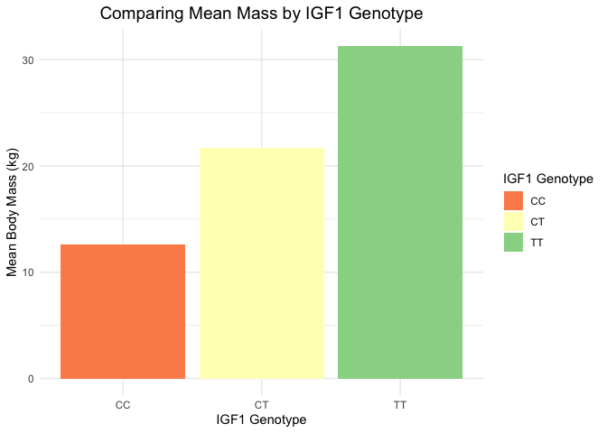

## Loading the Libraries


```r
library(tidyverse)
```

```
## ── Attaching core tidyverse packages ──────────────────────── tidyverse 2.0.0 ──
## ✔ dplyr     1.1.4     ✔ readr     2.1.4
## ✔ forcats   1.0.0     ✔ stringr   1.5.1
## ✔ ggplot2   3.4.4     ✔ tibble    3.2.1
## ✔ lubridate 1.9.3     ✔ tidyr     1.3.0
## ✔ purrr     1.0.2     
## ── Conflicts ────────────────────────────────────────── tidyverse_conflicts() ──
## ✖ dplyr::filter() masks stats::filter()
## ✖ dplyr::lag()    masks stats::lag()
## ℹ Use the conflicted package (<http://conflicted.r-lib.org/>) to force all conflicts to become errors
```

```r
library(janitor)
```

```
## 
## Attaching package: 'janitor'
## 
## The following objects are masked from 'package:stats':
## 
##     chisq.test, fisher.test
```

```r
library(naniar)
library(ggmap)
```

```
## ℹ Google's Terms of Service: <https://mapsplatform.google.com>
##   Stadia Maps' Terms of Service: <https://stadiamaps.com/terms-of-service/>
##   OpenStreetMap's Tile Usage Policy: <https://operations.osmfoundation.org/policies/tiles/>
## ℹ Please cite ggmap if you use it! Use `citation("ggmap")` for details.
```

```r
library(shiny)
library(shinydashboard)
```

```
## 
## Attaching package: 'shinydashboard'
## 
## The following object is masked from 'package:graphics':
## 
##     box
```

```r
library(RColorBrewer)
```

## Loading the Data Sets  


```r
dog <- read_csv(file = "../../data/clean_dog_data.csv")
```

```
## Rows: 1298 Columns: 25
## ── Column specification ────────────────────────────────────────────────────────
## Delimiter: ","
## chr (19): sample_id, breed, type, sex, bio_project, bio_sample, igf1_as_geno...
## dbl  (6): body_mass_kg, height_cm, coverage_all, coverage_x, longitude, lati...
## 
## ℹ Use `spec()` to retrieve the full column specification for this data.
## ℹ Specify the column types or set `show_col_types = FALSE` to quiet this message.
```


```r
dog_long <- read_csv(file = "../../data/dog_long.csv")
```

```
## Rows: 890 Columns: 18
## ── Column specification ────────────────────────────────────────────────────────
## Delimiter: ","
## chr (12): sample_id, breed, type, sex, bio_project, bio_sample, igf1_as_geno...
## dbl  (6): body_mass_kg, height_cm, coverage_all, coverage_x, longitude, lati...
## 
## ℹ Use `spec()` to retrieve the full column specification for this data.
## ℹ Specify the column types or set `show_col_types = FALSE` to quiet this message.
```


```r
dog_gwas <- read_csv("../../data/dog_gwas.csv")
```

```
## Rows: 250 Columns: 18
## ── Column specification ────────────────────────────────────────────────────────
## Delimiter: ","
## chr (12): sample_id, breed, type, sex, bio_project, bio_sample, igf1_as_geno...
## dbl  (6): body_mass_kg, height_cm, coverage_all, coverage_x, longitude, lati...
## 
## ℹ Use `spec()` to retrieve the full column specification for this data.
## ℹ Specify the column types or set `show_col_types = FALSE` to quiet this message.
```

## How many distinct breeds of dog are included within this data set?   


```r
n_distinct(dog$breed)
```

```
## [1] 269
```

## How many distinct data points are included (in terms of body weight and height) within this data set?   


```r
n_distinct(dog$body_mass_kg)
```

```
## [1] 142
```


```r
n_distinct(dog$height_cm)
```

```
## [1] 104
```

This could indicate some strange method or issue in the collection of data. However, since there is no information in the paper about the method of data collection for these variables, we are assuming that the data is correct.   

## Which breed of dog has the largest body mass?    


```r
dog %>% 
       group_by(breed) %>% 
        summarize(mean_body_weight = mean(body_mass_kg, na.rm = T)) %>% 
        filter(mean_body_weight != "NaN") %>% 
        arrange(desc(mean_body_weight))
```

```
## # A tibble: 207 × 2
##    breed                   mean_body_weight
##    <chr>                              <dbl>
##  1 CaucasianOvcharka                   75  
##  2 Boerboel                            73  
##  3 EnglishMastiff                      70.3
##  4 SaintBernard                        70.3
##  5 TibetanMastiff                      70.3
##  6 TosaInu                             68  
##  7 GreatDane                           62.4
##  8 GreaterSwissMountainDog             60  
##  9 NeapolitanMastiff                   60  
## 10 DogueDeBordeaux                     59.5
## # ℹ 197 more rows
```

## Which breed of dog has the largest height?    


```r
dog %>% 
       group_by(breed) %>% 
        summarize(mean_height = mean(height_cm, na.rm = T)) %>% 
        filter(mean_height != "NaN") %>% 
        arrange(desc(mean_height))
```

```
## # A tibble: 201 × 2
##    breed                mean_height
##    <chr>                      <dbl>
##  1 GreatDane                   78.7
##  2 IrishWolfhound              78.7
##  3 Akbash                      77.5
##  4 AnatolianShepherdDog        76  
##  5 ScottishDeerhound           74.9
##  6 Landseer                    73.5
##  7 EnglishMastiff              73  
##  8 Leonberger                  72.5
##  9 GreatPyrenees               71.8
## 10 Greyhound                   71.8
## # ℹ 191 more rows
```

## Which breed of dog has the smallest height?    


```r
dog %>% 
       group_by(breed) %>% 
        summarize(mean_height = mean(height_cm, na.rm = T)) %>% 
        filter(mean_height != "NaN") %>% 
        arrange(mean_height)
```

```
## # A tibble: 201 × 2
##    breed            mean_height
##    <chr>                  <dbl>
##  1 YorkshireTerrier        16.5
##  2 BrusselsGriffon         17.8
##  3 Chihuahua               19  
##  4 Pekingese               19  
##  5 Pomeranian              20  
##  6 Maltese                 22.5
##  7 BiewerTerrier           22.9
##  8 JapaneseChin            23.5
##  9 NorfolkTerrier          24  
## 10 Papillon                24  
## # ℹ 191 more rows
```

## How do the top 5 heaviest dogs compare by sex?       


```r
dog %>% 
        filter(sex != "NA") %>% 
        unite(breed_sex, "breed", "sex", sep = " ") %>% 
        filter(str_detect(.$breed_sex, "CaucasianOvcharka") | str_detect(.$breed_sex, "Boerboel") | str_detect(.$breed_sex, "EnglishMastiff") | str_detect(.$breed_sex, "SaintBernard") | str_detect(.$breed_sex, "TibetanMastiff")) %>% 
        group_by(breed_sex) %>% 
        summarize(mean_body_mass = mean(body_mass_kg, na.rm = T)) %>% 
        separate(breed_sex, into = c("breed", "sex"), sep = " ") %>% 
        ggplot(aes(x = breed, y = mean_body_mass, fill = sex)) +
        geom_col(position = "dodge") +
        scale_fill_brewer(palette = "Spectral") +
        theme_minimal() +
        labs(title = "Heaviest Dogs Compared by Sex",
             x = "Breed",
             y = "Mass (kg)",
             fill = "Sex") +
        theme(plot.title = element_text(size = rel(1.3), hjust = 0.5))
```

<!-- -->

It seems that this dataset has strange or incomplete measurements for mass, so it may be more worthwhile to focus on height!   

## How do the top 5 largest dogs compare by sex?       


```r
dog %>% 
        filter(sex != "NA") %>% 
        unite(breed_sex, "breed", "sex", sep = " ") %>% 
        filter(str_detect(.$breed_sex, "GreatDane") | str_detect(.$breed_sex, "IrishWolfhound") | str_detect(.$breed_sex, "Landseer") | str_detect(.$breed_sex, "EnglishMastiff") | str_detect(.$breed_sex, "ScottishDeerhound")) %>% 
        group_by(breed_sex) %>% 
        summarize(mean_body_mass = mean(body_mass_kg, na.rm = T)) %>% 
        separate(breed_sex, into = c("breed", "sex"), sep = " ") %>% 
        ggplot(aes(x = breed, y = mean_body_mass, fill = sex)) +
        geom_col(position = "dodge") +
        scale_fill_brewer(palette = "Spectral") +
        theme_minimal() +
        labs(title = "Largest Dogs Compared by Sex",
             x = "Breed",
             y = "Height (cm)",
             fill = "Sex") +
        theme(plot.title = element_text(size = rel(1.3), hjust = 0.5))
```

<!-- -->

This appears to show that there are also shows that there a lot of missing values in this dataset!   

## Removing NA's from Sex Variable for Future Analyses   


```r
dog <- dog %>% 
        filter(sex != "NA")
```

## Identifying Mean Body Mass and Mean Height by IGF1 Genotype  


```r
dog %>%
  group_by(igf1_as_genotype)%>%
  summarise(meanbodymass = mean(body_mass_kg, na.rm=T), meanheight=mean(height_cm, na.rm=T))
```

```
## # A tibble: 3 × 3
##   igf1_as_genotype meanbodymass meanheight
##   <chr>                   <dbl>      <dbl>
## 1 CC                       12.6       34.8
## 2 CT                       21.7       48.0
## 3 TT                       31.3       59.5
```


```r
dog %>%
  group_by(igf1_as_genotype) %>%
  summarise(meanbodymass = mean(body_mass_kg, na.rm=T)) %>%
  ggplot(aes(x = igf1_as_genotype, y = meanbodymass, fill = igf1_as_genotype)) +
  geom_col() +
  labs(title = "Comparing Mean Mass by IGF1 Genotype", 
       x = "IGF1 Genotype", 
       y= "Mean Body Mass (kg)",
       fill = "IGF1 Genotype")+
  theme(plot.title = element_text(size = rel(1.3), hjust = 0.5))
```

<!-- -->


```r
dog %>%
  group_by(igf1_as_genotype) %>%
  summarise(meanheight = mean(height_cm, na.rm=T)) %>%
  ggplot(aes(x = igf1_as_genotype, y = meanheight, fill = igf1_as_genotype))+
  geom_col() +
  scale_fill_brewer(palette = "Spectral") +
  theme_minimal() +
  labs(title = "Comparing Mean Height by IGF1 Genotype", 
       x = "IGF1 Genotype", 
       y = "Mean Height(cm)",
       fill = "IGF1 Genotype") +
  theme(plot.title = element_text(size = rel(1.3), hjust = 0.5))
```

<!-- -->

#### These results indicate a strong correlation between body size and the IGF1 genotype -  where dogs with CC are smaller on average than those with TT.   

## IGF1 for samples used in the GWAS    


```r
dog_gwas %>%
  group_by(igf1_as_genotype)%>%
  summarise(meanbodymass=mean(body_mass_kg, na.rm=T), meanheight=mean(height_cm, na.rm=T))
```

```
## # A tibble: 2 × 3
##   igf1_as_genotype meanbodymass meanheight
##   <chr>                   <dbl>      <dbl>
## 1 CC                       3.28       18.1
## 2 TT                      57.7        75.9
```


```r
dog_gwas %>%
  group_by(igf1_as_genotype) %>%
  summarise(meanbodymass = mean(body_mass_kg, na.rm=T)) %>%
  ggplot(aes(x = igf1_as_genotype, y = meanbodymass, fill = igf1_as_genotype)) +
  geom_col() +
  scale_fill_brewer(palette = "Spectral") +
  theme_minimal() +
  labs(title = "Mean Mass by IGF1 Genotype", 
       x = "IGF1 Genotype", 
       y= "Mean Body Mass (kg)",
       fill = "IGF1 Genotype") +
  theme(plot.title = element_text(size = rel(1.3), hjust = 0.5))
```

<!-- -->


```r
dog_gwas %>%
  group_by(igf1_as_genotype) %>%
  summarise(meanheight=mean(height_cm, na.rm=T)) %>%
  ggplot(aes(x = igf1_as_genotype, y = meanheight, fill = igf1_as_genotype)) +
  geom_col() +
  scale_fill_brewer(palette = "Spectral") +
  theme_minimal() +
  labs(title = "Mean Height by IGF1 Genotype", 
       x = "IGF1 Genotype", 
       y = "Mean Height(cm)",
       fill = "IGF1 Genotype")+
  theme(plot.title = element_text(size = rel(1.3), hjust = 0.5))
```

<!-- -->

## Comparing Top Tallest Dogs versus Top Smallest Dogs by Alleles in Locations that are Important in Determining Dog Body Size    

Test Visual:   


```r
dog_long %>%
        filter(breed == "GreatDane") %>% 
        ggplot(aes(x = chr_location, fill = marker_alleles_data)) +
        geom_bar() +
        scale_fill_brewer(palette = "Spectral") +
        theme_minimal() +
        labs(title = "Great Dane Comparing Alleles at 10 Positions Associated with Size",
             x = "Position",
             y = "Count",
             fill = "Marker") +
        theme(plot.title = element_text(size = rel(1.3), hjust = 0.5), axis.text.x = element_text(angle = 60, hjust = 1)) 
```

<!-- -->


```r
ui <- dashboardPage(
  dashboardHeader(title = "Dogs and Markers"),
  dashboardSidebar(disable=T),
  dashboardBody(
          
          fluidRow(
  box(title = "Plot Options", width = 3,
  radioButtons("x", "Select Height Category", choices = c("small", "large"), selected = "large"),
  ), #closes the first box
  box(title = "Dog Size and Markers", width = 8,
  plotOutput("plot", width = "500px", height = "400px")
  
  ) #closes the second box
  ) #closes the row
  ) #closes the dashboard body
) #closes the ui 

server <- function(input, output, session) {
        
        session$onSessionEnded(stopApp)
        
        output$plot <- renderPlot ({
          
        dog %>%
        mutate(height_category = case_when(height_cm <= 20.0 ~ "small",
                                           height_cm > 20.0 & height_cm < 73.0 ~ "medium",
                                           height_cm >= 73.0 ~ "large")) %>% 
        filter(height_category == "small" | height_category == "large") %>% 
        pivot_longer(cols = starts_with("chr15"),
                     names_to = "chr_location",
                     values_to = "marker_alleles_data") %>% 
        filter(height_category == input$x) %>% 
        ggplot(aes(x = chr_location, fill = marker_alleles_data)) +
        geom_bar() +
        facet_wrap(breed~.) +
        labs(title = "Dogs Compared by Alleles at 10 Positions",
             x = "Position",
             y = "Count",
             fill = "Marker") +
        theme(plot.title = element_text(size = rel(1.3), hjust = 0.5), axis.text.x = element_text(angle = 90, hjust = 1))
        
})
        
}

shinyApp(ui, server)
```

```{=html}
<div style="width: 100% ; height: 400px ; text-align: center; box-sizing: border-box; -moz-box-sizing: border-box; -webkit-box-sizing: border-box;" class="muted well">Shiny applications not supported in static R Markdown documents</div>
```

## Comparing Alleles in Small vs Large Dogs   

Test Visual:   


```r
dog_long %>%
        filter(chr_location == "chr15_41216098") %>% 
        ggplot(aes(x = height_category, fill = marker_alleles_data)) +
        geom_bar() +
        scale_fill_brewer(palette = "Spectral") +
        theme_minimal() +
        labs(title = "Largest vs Smallest Dogs",
             x = "Height Category",
             y = "Count",
             fill = "Marker") +
        theme(plot.title = element_text(size = rel(1.3), hjust = 0.5), axis.text.x = element_text(angle = 90, hjust = 1))
```

<!-- -->


```r
ui <- dashboardPage(
  dashboardHeader(title = "Dogs and Markers"),
  dashboardSidebar(disable=T),
  dashboardBody(
          
          fluidRow(
  box(title = "Plot Options", width = 3,
  selectInput("x", "Select Chromosome Position", choices = unique(dog_long$chr_location), hr()),
  ), #closes the first box
  box(title = "Dog Size and Markers", width = 8,
  plotOutput("plot", width = "500px", height = "400px")
  
  ) #closes the second box
  ) #closes the row
  ) #closes the dashboard body
) #closes the ui 

server <- function(input, output, session) {
        
        session$onSessionEnded(stopApp)
        
        output$plot <- renderPlot ({
          
        dog_long %>%
        filter(chr_location == input$x) %>% 
        ggplot(aes(x = height_category, fill = marker_alleles_data)) +
        geom_bar() +
        labs(title = "Largest vs Smallest Dogs",
             x = "Height Category",
             y = "Count",
             fill = "Marker") +
        theme(plot.title = element_text(size = rel(1.3), hjust = 0.5), axis.text.x = element_text(angle = 90, hjust = 1))
        
})
        
}

shinyApp(ui, server)
```

```{=html}
<div style="width: 100% ; height: 400px ; text-align: center; box-sizing: border-box; -moz-box-sizing: border-box; -webkit-box-sizing: border-box;" class="muted well">Shiny applications not supported in static R Markdown documents</div>
```

#### These results show a clear association between the alleles at these positions and the size of the dogs.  

## Repeating the above for the dogs actually used in the GWAS, which results in much cleaner data    


```r
ui <- dashboardPage(
  dashboardHeader(title = "GWAS Dogs and Markers"),
  dashboardSidebar(disable=T),
  dashboardBody(
          
          fluidRow(
  box(title = "Plot Options", width = 3,
  radioButtons("x", "Select Height Category", choices = c("small", "large"), selected = "large"),
  ), #closes the first box
  box(title = "Dog Size and Markers", width = 8,
  plotOutput("plot", width = "500px", height = "400px")
  
  ) #closes the second box
  ) #closes the row
  ) #closes the dashboard body
) #closes the ui 

server <- function(input, output, session) {
        
        session$onSessionEnded(stopApp)
        
        output$plot <- renderPlot ({
          
        dog_gwas %>%
        mutate(height_category = case_when(height_cm <= 20.0 ~ "small",
                                           height_cm > 20.0 & height_cm < 73.0 ~ "medium",
                                           height_cm >= 73.0 ~ "large")) %>% 
        filter(height_category == "small" | height_category == "large") %>% 
        filter(height_category == input$x) %>% 
        ggplot(aes(x = chr_location, fill = marker_alleles_data)) +
        geom_bar() +
        facet_wrap(breed~.) +
        scale_fill_brewer(palette = "Spectral") +
        theme_minimal() +
        labs(title = "Dogs Compared by Alleles at 10 Positions",
             x = "Position",
             y = "Count",
             fill = "Marker") +
        theme(plot.title = element_text(size = rel(1.3), hjust = 0.5), axis.text.x = element_text(angle = 90, hjust = 1))
        
})
        
}

shinyApp(ui, server)
```

```{=html}
<div style="width: 100% ; height: 400px ; text-align: center; box-sizing: border-box; -moz-box-sizing: border-box; -webkit-box-sizing: border-box;" class="muted well">Shiny applications not supported in static R Markdown documents</div>
```


```r
ui <- dashboardPage(
  dashboardHeader(title = "Dogs and Markers"),
  dashboardSidebar(disable=T),
  dashboardBody(
          
          fluidRow(
  box(title = "Plot Options", width = 3,
  selectInput("x", "Select Chromosome Position", choices = unique(dog_gwas$chr_location), hr()),
  ), #closes the first box
  box(title = "Dog Size and Markers", width = 8,
  plotOutput("plot", width = "500px", height = "400px")
  
  ) #closes the second box
  ) #closes the row
  ) #closes the dashboard body
) #closes the ui 

server <- function(input, output, session) {
        
        session$onSessionEnded(stopApp)
        
        output$plot <- renderPlot ({
          
        dog_gwas %>%
        filter(chr_location == input$x) %>% 
        ggplot(aes(x = height_category, fill = marker_alleles_data)) +
        geom_bar() +
        scale_fill_brewer(palette = "Spectral") +
        theme_minimal() +
        labs(title = "Largest vs Smallest Dogs",
             x = "Height Category",
             y = "Count",
             fill = "Marker") +
        theme(plot.title = element_text(size = rel(1.3), hjust = 0.5), axis.text.x = element_text(angle = 90, hjust = 1))
        
})
        
}

shinyApp(ui, server)
```

```{=html}
<div style="width: 100% ; height: 400px ; text-align: center; box-sizing: border-box; -moz-box-sizing: border-box; -webkit-box-sizing: border-box;" class="muted well">Shiny applications not supported in static R Markdown documents</div>
```
